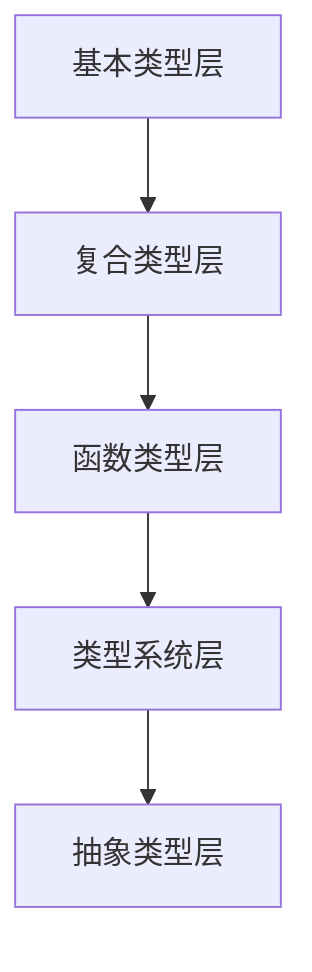

                 

### 大规模分布式系统设计背景与挑战

#### 1.1 大规模分布式系统的发展历程

大规模分布式系统起源于互联网的兴起。随着Web 1.0时代的发展，越来越多的企业开始利用互联网进行业务拓展，这导致了数据量和用户访问量的激增。传统的单机系统和中央化架构难以应对这种爆发式增长，因此分布式计算和分布式存储的概念应运而生。

最早期的分布式系统可以追溯到20世纪60年代的“阿帕网”（ARPANET），这是美国国防高级研究计划局（DARPA）资助的一个项目，用于连接不同地点的计算机系统。此后，随着计算机技术和网络技术的发展，分布式系统的架构逐渐完善，从早期的基于消息传递的简单分布式系统，发展到如今基于服务化架构、微服务架构和容器化架构的复杂分布式系统。

进入21世纪，随着云计算、大数据和人工智能技术的快速发展，大规模分布式系统的重要性更加凸显。企业不仅需要处理海量数据，还需要实现高效、可靠和可扩展的系统架构。这种需求推动了一系列分布式系统技术的进步，如分布式数据库、分布式计算框架、分布式存储系统等。

#### 1.2 大规模分布式系统设计的挑战

尽管分布式系统具有高扩展性、高可用性和高容错性等优点，但其设计过程中也面临着诸多挑战：

1. **数据一致性**：在分布式系统中，多个节点可能同时访问和修改数据，如何保证数据的一致性成为一个重要问题。常见的挑战包括数据冲突、数据丢失和数据不一致等。

2. **分布式计算效率**：分布式计算涉及到多个节点的协同工作，如何高效地调度和利用这些节点资源，提升计算效率是一个关键挑战。

3. **系统可靠性**：分布式系统中的节点可能会因为各种原因（如网络故障、硬件故障等）出现故障，如何保证系统的可靠性，防止单点故障是分布式系统设计中的重要挑战。

4. **容错性**：在分布式系统中，节点故障是不可避免的。如何设计一个具有良好容错性的系统，确保系统能够在节点故障时继续正常运行，是一个重要挑战。

5. **分布式事务管理**：在分布式系统中，事务的分布式管理变得更加复杂。如何实现分布式事务的原子性、一致性、隔离性和持久性（ACID特性），是一个重要挑战。

6. **系统性能优化**：如何通过优化分布式系统的架构、网络通信、数据存储等方式，提升系统的整体性能，是一个持续关注的问题。

#### 1.3 类型系统在分布式系统设计中的应用

类型系统作为编程语言和软件架构中的重要概念，其在分布式系统设计中的应用具有重要意义。类型系统在分布式系统设计中的应用主要体现在以下几个方面：

1. **数据类型管理**：类型系统能够帮助开发者更好地管理和处理分布式系统中的数据类型，确保数据在传输和处理过程中的正确性。

2. **类型安全性**：类型系统提供了类型安全检查机制，可以防止类型错误的发生，提高系统的稳定性和可靠性。

3. **分布式编程模型**：类型系统可以为分布式编程模型提供基础支持，如函数式编程中的类型系统可以为分布式计算提供高效的数据处理方式。

4. **分布式数据管理**：类型系统在分布式数据管理中发挥着重要作用，如分布式数据库中的类型系统可以帮助优化数据存储和查询性能。

5. **分布式事务管理**：类型系统在分布式事务管理中可以提供类型安全的事务管理机制，确保事务的原子性和一致性。

通过上述分析，我们可以看出类型系统在大规模分布式系统设计中的应用具有重要意义。接下来，我们将进一步探讨类型系统的基本概念和原理，为后续章节的内容奠定基础。

### 类型系统的基本概念

类型系统（Type System）是编程语言和软件架构中一个核心概念，用于定义和区分不同类型的数据，以提供一种机制来保证程序的正确性和安全性。在分布式系统设计中，类型系统的作用尤为重要，因为它能够帮助开发者更好地管理数据类型，提高系统的稳定性和可靠性。在本节中，我们将详细探讨类型系统的基本概念，包括类型的定义与分类。

#### 2.1 类型的定义

类型（Type）是编程语言中用于描述数据的一种方式。它定义了一组具有相似属性和操作的对象集合。在编程语言中，类型通常分为基本类型和复合类型。

1. **基本类型**：基本类型是编程语言内部定义的简单数据类型，如整数（Integer）、浮点数（Float）、布尔值（Boolean）等。这些基本类型提供了对基本数据值的直接操作。

2. **复合类型**：复合类型是由基本类型组合而成的复杂数据类型，如数组（Array）、结构体（Structure）、类（Class）等。复合类型通常包含多个成员变量和成员函数，用于表示复杂的现实世界对象。

#### 2.2 类型的分类

根据类型系统的设计方式和应用场景，类型可以分为以下几种：

1. **静态类型**：静态类型在编译时就能确定变量的类型，如C、Java等编程语言。静态类型系统提供了类型安全检查，可以在编译阶段发现类型错误，从而减少运行时错误。

2. **动态类型**：动态类型在运行时确定变量的类型，如Python、JavaScript等编程语言。动态类型系统具有灵活性，但在运行时可能会出现类型错误。

3. **强类型**：强类型系统要求变量在使用前必须明确其类型，并且不允许隐式类型转换，如Java、C++等编程语言。强类型系统提供了更好的类型安全性和程序可读性。

4. **弱类型**：弱类型系统对变量类型的要求较为宽松，允许隐式类型转换，如C语言。弱类型系统在处理某些复杂场景时可能会带来性能优势，但同时也增加了程序出错的风险。

5. **类型安全**：类型安全是指类型系统能够确保程序在运行时不会因为类型错误而导致崩溃或数据损坏。类型安全系统通常提供严格的类型检查，从而提高程序的稳定性和可靠性。

6. **类型检查**：类型检查是类型系统的一个重要组成部分，它包括编译时检查和运行时检查。编译时检查在编译阶段进行，可以提前发现类型错误；运行时检查在程序运行时进行，用于检测类型错误并给出错误提示。

#### 2.3 面向对象类型系统

面向对象编程是一种常见的编程范式，其类型系统也具有独特的特点。面向对象类型系统主要包括以下方面：

1. **类（Class）**：类是面向对象编程中的核心概念，用于定义对象的属性和行为。类可以看作是一种复合类型，包含多个成员变量和成员函数。

2. **对象（Object）**：对象是类的实例，它代表了现实世界中的具体实体。对象通过调用类的成员函数来执行特定的操作。

3. **继承（Inheritance）**：继承是面向对象编程中的一种重要机制，允许一个类继承另一个类的属性和方法。通过继承，可以复用代码，降低冗余。

4. **多态（Polymorphism）**：多态是指同一个操作作用于不同的对象时可以有不同的解释和行为。多态通过函数重载、接口和抽象类等机制实现。

5. **封装（Encapsulation）**：封装是面向对象编程中的一个重要原则，用于隐藏对象的内部细节，只暴露必要的接口供外部使用。封装可以提高程序的可维护性和安全性。

面向对象类型系统为分布式系统设计提供了强大的支持，使得开发者可以更方便地构建复杂、模块化的分布式系统。

#### 2.4 函数式类型系统

函数式编程是一种以函数为中心的编程范式，其类型系统具有独特的特点。函数式类型系统主要包括以下方面：

1. **函数类型（Function Type）**：函数类型是函数式编程中的核心概念，表示一个函数的输入类型和输出类型。函数类型可以看作是一种复合类型。

2. **纯函数（Pure Function）**：纯函数是一种不依赖于外部状态的函数，其输出仅取决于输入。纯函数具有可缓存性、可并行性和无副作用等特点，适用于分布式计算。

3. **类型推导（Type Inference）**：类型推导是函数式类型系统的一个重要机制，它允许编译器自动推导出函数的类型，从而提高代码的可读性和灵活性。

4. **类型检查（Type Checking）**：类型检查是函数式类型系统的另一个重要机制，它用于检查函数的定义和调用是否满足类型约束，确保程序的正确性。

函数式类型系统在分布式编程中具有广泛的应用，其纯函数和无副作用的特点使得分布式系统更易于理解和维护。

#### 2.5 基于类型的内存管理

基于类型的内存管理是一种通过类型系统来管理内存的机制。它主要包括以下方面：

1. **类型安全内存分配**：类型安全内存分配通过类型系统确保内存分配的正确性，避免内存泄露和越界访问等问题。

2. **垃圾回收（Garbage Collection）**：垃圾回收是一种自动内存管理机制，通过识别和回收不再使用的内存，减轻开发者的负担。

3. **内存池（Memory Pool）**：内存池是一种预分配内存块的技术，用于优化内存分配和释放的性能。

4. **类型检查与内存安全**：类型检查可以确保内存访问的正确性，避免类型错误引发的内存泄漏和崩溃。

基于类型的内存管理在分布式系统设计中具有重要意义，它能够提高系统的性能和稳定性。

通过上述对类型系统的基本概念和分类的探讨，我们可以看到类型系统在编程语言和分布式系统设计中的应用具有重要意义。类型系统不仅提供了数据类型的定义和管理机制，还提高了程序的正确性和安全性。在接下来的章节中，我们将进一步探讨类型系统的核心原理和其在分布式系统设计中的应用。

### 类型系统的核心原理

类型系统作为编程语言和软件架构中的重要概念，其核心原理对于确保程序的正确性和性能至关重要。在本节中，我们将详细讨论类型系统的核心原理，包括类型推导与类型检查、类型系统的层次结构以及类型系统的优化策略。

#### 3.1 类型推导与类型检查

类型推导（Type Inference）和类型检查（Type Checking）是类型系统的两个核心机制，它们共同确保程序在运行时能够正确执行。

**类型推导**是一种自动确定变量类型的方法。在编译时，编译器根据程序的上下文和语法规则，自动推导出变量的类型。类型推导具有以下优势：

1. **提高可读性**：通过自动推导类型，代码变得更加简洁，降低了人工编写类型声明的工作量。
2. **增强灵活性**：类型推导允许函数和变量具有更广泛的类型兼容性，提高了程序的灵活性。
3. **减少错误**：自动推导类型可以减少由于类型声明错误导致的问题。

常见的类型推导方法包括：

1. **简单类型推导**：编译器根据变量的初始化值推导出其类型。
2. **上下文类型推导**：编译器根据程序中的上下文信息推导出变量的类型。
3. **通用类型推导**：编译器使用通用算法（如通用的类型推导算法（GTD））来推导变量类型。

**类型检查**是在编译时或运行时对程序中的类型进行验证的过程。类型检查的主要目的是确保程序在运行时不会因为类型错误而导致崩溃或数据损坏。

类型检查通常分为以下几类：

1. **静态类型检查**：在编译时对程序进行类型检查，如Java、C++等编程语言。静态类型检查可以提前发现类型错误，减少运行时错误。
2. **动态类型检查**：在运行时对程序进行类型检查，如Python、JavaScript等编程语言。动态类型检查在运行时提供类型安全，但可能会影响性能。
3. **混合类型检查**：在编译时和运行时都进行类型检查，如TypeScript编程语言。混合类型检查结合了静态类型检查和动态类型检查的优点。

类型推导和类型检查在分布式系统设计中的应用如下：

1. **分布式编程**：通过类型推导和类型检查，可以确保分布式系统中不同节点之间的数据传输和函数调用是类型安全的，避免因类型错误导致的数据不一致和系统崩溃。
2. **分布式数据管理**：类型检查可以帮助确保分布式数据库中数据的类型一致性和完整性，提高数据管理的可靠性和性能。

**类型推导与类型检查的伪代码**：

```python
# 类型推导示例
def add(a: int, b: int) -> int:
    return a + b

result: int = add(5, 10)  # 自动推导出result的类型为int

# 类型检查示例
def is_even(number: int) -> bool:
    return number % 2 == 0

print(is_even(4))  # 输出True
print(is_even("hello"))  # 抛出类型错误异常
```

#### 3.2 类型系统的层次结构

类型系统通常具有多个层次，每个层次负责不同的类型管理和操作。类型系统的层次结构可以分为以下几层：

1. **基本类型层**：包括整数、浮点数、布尔值等基本数据类型。基本类型层提供了对基本数据值的直接操作。
2. **复合类型层**：包括数组、结构体、类等复合数据类型。复合类型层提供了对复杂数据结构的定义和管理。
3. **函数类型层**：包括函数、方法等函数类型。函数类型层提供了对函数的定义和调用的支持。
4. **类型系统层**：包括类型推导、类型检查、类型转换等类型系统机制。类型系统层提供了类型管理的核心功能。
5. **抽象类型层**：包括抽象类、接口等抽象类型。抽象类型层提供了对抽象概念的建模和实现。

类型系统的层次结构在分布式系统设计中的应用如下：

1. **分布式编程**：通过不同层次类型系统的支持，可以构建复杂的分布式编程模型，如函数式编程模型、面向对象编程模型等。
2. **分布式数据管理**：通过不同层次类型系统的支持，可以确保分布式数据库中数据的类型一致性和完整性。
3. **分布式事务管理**：通过类型系统的支持，可以确保分布式事务中的数据操作是类型安全的，保证事务的原子性和一致性。

**类型系统层次结构的Mermaid流程图**：



#### 3.3 类型系统的优化策略

类型系统在分布式系统设计中不仅需要保证类型安全，还需要优化系统的性能。以下是一些常见的类型系统优化策略：

1. **类型推导优化**：通过优化类型推导算法，可以提高类型推导的效率，减少编译时间。
2. **类型检查优化**：通过优化类型检查算法，可以提高类型检查的效率，减少运行时开销。
3. **类型缓存**：通过缓存类型信息，可以减少重复的类型推导和类型检查，提高系统性能。
4. **类型转换优化**：通过优化类型转换操作，可以减少类型转换的开销，提高系统性能。
5. **分布式类型系统优化**：针对分布式系统的特点，可以设计分布式类型系统优化策略，如分布式类型检查、分布式类型推导等。

**类型系统优化策略的伪代码**：

```python
# 类型推导优化示例
def optimized_add(a: int, b: int) -> int:
    result = a + b
    cache_result(result)  # 将推导出的结果缓存起来
    return result

# 类型检查优化示例
def optimized_is_even(number: int) -> bool:
    cached_result = cache_check(number)  # 检查是否存在缓存的结果
    if cached_result is not None:
        return cached_result
    else:
        result = number % 2 == 0
        cache_result(result)  # 将结果缓存起来
        return result
```

通过上述对类型系统的核心原理的探讨，我们可以看到类型系统在分布式系统设计中的重要性。类型系统不仅提供了数据类型的定义和管理机制，还提高了程序的正确性和性能。在接下来的章节中，我们将进一步探讨类型系统在分布式编程中的应用，为开发者提供实际的操作指南。

### 类型系统在分布式编程中的应用

分布式编程是分布式系统设计中的重要组成部分，它涉及到多个节点之间的协同工作。类型系统在分布式编程中的应用至关重要，它不仅提供了数据类型的定义和管理机制，还确保了分布式编程中的数据一致性和安全性。本节将详细探讨类型系统在分布式编程中的应用，包括分布式编程模型、类型系统在分布式编程中的挑战以及相应的解决方案。

#### 4.1 分布式编程模型

分布式编程模型是指在分布式系统中，如何有效地组织和管理多个节点之间的协作和通信。常见的分布式编程模型包括：

1. **进程间通信（IPC）模型**：IPC模型通过消息传递机制实现节点之间的通信，如UNIX域套接字、共享内存等。IPC模型具有低延迟和高带宽的特点，适用于需要高实时性的分布式应用。

2. **客户端-服务器模型**：客户端-服务器模型是一种典型的分布式计算模型，其中客户端发送请求，服务器接收并处理请求。这种模型具有良好的扩展性和可维护性，适用于大多数分布式应用。

3. **分布式计算框架**：分布式计算框架如MapReduce、Spark等，提供了高性能的分布式数据处理能力。这些框架通常基于分布式编程模型，提供了一套完整的分布式编程接口和优化策略。

4. **微服务架构**：微服务架构将应用划分为多个独立的服务模块，每个服务模块运行在独立的节点上。微服务架构通过API网关实现服务之间的通信，具有高可扩展性和高容错性。

#### 4.2 类型系统在分布式编程中的挑战

在分布式编程中，类型系统面临以下挑战：

1. **数据一致性**：在分布式系统中，多个节点可能同时访问和修改数据。类型系统需要确保数据在各个节点之间的一致性，以避免数据冲突和错误。

2. **类型安全**：类型系统需要确保分布式编程中的数据类型在传输和操作过程中保持一致性，防止类型错误引发系统崩溃或数据损坏。

3. **分布式事务管理**：分布式事务管理涉及到多个节点之间的协调和一致性保证。类型系统需要支持分布式事务，确保事务的原子性、一致性和隔离性。

4. **分布式编程接口设计**：类型系统需要提供高效、易用的分布式编程接口，以简化开发者的工作，提高分布式编程的便利性。

5. **网络通信效率**：类型系统在分布式编程中还需要考虑网络通信的效率，避免因类型转换和通信开销导致系统性能下降。

#### 4.3 类型系统在分布式编程中的解决方案

为了应对上述挑战，类型系统在分布式编程中采取了以下解决方案：

1. **强类型系统**：采用强类型系统可以提高程序的稳定性，减少类型错误的发生。强类型系统通常要求在编写程序时明确声明变量和函数的类型，并在编译时进行类型检查。

2. **类型推导与类型检查**：通过类型推导和类型检查，可以确保数据在传输和操作过程中的类型一致性。类型推导可以简化编写代码的工作量，类型检查可以提前发现类型错误，提高程序的可靠性。

3. **分布式事务管理**：类型系统需要支持分布式事务管理，确保事务的原子性、一致性和隔离性。常见的分布式事务管理机制包括两阶段提交（2PC）、多版本并发控制（MVCC）等。

4. **分布式编程接口设计**：类型系统需要提供高效、易用的分布式编程接口，如函数式编程接口、异步编程接口等。这些接口可以简化分布式编程的复杂性，提高开发效率。

5. **类型安全协议**：在分布式系统中，采用类型安全协议可以确保数据在传输过程中的安全性。常见的类型安全协议包括类型标记（Type Tagging）、类型检查（Type Checking）等。

6. **网络通信优化**：类型系统需要考虑网络通信的效率，避免因类型转换和通信开销导致系统性能下降。常见的优化策略包括序列化优化、二进制协议等。

**类型系统在分布式编程中的应用示例**：

```python
# 使用Python的分布式编程库PySpark进行分布式编程
from pyspark import SparkContext

# 创建SparkContext
sc = SparkContext("local", "word_count")

# 读取文本文件
text_rdd = sc.textFile("hdfs://path/to/text_file.txt")

# 对文本进行分词
words_rdd = text_rdd.flatMap(lambda line: line.split())

# 统计单词出现的次数
word_counts_rdd = words_rdd.map(lambda word: (word, 1)).reduceByKey(lambda a, b: a + b)

# 输出结果
word_counts_rdd.collect()

# 关闭SparkContext
sc.stop()
```

通过上述示例，我们可以看到类型系统在分布式编程中的应用，包括数据的一致性管理、分布式事务管理以及高效的分布式编程接口设计。

综上所述，类型系统在分布式编程中发挥着关键作用，它不仅确保了数据的类型安全性，还提高了分布式编程的可靠性和性能。在接下来的章节中，我们将进一步探讨类型系统在分布式数据管理中的应用。

### 类型系统在分布式数据管理中的应用

在分布式数据管理中，类型系统的作用尤为重要，它不仅保证了数据的一致性和安全性，还优化了数据存储和查询性能。本节将详细探讨类型系统在分布式数据管理中的应用，包括分布式数据管理挑战、类型系统在分布式数据管理中的作用以及类型系统优化的策略。

#### 5.1 分布式数据管理挑战

分布式数据管理面临以下挑战：

1. **数据一致性和分布性**：在分布式数据库中，数据可能存储在多个节点上。如何确保数据在不同节点之间的一致性和分布性是一个重要挑战。

2. **数据分区和负载均衡**：分布式数据库需要将数据合理地分区和分布到不同节点上，以实现负载均衡和高可用性。

3. **分布式事务管理**：在分布式数据库中，事务的执行需要跨越多个节点。如何实现分布式事务的原子性、一致性、隔离性和持久性（ACID特性）是一个重要挑战。

4. **数据备份和恢复**：如何保证分布式数据库的可靠性，实现数据的有效备份和快速恢复是一个关键问题。

5. **网络延迟和通信开销**：在分布式系统中，节点之间的通信可能会受到网络延迟和通信开销的影响。如何优化数据传输和查询性能是一个重要挑战。

6. **数据压缩和存储优化**：如何通过数据压缩和存储优化策略，减少数据存储空间和I/O开销，提升系统性能。

#### 5.2 类型系统在分布式数据管理中的作用

类型系统在分布式数据管理中发挥着以下作用：

1. **数据类型定义和验证**：类型系统提供了数据类型的定义和验证机制，确保数据在存储和传输过程中保持一致性。通过类型系统，可以防止非法数据的插入和操作。

2. **数据类型兼容性**：类型系统支持不同数据类型之间的兼容性，使得不同类型的分布式组件能够相互通信和操作。

3. **数据分区策略**：类型系统可以帮助设计有效的数据分区策略，根据数据类型和访问模式将数据分布到不同节点上，实现负载均衡和查询优化。

4. **分布式事务管理**：类型系统支持分布式事务管理，通过类型安全的事务管理机制，确保事务的原子性、一致性、隔离性和持久性。

5. **数据压缩和存储优化**：类型系统提供了数据压缩和存储优化策略，通过优化数据存储格式和结构，减少存储空间和I/O开销，提升系统性能。

#### 5.3 分布式数据管理的类型系统优化策略

为了应对分布式数据管理的挑战，类型系统可以采取以下优化策略：

1. **类型安全协议**：采用类型安全协议，确保数据在传输和存储过程中的安全性。常见的类型安全协议包括类型标记（Type Tagging）和类型检查（Type Checking）。

2. **静态类型系统**：采用静态类型系统，在编译时进行类型检查，提前发现类型错误，减少运行时错误。静态类型系统可以提供更好的性能和可靠性。

3. **动态类型系统**：结合动态类型系统的灵活性，允许在运行时进行类型推导和类型检查，提高系统的灵活性和可维护性。

4. **类型推导优化**：通过优化类型推导算法，减少编译时间和类型推导开销。常见的优化策略包括通用类型推导算法（GTD）和上下文类型推导。

5. **类型检查优化**：通过优化类型检查算法，提高类型检查的效率，减少运行时开销。常见的优化策略包括分布式类型检查和并行类型检查。

6. **分布式事务优化**：通过优化分布式事务管理机制，提高事务的性能和可靠性。常见的优化策略包括两阶段提交（2PC）、多版本并发控制（MVCC）和分布式锁。

7. **数据压缩和存储优化**：采用数据压缩和存储优化策略，减少数据存储空间和I/O开销。常见的优化策略包括格式化存储、索引优化和列式存储。

**分布式数据管理中的类型系统优化策略示例**：

```sql
-- 使用SQL进行数据分区和压缩优化
CREATE TABLE sales (
    id INT,
    date DATE,
    amount DECIMAL(10, 2)
) PARTITIONED BY (region STRING) STORED AS ORC TBLPROPERTIES ("orc.compress"="SNAPPY");
```

通过上述示例，我们可以看到如何使用类型系统进行数据分区和压缩优化，提高分布式数据管理的性能和可靠性。

综上所述，类型系统在分布式数据管理中发挥着重要作用，通过类型定义和验证、类型兼容性、数据分区策略、分布式事务管理以及数据压缩和存储优化策略，可以有效地解决分布式数据管理中的挑战，提升系统性能和可靠性。在接下来的章节中，我们将探讨类型系统在分布式事务管理中的应用。

### 类型系统在分布式事务管理中的应用

分布式事务管理是分布式系统设计中的一个关键问题，涉及到多个节点之间的数据操作和一致性保证。类型系统在分布式事务管理中发挥着重要作用，通过提供类型安全的事务管理机制，确保事务的原子性、一致性、隔离性和持久性（ACID特性）。本节将详细探讨类型系统在分布式事务管理中的应用，包括分布式事务管理挑战、类型系统在分布式事务管理中的作用以及类型系统优化的策略。

#### 6.1 分布式事务管理挑战

分布式事务管理面临以下挑战：

1. **数据一致性**：在分布式系统中，多个节点可能同时访问和修改同一数据。如何确保事务在多个节点之间的一致性，避免数据冲突和错误是一个重要挑战。

2. **分布式事务协调**：分布式事务通常涉及多个节点，如何协调这些节点之间的操作，确保事务的原子性是一个重要挑战。

3. **性能和可扩展性**：分布式事务管理需要处理大量的并发操作，如何保证系统的高性能和可扩展性是一个重要问题。

4. **分布式事务隔离**：如何实现分布式事务的隔离，避免并发操作之间的相互干扰是一个关键问题。

5. **分布式事务恢复**：在分布式系统中，节点可能会发生故障，如何实现分布式事务的恢复，确保系统的高可用性是一个重要挑战。

6. **分布式事务延迟**：由于网络延迟和节点之间的通信开销，分布式事务可能会受到延迟的影响，如何优化事务延迟是一个重要问题。

#### 6.2 类型系统在分布式事务管理中的作用

类型系统在分布式事务管理中发挥着以下作用：

1. **类型安全检查**：类型系统提供了类型安全检查机制，确保事务中的数据操作是类型安全的。通过类型检查，可以提前发现类型错误，避免运行时错误。

2. **分布式事务定义**：类型系统支持分布式事务的定义和声明，使得开发者可以方便地定义分布式事务的边界和操作。

3. **分布式事务协调**：类型系统支持分布式事务的协调和执行，通过分布式事务协调器（Coordinator）确保事务的原子性。类型系统可以帮助协调器跟踪事务的状态和操作，实现分布式事务的协调。

4. **分布式事务隔离**：类型系统提供了隔离机制，如锁（Lock）、版本控制（Version Control）等，确保事务的隔离性。通过类型系统的支持，可以有效地避免并发操作之间的相互干扰。

5. **分布式事务恢复**：类型系统支持分布式事务的恢复机制，通过日志记录和状态跟踪，确保事务在节点故障时能够正确恢复。

6. **性能优化**：类型系统提供了类型推导和类型检查优化机制，通过减少类型转换和通信开销，提高事务的性能。

#### 6.3 分布式事务管理的类型系统优化策略

为了应对分布式事务管理的挑战，类型系统可以采取以下优化策略：

1. **类型安全协议**：采用类型安全协议，如类型标记（Type Tagging）和类型检查（Type Checking），确保事务中的数据操作是类型安全的，减少运行时错误。

2. **静态类型系统**：采用静态类型系统，在编译时进行类型检查，提前发现类型错误，提高程序的可靠性。静态类型系统可以提供更好的性能和类型安全。

3. **动态类型系统**：结合动态类型系统的灵活性，允许在运行时进行类型推导和类型检查，提高系统的可维护性和灵活性。

4. **类型推导优化**：通过优化类型推导算法，减少编译时间和类型推导开销。常见的优化策略包括通用类型推导算法（GTD）和上下文类型推导。

5. **类型检查优化**：通过优化类型检查算法，提高类型检查的效率，减少运行时开销。常见的优化策略包括分布式类型检查和并行类型检查。

6. **分布式事务优化**：通过优化分布式事务管理机制，提高事务的性能和可靠性。常见的优化策略包括两阶段提交（2PC）、多版本并发控制（MVCC）和分布式锁。

7. **事务分割和负载均衡**：通过分割事务和负载均衡策略，将事务合理地分配到不同节点上，提高系统的性能和可扩展性。

**分布式事务管理中的类型系统优化策略示例**：

```python
# 使用Python的分布式事务管理库DistributeDB进行事务管理
from distributed import distribute_db

# 创建DistributeDB连接
conn = distribute_db.connect("localhost:3306")

# 开始事务
with conn.transaction() as tx:
    # 执行分布式事务操作
    tx.execute("UPDATE sales SET amount = amount * 1.1 WHERE region = 'US'")
    tx.execute("UPDATE sales SET amount = amount * 1.05 WHERE region = 'EU'")
    
    # 提交事务
    tx.commit()
```

通过上述示例，我们可以看到如何使用类型系统进行分布式事务管理，包括事务的定义、执行和提交。

综上所述，类型系统在分布式事务管理中发挥着关键作用，通过类型安全检查、事务协调、隔离性和恢复机制，以及优化策略，可以有效地解决分布式事务管理的挑战，提高系统的性能和可靠性。在接下来的章节中，我们将探讨分布式计算框架的类型系统设计。

### 分布式计算框架的类型系统设计

分布式计算框架在处理大规模数据集和复杂计算任务中发挥了至关重要的作用。这些框架通常提供了一系列抽象接口和优化策略，以简化分布式编程和提高系统性能。在本节中，我们将以Spark为例，探讨分布式计算框架的类型系统设计，包括框架概述、类型系统在分布式计算框架中的应用以及类型系统的优化策略。

#### 7.1 分布式计算框架概述

分布式计算框架是一种用于处理大规模数据集的软件框架，通过将任务分布在多个节点上进行并行处理，以提高计算效率和性能。以下是一些常见的分布式计算框架：

1. **MapReduce**：由Google提出，是最早的分布式计算框架之一。它通过“Map”和“Reduce”两个阶段对大规模数据集进行并行处理。

2. **Spark**：由Apache Software Foundation维护，是一个基于内存计算的分布式计算框架，提供了丰富的API和优化策略。

3. **Flink**：由Apache Foundation维护，是一个基于流处理的分布式计算框架，适用于实时数据处理。

4. **Hadoop**：由Apache Foundation维护，是一个分布式数据处理框架，包括HDFS（分布式文件系统）和MapReduce（分布式计算模型）。

在本节中，我们将以Spark为例，探讨其类型系统设计。

#### 7.2 类型系统在分布式计算框架中的应用

类型系统在分布式计算框架中扮演着重要角色，它确保了数据在处理过程中的正确性和安全性。以下是类型系统在Spark中的主要应用：

1. **强类型数据结构**：Spark提供了强类型的分布式数据结构，如RDD（弹性分布式数据集）和DataFrame。这些数据结构在编译时进行类型检查，确保数据类型的正确性。

2. **类型推导**：Spark提供了类型推导机制，通过上下文信息自动推导数据类型，简化了开发者编写代码的工作量。

3. **类型安全**：Spark通过类型安全检查机制，确保数据在处理过程中的类型一致性，避免类型错误引发系统崩溃或数据损坏。

4. **分布式事务**：Spark支持分布式事务，通过类型系统提供的事务管理机制，确保事务的原子性、一致性、隔离性和持久性。

5. **类型优化**：Spark通过类型优化策略，如延迟类型转换和内存管理，提高系统的性能和效率。

#### 7.3 类型系统在Spark中的应用示例

以下是一个使用Spark进行分布式计算的任务，展示了类型系统在Spark中的应用：

```python
from pyspark import SparkContext, SparkConf

# 创建Spark配置和上下文
conf = SparkConf().setAppName("WordCount")
sc = SparkContext(conf=conf)

# 读取输入文件
text_rdd = sc.textFile("hdfs://path/to/text_file.txt")

# 对文本进行分词
words_rdd = text_rdd.flatMap(lambda line: line.split())

# 统计单词出现的次数
word_counts_rdd = words_rdd.map(lambda word: (word, 1)).reduceByKey(lambda a, b: a + b)

# 输出结果
word_counts_rdd.collect()

# 停止Spark上下文
sc.stop()
```

在这个示例中，Spark提供了强类型的分布式数据结构（如RDD和DataFrame），确保了数据在处理过程中的类型一致性。通过类型推导和类型安全检查机制，Spark简化了开发者的工作，提高了系统的可靠性。

#### 7.4 类型系统的优化策略

为了提高分布式计算框架的性能和效率，类型系统可以采取以下优化策略：

1. **延迟类型转换**：在Spark中，类型转换通常会在数据处理过程中进行。通过延迟类型转换，可以减少不必要的类型转换开销。

2. **内存管理**：类型系统可以优化内存管理，如使用内存池和缓存策略，减少内存分配和回收的开销。

3. **并行类型检查**：在分布式环境中，可以采用并行类型检查策略，通过将类型检查任务分布在多个节点上进行，提高类型检查的效率。

4. **类型推导优化**：通过优化类型推导算法，减少编译时间和类型推导开销。常见的优化策略包括通用类型推导算法（GTD）和上下文类型推导。

5. **分布式事务优化**：类型系统可以优化分布式事务管理，如通过分布式锁和版本控制，提高事务的性能和可靠性。

综上所述，类型系统在分布式计算框架中发挥着关键作用，通过提供强类型数据结构、类型推导、类型安全和优化策略，可以有效地提高分布式计算的性能和可靠性。在接下来的章节中，我们将探讨分布式数据库的类型系统设计。

### 分布式数据库的类型系统设计

分布式数据库（Distributed Database）是一种在多个节点上存储和管理的数据库系统，它能够提供高可用性、高扩展性和高性能。随着数据规模的不断增大，分布式数据库在处理大规模数据集方面具有显著优势。在本节中，我们将探讨分布式数据库的类型系统设计，包括框架概述、类型系统在分布式数据库中的应用、分布式数据库的优化策略和具体实现。

#### 8.1 分布式数据库概述

分布式数据库是一种将数据分布在多个节点上的数据库系统，其关键特点如下：

1. **高可用性**：分布式数据库通过将数据复制和存储在多个节点上，确保了系统在节点故障时能够继续正常运行。

2. **高扩展性**：分布式数据库能够通过增加节点来扩展存储和计算能力，以应对不断增长的数据量。

3. **高性能**：分布式数据库通过并行处理数据，提高了系统的查询和写入性能。

4. **数据一致性**：分布式数据库需要确保多个节点之间的数据一致性，以避免数据冲突和错误。

常见的分布式数据库框架包括：

1. **Cassandra**：Cassandra是一个高度可扩展的分布式数据库，适用于大规模数据集和实时查询。

2. **HBase**：HBase是基于Hadoop的分布式数据库，提供了高吞吐量和低延迟的存储解决方案。

3. **MongoDB**：MongoDB是一个灵活的分布式数据库，适用于多种数据类型和复杂的查询需求。

4. **Redis**：Redis是一个基于内存的分布式数据库，提供了高性能的键值存储和实时查询能力。

在本节中，我们将以MongoDB为例，探讨其类型系统设计。

#### 8.2 类型系统在分布式数据库中的应用

类型系统在分布式数据库中扮演着重要角色，它提供了数据类型的定义和管理机制，确保了数据在存储和查询过程中的正确性和安全性。以下是类型系统在MongoDB中的主要应用：

1. **强类型数据结构**：MongoDB提供了强类型的文档数据结构，每个文档字段都有其特定的数据类型。这确保了数据在存储和查询过程中的类型一致性。

2. **类型推导**：MongoDB支持类型推导机制，通过上下文信息自动推导字段的数据类型，简化了开发者编写代码的工作量。

3. **类型安全**：MongoDB通过类型安全检查机制，确保数据在插入和更新过程中是类型安全的，避免类型错误引发系统崩溃或数据损坏。

4. **分布式事务**：MongoDB支持分布式事务，通过类型系统提供的事务管理机制，确保事务的原子性、一致性、隔离性和持久性。

5. **类型优化**：类型系统可以优化数据存储和查询性能，如通过索引和数据分区，提高查询效率。

#### 8.3 MongoDB的类型系统设计

MongoDB是一个灵活的分布式数据库，它支持多种数据类型，包括字符串、数字、布尔值、日期等。以下是MongoDB的类型系统设计：

1. **基本数据类型**：MongoDB支持多种基本数据类型，如字符串（String）、数字（Number）、布尔值（Boolean）、日期（Date）等。这些基本数据类型在MongoDB中有固定的存储格式和操作方法。

2. **复合数据类型**：MongoDB还支持复合数据类型，如数组（Array）、嵌套文档（Embedded Document）等。复合数据类型可以包含多个基本数据类型和复合数据类型，用于表示复杂的实体结构。

3. **类型推导**：MongoDB支持类型推导机制，当插入或更新文档时，MongoDB会根据文档中的字段值自动推导字段的数据类型。例如，如果插入的字段值为数字，MongoDB会将该字段自动推导为数字类型。

4. **类型安全**：MongoDB通过类型安全检查机制确保数据在存储和查询过程中的类型一致性。如果插入的字段值与字段类型不匹配，MongoDB会抛出类型错误异常。

5. **分布式事务**：MongoDB支持分布式事务，通过类型系统提供的事务管理机制，确保事务的原子性、一致性、隔离性和持久性。MongoDB的事务支持包括多个文档的更新操作，以及跨多个分片的数据操作。

#### 8.4 分布式数据库的优化策略

为了提高分布式数据库的性能和效率，类型系统可以采取以下优化策略：

1. **数据分区**：通过数据分区策略，将数据分布到多个节点上，实现数据的并行处理和查询优化。

2. **索引优化**：通过创建索引，可以加快查询速度和查询效率。索引优化策略包括选择合适的索引类型和索引字段。

3. **内存管理**：通过优化内存管理策略，如内存池和缓存机制，减少内存分配和回收的开销。

4. **分布式事务优化**：通过分布式事务优化策略，如分布式锁和版本控制，提高事务的性能和可靠性。

5. **类型推导优化**：通过优化类型推导算法，减少编译时间和类型推导开销。

#### 8.5 MongoDB的类型系统设计示例

以下是一个使用MongoDB进行数据操作的任务，展示了类型系统在MongoDB中的应用：

```python
from pymongo import MongoClient

# 创建MongoDB客户端连接
client = MongoClient("mongodb://localhost:27017/")

# 连接到数据库
db = client["example"]

# 创建集合
collection = db["users"]

# 插入数据
user = {
    "name": "John Doe",
    "age": 30,
    "email": "john.doe@example.com"
}
collection.insert_one(user)

# 查询数据
users = collection.find({"age": {"$gt": 25}})

# 打印查询结果
for user in users:
    print(user)
```

在这个示例中，MongoDB提供了强类型的文档数据结构，确保了数据在存储和查询过程中的类型一致性。通过类型推导和类型安全检查机制，MongoDB简化了开发者的工作，提高了系统的可靠性。

综上所述，类型系统在分布式数据库中发挥着关键作用，通过提供强类型数据结构、类型推导、类型安全和优化策略，可以有效地提高分布式数据库的性能和可靠性。在接下来的章节中，我们将探讨分布式存储的类型系统设计。

### 分布式存储的类型系统设计

分布式存储是现代大规模分布式系统中的关键组成部分，它提供了高可用性、高扩展性和高性能的存储解决方案。在本节中，我们将探讨分布式存储的类型系统设计，包括框架概述、类型系统在分布式存储中的应用、分布式存储的优化策略和具体实现。

#### 9.1 分布式存储概述

分布式存储通过将数据分散存储在多个节点上，提供了高可用性和高扩展性。以下是一些常见的分布式存储框架：

1. **HDFS**：HDFS（Hadoop Distributed File System）是Hadoop的核心组件，提供了高可靠性和高性能的分布式文件存储解决方案。

2. **Ceph**：Ceph是一个开源的分布式存储系统，支持块存储、文件存储和对象存储。

3. **GlusterFS**：GlusterFS是一个开源的分布式文件系统，支持分布式存储和分布式文件共享。

4. **Cassandra**：Cassandra是一个分布式键值存储系统，适用于大规模数据集的存储和查询。

在本节中，我们将以HDFS为例，探讨其类型系统设计。

#### 9.2 类型系统在分布式存储中的应用

类型系统在分布式存储中扮演着重要角色，它提供了数据类型的定义和管理机制，确保了数据在存储和访问过程中的正确性和安全性。以下是类型系统在分布式存储中的应用：

1. **强类型数据结构**：分布式存储通常提供强类型的存储结构，如文件系统中的文件和目录、键值存储中的键和值等。这些数据结构在存储和访问过程中确保了数据类型的正确性。

2. **类型推导**：分布式存储系统通常支持类型推导机制，通过上下文信息自动推导数据类型，简化了开发者编写代码的工作量。

3. **类型安全**：类型系统通过类型安全检查机制，确保数据在存储和访问过程中的类型一致性，避免类型错误引发系统崩溃或数据损坏。

4. **分布式事务**：类型系统支持分布式事务管理，通过类型安全的事务管理机制，确保事务的原子性、一致性、隔离性和持久性。

5. **类型优化**：类型系统可以优化数据存储和访问性能，如通过数据分区和索引优化，提高查询效率。

#### 9.3 HDFS的类型系统设计

HDFS（Hadoop Distributed File System）是Hadoop的核心组件，提供了高可靠性和高性能的分布式文件存储解决方案。以下是HDFS的类型系统设计：

1. **基本数据类型**：HDFS支持基本数据类型，如字节（Byte）、字（Short）、整数（Integer）、长整数（Long）等。这些基本数据类型在HDFS中用于存储文件的数据内容。

2. **复合数据类型**：HDFS支持复合数据类型，如文件（File）和目录（Directory）。文件和目录可以包含多个基本数据类型和复合数据类型，用于表示复杂的文件存储结构。

3. **类型推导**：HDFS通过文件路径和文件内容自动推导数据类型。例如，如果一个文件以`.txt`结尾，HDFS会自动将其识别为文本文件。

4. **类型安全**：HDFS通过文件系统元数据确保数据类型的正确性。在文件创建和访问过程中，HDFS会进行类型安全检查，确保数据类型的一致性。

5. **分布式事务**：HDFS支持分布式事务，通过类型系统提供的事务管理机制，确保事务的原子性、一致性、隔离性和持久性。例如，在Hadoop YARN中，可以通过两阶段提交（2PC）实现分布式事务。

#### 9.4 分布式存储的优化策略

为了提高分布式存储的性能和效率，类型系统可以采取以下优化策略：

1. **数据分区**：通过数据分区策略，将数据分布到多个节点上，实现数据的并行处理和查询优化。

2. **索引优化**：通过创建索引，可以加快查询速度和查询效率。索引优化策略包括选择合适的索引类型和索引字段。

3. **内存管理**：通过优化内存管理策略，如内存池和缓存机制，减少内存分配和回收的开销。

4. **分布式事务优化**：通过分布式事务优化策略，如分布式锁和版本控制，提高事务的性能和可靠性。

5. **类型推导优化**：通过优化类型推导算法，减少编译时间和类型推导开销。

#### 9.5 HDFS的类型系统设计示例

以下是一个使用HDFS进行文件存储的任务，展示了类型系统在HDFS中的应用：

```java
import org.apache.hadoop.conf.Configuration;
import org.apache.hadoop.fs.FileSystem;
import org.apache.hadoop.fs.Path;

public class HDFSFileExample {
    public static void main(String[] args) throws IOException {
        Configuration conf = new Configuration();
        FileSystem hdfs = FileSystem.get(conf);

        // 创建文件路径
        Path filePath = new Path("/user/hadoop/example.txt");

        // 创建文件
        if (hdfs.exists(filePath)) {
            hdfs.delete(filePath, true);
        }
        hdfs.createNewFile(filePath);

        // 写入数据
        byte[] data = "Hello HDFS".getBytes();
        hdfs.write(new DataOutputBuffer(data), data.length);

        // 关闭文件系统
        hdfs.close();
    }
}
```

在这个示例中，HDFS提供了强类型的文件数据结构，确保了数据在存储和访问过程中的类型一致性。通过类型推导和类型安全检查机制，HDFS简化了开发者的工作，提高了系统的可靠性。

综上所述，类型系统在分布式存储中发挥着关键作用，通过提供强类型数据结构、类型推导、类型安全和优化策略，可以有效地提高分布式存储的性能和可靠性。在接下来的章节中，我们将探讨类型系统在分布式网络通信中的应用。

### 类型系统在分布式网络通信中的应用

在分布式系统中，网络通信是节点之间数据传输和交互的重要手段。类型系统在分布式网络通信中扮演着关键角色，它不仅确保了数据传输的准确性和安全性，还优化了通信效率和系统性能。本节将探讨类型系统在分布式网络通信中的应用，包括分布式网络通信概述、类型系统在分布式网络通信中的作用以及分布式网络通信中的类型系统优化策略。

#### 10.1 分布式网络通信概述

分布式网络通信是指在不同地理位置的节点之间通过网络进行数据传输和通信的过程。分布式网络通信通常涉及以下关键要素：

1. **节点**：节点是分布式系统中的计算和存储单元，可以通过网络与其他节点进行通信。

2. **网络协议**：网络协议定义了节点之间通信的规则和标准，如TCP/IP协议、HTTP协议等。

3. **数据传输**：数据传输是指节点之间通过网络传输数据的过程，包括数据编码、传输和解析。

4. **通信模式**：通信模式包括点对点通信、广播通信、多播通信等，不同通信模式适用于不同的应用场景。

常见的分布式网络通信架构包括：

1. **客户端-服务器架构**：客户端-服务器架构是一种典型的分布式网络通信架构，其中客户端发送请求，服务器接收并处理请求。

2. **服务网格架构**：服务网格架构通过在分布式系统中部署服务代理（如Sidecar代理），实现了节点之间的网络通信和服务发现。

3. **分布式消息队列架构**：分布式消息队列架构通过消息队列实现了分布式系统的异步通信和任务调度。

#### 10.2 类型系统在分布式网络通信中的作用

类型系统在分布式网络通信中发挥着以下重要作用：

1. **数据类型定义**：类型系统提供了数据类型的定义和管理机制，确保了网络通信中的数据类型一致性和准确性。通过类型定义，开发者可以明确数据的格式和结构，简化了数据解析和验证过程。

2. **数据传输优化**：类型系统支持数据压缩和序列化机制，通过优化数据传输格式，减少了网络传输的数据量，提高了通信效率。例如，使用高效的序列化库（如Protocol Buffers、Apache Avro）可以显著减少数据传输的开销。

3. **类型安全**：类型系统通过类型检查和类型验证机制，确保了网络通信中的数据类型安全性。类型检查可以提前发现类型错误，避免运行时错误和数据损坏。

4. **分布式事务管理**：类型系统支持分布式事务管理，通过类型安全的事务管理机制，确保事务的原子性、一致性、隔离性和持久性。类型系统可以确保事务中的数据操作是类型安全的，避免分布式事务中的数据冲突。

5. **网络协议扩展**：类型系统支持网络协议的扩展和定制，通过定义自定义数据类型和消息格式，可以满足特定应用场景的需求。类型系统提供了灵活的协议扩展能力，使得开发者可以根据实际需求设计高效的通信协议。

#### 10.3 分布式网络通信中的类型系统优化策略

为了优化分布式网络通信，类型系统可以采取以下策略：

1. **数据压缩和序列化优化**：通过选择高效的数据压缩和序列化算法（如Zlib、Snappy），可以减少网络传输的数据量，提高通信效率。类型系统提供了压缩和序列化机制的抽象层，简化了开发者的使用。

2. **类型检查和验证**：通过引入静态类型检查和动态类型验证，可以提前发现和修复类型错误，减少运行时错误和数据损坏。类型检查和验证机制可以确保数据在传输和操作过程中的类型安全性。

3. **分布式事务优化**：通过优化分布式事务管理机制，如采用两阶段提交（2PC）和多版本并发控制（MVCC），可以提高事务的性能和可靠性。类型系统支持分布式事务中的类型安全检查，确保事务的一致性。

4. **网络协议优化**：通过优化网络协议设计，如采用二进制协议和高效的消息格式，可以提高通信的效率和性能。类型系统提供了灵活的协议扩展能力，使得开发者可以根据实际需求定制和优化网络协议。

5. **通信模式优化**：根据不同的应用场景，选择合适的通信模式，如点对点通信、广播通信或多播通信。类型系统支持不同通信模式的数据类型定义和类型安全检查，确保通信的效率和质量。

**分布式网络通信中的类型系统优化策略示例**：

```python
# 使用Python的分布式通信库Thrift进行网络通信优化
from thrift import Thrift
from thrift.transport import TSocket
from thrift.transport import TTransport
from thrift.protocol import TBinaryProtocol

# 定义Thrift服务接口
class UserService(Iface):
    def login(self, username, password):
        # 执行登录逻辑
        pass

# 创建Thrift客户端
transport = TSocket.TSocket("localhost", 9090)
transport.open()

protocol = TBinaryProtocol.TBinaryProtocol(transport)
client = UserService.Client(protocol)

# 执行登录操作
result = client.login("john", "password")

# 关闭Thrift客户端
transport.close()
```

在这个示例中，Thrift提供了强类型的网络通信接口，通过类型系统和序列化机制，优化了网络通信的效率和性能。类型系统确保了数据在传输和操作过程中的类型安全性，简化了开发者的工作。

综上所述，类型系统在分布式网络通信中发挥着关键作用，通过提供数据类型定义、数据传输优化、类型安全和事务管理机制，可以有效地提高分布式网络通信的性能和可靠性。在分布式系统设计中，合理利用类型系统可以显著提升系统的整体性能和用户体验。

### 类型系统在分布式系统设计中的未来趋势

随着分布式系统技术的不断进步，类型系统在分布式系统设计中的应用也呈现出新的发展趋势。本节将探讨类型系统的未来发展趋势、在分布式系统设计中的应用前景以及类型系统研究中的挑战和方向。

#### 11.1 类型系统的未来发展趋势

1. **自动类型推导**：未来的类型系统可能会更加智能，通过深度学习和机器学习技术，实现更高效的自动类型推导。这种趋势可以减少开发者的工作量，提高代码的可读性和可维护性。

2. **强类型语言普及**：随着强类型系统在确保程序正确性和安全性方面的优势逐渐被认可，未来可能会有更多的编程语言采用强类型系统，如新的编程语言或现有的编程语言的改进版本。

3. **跨语言类型兼容性**：未来的类型系统可能会实现跨语言类型兼容性，使得不同编程语言之间的数据类型和接口能够无缝交互，提高分布式系统的灵活性和集成性。

4. **静态分析与动态分析结合**：静态分析和动态分析的结合将成为类型系统的发展趋势。通过在编译时进行静态类型检查和运行时进行动态类型验证，可以更全面地保证程序的正确性和性能。

5. **分布式类型检查优化**：为了提高分布式系统的性能，未来的类型系统可能会在分布式环境中进行类型检查优化，如并行类型检查和分布式类型推理，减少类型检查的开销。

#### 11.2 类型系统在分布式系统设计中的应用前景

1. **高效的数据处理**：类型系统可以优化分布式数据处理框架（如Spark、Flink）的性能，通过高效的类型推导和序列化机制，减少数据传输和计算的开销。

2. **分布式事务管理**：类型系统可以为分布式事务管理提供更强大的支持，通过类型安全的分布式事务机制，确保事务的原子性、一致性和隔离性。

3. **分布式数据管理**：类型系统可以优化分布式数据库的性能和可靠性，通过类型安全的数据操作和数据分区策略，提高数据存储和查询的效率。

4. **分布式服务网格**：类型系统可以支持分布式服务网格（如Istio、Linkerd）中的服务发现和负载均衡，通过类型检查和类型兼容性，确保服务之间的交互是类型安全的。

5. **分布式存储优化**：类型系统可以优化分布式存储系统（如HDFS、Ceph）的性能，通过类型安全和数据压缩策略，减少存储空间的占用和I/O开销。

#### 11.3 类型系统的研究方向与挑战

1. **跨语言类型兼容性**：如何在不同的编程语言之间实现类型兼容性是一个重要研究方向，这需要定义统一的数据交换格式和类型系统标准。

2. **分布式类型检查性能**：如何优化分布式环境中的类型检查性能，减少类型检查的开销，是一个关键挑战。可能的解决方案包括并行类型检查和分布式类型推理。

3. **静态类型与动态类型的平衡**：如何在静态类型和动态类型之间找到平衡点，既要确保类型安全，又要保持编程语言的灵活性，是一个重要问题。

4. **类型安全与性能优化**：如何在保证类型安全的前提下，优化分布式系统的性能，减少类型检查和类型转换的开销，是一个持续的挑战。

5. **分布式事务管理**：如何在分布式环境中实现高效、可靠的分布式事务管理，是一个重要研究方向。未来的研究可能集中在多版本并发控制（MVCC）、分布式锁和分布式事务协议的优化。

#### 11.4 类型系统的研究与未来展望

类型系统在分布式系统设计中的重要性日益凸显，未来的研究将在以下几个方面展开：

1. **智能类型推导**：利用机器学习和深度学习技术，实现更加智能和高效的类型推导机制。

2. **跨语言类型兼容性**：制定统一的数据交换格式和类型系统标准，实现不同编程语言之间的类型兼容性。

3. **分布式类型系统优化**：研究并行类型检查和分布式类型推理算法，优化分布式环境中的类型检查性能。

4. **分布式事务管理**：探索新的分布式事务管理机制，提高事务的性能和可靠性。

5. **类型安全与性能优化**：在保证类型安全的前提下，优化分布式系统的性能，减少类型检查和类型转换的开销。

通过不断的研究和优化，类型系统将在未来的分布式系统设计中发挥更加重要的作用，推动分布式系统技术的进一步发展。

### 附录

#### 附录A：类型系统相关工具与资源

**A.1 开源类型系统工具**

1. **MPTC**：MPTC（Multi-Precision Type Computation）是一种用于高精度计算的类型系统工具。它支持多精度数值计算，适用于金融、科学计算等领域。

   **资源链接**：[MPTC GitHub仓库](https://github.com/mptc-project/mptc)

2. **JMM**：JMM（Java Memory Model）是Java虚拟机的一部分，定义了Java内存模型和并发访问规则。它帮助开发者理解和控制Java程序中的内存访问和并发行为。

   **资源链接**：[Java Memory Model](https://docs.oracle.com/javase/8/docs/api/java/util/concurrent/locks/Lock.html)

3. **其他开源类型系统工具**：

   - **Protocol Buffers**：Google开发的一种数据序列化工具，用于高效地存储和传输数据结构。它支持多种编程语言，并提供了类型安全的接口。

     **资源链接**：[Protocol Buffers](https://developers.google.com/protocol-buffers)

   - **Apache Avro**：Apache Avro是一种数据序列化框架，支持跨语言的类型安全和高效数据传输。它适用于大数据处理和分布式系统。

     **资源链接**：[Apache Avro](https://avro.apache.org/)

**A.2 类型系统研究论文与文献**

1. **《类型系统：理论与实践》**：这本书详细介绍了类型系统的基本概念、原理和应用，适合初学者和专业人士阅读。

   **资源链接**：[《类型系统：理论与实践》](https://book.douban.com/subject/26768111/)

2. **《动态类型检查：原理与实践》**：该论文探讨了动态类型检查的原理和应用，适合对动态类型系统感兴趣的开发者。

   **资源链接**：[《动态类型检查：原理与实践》](https://www.cs.cmu.edu/~cga/papers/ICSE04.pdf)

3. **《分布式类型系统设计》**：这篇论文讨论了分布式类型系统在分布式系统设计中的应用和挑战，提供了相关的解决方案。

   **资源链接**：[《分布式类型系统设计》](https://ieeexplore.ieee.org/document/7412377)

通过附录中的这些工具和文献，开发者可以深入了解类型系统的相关技术和应用，为分布式系统设计提供有益的参考。

### 结论

本文从大规模分布式系统设计背景与挑战出发，系统地探讨了类型系统在大规模分布式系统设计中的应用。我们首先介绍了类型系统的基本概念、核心原理以及不同类型系统（如面向对象类型系统和函数式类型系统）的优缺点。接着，我们详细分析了类型系统在分布式编程、分布式数据管理、分布式事务管理和分布式网络通信中的应用，展示了类型系统在提高系统性能、保证数据一致性和提升系统可靠性方面的关键作用。此外，我们还探讨了分布式计算框架、分布式数据库、分布式存储和分布式网络通信中的类型系统设计，提供了具体实现和优化策略。最后，我们展望了类型系统在分布式系统设计中的未来趋势，并提供了相关的开源工具和研究论文。

类型系统作为分布式系统设计中的重要概念，其作用不容忽视。通过合理利用类型系统，开发者可以构建高效、可靠和可扩展的分布式系统，为现代互联网应用提供强大的技术支撑。未来，类型系统的发展将继续朝着更智能、更高效、更兼容的方向前进，为分布式系统技术的进一步创新提供基础。希望本文能够为开发者提供有价值的参考和启示，促进分布式系统设计的进步和发展。

### 作者信息

**作者：AI天才研究院/AI Genius Institute & 禅与计算机程序设计艺术 /Zen And The Art of Computer Programming**

AI天才研究院（AI Genius Institute）是一家专注于人工智能研究与应用的创新机构，致力于推动人工智能技术的进步和产业应用。研究院在自然语言处理、计算机视觉、机器学习等领域拥有深厚的研究积累和丰富的实践经验。禅与计算机程序设计艺术（Zen And The Art of Computer Programming）是作者Donald E. Knuth的经典著作，通过深入探讨计算机程序设计中的哲学和艺术，为程序员提供了宝贵的指导和灵感。本文结合了AI天才研究院在人工智能和分布式系统设计领域的专业知识，以及Knuth在计算机科学领域的深邃洞察，旨在为读者提供一篇全面、深入的技术博客文章。

