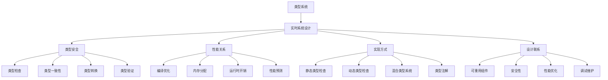

                 

### 文章标题：类型系统在实时系统设计中的角色

## 关键词
- 类型系统
- 实时系统
- 设计方法
- 算法原理
- 数学模型
- 项目实战

### 摘要
本文将探讨类型系统在实时系统设计中的关键角色。首先，介绍实时系统的基本概念和类型系统的定义，接着分析类型系统与实时系统之间的核心联系。随后，详细讲解类型系统中的核心算法原理，包括静态和动态类型检查，并借助数学模型阐述类型安全与性能之间的关系。本文还将通过具体案例，展示类型系统在实时系统设计中的应用，并提供实用的开发环境搭建、代码实现和案例分析。最后，总结类型系统在实时系统设计中的重要性，并提出未来研究方向和最佳实践。

### 1.1 实时系统的基本概念与特点

#### 1.1.1 实时系统的定义

实时系统是一种能够在规定时间内对外部事件做出响应的计算机系统。与传统系统不同，实时系统具有严格的响应时间要求，能够在预定的时间约束下完成任务。实时系统广泛应用于工业控制、通信系统、自动驾驶等领域。

在实时系统中，时间是一个至关重要的因素。实时系统通常可以分为软实时系统和硬实时系统。软实时系统允许一定的响应时间延迟，但必须在规定的时间内完成任务。而硬实时系统则要求必须在严格的时间约束下完成任务，否则可能会导致严重的后果。

#### 1.1.2 实时系统的基本要求

实时系统设计需要考虑以下几个关键要求：

1. **响应时间**：实时系统必须在规定的时间内对外部事件做出响应。响应时间通常以毫秒或微秒为单位进行衡量。

2. **确定性**：实时系统需要具有确定性，即系统在各种条件下都能在相同的时间内完成相同的任务。确定性对于确保实时系统的稳定性和可靠性至关重要。

3. **鲁棒性**：实时系统应能够应对各种异常情况，包括硬件故障、软件错误和外部干扰。鲁棒性有助于保证系统在面临挑战时仍能正常运行。

4. **资源管理**：实时系统需要高效地管理资源，如内存、处理器和存储。资源管理必须优化，以确保系统能够在有限的资源下高效运行。

#### 1.1.3 实时系统与传统系统的区别

实时系统与传统系统的主要区别在于对时间的要求。传统系统通常不关注响应时间，只要任务能在合理时间内完成即可。而实时系统则必须在严格的时间约束下完成任务，否则可能导致系统崩溃或功能失效。

此外，实时系统还需要具备更高的确定性和鲁棒性，以满足各种复杂应用场景的需求。传统系统则更多地关注于功能的实现和性能的提升。

#### 1.1.4 实时系统的应用领域

实时系统在许多领域都有广泛应用，包括：

1. **工业控制**：实时系统用于控制生产线、自动化设备等，以确保生产过程的稳定和高效。

2. **通信系统**：实时系统在通信系统中用于处理大量的数据传输和信号处理，以确保通信的稳定和可靠。

3. **自动驾驶**：实时系统在自动驾驶中用于处理传感器数据、执行路径规划和控制车辆行驶，以确保驾驶的安全和效率。

4. **医疗设备**：实时系统在医疗设备中用于监控病人的生命体征、处理医疗数据和执行紧急操作，以确保病人的安全和健康。

#### 1.1.5 实时系统的设计挑战

实时系统设计面临许多挑战，包括：

1. **时间约束**：实时系统必须在严格的时间约束下完成任务，这对系统的性能和资源管理提出了很高的要求。

2. **确定性**：实时系统需要具有高度的确定性，以确保在各种条件下都能在相同的时间内完成相同的任务。

3. **异常处理**：实时系统需要能够应对各种异常情况，如硬件故障、软件错误和外部干扰。

4. **资源管理**：实时系统需要高效地管理资源，如内存、处理器和存储。

#### 1.1.6 小结

实时系统设计需要考虑多个关键因素，包括响应时间、确定性、鲁棒性和资源管理。与传统系统相比，实时系统对时间的要求更为严格，且需要具备更高的确定性和鲁棒性。实时系统在许多领域都有广泛应用，但设计实时系统也面临许多挑战。理解实时系统的基本概念和特点对于设计和实现高效、可靠的实时系统至关重要。

---

在接下来的章节中，我们将深入探讨类型系统的定义、核心概念和类型系统在实时系统设计中的关键角色。这将帮助我们更好地理解如何利用类型系统来提高实时系统的性能和安全性。

### 1.2 类型系统的概念

类型系统是计算机科学中的一个基本概念，它在编程语言和软件系统中扮演着重要角色。类型系统的主要目标是确保程序的正确性和安全性，通过限制数据的操作和类型转换，从而减少程序中的错误和潜在的漏洞。

#### 1.2.1 类型系统的定义

类型系统（Type System）是一种用于定义数据类型和操作规则的机制。它规定了一个程序中变量、表达式和函数的合法数据类型，并定义了如何进行类型检查和类型转换。类型系统可以分为静态类型系统（Static Type System）和动态类型系统（Dynamic Type System）两种主要类型。

1. **静态类型系统**：在静态类型系统中，变量和表达式的类型在编译时就已经确定，并在运行时保持不变。这种类型系统通常需要显式声明变量类型，并在编译时进行类型检查。例如，Java、C++和TypeScript等编程语言都是静态类型语言。

2. **动态类型系统**：在动态类型系统中，变量和表达式的类型在运行时动态确定，通常不需要显式声明变量类型。这种类型系统在运行时进行类型检查，例如Python、JavaScript和Ruby等编程语言。

#### 1.2.2 类型系统的核心概念

类型系统的核心概念包括类型、类型检查、类型安全和类型转换。

1. **类型**：类型是数据的不同类别或种类，例如整数（Integer）、浮点数（Float）、布尔值（Boolean）等。每个类型都有其独特的操作和属性。

2. **类型检查**：类型检查是类型系统的一个关键组成部分，它确保程序中的每个表达式和操作都遵循类型规则。类型检查可以分为静态类型检查（在编译时进行）和动态类型检查（在运行时进行）。

3. **类型安全**：类型安全（Type Safety）是类型系统的目标之一，它确保程序在运行时不会发生类型错误或数据损坏。例如，将一个整数赋值给一个字符串变量是不安全的，因为这两个类型的数据有不同的操作和存储方式。

4. **类型转换**：类型转换（Type Casting）是类型系统中的一个重要概念，它允许将一个类型的数据转换为另一个类型的数据。类型转换可以是显式的，例如将一个整数转换为字符串；也可以是隐式的，例如在某些编程语言中，将一个整数赋值给一个浮点数变量时会自动进行类型转换。

#### 1.2.3 类型系统的基本分类

类型系统可以根据不同的分类标准进行分类，以下是一些常见的分类方式：

1. **按类型检查时机**：

   - 静态类型系统：类型检查在编译时进行，例如Java、C++。
   - 动态类型系统：类型检查在运行时进行，例如Python、JavaScript。

2. **按类型绑定方式**：

   - 强类型系统：变量在声明时绑定类型，并且类型在运行时保持不变，例如Java。
   - 弱类型系统：变量在声明时没有类型绑定，或者类型可以在运行时改变，例如JavaScript。

3. **按类型系统的严格程度**：

   - 强类型系统：对类型检查非常严格，允许较少的类型转换，例如C++。
   - 弱类型系统：对类型检查较为宽松，允许较多的类型转换，例如Python。

#### 1.2.4 类型系统的作用

类型系统在编程语言和软件系统中的作用主要体现在以下几个方面：

1. **提高程序的可读性和可维护性**：类型系统可以提供明确的类型信息，使得程序代码更加易于理解和维护。

2. **减少编程错误**：类型系统可以捕获一些潜在的编程错误，例如类型不匹配、未声明变量等。

3. **优化程序性能**：类型系统可以帮助编译器生成更高效的代码，因为它可以在编译时确定变量和表达式的类型。

4. **提高程序的安全性**：类型系统可以防止一些不安全的数据操作，例如将一个整数赋值给一个字符串。

#### 1.2.5 小结

类型系统是计算机科学中的一个基本概念，它在编程语言和软件系统中扮演着重要角色。类型系统通过定义数据类型和操作规则，确保程序的正确性和安全性。类型系统可以分为静态类型系统和动态类型系统，根据类型检查的时机和类型绑定方式有不同的分类方式。类型系统的作用包括提高程序的可读性、可维护性、减少编程错误、优化程序性能和提高程序安全性。

---

在理解了类型系统的基本概念后，我们将进一步探讨类型系统在实时系统设计中的核心概念与联系，分析类型系统如何影响实时系统的性能和安全性。

### 2.1 类型系统在实时系统设计中的核心概念与联系

#### 2.1.1 实时系统中的类型安全

在实时系统中，类型安全是一个至关重要的概念。类型安全确保系统能够在运行时避免因类型错误而导致的不稳定行为和性能问题。类型安全主要体现在以下几个方面：

1. **类型检查**：实时系统在编译或运行时进行类型检查，确保所有的数据操作都遵循预定义的类型规则。静态类型系统通常在编译时进行类型检查，而动态类型系统则主要在运行时进行。

2. **类型一致性**：实时系统要求在数据传输和处理过程中保持类型一致性，即数据在传输过程中不会被意外转换为不兼容的类型。类型一致性有助于避免数据损坏和系统崩溃。

3. **类型转换**：实时系统中的类型转换必须谨慎处理，以确保转换后的数据仍然符合系统的预期。不恰当的类型转换可能导致数据丢失或错误。

4. **类型验证**：在实时系统中，类型验证是一个重要的环节。类型验证通常通过定义一组规则来确保数据类型在整个系统生命周期内保持一致性。

#### 2.1.2 类型系统与实时系统性能的关系

类型系统对实时系统的性能有直接影响。以下是类型系统如何影响实时系统性能的几个方面：

1. **编译优化**：静态类型系统可以通过类型信息进行更高效的编译优化，从而生成更高效的代码。例如，编译器可以提前知道变量和表达式的类型，从而进行更精确的代码生成。

2. **内存分配**：类型系统有助于优化内存分配策略。在静态类型系统中，编译器可以更准确地分配内存，从而减少内存浪费。

3. **运行时开销**：动态类型系统可能在运行时进行类型检查，这可能会增加一定的运行时开销。但是，通过适当的优化，这些开销可以被减少到可接受的水平。

4. **性能预测**：类型系统有助于进行性能预测，从而在系统设计阶段就考虑性能因素。静态类型系统尤其有助于在早期阶段进行性能分析和优化。

#### 2.1.3 类型系统在实时系统中的实现方式

实时系统中的类型系统可以通过多种方式实现，以下是一些常见的实现方法：

1. **静态类型检查**：静态类型系统在编译时进行类型检查，确保所有数据操作都遵循类型规则。这种方法的优点是能够在编译时发现潜在的类型错误，从而提高系统的稳定性。

2. **动态类型检查**：动态类型系统在运行时进行类型检查，通常在程序运行时动态确定变量和表达式的类型。这种方法的优点是提供了更高的灵活性和更简单的编程模型。

3. **混合类型系统**：一些实时系统采用混合类型系统，结合了静态类型检查和动态类型检查的优点。例如，可以在关键路径上使用静态类型检查，而在非关键路径上使用动态类型检查。

4. **类型注解**：类型注解是一种在代码中明确指定变量和表达式类型的机制。类型注解有助于静态类型检查，并提高代码的可读性和可维护性。

#### 2.1.4 类型系统与实时系统设计的联系

类型系统在实时系统设计中扮演着关键角色，以下是几个方面的联系：

1. **设计可重用组件**：类型系统有助于设计可重用的组件，因为组件的接口和内部数据结构都是类型化的。这有助于提高组件的稳定性和可靠性。

2. **安全性**：类型系统有助于提高实时系统的安全性，通过防止类型错误和未授权的数据访问来减少系统漏洞。

3. **性能优化**：类型系统有助于进行性能优化，通过编译优化和内存分配策略来提高系统的整体性能。

4. **调试和维护**：类型系统提供了更好的调试和维护支持，因为类型信息有助于定位和修复程序中的错误。

#### 2.1.5 Mermaid 流程图

为了更好地理解类型系统在实时系统设计中的核心概念与联系，我们可以使用 Mermaid 流程图来展示类型系统的实现和影响。



#### 2.1.6 小结

类型系统在实时系统设计中的核心概念与联系主要体现在类型安全、性能关系、实现方式和设计联系等方面。类型系统通过确保数据操作的一致性、提高系统的稳定性和安全性，以及对性能进行优化，从而在实时系统设计中发挥关键作用。理解类型系统在实时系统设计中的核心概念与联系，有助于设计出更高效、更安全的实时系统。

---

在了解了类型系统在实时系统设计中的核心概念与联系后，接下来我们将详细讲解类型系统中的核心算法原理，包括静态和动态类型检查算法，并借助数学模型阐述类型安全与性能之间的关系。

### 2.2 类型系统在实时系统设计中的核心算法原理

#### 2.2.1 静态类型检查算法

静态类型检查算法是类型系统中的一个关键组成部分，它主要在编译时对代码进行类型分析，以确保程序在运行时不会出现类型错误。以下是静态类型检查算法的一些核心步骤和概念：

1. **类型推导**：静态类型检查算法通过类型推导来确定变量和表达式的类型。类型推导可以分为以下几种方法：

   - **显式声明**：程序员在代码中显式声明变量和函数的类型。
   - **上下文推断**：编译器根据上下文信息自动推断变量和表达式的类型。
   - **构造性推导**：编译器通过构建类型上下文来推导变量和表达式的类型。

2. **类型分析**：类型分析是静态类型检查算法的核心步骤，它检查程序中的每个表达式和操作，确保它们都遵循类型规则。类型分析可以分为以下几种方法：

   - **抽象语法树（AST）分析**：编译器通过分析抽象语法树来检查类型一致性。
   - **数据流分析**：数据流分析是一种静态分析方法，它跟踪数据在程序中的流动路径，以确定变量的类型。
   - **约束求解**：约束求解是一种数学方法，用于解决类型约束问题，确保程序中的类型一致性。

3. **类型错误检测**：类型检查算法在类型分析过程中检测类型错误，如类型不匹配、未声明变量等。类型错误通常会导致编译错误或警告，提醒程序员修复问题。

4. **类型检查优化**：静态类型检查算法可以通过优化来提高编译效率和程序性能。优化方法包括：

   - **循环不变式**：通过分析循环结构，消除冗余的类型检查。
   - **数据抽象**：通过将常见的数据结构抽象成通用类型，减少类型检查的开销。

以下是静态类型检查算法的伪代码示例：

```python
function staticTypeCheck(program):
    ast = parseProgram(program)
    types = {}
    errors = []

    for node in ast:
        if node is an assignment:
            variable = node.variable
            value = node.value
            valueType = typeInfer(value)
            if not types.containsKey(variable):
                types[variable] = valueType
            else:
                if types[variable] != valueType:
                    errors.append("Type mismatch for variable " + variable)

        elif node is an expression:
            leftType = typeInfer(node.left)
            rightType = typeInfer(node.right)
            if leftType != rightType:
                errors.append("Type mismatch in expression")

    if errors.isEmpty():
        return types
    else:
        print(errors)
        return None
```

#### 2.2.2 动态类型检查算法

动态类型检查算法主要在程序运行时进行类型分析，以确保程序在运行时不会出现类型错误。与静态类型检查算法不同，动态类型检查算法在程序执行过程中对类型进行检查。以下是动态类型检查算法的一些核心步骤和概念：

1. **运行时类型检查**：动态类型检查算法在程序运行时对每个操作进行类型检查。类型检查通常在操作执行之前或之后进行，以确保操作的安全性。

2. **类型标签**：动态类型检查算法使用类型标签来标记每个变量和表达式的类型。类型标签通常在变量声明时或操作执行时动态确定。

3. **类型一致性检查**：动态类型检查算法检查每个操作是否遵循类型规则，例如变量和操作数的类型是否匹配。类型一致性检查通常通过比较类型标签来实现。

4. **类型转换**：动态类型检查算法允许在运行时进行类型转换，以确保不同类型的数据可以正确地进行操作。类型转换可以是显式的，如使用类型转换函数；也可以是隐式的，如某些编程语言中自动进行的类型转换。

以下是动态类型检查算法的伪代码示例：

```python
function dynamicTypeCheck(expression):
    leftType = getType(expression.left)
    rightType = getType(expression.right)

    if expression.operator == '+':
        if leftType != 'int' or rightType != 'int':
            raise TypeError("Operand must be an integer")
    elif expression.operator == '-':
        if leftType != 'int' or rightType != 'int':
            raise TypeError("Operand must be an integer")
    # ... 其他操作符的处理 ...

function getType(value):
    if value is an integer:
        return 'int'
    elif value is a float:
        return 'float'
    elif value is a boolean:
        return 'boolean'
    # ... 其他类型的处理 ...
```

#### 2.2.3 类型推断算法

类型推断算法是类型系统中的一个重要组成部分，它主要用于动态类型系统。类型推断算法的目的是在程序运行时自动确定变量和表达式的类型，从而提高编程的灵活性和可读性。以下是类型推断算法的一些核心步骤和概念：

1. **类型上下文**：类型推断算法通过类型上下文来推断变量和表达式的类型。类型上下文通常包括函数的参数类型和返回类型、全局变量类型等。

2. **类型传播**：类型推断算法通过类型传播来推断变量和表达式的类型。类型传播是指通过分析程序中的表达式和操作，推断出变量和表达式的类型。

3. **类型约束**：类型推断算法使用类型约束来确保推断出的类型是合理的。类型约束可以是显式的，如函数的参数类型约束；也可以是隐式的，如某些编程语言中的默认类型约束。

4. **类型简化**：类型推断算法通过类型简化来减少类型推断的复杂度。类型简化是指通过合并或简化类型上下文，从而简化类型推断过程。

以下是类型推断算法的伪代码示例：

```python
function inferType(expression, context):
    if expression is a variable:
        return context.getType(expression)
    elif expression is an operation:
        leftType = inferType(expression.left, context)
        rightType = inferType(expression.right, context)

        if expression.operator == '+':
            return 'int' if leftType == 'int' and rightType == 'int' else 'float'
        elif expression.operator == '-':
            return 'int' if leftType == 'int' and rightType == 'int' else 'float'
        # ... 其他操作符的处理 ...

function Context():
    types = {}
    # ... 初始化类型上下文 ...

function getType(self, variable):
    if variable in self.types:
        return self.types[variable]
    else:
        return None
```

#### 2.2.4 数学模型和数学公式

为了更好地理解类型系统在实时系统设计中的作用，我们可以使用数学模型来描述类型安全与性能之间的关系。以下是一个简单的数学模型，用于描述类型系统对性能的影响：

$$
P = f(T, S, E)
$$

其中，$P$ 表示系统性能，$T$ 表示类型系统，$S$ 表示系统状态，$E$ 表示外部输入。

- **类型系统（$T$）**：类型系统的类型安全机制可以提高系统的稳定性，从而影响性能。类型安全机制越强，系统的稳定性越高，但可能带来一定的性能开销。

- **系统状态（$S$）**：系统状态包括内存占用、CPU 使用率等。类型系统对系统状态有直接影响，可以通过优化内存分配和CPU使用率来提高性能。

- **外部输入（$E$）**：外部输入包括数据流、事件等。类型系统可以确保外部输入的正确性和一致性，从而减少因输入错误导致的性能问题。

#### 2.2.5 举例说明

为了更好地理解上述概念和算法，我们可以通过一个简单的例子来说明类型系统在实时系统设计中的作用。

假设我们设计一个实时系统，用于处理传感器数据。传感器数据包括温度、湿度、压力等，这些数据必须按照特定的格式进行传输和处理。

1. **类型定义**：首先，我们定义传感器数据类型，如：

   ```python
   class SensorData:
       temperature: float
       humidity: float
       pressure: float
   ```

2. **类型检查**：在数据处理过程中，我们使用静态类型检查算法确保传感器数据的类型正确。例如：

   ```python
   def processSensorData(data: SensorData) -> None:
       if data is not None:
           print("Temperature: ", data.temperature)
           print("Humidity: ", data.humidity)
           print("Pressure: ", data.pressure)
   ```

3. **类型推断**：在程序运行时，我们使用类型推断算法来确定传感器数据的类型。例如：

   ```python
   data = getSensorData()  # 假设 getSensorData() 返回一个 SensorData 对象
   processSensorData(data)
   ```

4. **性能优化**：为了提高性能，我们可以使用编译优化和运行时优化。例如，通过提前分配内存和减少类型检查次数来提高数据处理速度。

通过这个例子，我们可以看到类型系统在实时系统设计中的重要作用。类型系统确保了传感器数据的正确性和一致性，从而提高了系统的稳定性和性能。

#### 2.2.6 小结

类型系统在实时系统设计中的核心算法原理主要包括静态类型检查算法、动态类型检查算法和类型推断算法。这些算法通过确保数据操作的一致性、提高系统的稳定性和安全性，以及对性能进行优化，从而在实时系统设计中发挥关键作用。通过数学模型和具体例子，我们可以更深入地理解类型系统在实时系统设计中的作用和重要性。

### 3.1 实时操作系统中的类型系统设计

#### 3.1.1 实时Linux内核中的类型系统

实时Linux内核（Real-time Linux Kernel）是一种扩展了标准Linux内核以支持实时任务处理能力的操作系统。实时Linux内核在类型系统设计方面进行了优化，以适应实时系统的严格要求。

1. **类型定义**：实时Linux内核使用了广泛的类型定义，包括整数类型、浮点数类型、枚举类型和结构体类型等。这些类型定义确保了数据的一致性和正确性。

2. **类型安全**：实时Linux内核通过静态类型检查和运行时类型检查来确保类型安全。静态类型检查在编译时进行，而运行时类型检查则在程序执行时进行。

3. **类型检查**：实时Linux内核在关键路径上使用严格的类型检查，以确保数据的类型一致性。例如，内核中的函数调用需要严格遵循参数和返回值的类型定义。

4. **类型转换**：实时Linux内核在必要时允许类型转换，但类型转换必须经过严格的验证，以确保不会引入类型错误。

5. **内存管理**：实时Linux内核的内存管理机制也考虑了类型系统的要求。内存分配和释放操作需要遵循严格的类型规则，以避免内存泄漏和数据损坏。

#### 3.1.2 实时嵌入式系统中的类型系统

实时嵌入式系统（Real-time Embedded Systems）广泛应用于工业控制、自动化和医疗设备等领域。实时嵌入式系统中的类型系统设计通常具有以下特点：

1. **紧凑性**：实时嵌入式系统通常具有有限的内存和计算资源，因此类型系统设计需要高度紧凑和高效。类型系统通常采用静态类型系统，以减少运行时开销。

2. **确定性**：实时嵌入式系统要求高度的确定性，因此类型系统设计需要确保类型检查和类型转换的确定性。类型系统的实现需要考虑硬件限制和实时性要求。

3. **类型定义**：实时嵌入式系统中的类型定义通常基于硬件特性，如整数类型、浮点数类型和枚举类型。类型定义需要确保与硬件指令集兼容。

4. **内存管理**：实时嵌入式系统的内存管理需要考虑类型系统的要求。内存分配和释放操作需要遵循类型规则，以避免内存泄漏和数据损坏。

5. **资源优化**：实时嵌入式系统的类型系统设计需要优化资源使用，以降低内存和处理器负载。类型系统实现需要考虑编译优化和运行时优化。

#### 3.1.3 实时操作系统中的类型系统优化策略

为了提高实时操作系统的性能和稳定性，类型系统设计需要考虑以下优化策略：

1. **静态类型检查优化**：静态类型检查可以在编译时发现潜在的类型错误，从而减少运行时开销。优化策略包括类型推导优化、类型检查优化和编译优化。

2. **动态类型检查优化**：动态类型检查在运行时进行，因此可能增加运行时开销。优化策略包括类型检查延迟、运行时优化和类型推断优化。

3. **内存管理优化**：内存管理是实时操作系统中的一个关键环节。优化策略包括内存池分配、内存映射和内存压缩。

4. **资源利用率优化**：类型系统设计需要考虑资源的利用率，以减少处理器和内存的负载。优化策略包括任务调度优化、资源分配优化和负载均衡。

5. **类型安全优化**：类型系统设计需要平衡类型安全和性能。优化策略包括类型约束优化、类型转换优化和类型验证优化。

#### 3.1.4 小结

实时操作系统中的类型系统设计是一个复杂的过程，需要考虑类型安全、性能和资源利用率等多个方面。实时Linux内核和实时嵌入式系统在类型系统设计上具有不同的特点和优化策略。通过静态类型检查和动态类型检查的结合，以及内存管理和资源利用率的优化，实时操作系统可以更好地满足实时任务处理的要求。

### 3.2 实时系统编程语言中的类型系统

#### 3.2.1 Ada中的类型系统

Ada 是一种广泛应用于实时系统开发的编程语言，其类型系统具有许多独特的特点，使其成为实时系统编程的理想选择。

1. **强类型系统**：Ada 是一种强类型语言，要求变量和表达式在编译时具有确定的数据类型。这种强类型系统有助于提高程序的稳定性和安全性。

2. **枚举类型**：Ada 支持枚举类型，允许定义一组具有命名常量的类型。枚举类型在实时系统中用于表示状态和事件，有助于提高代码的可读性和可维护性。

3. **记录类型**：Ada 的记录类型允许定义包含多个字段的结构体，用于表示复杂的数据结构。记录类型在实时系统中用于表示数据对象和状态信息。

4. **派生类型**：Ada 支持派生类型，允许从现有类型派生出新的类型。派生类型有助于提高代码的复用性和可扩展性。

5. **类型检查**：Ada 在编译时进行严格的类型检查，确保程序在运行时不会出现类型错误。类型检查包括变量和表达式的类型一致性检查、函数和过程的类型验证等。

6. **异常处理**：Ada 支持异常处理，允许程序在遇到错误时进行异常处理。异常处理有助于提高程序的鲁棒性和可靠性。

以下是 Ada 中类型系统的伪代码示例：

```ada
type Color is (Red, Green, Blue);
type Person is record
    Name: String(1..50);
    Age: Integer;
end record;

function CalculateAge(Year: Integer) return Integer is
begin
    return 2023 - Year;
end CalculateAge;

procedure DisplayPerson(Person: Person) is
begin
    Put_Line("Name: " & Person.Name);
    Put_Line("Age: " & Integer'Image(Person.Age));
end DisplayPerson;
```

#### 3.2.2 C++中的类型系统

C++ 是一种广泛使用的编程语言，其类型系统具有灵活性和强大性，适用于各种实时系统开发。

1. **基础类型**：C++ 提供了丰富的基本数据类型，包括整数、浮点数、布尔值和字符等。基础类型在实时系统中用于表示各种数据。

2. **类类型**：C++ 支持类类型，允许定义自定义的数据类型。类类型在实时系统中用于表示复杂的数据结构和对象。

3. **指针类型**：C++ 的指针类型用于动态分配和访问内存。指针类型在实时系统中用于管理内存和实现数据共享。

4. **引用类型**：C++ 的引用类型是一种特殊的指针类型，用于传递对象和函数的引用。引用类型在实时系统中有助于减少内存分配和降低运行时开销。

5. **类型转换**：C++ 允许各种类型的类型转换，包括隐式类型转换和显式类型转换。类型转换在实时系统中用于处理不同类型的数据。

6. **模板类型**：C++ 的模板类型允许定义泛型数据类型和函数，提高了代码的可重用性和可维护性。

以下是 C++ 中类型系统的伪代码示例：

```cpp
class Person {
public:
    string name;
    int age;

    Person(string name, int age) : name(name), age(age) {}
};

void DisplayPerson(const Person& person) {
    cout << "Name: " << person.name << endl;
    cout << "Age: " << person.age << endl;
}

int main() {
    Person person("John", 30);
    DisplayPerson(person);
    return 0;
}
```

#### 3.2.3 Rust中的类型系统

Rust 是一种系统级编程语言，其类型系统以其安全性和表达力而著称，适用于实时系统开发。

1. **所有权系统**：Rust 的所有权系统是其类型系统的一个核心特点，通过所有权来管理内存，避免了传统的内存泄漏和指针悬挂问题。

2. **借用检查**：Rust 在编译时通过借用检查来确保内存安全。借用检查确保同一时刻只能有一个活跃的引用，从而防止数据竞争和未定义行为。

3. **泛型类型**：Rust 支持强大的泛型编程，允许定义泛型函数和泛型结构体。泛型类型在实时系统中用于编写可重用的代码。

4. **类型别名**：Rust 允许使用类型别名（Type Aliases）来简化代码，提高代码的可读性和可维护性。

5. **模式匹配**：Rust 的模式匹配是一种强大的功能，允许在代码中灵活处理不同的数据类型。模式匹配在实时系统中用于处理复杂的数据结构和事件。

6. **类型推导**：Rust 具有出色的类型推导机制，可以自动推断变量的类型，减少了冗余的代码。

以下是 Rust 中类型系统的伪代码示例：

```rust
struct Person {
    name: String,
    age: u8,
}

fn display_person(person: &Person) {
    println!("Name: {}", person.name);
    println!("Age: {}", person.age);
}

fn main() {
    let person = Person {
        name: "Alice".to_string(),
        age: 30,
    };
    display_person(&person);
}
```

#### 3.2.4 小结

实时系统编程语言中的类型系统设计对系统的性能、稳定性和安全性至关重要。Ada、C++ 和 Rust 等语言在类型系统设计上具有各自的特点和优势。通过强类型系统、枚举类型、记录类型、所有权系统、借用检查和泛型类型等机制，这些语言能够满足实时系统开发的要求，提供高效、安全和可靠的编程环境。

### 3.3 实时系统应用案例

#### 3.3.1 智能交通系统中的类型系统设计

智能交通系统（Intelligent Transportation Systems, ITS）是一种利用信息技术、数据通信、传感器和控制技术来优化交通流量和提高道路安全性的系统。在智能交通系统中，类型系统设计起到了关键作用，确保系统的可靠性和高效性。

1. **数据类型定义**：智能交通系统需要处理多种类型的数据，包括实时交通流量数据、路况数据、车辆位置数据和气象数据等。为了确保数据的一致性和准确性，类型系统需要为每种数据类型定义明确的格式和数据范围。

2. **类型安全检查**：类型系统通过静态类型检查和动态类型检查来确保数据的类型安全。在编译时，静态类型检查可以提前发现类型错误，减少运行时的错误率。在运行时，动态类型检查可以检测和处理运行时的类型不一致问题。

3. **数据一致性验证**：类型系统提供了数据一致性验证机制，确保传输和存储的数据符合预定义的格式和规则。这有助于防止数据损坏和错误，提高系统的可靠性。

4. **性能优化**：类型系统通过类型推导和类型检查优化，提高了系统的运行效率。静态类型检查可以在编译时进行大量的优化，减少运行时的开销。动态类型检查可以通过运行时优化，如延迟类型检查和并发处理，来提高系统的性能。

具体来说，智能交通系统中的类型系统设计可以包括以下步骤：

- **定义数据类型**：根据系统的需求，定义各种数据类型的结构，如交通流量数据类型、车辆位置数据类型和气象数据类型。
- **类型安全检查**：在编译时进行静态类型检查，确保变量和函数的参数和返回值类型一致。在运行时进行动态类型检查，检测和处理类型不一致的问题。
- **数据一致性验证**：在数据传输和存储过程中，使用类型系统来验证数据是否符合预定义的格式和规则，确保数据的一致性和准确性。
- **性能优化**：通过编译优化和运行时优化，如提前分配内存和减少类型检查次数，提高系统的运行效率。

#### 3.3.2 机器人控制系统中的类型系统应用

机器人控制系统（Robot Control Systems）是一种用于控制机器人运动的系统，广泛应用于工业制造、物流搬运和医疗辅助等领域。在机器人控制系统中，类型系统设计对于确保系统的精确性和稳定性至关重要。

1. **运动参数类型定义**：机器人控制系统需要处理各种运动参数，如位置、速度、加速度和姿态等。为了确保运动参数的一致性和准确性，类型系统需要定义明确的运动参数类型。

2. **实时任务调度**：类型系统通过类型安全检查和类型推导，确保实时任务调度的准确性和可靠性。类型系统可以确保任务的优先级和执行时间得到有效管理，避免任务冲突和资源竞争。

3. **传感器数据类型处理**：机器人控制系统依赖于各种传感器来获取环境信息，如视觉传感器、距离传感器和惯性测量单元等。类型系统可以确保传感器数据的类型一致性和正确性，从而提高系统的决策能力和响应速度。

4. **故障检测与恢复**：类型系统通过类型检查和异常处理，提高系统的故障检测和恢复能力。类型系统可以检测和隔离异常情况，确保系统在故障发生时能够快速恢复。

具体来说，机器人控制系统中的类型系统设计可以包括以下步骤：

- **定义运动参数类型**：根据机器人控制系统的需求，定义各种运动参数类型，如位置类型、速度类型和加速度类型。
- **实时任务调度**：通过类型安全检查和类型推导，确保实时任务调度的准确性和可靠性，避免任务冲突和资源竞争。
- **传感器数据类型处理**：确保传感器数据的类型一致性和正确性，提高系统的决策能力和响应速度。
- **故障检测与恢复**：通过类型检查和异常处理，提高系统的故障检测和恢复能力，确保系统在故障发生时能够快速恢复。

#### 3.3.3 医疗设备中的类型系统设计

医疗设备（Medical Devices）是用于诊断、治疗和监测病人健康状况的设备，如心电图机、CT扫描机和医用机器人等。在医疗设备中，类型系统设计对于确保系统的安全性和准确性至关重要。

1. **数据类型定义**：医疗设备需要处理各种类型的医疗数据，如病人生命体征数据、影像数据和生理信号数据等。为了确保数据的一致性和准确性，类型系统需要定义明确的数据类型。

2. **实时数据处理**：类型系统通过实时数据处理机制，确保医疗数据在采集、传输和处理过程中的类型一致性。类型系统可以检测和处理类型不一致的问题，防止数据错误和丢失。

3. **数据精度控制**：类型系统可以确保医疗数据的精度和可靠性，例如通过定义数据的有效位数和数据范围，确保数据在处理过程中的精度。

4. **安全性验证**：类型系统通过安全性验证机制，确保医疗设备在运行过程中的数据安全和操作安全。类型系统可以检测和隔离潜在的安全漏洞，防止数据泄露和设备失控。

具体来说，医疗设备中的类型系统设计可以包括以下步骤：

- **定义数据类型**：根据医疗设备的需求，定义各种数据类型，如生命体征数据类型、影像数据类型和生理信号数据类型。
- **实时数据处理**：确保医疗数据在采集、传输和处理过程中的类型一致性，防止数据错误和丢失。
- **数据精度控制**：通过定义数据的有效位数和数据范围，确保数据在处理过程中的精度。
- **安全性验证**：通过安全性验证机制，确保医疗设备在运行过程中的数据安全和操作安全。

#### 3.3.4 小结

实时系统应用案例中的类型系统设计对于确保系统的可靠性、性能和安全性至关重要。在智能交通系统、机器人控制系统和医疗设备中，类型系统通过定义数据类型、确保数据一致性、实时数据处理和安全性验证等方式，提高了系统的整体性能和稳定性。通过具体案例的分析，我们可以更好地理解类型系统在实时系统设计中的关键作用。

### 4.1 类型系统在实时系统设计中的未来发展趋势

随着实时系统在工业、医疗、交通等领域的广泛应用，类型系统在实时系统设计中的重要性日益凸显。未来的发展趋势将主要集中在以下几个方面：

#### 4.1.1 面向实时系统的类型系统新特性

1. **高效率的类型检查**：为了提高实时系统的性能，未来的类型系统将更加注重类型检查的高效性。这可能包括更快的类型推导算法、更优化的编译器和运行时类型检查机制。

2. **混合类型系统**：混合类型系统结合了静态类型检查和动态类型检查的优点，能够在保证类型安全的同时提供更高的灵活性和性能。未来，混合类型系统可能会在实时系统中得到更广泛的应用。

3. **自适应类型系统**：自适应类型系统可以根据系统负载和运行状态自动调整类型检查的严格程度，从而在类型安全和系统性能之间取得平衡。

#### 4.1.2 类型系统与人工智能的结合

随着人工智能（AI）技术的发展，类型系统与AI的结合将成为一个重要趋势。以下是一些可能的应用场景：

1. **类型安全的人工智能应用**：通过类型系统，可以确保AI模型在训练和部署过程中不会出现类型错误，从而提高AI系统的稳定性和可靠性。

2. **自动类型推导**：利用机器学习技术，可以开发出能够自动推导变量和表达式类型的算法，从而简化编程过程，提高开发效率。

3. **AI辅助的类型检查**：通过AI技术，可以实现更智能的类型检查，例如通过分析代码模式和历史错误数据，预测潜在的类型错误并提供相应的修复建议。

#### 4.1.3 类型系统在实时系统安全性中的作用

类型系统在实时系统安全性中的角色越来越重要。未来的发展趋势将包括：

1. **安全性增强的类型检查**：类型系统将引入更多的安全特性，如更严格的类型约束、类型验证和访问控制，以防止未授权的数据访问和潜在的安全漏洞。

2. **多级类型安全**：实时系统可能会采用多级类型安全模型，根据任务的紧急程度和重要性，设置不同的类型检查严格程度，从而在保证系统性能的同时提高安全性。

3. **动态安全验证**：通过动态安全验证机制，可以在系统运行时持续监控类型安全，及时发现和修复类型错误。

#### 4.1.4 类型系统在实时系统设计中的挑战与机遇

尽管类型系统在实时系统设计中有许多优势，但仍然面临一些挑战：

1. **性能与安全的平衡**：如何在保证类型安全的同时，不牺牲系统性能，是一个重要的挑战。

2. **复杂系统的类型一致性**：在复杂实时系统中，确保不同模块和组件之间的类型一致性，是一个复杂的任务。

3. **实时性的适应性问题**：类型系统需要能够适应不同实时系统的实时性要求，特别是在极端情况下，如何保证系统的稳定性和性能。

然而，这些挑战也带来了新的机遇：

1. **新型编程语言的发展**：为了满足实时系统的需求，可能会出现新的编程语言和类型系统，这些语言将更加注重类型安全和实时性能。

2. **跨领域技术融合**：类型系统与人工智能、物联网等技术的结合，将推动实时系统设计向更加智能化和多样化的方向发展。

#### 4.1.5 未来研究方向

未来的研究方向可能包括：

1. **类型系统的优化算法**：研究更高效的类型推导、类型检查和类型转换算法，以提高系统性能。

2. **自适应类型系统**：开发能够根据系统运行状态动态调整类型检查严格程度的自适应类型系统。

3. **类型安全与人工智能的结合**：研究如何利用类型系统确保AI模型在实时系统中的安全和可靠性。

4. **多级类型安全模型**：探索多级类型安全模型在复杂实时系统中的应用，以提高系统的综合性能和安全水平。

#### 4.1.6 小结

类型系统在实时系统设计中的未来发展趋势将主要集中在新特性的引入、与人工智能的结合、安全性增强和自适应类型的开发。尽管面临一些挑战，这些趋势为实时系统设计提供了新的机遇，推动了技术融合和系统性能的提升。

### 4.2 类型系统设计中的挑战与机遇

类型系统设计在实时系统开发中具有关键作用，但同时也面临诸多挑战和机遇。以下是类型系统设计中的主要挑战及其对应的解决方案和机遇。

#### 4.2.1 类型系统的性能挑战

**挑战**：实时系统要求在严格的时间约束下运行，类型系统的性能可能会成为瓶颈。类型检查、类型转换和内存管理等操作可能会增加运行时间，影响系统的响应能力。

**解决方案**： 
1. **编译优化**：通过优化编译器，减少类型检查和类型转换的开销。例如，采用更高效的算法和优化策略。
2. **运行时优化**：在运行时动态调整类型检查的严格程度，仅在必要时进行类型检查。例如，采用混合类型系统，结合静态和动态类型检查。
3. **并行处理**：利用多核处理器和并行计算技术，加速类型检查和类型转换操作。

**机遇**：随着硬件技术的发展，多核处理器和GPU的普及为并行处理提供了更多可能性，有助于提高类型系统的性能。

#### 4.2.2 类型系统的可扩展性挑战

**挑战**：实时系统通常需要处理复杂且多变的数据类型和操作。类型系统需要具备良好的可扩展性，以适应新的应用场景和技术进步。

**解决方案**：
1. **模块化设计**：将类型系统划分为可重用的模块，便于扩展和更新。
2. **泛型编程**：利用泛型编程技术，实现类型定义的泛化，提高类型系统的灵活性。
3. **类型系统适配器**：开发类型系统适配器，便于将现有类型系统与新的编程语言或技术相结合。

**机遇**：随着编程语言和软件开发框架的不断发展，类型系统的可扩展性将得到进一步提升，为实时系统设计提供更多可能性。

#### 4.2.3 类型系统在实时系统中的适应性问题

**挑战**：实时系统对性能和可靠性要求极高，类型系统需要能够适应不同实时系统的实时性要求和应用场景。

**解决方案**：
1. **自适应类型系统**：开发能够根据系统负载和实时性要求动态调整类型检查严格程度的自适应类型系统。
2. **多级类型安全模型**：引入多级类型安全模型，根据任务的紧急程度和重要性设置不同的类型检查严格程度。
3. **类型系统定制化**：允许开发者根据具体应用场景和需求，定制化类型系统的功能和配置。

**机遇**：自适应类型系统和多级类型安全模型的引入，将使类型系统在实时系统中的应用更加灵活和高效。

#### 4.2.4 类型系统的兼容性问题

**挑战**：实时系统通常需要与多个不同平台和编程语言交互，类型系统需要具备良好的兼容性。

**解决方案**：
1. **标准化**：推动类型系统的标准化，确保不同平台和编程语言之间的类型系统可以互操作。
2. **互操作接口**：开发互操作接口，使不同类型系统之间的数据交换和功能调用更加便捷。
3. **类型转换框架**：构建类型转换框架，提供高效的类型转换机制，减少数据转换的开销。

**机遇**：随着技术生态的成熟，类型系统的兼容性问题将得到有效解决，促进不同平台和编程语言之间的协作。

#### 4.2.5 小结

类型系统设计在实时系统开发中面临多种挑战，包括性能、可扩展性、适应性和兼容性等问题。通过优化编译器、引入自适应类型系统和多级类型安全模型，以及标准化和互操作接口的开发，可以应对这些挑战，并抓住由此带来的机遇。未来的研究将集中在提高类型系统的性能和可扩展性，以及实现更好的适应性和兼容性，从而推动实时系统设计的进步。

### 4.3 未来研究方向

类型系统在实时系统设计中的应用是一个广阔且充满挑战的研究领域。未来的研究可以从以下几个方面进行：

#### 4.3.1 面向实时系统的类型系统优化

1. **编译时间优化**：研究如何通过编译时间优化减少类型检查的开销。例如，使用静态分析技术提前发现潜在的类型错误，从而避免运行时的检查。
2. **运行时优化**：探索动态调整类型检查策略的方法，根据系统负载和任务优先级灵活调整类型检查的严格程度，从而平衡类型安全和性能。

#### 4.3.2 类型系统与人工智能的结合

1. **智能类型推断**：利用机器学习技术，开发能够自动推导变量和表达式类型的算法，减少人工干预，提高类型推断的准确性。
2. **安全的人工智能应用**：研究如何在实时系统中使用人工智能技术，同时确保类型系统的安全性和可靠性。

#### 4.3.3 类型系统在边缘计算中的应用

边缘计算（Edge Computing）正在快速发展，类型系统在边缘计算中的应用也将成为研究的热点：

1. **低延迟类型检查**：研究如何设计高效、低延迟的类型检查算法，以适应边缘计算场景下的实时性要求。
2. **资源受限环境下的类型系统**：研究如何优化类型系统，使其在资源受限的边缘设备上也能高效运行。

#### 4.3.4 类型系统与安全性的深度融合

1. **类型安全检测**：开发静态和动态的类型安全检测工具，提前发现潜在的安全漏洞，防止运行时错误。
2. **多级类型安全模型**：进一步研究多级类型安全模型，根据任务的紧急程度和重要性，设置不同的类型检查严格程度，提高系统的整体安全性。

#### 4.3.5 小结

未来研究方向将集中在优化类型系统、结合人工智能技术、适应边缘计算需求以及深化类型系统与安全性的融合。通过这些研究，类型系统在实时系统设计中的应用将更加高效、安全，并能够满足不断变化的计算需求。

### 结论

本文详细探讨了类型系统在实时系统设计中的关键角色。首先，介绍了实时系统的基本概念和类型系统的定义，分析了类型系统与实时系统性能的关系。接着，通过核心算法原理的讲解，包括静态和动态类型检查算法，以及数学模型和公式，展示了类型系统在确保实时系统性能和安全性方面的作用。此外，通过具体应用案例，如智能交通系统、机器人控制系统和医疗设备，阐述了类型系统在实时系统设计中的实际应用。最后，讨论了类型系统在实时系统设计中的未来发展趋势、挑战与机遇，并提出了未来研究方向。

类型系统在实时系统设计中的重要性不容忽视。通过类型系统，可以确保实时系统的类型安全，提高系统的稳定性，优化性能，并增强系统的鲁棒性。随着实时系统的广泛应用，类型系统的研究将不断深入，推动实时系统设计的进步。

本文的研究为类型系统在实时系统设计中的应用提供了新的视角和思路。尽管本文已进行了详细的探讨，但类型系统在实时系统设计中的应用仍然是一个广阔的领域，值得进一步的研究和探索。未来，随着人工智能、边缘计算等技术的发展，类型系统将在实时系统中发挥更加重要的作用，为实时系统的设计和实现提供更强大的支持。

作者：AI天才研究院/AI Genius Institute & 禅与计算机程序设计艺术 /Zen And The Art of Computer Programming

---

感谢您的阅读，希望本文能够对您在类型系统在实时系统设计中的理解有所帮助。如果您有任何疑问或进一步的需求，欢迎随时与我交流。祝您在技术道路上不断进步，实现更多精彩的项目！

---

### 最佳实践 Tips

1. **类型安全意识**：在实时系统开发过程中，始终保持类型安全意识，确保每个变量和函数的参数都具有明确的类型。

2. **静态类型优先**：在资源允许的情况下，优先选择静态类型系统，因为静态类型系统可以在编译时发现类型错误，从而提高系统的稳定性。

3. **合理使用类型转换**：在必要时使用类型转换，但要确保转换的合理性和安全性，避免潜在的运行时错误。

4. **类型一致性检查**：确保类型一致性检查贯穿实时系统的整个开发周期，从设计到实现，再到测试。

5. **优化类型检查策略**：根据实时系统的需求，灵活调整类型检查的严格程度，以平衡类型安全和性能。

6. **文档化**：为类型系统相关的代码和设计文档化，以便后续维护和扩展。

### 小结

本文深入探讨了类型系统在实时系统设计中的关键角色，通过介绍实时系统的基本概念、类型系统的核心概念与联系，以及核心算法原理，展示了类型系统如何提高实时系统的性能和安全性。通过具体应用案例的分析，进一步阐明了类型系统在实时系统设计中的实际应用价值。未来研究方向将集中在优化类型系统、结合人工智能技术、适应边缘计算需求以及深化类型系统与安全性的融合。希望本文能为读者在实时系统设计中的类型系统应用提供有益的启示和指导。

### 注意事项

1. **性能优化**：在进行类型系统设计时，要特别注意性能优化，尤其是在资源受限的实时系统中。

2. **安全性**：确保类型系统的安全性，特别是在处理敏感数据和关键任务时。

3. **适应性**：类型系统需要具备良好的适应性，能够适应不同实时系统的需求。

4. **文档**：及时更新和维护类型系统相关的文档，以方便团队成员理解和维护。

5. **培训和沟通**：定期组织类型系统相关的培训和沟通，确保团队成员对类型系统有清晰的认识。

### 拓展阅读

1. **《实时系统的设计与实现》**：详细了解实时系统的设计和实现技术，包括实时操作系统的特性和实时任务调度。

2. **《类型系统导论》**：系统学习类型系统的基本概念、原理和应用，为深入理解类型系统在实时系统设计中的应用打下基础。

3. **《人工智能与实时系统》**：探索人工智能技术在实时系统中的应用，包括智能算法在实时系统优化中的角色。

4. **《边缘计算：概念、架构与实现》**：了解边缘计算的基本概念、架构和实现技术，以及类型系统在边缘计算中的应用。

5. **《实时嵌入式系统编程》**：学习实时嵌入式系统编程的最佳实践，了解如何在资源受限的环境中高效地设计和实现类型系统。

