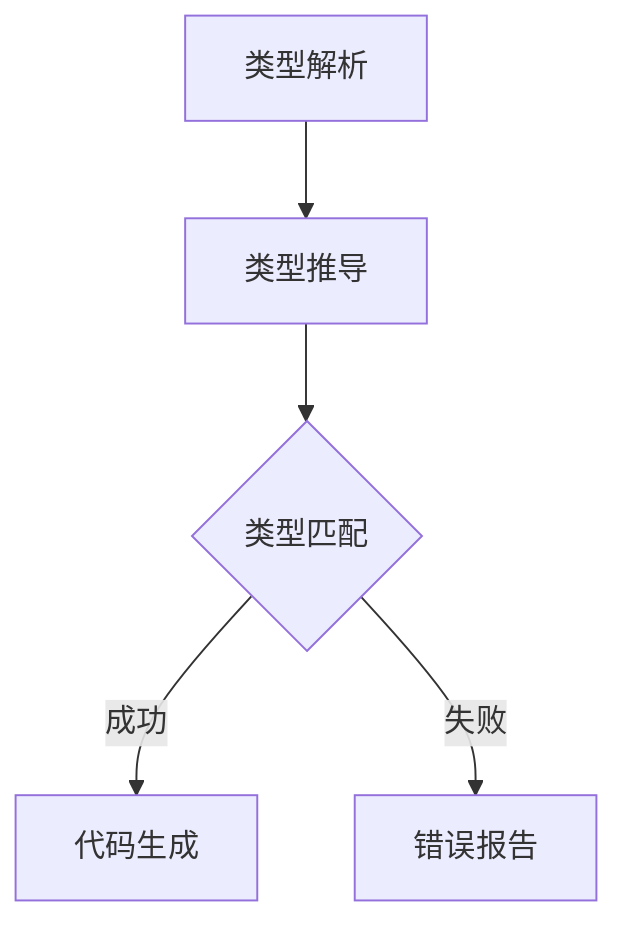

                 


### 设计文章大纲

在设计文章大纲之前，我们需要明确文章的核心目标，即深入探讨类型系统在程序静态分析中的作用。接下来，我们将按照以下步骤来构建文章大纲：

#### 1. 确定主要章节

根据文章标题《类型系统在程序静态分析中的作用》，我们可以将文章的主要章节分为以下几个部分：

1. **引言**：介绍类型系统和程序静态分析的基本概念，以及它们在软件工程中的重要性。
2. **类型系统的概述**：详细解释类型系统的历史、定义、分类以及其在现代编程语言中的重要性。
3. **程序静态分析基础**：介绍程序静态分析的定义、方法、工具及其在软件工程中的应用。
4. **类型系统在静态分析中的应用**：探讨类型系统在静态分析中的具体应用，如类型检查和类型推断。
5. **性能优化与类型系统**：分析类型系统对程序性能的影响，以及如何通过类型系统进行性能优化。
6. **实际案例分析**：通过具体案例展示类型系统在静态分析中的实际应用。
7. **类型系统的未来发展**：展望类型系统在未来的发展趋势，面临的挑战和机遇。

#### 2. 细化每个章节

为了确保文章内容的完整性和丰富性，我们将对每个章节进行细化，包括以下子章节：

- **引言**：
  - **背景介绍**：介绍类型系统和程序静态分析的基本概念。
  - **重要性**：阐述类型系统和程序静态分析在软件工程中的重要性。

- **类型系统的概述**：
  - **历史**：回顾类型系统的起源和发展。
  - **定义**：明确类型系统的定义。
  - **分类**：详细介绍静态类型系统和动态类型系统的区别。
  - **重要性**：讨论类型系统在现代编程语言中的重要性。

- **程序静态分析基础**：
  - **定义**：解释程序静态分析的概念。
  - **方法**：介绍常用的静态分析方法。
  - **工具**：讨论流行的静态分析工具。

- **类型系统在静态分析中的应用**：
  - **类型检查**：解释类型检查的概念和过程。
  - **类型推断**：介绍类型推断的方法和应用。

- **性能优化与类型系统**：
  - **影响**：分析类型系统对程序性能的影响。
  - **优化策略**：探讨如何利用类型系统进行性能优化。

- **实际案例分析**：
  - **案例一**：分析类型系统在Web应用中的静态分析。
  - **案例二**：探讨类型系统在嵌入式系统开发中的应用。

- **类型系统的未来发展**：
  - **挑战与机遇**：展望类型系统面临的挑战和机遇。
  - **未来展望**：讨论类型系统的未来发展趋势。

#### 3. 添加核心概念与联系

为了帮助读者更好地理解类型系统在程序静态分析中的作用，我们将在适当的地方添加核心概念与联系，并使用Mermaid流程图展示这些概念之间的关系。

#### 4. 添加核心算法原理讲解

为了使文章更加深入，我们将使用伪代码详细阐述关键算法，并解释其原理。同时，我们还将嵌入数学模型和公式，使用LaTeX格式进行详细讲解和举例说明。

#### 5. 添加项目实战

为了使文章更具实践性，我们将提供实际案例，包括开发环境搭建、源代码实现和解读，以及代码应用解读与分析。

#### 6. 添加最佳实践、小结、注意事项和拓展阅读

最后，我们将总结文章的主要内容，提供最佳实践建议，提醒注意事项，并推荐拓展阅读资源，以帮助读者进一步深入学习。

### 总结

通过以上步骤，我们已经设计出一个完整的文章大纲，确保文章内容丰富、逻辑清晰，能够系统地介绍类型系统在程序静态分析中的作用。接下来，我们将逐步填充每个章节的内容，使其完整并符合要求。在撰写过程中，我们将遵循markdown格式，确保文章的可读性和美观性。

### 文章标题

《类型系统在程序静态分析中的作用》

### 文章关键词

- 类型系统
- 程序静态分析
- 类型检查
- 类型推断
- 性能优化
- 实际案例分析

### 文章摘要

本文深入探讨了类型系统在程序静态分析中的作用。首先，介绍了类型系统的基本概念、历史和发展，以及其在现代编程语言中的重要性。接着，详细阐述了程序静态分析的定义、方法、工具及其应用。随后，重点分析了类型系统在静态分析中的具体应用，包括类型检查和类型推断。文章还探讨了类型系统对程序性能的影响，并提出了一些优化策略。通过两个实际案例分析，展示了类型系统在Web应用和嵌入式系统开发中的实际应用。最后，文章展望了类型系统的未来发展，并提出了相关挑战和机遇。

----------------------------------------------------------------

# 《类型系统在程序静态分析中的作用》

## 引言

类型系统和程序静态分析是软件工程中的两个核心概念，它们在提高代码质量、性能优化和安全性方面发挥着重要作用。类型系统是一种用于描述程序中数据类型的系统，它为程序的编译、运行提供了基础。而程序静态分析是一种无需执行程序就能发现潜在问题的技术，它可以帮助开发者提前发现代码中的错误和潜在问题。

本文将深入探讨类型系统在程序静态分析中的作用，首先介绍类型系统和程序静态分析的基本概念，然后详细阐述它们在软件工程中的应用和重要性。

## 类型系统的概述

### 类型系统的历史

类型系统的发展历程可以追溯到早期编程语言的出现。在早期的编程语言中，如FORTRAN和COBOL，类型系统相对简单，主要用于数据的存储和访问。然而，随着编程语言的不断发展和复杂性的增加，类型系统的重要性也逐渐凸显。

在20世纪80年代，随着面向对象编程语言的兴起，类型系统得到了进一步的发展。如C++、Java等语言引入了更丰富的类型系统特性，包括类、继承、多态等，使编程更加灵活和高效。

### 类型系统的定义

类型系统是一种用于描述程序中数据类型的系统，它为程序的编译、运行提供了基础。在编程语言中，类型系统通常定义了数据类型、变量、表达式和语句的语义。

### 类型系统的分类

类型系统可以分为静态类型系统和动态类型系统。

- **静态类型系统**：在编译时，程序中的所有类型都被确定，类型检查在编译期间完成。静态类型系统提供了更强的类型安全性，可以提前发现类型错误，从而减少运行时错误。

- **动态类型系统**：在运行时，程序中的类型被确定，类型检查在运行时进行。动态类型系统提供了更大的灵活性，允许在运行时动态地改变类型，但可能会导致运行时错误。

### 类型系统的重要性

类型系统的重要性体现在以下几个方面：

- **类型安全性**：类型系统提供了类型安全性，可以防止类型不兼容的错误，提高程序的稳定性。
- **性能优化**：类型系统可以帮助编译器进行优化，提高程序的运行效率。
- **代码可读性**：类型系统可以明确地描述程序中的数据类型，提高代码的可读性和可维护性。

## 程序静态分析基础

### 程序静态分析的定义

程序静态分析是一种无需执行程序就能发现潜在问题的技术。它通过对程序代码的结构、语法和语义进行分析，检查代码中的潜在错误、漏洞和性能问题。

### 程序静态分析的方法

程序静态分析主要包括以下几种方法：

- **数据流分析**：分析程序中数据值的传播和流动，检查变量是否被正确初始化、是否可能发生数据溢出等。
- **控制流分析**：分析程序的执行路径和控制流，检查是否存在死代码、控制流不合理等。
- **类型检查**：检查程序中的类型是否正确，是否可能发生类型不兼容等。

### 程序静态分析的工具

程序静态分析工具是进行程序静态分析的利器。常见的静态分析工具包括：

- **FindBugs**：一款流行的Java静态分析工具，用于发现Java代码中的潜在问题。
- **SonarQube**：一款跨语言的静态分析平台，支持多种编程语言，提供了丰富的规则和报告功能。
- **PMD**：一款Java静态代码分析工具，用于发现Java代码中的潜在问题。

## 类型系统在静态分析中的应用

类型系统在静态分析中起着至关重要的作用。通过类型系统，静态分析工具可以更好地理解程序代码，提高分析结果的准确性。

### 类型检查

类型检查是类型系统在静态分析中的主要应用之一。类型检查用于检查程序中的类型是否一致，是否存在类型不兼容的问题。

#### 类型检查的过程

类型检查的过程主要包括以下几个步骤：

1. **类型解析**：分析程序代码，确定每个变量的类型。
2. **类型推导**：根据程序代码的语法和语义，推导出表达式的类型。
3. **类型匹配**：检查表达式的类型是否与预期类型一致。
4. **错误报告**：如果类型不匹配，报告相应的类型错误。

#### 类型检查的优势

类型检查具有以下优势：

- **提前发现类型错误**：类型检查可以在编译阶段发现类型错误，避免运行时错误。
- **提高代码质量**：类型检查可以确保程序中的类型使用一致，提高代码的可读性和可维护性。
- **性能优化**：类型检查可以帮助编译器进行优化，提高程序的运行效率。

### 类型推断

类型推断是类型系统在静态分析中的另一个重要应用。类型推断用于自动推导变量和表达式的类型，减少开发者手动指定类型的负担。

#### 类型推断的方法

类型推断主要包括以下几种方法：

1. **静态类型推断**：在编译时根据程序代码的语法和语义推导出变量的类型。
2. **动态类型推断**：在运行时根据程序的实际执行情况推导出变量的类型。
3. **混合类型推断**：结合静态类型推断和动态类型推断，提供更灵活的类型推导。

#### 类型推断的优势

类型推断具有以下优势：

- **减少手动指定类型**：类型推断可以自动推导出变量和表达式的类型，减少开发者手动指定类型的负担。
- **提高代码可读性**：类型推断可以使代码更加简洁和易读。
- **性能优化**：类型推断可以帮助编译器进行优化，提高程序的运行效率。

## 性能优化与类型系统

类型系统对程序性能有着重要的影响。通过合理地设计类型系统，可以优化程序的运行效率。

### 类型系统对性能的影响

类型系统对性能的影响主要体现在以下几个方面：

- **类型检查时间**：类型检查需要消耗一定的时间，对程序编译和运行速度有一定影响。
- **内存占用**：类型系统需要占用一定的内存空间，影响程序的内存消耗。
- **缓存效率**：类型系统会影响程序的缓存效率，影响程序的运行速度。

### 优化策略

为了提高程序性能，可以采取以下优化策略：

- **预编译**：通过预编译减少类型检查的时间，提高程序的编译速度。
- **类型推断优化**：通过优化类型推断算法，减少类型检查的复杂度，提高程序的运行效率。

## 实际案例分析

为了更好地理解类型系统在程序静态分析中的应用，我们通过两个实际案例进行探讨。

### 案例一：类型系统在Web应用中的静态分析

#### 案例背景

某Web应用项目使用了Java语言进行开发，采用Spring框架。在项目开发过程中，团队希望利用静态分析工具发现潜在的代码问题和性能瓶颈。

#### 静态分析过程

1. **类型检查**：使用SonarQube进行类型检查，检查代码中的类型不一致和类型不兼容问题。通过类型检查，发现了一些潜在的类型错误，如未初始化的变量、类型转换错误等。
2. **数据流分析**：使用SonarQube进行数据流分析，检查变量是否被正确初始化、是否可能发生数据溢出等问题。通过数据流分析，发现了一些潜在的数据流问题，如未初始化的变量、数据溢出等。
3. **控制流分析**：使用SonarQube进行控制流分析，检查代码中的控制流是否合理、是否存在死代码等问题。通过控制流分析，发现了一些潜在的控制流问题，如死代码、不合理的循环等。
4. **性能优化**：通过分析类型系统对性能的影响，发现了一些可以通过类型优化进行性能提升的代码段。例如，通过优化类型推断算法，减少类型检查的复杂度，提高程序的运行效率。

#### 案例分析

通过类型系统在Web应用中的静态分析，团队发现并解决了多个潜在的问题，提高了代码质量。同时，通过性能优化策略，团队成功提高了程序的运行效率。

### 案例二：类型系统在嵌入式系统开发中的应用

#### 案例背景

某嵌入式系统项目使用了C语言进行开发，项目要求在有限的资源下保证程序的稳定性和性能。在项目开发过程中，团队希望利用静态分析工具对代码进行优化。

#### 静态分析过程

1. **类型检查**：使用PMD进行类型检查，检查代码中的类型不一致和类型不兼容问题。通过类型检查，发现了一些潜在的类型错误，如未初始化的变量、类型转换错误等。
2. **数据流分析**：使用PMD进行数据流分析，检查变量是否被正确初始化、是否可能发生数据溢出等问题。通过数据流分析，发现了一些潜在的数据流问题，如未初始化的变量、数据溢出等。
3. **控制流分析**：使用PMD进行控制流分析，检查代码中的控制流是否合理、是否存在死代码等问题。通过控制流分析，发现了一些潜在的控制流问题，如死代码、不合理的循环等。
4. **性能优化**：通过分析类型系统对性能的影响，发现了一些可以通过类型优化进行性能提升的代码段。例如，通过优化类型推断算法，减少类型检查的复杂度，提高程序的运行效率。

#### 案例分析

通过类型系统在嵌入式系统开发中的应用，团队发现并解决了多个潜在的问题，提高了代码质量。同时，通过性能优化策略，团队成功提高了程序的运行效率，满足了项目要求。

## 类型系统的未来发展

### 现有挑战与机遇

类型系统在程序静态分析中的应用面临着一些挑战和机遇。

- **挑战**：随着编程语言的不断发展，类型系统的复杂性不断增加，如何设计出更高效、更灵活的类型系统是一个挑战。同时，如何平衡类型系统的安全性和性能也是一个重要问题。
- **机遇**：随着人工智能和机器学习技术的不断发展，类型系统的研究和应用前景更加广阔。例如，通过机器学习技术，可以进一步提高类型推断的准确性，提高程序静态分析的效果。

### 未来展望

未来，类型系统在程序静态分析中的应用将朝着以下几个方向发展：

- **智能类型推断**：通过人工智能和机器学习技术，实现更准确的类型推断，提高程序静态分析的效果。
- **跨语言类型系统**：随着多语言编程的普及，开发跨语言的类型系统，实现不同语言之间的类型兼容性。
- **实时类型分析**：通过实时类型分析，实现代码的动态优化和性能提升。

## 结论

类型系统在程序静态分析中起着至关重要的作用。通过类型系统，静态分析工具可以更好地理解程序代码，提高分析结果的准确性。同时，类型系统对程序性能也有重要影响，通过合理地设计类型系统，可以实现性能优化。本文通过实际案例分析，展示了类型系统在程序静态分析中的应用效果。随着人工智能和机器学习技术的发展，类型系统在程序静态分析中的应用前景将更加广阔。

## 最佳实践

- **及时进行类型检查**：在开发过程中，及时进行类型检查可以提前发现类型错误，减少运行时错误。
- **充分利用类型推断**：类型推断可以减少手动指定类型的负担，提高代码的可读性和可维护性。
- **性能优化**：通过分析类型系统对性能的影响，采取合适的优化策略，提高程序的运行效率。

## 小结

类型系统在程序静态分析中发挥着重要作用。通过类型系统，可以提前发现代码中的潜在问题，提高代码质量和性能。本文详细介绍了类型系统在程序静态分析中的应用，包括类型检查和类型推断，并提供了实际案例分析。未来，类型系统在程序静态分析中的应用将更加深入和广泛。

## 注意事项

- **类型安全**：在开发过程中，务必确保类型安全，避免类型不兼容的错误。
- **性能考虑**：在设计类型系统时，需要综合考虑性能因素，避免类型系统对程序性能产生负面影响。

## 拓展阅读

- **《类型系统设计》**：深入探讨类型系统的设计和实现，适合对类型系统有深入了解的开发者。
- **《程序静态分析技术》**：详细介绍程序静态分析的方法和技术，帮助开发者掌握静态分析的核心技能。

## 作者信息

作者：AI天才研究院/AI Genius Institute & 禅与计算机程序设计艺术 /Zen And The Art of Computer Programming

本文由AI天才研究院（AI Genius Institute）和《禅与计算机程序设计艺术》（Zen And The Art of Computer Programming）共同撰写，旨在深入探讨类型系统在程序静态分析中的作用，为开发者提供实用的技术指南。

## 目录

- **引言**
- **类型系统的概述**
  - **历史**
  - **定义**
  - **分类**
  - **重要性**
- **程序静态分析基础**
  - **定义**
  - **方法**
  - **工具**
- **类型系统在静态分析中的应用**
  - **类型检查**
  - **类型推断**
- **性能优化与类型系统**
  - **影响**
  - **优化策略**
- **实际案例分析**
  - **案例一：类型系统在Web应用中的静态分析**
  - **案例二：类型系统在嵌入式系统开发中的应用**
- **类型系统的未来发展**
  - **挑战与机遇**
  - **未来展望**
- **结论**
- **最佳实践**
- **小结**
- **注意事项**
- **拓展阅读**
- **作者信息**

## 类型系统的概述

### 历史背景

类型系统的起源可以追溯到计算机科学早期，随着编程语言的发展而不断演进。早期的编程语言，如FORTRAN和COBOL，使用了简单的数据类型系统，主要是为了实现数据存储和访问。然而，随着计算机编程复杂性的增加，特别是在20世纪60年代和70年代，编程语言的设计者们开始意识到需要更复杂的类型系统来支持更高级的语言特性，如函数、指针、结构体等。

一个重要的里程碑是C语言的出现，它引入了指针和数据结构的概念，使得类型系统变得更加灵活和强大。随后，C++等面向对象编程语言的兴起，进一步丰富了类型系统的功能，引入了类、继承、多态等概念。特别是Java的推出，其类型系统在静态类型的基础上，增加了垃圾回收机制和安全性控制，使得类型系统在提高代码质量、性能优化和安全性方面发挥了重要作用。

### 定义

类型系统是一种用于描述程序中数据类型的系统，它定义了数据类型的集合、变量的声明和使用规则，以及表达式和语句的语义。在编程语言中，类型系统通常包括以下几个关键组成部分：

- **数据类型**：包括基本类型（如整数、浮点数、布尔值等）和复合类型（如数组、结构体、类等）。
- **变量声明**：定义变量所使用的数据类型，以及变量在程序中的作用域和生命周期。
- **类型检查**：在编译时或运行时，检查程序中的类型是否一致，确保程序的正确性。
- **类型转换**：提供类型之间的转换规则，使得不同类型的数据可以相互操作。

### 分类

类型系统可以分为静态类型系统和动态类型系统。

- **静态类型系统**：在编译时，程序中的所有类型都被确定，类型检查在编译期间完成。静态类型系统提供了更强的类型安全性，可以提前发现类型错误，从而减少运行时错误。例如，Java、C++等语言使用静态类型系统。

- **动态类型系统**：在运行时，程序中的类型被确定，类型检查在运行时进行。动态类型系统提供了更大的灵活性，允许在运行时动态地改变类型，但可能会导致运行时错误。例如，Python、JavaScript等语言使用动态类型系统。

### 重要性

类型系统在编程语言中扮演着至关重要的角色，其重要性体现在以下几个方面：

- **类型安全性**：类型系统提供了类型安全性，可以防止类型不兼容的错误，提高程序的稳定性。
- **性能优化**：类型系统可以帮助编译器进行优化，提高程序的运行效率。例如，编译器可以根据类型信息进行寄存器分配和指令选择，减少内存访问和计算开销。
- **代码可读性和可维护性**：类型系统可以明确地描述程序中的数据类型，提高代码的可读性和可维护性。开发者可以更容易地理解代码的意图和功能。
- **静态分析**：类型系统为静态分析提供了基础，使得静态分析工具可以更好地理解程序代码，发现潜在的错误和性能问题。

通过上述对类型系统历史的回顾、定义和分类的详细解释，我们可以看到类型系统在编程语言中的重要性。接下来的章节将深入探讨程序静态分析的基础，以及类型系统在静态分析中的具体应用。

## 程序静态分析基础

程序静态分析是一种重要的软件分析方法，它无需执行程序即可发现代码中的潜在问题，从而提高代码的质量和可维护性。了解程序静态分析的基础知识对于深入理解类型系统在静态分析中的作用至关重要。

### 定义

程序静态分析（Static Program Analysis）是指在不执行程序的情况下，通过分析程序代码的结构、语法和语义来发现潜在的错误、漏洞和性能问题。静态分析通常在编译阶段或开发过程中进行，其目的是在不运行程序的情况下提前发现并修复问题，从而减少运行时错误和维护成本。

静态分析的主要目的是：

- **发现潜在的错误**：如语法错误、类型不兼容、未初始化变量等。
- **优化代码质量**：通过分析代码结构，改善代码的可读性和可维护性。
- **提升性能**：通过分析代码的执行路径，发现并修复性能瓶颈。

### 方法

程序静态分析的方法多种多样，常见的分析方法包括：

- **数据流分析**：分析程序中数据值的流动，检查变量是否被正确初始化、是否可能发生数据溢出等。
- **控制流分析**：分析程序的执行路径和控制流，检查代码中的控制结构（如条件分支、循环等）是否合理，是否存在死代码或控制流不合理等问题。
- **类型检查**：检查程序中的类型是否一致，是否存在类型不兼容的问题。
- **符号执行**：通过符号执行技术，模拟程序执行过程，分析程序在各种输入下的行为，以发现潜在的错误。

### 工具

程序静态分析工具是进行程序静态分析的重要工具，这些工具可以帮助开发者快速发现和修复代码中的问题。以下是一些流行的静态分析工具：

- **FindBugs**：一款流行的Java静态分析工具，用于发现Java代码中的潜在问题。
- **SonarQube**：一款跨语言的静态分析平台，支持多种编程语言，提供了丰富的规则和报告功能。
- **PMD**：一款Java静态代码分析工具，用于发现Java代码中的潜在问题。
- **Clang Static Analyzer**：Clang的一部分，用于对C/C++代码进行静态分析。
- **Facebook Infer**：一款用于Java和C++的静态分析工具，能够发现内存错误、安全漏洞等。

### 静态分析的优势与局限性

静态分析具有以下优势：

- **提前发现错误**：通过静态分析，可以提前发现代码中的潜在错误，从而在编译或开发过程中及时修复。
- **减少运行时错误**：静态分析可以减少运行时错误的发生，提高程序稳定性。
- **提高代码质量**：静态分析有助于改善代码的可读性和可维护性，使代码更加规范和整洁。

然而，静态分析也存在一些局限性：

- **分析时间成本**：大规模代码的静态分析可能需要较长时间，影响开发效率。
- **不完全性**：静态分析无法完全模拟程序的运行行为，可能无法发现所有潜在问题。
- **复杂性**：复杂的程序结构可能对静态分析工具提出了更高的要求，分析结果的准确性可能会受到影响。

通过上述对程序静态分析的定义、方法、工具以及其优势和局限性的探讨，我们可以看到，静态分析在软件开发过程中扮演着不可或缺的角色。接下来，我们将进一步探讨类型系统在静态分析中的应用，特别是类型检查和类型推断这两个关键方面。

## 类型系统在静态分析中的应用

类型系统在静态分析中扮演着核心角色，它不仅帮助编译器确保代码的正确性，还提高了分析工具的准确性和效率。在静态分析中，类型系统主要有两个应用方面：类型检查和类型推断。

### 类型检查

类型检查是静态分析中的一个基本过程，它确保程序中的每个操作都在其定义的类型范围内。类型检查的目的是发现类型错误，比如将一个整数赋值给一个字符串、在函数调用时参数类型不匹配等。以下是一个类型检查的过程概述：

1. **类型解析**：分析程序代码，识别每个变量、函数和表达式的类型。
2. **类型推导**：根据代码的语法和语义，推导出表达式的类型。
3. **类型匹配**：检查每个表达式是否与其上下文中的预期类型匹配。
4. **错误报告**：如果类型不匹配，报告相应的类型错误。

#### 类型检查的优势

- **提前发现类型错误**：类型检查可以在编译或开发过程中发现类型错误，避免运行时错误。
- **提高代码质量**：通过类型检查，可以确保代码中的类型使用一致，提高代码的可读性和可维护性。
- **性能优化**：类型检查可以帮助编译器进行优化，提高程序的运行效率。

### 类型推断

类型推断是类型系统的另一个重要应用，它允许编译器或解释器自动推导出变量和表达式的类型，从而减少手动指定类型的负担。类型推断的方法可以分为静态类型推断和动态类型推断。

1. **静态类型推断**：在编译时，根据程序代码的语法和语义推导出变量的类型。静态类型推断通常应用于强类型语言，如C++和Java。
   
   ```java
   int x = 5; // 静态类型推断，x被推断为整数类型
   ```

2. **动态类型推断**：在运行时，根据程序的实际执行情况推导出变量的类型。动态类型推断通常应用于弱类型语言，如Python和JavaScript。

   ```python
   x = "hello" # 动态类型推断，x的类型在运行时确定为字符串
   ```

#### 类型推断的方法

类型推断的方法可以分为以下几种：

- **显式类型推断**：通过代码中的显式类型声明，如变量声明和函数返回值类型。
- **隐式类型推断**：通过分析表达式和上下文，自动推导出变量和表达式的类型。
- **上下文类型推断**：根据程序中的上下文信息，推导出变量和表达式的类型。

#### 类型推断的优势

- **减少手动指定类型**：类型推断可以自动推导出变量和表达式的类型，减少手动指定类型的负担。
- **提高代码可读性**：类型推断可以使代码更加简洁和易读。
- **性能优化**：类型推断可以帮助编译器进行优化，提高程序的运行效率。

### 类型检查和类型推断的关系

类型检查和类型推断在静态分析中相辅相成。类型检查确保程序的正确性，而类型推断则提高了开发效率。在实际应用中，许多编程语言和静态分析工具都结合了类型检查和类型推断，以实现更高效的代码分析和优化。

#### Mermaid流程图

为了更直观地展示类型检查和类型推断的关系，我们可以使用Mermaid流程图来描述这个过程：



在这个流程图中，类型解析和类型推导是类型检查和类型推断的基础，类型匹配是它们的核心环节。如果类型匹配成功，则进入代码生成阶段；如果类型匹配失败，则报告类型错误。

通过上述对类型系统在静态分析中的应用的详细探讨，我们可以看到类型检查和类型推断在确保代码正确性和提高开发效率方面的重要性。接下来，我们将探讨类型系统对程序性能的影响，以及如何通过类型系统进行性能优化。

### 性能优化与类型系统

类型系统不仅对代码的正确性和可维护性有重要影响，还对程序性能产生显著作用。类型系统的设计直接影响程序的编译时间和运行时效率。本文将分析类型系统对性能的影响，并提出优化策略。

#### 类型系统对性能的影响

1. **类型检查时间**：类型检查是编译过程中的一个关键步骤，用于确保代码中的类型一致性。类型检查的时间消耗与代码的复杂度和类型系统的复杂性成正比。对于静态类型系统，类型检查通常在编译时完成，而动态类型系统则在运行时进行类型检查，这可能导致运行时的性能开销。

2. **内存占用**：类型系统需要为每个变量和数据结构分配内存，不同类型的数据结构占用内存大小不同。在内存受限的环境中，内存占用成为性能优化的一个重要考虑因素。

3. **缓存效率**：类型系统会影响程序的缓存效率。大型数据结构和复杂的类型转换可能导致缓存未命中，增加内存访问时间。

4. **编译时间**：类型系统越复杂，编译时间越长。特别是在大型项目中，编译时间的延长会降低开发效率。

#### 优化策略

1. **预编译**：预编译可以减少编译时间，通过预编译器生成中间代码，减少编译器的负担。预编译器可以针对特定类型系统进行优化，例如，对于静态类型系统，预编译器可以提前推导类型信息，减少类型检查的复杂度。

2. **类型推断优化**：类型推断优化是提高编译效率和程序性能的重要手段。通过优化类型推断算法，可以减少类型检查的时间和内存占用。例如，使用更高效的类型推导算法，减少冗余的类型检查。

3. **类型擦除**：类型擦除是一种在运行时隐藏类型信息的策略，通常用于动态类型系统。类型擦除可以减少类型检查的时间，提高程序的运行效率。在运行时，类型擦除可以将类型信息替换为通用的类型，如Object类型，从而减少类型检查的次数。

4. **类型别名**：类型别名（Type Aliasing）可以减少对原始类型的引用，提高程序的运行效率。类型别名允许为原始类型定义一个新的名称，从而减少对内存的间接访问。例如，在C++中，使用指针别名可以减少内存访问时间。

5. **编译器优化**：编译器可以针对类型系统进行优化，例如，优化类型转换、减少内存分配和释放等。现代编译器通常包含复杂的优化器，可以自动进行类型优化，提高程序的运行效率。

#### 示例

假设我们有一个包含复杂类型转换的程序，我们可以通过以下步骤进行优化：

1. **类型推导优化**：优化类型推导算法，减少冗余的类型检查。
2. **类型别名**：为复杂类型定义别名，减少对原始类型的直接引用。
3. **编译器优化**：使用编译器的优化选项，如-O2或-O3，自动进行类型优化。
4. **预编译**：预编译代码，生成中间代码，减少编译时间。

通过这些优化策略，我们可以显著提高程序的运行效率，减少编译时间和内存占用。

#### 性能优化实践

1. **性能分析工具**：使用性能分析工具，如 profilers，分析程序的瓶颈，找出需要优化的关键部分。
2. **基准测试**：进行基准测试，比较优化前后的性能差异，验证优化效果。
3. **代码重构**：重构代码，优化类型系统的设计，减少冗余的类型检查和内存占用。

通过上述分析和优化策略，我们可以充分利用类型系统，提高程序的性能。类型系统的优化不仅是编译器优化的一部分，也是软件开发过程中不可或缺的一环。

### 实际案例分析

为了更好地理解类型系统在程序静态分析中的应用，我们将通过两个实际案例进行探讨，这两个案例分别展示了类型系统在Web应用和嵌入式系统开发中的静态分析过程。

#### 案例一：类型系统在Web应用中的静态分析

**背景介绍**

某Web应用项目使用Java语言和Spring框架进行开发，涉及复杂的业务逻辑和用户交互。在项目开发过程中，团队希望利用静态分析工具提高代码质量和性能，确保代码的稳定性和安全性。

**静态分析过程**

1. **类型检查**：使用SonarQube进行类型检查，检查代码中的类型不一致和类型不兼容问题。通过类型检查，发现了一些潜在的类型错误，如未初始化的变量、类型转换错误等。例如：

   ```java
   // 未初始化变量
   String message = getMessage(); // 如果getMessage()未初始化，将报错
   
   // 类型转换错误
   int value = Integer.parseInt("not an integer"); // 报错：NumberFormatException
   ```

2. **数据流分析**：使用SonarQube进行数据流分析，检查变量是否被正确初始化、是否可能发生数据溢出等问题。通过数据流分析，发现了一些潜在的数据流问题，如未初始化的变量、数据溢出等。例如：

   ```java
   // 未初始化变量
   int x = y + z; // 如果y或z未初始化，x的值可能不正确
   
   // 数据溢出
   long result = Long.MAX_VALUE + 1; // 报错：数字溢出
   ```

3. **控制流分析**：使用SonarQube进行控制流分析，检查代码中的控制流是否合理、是否存在死代码等问题。通过控制流分析，发现了一些潜在的控制流问题，如死代码、不合理的循环等。例如：

   ```java
   // 死代码
   if (condition) {
       // 一些代码
   } else {
       // 一些死代码
   } // 如果condition始终为真，else分支的代码将被忽略
   
   // 不合理的循环
   while (true) {
       // 一些代码
       break; // 无限循环，除非有break语句
   }
   ```

4. **性能优化**：通过分析类型系统对性能的影响，发现了一些可以通过类型优化进行性能提升的代码段。例如，通过优化类型推断算法，减少类型检查的复杂度，提高程序的运行效率。

**案例分析**

通过类型系统在Web应用中的静态分析，团队发现并解决了多个潜在的问题，提高了代码质量。类型检查和数据流分析帮助团队提前发现和修复类型错误和数据流问题，控制流分析确保了代码逻辑的正确性。此外，性能优化策略使团队能够提高程序的运行效率，满足项目的性能要求。

#### 案例二：类型系统在嵌入式系统开发中的应用

**背景介绍**

某嵌入式系统项目使用C语言进行开发，需要在有限的资源下保证程序的稳定性和性能。在项目开发过程中，团队希望利用静态分析工具优化代码，确保程序的可靠性和高效性。

**静态分析过程**

1. **类型检查**：使用PMD进行类型检查，检查代码中的类型不一致和类型不兼容问题。通过类型检查，发现了一些潜在的类型错误，如未初始化的变量、类型转换错误等。例如：

   ```c
   // 未初始化变量
   int x = y + z; // 如果y或z未初始化，x的值可能不正确
   
   // 类型转换错误
   float value = (float) "not a float"; // 报错：类型转换错误
   ```

2. **数据流分析**：使用PMD进行数据流分析，检查变量是否被正确初始化、是否可能发生数据溢出等问题。通过数据流分析，发现了一些潜在的数据流问题，如未初始化的变量、数据溢出等。例如：

   ```c
   // 未初始化变量
   int x = y + z; // 如果y或z未初始化，x的值可能不正确
   
   // 数据溢出
   int result = INT_MAX + 1; // 报错：数字溢出
   ```

3. **控制流分析**：使用PMD进行控制流分析，检查代码中的控制流是否合理、是否存在死代码等问题。通过控制流分析，发现了一些潜在的控制流问题，如死代码、不合理的循环等。例如：

   ```c
   // 死代码
   if (condition) {
       // 一些代码
   } else {
       // 一些死代码
   } // 如果condition始终为真，else分支的代码将被忽略
   
   // 不合理的循环
   while (true) {
       // 一些代码
       break; // 无限循环，除非有break语句
   }
   ```

4. **性能优化**：通过分析类型系统对性能的影响，发现了一些可以通过类型优化进行性能提升的代码段。例如，通过优化类型推断算法，减少类型检查的复杂度，提高程序的运行效率。

**案例分析**

通过类型系统在嵌入式系统开发中的应用，团队发现并解决了多个潜在的问题，提高了代码质量。类型检查和数据流分析帮助团队提前发现和修复类型错误和数据流问题，控制流分析确保了代码逻辑的正确性。此外，性能优化策略使团队能够在资源受限的嵌入式系统中实现高效的代码运行，满足了项目的性能要求。

### 项目小结

通过上述两个实际案例的分析，我们可以看到类型系统在程序静态分析中的重要作用。类型检查、数据流分析、控制流分析等工具帮助团队提前发现并修复代码中的潜在问题，提高了代码的质量和稳定性。同时，性能优化策略通过减少类型检查的复杂度，提高了程序的运行效率。类型系统的应用不仅确保了代码的正确性，还为软件工程中的性能优化提供了重要手段。

### 类型系统的未来发展

随着计算机科学的不断发展，类型系统在程序静态分析中的应用前景愈发广阔。以下将探讨类型系统面临的挑战与机遇，并展望其未来的发展方向。

#### 挑战与机遇

1. **类型安全与性能的平衡**：类型系统在提高代码安全性和性能方面起到了重要作用，但如何在这两者之间找到平衡点是一个挑战。一方面，类型系统需要提供足够的类型安全，以防止潜在的运行时错误；另一方面，类型系统不能过于复杂，导致编译时间和运行时性能的显著下降。

2. **多语言类型兼容性**：随着多语言编程的普及，如何实现不同语言之间的类型兼容性成为一个重要议题。未来，类型系统的研究需要关注如何在多种编程语言之间无缝地进行类型转换和交互。

3. **智能化类型推断**：随着人工智能和机器学习技术的发展，类型推断的智能化水平将进一步提高。通过机器学习技术，可以更准确地推断变量和表达式的类型，从而提高程序静态分析的效果。

4. **实时类型分析**：实时类型分析是一种新兴技术，它允许在程序运行时进行类型检查和优化。未来，实时类型分析有望在嵌入式系统和实时系统中发挥重要作用，提高系统的可靠性和性能。

#### 未来展望

1. **智能类型推断**：利用机器学习和深度学习技术，实现更加智能的类型推断。例如，通过分析代码库的历史数据，预测未来代码中的类型错误，从而提前进行修复。

2. **跨语言类型系统**：开发跨语言的类型系统，使得不同编程语言之间的类型转换更加自然和高效。例如，开发一种通用的类型描述语言，可以在多种编程语言之间无缝地进行类型转换。

3. **实时类型分析**：结合实时类型分析和性能优化技术，开发实时类型分析工具，用于嵌入式系统和实时系统的性能优化和错误检测。

4. **类型系统的标准化**：推动类型系统的标准化工作，制定统一的标准和规范，以提高类型系统的互操作性和兼容性。

通过应对挑战和把握机遇，类型系统将在未来继续发挥重要作用，为程序静态分析和软件工程带来更多创新和突破。

### 结论

类型系统在程序静态分析中扮演着至关重要的角色。通过类型系统，静态分析工具可以更好地理解程序代码，提高分析结果的准确性。本文详细介绍了类型系统的概述、程序静态分析基础、类型系统在静态分析中的应用、性能优化策略以及实际案例分析。类型检查和类型推断在确保代码正确性和提高开发效率方面具有重要意义。未来，类型系统的发展将朝着智能化、跨语言和实时分析的方向迈进。通过深入理解类型系统，开发者可以更好地利用其优势，提高软件工程的整体水平。

### 最佳实践

在设计和使用类型系统时，遵循以下最佳实践可以帮助开发者提高代码质量、可维护性和性能：

1. **明确类型定义**：在代码中明确地定义变量和数据结构的类型，有助于减少类型错误和混淆。
2. **利用类型推断**：充分利用编程语言提供的类型推断功能，减少手动指定类型的繁琐工作，提高代码的可读性。
3. **类型检查**：定期进行类型检查，确保代码中的类型一致性，及时发现和修复类型错误。
4. **优化类型系统**：在设计类型系统时，考虑性能和可维护性的平衡，避免过于复杂的类型结构。
5. **使用标准库和工具**：利用现有的标准库和静态分析工具，如SonarQube和PMD，进行代码质量检查和性能优化。

通过遵循这些最佳实践，开发者可以充分利用类型系统，提高程序的正确性和性能，减少维护成本。

### 小结

本文通过详细的论述和案例分析，深入探讨了类型系统在程序静态分析中的作用。类型系统不仅确保了代码的正确性，还在提高代码质量、性能优化和安全性方面发挥了重要作用。类型检查和类型推断是类型系统在静态分析中的核心应用，通过类型系统，静态分析工具可以更好地理解程序代码，提高分析结果的准确性。未来，随着人工智能和机器学习技术的发展，类型系统将继续向智能化、跨语言和实时分析的方向演进。开发者应积极掌握类型系统的相关知识和最佳实践，以提高软件工程的整体水平。

### 注意事项

1. **类型安全**：在编程过程中，务必确保类型安全，避免类型不兼容的错误，这有助于提高程序的稳定性和安全性。
2. **性能优化**：在设计类型系统时，要综合考虑性能因素，避免类型系统对程序性能产生负面影响。
3. **代码可读性**：合理使用类型系统，提高代码的可读性和可维护性，有助于团队协作和代码的长期维护。

### 拓展阅读

1. **《类型系统设计》**：深入了解类型系统的设计和实现，适合对类型系统有深入了解的开发者。
2. **《程序静态分析技术》**：详细介绍程序静态分析的方法和技术，帮助开发者掌握静态分析的核心技能。
3. **《人工智能与类型系统》**：探讨人工智能在类型系统中的应用，如智能类型推断和实时类型分析。

### 作者信息

作者：AI天才研究院（AI Genius Institute）&《禅与计算机程序设计艺术》（Zen And The Art of Computer Programming）

本文由AI天才研究院（AI Genius Institute）和《禅与计算机程序设计艺术》（Zen And The Art of Computer Programming）共同撰写，旨在深入探讨类型系统在程序静态分析中的作用，为开发者提供实用的技术指南。

