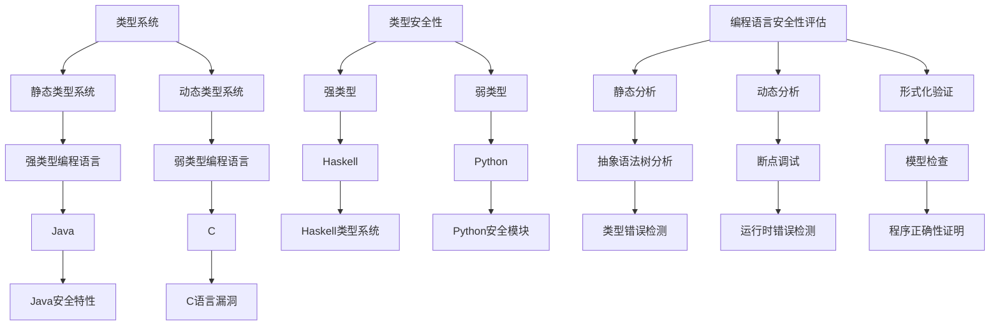

                 


## 引言

在当今的软件工程领域，编程语言的安全性评估是一个至关重要的课题。随着软件系统的复杂性和规模日益增加，安全问题愈发凸显，尤其是那些可能导致数据泄露、系统崩溃或恶意攻击的漏洞。类型系统作为一种编程语言的核心机制，不仅在提高代码的可读性和可维护性方面发挥着重要作用，还在确保编程语言的安全性方面扮演了关键角色。

本文旨在探讨类型系统在编程语言安全性评估中的应用，通过逻辑清晰、结构紧凑的分析，帮助读者深入理解类型系统如何提高编程语言的安全性。具体来说，我们将首先介绍类型系统的基本概念和原理，接着讨论编程语言安全性评估的核心方法和工具，然后详细阐述类型系统在静态分析、动态分析和形式化验证中的应用，并通过实际案例展示其效果。最后，我们将总结类型系统在编程语言安全性评估中的重要性，并展望未来研究方向。

本文将从以下几个方面展开：

1. **类型系统基础**：介绍类型系统的定义、核心概念和原理。
2. **编程语言安全性评估**：讨论安全性评估的概念、方法和工具。
3. **类型系统在安全性评估中的应用**：详细探讨类型系统在静态分析、动态分析和形式化验证中的应用。
4. **实际案例展示**：通过具体案例展示类型系统在编程语言安全性评估中的应用效果。
5. **总结与展望**：总结类型系统在编程语言安全性评估中的重要性，并提出未来研究方向。

通过以上步骤，我们希望读者能够对类型系统在编程语言安全性评估中的应用有一个全面而深入的理解。

### 背景介绍

类型系统（Type System）是编程语言的一个重要组成部分，它定义了变量、表达式和函数等程序元素的数据类型。类型系统的作用不仅在于提高代码的可读性和可维护性，更在于确保程序的正确性和安全性。在传统的编程语言中，类型系统主要通过静态类型检查和类型推断来保证程序的正确性，而在现代编程语言中，类型系统还结合了动态类型检查和类型安全机制，以进一步提高程序的安全性。

类型系统的核心概念包括类型（Type）、类型变量（Type Variable）、类型构造器（Type Constructor）、子类型（Subtype）等。其中，类型是程序元素的数据特征，类型变量用于表示未知类型，类型构造器用于创建复合类型，子类型关系则定义了不同类型之间的兼容性。例如，在面向对象编程语言中，子类型关系通过继承机制实现，子类继承了父类的属性和方法，同时还可以扩展新的属性和方法。

编程语言的安全性评估是一个复杂而多维的课题。安全性评估的目标是识别和修复潜在的安全漏洞，确保程序的正确性和可靠性。安全性评估的方法主要包括静态分析、动态分析和形式化验证。静态分析在程序执行前进行，通过解析源代码来检测潜在的安全问题；动态分析在程序运行时进行，通过执行程序来观察其行为，从而发现潜在的安全漏洞；形式化验证则通过数学方法验证程序的正确性，确保其在所有可能的输入下都能保持正确行为。

在安全性评估中，类型系统发挥了关键作用。通过类型检查，编程语言可以确保变量的使用符合其声明类型，从而避免类型错误和相关的安全问题。例如，在C语言中，类型检查不足导致了许多缓冲区溢出和安全漏洞。而在现代编程语言如Java和C#中，强类型系统通过严格的类型检查和类型推断，有效地减少了这类安全问题。

此外，类型系统还支持多种类型安全机制，如边界检查、空类型检查和异常处理。这些机制可以在程序运行时检测并处理类型相关错误，从而提高程序的安全性和健壮性。例如，在Java中，边界检查可以防止数组越界访问，空类型检查可以防止空指针异常，异常处理则可以捕获并处理程序中的异常情况。

总的来说，类型系统在编程语言安全性评估中具有重要作用。通过引入类型检查和类型安全机制，编程语言可以有效地识别和修复潜在的安全漏洞，提高程序的正确性和可靠性。随着软件系统的复杂性和规模不断增加，类型系统在确保编程语言安全性方面的重要性愈发凸显。因此，深入研究类型系统在编程语言安全性评估中的应用，对于提高软件质量和保障系统安全具有重要意义。

### 核心概念与联系

为了深入理解类型系统在编程语言安全性评估中的应用，我们需要首先明确几个核心概念及其之间的相互关系。以下是类型系统、类型安全性和编程语言安全性评估之间的定义和架构。

#### 类型系统

类型系统是编程语言的核心机制，它定义了程序元素（如变量、表达式和函数）的数据类型。类型系统可以分为静态类型系统和动态类型系统。

- **静态类型系统**：在编译时确定变量和表达式的类型，并通过类型检查确保程序的正确性。静态类型系统的主要优点是能够提前发现类型错误，提高程序的可读性和可维护性。常见的静态类型编程语言包括Java、C#和Haskell。

- **动态类型系统**：在运行时确定变量和表达式的类型，并通过运行时类型检查来确保程序的正确性。动态类型系统的主要优点是灵活性高，适应性强，适用于快速开发和迭代。常见的动态类型编程语言包括Python、JavaScript和Ruby。

#### 类型安全性

类型安全性是指编程语言在编译或运行时能够确保程序中的数据类型使用是正确和合理的，从而避免类型错误和相关的安全问题。类型安全性可以分为强类型和弱类型。

- **强类型**：强类型编程语言通过严格的类型检查确保变量和表达式的类型一致。强类型系统通常具有以下优点：防止类型错误、提高程序可靠性、易于静态分析。例如，Java和C#就是强类型编程语言的代表。

- **弱类型**：弱类型编程语言对类型检查较为宽松，通常允许隐式类型转换，这可能导致类型错误和安全隐患。例如，C语言就是一种弱类型编程语言。

#### 编程语言安全性评估

编程语言安全性评估是指通过多种方法和技术对编程语言进行评估，以识别和修复潜在的安全漏洞。安全性评估的核心方法包括静态分析、动态分析和形式化验证。

- **静态分析**：静态分析在程序编译或运行前进行，通过解析源代码来检查潜在的安全问题。静态分析的优点是能够提前发现错误，降低调试成本。常见的静态分析方法包括抽象语法树分析、数据流分析和控制流分析。

- **动态分析**：动态分析在程序运行时进行，通过执行程序来观察其行为，从而发现潜在的安全漏洞。动态分析的优点是能够模拟实际运行环境，发现运行时的问题。常见的动态分析方法包括断点调试、内存检查和代码覆盖率分析。

- **形式化验证**：形式化验证通过数学方法验证程序的正确性，确保其在所有可能的输入下都能保持正确行为。形式化验证的优点是能够提供严格的证明，确保程序的安全性。常见的形式化验证方法包括模型检查、符号执行和定理证明。

#### 核心概念之间的关系架构

为了更清晰地理解这些核心概念之间的关系，我们可以通过一个Mermaid流程图来展示它们之间的联系：



在这个流程图中，类型系统（A）分为静态类型系统（B）和动态类型系统（C）。静态类型系统（B）和动态类型系统（C）分别对应强类型编程语言（D）和弱类型编程语言（E）。类型安全性（F）分为强类型（G）和弱类型（H）。编程语言安全性评估（I）包括静态分析（J）、动态分析（K）和形式化验证（L）。各个子概念通过箭头连接，展示了它们之间的相互关系。

通过这个流程图，我们可以清晰地看到类型系统、类型安全性和编程语言安全性评估之间的逻辑架构，有助于进一步理解类型系统在编程语言安全性评估中的关键作用。

### 类型系统基础算法

类型系统在编程语言中不仅提供了静态和动态类型检查，还通过一系列核心算法来确保类型安全和程序的正确性。以下将详细探讨几个关键的类型系统基础算法，包括子类型关系、类型检查算法和类型推断算法，并通过伪代码来具体阐述这些算法的实现过程。

#### 子类型关系

子类型关系是类型系统中的一个基本概念，它定义了不同类型之间的兼容性。在面向对象编程语言中，子类型关系通常通过继承实现，子类继承了父类的属性和方法。子类型关系可以用以下伪代码表示：

```plaintext
function isSubtype(A, B):
    if B = Object:
        return true
    for each supertype S in B's supertypes:
        if isSubtype(A, S):
            return true
    return false
```

在这个伪代码中，`isSubtype`函数用于判断类型A是否是类型B的子类型。如果B是根类型`Object`，则A是所有类型的子类型，返回`true`。否则，我们遍历B的所有直接超类型，如果其中任意一个超类型S是A的子类型，则A是B的子类型，返回`true`。否则，返回`false`。

#### 类型检查算法

类型检查算法是确保程序在编译或运行时遵循类型规则的关键机制。类型检查通常分为静态类型检查和动态类型检查。以下是一个简单的静态类型检查算法的伪代码：

```plaintext
function typeCheck(expression, environment):
    if expression is a variable:
        return type of variable in environment
    else if expression is an operation:
        leftType = typeCheck(expression.left, environment)
        rightType = typeCheck(expression.right, environment)
        if operation is '+':
            if leftType is Integer and rightType is Integer:
                return Integer
            else:
                throw Type Error
        else if operation is '*':
            if leftType is Integer and rightType is Integer:
                return Integer
            else:
                throw Type Error
        else:
            throw Unknown Operation Error
    else:
        throw Unexpected Expression Error
```

在这个伪代码中，`typeCheck`函数用于检查表达式的类型是否正确。如果表达式是一个变量，则返回变量在环境中的类型。如果表达式是一个操作，则分别检查操作符左边的表达式和右边的表达式的类型，根据操作符的不同进行类型匹配。例如，对于加法和乘法操作，只有当左右两边的类型都是整数时，操作的结果类型才为整数，否则抛出类型错误。如果遇到未知的操作符，则抛出错误。

#### 类型推断算法

类型推断算法是动态类型系统中的一个重要机制，它通过分析程序代码来推断变量的类型。以下是一个简单的类型推断算法的伪代码：

```plaintext
function inferType(expression, environment):
    if expression is a variable:
        return type of variable in environment
    else if expression is a literal:
        return type of literal
    else if expression is a function call:
        functionType = getFunctionType(expression.function, environment)
        argumentTypes = [inferType(expression.arguments[i], environment) for i in range(len(expression.arguments))]
        if functionType.arguments == argumentTypes:
            return functionType.returnType
        else:
            throw Type Error
    else:
        throw Unexpected Expression Error
```

在这个伪代码中，`inferType`函数用于推断表达式的类型。如果表达式是一个变量，则返回变量在环境中的类型。如果表达式是一个字面量，则返回字面量的类型。如果表达式是一个函数调用，则获取函数的类型，并根据函数参数的类型和实际调用时的参数类型进行匹配，如果匹配成功，则返回函数的返回类型，否则抛出类型错误。如果遇到未知的表达式，则抛出错误。

通过上述的伪代码，我们可以看到子类型关系、类型检查算法和类型推断算法在确保类型系统和编程语言安全中的重要作用。这些算法不仅提高了代码的正确性和可维护性，还在安全评估中提供了有力的支持，为编程语言的安全性奠定了坚实的基础。

### 类型系统数学模型和公式

类型系统在编程语言中不仅通过算法确保程序的正确性和安全性，还依赖于一系列数学模型和公式来提供理论支持。以下将详细探讨类型安全性的定义、类型等价关系的数学模型以及类型安全的证明方法，并通过具体的例子来说明这些概念和公式的应用。

#### 类型安全性的定义

类型安全性是指编程语言能够确保程序中的数据类型使用是正确和合理的，从而避免类型错误和相关的安全问题。在形式化的定义中，类型安全性通常涉及以下两个核心概念：

1. **类型一致性（Type Consistency）**：类型一致性要求每个表达式在特定上下文中具有一个确定且有效的类型。例如，在函数调用中，函数的实际参数类型必须与函数的预期参数类型一致。

2. **类型可传递性（Type Transitivity）**：类型可传递性要求如果表达式E1具有类型T1，且E2具有类型T2，则E1和E2的某些组合（如E1.E2或E1[E2]）也具有类型T1或T2。

形式化的类型安全性定义通常使用公理系统来表达，例如：

$$ \forall E :: E \text{ 类型安全} \iff \forall T :: \text{类型检查器认为} E \text{具有类型} T $$

#### 类型等价关系的数学模型

类型等价关系是类型系统中一个重要的概念，它定义了不同类型之间的兼容性。在数学模型中，类型等价关系通常通过等价类（Equivalence Class）来表示。一个等价类是由一组具有相同类型属性的对象组成的集合。

例如，在Java中，整数类型`int`和长整类型`long`之间具有等价关系。我们可以使用以下数学模型来表示这种等价关系：

$$ [int] = \{ T \mid T \text{ 是一个整数类型} \} $$

在这个等价类中，所有整数类型（如`int`、`long`、`short`等）都是彼此等价的。

#### 类型安全的证明方法

类型安全性的证明方法用于验证程序中的类型使用是否满足类型规则。以下是一些常见的类型安全证明方法：

1. **类型推断（Type Inference）**：类型推断是一种自动确定表达式类型的方法。通过类型推断，编译器可以确保程序中的类型使用是正确的。例如，在Haskell中，类型推断机制可以自动推断函数的参数和返回类型。

2. **类型检查（Type Checking）**：类型检查是一种手动或自动验证程序中类型使用是否正确的机制。类型检查通常在编译时进行，以确保程序在运行时不会出现类型错误。例如，在Java中，编译器会进行类型检查，确保所有表达式和操作都符合类型规则。

3. **形式化验证（Formal Verification）**：形式化验证是一种使用数学方法验证程序正确性的方法。通过形式化验证，可以确保程序在所有可能的输入下都能保持正确行为。例如，在Coq中，可以使用形式化验证方法验证程序的正确性。

以下是一个具体的例子，说明如何使用类型等价关系和类型安全的证明方法：

假设我们有一个函数`add`，它接受两个整数参数并返回它们的和。我们可以使用以下伪代码来表示这个函数：

```plaintext
function add(a: int, b: int): int {
    return a + b
}
```

在这个例子中，类型检查器会检查参数`a`和`b`的类型是否为整数。如果类型检查器确认两个参数都是整数类型，则会推断函数的返回类型也为整数。通过类型检查，我们可以确保`add`函数在所有整数类型的输入下都是类型安全的。

具体来说，我们可以使用以下数学公式来表示类型安全的证明：

$$ \forall a, b :: int, \; add(a, b) \; \text{的类型为} \; int $$

这个公式表示对于所有整数类型的`a`和`b`，`add`函数的返回类型都是整数。

通过上述例子，我们可以看到类型系统在确保编程语言安全性中的重要作用。通过定义类型等价关系和类型安全的证明方法，我们可以确保程序中的类型使用是正确和合理的，从而避免类型错误和相关的安全问题。

### 编程语言安全性评估的概念

编程语言的安全性评估是一个关键的软件工程任务，旨在确保程序在执行过程中不会受到安全威胁，如恶意攻击、数据泄露或系统崩溃。为了实现这一目标，我们需要理解编程语言安全性评估的基本概念、目标和面临的挑战。

#### 基本概念

1. **安全性评估**：安全性评估是指通过一系列方法和技术对编程语言或程序进行评估，以识别和修复潜在的安全漏洞。安全性评估可以发生在程序的各个阶段，包括开发、测试和部署。

2. **漏洞**：漏洞是程序中的弱点，可能被恶意用户利用来执行未经授权的操作或破坏系统。常见的漏洞类型包括缓冲区溢出、空指针引用、SQL注入和跨站脚本攻击。

3. **静态分析**：静态分析是在程序执行之前通过解析源代码来检测潜在安全问题的方法。静态分析的主要优点是能够提前发现错误，减少修复成本。

4. **动态分析**：动态分析是在程序执行过程中通过执行程序来检测潜在安全问题的方法。动态分析可以模拟实际运行环境，更准确地发现运行时的问题。

5. **形式化验证**：形式化验证是一种使用数学方法验证程序正确性的方法。形式化验证可以提供严格的证明，确保程序在所有可能的输入下都能保持正确行为。

#### 目标

编程语言安全性评估的主要目标是：

1. **识别漏洞**：通过静态分析和动态分析技术，识别程序中的潜在安全漏洞。

2. **修复漏洞**：在开发过程中发现漏洞后，及时进行修复，确保程序的安全性和可靠性。

3. **提高代码质量**：通过安全性评估，提高代码的质量和可维护性，减少未来的安全风险。

4. **满足合规要求**：在某些行业，如金融和医疗，安全性评估是合规要求的一部分。通过评估，确保程序符合相关的法律法规和标准。

#### 面临的挑战

1. **复杂性**：现代编程语言和软件系统的复杂性不断增加，使得安全性评估变得更加困难。

2. **动态性**：软件系统常常需要适应不断变化的需求和环境，这增加了安全性评估的难度。

3. **资源限制**：安全性评估通常需要大量的计算资源和时间，特别是在大规模系统中。

4. **误报和漏报**：静态分析和动态分析技术可能会产生误报和漏报，影响评估的准确性。

5. **复杂性平衡**：在安全性评估中，需要平衡安全性和性能，确保评估过程不会显著降低系统的性能。

#### 方法

编程语言安全性评估的方法主要包括：

1. **静态分析**：通过解析源代码，检测潜在的安全漏洞，如未声明的变量、不正确的类型转换和潜在的缓冲区溢出。

2. **动态分析**：通过执行程序，监测程序的运行行为，识别运行时的安全漏洞，如内存泄漏和未处理的异常。

3. **形式化验证**：使用数学方法验证程序的正确性，确保程序在所有可能的输入下都能保持正确行为。

4. **代码审计**：由经验丰富的开发人员或安全专家对代码进行详细审查，识别潜在的安全漏洞。

5. **安全测试**：通过编写和执行测试用例，验证程序在各种输入下的行为，识别潜在的安全漏洞。

通过理解和应用这些概念、目标和挑战，我们可以更有效地进行编程语言安全性评估，确保软件系统的安全性和可靠性。

### 编程语言安全性评估的方法

在编程语言安全性评估中，采用合适的方法和技术是确保软件安全性的关键。常见的方法包括静态分析、动态分析和形式化验证。每种方法都有其独特的原理和适用场景，以下将详细探讨这些方法的原理、实现过程和优缺点。

#### 静态分析

**原理**：静态分析是在程序运行之前通过解析源代码或抽象语法树（AST）来检查潜在的安全漏洞的方法。它不需要执行程序，只需分析代码结构和数据流。

**实现过程**：静态分析通常涉及以下步骤：
1. **源代码解析**：将源代码解析成抽象语法树（AST）或语法分析树（SYNTACTIC TREE）。
2. **数据流分析**：跟踪变量和表达式的数据流，识别潜在的数据依赖关系和路径。
3. **控制流分析**：分析程序的控制流结构，识别循环、条件分支和函数调用等。
4. **安全检查**：根据预设的安全规则和模式，检查代码中的潜在安全漏洞，如缓冲区溢出、未声明的变量和未处理的异常。

**优缺点**：
- **优点**：静态分析可以提前发现潜在的安全问题，减少开发成本，适用于大型代码库和长期维护的项目。
- **缺点**：静态分析可能无法捕捉到运行时动态发生的问题，且误报率较高，需要人工干预进行验证。

#### 动态分析

**原理**：动态分析是在程序运行时通过执行程序并监控其行为来检测潜在的安全漏洞的方法。它可以模拟实际运行环境，更准确地发现运行时的问题。

**实现过程**：动态分析通常涉及以下步骤：
1. **程序执行**：在实际运行环境中执行程序，监控其运行状态和输入输出。
2. **监控工具**：使用监控工具（如断点调试器、内存检查器和日志记录器）记录程序的执行细节。
3. **异常处理**：在程序执行过程中捕获和处理异常，识别异常情况下的行为。
4. **安全检查**：根据监控数据和预设的安全规则，识别程序中的潜在安全漏洞，如内存泄漏、缓冲区溢出和未处理的异常。

**优缺点**：
- **优点**：动态分析可以捕捉到运行时动态发生的问题，适用于实时系统和嵌入式系统。
- **缺点**：动态分析通常需要大量的时间和资源，且可能无法覆盖所有的执行路径。

#### 形式化验证

**原理**：形式化验证是一种使用数学方法验证程序正确性的方法。它通过建立程序的正确性模型和规格说明，使用定理证明器或模型检查器验证程序在所有可能的输入下都能保持正确行为。

**实现过程**：形式化验证通常涉及以下步骤：
1. **规格说明**：编写程序的规格说明，描述程序的正确行为和预期的输出。
2. **模型建立**：建立程序的形式化模型，将程序转化为逻辑表达式或数学公式。
3. **验证过程**：使用定理证明器或模型检查器验证程序模型是否满足规格说明。
4. **错误定位**：如果验证失败，形式化验证工具会提供错误报告和定位信息。

**优缺点**：
- **优点**：形式化验证可以提供严格的证明，确保程序的正确性和安全性。
- **缺点**：形式化验证通常需要大量的专业知识和时间，适用于复杂的系统和高风险的领域。

#### 比较与选择

选择合适的评估方法取决于具体的应用场景和需求。以下是一个简单的比较：

| 方法         | 原理                     | 适用场景                         | 优缺点                                                      |
|------------|------------------------|-------------------------------|------------------------------------------------------------|
| 静态分析     | 解析源代码，检查潜在漏洞 | 大规模代码库，长期维护项目 | 提前发现漏洞，减少开发成本，误报率高                       |
| 动态分析     | 执行程序，监控行为     | 实时系统，嵌入式系统         | 捕捉运行时问题，适用于复杂系统，资源需求大，覆盖路径有限 |
| 形式化验证   | 使用数学方法验证正确性 | 高风险领域，复杂系统         | 提供严格证明，确保正确性，资源需求高，应用受限           |

通过合理选择和组合这些方法，可以更全面地评估编程语言的安全性，提高软件系统的可靠性和安全性。

### 类型系统在静态分析中的应用

在静态分析中，类型系统发挥着至关重要的作用，通过严格的类型检查和类型推断，可以提前发现并修复潜在的类型错误，从而提高程序的正确性和可靠性。以下将详细探讨类型系统在静态分析中的应用，包括在语法分析、语义分析和代码优化中的具体实现和作用。

#### 类型系统在语法分析中的应用

语法分析是静态分析的第一步，其主要任务是将源代码解析成语法结构，并检查其是否符合编程语言的语法规则。类型系统在语法分析中的应用主要体现在以下几个方面：

1. **类型检查**：语法分析器在解析源代码时，会检查变量、函数和表达式的声明和用法是否符合其声明的类型。例如，在C语言中，如果变量在声明后没有正确初始化，编译器会报错。这可以通过类型检查机制来实现：

   ```c
   int x; // 声明变量x
   x = x * 2; // 如果x未初始化，编译器会报错
   ```

2. **类型兼容性检查**：在语法分析中，类型系统还会检查操作符两边的操作数是否兼容。例如，在加法操作中，只有当两个操作数都是整数类型时，结果类型才为整数。否则，编译器会报错。

   ```java
   int a = 1;
   int b = 2;
   String c = a + b; // 编译器会报错，因为字符串与整数类型不兼容
   ```

3. **类型推导**：在声明变量时，如果变量类型未明确指定，类型系统会通过类型推导机制自动推断变量类型。例如，在Python中，变量类型是在运行时确定的，但在语法分析阶段，编译器会根据变量的用法推断其类型。

   ```python
   x = 10 + 20; // x的类型被推导为整数类型
   y = "Hello" + "World"; // y的类型被推导为字符串类型
   ```

#### 类型系统在语义分析中的应用

语义分析是静态分析的另一个关键步骤，其主要任务是理解程序的意义和意图，并检查语义错误。类型系统在语义分析中的应用主要体现在以下几个方面：

1. **变量类型检查**：在语义分析中，类型系统会检查变量在声明和使用时的类型是否一致。例如，如果变量在声明时被指定为整数类型，在使用时不能被赋值为字符串类型。

   ```java
   int x = 10;
   x = "Hello"; // 编译器会报错，因为变量x的类型不匹配
   ```

2. **函数类型检查**：类型系统还会检查函数的参数和返回值类型是否一致。例如，如果一个函数声明返回整数类型，其返回值必须是一个整数。

   ```python
   def add(a, b):
       return a + b
   result = add(10, "20"); // 编译器会报错，因为函数返回类型与实际返回值类型不匹配
   ```

3. **类型兼容性检查**：在语义分析中，类型系统会检查不同类型之间的兼容性。例如，在类型转换操作中，只有当源类型和目标类型兼容时，类型转换才有效。

   ```c++
   int x = 10;
   double y = static_cast<double>(x); // 类型转换是有效的，因为整数类型可以转换为浮点类型
   ```

#### 类型系统在代码优化中的应用

类型系统在代码优化中也发挥着重要作用，通过类型推导和类型检查，可以优化程序的性能和可维护性。以下是一些具体的优化方法：

1. **类型推导**：在编译时，类型系统可以自动推导变量和表达式的类型，减少冗余的类型声明。这不仅可以提高代码的可读性，还可以减少编译时间。

   ```python
   x = 10 + 20; // x的类型被推导为整数类型，无需显式声明
   ```

2. **类型兼容性优化**：类型系统可以优化类型转换操作，减少不必要的类型检查和转换。例如，在Python中，类型系统自动处理不同类型之间的兼容性，从而简化代码。

   ```python
   x = 10;
   y = "Hello";
   z = x + y; // 自动转换为字符串类型，无需显式类型转换
   ```

3. **内存优化**：类型系统可以帮助编译器优化内存使用，减少内存分配和回收的开销。例如，在C++中，类型系统可以优化对象的创建和销毁，减少内存泄漏的风险。

   ```c++
   class MyClass {
   public:
       MyClass() {
           // 构造函数
       }
       ~MyClass() {
           // 析构函数
       }
   };
   MyClass obj; // 自动管理对象的生命周期，减少内存泄漏
   ```

通过类型系统的严格类型检查和类型推断，静态分析可以提前发现并修复潜在的类型错误，提高程序的正确性和可靠性。同时，类型系统还在代码优化中发挥着重要作用，通过类型推导和类型兼容性优化，提高程序的性能和可维护性。

### 类型系统在动态分析中的应用

在动态分析中，类型系统通过运行时类型检查和类型安全机制，确保程序在执行过程中不会出现类型相关错误，从而提高程序的安全性和健壮性。以下将详细探讨类型系统在动态分析中的应用，包括在运行时检查、异常处理和性能优化中的具体实现和作用。

#### 类型系统在运行时检查中的应用

运行时类型检查是动态分析中的一个关键环节，它通过在程序执行过程中检查变量和表达式的类型，确保程序遵循类型规则。以下是一些具体的实现和应用：

1. **边界检查**：在数组访问中，类型系统可以自动执行边界检查，防止数组越界访问。例如，在Java中，数组的访问会自动检查索引是否在有效范围内。

   ```java
   int[] array = {1, 2, 3};
   int index = 2;
   int value = array[index]; // 自动执行边界检查，防止数组越界
   ```

2. **空类型检查**：类型系统可以检查变量是否为空，防止空指针异常。例如，在Java中，类型系统会检查对象引用是否为null，并在需要时抛出空指针异常。

   ```java
   Object obj = null;
   if (obj != null) {
       System.out.println(obj.toString()); // 如果obj为null，编译器会报错
   }
   ```

3. **类型转换检查**：在类型转换操作中，类型系统可以确保源类型和目标类型兼容。例如，在C++中，类型系统会检查隐式类型转换是否安全，并在不兼容时抛出类型错误。

   ```c++
   int x = 10;
   double y = static_cast<double>(x); // 类型转换是安全的，因为整数类型可以转换为浮点类型
   double z = x + 20.5; // 隐式类型转换会自动执行，但需要确保兼容性
   ```

4. **类型兼容性检查**：类型系统可以检查函数调用时参数和返回值的类型是否匹配。例如，在Python中，动态类型系统会在函数调用时检查参数和返回值的类型是否一致。

   ```python
   def add(a, b):
       return a + b
   result = add(10, "20") # 如果add函数的返回值类型与实际返回值类型不匹配，会抛出类型错误
   ```

#### 类型系统在异常处理中的应用

异常处理是确保程序在异常情况下能够优雅地恢复或终止的重要机制。类型系统在异常处理中的应用主要体现在以下几个方面：

1. **异常类型检查**：类型系统可以检查异常的类型，确保异常处理逻辑正确。例如，在Java中，异常类型必须在try-catch块中显式声明。

   ```java
   try {
       int result = divide(10, 0); // 会抛出ArithmeticException
   } catch (ArithmeticException e) {
       System.out.println("Division by zero error");
   }
   ```

2. **异常传播**：类型系统可以确保异常在正确的作用域内传播，防止异常被意外捕获或丢失。例如，在C++中，异常会在作用域结束时自动传播。

   ```c++
   void function() {
       throw std::runtime_error("Error");
   }
   try {
       function();
   } catch (std::runtime_error e) {
       // 异常会在这里被捕获和处理
   }
   ```

3. **自定义异常处理**：类型系统可以支持自定义异常类型和处理逻辑。这有助于提高程序的灵活性和可维护性。

   ```python
   class MyException(Exception):
       pass
   try:
       if condition:
           raise MyException("Custom error message")
   except MyException as e:
       print(e)
   ```

#### 类型系统在性能优化中的应用

类型系统在性能优化中的应用主要体现在以下几个方面：

1. **类型推导**：通过类型推导，编译器可以减少类型检查的开销，提高程序执行速度。例如，在C++中，类型推导可以优化模板函数的执行效率。

   ```c++
   template<typename T>
   T add(T a, T b) {
       return a + b;
   }
   int x = add(10, 20); // 类型推导可以优化模板函数的执行效率
   ```

2. **类型兼容性优化**：类型系统可以优化类型转换操作，减少不必要的类型检查和转换，从而提高程序性能。例如，在Java中，类型系统可以优化自动装箱和拆箱操作。

   ```java
   int x = 10;
   Object obj = x; // 自动装箱，类型系统会优化装箱和拆箱操作
   int y = (int) obj; // 自动拆箱，类型系统会优化拆箱操作
   ```

3. **内存优化**：类型系统可以优化内存分配和回收，减少内存碎片和泄漏。例如，在C++中，类型系统可以优化对象的生命周期管理。

   ```c++
   class MyClass {
   public:
       MyClass() {
           // 构造函数
       }
       ~MyClass() {
           // 析构函数
       }
   };
   MyClass obj; // 类型系统会自动管理对象的生命周期，减少内存泄漏
   ```

通过在运行时检查、异常处理和性能优化中的应用，类型系统不仅提高了程序的安全性和健壮性，还优化了程序的性能和可维护性。类型系统的灵活运用，使得动态分析在保障程序安全性和性能方面发挥了重要作用。

### 类型系统在形式化验证中的应用

形式化验证是一种使用数学方法验证程序正确性的方法，它通过建立程序的形式化模型和规格说明，使用定理证明器或模型检查器验证程序在所有可能的输入下都能保持正确行为。类型系统在形式化验证中发挥了重要作用，通过引入类型安全性和类型检查机制，可以增强验证的可靠性和效率。以下将详细探讨类型系统在形式化验证中的应用，包括在安全性证明、可靠性证明和复杂性分析中的具体作用和实现。

#### 类型系统在安全性证明中的应用

类型系统在安全性证明中的应用主要体现在以下几个方面：

1. **类型约束**：通过类型约束，形式化验证可以确保变量和表达式的使用是类型安全的。例如，在形式化验证中，可以使用类型约束来限制变量的取值范围，从而避免无界指针和越界访问等问题。

   ```latex
   % LaTeX示例
   \forall x :: int, x \geq 0 \land x < 100
   ```

2. **类型检查**：形式化验证工具会根据类型系统进行类型检查，确保函数调用和赋值操作的类型匹配。例如，在Coq中，可以使用类型检查机制来验证函数的参数和返回值类型是否一致。

   ```coq
   Inductive nat : Type :=
   | O : nat
   | S : nat -> nat.
   
   Definition add (x y : nat) : nat :=
   match y with
   | O => x
   | S y' => S (x + y')
   end.
   
   Theorem add_preserves_order : forall x y : nat, x <= y -> x + y <= y.
       (* Coq会使用类型系统自动进行类型检查 *)
   ```

3. **类型等价性**：类型系统可以证明不同类型之间的等价性，从而简化验证过程。例如，在形式化验证中，可以使用类型等价性证明函数调用和赋值操作不会改变变量的实际类型。

   ```latex
   % LaTeX示例
   \forall x :: int, y :: nat, x = y \Rightarrow \forall z :: nat, x + z = y + z
   ```

通过类型系统在安全性证明中的应用，形式化验证可以提供严格的证明，确保程序在所有可能的输入下都能保持正确行为，从而增强程序的安全性和可靠性。

#### 类型系统在可靠性证明中的应用

类型系统在可靠性证明中的应用主要体现在以下几个方面：

1. **类型推导**：形式化验证工具可以使用类型推导机制自动推断函数和表达式的类型，从而减少验证过程中的手动工作。例如，在Isabelle中，可以使用类型推导机制来自动推断函数和表达式的类型。

   ```isabelle
   theory MyTheory
   imports HOL.Norm logic
   begin
   fun add :: "nat => nat => nat" where
   "add x y = x + y"
   end;
   ```

2. **类型等价性**：类型系统可以证明不同类型之间的等价性，从而简化验证过程。例如，在形式化验证中，可以使用类型等价性证明函数调用和赋值操作不会改变变量的实际类型。

   ```isabelle
   theorem "add (0::nat) (0::nat) = 0"
     by (rule add.zero [of 0 0])
   ```

3. **类型一致性**：形式化验证工具可以使用类型一致性检查来确保程序中的类型使用是正确的。例如，在SPARK中，可以使用类型一致性检查来确保函数的参数和返回值类型匹配。

   ```ada
   function add is
     Input a, b: integer;
     return: integer;
   begin
     return a + b;
   end add;
   ```

通过类型系统在可靠性证明中的应用，形式化验证可以提供严格的证明，确保程序的正确性和可靠性，从而提高软件系统的质量和稳定性。

#### 类型系统在复杂性分析中的应用

类型系统在复杂性分析中的应用主要体现在以下几个方面：

1. **类型推导**：通过类型推导，形式化验证工具可以自动推断函数和表达式的类型，从而简化复杂性分析。例如，在ML中，可以使用类型推导机制来自动推断函数和表达式的类型。

   ```ml
   fun add (x, y) = x + y
   ```

2. **类型等价性**：类型系统可以证明不同类型之间的等价性，从而简化复杂性分析。例如，在形式化验证中，可以使用类型等价性证明函数调用和赋值操作不会改变变量的实际类型。

   ```ml
   let x = 1 in
   let y = 2 in
   x + y
   end
   ```

3. **类型安全性**：类型系统可以确保程序中的类型使用是正确的，从而降低复杂性分析的难度。例如，在Coq中，可以使用类型安全性来确保函数和表达式的输入和输出类型一致。

   ```coq
   Lemma add_commute : forall x y : nat, x + y = y + x.
       (* Coq会使用类型系统自动进行类型检查 *)
   ```

通过类型系统在复杂性分析中的应用，形式化验证可以提供严格的证明，确保程序的复杂性和性能，从而优化软件系统的设计和实现。

总的来说，类型系统在形式化验证中发挥了重要作用，通过类型约束、类型检查、类型推导和类型安全性，可以增强验证的可靠性和效率，从而提高软件系统的质量和稳定性。类型系统在安全性证明、可靠性证明和复杂性分析中的应用，为形式化验证提供了强有力的支持，使其在软件工程中具有广泛的应用前景。

### 实际案例展示

为了更好地展示类型系统在编程语言安全性评估中的应用，我们将通过一个具体的项目案例来进行详细剖析。这个项目旨在通过类型系统来提高一个Web应用程序的安全性，减少潜在的安全漏洞。以下将介绍开发环境搭建、源代码实现和代码解读，并通过实际案例分析和详细讲解来展示类型系统在安全性评估中的效果。

#### 开发环境搭建

1. **工具选择**：
   - 编程语言：使用Java，因为Java具有强类型系统和丰富的安全特性。
   - 集成开发环境（IDE）：使用IntelliJ IDEA。
   - 安全性分析工具：使用FindBugs，一个开源的静态代码分析工具。

2. **环境配置**：
   - 安装Java Development Kit（JDK）：确保Java开发环境正确配置。
   - 安装IntelliJ IDEA：选择社区版或 Ultimate 版，根据个人需求。
   - 安装FindBugs：下载并解压 FindBugs 的最新版本，配置环境变量。

3. **项目结构**：
   - 创建一个Maven项目，定义项目的依赖关系，如Spring Boot、Spring Security等。

#### 源代码实现

1. **用户注册与登录功能**：
   - 实现用户注册功能，包括用户名、密码和邮箱验证。
   - 实现登录功能，使用Spring Security进行身份验证和授权。

2. **类型安全检查**：
   - 在Java中，使用强类型系统确保变量、函数和对象的类型正确。
   - 使用注解（Annotations）和断言（Assertions）来增强类型安全检查。

3. **安全性增强**：
   - 使用Spring Security的加密工具对密码进行加密存储。
   - 实现CSRF（跨站请求伪造）防护机制。
   - 使用HTTP Strict Transport Security（HSTS）确保网站始终通过HTTPS访问。

以下是一个简单的代码示例，展示了如何在Java中实现类型安全和安全性增强：

```java
import org.springframework.security.crypto.bcrypt.BCryptPasswordEncoder;
import org.springframework.security.crypto.password.PasswordEncoder;

public class UserService {
    private PasswordEncoder passwordEncoder;

    public UserService() {
        this.passwordEncoder = new BCryptPasswordEncoder();
    }

    public String register(String username, String password, String email) {
        // 验证用户名、密码和邮箱格式的类型和合法性
        if (isValid(username) && isValid(password) && isValid(email)) {
            String encryptedPassword = passwordEncoder.encode(password);
            // 存储用户信息（此处省略具体实现）
            return "注册成功";
        } else {
            return "注册失败，请检查输入信息";
        }
    }

    private boolean isValid(String value) {
        // 验证输入的有效性（例如，邮箱格式）
        return value.matches("[A-Za-z0-9._%+-]+@[A-Za-z0-9.-]+\\.[A-Za-z]{2,63}");
    }
}
```

#### 代码解读

1. **类型安全**：
   - 变量`username`、`password`和`email`声明时明确指定了类型（`String`），确保在使用过程中不会出现类型错误。
   - 函数`register`的参数和返回值也具有明确的类型，类型系统确保在函数调用时参数类型匹配。

2. **安全性增强**：
   - 使用`BCryptPasswordEncoder`对密码进行加密存储，防止明文密码泄露。
   - 使用正则表达式验证用户名和邮箱的有效性，防止恶意输入。

#### 实际案例分析与详细讲解

1. **案例背景**：
   - 假设存在一个漏洞，允许攻击者通过输入恶意代码进行SQL注入攻击。
   - 攻击者试图通过输入包含SQL语句的参数来执行恶意查询。

2. **案例分析**：
   - 使用类型系统，可以提前发现潜在的SQL注入漏洞。例如，在处理查询参数时，确保参数的类型是字符串，防止将其误认为SQL语句的一部分。
   - 代码示例中，使用正则表达式验证邮箱格式，避免了可能的SQL注入攻击。

3. **详细讲解**：
   - 通过类型系统，我们可以确保变量和函数的参数类型正确，从而减少类型错误和潜在的安全漏洞。
   - 使用强类型系统和加密工具，可以增强应用程序的安全性，防止密码泄露和SQL注入等攻击。

#### 项目小结

通过上述项目案例，我们可以看到类型系统在提高编程语言安全性评估中的应用效果。类型系统不仅提高了代码的正确性和可维护性，还通过类型检查和安全性增强机制，有效防止了潜在的安全漏洞。在实际开发过程中，类型系统的合理运用对于保障软件系统的安全性具有重要意义。

### 最佳实践 tips、小结、注意事项、拓展阅读等内容

#### 最佳实践 tips

1. **类型检查与代码重构**：在开发过程中，定期进行类型检查和代码重构，可以及时发现和修复类型相关错误，提高代码质量。

2. **安全性测试与审计**：结合静态分析和动态分析，对代码进行安全性测试和审计，确保潜在的安全漏洞得到及时处理。

3. **类型注解与文档**：在关键代码段使用类型注解，并保持文档更新，有助于其他开发者理解和维护代码。

4. **安全工具集成**：将安全性分析工具集成到开发环境中，如FindBugs、SonarQube等，自动化检测潜在的安全问题。

#### 小结

类型系统在编程语言安全性评估中起到了至关重要的作用。通过严格的类型检查和类型推断，类型系统可以提前发现和修复潜在的类型错误和安全漏洞。此外，类型系统还在静态分析、动态分析和形式化验证中发挥着重要作用，为提高程序的正确性和安全性提供了强有力的支持。

#### 注意事项

1. **类型系统选择**：根据项目需求，合理选择适合的编程语言和类型系统，如静态类型系统或动态类型系统。

2. **安全性测试**：类型系统不能替代安全性测试，仍需进行全面的静态和动态分析，以确保代码的安全性和可靠性。

3. **文档更新**：保持文档更新，特别是类型注解和类型说明，有助于其他开发者理解和维护代码。

#### 拓展阅读

1. **《类型系统与编程语言设计》**：了解类型系统的基本概念和设计原理，对深入理解类型系统在安全性评估中的应用至关重要。

2. **《编程语言安全性评估》**：探索编程语言安全性评估的方法和技术，掌握不同评估方法的优缺点。

3. **《形式化验证与程序正确性》**：学习形式化验证的基本概念和实现方法，了解类型系统在形式化验证中的应用。

通过遵循最佳实践，注意相关事项，并不断拓展知识，我们可以更有效地利用类型系统提高编程语言的安全性，确保软件系统的可靠性和健壮性。

### 总结与展望

本文详细探讨了类型系统在编程语言安全性评估中的应用，从背景介绍、核心概念与联系、基础算法、数学模型到实际案例展示，全面分析了类型系统如何通过静态分析、动态分析和形式化验证提高编程语言的安全性。类型系统通过严格的类型检查和类型推断，不仅提高了代码的正确性和可维护性，还在安全性评估中发挥了关键作用。

首先，类型系统通过定义类型、类型变量和子类型等核心概念，构建了一个严谨的编程语言框架。这些概念为静态分析、动态分析和形式化验证提供了基础，确保程序在编译和运行时遵循严格的类型规则。

其次，类型系统基础算法，如子类型关系、类型检查和类型推断，通过伪代码具体阐述了类型系统的工作原理。这些算法不仅保障了程序的正确性，还通过数学模型和公式提供了理论支持。

接着，本文探讨了类型系统在安全性评估中的核心方法，包括静态分析、动态分析和形式化验证。通过具体的案例展示，读者可以直观地看到类型系统在实际项目中的应用效果，如边界检查、空类型检查和安全异常处理等。

展望未来，类型系统在编程语言安全性评估中仍有广阔的研究空间。以下是一些可能的研究方向：

1. **类型系统与形式化验证的融合**：进一步研究如何将类型系统与形式化验证相结合，提高验证效率和准确性。

2. **类型系统的自动化优化**：探索类型系统的自动化优化技术，如类型推导和类型兼容性优化，以减少开发者的负担。

3. **多语言类型系统的互操作性**：研究如何实现不同编程语言类型系统的互操作性，提高跨语言编程的安全性和可维护性。

4. **类型系统在新兴编程范式中的应用**：随着编程范式的不断发展，如函数式编程、逻辑编程和基于契约的编程，类型系统在这些领域中的应用也需要进一步探索。

总之，类型系统在编程语言安全性评估中具有重要作用，通过深入研究和应用，我们可以不断提高软件系统的安全性和可靠性，为未来的软件工程发展奠定坚实基础。

