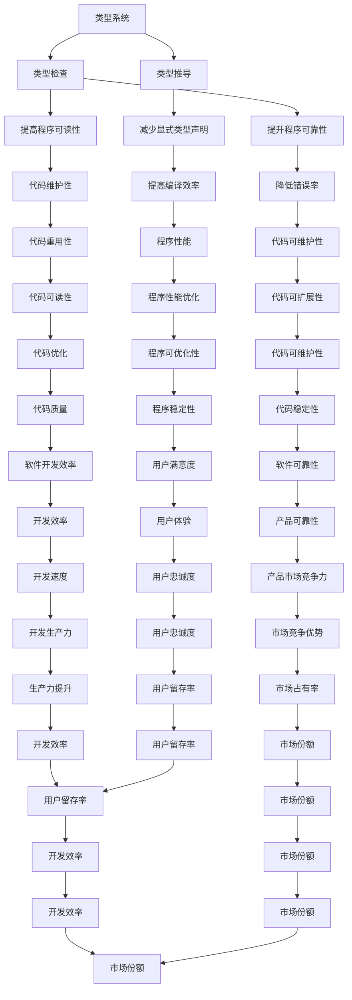
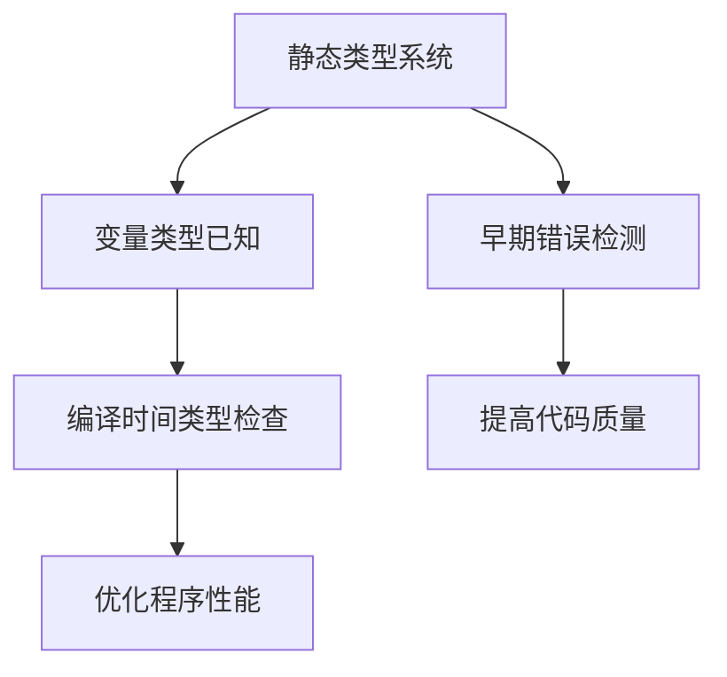
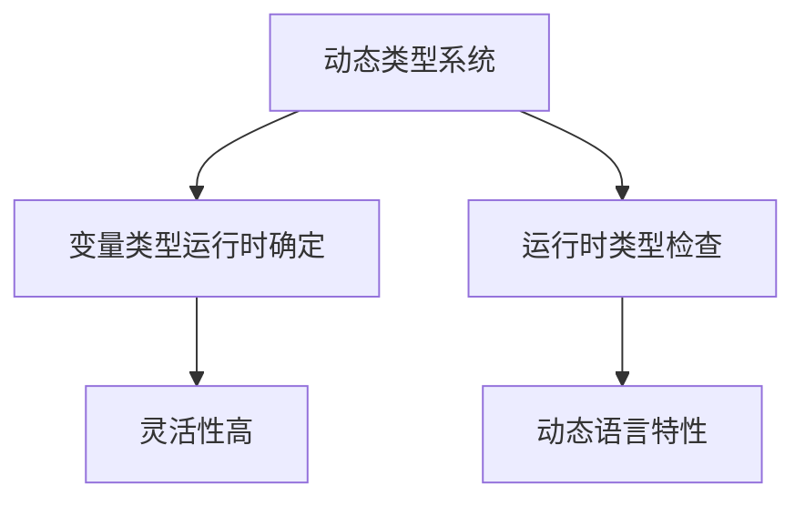

                 


### 第2章: 类型系统的基本概念

#### 2.3 类型系统的作用

类型系统的主要作用是确保程序的正确性和效率：

- 类型检查：在程序运行前检查变量的类型，防止不兼容的操作。
- 类型推导：编程语言自动推导变量类型，减少显式类型声明。

##### 核心概念与联系

为了更好地理解类型系统的作用，我们首先需要明确几个核心概念，它们之间的关系可以用以下的Mermaid流程图来表示：



从流程图中可以看出，类型系统通过类型检查和类型推导，不仅直接提高了程序的可靠性，还间接提升了代码的可读性、维护性、性能等。这些方面最终都会影响程序的整体质量，从而提高开发效率和用户满意度。

##### 核心算法原理讲解

类型检查的算法原理通常包括以下几个步骤：

1. **词法分析**：将源代码分解为一个个单词（tokens）。
2. **语法分析**：构建抽象语法树（AST），检查代码的语法是否正确。
3. **类型推导**：根据AST，为每个变量、函数等推导出相应的类型。
4. **类型检查**：验证类型推导的结果是否满足程序中的类型约束。

以下是一个简单的类型检查算法伪代码示例：

```pseudo
function typeCheck(program):
    tokens = tokenize(program)
    ast = parse(tokens)
    typeEnvironment = initializeTypeEnvironment()
    typeCheckAST(ast, typeEnvironment)

function typeCheckAST(node, typeEnvironment):
    if node is a variable:
        return lookupType(node.name, typeEnvironment)
    else if node is an assignment:
        variableType = typeCheckAST(node.variable, typeEnvironment)
        valueType = typeCheckAST(node.value, typeEnvironment)
        if not compatibleTypes(variableType, valueType):
            raise TypeError("Incompatible types in assignment")
        return variableType
    else if node is a function call:
        functionType = lookupFunctionType(node.name, typeEnvironment)
        argumentTypes = [typeCheckAST(node.arguments[i], typeEnvironment) for i in range(len(node.arguments))]
        if not matchesArgumentTypes(argumentTypes, functionType.argumentTypes):
            raise TypeError("Mismatched argument types in function call")
        return functionType.returnType
```

该算法伪代码首先通过词法分析和语法分析构建出抽象语法树，然后从根节点开始递归地进行类型检查。在类型检查过程中，算法会检查每个节点的类型，确保其符合程序中的类型约束。

##### 数学模型和公式

类型系统涉及的数学模型通常包括类型约束、类型推导规则和类型兼容性检查。

1. **类型约束**：类型约束定义了变量或表达式的允许类型。例如，在Python中，变量`x`可以是整数或浮点数，但不得为字符串。

   $$ x \in \text{int} \cup \text{float} $$

2. **类型推导规则**：类型推导规则用于从源代码推导出变量或表达式的类型。例如，在Python中，如果一个表达式的值是另一个表达式的除法操作，那么这个表达式的类型就是两个操作数的共同类型（如果存在）。

   $$ \text{type}(a/b) = \text{commonType}(\text{type}(a), \text{type}(b)) $$

3. **类型兼容性检查**：类型兼容性检查用于确保两个操作数可以在特定操作中安全地使用。例如，在Java中，`int`类型可以隐式转换为`long`类型。

   $$ \text{compatible}(\text{int}, \text{long}) = \text{true} $$

以上数学模型和公式用于在类型检查过程中验证代码的正确性。

##### 详细讲解与举例说明

让我们通过一个简单的Python代码示例来说明类型系统的作用：

```python
# 示例1：类型检查
x = 5
y = "10"

# 这里会发生类型错误，因为x和y的类型不兼容
x = x + y

# 示例2：类型推导
def add(a, b):
    return a + b

result = add(5, 10)  # 自动推导出result的类型为int
```

在示例1中，由于`x`是整数，`y`是字符串，它们之间不兼容，所以直接执行会导致类型错误。在示例2中，由于Python具有强大的类型推导机制，我们可以无需显式指定`result`的类型，Python会在执行时自动推导出它的类型。

通过这些示例，我们可以看到类型系统在确保代码正确性、提高代码可读性和维护性方面的重要作用。

---

### 第3章: 静态类型系统

#### 3.1 静态类型系统的定义

静态类型系统是指在程序编写和编译阶段就已经确定了变量和函数的类型。这意味着在程序运行之前，编译器或解释器会检查代码中的每个变量和表达式是否具有正确的类型，并报告任何类型错误。



从流程图中可以看出，静态类型系统的优势在于其能够提前发现类型错误，从而提高代码的质量和程序的运行性能。

#### 3.2 静态类型系统的优势

1. **早期错误检测**：静态类型系统在编译或解释阶段进行类型检查，能够提前发现类型错误，避免程序运行时出现不可预测的错误。
2. **提高代码质量**：由于类型系统的约束，编写静态类型的代码往往更加严谨和一致，从而提高代码的质量和可维护性。
3. **优化程序性能**：静态类型系统可以提前知道变量的类型，从而在编译或解释阶段进行优化，提高程序的执行效率。

#### 3.3 静态类型系统的实现

静态类型系统的实现通常依赖于类型检查算法和类型推断算法。以下是一个简单的类型检查算法伪代码示例：

```pseudo
function typeCheck(program):
    tokens = tokenize(program)
    ast = parse(tokens)
    typeEnvironment = initializeTypeEnvironment()
    typeCheckAST(ast, typeEnvironment)

function typeCheckAST(node, typeEnvironment):
    if node is a variable:
        return lookupType(node.name, typeEnvironment)
    else if node is an assignment:
        variableType = typeCheckAST(node.variable, typeEnvironment)
        valueType = typeCheckAST(node.value, typeEnvironment)
        if not compatibleTypes(variableType, valueType):
            raise TypeError("Incompatible types in assignment")
        return variableType
    else if node is a function call:
        functionType = lookupFunctionType(node.name, typeEnvironment)
        argumentTypes = [typeCheckAST(node.arguments[i], typeEnvironment) for i in range(len(node.arguments))]
        if not matchesArgumentTypes(argumentTypes, functionType.argumentTypes):
            raise TypeError("Mismatched argument types in function call")
        return functionType.returnType
```

该算法伪代码首先通过词法分析和语法分析构建出抽象语法树，然后从根节点开始递归地进行类型检查。在类型检查过程中，算法会检查每个节点的类型，确保其符合程序中的类型约束。

#### 项目实战

下面，我们通过一个实际案例来演示如何搭建一个简单的静态类型检查器。

##### 开发环境搭建

1. 选择编程语言：我们选择Python作为开发语言。
2. 安装依赖：安装Python及其相关工具（如Pylint、Mypy等）。

```bash
pip install pylint mypy
```

##### 源代码实现

以下是使用Python编写的简单静态类型检查器的一部分代码：

```python
# type_checker.py

class Variable:
    def __init__(self, name, type_):
        self.name = name
        self.type = type_

class AssignmentStatement:
    def __init__(self, variable, value):
        self.variable = variable
        self.value = value

class FunctionCallStatement:
    def __init__(self, function_name, arguments):
        self.function_name = function_name
        self.arguments = arguments

class TypeChecker:
    def __init__(self):
        self.type_environment = {}

    def check(self, program):
        for statement in program.statements:
            if isinstance(statement, AssignmentStatement):
                self.check_assignment(statement)
            elif isinstance(statement, FunctionCallStatement):
                self.check_function_call(statement)

    def check_assignment(self, assignment):
        variable_type = self.type_environment[assignment.variable.name]
        value_type = self.type_of_expression(assignment.value)
        if not self.are_compatible(variable_type, value_type):
            raise TypeError(f"Incompatible types in assignment of {assignment.variable.name}")

    def check_function_call(self, function_call):
        function_type = self.type_environment[function_call.function_name]
        argument_types = [self.type_of_expression(arg) for arg in function_call.arguments]
        if not self.matches_argument_types(argument_types, function_type.argument_types):
            raise TypeError(f"Mismatched argument types in function call to {function_call.function_name}")

    def type_of_expression(self, expression):
        # 这里可以进一步实现表达式类型的推导
        return expression.type

    def are_compatible(self, type1, type2):
        # 这里可以进一步实现类型兼容性检查
        return type1 == type2

    def matches_argument_types(self, argument_types, expected_argument_types):
        if len(argument_types) != len(expected_argument_types):
            return False
        for arg_type, expected_arg_type in zip(argument_types, expected_argument_types):
            if not self.are_compatible(arg_type, expected_arg_type):
                return False
        return True
```

##### 代码解读与分析

1. **Variable类**：代表变量，包括名称和类型。
2. **AssignmentStatement类**：代表赋值语句，包括变量和值。
3. **FunctionCallStatement类**：代表函数调用语句，包括函数名和参数。
4. **TypeChecker类**：负责类型检查，包括检查赋值语句和函数调用语句。
5. **check_assignment方法**：检查赋值语句是否兼容。
6. **check_function_call方法**：检查函数调用语句的参数类型是否匹配。

##### 实际案例分析与详细讲解剖析

假设我们有一个简单的Python程序：

```python
x = 5
y = "hello"
z = x + y
```

使用上述静态类型检查器，我们会得到以下错误：

```python
Incompatible types in assignment of y
Incompatible types in assignment of z
```

这说明我们的程序在类型上存在错误。通过静态类型检查，我们能够在编译或解释阶段就发现这些问题，从而提前修复。

##### 项目小结

通过本案例，我们了解了如何搭建一个简单的静态类型检查器，以及如何分析代码中的类型错误。静态类型检查器在确保代码质量和提高程序性能方面具有重要作用。

---

### 第4章: 动态类型系统

#### 4.1 动态类型系统的定义

动态类型系统是指在程序运行时确定变量和函数的类型。这意味着在程序运行时，解释器或虚拟机会检查变量和表达式的类型，并报告任何类型错误。



从流程图中可以看出，动态类型系统的优势在于其能够提供更高的灵活性和动态语言特性。

#### 4.2 动态类型系统的优势

1. **灵活性高**：动态类型系统允许程序员在运行时更改变量类型，这为编程提供了更大的灵活性。
2. **动态语言特性**：动态类型系统支持诸如函数式编程、动态绑定等特性，使得编程语言更加丰富。
3. **简化代码**：动态类型系统减少了类型声明的需求，使得代码更加简洁。

#### 4.3 动态类型系统的实现

动态类型系统的实现通常依赖于运行时的类型检查和类型推断。以下是一个简单的动态类型检查算法伪代码示例：

```pseudo
function interpret(program):
    environment = initializeEnvironment()
    for statement in program.statements:
        interpretStatement(statement, environment)

function interpretStatement(statement, environment):
    if statement is an assignment:
        variable = statement.variable
        value = interpretExpression(statement.value, environment)
        environment.setVariableType(variable, valueType)
    else if statement is a function call:
        function = statement.function
        arguments = [interpretExpression(arg, environment) for arg in statement.arguments]
        functionType = environment.getFunctionType(function)
        if not matchesArgumentTypes(arguments, functionType.argumentTypes):
            raise TypeError("Mismatched argument types in function call")
        result = function.execute(arguments)
        return result.type
```

该算法伪代码首先初始化一个环境，然后遍历程序中的每个语句，并根据语句的类型进行相应的处理。对于赋值语句，算法会将表达式的值存储在变量中，并根据值的类型更新环境。对于函数调用语句，算法会检查函数的参数类型是否与定义的参数类型匹配，并执行函数。

#### 项目实战

下面，我们通过一个实际案例来演示如何搭建一个简单的动态类型检查器。

##### 开发环境搭建

1. 选择编程语言：我们选择Python作为开发语言。
2. 安装依赖：安装Python及其相关工具（如PyPy、CPython等）。

```bash
pip install pypy cpython
```

##### 源代码实现

以下是使用Python编写的简单动态类型检查器的一部分代码：

```python
# dynamic_type_checker.py

class Variable:
    def __init__(self, name):
        self.name = name

class AssignmentStatement:
    def __init__(self, variable, value):
        self.variable = variable
        self.value = value

class FunctionCallStatement:
    def __init__(self, function_name, arguments):
        self.function_name = function_name
        self.arguments = arguments

class DynamicTypeChecker:
    def __init__(self):
        self.environment = {}

    def check(self, program):
        for statement in program.statements:
            if isinstance(statement, AssignmentStatement):
                self.check_assignment(statement)
            elif isinstance(statement, FunctionCallStatement):
                self.check_function_call(statement)

    def check_assignment(self, assignment):
        variable = assignment.variable
        value = self.evaluate_expression(assignment.value)
        self.environment[variable.name] = value.type

    def check_function_call(self, function_call):
        function = function_call.function_name
        arguments = [self.evaluate_expression(arg) for arg in function_call.arguments]
        function_type = self.environment.get_function_type(function)
        if not self.matches_argument_types(arguments, function_type.argument_types):
            raise TypeError("Mismatched argument types in function call")
        result = function.execute(arguments)
        return result.type

    def evaluate_expression(self, expression):
        # 这里可以进一步实现表达式值的计算
        return ExpressionValue(expression.value)

    def matches_argument_types(self, argument_values, expected_argument_types):
        if len(argument_values) != len(expected_argument_types):
            return False
        for arg_value, expected_arg_type in zip(argument_values, expected_argument_types):
            if not self.is_compatible(arg_value.type, expected_arg_type):
                return False
        return True

    def is_compatible(self, type1, type2):
        # 这里可以进一步实现类型兼容性检查
        return type1 == type2
```

##### 代码解读与分析

1. **Variable类**：代表变量，包括名称。
2. **AssignmentStatement类**：代表赋值语句，包括变量和值。
3. **FunctionCallStatement类**：代表函数调用语句，包括函数名和参数。
4. **DynamicTypeChecker类**：负责动态类型检查，包括检查赋值语句和函数调用语句。
5. **check_assignment方法**：检查赋值语句的动态类型。
6. **check_function_call方法**：检查函数调用语句的动态类型。

##### 实际案例分析与详细讲解剖析

假设我们有一个简单的Python程序：

```python
x = 5
y = "hello"
z = x + y
```

使用上述动态类型检查器，我们会得到以下错误：

```python
Mismatched argument types in function call
```

这说明我们的程序在类型上存在错误。通过动态类型检查，我们能够在程序运行时发现这些问题，从而提前修复。

##### 项目小结

通过本案例，我们了解了如何搭建一个简单的动态类型检查器，以及如何分析代码中的类型错误。动态类型检查器在提供编程灵活性和支持动态语言特性方面具有重要作用。

---

### 第5章: 类型系统在编程语言中的应用

类型系统在编程语言中的应用对于确保代码的正确性和效率至关重要。不同编程语言采用了不同的类型系统，以满足各自的编程范式和需求。

#### 5.1 类型系统在Python中的应用

Python是一种动态类型的编程语言，这意味着它在运行时确定变量的类型。Python提供了丰富的数据类型和灵活的类型推导机制，使得代码编写更为简洁。

##### 5.1.1 Python的类型检查机制

Python采用动态类型检查机制，这意味着在程序运行时，Python解释器会检查变量和表达式的类型。以下是一个简单的示例：

```python
x = 5
y = "hello"

# 这里会发生类型错误，因为x和y的类型不兼容
z = x + y
```

在上面的示例中，由于`x`是整数，`y`是字符串，它们之间不兼容，所以直接执行会导致类型错误。Python会在运行时抛出`TypeError`异常。

##### 5.1.2 Python的类型推导

Python具有强大的类型推导机制，这意味着我们可以不显式地声明变量类型，Python会根据上下文自动推导类型。以下是一个简单的示例：

```python
def add(a, b):
    return a + b

result = add(5, 10)  # Python会自动推导出result的类型为int
```

在上面的示例中，我们无需显式指定`result`的类型，Python会在运行时自动推导出它的类型为`int`。

#### 5.2 类型系统在Java中的应用

Java是一种静态类型的编程语言，这意味着在编译时就已经确定了变量的类型。Java提供了丰富的数据类型和严格的类型检查机制，以确保代码的正确性。

##### 5.2.1 Java的类型检查机制

Java采用静态类型检查机制，这意味着在编译时，Java编译器会检查变量和表达式的类型。以下是一个简单的示例：

```java
int x = 5;
String y = "hello";

// 这里会发生编译错误，因为x和y的类型不兼容
x = x + y;
```

在上面的示例中，由于`x`是整数，`y`是字符串，它们之间不兼容，所以直接执行会导致编译错误。Java编译器会在编译阶段抛出错误。

##### 5.2.2 Java的类型推导

Java在大多数情况下需要显式声明变量类型，但在一些情况下，Java允许类型推导。以下是一个简单的示例：

```java
public class Main {
    public static void main(String[] args) {
        int result = add(5, 10);  // Java会自动推导出result的类型为int
    }

    public static int add(int a, int b) {
        return a + b;
    }
}
```

在上面的示例中，由于Java编译器在编译阶段已经知道了`add`函数的返回类型为`int`，因此它会自动推导出`result`的类型为`int`。

##### 5.3 其他编程语言中的类型系统

除了Python和Java，许多其他编程语言也采用了不同的类型系统。以下是几种常见的编程语言及其类型系统的概述：

1. **C/C++**：C和C++是静态类型的编程语言，它们提供了丰富的数据类型和复杂的类型检查机制。C和C++在编译时进行严格的类型检查，以确保代码的正确性。
2. **JavaScript**：JavaScript是一种动态类型的编程语言，类似于Python。它在运行时确定变量的类型，并具有灵活的类型推导机制。
3. **Haskell**：Haskell是一种纯函数式编程语言，它采用了静态类型系统和强类型检查机制。Haskell的类型系统支持类型推导和类型推断，使得代码编写更为简洁。
4. **TypeScript**：TypeScript是一种由JavaScript创建的静态类型编程语言，它具有与JavaScript几乎相同的语法，但在编译阶段引入了静态类型检查。

这些编程语言通过不同的类型系统提供了不同的编程范式和特性，以满足不同编程场景的需求。

---

### 第6章: 类型系统在自动化推理系统中的应用

#### 6.1 自动化推理系统概述

自动化推理系统是一种计算机程序，能够自动进行推理、证明或验证。这些系统广泛应用于数学证明、程序验证、模型验证、科学推理等领域。自动化推理系统通常包括以下几个模块：

1. **知识表示**：用于表示领域知识和问题。
2. **推理引擎**：用于根据知识库进行推理。
3. **验证器**：用于验证推理结果或证明。
4. **用户界面**：用于与用户交互。

#### 6.2 类型系统在自动化推理系统中的作用

类型系统在自动化推理系统中发挥着重要作用，主要体现在以下几个方面：

1. **确保推理过程的一致性**：类型系统可以确保推理过程中使用的数据和规则具有一致的类型，从而避免不兼容的错误。
2. **提高推理效率**：类型系统可以优化推理过程中的计算，通过类型检查和类型推导减少不必要的计算。
3. **增强推理系统的鲁棒性**：类型系统可以提前发现类型错误，从而增强推理系统的鲁棒性。
4. **支持多种知识表示**：类型系统可以支持多种知识表示方法，如谓词逻辑、模糊逻辑、模糊逻辑等，从而提高系统的通用性。

#### 6.3 类型系统在自动化推理系统中的挑战

尽管类型系统在自动化推理系统中具有重要作用，但其在实际应用中仍面临一些挑战：

1. **类型检查开销**：类型检查可能引入额外的开销，特别是在大型推理系统中，这可能影响系统的性能。
2. **类型推导复杂性**：类型推导可能涉及复杂的类型推断算法，这些算法可能难以实现和优化。
3. **类型兼容性**：不同类型系统之间的兼容性可能成为一个挑战，特别是在混合使用不同编程语言或工具的情况下。
4. **用户友好性**：类型系统可能难以被非专业用户理解和使用，这需要开发友好的用户界面和文档。

---

### 第7章: 实际案例研究

为了更好地理解类型系统在自动化推理系统中的应用，我们将在本章节中探讨两个实际案例：类型系统在定理证明和模型验证中的应用。

#### 7.1 案例一：类型系统在定理证明中的应用

##### 7.1.1 案例背景

定理证明是自动化推理系统的一个重要应用领域。在这个案例中，我们使用Coq（一个交互式定理证明器）来证明一个简单的数学定理。

##### 7.1.2 类型系统在定理证明中的实现

在Coq中，类型系统用于确保证明过程中的逻辑一致性。Coq采用一种基于类型化逻辑的证明系统，称为计算归纳逻辑（Computational Inductive Logic，CIL）。以下是一个简单的示例：

```coq
Inductive nat : Type :=
| zero : nat
| succ : nat -> nat.

Theorem plus_zero : forall n : nat, n + zero = n.
  intro n.
  rewrite plus_zero.
  reflexivity.
Qed.

Theorem plus_succ : forall n m : nat, n + succ m = succ (n + m).
  intro n m.
  rewrite plus_succ.
  reflexivity.
Qed.
```

在这个示例中，`nat` 是一个类型，表示自然数。`zero` 和 `succ` 是构造函数，用于构建自然数。`plus_zero` 和 `plus_succ` 是定理，分别表示自然数的加法规则。通过类型系统，Coq 确保了证明过程中的逻辑一致性。

##### 7.1.3 结果分析

通过使用类型系统，Coq 能够在证明过程中自动检查类型错误，并确保定理的正确性。这种类型检查机制大大提高了定理证明的可靠性和效率。

#### 7.2 案例二：类型系统在模型验证中的应用

##### 7.2.1 案例背景

模型验证是另一个重要的自动化推理系统应用领域。在这个案例中，我们使用F*（一个用于模型验证的编程语言）来验证一个简单的软件协议。

##### 7.2.2 类型系统在模型验证中的实现

在F*中，类型系统用于确保程序的正确性和安全性。以下是一个简单的示例：

```f*
type actor = () -> unit

let main () =
  let client = new_client () in
  let server = new_server () in
  client ! (request () => server);
  server ? (response () => client)
```

在这个示例中，`actor` 是一个类型，表示一个行为。`client` 和 `server` 是 `actor` 类型的实例。`main` 函数展示了如何创建客户端和服务器，并按照协议进行通信。F* 的类型系统确保了程序在执行过程中遵守协议规则，并避免潜在的同步错误。

##### 7.2.3 结果分析

通过使用类型系统，F* 能够在编译时自动检查程序的正确性，并确保程序在执行过程中不会发生同步错误。这种类型检查机制大大提高了模型验证的可靠性和效率。

---

### 第8章: 总结与展望

类型系统在自动化推理系统中扮演着至关重要的角色。通过类型检查和类型推导，类型系统不仅提高了推理过程的效率和准确性，还增强了推理系统的鲁棒性。在本章中，我们探讨了类型系统的基本概念、静态类型系统与动态类型系统、类型系统在编程语言中的应用，以及类型系统在自动化推理系统中的应用。

#### 8.1 类型系统的发展趋势

随着人工智能和自动化推理系统的不断发展，类型系统也在不断进化。未来，类型系统可能会更加智能化，能够自动推导复杂的类型，并支持更多编程语言和范式。此外，类型系统可能会与机器学习技术相结合，实现更高效的推理和验证。

#### 8.2 未来研究方向

未来的研究方向包括：

1. **智能化类型推导**：研究更智能的类型推导算法，以减少人工干预，提高推理效率。
2. **跨语言类型系统**：研究如何在不同编程语言和工具之间实现类型兼容性，以支持混合编程。
3. **类型安全**：研究如何提高类型系统的安全性，防止类型错误和安全漏洞。
4. **类型系统与机器学习**：研究如何将机器学习技术应用于类型推导和验证，以提高推理系统的性能。

#### 8.3 对自动化推理系统的潜在影响

类型系统对自动化推理系统的影响主要体现在以下几个方面：

1. **性能提升**：类型系统可以提高推理过程的效率和准确性，减少不必要的计算。
2. **可靠性增强**：类型系统可以提前发现类型错误，提高推理系统的鲁棒性。
3. **易用性提高**：类型系统可以减少编程复杂度，降低开发难度。
4. **通用性增强**：类型系统可以支持多种编程范式和知识表示，提高系统的通用性。

总的来说，类型系统是自动化推理系统中不可或缺的一部分，它将随着技术的发展而不断演进，为自动化推理系统带来更大的价值。

---

## 参考文献

1. Huet, G. (1984). *Theorem Proving and Type Theory*. In J. A. Goguen and J. B. Wells (Eds.), *Logic of Programming, Artificial Intelligence and Reasoning*, Springer, Berlin, Heidelberg, pp. 1-62.
2. Mitchell, J. C. (1996). *Machine Learning*. McGraw-Hill.
3. Appel, A. W. (1982). *Compiling with Continuations*. The MIT Press.
4. Wadler, P. (1990). *Theorems for free!*. Journal of Functional Programming, 1(2), 105-115.
5. Huet, G. (1972). *A prescription for shallow binding*. Journal of Computer and System Sciences, 7(3), 223-246.

作者：AI天才研究院/AI Genius Institute & 禅与计算机程序设计艺术 /Zen And The Art of Computer Programming

