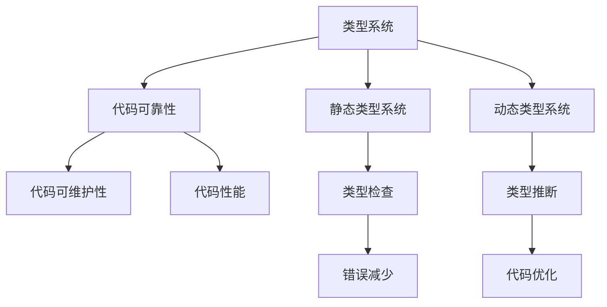

                 

# 《类型系统如何提高代码可靠性》

## 关键词

- 类型系统
- 代码可靠性
- 编程语言
- 静态类型
- 动态类型
- 类型安全
- 错误处理

## 摘要

本文旨在探讨类型系统在提高代码可靠性方面的作用。类型系统是编程语言的核心组成部分，通过明确的类型约束和类型检查，能够有效减少程序中的错误和缺陷。本文将首先介绍类型系统的基本概念，包括静态类型系统和动态类型系统，并分析它们各自的优点和局限。随后，我们将深入讨论类型系统在实际编程语言中的应用，以及类型系统在软件开发、错误处理和性能优化中的实践应用。最后，本文将对类型系统的未来发展趋势进行展望，并提出相关最佳实践和注意事项。

## 目录大纲

### 第一部分：类型系统的基本概念与原理

#### 第1章：类型系统概述

##### 1.1 什么是类型系统

##### 1.2 类型系统的分类

##### 1.3 类型系统的优点

#### 第2章：静态类型系统

##### 2.1 静态类型系统的特点

##### 2.2 静态类型系统的实现

##### 2.3 静态类型系统的优势与局限

### 第二部分：动态类型系统

#### 第3章：动态类型系统

##### 3.1 动态类型系统的特点

##### 3.2 动态类型系统的实现

##### 3.3 动态类型系统的优势与局限

### 第三部分：类型系统在编程语言中的应用

#### 第4章：类型系统在编程语言中的应用

##### 4.1 演绎型编程语言

##### 4.2 函数式编程语言

##### 4.3 面向对象编程语言

### 第四部分：类型系统在代码可靠性中的实践应用

#### 第5章：类型系统在软件开发中的实际应用

##### 5.1 类型系统在软件设计中的应用

##### 5.2 类型系统在代码审查中的应用

#### 第6章：类型系统在错误处理中的应用

##### 6.1 类型错误与运行时错误

##### 6.2 错误处理策略

#### 第7章：类型系统在性能优化中的应用

##### 7.1 类型系统与性能优化

##### 7.2 类型系统在实际案例中的应用

### 第8章：总结与展望

##### 8.1 类型系统的未来发展趋势

##### 8.2 类型系统在编程教育中的应用

### 核心概念与联系

#### 核心概念与联系：



### 核心算法原理讲解

#### 静态类型系统的核心算法原理

静态类型系统通过在编译或构建时进行类型检查来提高代码可靠性。其核心算法包括：

1. **类型推断（Type Inference）**

   类型推断是静态类型系统的一项重要功能，它通过分析代码的语法和语义，自动推导出变量的类型。类型推断可以分为简单类型推断和复杂类型推断。

   - **简单类型推断**：例如，在Java中，如果一个变量的初始值是一个整数，那么这个变量的类型就被推断为整数。

   - **复杂类型推断**：例如，在Haskell中，类型推断可以处理函数类型、存在类型等复杂类型。

2. **类型检查（Type Checking）**

   类型检查是在编译时对代码进行的一种检查，确保每个表达式都有正确的类型。类型检查的主要任务包括：

   - **类型匹配**：确保表达式两边的类型是兼容的。
   - **类型约束**：对泛型编程中的类型参数进行约束。

   以下是类型检查的一个简单伪代码示例：

   ```python
   function add(a: int, b: int): int {
       return a + b;
   }
   ```

   在这个例子中，`add` 函数接受两个整数类型的参数，并返回一个整数类型的结果。

3. **泛型编程（Generic Programming）**

   泛型编程允许编写与类型相关的代码，从而提高代码的可重用性和通用性。在泛型编程中，可以使用类型参数来定义函数或数据结构，使得这些函数或数据结构与具体的数据类型解耦。

   ```haskell
   data List a = Empty | Cons a (List a)

   foldList :: (a -> b -> b) -> b -> List a -> b
   foldList _ z Empty = z
   foldList f z (Cons x xs) = f x (foldList f z xs)
   ```

   在这个例子中，`List` 类型参数化，允许创建不同类型的列表，而`foldList` 函数对任何类型的列表都是通用的。

通过这些核心算法原理，静态类型系统能够在编译时发现和修复许多类型错误，从而提高代码的可靠性。接下来，我们将进一步探讨动态类型系统的特点和优势。

