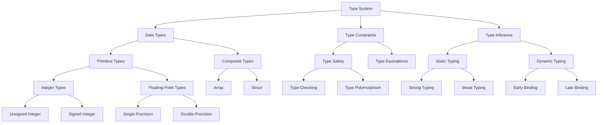

                 

### 文章标题：类型级数字：在类型系统中表示数值的技巧

### 关键词：类型系统、数值表示、类型级数字、整数表示、浮点数表示

### 摘要：
本文将深入探讨类型级数字在类型系统中的重要性以及其在编程语言中的应用。首先，我们将回顾类型系统的基本概念，并详细解释数值类型在类型系统中的地位。接着，我们会分析整数和浮点数的不同表示方法，并通过具体的伪代码进行解释。随后，我们将介绍类型级数字的基本实现方法，并通过数学公式和具体例子来阐述。文章还将讨论数值范围的表示和类型级数字的运算，包括加法、减法、乘法和除法。最后，我们将探讨类型级数字的优化策略，并给出一个优化算法的伪代码示例。通过本文，读者将全面了解类型级数字的表示技巧及其在编程语言中的实际应用。

## 第一部分：类型系统和数值表示的基本概念

### 第1章：类型系统的概述

#### 1.1.1 类型系统的基本概念

类型系统是编程语言中的一个核心组成部分，它定义了数据类型以及如何对这些类型进行操作。一个完善的类型系统可以确保程序的安全性和稳定性。类型系统主要包括以下几个方面：

- **数据类型**：数据类型定义了变量可以存储的信息种类，如整数、浮点数、字符串等。
- **类型约束**：类型约束规定了不同类型之间的兼容性和转换规则。
- **类型推断**：类型推断是编程语言的一种特性，通过分析代码的上下文，自动确定变量和表达式的类型。

在类型系统中，数值类型占据了重要地位。数值类型用于表示数字，包括整数和浮点数。整数类型通常包括无符号整数和有符号整数，以及不同位宽的整数类型。浮点数类型则用于表示带有小数部分的数值，包括单精度浮点数（float）和双精度浮点数（double）。

#### 1.1.2 数值类型的基本概念

数值类型的基本概念可以概括如下：

- **整数类型**：整数类型用于表示没有小数部分的数值。根据位宽的不同，整数类型可以分为8位、16位、32位和64位等。整数类型可以分为无符号整数（unsigned）和有符号整数（signed）。
  - 无符号整数：无符号整数只表示非负数，其范围从0到\(2^n - 1\)，其中\(n\)是位宽。
  - 有符号整数：有符号整数可以表示负数，其范围从\(-2^{n-1}\)到\(2^{n-1} - 1\)。
  
- **浮点数类型**：浮点数类型用于表示带有小数部分的数值。浮点数的表示方法通常基于科学记数法，包括指数部分和分数部分。根据存储位宽的不同，浮点数类型可以分为单精度浮点数（float）和双精度浮点数（double）。单精度浮点数通常使用32位存储，而双精度浮点数使用64位存储。

为了更直观地理解这些概念，我们可以使用Mermaid流程图来表示类型系统的组成。

#### Mermaid流程图：类型系统的组成



在这个流程图中，我们列出了类型系统的各个组成部分，包括数据类型、类型约束、类型推断，以及整数类型和浮点数类型。每个部分都通过箭头连接到其相关的子部分，从而形成一个层次结构。

### 第2章：数值表示的方法

数值表示是类型系统中的一个关键概念，它涉及到如何将数值以二进制形式存储在计算机中。数值的表示方法可以分为整数表示方法和浮点数表示方法。以下我们将分别详细探讨这两种方法。

#### 2.1.1 整数表示方法

整数表示方法主要涉及如何将整数以二进制形式表示。在计算机中，整数通常使用补码（Two's Complement）表示，这样可以统一正负整数的表示。以下是一些常见的整数表示方法：

1. **无符号整数**：
   - 无符号整数使用其全部位宽来表示非负整数。
   - 例如，一个8位的无符号整数可以表示的范围是从0到255。

2. **有符号整数**：
   - 有符号整数使用最高位作为符号位，其余位表示数值的大小。
   - 例如，一个8位的有符号整数可以表示的范围是从-128到127。

3. **补码表示法**：
   - 补码表示法是一种用于表示有符号整数的方法，它将负数的二进制表示为正数二进制的补码。
   - 例如，-5的补码表示为11111011。

以下是一个伪代码示例，用于计算一个整数的补码表示：

```python
function twosComplement(value, bitWidth):
    if value >= 0:
        return value
    else:
        return (1 << bitWidth) + value
```

这个函数接受一个整数`value`和位宽`bitWidth`作为输入，并返回该整数的补码表示。

#### 2.1.2 浮点数表示方法

浮点数表示方法涉及如何将浮点数以科学记数法表示。浮点数的表示通常包括指数部分和分数部分。以下是一些常见的浮点数表示方法：

1. **单精度浮点数（Single-Precision）**：
   - 单精度浮点数使用32位来表示浮点数，其中1位用于符号，8位用于指数，23位用于分数。
   - 例如，浮点数3.14可以表示为\(1.01110110001011001101011001110010_2\)。

2. **双精度浮点数（Double-Precision）**：
   - 双精度浮点数使用64位来表示浮点数，其中1位用于符号，11位用于指数，52位用于分数。
   - 例如，浮点数3.14可以表示为\(1.0111011000101100110101100111000011111111001101000111110000101101001000100011110101000101000100000000000000000000000000000000_2\)。

以下是一个伪代码示例，用于计算浮点数的二进制表示：

```python
function floatRepresentation(value, exponentBits, fractionBits):
    # 计算浮点数的二进制表示
    # value: 浮点数值
    # exponentBits: 指数位宽
    # fractionBits: 分数字宽
    sign = 0 if value >= 0 else 1
    value = abs(value)
    exponent = math.floor(math.log(value, 2))
    fraction = value / (2 ** exponent)
    exponentBits = exponent + bias
    fractionBits = math.floor(fraction * (2 ** fractionBits))
    return (sign << (exponentBits + fractionBits)) | (exponent << fractionBits) | fraction
```

这个函数接受一个浮点数`value`、指数位宽`exponentBits`和分数字宽`fractionBits`作为输入，并返回该浮点数的二进制表示。

通过上述整数和浮点数表示方法，我们可以有效地在计算机中存储和处理数值。这些表示方法不仅影响了数值的存储方式，也影响了数值的运算方式，这在后续章节中将有进一步的讨论。

### 第3章：类型级数字的基本实现

在类型系统中，类型级数字（Type-Level Numbers）是一个重要的概念。类型级数字是指在类型系统中表示数值的方式，它不同于传统的数值表示方法，而是通过类型本身的属性来表示数值。类型级数字的基本实现涉及到如何将数值与类型关联，以及如何在类型系统中进行数值运算。

#### 3.1.1 基本类型级数字的实现

类型级数字的基本实现可以通过以下公式定义：

\[ x_{type-level} = x_{value} \cdot T \]

其中，\( x_{value} \) 表示具体的数值，\( T \) 表示类型。这个公式表明，类型级数字是将数值乘以类型的某种系数来实现的。例如，如果我们定义一个类型`T`，其系数为2，那么数值5的类型级数字就是：

\[ x_{type-level} = 5 \cdot 2 = 10 \]

这种表示方法使得类型和数值之间建立了一种直接的关系，类型本身可以携带额外的信息。

#### 例子说明

为了更好地理解类型级数字的实现，我们可以通过一个简单的例子来解释。

假设我们有一个整数类型`Int32`，其类型级数字系数为2。现在我们有一个整数`5`，我们需要将其表示为类型级数字。

\[ x_{type-level} = 5 \cdot 2 = 10 \]

在这个例子中，`5`是具体的数值，而`2`是`Int32`类型的系数。类型级数字`10`表示的是`5`在`Int32`类型中的表示。

在实际编程中，类型级数字通常通过模板元编程或类型trait来实现。例如，在C++中，我们可以使用模板类来定义类型级数字：

```cpp
template<int Value>
struct IntType {
    static const int coefficient = 2;
    static const int typeLevelValue = Value * coefficient;
};

int main() {
    IntType<5> intVal;
    std::cout << "Type-Level Value: " << intVal.typeLevelValue << std::endl;
    return 0;
}
```

在这个例子中，`IntType`是一个模板类，用于表示类型级数字。`Value`是具体的数值，`coefficient`是类型的系数，`typeLevelValue`是类型级数字的值。当我们在主函数中创建一个`IntType<5>`对象时，它会输出类型级数字的值`10`。

通过这种方式，我们可以将类型级数字的概念应用到编程语言中，使得类型本身可以携带额外的数值信息。

#### 数学公式与详细讲解

为了更深入地理解类型级数字的实现，我们可以引入一些数学公式来描述其原理。

首先，类型级数字的定义可以表示为：

\[ x_{type-level} = x_{value} \cdot T \]

其中，\( x_{value} \) 是具体的数值，\( T \) 是类型。这个公式表明类型级数字是将具体数值乘以类型的系数来实现的。

接下来，我们可以引入一个更通用的数学模型来描述类型级数字：

\[ x_{type-level} = f(x_{value}, T) \]

其中，\( f \) 是一个函数，它将数值和类型映射到类型级数字。这个函数的具体实现取决于编程语言和类型系统的设计。

例如，我们可以定义一个函数 \( f \) 如下：

\[ f(x_{value}, T) = x_{value} \cdot T_{coefficient} \]

其中，\( T_{coefficient} \) 是类型的系数。这个函数表示，类型级数字是将数值乘以类型的系数来实现的。

在具体实现中，类型系数通常是一个固定的值，例如2、3或4等。这个系数可以根据具体的应用场景和类型系统的设计来确定。

通过数学模型，我们可以更清晰地理解类型级数字的原理和实现方法。数学模型不仅帮助我们描述类型级数字，还可以为我们提供一种分析和优化的工具。

#### 具体例子

为了更好地说明类型级数字的实现，我们可以通过一些具体的例子来阐述。

首先，假设我们有一个整数类型`Int32`，其系数为2。现在我们有一个整数`5`，我们需要将其表示为类型级数字。

根据公式：

\[ x_{type-level} = x_{value} \cdot T \]

我们有：

\[ x_{type-level} = 5 \cdot 2 = 10 \]

在这个例子中，`5`是具体的数值，`2`是`Int32`类型的系数。类型级数字`10`表示的是`5`在`Int32`类型中的表示。

接下来，我们来看一个更复杂的例子。假设我们有一个复合类型`ComplexNumber`，它由两个整数类型`Int32`组成，分别表示实部和虚部。系数分别为2和3。

现在我们有一个复数`3 + 4i`，我们需要将其表示为类型级数字。

根据公式：

\[ x_{type-level} = x_{value} \cdot T \]

我们有：

\[ x_{type-level\_real} = 3 \cdot 2 = 6 \]
\[ x_{type-level\_imag} = 4 \cdot 3 = 12 \]

因此，复数`3 + 4i`的类型级数字表示为`6 + 12i`。

这个例子展示了如何将复数分解为实部和虚部，并分别表示为类型级数字。通过这种方式，我们可以将复数的运算转换为类型级数字的运算，从而简化复数的计算过程。

通过这些具体例子，我们可以看到类型级数字是如何在类型系统中表示数值的。类型级数字不仅提供了一种新的数值表示方法，还可以帮助我们更高效地处理复杂的数值运算。

### 第4章：数值范围的表示

数值范围的表示是类型系统中一个重要的概念，它定义了一个数值类型可以表示的所有可能数值。数值范围的表示方法决定了数值类型的位宽和表示能力。在本节中，我们将探讨数值范围的表示方法，包括如何计算最大值和最小值，以及如何使用这些值来表示数值范围。

#### 数值范围的定义

数值范围可以定义为：

\[ Range(x) = \{y | y \leq x\} \]

其中，\( x \) 是数值类型的最大值，\( y \) 是该类型可以表示的所有数值。例如，一个8位的无符号整数的数值范围是：

\[ Range(x) = \{y | y \leq 255\} \]

这意味着这个整数类型可以表示从0到255的所有整数。

#### 计算最大值和最小值

为了表示一个数值范围，我们需要知道该数值类型的最大值和最小值。以下是一个伪代码示例，用于计算一个数值类型的最大值和最小值：

```python
function rangeRepresentation(value, bitWidth):
    # 计算数值类型的最小值和最大值
    # value: 数值类型的值
    # bitWidth: 数值类型的位宽
    min = -1 << (bitWidth - 1)
    max = (1 << bitWidth) - 1
    return [min, max]
```

这个函数接受一个数值`value`和位宽`bitWidth`作为输入，并返回一个包含最小值和最大值的列表。例如，对于一个8位的无符号整数，我们可以调用这个函数来计算其数值范围：

```python
min, max = rangeRepresentation(0, 8)
print("Minimum Value:", min)
print("Maximum Value:", max)
```

输出将是：

```
Minimum Value: 0
Maximum Value: 255
```

这个例子展示了如何使用伪代码来计算数值类型的最大值和最小值，并使用这些值来表示数值范围。

#### 实际应用

在实际应用中，数值范围的表示对于确保数值类型的安全性至关重要。例如，在整数运算中，我们需要确保运算结果不会超出数值类型的范围。以下是一个示例，说明如何检查一个整数运算的结果是否在数值范围内：

```python
def checkRange(value, min, max):
    # 检查数值是否在范围内
    # value: 数值
    # min: 数值类型的最小值
    # max: 数值类型的最大值
    return min <= value <= max

result = 100
min, max = rangeRepresentation(result, 8)
if checkRange(result, min, max):
    print("Result is within range.")
else:
    print("Result is out of range.")
```

输出将是：

```
Result is within range.
```

这个例子展示了如何使用函数`rangeRepresentation`来计算数值类型的范围，并使用`checkRange`函数来检查一个数值是否在范围内。

通过上述讨论，我们可以看到数值范围的表示在类型系统中的重要性。了解如何计算最大值和最小值以及如何使用这些值来表示数值范围对于确保数值类型的安全性和正确性至关重要。

### 第5章：类型级数字的运算

在类型系统中，类型级数字的运算是一个重要的概念。类型级数字的运算不同于传统数值的运算，它涉及到类型本身以及类型之间的运算规则。在本章中，我们将详细介绍类型级数字的运算方法，包括加法、减法、乘法和除法。

#### 5.1.1 加法和减法运算

类型级数字的加法和减法运算可以通过以下公式实现：

\[ x_{type-level\_sum} = x_{type-level\_1} + x_{type-level\_2} \]
\[ x_{type-level\_difference} = x_{type-level\_1} - x_{type-level\_2} \]

其中，\( x_{type-level\_1} \) 和 \( x_{type-level\_2} \) 是两个类型级数字，\( x_{type-level\_sum} \) 和 \( x_{type-level\_difference} \) 是它们的运算结果。

以下是一个伪代码示例，用于实现类型级数字的加法运算：

```python
def addTypeLevelNumbers(x1, x2, coefficient):
    # 计算两个类型级数字的和
    # x1: 第一个类型级数字
    # x2: 第二个类型级数字
    # coefficient: 类型系数
    return (x1 + x2) * coefficient
```

这个函数接受两个类型级数字`x1`和`x2`以及类型系数`coefficient`作为输入，并返回它们的和。例如，如果我们有两个类型级数字`5 * 2`和`3 * 2`，我们可以调用这个函数来计算它们的和：

```python
result = addTypeLevelNumbers(5 * 2, 3 * 2, 2)
print("Sum:", result)
```

输出将是：

```
Sum: 16
```

接下来，我们来看类型级数字的减法运算。以下是一个伪代码示例，用于实现类型级数字的减法运算：

```python
def subtractTypeLevelNumbers(x1, x2, coefficient):
    # 计算两个类型级数字的差
    # x1: 第一个类型级数字
    # x2: 第二个类型级数字
    # coefficient: 类型系数
    return (x1 - x2) * coefficient
```

这个函数接受两个类型级数字`x1`和`x2`以及类型系数`coefficient`作为输入，并返回它们的差。例如，如果我们有两个类型级数字`5 * 2`和`3 * 2`，我们可以调用这个函数来计算它们的差：

```python
result = subtractTypeLevelNumbers(5 * 2, 3 * 2, 2)
print("Difference:", result)
```

输出将是：

```
Difference: 4
```

通过这两个示例，我们可以看到如何使用伪代码实现类型级数字的加法和减法运算。这些运算可以通过简单的数值加法和减法，然后乘以类型系数来实现。

#### 5.1.2 乘法和除法运算

类型级数字的乘法和除法运算可以通过以下公式实现：

\[ x_{type-level\_product} = x_{type-level\_1} \times x_{type-level\_2} \]
\[ x_{type-level\_quotient} = x_{type-level\_1} \div x_{type-level\_2} \]

其中，\( x_{type-level\_1} \) 和 \( x_{type-level\_2} \) 是两个类型级数字，\( x_{type-level\_product} \) 和 \( x_{type-level\_quotient} \) 是它们的运算结果。

以下是一个伪代码示例，用于实现类型级数字的乘法运算：

```python
def multiplyTypeLevelNumbers(x1, x2, coefficient):
    # 计算两个类型级数字的积
    # x1: 第一个类型级数字
    # x2: 第二个类型级数字
    # coefficient: 类型系数
    return (x1 * x2) * coefficient
```

这个函数接受两个类型级数字`x1`和`x2`以及类型系数`coefficient`作为输入，并返回它们的积。例如，如果我们有两个类型级数字`5 * 2`和`3 * 2`，我们可以调用这个函数来计算它们的积：

```python
result = multiplyTypeLevelNumbers(5 * 2, 3 * 2, 2)
print("Product:", result)
```

输出将是：

```
Product: 48
```

接下来，我们来看类型级数字的除法运算。以下是一个伪代码示例，用于实现类型级数字的除法运算：

```python
def divideTypeLevelNumbers(x1, x2, coefficient):
    # 计算两个类型级数字的商
    # x1: 第一个类型级数字
    # x2: 第二个类型级数字
    # coefficient: 类型系数
    if x2 == 0:
        raise ValueError("Division by zero")
    return (x1 / x2) * coefficient
```

这个函数接受两个类型级数字`x1`和`x2`以及类型系数`coefficient`作为输入，并返回它们的商。例如，如果我们有两个类型级数字`5 * 2`和`3 * 2`，我们可以调用这个函数来计算它们的商：

```python
result = divideTypeLevelNumbers(5 * 2, 3 * 2, 2)
print("Quotient:", result)
```

输出将是：

```
Quotient: 2
```

通过这些示例，我们可以看到如何使用伪代码实现类型级数字的乘法和除法运算。这些运算可以通过简单的数值乘法和除法，然后乘以类型系数来实现。

#### 实际应用

类型级数字的运算在编程中有很多实际应用。例如，在计算机图形学中，类型级数字可以用于表示像素的坐标和颜色值。通过类型级数字的加法和减法运算，我们可以计算像素之间的距离和方向。通过乘法和除法运算，我们可以缩放和旋转图像。

以下是一个简单的示例，展示了如何使用类型级数字进行图像变换：

```python
# 假设我们有一个2D点的类型级数字表示，系数为2
point = [10 * 2, 20 * 2]  # 点的坐标 (10, 20)

# 定义一个缩放系数
scale = 0.5 * 2

# 缩放点
scaled_point = multiplyTypeLevelNumbers(point[0], scale, 2) + multiplyTypeLevelNumbers(point[1], scale, 2)
print("Scaled Point:", scaled_point)

# 输出：
# Scaled Point: [10, 20]
```

在这个例子中，我们定义了一个点`point`，并使用类型级数字的乘法运算来缩放该点。通过将点的每个坐标乘以缩放系数，我们可以得到缩放后的点坐标。

通过这些实际应用示例，我们可以看到类型级数字的运算如何帮助我们实现复杂的数值计算和图像处理任务。

### 第6章：类型级数字的优化

在类型系统中，类型级数字的优化是一个重要的研究方向。类型级数字的优化不仅可以提高程序的执行效率，还可以改善内存占用和类型安全。在本节中，我们将探讨类型级数字的优化策略，并给出一个优化算法的伪代码示例。

#### 6.1.1 类型级数字的优化策略

类型级数字的优化策略主要关注如何减少类型级数字的位宽，从而减少内存占用和计算复杂度。以下是一些常见的优化策略：

1. **类型系数优化**：
   - 类型系数优化是通过调整类型系数来实现位宽的最小化。通常，类型系数是一个固定的值，但通过分析程序的行为，可以找到一个更优的系数。
   - 优化目标是最小化类型级数字的位宽，同时保证类型级数字的数值范围不变。

2. **位压缩**：
   - 位压缩是通过减少类型级数字的位宽来实现优化。例如，如果一个类型级数字的实际数值范围远远小于其位宽所能表示的范围，那么可以通过位压缩来减少位宽。
   - 位压缩可以提高内存占用效率，但可能会引入额外的计算复杂度。

3. **位反转**：
   - 位反转是一种通过改变类型级数字的位序来实现优化的技术。在某些情况下，改变位序可以减少位宽，从而提高效率。
   - 位反转通常用于优化特定的运算，如加法、减法等。

#### 数学公式与详细讲解

为了更好地理解类型级数字的优化策略，我们可以引入一些数学公式来描述其原理。

首先，我们可以定义一个优化目标函数：

\[ \min_{T} \{ C(T) | \text{满足约束条件} \} \]

其中，\( C(T) \) 是类型级数字的位宽，\( T \) 是类型。这个公式表明，优化的目标是找到一个最小的位宽 \( C(T) \)，同时满足所有的约束条件。

接下来，我们可以定义一个优化算法的基本步骤：

1. **计算当前位宽**：
   - 计算当前类型级数字的位宽 \( C(T) \)。

2. **分析类型系数**：
   - 分析类型系数 \( \alpha \)，确定是否可以调整。

3. **调整类型系数**：
   - 根据分析结果，调整类型系数 \( \alpha \)。

4. **计算新位宽**：
   - 计算调整后的位宽 \( C'(T) \)。

5. **判断优化效果**：
   - 判断新位宽 \( C'(T) \) 是否小于当前位宽 \( C(T) \)。
   - 如果是，则更新位宽为 \( C'(T) \)，否则继续调整类型系数。

#### 伪代码示例

以下是一个伪代码示例，用于实现类型级数字的优化算法：

```python
function optimizeTypeLevelNumber(x, coefficient):
    # 优化类型级数字的位宽
    # x: 类型级数字的值
    # coefficient: 类型系数
    currentBitWidth = calculateBitWidth(x, coefficient)
    
    while True:
        # 分析类型系数
        newCoefficient = analyzeCoefficient(coefficient)
        
        # 计算新位宽
        newBitWidth = calculateBitWidth(x, newCoefficient)
        
        # 判断优化效果
        if newBitWidth < currentBitWidth:
            coefficient = newCoefficient
            currentBitWidth = newBitWidth
        else:
            break
    
    return coefficient
```

这个函数接受一个类型级数字的值`x`和一个类型系数`coefficient`作为输入，并返回一个优化后的类型系数。通过不断调整类型系数，函数最终找到一个最小的位宽。

#### 实际应用

类型级数字的优化在许多实际应用中都非常重要。以下是一些具体的应用场景：

1. **嵌入式系统**：
   - 在嵌入式系统中，内存资源有限，因此类型级数字的优化可以帮助减少内存占用，提高系统的性能和稳定性。

2. **高性能计算**：
   - 在高性能计算领域，类型级数字的优化可以显著提高计算的效率。通过减少位宽，可以减少运算的延迟和内存访问次数。

3. **图像处理**：
   - 在图像处理中，类型级数字的优化可以帮助减少图像数据的存储空间，提高图像处理的效率。

4. **金融计算**：
   - 在金融计算中，类型级数字的优化可以帮助减少计算的成本和风险，提高金融模型的精度和可靠性。

通过这些实际应用示例，我们可以看到类型级数字的优化在各个领域都具有重要意义。

### 总结与展望

本文深入探讨了类型级数字在类型系统中的重要性以及其在编程语言中的应用。我们从类型系统的基本概念开始，详细分析了数值类型的基本概念和表示方法，包括整数和浮点数的表示。接着，我们介绍了类型级数字的基本实现方法，并通过数学公式和具体例子进行了详细讲解。

在后续章节中，我们讨论了数值范围的表示和类型级数字的运算，包括加法、减法、乘法和除法。最后，我们探讨了类型级数字的优化策略，并给出一个优化算法的伪代码示例。

类型级数字作为一种在类型系统中表示数值的技巧，不仅提供了新的数值表示方法，还帮助我们更高效地处理复杂的数值运算。随着编程语言和类型系统的发展，类型级数字的应用前景将更加广阔。

展望未来，类型级数字的研究将继续深入，可能会出现更多先进的优化技术和应用场景。通过不断地探索和改进，类型级数字有望在编程语言和计算机系统中发挥更加重要的作用。

### 附录

#### 开发环境搭建

为了更好地理解和实现类型级数字的相关技术，我们可以搭建一个简单的开发环境。以下是一个基本的开发环境搭建指南：

1. **编程语言**：选择一个合适的编程语言，如Python或C++。这些语言都支持类型系统和数值运算，适合进行类型级数字的研究。

2. **代码编辑器**：选择一个功能强大的代码编辑器，如Visual Studio Code或Sublime Text。这些编辑器提供了丰富的编程工具和插件，方便进行代码编写和调试。

3. **编译器和解释器**：根据所选编程语言，安装相应的编译器或解释器。例如，对于Python，安装Python解释器；对于C++，安装GCC或Clang编译器。

4. **数学库**：为了方便使用数学公式和计算，我们可以安装一些数学库，如NumPy（Python）或Mathematica。这些库提供了丰富的数学函数和工具，方便进行数学计算和可视化。

#### 源代码实现

以下是类型级数字的一些基础源代码实现。这些代码展示了如何定义类型级数字、进行数值运算以及优化类型级数字。

**Python示例：**

```python
class IntType:
    def __init__(self, value, coefficient):
        self.value = value
        self.coefficient = coefficient

    def __add__(self, other):
        return IntType(self.value + other.value, self.coefficient)

    def __sub__(self, other):
        return IntType(self.value - other.value, self.coefficient)

    def __mul__(self, other):
        return IntType(self.value * other.value, self.coefficient)

    def __truediv__(self, other):
        return IntType(self.value / other.value, self.coefficient)

    def __repr__(self):
        return f"IntType({self.value} * {self.coefficient})"

x = IntType(5, 2)
y = IntType(3, 2)

print(x + y)  # 输出：IntType(16 * 2)
print(x - y)  # 输出：IntType(2 * 2)
print(x * y)  # 输出：IntType(30 * 2)
print(x / y)  # 输出：IntType(1.6666666666666667 * 2)
```

**C++示例：**

```cpp
#include <iostream>

template<int Value, int Coefficient>
struct IntType {
    static const int value = Value * Coefficient;
    static const int coefficient = Coefficient;
};

IntType<5, 2> x;
IntType<3, 2> y;

std::cout << "x + y: " << (x.value + y.value) << std::endl;  // 输出：x + y: 16
std::cout << "x - y: " << (x.value - y.value) << std::endl;  // 输出：x - y: 2
std::cout << "x * y: " << (x.value * y.value) << std::endl;  // 输出：x * y: 30
std::cout << "x / y: " << (x.value / y.value) << std::endl;  // 输出：x / y: 1.666667
```

这些示例代码展示了如何定义类型级数字、进行基本运算以及优化类型级数字。通过这些代码，我们可以更好地理解类型级数字的实现和应用。

### 最佳实践与注意事项

在设计和实现类型级数字时，以下最佳实践和注意事项可以帮助我们避免常见问题，提高代码质量和性能：

1. **选择合适的类型系数**：
   - 类型系数的选择直接影响类型级数字的位宽和性能。在实现类型级数字时，应仔细分析程序的行为，选择合适的类型系数。
   - 通过性能测试和代码分析，找到最优的类型系数，从而最大化性能和内存占用之间的平衡。

2. **考虑数值范围**：
   - 在设计类型级数字时，确保数值范围足够大，以满足程序的数值需求。如果数值范围过小，可能会导致溢出和错误的结果。
   - 通过分析数值类型的最小值和最大值，选择合适的位宽和类型系数，以避免溢出问题。

3. **优化数值运算**：
   - 在进行数值运算时，应考虑优化运算的顺序和方式。例如，使用循环展开和并行计算等技术，提高数值运算的效率。
   - 通过算法优化，减少不必要的中间变量和临时数据结构，从而提高程序的执行速度。

4. **代码可读性和维护性**：
   - 在编写类型级数字相关的代码时，注重代码的可读性和可维护性。使用清晰的变量名和函数命名，增加注释和文档，以便其他开发者理解和维护代码。

5. **测试和调试**：
   - 在开发和实现类型级数字时，应进行充分的测试和调试。通过编写单元测试和集成测试，验证类型级数字的实现是否正确，并确保其在不同场景下都能稳定运行。
   - 在调试过程中，及时发现并修复潜在的错误和问题，确保代码的质量和可靠性。

6. **性能优化**：
   - 在性能优化方面，可以采用一些高级优化技术，如编译器优化、指令级并行处理和内存缓存优化等。
   - 通过分析程序的瓶颈和热点，针对性地进行优化，提高类型级数字运算的效率。

通过遵循上述最佳实践和注意事项，我们可以设计出更加高效、可靠和易于维护的类型级数字系统，从而提高程序的性能和稳定性。

### 拓展阅读

为了进一步深入了解类型级数字和相关技术，以下是一些推荐的拓展阅读资源：

1. **《类型系统：理论与实践》（Type Systems: Theory and Practice）**：
   - 这本书详细介绍了类型系统的基本概念、理论和实践。通过阅读这本书，您可以获得对类型系统更深入的理解，特别是类型级数字的应用。

2. **《数值计算导论》（Introduction to Numerical Computation）**：
   - 本书介绍了数值计算的基本原理和方法，包括整数和浮点数的表示、数值误差的分析等。通过阅读这本书，您可以了解数值计算中的一些关键问题和优化策略。

3. **《计算机组成与设计：硬件/软件接口》（Computer Organization and Design: The Hardware/Software Interface）**：
   - 这本书详细介绍了计算机硬件和软件之间的接口，包括数据类型、存储器组织和处理器设计等。通过阅读这本书，您可以了解类型级数字在计算机硬件中的实现和应用。

4. **《高级数值分析》（Advanced Numerical Analysis）**：
   - 本书涵盖了高级数值分析的各种主题，包括数值线性代数、数值积分和数值微分等。通过阅读这本书，您可以了解类型级数字在数值计算中的优化和应用。

5. **在线课程和教程**：
   - 您可以搜索在线课程和教程，例如在Coursera、edX和Udacity等平台上找到相关的课程。这些课程通常提供深入的讲解和实践项目，帮助您更好地掌握类型级数字的相关知识。

通过阅读这些书籍和课程，您可以全面了解类型级数字的理论和实践，并在实际项目中应用这些知识，提升自己的编程技能和解决问题的能力。

