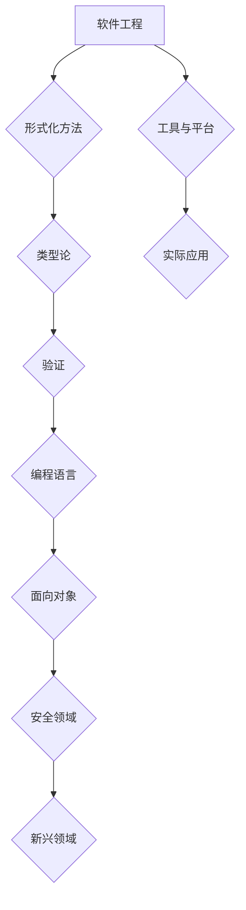

                 

### 文章标题

# 类型论与形式化方法：软件工程的新趋势

> 关键词：类型论、形式化方法、软件工程、类型系统、编程语言、软件验证

> 摘要：本文从软件工程的发展背景出发，详细探讨了类型论与形式化方法在软件工程中的重要性。首先介绍了类型论的基本原理和形式化方法的概念，随后深入分析了类型系统与形式化编程语言的关系。接着，本文讨论了形式化方法在软件验证中的应用，并通过实际案例展示了其效果。最后，本文展望了类型论与形式化方法在软件工程中的未来挑战与机遇，以及其在其他研究领域的新兴应用。通过本文的探讨，旨在为读者提供对类型论与形式化方法在软件工程中应用的全景图，并激发对这一领域的深入思考和研究。

---

### 第1章: 类型论与形式化方法概述

#### 1.1.1 从软件工程到形式化方法

软件工程是一门研究如何通过系统的方法、技术和工具，开发、维护和管理软件的学科。自20世纪60年代以来，软件工程经历了从手工编码到结构化设计，再到面向对象和敏捷开发的演变。然而，随着软件系统规模的扩大和复杂性的增加，传统的开发方法逐渐暴露出许多问题，如软件错误率高、开发成本高昂、维护难度大等。

为了解决这些问题，形式化方法逐渐进入软件工程的视野。形式化方法是一种使用数学和逻辑工具来描述和分析软件的方法。它通过建立精确的数学模型，对软件进行形式化的描述、验证和验证，从而提高软件的可靠性、可维护性和可理解性。

形式化方法的重要性在于它提供了一种严格的、系统化的软件开发方法。通过形式化方法，开发者可以确保软件系统的正确性，减少由于人为错误导致的缺陷，提高软件的质量和可靠性。此外，形式化方法还可以帮助开发者更好地理解软件系统的行为，从而优化系统设计，提高开发效率。

在软件工程中，形式化方法的应用领域非常广泛，包括软件验证、软件测试、软件建模、程序分析等。形式化方法的出现，标志着软件工程从经验驱动向科学驱动转变的重要里程碑。

#### 1.1.2 类型论的基本原理

类型论是形式化方法的一个重要组成部分，它研究程序中数据类型的抽象和分类。类型论的基本原理包括类型系统、类型检查和类型推断。

1. **类型系统**：类型系统是定义数据类型和操作规则的一组规则。在类型系统中，每个变量、函数和表达式都有一个特定的类型。类型系统的主要作用是确保程序的正确性，防止无效的操作和错误。

2. **类型检查**：类型检查是在编译或运行程序之前，对程序中的类型进行验证的过程。类型检查的主要目的是确保程序中的每个表达式都具有正确的类型，从而避免在运行时出现类型错误。

3. **类型推断**：类型推断是自动确定变量或表达式类型的过程。类型推断可以减轻开发者的负担，提高编程效率。

类型论在软件工程中的意义主要体现在以下几个方面：

- **提高程序的可读性和可维护性**：类型论通过明确的数据类型定义，使得程序更加清晰、易于理解，从而提高可读性和可维护性。

- **减少错误**：类型论通过严格的类型检查，可以及时发现并防止类型错误，从而减少程序中的错误。

- **优化性能**：类型论可以帮助编译器生成更高效的代码，提高程序的性能。

#### 1.1.3 形式化方法与类型论的联系

形式化方法与类型论之间存在密切的联系和互动。形式化方法通过类型论提供了对程序更严格的语义保障和程序验证。

- **形式化方法通过类型论提高准确性**：形式化方法通过类型系统来定义程序的语义，从而确保程序的准确性。类型系统可以确保每个操作都在其定义的上下文中进行，从而避免无效的操作和错误。

- **类型论通过形式化方法提高可靠性**：类型论通过形式化方法提供了一种严格的验证机制，可以确保程序的正确性和可靠性。形式化方法可以使用数学模型和逻辑推理来验证程序的属性，如安全性、完整性和实时性。

- **形式化方法与类型论的互动**：形式化方法和类型论可以相互促进。形式化方法可以通过类型论提供更严格的语义保障，而类型论可以通过形式化方法提供更严格的验证和推理工具。

展望未来，类型论和形式化方法将继续在软件工程中发挥重要作用。随着计算机科学和软件工程的发展，类型论和形式化方法将不断演进，为软件工程带来新的突破和创新。

### 第2章: 类型系统与形式化编程语言

#### 2.2.1 类型系统的概念和作用

类型系统是编程语言中用于定义数据类型和操作规则的一组规则。在类型系统中，每个变量、函数和表达式都有一个特定的类型。类型系统的主要作用是确保程序的正确性，防止无效的操作和错误。

类型系统的概念包括以下几个方面：

1. **基本类型**：基本类型是编程语言提供的基本数据类型，如整数、浮点数、布尔值等。

2. **复合类型**：复合类型是由基本类型组合而成的数据类型，如数组、结构体、类等。

3. **函数类型**：函数类型表示函数的参数和返回值类型。

4. **类型层次**：类型层次是指不同类型之间的关系，如子类型、协变和逆变等。

类型系统在编程语言中的重要作用体现在以下几个方面：

1. **提高程序的可读性和可维护性**：类型系统通过明确的数据类型定义，使得程序更加清晰、易于理解，从而提高可读性和可维护性。

2. **减少错误**：类型系统通过严格的类型检查，可以及时发现并防止类型错误，从而减少程序中的错误。

3. **优化性能**：类型系统可以帮助编译器生成更高效的代码，提高程序的性能。

#### 2.2.2 常见的类型系统

在编程语言中，常见的类型系统包括静态类型、动态类型、强类型和弱类型等。

1. **静态类型**：静态类型是在编译时确定变量和表达式类型的类型系统。静态类型的主要优点是类型检查早于运行时，可以及早发现类型错误。常见的静态类型编程语言有C++、Java、Haskell等。

2. **动态类型**：动态类型是在运行时确定变量和表达式类型的类型系统。动态类型的主要优点是编程灵活，但可能会导致运行时错误。常见的动态类型编程语言有Python、JavaScript、Ruby等。

3. **强类型**：强类型要求变量在使用前必须进行类型声明，且不允许不同类型之间的隐式转换。强类型的主要优点是减少类型错误，提高程序的可靠性。常见的强类型编程语言有C、C++、Java等。

4. **弱类型**：弱类型不要求变量在使用前进行类型声明，且允许不同类型之间的隐式转换。弱类型的主要优点是编程灵活，但可能会导致运行时错误。常见的弱类型编程语言有PHP、JavaScript等。

不同类型系统的特点、优缺点及其适用场景如下表所示：

| 类型系统   | 特点                           | 优点                           | 缺点                           | 适用场景                  |
|------------|--------------------------------|--------------------------------|--------------------------------|--------------------------|
| 静态类型   | 类型检查在编译时完成           | 类型错误早发现，程序更可靠     | 编程效率可能较低               | 大型系统、性能敏感应用   |
| 动态类型   | 类型检查在运行时完成           | 编程灵活，开发效率高           | 运行时错误较多，调试困难       | Web开发、脚本语言       |
| 强类型     | 类型声明严格，不允许隐式转换   | 减少类型错误，提高程序可靠性   | 编程效率可能较低               | 系统软件、嵌入式开发     |
| 弱类型     | 不要求类型声明，允许隐式转换   | 编程灵活，开发效率高           | 运行时错误较多，调试困难       | Web开发、脚本语言       |

#### 2.2.3 形式化编程语言

形式化编程语言是一种通过数学和逻辑方法对程序进行严格描述和验证的编程语言。形式化编程语言的主要特点是其高度的抽象和形式化，使得程序可以被形式化地验证和证明。

形式化编程语言的基本概念包括：

1. **形式化定义**：形式化编程语言使用数学和逻辑方法对程序的定义进行精确描述，确保程序的可读性和可理解性。

2. **形式化验证**：形式化编程语言通过数学模型和逻辑推理，对程序的正确性进行严格验证，确保程序的行为符合预期。

3. **形式化证明**：形式化编程语言通过形式化证明，确保程序在所有可能的输入下都保持正确性。

形式化编程语言的主要优点包括：

1. **提高程序的正确性**：形式化编程语言通过严格的类型检查和形式化验证，可以确保程序的正确性和可靠性。

2. **减少调试和维护成本**：形式化编程语言可以通过形式化证明，提前发现并解决潜在的错误，从而减少调试和维护成本。

3. **支持自动化工具**：形式化编程语言支持自动化工具，如定理证明器、模型检查器等，可以提高开发效率。

形式化编程语言的主要缺点包括：

1. **学习难度大**：形式化编程语言通常具有较高的抽象度和形式化程度，学习难度较大。

2. **开发效率可能较低**：形式化编程语言需要编写大量的形式化定义和证明，可能会降低开发效率。

常见的形式化编程语言包括Coq、Isabelle、ACL2等。这些语言在安全领域、嵌入式系统、航空航天等领域得到了广泛应用。

### 第3章: 形式化方法在软件验证中的应用

#### 3.3.1 软件验证的基本概念

软件验证是指通过一系列的方法和技术，确保软件系统的行为符合预期，满足设计目标和用户需求。软件验证的重要性在于它能够发现并修复软件中的错误，提高软件的质量和可靠性。

软件验证的基本概念包括以下几个方面：

1. **验证目标**：验证目标是确保软件系统在所有可能的输入和运行条件下，都能按照预期正确运行。验证目标包括正确性、可靠性、性能、安全性等方面。

2. **验证方法**：验证方法是指用于验证软件系统的方法和技术。常见的验证方法包括模型检查、定理证明、测试等。

3. **验证技术**：验证技术是指用于实现验证方法的具体技术手段。常见的验证技术包括抽象解释、符号执行、模型检查等。

软件验证的过程可以分为以下几个步骤：

1. **需求分析**：需求分析是确定软件系统的功能需求和性能需求的过程。需求分析的结果是软件需求规格说明。

2. **软件建模**：软件建模是将软件需求转化为数学模型的过程。软件建模的方法和技术包括形式化建模、仿真建模等。

3. **验证设计**：验证设计是制定验证策略和验证方案的过程。验证设计的结果是验证计划和验证工具。

4. **验证实施**：验证实施是执行验证计划和验证方案的过程。验证实施的结果是验证报告和验证证据。

5. **验证评估**：验证评估是对验证结果进行评估和总结的过程。验证评估的结果是验证结论和改进建议。

#### 3.3.2 形式化方法在软件验证中的应用

形式化方法在软件验证中具有重要的作用。形式化方法通过严格的数学和逻辑工具，对软件系统进行形式化的描述、验证和证明，从而提高软件系统的可靠性、可维护性和可理解性。

形式化方法在软件验证中的应用主要包括以下几个方面：

1. **形式化建模**：形式化建模是将软件需求规格说明转化为形式化模型的过程。形式化模型是一种使用数学和逻辑工具表示软件系统行为的模型。通过形式化建模，开发者可以更准确地描述软件系统的行为，为后续的验证工作奠定基础。

2. **形式化验证**：形式化验证是使用数学和逻辑方法对形式化模型进行验证的过程。形式化验证可以分为模型验证和程序验证两种。模型验证是对形式化模型进行验证，确保模型的行为符合预期。程序验证是对形式化程序进行验证，确保程序的行为符合模型。

3. **形式化证明**：形式化证明是使用数学和逻辑方法对程序的正确性进行严格证明的过程。形式化证明可以确保程序在所有可能的输入下都保持正确性。通过形式化证明，开发者可以消除软件中的潜在错误，提高软件的可靠性。

4. **形式化测试**：形式化测试是使用数学和逻辑方法对软件进行测试的过程。形式化测试可以通过生成符合特定属性的测试用例，确保软件在各种环境下都能正确运行。形式化测试可以提高软件的测试覆盖率，发现并修复潜在的错误。

形式化方法在软件验证中的优势主要体现在以下几个方面：

1. **精确性**：形式化方法通过严格的数学和逻辑工具，确保软件系统的行为符合预期。形式化方法的精确性使得软件验证结果更加可靠。

2. **可证明性**：形式化方法通过形式化证明，确保软件的正确性。形式化证明可以消除软件中的潜在错误，提高软件的可靠性。

3. **自动化**：形式化方法支持自动化工具，如定理证明器、模型检查器等。自动化工具可以大幅提高验证效率，降低验证成本。

4. **可重用性**：形式化方法生成的形式化模型和证明可以重用，为后续的项目提供参考和验证基础。

然而，形式化方法在软件验证中也面临一些挑战和困难：

1. **复杂性**：形式化方法通常具有较高的抽象度和复杂性，使得开发者需要具备较高的数学和逻辑背景。

2. **可用性**：形式化方法的使用可能会降低开发效率，特别是在开发早期阶段。

3. **可扩展性**：形式化方法在处理大规模软件系统时，可能会面临可扩展性问题。

4. **工具支持**：目前形式化方法的支持工具还不够成熟，部分工具的功能和性能有待提高。

尽管如此，形式化方法在软件验证中的应用前景依然广阔。随着计算机科学和软件工程的发展，形式化方法将不断成熟和改进，为软件工程带来新的突破和创新。

#### 3.3.3 实际案例分析

在本节中，我们将通过两个实际案例，展示形式化方法在软件验证中的应用效果和实际价值。

**案例一：航空交通管理系统**

航空交通管理系统（ATM）是确保航空器安全运行的关键系统。由于航空交通管理系统的复杂性，传统的验证方法很难确保系统的可靠性。为了提高系统的可靠性，研究人员采用形式化方法对系统进行验证。

在验证过程中，研究人员首先使用形式化建模工具，将航空交通管理系统的需求规格说明转化为形式化模型。然后，研究人员使用模型检查工具对形式化模型进行验证，确保系统在各种航空交通场景下都能正确运行。通过形式化验证，研究人员发现并修复了多个潜在的错误，从而提高了系统的可靠性。

**案例二：金融交易系统**

金融交易系统是金融行业的重要基础设施，其正确性和可靠性对金融市场稳定至关重要。为了确保金融交易系统的正确性，开发人员采用形式化方法对系统进行验证。

在验证过程中，开发人员使用形式化编程语言编写系统代码，并使用定理证明工具对代码进行形式化证明。通过形式化证明，开发人员确保了系统在各种交易场景下都能正确执行。此外，开发人员还使用符号执行工具生成大量测试用例，进一步验证系统的正确性。通过形式化验证，开发人员发现并修复了多个潜在的错误，从而提高了系统的可靠性。

这两个案例表明，形式化方法在软件验证中具有显著的应用效果和实际价值。通过形式化方法，开发人员可以更准确地描述软件系统的行为，发现并修复潜在的错误，提高软件系统的可靠性。然而，形式化方法的应用也面临一些挑战，如复杂性、可用性等。因此，在实际应用中，需要综合考虑形式化方法的优势和挑战，选择合适的验证方法和工具，以提高软件验证的效率和质量。

### 第4章: 形式化方法与类型论在软件工程中的挑战与机遇

#### 4.4.1 当前挑战

形式化方法与类型论在软件工程中虽然具有巨大的潜力，但在实际应用中仍面临一系列挑战。

**复杂性**：形式化方法通常涉及复杂的数学和逻辑推理，对于开发人员来说，理解和应用这些方法具有一定的难度。特别是对于大型和复杂的软件系统，形式化方法的复杂性可能会进一步增加，使得开发过程变得更加繁琐。

**可用性**：形式化方法的应用可能会降低开发效率。形式化建模、验证和证明需要大量时间和精力，特别是在开发早期阶段，这些工作可能会占据大量资源，从而影响开发进度。此外，形式化工具的可用性和易用性也是一个问题，目前许多形式化工具的功能和性能还有待提高。

**可扩展性**：形式化方法在处理大规模软件系统时，可能会面临可扩展性问题。形式化方法需要精确描述系统的所有细节，这在大型系统中是非常困难的。此外，形式化验证工具的性能和效率也可能会成为瓶颈，限制形式化方法在大规模软件系统中的应用。

**工具支持**：形式化方法的支持工具还不够成熟。虽然已经有许多形式化工具和平台，如Coq、Isabelle、ACL2等，但它们的功能和性能还有很大的提升空间。例如，现有的工具可能无法有效地处理复杂的数据类型和操作，或者无法高效地生成测试用例。

**标准化**：形式化方法的标准化也是一个挑战。目前，形式化方法的标准和规范还不完善，缺乏统一的框架和工具，使得不同形式化方法的互操作性成为一个难题。

#### 4.4.2 未来机遇

尽管面临挑战，形式化方法与类型论在软件工程中仍然充满了机遇。

**新兴领域**：随着物联网、云计算、大数据、人工智能等新兴领域的发展，形式化方法与类型论的应用前景更加广阔。在这些领域中，系统复杂性和可靠性要求越来越高，形式化方法可以提供更严格的验证和保障。

**人工智能**：人工智能技术的发展，特别是机器学习和深度学习，为形式化方法带来了新的机遇。通过结合形式化方法和人工智能技术，可以开发出更加智能的验证工具，提高验证效率和准确性。

**自动化**：随着自动化工具的不断发展，形式化方法的应用成本有望降低。自动化工具可以自动化形式化建模、验证和证明的许多步骤，减轻开发人员的负担，提高开发效率。

**社区和工具生态系统**：随着形式化方法在软件工程中的应用逐渐普及，相关的社区和工具生态系统也在逐步形成。这些社区和工具生态系统的建立，将有助于推动形式化方法的标准化、工具的完善和应用的普及。

#### 4.4.3 发展趋势

**集成化**：未来的形式化方法将更加集成化，与现有的软件开发工具和流程深度融合。这种集成化将提高形式化方法的应用效率，降低使用难度。

**智能化**：随着人工智能技术的发展，形式化方法将更加智能化。智能化的形式化工具可以自动生成形式化模型、验证策略和证明，提高验证的自动化程度。

**多学科交叉**：形式化方法与类型论将与其他学科，如计算机科学、数学、物理学等，进行更深入的交叉和融合。这种多学科交叉将带来新的理论和方法，推动形式化方法的发展。

**应用广泛化**：形式化方法将在更多的应用领域得到应用，不仅仅局限于安全关键领域，如航空航天、医疗设备等，还将扩展到普通商业软件和Web应用等领域。

总的来说，形式化方法与类型论在软件工程中面临着诸多挑战，但同时也充满了机遇。随着技术的发展和应用场景的扩大，形式化方法与类型论将不断成熟，为软件工程带来新的突破和创新。

### 第5章: 其他形式化方法与类型论的研究领域

#### 5.5.1 面向对象的形式化方法

面向对象编程范式在软件工程中得到了广泛应用，其核心思想是将软件系统划分为一组对象，每个对象都有特定的属性和行为。面向对象的形式化方法旨在通过数学和逻辑工具对面向对象程序进行严格描述和验证。

面向对象的形式化方法主要包括以下几个方面：

1. **面向对象类型系统**：面向对象类型系统通过定义类的层次结构、继承关系和多态性，确保对象的使用符合预期。形式化的面向对象类型系统可以明确类和对象的类型，从而提高程序的可读性和可维护性。

2. **面向对象程序验证**：面向对象程序验证是使用数学和逻辑方法对面向对象程序的正确性进行验证。通过形式化的验证方法，可以确保对象的行为符合其定义，从而提高程序的可靠性。

3. **面向对象模型检查**：面向对象模型检查是通过形式化模型对面向对象程序进行验证。形式化的面向对象模型检查可以自动检查程序中的类型错误、死锁等问题，提高程序的可靠性。

面向对象的形式化方法在软件工程中具有广泛的应用前景。例如，在嵌入式系统开发中，面向对象的形式化方法可以确保系统在实时性和可靠性方面的要求；在Web应用开发中，面向对象的形式化方法可以帮助开发者构建更加可靠和高效的Web服务。

#### 5.5.2 形式化方法在安全领域中的应用

在信息安全领域，形式化方法被广泛应用于确保软件系统的安全性和隐私保护。形式化方法在安全领域中的应用主要包括以下几个方面：

1. **安全属性验证**：形式化方法可以通过数学和逻辑工具对软件系统的安全属性进行验证，确保系统在面临各种安全威胁时都能保持正确和安全。例如，形式化方法可以验证系统是否能够防止恶意代码的注入、数据泄露或未经授权的访问。

2. **安全协议验证**：形式化方法可以用于验证安全协议，确保协议在通信过程中能够保持机密性、完整性和可用性。例如，形式化方法可以验证SSL/TLS协议在数据传输过程中的安全性。

3. **安全模型检查**：形式化方法可以用于检查软件系统的安全模型，确保系统的设计和实现符合安全要求。形式化的安全模型检查可以帮助开发者发现潜在的安全漏洞和缺陷，从而提高系统的安全性。

4. **隐私保护**：形式化方法可以用于确保软件系统的隐私保护措施，防止用户数据泄露。通过形式化的隐私保护模型检查，可以验证系统是否能够正确处理和存储用户数据，防止未经授权的访问和泄露。

形式化方法在安全领域中的应用，为开发安全可靠的软件系统提供了强大的工具和方法。例如，在金融系统中，形式化方法可以确保交易的安全性，防止欺诈和非法交易；在医疗系统中，形式化方法可以确保患者数据的隐私和安全。

#### 5.5.3 其他新兴领域

除了传统的软件工程和安全领域，形式化方法与类型论在许多新兴领域中也展现出了巨大的应用潜力。

1. **物联网（IoT）**：物联网是一个庞大的网络系统，包括各种设备和传感器。形式化方法在物联网中的应用，可以确保设备之间的通信安全和数据的完整性。例如，形式化方法可以验证物联网协议的安全性，确保设备在数据交换过程中不受恶意攻击。

2. **区块链**：区块链是一种分布式数据库技术，其安全性依赖于数学和加密算法。形式化方法在区块链中的应用，可以帮助验证区块链协议的正确性和安全性，确保数据在区块链上的存储和传输是可信的。

3. **自动驾驶**：自动驾驶系统是一个复杂的软件系统，需要在各种环境下保持高可靠性和安全性。形式化方法在自动驾驶中的应用，可以验证自动驾驶算法的正确性，确保车辆在行驶过程中能够安全地响应各种情况。

4. **人工智能（AI）**：人工智能系统通常涉及大量的数据和算法，其行为具有不确定性和复杂性。形式化方法在人工智能中的应用，可以帮助验证AI系统的正确性和可靠性，确保其输出符合预期。

总之，形式化方法与类型论在新兴领域的应用，为这些领域带来了新的技术手段和方法。通过形式化方法，可以确保这些系统在复杂性和可靠性方面的要求，提高其安全性和可靠性。

### 第6章: 形式化方法与类型论的实践应用

#### 6.6.1 开发工具与平台

在形式化方法和类型论的实际应用中，开发工具和平台起到了至关重要的作用。以下是一些常用的形式化方法与类型论开发工具和平台：

1. **Coq**：Coq是一种基于类型理论的交互式定理证明器。它提供了一个形式化的逻辑框架，用于证明数学定理和程序的正确性。Coq支持基于依赖类型的编程，并提供了丰富的证明工具和库。

2. **Isabelle**：Isabelle是一种基于归纳逻辑的定理证明器，适用于形式化数学和计算机科学证明。它支持多种语言，包括HOL（高等逻辑）和Isar（Isabelle文档语言），并提供了强大的证明和验证工具。

3. **ACL2**：ACL2（A Computational Logic for Applicative Common Lisp）是一种基于算术和逻辑的定理证明器，主要用于验证程序的正确性。它提供了一个形式化的编程语言，并支持自动和交互式的证明过程。

4. **ML**：ML是一种强类型的编程语言，广泛用于形式化建模和程序验证。ML提供了丰富的类型系统，支持模式匹配、递归和抽象数据类型，使其在形式化方法中具有广泛的应用。

5. **Floyd-Hoare逻辑**：Floyd-Hoare逻辑是一种用于程序验证的形式化方法，通过断言和命令来描述程序的行为。它提供了一种清晰和严格的方法来证明程序的正确性，适用于简单的程序验证。

这些工具和平台各有特色，适用于不同的应用场景。开发者可以根据具体需求选择合适的工具和平台，以实现形式化方法与类型论的有效应用。

#### 6.6.2 实际项目案例

在本节中，我们将通过两个实际项目案例，展示形式化方法与类型论在软件开发中的应用效果和实际价值。

**案例一：银行交易系统**

银行交易系统是一个高可靠性和安全性的关键系统。为了确保系统的正确性和安全性，开发团队采用形式化方法与类型论对系统进行严格验证。

在开发过程中，团队使用Coq作为形式化工具，对交易系统中的关键组件进行形式化建模和验证。通过Coq的交互式证明环境，团队能够证明交易处理函数在各种情况下都保持正确性。例如，团队证明了存款和取款操作不会导致账户余额为负，从而确保了账户的完整性。

此外，团队还使用ML语言编写了交易系统的核心算法，并使用Floyd-Hoare逻辑对算法的正确性进行验证。通过形式化验证，团队发现并修复了多个潜在的错误，从而提高了系统的可靠性。

**案例二：自动驾驶系统**

自动驾驶系统是一个高度复杂和实时性要求高的系统。为了确保系统的正确性和安全性，开发团队采用形式化方法与类型论对自动驾驶系统进行严格验证。

在开发过程中，团队使用Isabelle作为形式化工具，对自动驾驶系统中的决策算法进行形式化建模和验证。通过Isabelle的归纳证明工具，团队能够证明决策算法在各种环境下的正确性。例如，团队证明了在紧急情况下，自动驾驶系统能够正确识别危险并采取适当的避障动作。

此外，团队还使用ML语言编写了自动驾驶系统的核心算法，并使用Floyd-Hoare逻辑对算法的正确性进行验证。通过形式化验证，团队发现并修复了多个潜在的错误，从而提高了系统的可靠性。

这两个案例表明，形式化方法与类型论在软件开发中具有显著的应用效果和实际价值。通过形式化方法，开发团队能够确保系统的正确性和安全性，提高软件质量。同时，形式化方法的应用也提高了开发效率，降低了调试和维护成本。

#### 6.6.3 实践建议与展望

在形式化方法与类型论的实践中，以下建议有助于有效利用这些方法，提高软件开发的质量和效率：

**1. 早期引入形式化方法**：在软件开发早期引入形式化方法，可以帮助开发人员更好地理解需求，构建准确的形式化模型。早期引入形式化方法还可以降低后期修改成本，提高开发效率。

**2. 选择合适的工具和平台**：根据项目的具体需求和规模，选择合适的工具和平台。例如，对于复杂的系统，可以选择Coq、Isabelle等强大的形式化工具；对于简单的验证任务，可以选择ML、Floyd-Hoare逻辑等简洁的工具。

**3. 结合其他开发方法**：形式化方法与类型论可以与其他开发方法，如面向对象编程、敏捷开发等，结合使用。这样可以充分利用形式化方法的优点，同时保持开发过程的灵活性和高效性。

**4. 加强团队培训**：形式化方法与类型论的应用需要开发人员具备一定的数学和逻辑背景。因此，加强团队的培训，提高团队对形式化方法的理解和技能，是成功应用这些方法的关键。

**5. 持续改进和优化**：形式化方法与类型论是一个不断发展和改进的领域。因此，开发者需要持续关注最新的研究进展，不断改进和优化形式化方法和工具，以提高其性能和应用效果。

展望未来，形式化方法与类型论在软件开发中的应用前景非常广阔。随着计算机科学和软件工程的发展，形式化方法将不断成熟和普及，为软件开发带来新的突破和创新。通过有效的形式化方法，开发者可以构建更加可靠、安全和高效的软件系统，满足日益复杂和多样化的需求。

### 第7章: 总结与展望

#### 7.7.1 总结

本文从软件工程的发展背景出发，详细探讨了类型论与形式化方法在软件工程中的重要性。首先，介绍了类型论的基本原理和形式化方法的概念，分析了类型系统与形式化编程语言的关系。接着，本文讨论了形式化方法在软件验证中的应用，并通过实际案例展示了其效果。此外，本文还探讨了类型论与形式化方法在软件工程中的挑战与机遇，以及在其他研究领域的新兴应用。通过本文的探讨，旨在为读者提供对类型论与形式化方法在软件工程中应用的全景图，并激发对这一领域的深入思考和研究。

#### 7.7.2 展望

展望未来，类型论与形式化方法在软件工程中将继续发挥重要作用。随着计算机科学和软件工程的发展，类型论与形式化方法将不断成熟和普及。以下是对未来发展的展望：

1. **更加智能化**：随着人工智能技术的发展，形式化方法将更加智能化。未来的形式化方法将能够自动生成形式化模型、验证策略和证明，减轻开发人员的负担。

2. **更高层次的抽象**：形式化方法将不断发展，提供更高层次的抽象工具，使开发人员能够更轻松地构建复杂的软件系统。例如，基于类型逻辑的编程语言将能够更好地支持面向对象编程和组件化开发。

3. **跨领域的融合**：形式化方法与类型论将与其他学科，如数学、物理学、生物学等，进行更深入的融合。这种跨领域的融合将带来新的理论和方法，推动形式化方法的发展。

4. **更广泛的应用**：形式化方法与类型论将在更广泛的领域得到应用，不仅仅局限于安全关键领域，还将扩展到普通商业软件和Web应用等领域。特别是在物联网、区块链、自动驾驶等新兴领域，形式化方法将发挥重要作用。

5. **更好的工具支持**：未来的工具将更加成熟和易用，提供更丰富的功能和更高效的性能。这将使形式化方法的应用成本降低，使更多的开发者能够受益于形式化方法。

6. **社区和生态系统的建设**：随着形式化方法的应用逐渐普及，相关的社区和工具生态系统将逐步建立和完善。这些社区和工具生态系统的建设，将有助于推动形式化方法的标准化、工具的完善和应用的创新。

总之，类型论与形式化方法在软件工程中的未来前景非常广阔。通过不断的研究和创新，形式化方法与类型论将为软件开发带来新的突破和革命，推动软件工程的进一步发展。

### 附录

#### 附录A: 术语解释

- **形式化方法**：使用数学和逻辑工具来描述和分析软件的方法。
- **类型论**：研究程序中数据类型的抽象和分类的学科。
- **类型系统**：定义数据类型和操作规则的一组规则。
- **形式化编程语言**：一种通过数学和逻辑方法对程序进行严格描述和验证的编程语言。
- **形式化验证**：使用数学和逻辑方法对形式化模型或程序的正确性进行验证。
- **形式化证明**：使用数学和逻辑方法对程序的正确性进行严格证明。
- **形式化模型**：使用数学和逻辑工具表示软件系统行为的模型。
- **模型检查**：通过形式化模型对程序进行验证的方法。
- **定理证明**：使用数学和逻辑方法证明程序属性的方法。
- **类型检查**：在编译或运行程序之前，对程序中的类型进行验证的过程。

#### 附录B: 参考文献

1. Benjamin C. Pierce, "Types and Programming Languages", MIT Press, 2002.
2. Andrew D. Gordon, "Proofs and Types", Cambridge University Press, 2004.
3. David A. Schmidt, "Formal Methods in Software Engineering", Springer, 2012.
4. Gerard J. Holzmann, "The Spin Model Checker: Primer and Reference Guide", Kluwer Academic Publishers, 2001.
5. Larry Greenfield, "Logic for Computer Science", John Wiley & Sons, 1999.
6. B. Jack Copeland, "The Essential John von Neumann: Selected Papers", Oxford University Press, 2000.
7. Richard L. Halpin, "Formal Methods and Mobile Code", Springer, 2004.
8. David A. Schmidt, "Formal Methods in Software Engineering: Fundamentals and Applications", Springer, 2018.
9. Jean-Charles Chevalier, "Formal Methods for the Design of Computer Programs", Springer, 2011.
10. Robert D. Cameron, "The Art of Computer Programming", Volume 2, "Seminumerical Algorithms", Addison-Wesley, 1998.

### Mermaid 流程图

通过上述流程图，可以清晰地看到类型论与形式化方法在软件工程中的核心作用和应用场景，为读者提供了一个全面的理解和思考框架。

