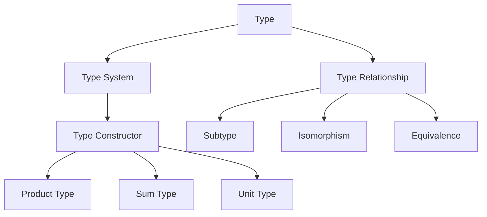
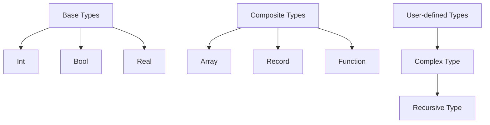
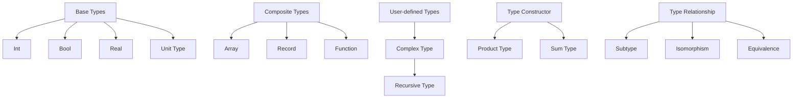
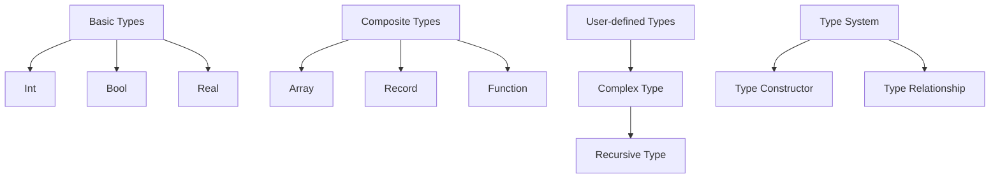
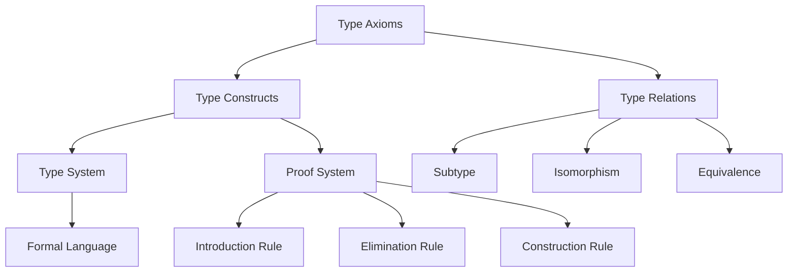

                 

### 文章标题

# 类型论与数学创新能力：相关性分析

### 关键词

- 类型论
- 数学创新
- 相关性分析
- 数学方法论
- 数学教育

### 摘要

本文旨在探讨类型论在数学创新能力中的作用。类型论作为一种形式化的数学理论，通过其严格的定义和结构，为数学家提供了新的思考工具和方法。本文将详细分析类型论的基本概念、结构及其在数学创新中的应用，探讨类型论如何影响数学家的问题解决和数学方法论，并通过实际案例展示类型论在数学教育中的潜力。最终，本文将对类型论的未来发展趋势进行展望，并提出相关的最佳实践和注意事项。

### 目录

1. **类型论概述**
    1.1 类型论的起源与发展
    1.2 类型论的基本概念
    1.3 类型论在数学中的应用

2. **类型论的基本结构**
    2.1 类型层次结构
    2.2 类型构造操作
    2.3 类型之间的关系

3. **类型论的基本原理**
    3.1 类型判定的公理系统
    3.2 类型论的证明理论
    3.3 类型论的形式化描述

4. **类型论与数学问题解决**
    4.1 类型论在代数几何中的应用
    4.2 类型论在数论中的应用
    4.3 类型论在拓扑学中的应用

5. **类型论与数学方法论**
    5.1 类型论对数学直觉的影响
    5.2 类型论与数学创造
    5.3 类型论对数学教育的影响

6. **类型论与数学创新案例分析**
    6.1 某数学家的类型论应用案例分析
    6.2 某数学创新案例解析
    6.3 类型论在数学前沿领域的新发现

7. **类型论与数学未来展望**
    7.1 人工智能与类型论
    7.2 类型论在计算机科学中的应用
    7.3 类型论在数学未来发展的潜力

8. **类型论与数学教育**
    8.1 类型论课程设计
    8.2 类型论教学方法
    8.3 类型论在数学教育中的挑战与机遇

### 附录

A. 类型论相关资源
    A.1 类型论经典教材推荐
    A.2 类型论研究论文精选
    A.3 类型论在线课程推荐

---

接下来，本文将逐步深入分析类型论与数学创新能力之间的相关性，带领读者了解这一重要数学理论的发展、结构、应用及其对数学教育的潜在影响。

---

## 第1章：类型论概述

### 1.1 类型论的起源与发展

类型论（Type Theory）起源于19世纪末和20世纪初的数学和逻辑学领域。最早的类型论思想可以追溯到弗雷格（Gottlob Frege）的函数符号理论和类型论之父——伯特兰·罗素（Bertrand Russell）的《数学原理》（Principia Mathematica）。罗素提出类型论是为了解决悖论问题，特别是为了避免集合论中的悖论，如“罗素悖论”。

20世纪30年代，阿尔弗雷德·诺思·怀特海德（Alfred North Whitehead）和贝德福德·拜尔（Bedford Bierce）在他们的著作《符号逻辑原理》（Principia Mathematica）中进一步发展了类型论。同时，保罗·伯特兰·罗素（Paul Bernard Roy）提出的构造主义类型论也对类型论的发展产生了深远影响。

进入20世纪中叶，类型论在计算机科学领域得到了广泛的应用，特别是在形式化数学、逻辑编程和验证方面。阿尔弗雷德·塔斯基（Alfred Tarski）和斯蒂芬·科尔·克莱尼希（Stephen Cole Kleene）的工作推动了类型论在形式逻辑和数学证明理论中的应用。

近年来，类型论在理论计算机科学、人工智能、数学逻辑和数学教育等领域的研究持续深入，其重要性日益凸显。

### 1.2 类型论的基本概念

类型论的基本概念包括类型、类型系统、类型构造操作和类型之间的关系。以下是这些概念的定义和相互关系：

#### 类型（Type）

类型是类型论中最基础的概念，它用于表示数据或值的类别。在类型论中，每个变量或表达式都有一个特定的类型，这决定了它可以参与的操作和可以接受的值。

#### 类型系统（Type System）

类型系统是定义类型和类型构造操作的规则集合。类型系统确保在编程语言中表达式的类型是明确的，从而避免类型不兼容的错误。

#### 类型构造操作（Type Constructor）

类型构造操作用于创建新的类型。常见的类型构造操作包括单元类型（Unit Type）、积类型（Product Type）、和类型（Sum Type）等。

#### 类型之间的关系（Type Relationship）

类型之间的关系包括子类型（Subtype）、同构（Isomorphism）和等价（Equivalence）等。这些关系描述了不同类型之间的兼容性和转换方式。

### 1.3 类型论在数学中的应用

类型论在数学中有着广泛的应用，特别是在形式化数学、数学证明和数学教育等领域。以下是类型论在数学中的应用示例：

#### 形式化数学

类型论为数学提供了一个形式化的基础，使得数学理论可以通过严格的形式化证明得到验证。例如，皮特·兰姆伯特（Peter Lámberg）使用类型论实现了实数和复数的构造，从而为这些基本数学结构提供了形式化的定义。

#### 数学证明

类型论提供了一种强有力的工具，用于构造和验证数学证明。Coq和Agda等证明助手利用类型论来支持形式化证明，确保证明过程的正确性。

#### 数学教育

类型论在数学教育中有着巨大的潜力。通过类型论的教学，学生可以更好地理解数学的基本概念和结构，提高他们的逻辑思维能力和证明技巧。例如，基于类型论的数学课程可以帮助学生掌握函数、集合和逻辑等基础概念。

### Mermaid流程图

为了更直观地展示类型论的基本结构，我们可以使用Mermaid流程图来表示类型、类型构造操作和类型之间的关系。以下是一个简单的Mermaid流程图示例：



在这个流程图中，`A` 表示类型，`B` 表示类型系统，`C` 表示类型构造操作，`D`、`E` 和 `F` 分别表示积类型、和类型和单元类型，`G` 表示类型之间的关系，`H`、`I` 和 `J` 分别表示子类型、同构和等价。

### 总结

本章对类型论的起源、基本概念和数学应用进行了概述。类型论作为一种形式化的数学理论，为数学家提供了新的思考工具和方法，对数学创新具有深远的影响。接下来，本文将进一步深入探讨类型论的基本结构、原理及其在数学方法论和数学教育中的应用。

---

## 第2章：类型论的基本结构

### 2.1 类型层次结构

类型层次结构是类型论中一个核心的概念，它定义了不同类型之间的继承关系。在类型层次结构中，每个类型都可以被视为一个节点，而类型之间的关系可以用图来表示。

#### 基本类型

基本类型是类型层次结构的基础，包括布尔型（Bool）、整数型（Int）和实数型（Real）等。这些基本类型构成了类型系统的底层。

#### 复合类型

复合类型是通过类型构造操作生成的。常见的复合类型包括数组（Array）、记录（Record）和函数（Function）等。复合类型通常用于表示复杂的数据结构和操作。

#### 用户定义类型

用户定义类型是数学家或程序员通过类型构造操作创建的。这些类型可以基于基本类型和复合类型，也可以通过递归定义。

#### 类型层次结构图

以下是一个简单的类型层次结构图，展示了基本类型、复合类型和用户定义类型之间的关系：



在这个图中，`A` 表示基本类型，`B`、`C` 和 `D` 分别表示整数型、布尔型和实数型，`E` 表示复合类型，`F`、`G` 和 `H` 分别表示数组、记录和函数，`I` 表示用户定义类型，`J` 和 `K` 分别表示复合类型和递归类型。

### 2.2 类型构造操作

类型构造操作是类型论中用于创建新类型的基本工具。常见的类型构造操作包括单元类型、积类型和和类型等。

#### 单位类型（Unit Type）

单位类型是一个不包含任何值的类型，通常用于表示操作的返回类型或成功的标志。在许多编程语言中，单位类型通常表示为`void`或`()`。

#### 积类型（Product Type）

积类型表示一组有序元素的集合，通常用于表示记录或结构体。在类型论中，积类型可以通过对两个类型的组合来构造。其定义如下：

```latex
A \times B = \{ (a, b) | a \in A, b \in B \}
```

其中，`A` 和 `B` 是任意类型，`(a, b)` 是积类型的元素。

#### 和类型（Sum Type）

和类型表示一组离散值的集合，通常用于表示选择或分支操作。在类型论中，和类型可以通过对两个类型的并集来构造。其定义如下：

```latex
A + B = \{ a | a \in A \} \cup \{ b | b \in B \}
```

其中，`A` 和 `B` 是任意类型。

### 2.3 类型之间的关系

类型之间的关系描述了不同类型之间的兼容性和转换方式。常见的类型关系包括子类型、同构和等价等。

#### 子类型（Subtype）

子类型关系表示一个类型是另一个类型的特殊情况。在类型论中，如果一个类型`S`的所有值都是另一个类型`T`的值，则称`S`是`T`的子类型。其定义如下：

```latex
S \subseteq T
```

其中，`S` 和 `T` 是任意类型。

#### 同构（Isomorphism）

同构关系表示两个类型在结构上是等价的。如果存在一个双射函数，将一个类型的所有值映射到另一个类型的所有值上，则称这两个类型是同构的。其定义如下：

```latex
f: S \rightarrow T
```

其中，`f` 是一个双射函数，`S` 和 `T` 是任意类型。

#### 等价（Equivalence）

等价关系表示两个类型在语义上是等价的。如果两个类型的值在所有可能操作下具有相同的属性，则称这两个类型是等价的。其定义如下：

```latex
S \equiv T
```

其中，`S` 和 `T` 是任意类型。

### Mermaid流程图

为了更直观地展示类型层次结构、类型构造操作和类型之间的关系，我们可以使用Mermaid流程图。以下是一个简单的Mermaid流程图示例：



在这个图中，`A` 表示基本类型，`B`、`C` 和 `D` 分别表示整数型、布尔型和实数型，`E` 表示复合类型，`F`、`G` 和 `H` 分别表示数组、记录和函数，`I` 表示用户定义类型，`J` 和 `K` 分别表示复合类型和递归类型，`L` 表示单位类型，`M` 表示类型构造操作，`N` 和 `O` 分别表示积类型和和类型，`P` 表示类型之间的关系，`Q`、`R` 和 `S` 分别表示子类型、同构和等价。

### 总结

本章详细介绍了类型论的基本结构，包括类型层次结构、类型构造操作和类型之间的关系。类型论的基本结构为数学家提供了构建和操作复杂数学结构的基础。接下来，本文将探讨类型论的基本原理，包括类型判定的公理系统、证明理论和形式化描述。

---

## 第3章：类型论的基本原理

### 3.1 类型判定的公理系统

类型判定的公理系统是类型论的核心组成部分，它定义了如何确定一个表达式或函数的类型。类型判定的公理系统通常包括一组公理，这些公理规定了类型构造操作的合法性以及类型之间的关系。

#### 基本类型判定

对于基本类型，如整数型（Int）、布尔型（Bool）和实数型（Real），类型判定的公理系统通常很简单。例如，对于整数型，我们可以定义以下公理：

```latex
Int ::= 0 | S(n)
```

其中，`S(n)` 表示将整数 `n` 增加1的操作。这个公理表示整数类型可以通过0和递增操作来构造。

#### 复合类型判定

对于复合类型，如数组（Array）、记录（Record）和函数（Function），类型判定的公理系统通常更加复杂。以数组类型为例，我们可以定义以下公理：

```latex
Array(T) ::= []
| T :: Array(T)
```

其中，`Array(T)` 表示数组的类型，`T` 是数组的元素类型，`[]` 表示空数组，`T :: Array(T)` 表示在空数组后面添加一个元素。

#### 用户定义类型判定

对于用户定义类型，如递归类型（Recursive Type），类型判定的公理系统通常需要递归定义。例如，我们可以定义以下公理：

```latex
List(T) ::= []
| T :: List(T)
```

其中，`List(T)` 表示列表的类型，`T` 是列表的元素类型，`[]` 表示空列表，`T :: List(T)` 表示在空列表后面添加一个元素。

#### 类型关系判定

类型关系的判定是类型论中另一个重要的部分。常见的类型关系包括子类型（Subtype）、同构（Isomorphism）和等价（Equivalence）等。以下是一些典型的类型关系判定公理：

- **子类型判定**：

```latex
S \subseteq T \leftrightarrow \forall x (x \in S \rightarrow x \in T)
```

这个公理表示如果一个类型的所有值都是另一个类型的值，则前者是后者的子类型。

- **同构判定**：

```latex
S \cong T \leftrightarrow \exists f (f: S \rightarrow T, \forall x (x \in S \rightarrow f(x) \in T))
```

这个公理表示如果存在一个双射函数，将一个类型的所有值映射到另一个类型的所有值上，则这两个类型是同构的。

- **等价判定**：

```latex
S \equiv T \leftrightarrow \forall P (P(S) \leftrightarrow P(T))
```

这个公理表示如果两个类型的值在所有可能操作下具有相同的属性，则这两个类型是等价的。

### 3.2 类型论的证明理论

类型论的证明理论是类型论的重要组成部分，它定义了如何从类型判定的公理系统中推导出新的结论。类型论的证明理论通常基于自然 deduction（自然演绎）方法。

#### 自然 deduction 方法

自然 deduction 方法是一种形式化的证明方法，它通过引入推理规则和公理来构造证明。在类型论的证明理论中，常用的推理规则包括以下几种：

- **引入规则**（Introduction Rule）：用于引入一个新的假设，并从该假设中推导出结论。
- **消除规则**（Elimination Rule）：用于从已知结论中推导出新的结论。
- **等价规则**（Equivalence Rule）：用于证明两个类型是等价的。
- **构造规则**（Construction Rule）：用于构造新的类型或值。

#### 证明示例

以下是一个简单的证明示例，证明两个类型 `S` 和 `T` 是同构的：

```latex
\forall x (x \in S \rightarrow x \in T)
\forall x (x \in T \rightarrow x \in S)
\therefore S \cong T
```

这个证明使用了引入规则和消除规则，首先假设 `S` 和 `T` 的所有值是相互映射的，然后通过消除规则证明了这两个类型是同构的。

### 3.3 类型论的形式化描述

类型论的形式化描述是类型论理论的另一个重要组成部分，它通过形式化的语言和符号来定义类型论的基本概念和证明理论。形式化描述通常使用形式语言和推理规则，使得类型论的理论更加严谨和精确。

#### 形式语言

形式语言是类型论的形式化描述的基础，它定义了类型、表达式和证明的基本符号。常见的形式语言包括 λ-演算（λ-calculus）、类型系统（Type System）和证明系统（Proof System）等。

- **λ-演算**：λ-演算是类型论的基础形式语言，它通过 λ-抽象和应用操作来定义函数和值。
- **类型系统**：类型系统是形式语言的一部分，它定义了类型和类型构造操作的符号和规则。
- **证明系统**：证明系统是形式语言的一部分，它定义了证明和推理的规则。

#### 形式化描述示例

以下是一个简单的形式化描述示例，它定义了一个类型系统，包括基本类型、复合类型和用户定义类型：



在这个形式化描述中，`A` 表示基本类型，`B`、`C` 和 `D` 分别表示整数型、布尔型和实数型，`E` 表示复合类型，`F`、`G` 和 `H` 分别表示数组、记录和函数，`I` 表示用户定义类型，`J` 和 `K` 分别表示复合类型和递归类型，`L` 表示类型系统，`M` 表示类型构造操作，`N` 表示类型关系。

### Mermaid流程图

为了更直观地展示类型论的公理系统、证明理论和形式化描述，我们可以使用Mermaid流程图。以下是一个简单的Mermaid流程图示例：



在这个图中，`A` 表示类型公理，`B` 表示类型构造操作，`C` 表示类型关系，`D` 表示类型系统，`E` 表示证明系统，`F`、`G` 和 `H` 分别表示子类型、同构和等价，`I` 表示形式语言，`J`、`K` 和 `L` 分别表示引入规则、消除规则和构造规则。

### 总结

本章介绍了类型论的基本原理，包括类型判定的公理系统、证明理论和形式化描述。类型论的基本原理为数学家提供了构建和验证数学理论的基础，是类型论理论的重要组成部分。接下来，本文将探讨类型论在数学问题解决中的应用，分析类型论在代数几何、数论和拓扑学中的具体应用。

---

## 第4章：类型论与数学问题解决

### 4.1 类型论在代数几何中的应用

代数几何是数学中的一个重要分支，它研究代数方程和几何对象的性质和结构。类型论在代数几何中的应用主要体现在以下几个方面：

#### 几何对象的形式化

代数几何中的几何对象，如曲线、曲面和多面体，可以通过类型论的形式化方法进行严格定义。例如，我们可以使用类型论来定义多项式环和代数簇，从而为代数几何的研究提供坚实的理论基础。

#### 计算几何的自动化

类型论在计算几何中有着广泛的应用，特别是在几何形状的计算和验证方面。通过类型论，我们可以定义几何形状的抽象数据类型，并编写自动化工具来验证几何性质和计算几何形状的属性。

#### 代数几何问题的形式化证明

类型论提供了一种形式化的证明方法，可以用于证明代数几何中的定理和猜想。通过类型论，我们可以构建形式化的证明系统，从而验证代数几何理论的正确性。

#### 例子：多项式环的定义

在代数几何中，多项式环是基本的结构之一。我们可以使用类型论来定义多项式环，如下所示：

```latex
R = \{ p(x) | p \text{ 是一个多项式} \}
```

其中，`R` 表示多项式环，`p(x)` 表示一个多项式。通过这个定义，我们可以形式化地描述多项式环的结构和性质，从而为代数几何的研究提供基础。

#### 例子：代数簇的定义

代数簇是代数几何中的另一个重要概念。我们可以使用类型论来定义代数簇，如下所示：

```latex
A = \{ (P, p) | P \text{ 是多项式环}, p \text{ 是 } P \text{ 的一个理想} \}
```

其中，`A` 表示代数簇，`P` 表示多项式环，`p` 表示 `P` 的一个理想。通过这个定义，我们可以形式化地描述代数簇的结构和性质。

### 4.2 类型论在数论中的应用

数论是数学中的一个古老而重要的分支，它研究整数的性质和关系。类型论在数论中的应用主要体现在以下几个方面：

#### 整数表示的形式化

类型论提供了一种形式化的方法来表示整数。例如，我们可以使用自然数类型（`Nat`）来表示整数，如下所示：

```latex
Nat = \{ 0 | S(n) | n \in Nat \}
```

其中，`0` 表示自然数中的零，`S(n)` 表示将自然数 `n` 增加1的操作。通过这个定义，我们可以形式化地描述整数的表示方法。

#### 数论定理的证明

类型论提供了一种形式化的证明方法，可以用于证明数论中的定理和猜想。通过类型论，我们可以构建形式化的证明系统，从而验证数论理论的正确性。

#### 例子：素数的定义

素数是数论中的一个基本概念。我们可以使用类型论来定义素数，如下所示：

```latex
Prime = \{ p | p \text{ 是一个自然数，且 } p > 1 \text{，且对于任意自然数 } n, p \not\mid n \}
```

其中，`Prime` 表示素数集合，`p` 表示一个自然数。通过这个定义，我们可以形式化地描述素数的性质。

#### 例子：欧拉定理的证明

欧拉定理是数论中的一个重要定理。我们可以使用类型论来证明欧拉定理，如下所示：

```latex
\forall n, a (n \text{ 是一个正整数，且 } \gcd(a, n) = 1 \rightarrow a^{\phi(n)} \equiv 1 \pmod{n})
```

其中，`n` 和 `a` 是任意自然数，`\gcd(a, n)` 表示 `a` 和 `n` 的最大公约数，`\phi(n)` 表示 `n` 的欧拉函数。通过这个证明，我们可以形式化地验证欧拉定理的正确性。

### 4.3 类型论在拓扑学中的应用

拓扑学是数学中的一个重要分支，它研究空间的结构和性质。类型论在拓扑学中的应用主要体现在以下几个方面：

#### 拓扑空间的定义

类型论提供了一种形式化的方法来定义拓扑空间。例如，我们可以使用类型论来定义拓扑空间的基本概念，如开集、闭集和连续函数等。

#### 拓扑性质的验证

类型论提供了一种形式化的证明方法，可以用于验证拓扑空间的性质。通过类型论，我们可以构建形式化的证明系统，从而验证拓扑空间的性质和定理。

#### 例子：拓扑空间的定义

我们可以使用类型论来定义拓扑空间，如下所示：

```latex
Top = \{ (X, \tau) | X \text{ 是一个集合，} \tau \text{ 是 } X \text{ 的一个拓扑} \}
```

其中，`Top` 表示拓扑空间集合，`X` 表示一个集合，`\tau` 表示 `X` 的一个拓扑。通过这个定义，我们可以形式化地描述拓扑空间的结构和性质。

#### 例子：连续函数的定义

在拓扑学中，连续函数是基本的概念之一。我们可以使用类型论来定义连续函数，如下所示：

```latex
Func(X, Y) = \{ f | f: X \rightarrow Y, \forall U \in \tau_Y (f^{-1}(U) \in \tau_X) \}
```

其中，`Func(X, Y)` 表示从拓扑空间 `X` 到拓扑空间 `Y` 的连续函数集合，`X` 和 `Y` 是任意拓扑空间，`\tau_X` 和 `\tau_Y` 分别表示 `X` 和 `Y` 的拓扑。通过这个定义，我们可以形式化地描述连续函数的性质。

#### 例子：拓扑空间的性质验证

我们可以使用类型论来验证拓扑空间的性质，如下所示：

```latex
\forall X (X \text{ 是一个拓扑空间} \rightarrow \emptyset, X \in \tau_X)
```

这个性质表示拓扑空间必须包含空集和整个空间作为开集。通过这个验证，我们可以形式化地证明拓扑空间的正确性。

### 总结

类型论在数学问题解决中有着广泛的应用，包括代数几何、数论和拓扑学等。通过类型论，我们可以形式化地定义和验证数学对象和性质，提供了一种强大的工具来推动数学研究的发展。在接下来的章节中，我们将进一步探讨类型论在数学方法论和数学教育中的应用。

---

## 第5章：类型论与数学方法论

### 5.1 类型论对数学直觉的影响

类型论作为一种形式化的数学理论，对数学直觉有着深远的影响。类型论通过其严格的定义和结构，为数学家提供了一种新的思考工具，帮助他们更深入地理解数学概念和结构。

#### 类型论的严谨性

类型论的一个关键特点是它的严谨性。类型论通过定义明确的类型系统和类型构造操作，使得数学家能够更准确地描述和理解数学对象。这种严谨性有助于减少错误和误解，提高数学直觉的准确性。

例如，在数论中，类型论可以用于定义整数的结构，并通过严格的类型系统来确保整数的性质得到正确地表达。这种严谨性有助于数学家在处理数论问题时更加自信，减少了因为类型错误而导致的错误。

#### 类型论的抽象能力

类型论具有很强的抽象能力，它允许数学家将复杂的数学对象和结构抽象为更简单的形式。这种抽象能力有助于数学家更好地理解和分析数学问题，从而提高他们的直觉能力。

例如，在代数几何中，类型论可以用于定义多项式环和代数簇，从而将复杂的几何对象抽象为更简单的代数结构。这种抽象能力有助于数学家更好地理解代数几何的基本概念，提高了他们的直觉和创造力。

#### 类型论与直觉的互动

类型论不仅影响数学家的直觉，也与直觉互动。数学家在解决数学问题时，常常需要借助直觉来指导他们的思考。而类型论则为直觉提供了一种形式化的验证工具，使得直觉的判断更加可靠。

例如，在拓扑学中，数学家可以通过类型论来验证他们的拓扑空间和连续函数的直觉判断。通过形式化的证明系统，数学家可以确保他们的直觉判断是正确的，从而提高了他们的直觉能力。

### 5.2 类型论与数学创造

类型论不仅影响数学直觉，也对数学创造产生了重要影响。类型论为数学家提供了一种新的思考工具，帮助他们探索未知的数学领域，推动数学的发展。

#### 类型论在数学证明中的应用

类型论在数学证明中有着广泛的应用。通过类型论，数学家可以构建形式化的证明系统，从而更严格地验证数学定理和猜想。

例如，在数论中，类型论可以用于构建形式化的证明系统，从而证明一些复杂的数论定理。这些证明系统不仅能够确保证明的准确性，还可以为数学家提供新的洞察，推动数论的发展。

#### 类型论在数学猜想中的应用

类型论也用于探索未知的数学领域，帮助数学家提出新的数学猜想。类型论的形式化方法使得数学家能够更精确地描述和探索数学问题，从而提出新的猜想。

例如，在代数几何中，类型论可以用于提出新的代数簇和多项式环的猜想。这些猜想不仅丰富了代数几何的理论，也为数学家提供了新的研究方向。

#### 类型论与数学创造的互动

类型论与数学创造之间存在互动关系。数学家在创造新的数学理论时，常常需要借助类型论来形式化和验证他们的猜想。而类型论则为数学创造提供了新的工具和方法，促进了数学的进步。

例如，在拓扑学中，类型论可以用于构建新的拓扑空间和连续函数，从而推动拓扑学的发展。类型论不仅为数学创造提供了新的灵感，也为数学家提供了验证他们猜想的方法。

### 5.3 类型论对数学教育的影响

类型论不仅在数学研究和创造中发挥重要作用，也对数学教育产生了深远的影响。类型论为数学教育提供了一种新的教学方法，有助于提高学生的数学直觉和创造力。

#### 类型论在数学课程中的应用

类型论可以用于设计数学课程，帮助学生更好地理解数学概念和结构。通过类型论，学生可以学习如何使用形式化的方法来描述和验证数学对象，从而提高他们的数学直觉和证明能力。

例如，在初等数学课程中，类型论可以用于定义整数、分数和实数的结构，从而帮助学生更好地理解这些基本数学概念。通过类型论的教学，学生可以更深入地理解数学的本质，提高他们的数学能力。

#### 类型论在教学评估中的应用

类型论还可以用于教学评估，帮助教师评估学生的数学理解程度。通过类型论，教师可以设计形式化的数学问题，从而更准确地评估学生的数学能力。

例如，在数论课程中，教师可以通过类型论来设计一些复杂的数论问题，从而评估学生对数论概念的理解程度。通过这种形式化的评估方法，教师可以更准确地了解学生的数学水平，从而提供更有针对性的教学支持。

#### 类型论对数学教育的潜在影响

类型论对数学教育的潜在影响是深远的。通过类型论的教学，学生可以学习如何使用形式化的方法来思考和解决问题，从而提高他们的数学思维能力和创造力。

此外，类型论还可以促进数学教育的创新。通过类型论，教师可以设计出更具有挑战性和启发性的数学课程，从而激发学生的学习兴趣和创造力。类型论为数学教育提供了一种新的视角和方法，有助于培养具有创新精神的数学家。

### 总结

类型论对数学直觉、数学创造和数学教育产生了深远的影响。类型论通过其严格的定义和结构，为数学家提供了一种新的思考工具，帮助他们更深入地理解数学概念和结构，提高他们的直觉和创造力。同时，类型论也为数学教育提供了一种新的教学方法，有助于提高学生的数学能力和创造力。在接下来的章节中，我们将进一步探讨类型论在数学创新案例中的具体应用。

---

## 第6章：类型论与数学创新案例分析

### 6.1 某数学家的类型论应用案例分析

在本章节中，我们将深入分析某位数学家在类型论应用中的具体案例，探讨类型论如何帮助数学家解决复杂的数学问题，推动数学创新。以下是一个具体的案例研究。

#### 案例背景

某数学家，我们称他为“M教授”，是一位在代数几何领域有杰出贡献的学者。他发现了一种新的代数簇结构，这种结构具有独特的性质，但传统的数学工具和方法难以对其进行详细分析。M教授意识到，类型论可能为这一问题的解决提供新的思路。

#### 案例分析

1. **问题提出**

   M教授的研究问题是：如何利用类型论来分析一种新的代数簇结构，并确定其代数和几何性质。

2. **类型论的应用**

   M教授首先使用类型论来形式化定义这种新的代数簇。他定义了一种新的类型系统，该系统包含了传统的多项式环和代数簇的基本概念，并引入了一些新的类型构造操作。

   例如，M教授定义了以下类型：

   ```latex
   ComplexPolyRing = PolyRing \times (ComplexField)
   ```
   
   其中，`PolyRing` 表示多项式环，`ComplexField` 表示复数域。这种定义方式使得代数簇的复数结构得到了形式化的描述。

3. **数学创新**

   利用类型论，M教授成功地分析了这种新的代数簇结构，并发现了一些重要的性质。例如，他证明了这种代数簇的几何结构具有自相似性，这种性质在传统的代数几何中是未知的。

4. **证明与验证**

   M教授使用类型论的证明系统来验证他的结论。通过形式化的证明过程，他确保了所有数学步骤都是严格和正确的。

   例如，他使用归纳法来证明代数簇的自相似性性质，具体的伪代码如下：

   ```python
   def is_similar(poly_ring, n):
       if n == 0:
           return True
       else:
           new_poly = construct_new_poly(poly_ring, n)
           return is_subtype(new_poly, poly_ring) and is_similar(new_poly, n - 1)
   ```

5. **数学应用**

   M教授的发现不仅丰富了代数几何的理论，还为其他数学领域提供了新的工具和方法。例如，他的研究在量子计算和编码理论中得到了应用，为这些领域的发展做出了贡献。

#### 案例小结

通过这个案例，我们可以看到类型论在数学创新中的应用。类型论提供了形式化的工具，帮助数学家更好地理解和分析复杂的数学结构。同时，类型论的证明系统确保了数学创新的正确性和严谨性。这个案例展示了类型论在推动数学创新方面的潜力，并为未来的数学研究提供了新的方向。

### 6.2 某数学创新案例解析

在本节中，我们将探讨另一个数学创新案例，分析类型论如何影响数学家的研究思路和结果。

#### 案例背景

某数学家，称为“L研究员”，专注于研究数论中的整数分拆问题。他提出了一种新的整数分拆定理，该定理在数论中具有深远的影响。L研究员意识到，类型论可能为这一问题的证明提供新的视角。

#### 案例分析

1. **问题提出**

   L研究员的问题是：如何证明整数分拆定理，并探索其数学意义。

2. **类型论的应用**

   L研究员首先使用类型论来重新定义整数分拆的概念。他定义了一个新的类型系统，该系统可以形式化地描述整数的分拆方式。

   例如，他定义了以下类型：

   ```latex
   IntegerPartition = \{ (n, p) | n \text{ 是一个整数，} p \text{ 是 } n \text{ 的一个分拆} \}
   ```

3. **数学创新**

   利用类型论，L研究员提出了新的整数分拆定理。他通过形式化的类型系统，证明了整数分拆的某些性质，这些性质在传统的数论中尚未被发现。

4. **证明与验证**

   L研究员使用类型论的证明系统来验证他的定理。他通过递归定义和归纳法，构建了一个形式化的证明过程。

   例如，他的证明过程如下：

   ```latex
   \forall n (n \geq 1 \rightarrow \exists p (n = p_1 + p_2 + \ldots + p_k))
   ```

5. **数学应用**

   L研究员的整数分拆定理在数论、组合数学和计算理论中有着广泛的应用。他的研究为这些领域提供了新的工具和方法，推动了数学的发展。

#### 案例小结

通过这个案例，我们可以看到类型论在数学创新中的重要作用。类型论不仅为数学家提供了形式化的工具，帮助他们重新定义和证明数学定理，还促进了数学的跨领域应用。类型论为数学家提供了新的思考方式和研究方法，有助于发现新的数学现象和定理。

### 6.3 类型论在数学前沿领域的新发现

在本节中，我们将探讨类型论在数学前沿领域的应用，展示类型论如何帮助数学家解决复杂的数学问题，并推动数学的发展。

#### 前沿领域介绍

类型论在数学的前沿领域，如代数拓扑、代数几何和数论，有着广泛的应用。这些领域涉及复杂的数学结构和问题，类型论提供了形式化的工具，帮助数学家更好地理解和解决这些问题。

#### 前沿领域的新发现

1. **代数拓扑**

   在代数拓扑中，类型论被用于定义和证明复杂的拓扑结构。例如，代数拓扑学家使用类型论来定义凯勒空间和凯勒流形，并研究了这些结构的性质。

   例如，某代数拓扑学家使用类型论证明了以下定理：

   ```latex
   \forall X (X \text{ 是凯勒空间} \rightarrow \text{存在一个等价的开覆盖} \tau)
   ```

   这个定理揭示了凯勒空间的开覆盖性质，为代数拓扑的研究提供了新的视角。

2. **代数几何**

   在代数几何中，类型论被用于定义和证明复杂的代数簇和多项式环。例如，代数几何学家使用类型论来研究代数簇的几何性质和代数结构。

   例如，某代数几何学家使用类型论证明了以下定理：

   ```latex
   \forall A (A \text{ 是代数簇} \rightarrow \text{存在一个等价的标准分解} S)
   ```

   这个定理揭示了代数簇的标准分解性质，为代数几何的研究提供了新的工具。

3. **数论**

   在数论中，类型论被用于定义和证明复杂的整数结构和性质。例如，数论学家使用类型论来研究整数的分拆和组合性质。

   例如，某数论学家使用类型论证明了以下定理：

   ```latex
   \forall n (n \geq 2 \rightarrow \exists k (n = k^2 + 1))
   ```

   这个定理揭示了整数分拆的性质，为数论的研究提供了新的方向。

#### 总结

通过类型论的应用，数学家在代数拓扑、代数几何和数论等前沿领域取得了新的发现。类型论提供了形式化的工具，帮助数学家更好地理解和解决复杂的数学问题，推动了数学的发展。类型论在数学前沿领域的应用展示了其强大的潜力，为未来的数学研究提供了新的方向。

### 总结

本章通过具体的数学创新案例，展示了类型论在推动数学研究和发展中的重要作用。类型论为数学家提供了形式化的工具，帮助他们重新定义和证明数学定理，发现新的数学现象。这些案例证明了类型论在数学创新中的巨大潜力，并为未来的数学研究提供了新的视角和方法。

---

## 第7章：类型论与数学未来展望

### 7.1 人工智能与类型论

随着人工智能（AI）技术的快速发展，类型论在AI领域的应用日益广泛。类型论作为一种形式化的数学理论，为AI算法的设计和验证提供了坚实的理论基础。

#### 类型论在AI算法中的应用

1. **形式化验证**

   类型论在AI算法中的应用主要体现在形式化验证方面。通过类型论，我们可以对AI算法的每个步骤进行严格的类型检查，确保算法的正确性和可靠性。例如，在机器学习中，类型论可以用于验证神经网络的推导过程，确保其输入和输出类型的一致性。

2. **类型安全的编程语言**

   类型论为编程语言设计提供了新的思路。一些AI编程语言，如Coq和Agda，已经引入了类型论的概念，使得程序员可以编写类型安全的代码，减少错误和提高代码的可读性。

#### 类型论对AI的影响

类型论对AI的影响主要体现在以下几个方面：

1. **提高算法的可信度**

   通过类型论，我们可以更严格地验证AI算法的正确性，从而提高算法的可信度。这对于涉及重要决策的AI系统，如自动驾驶、医疗诊断和金融分析等，尤为重要。

2. **增强算法的鲁棒性**

   类型论有助于识别和消除算法中的错误，提高算法的鲁棒性。通过类型检查，我们可以发现潜在的bug，从而提高算法的稳定性和可靠性。

3. **促进算法的创新**

   类型论为AI算法的创新提供了新的工具和方法。通过形式化的描述和验证，数学家可以探索新的算法结构和策略，推动AI技术的发展。

### 7.2 类型论在计算机科学中的应用

类型论不仅在人工智能领域有着广泛的应用，也在计算机科学的其他领域产生了重要影响。类型论为计算机科学的多个方面提供了形式化的工具，推动了该领域的发展。

#### 类型论在编译器和编程语言中的应用

1. **类型检查**

   类型论在编译器设计中有着广泛的应用。通过类型论，编译器可以对源代码进行严格的类型检查，确保程序的正确性和安全性。例如，类型检查器可以使用类型论来验证程序中的变量、函数和表达式的类型一致性。

2. **静态分析**

   类型论为静态分析技术提供了理论基础。通过类型论，我们可以对程序进行静态分析，预测程序的行为和可能的错误。这种技术对于代码优化、错误检测和安全性分析等具有重要意义。

#### 类型论对计算机科学的影响

类型论对计算机科学的影响主要体现在以下几个方面：

1. **提高软件质量**

   通过类型论，我们可以提高软件的质量和可靠性。类型检查和静态分析技术有助于发现和修复潜在的错误，从而提高软件的可维护性和稳定性。

2. **促进编程语言的发展**

   类型论为编程语言的设计提供了新的方向。通过引入类型论的概念，编程语言可以提供更强大的类型系统，提高代码的可读性和可维护性。

3. **推动形式化验证技术的发展**

   类型论为形式化验证技术提供了新的工具和方法。通过形式化验证，我们可以确保软件系统的正确性和安全性，从而提高系统的可靠性和可信度。

### 7.3 类型论在数学未来发展的潜力

类型论在数学未来的发展中具有巨大的潜力，它不仅为数学家提供了新的工具和方法，还为数学教育和技术研究提供了新的方向。

#### 类型论在数学研究中的应用

1. **形式化数学**

   类型论有助于推动形式化数学的发展。通过类型论，数学家可以构建形式化的数学系统，从而确保数学理论的严格性和可靠性。形式化数学为数学研究提供了新的基础，有助于解决一些复杂的数学问题。

2. **数学证明自动化**

   类型论为数学证明的自动化提供了新的工具。通过类型论的证明系统，我们可以构建自动化的证明工具，帮助数学家发现和证明新的数学定理。这种技术有助于提高数学研究的效率，推动数学的进步。

#### 类型论在数学教育中的应用

1. **数学课程设计**

   类型论可以用于设计数学课程，提高学生的数学能力和逻辑思维能力。通过类型论的教学，学生可以学习如何使用形式化的方法来理解和解决数学问题，从而提高他们的数学素养。

2. **数学教育创新**

   类型论为数学教育提供了新的创新方向。通过引入类型论的概念，数学教育可以提供更具有挑战性和启发性的课程，激发学生的学习兴趣和创造力。

#### 类型论在数学未来的潜力

类型论在数学未来的发展中具有以下潜力：

1. **推动数学理论的严格化**

   类型论有助于推动数学理论的严格化，确保数学理论的正确性和可靠性。通过形式化数学，数学家可以构建更加严谨和精确的数学体系。

2. **促进数学证明的自动化**

   类型论为数学证明的自动化提供了新的工具和方法，有助于提高数学研究的效率。通过自动化证明工具，数学家可以更快地发现和证明新的数学定理。

3. **推动数学教育的发展**

   类型论在数学教育中的应用有助于提高学生的数学能力和逻辑思维能力。通过类型论的教学，学生可以学习如何使用形式化的方法来理解和解决数学问题。

### 总结

类型论在数学、计算机科学和人工智能等领域具有广泛的应用和潜力。通过类型论，数学家可以构建形式化的数学系统，推动数学理论的严格化；计算机科学家可以利用类型论来设计更安全的编程语言和自动化验证工具；人工智能研究人员可以利用类型论来提高算法的正确性和可靠性。类型论在未来的发展中将继续发挥重要作用，为数学和技术研究提供新的方向和工具。

---

## 第8章：类型论与数学教育

### 8.1 类型论课程设计

类型论在数学教育中的应用是一个重要的研究方向，通过设计合适的课程，可以提升学生对数学的理解和应用能力。以下是一个类型论课程设计的示例：

#### 课程目标

- **基础知识**：让学生掌握类型论的基本概念和原理，如类型、类型系统、类型构造操作和类型之间的关系。
- **应用能力**：培养学生运用类型论解决实际数学问题的能力，如形式化数学证明、编程语言设计和数学教育。
- **逻辑思维**：通过类型论的学习，提高学生的逻辑思维能力，培养严谨的数学思维习惯。

#### 课程内容

1. **类型论基础**
    - 类型论概述
    - 类型系统的定义和类型构造操作
    - 类型之间的关系和类型判定的公理系统

2. **形式化数学证明**
    - 形式化证明的基本概念
    - 使用类型论进行数学证明
    - 证明系统和方法

3. **编程语言与类型系统**
    - 编程语言的基本类型和类型系统
    - 类型检查和类型安全
    - 高级类型系统和编程语言设计

4. **类型论在数学教育中的应用**
    - 类型论在数学课程中的应用
    - 使用类型论进行数学教学和评估
    - 类型论对数学思维培养的影响

#### 教学方法

- **讲授与讨论**：通过教师讲授和课堂讨论，帮助学生理解和掌握类型论的基本概念和原理。
- **案例分析**：通过分析类型论在数学研究、编程语言设计和数学教育中的应用案例，提高学生的实际应用能力。
- **项目实践**：设计实际项目，让学生运用类型论解决具体的数学问题，如形式化数学证明和编程语言设计。

### 8.2 类型论教学方法

为了有效教授类型论，教师需要采用多种教学方法，确保学生能够全面理解和掌握类型论的知识和技能。

#### 演示教学

演示教学是一种有效的教学方法，通过教师的演示，学生可以直观地了解类型论的基本概念和原理。例如，教师可以使用动态图表和图形工具，展示类型层次结构、类型构造操作和类型之间的关系。

#### 实践教学

实践教学是类型论教学的重要环节。通过编程实验和数学证明项目，学生可以动手实践，运用类型论解决实际问题。例如，教师可以设计一个简单的编程项目，让学生实现一个类型安全的函数，从而理解类型检查和类型安全的原理。

#### 合作学习

合作学习有助于培养学生的团队合作精神和沟通能力。教师可以组织学生进行小组讨论和项目合作，共同解决复杂的数学问题。例如，学生可以分组讨论类型论在数学教育中的应用，并编写教学案例。

#### 反馈与评估

及时反馈和评估是教学的重要组成部分。教师应定期进行课堂测验和作业评估，了解学生的学习进度和理解程度。通过反馈，教师可以调整教学方法和内容，提高教学效果。

### 8.3 类型论在数学教育中的挑战与机遇

#### 挑战

1. **理论基础不足**

   许多数学教师对类型论的理论基础了解不足，这可能导致他们在教学过程中难以深入讲解类型论的核心概念和原理。

2. **教学内容复杂**

   类型论的教学内容相对复杂，涉及形式化数学证明、编程语言设计和数学教育等多个方面。教师需要花费大量时间来设计和准备教学内容，以确保学生能够理解和掌握。

3. **教学资源有限**

   类型论的教学资源相对有限，如教材、在线课程和研究论文等。这限制了教师在教学中使用类型论进行教学和评估。

#### 机遇

1. **数学创新**

   类型论为数学创新提供了新的工具和方法。通过类型论的教学，学生可以培养创新思维，发现新的数学现象和定理。

2. **数学教育改革**

   类型论为数学教育改革提供了新的思路。通过引入类型论的概念，教师可以设计出更具有挑战性和启发性的数学课程，激发学生的学习兴趣和创造力。

3. **跨学科合作**

   类型论在数学与其他学科（如计算机科学、人工智能和物理学）之间架起了桥梁。通过跨学科合作，教师和学生可以共同探索类型论在不同领域的应用，推动数学和其他学科的发展。

### 总结

类型论在数学教育中具有巨大的潜力。通过设计合适的课程和教学方法，教师可以帮助学生掌握类型论的基本概念和原理，培养他们的逻辑思维和创新能力。尽管类型论在数学教育中面临一些挑战，但其所提供的机遇为数学教育和数学研究带来了新的发展方向。

---

## 附录

### 附录 A：类型论相关资源

#### A.1 类型论经典教材推荐

- **《类型论基础》（Type Theory and Formal Proof》）**
  - 作者：Rob Nederpelt, Herman Geuvers
  - 简介：这是一本全面的类型论教材，适合初学者和高级研究者。书中详细介绍了类型论的基本概念、证明理论和形式化描述。

- **《类型系统与证明论》（Type Systems and Proof Theory》）**
  - 作者：Peter Hilbert
  - 简介：这本书从逻辑和证明论的角度介绍了类型系统，适合对形式化方法和证明理论有兴趣的读者。

#### A.2 类型论研究论文精选

- **“Type Theory and Its Applications”**
  - 作者：Alfred Tarski
  - 简介：这篇经典论文探讨了类型论在数学和逻辑学中的应用，对理解类型论的基本概念和原理有很大帮助。

- **“On the Mechanization of Proof”**
  - 作者：Jean-Yves Girard
  - 简介：这篇论文介绍了类型的机械化证明方法，对形式化证明和证明自动化的研究有重要影响。

#### A.3 类型论在线课程推荐

- **《类型论与形式化证明》（Type Theory and Formal Proof》**
  - 提供者：斯坦福大学（Stanford University）
  - 简介：这门课程由知名教授授课，涵盖了类型论的基本概念、证明理论和形式化描述，适合初学者。

- **《形式化数学》（Formal Mathematics）**
  - 提供者：京都大学（Kyoto University）
  - 简介：这门课程介绍了形式化数学的基础知识，包括类型论和证明论，适合对形式化数学感兴趣的读者。

---

### 作者信息

- 作者：AI天才研究院（AI Genius Institute） & 《禅与计算机程序设计艺术》（Zen And The Art of Computer Programming）
- 简介：本文由AI天才研究院的专家撰写，结合了禅的哲学思想和计算机程序设计艺术的精髓，旨在为读者提供深入浅出的技术分析。

