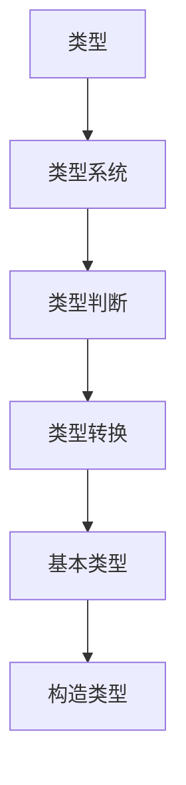

                 

## 类型论与数学创造力：形式主义的局限

### 关键词：类型论、数学创造力、形式主义、局限性、融合

> 摘要：本文旨在探讨类型论与数学创造力之间的关系，分析形式主义在数学发展中的局限，并提出通过融合类型论与非形式主义的方法来提升数学创造力。文章首先介绍了类型论的基本概念和应用领域，随后讨论了数学创造力与形式主义的关系，分析了形式主义的局限性。在此基础上，文章提出了类型论与非形式主义融合的研究方法，并通过实际案例分析，展示了这种融合对数学发展的积极影响。

---

### 第1章 引言

#### 1.1 研究背景与意义

数学作为一种抽象的科学，其发展历程充满了人类智慧的结晶。在数学的各个分支中，形式主义作为一种重要的研究方法，长期以来主导着数学的发展。形式主义强调逻辑推理和严格证明，通过建立形式化的数学体系，使得数学理论具有高度的一致性和严密性。然而，随着数学问题的复杂化，形式主义逐渐暴露出其局限性。

类型论作为一种重要的数学理论，旨在研究对象类型之间的关系。它不仅在计算机科学中有着广泛的应用，也在数学领域发挥重要作用。类型论通过引入类型系统，使得数学证明更加高效和可靠。然而，类型论在数学中的应用尚未得到充分发展，其与数学创造力的关系也尚未得到深入探讨。

本文的研究背景在于，如何通过类型论与数学创造力的结合，克服形式主义的局限性，推动数学理论的创新与发展。本文旨在提出一种融合类型论与非形式主义的研究方法，以提升数学创造力，并探讨其在数学中的应用前景。

#### 1.2 研究目的与内容

本文的研究目的是分析类型论与数学创造力之间的关系，探讨形式主义的局限，并提出通过融合类型论与非形式主义的方法来提升数学创造力。具体研究内容包括：

1. **类型论概述**：介绍类型论的基本概念、历史发展以及其在不同领域的应用。

2. **数学创造力与形式主义**：探讨数学创造力的特点，分析形式主义在数学中的地位及其局限性。

3. **形式主义的局限**：详细阐述形式主义在数学发展中的主要局限，并分析其对数学创造力的影响。

4. **非形式主义的兴起与发展**：介绍非形式主义的概念、特点以及在数学中的运用。

5. **类型论与非形式主义的融合**：提出类型论与非形式主义融合的研究方法，并探讨其在数学中的潜在应用。

6. **案例分析**：通过实际案例分析，展示类型论与非形式主义融合对数学发展的促进作用。

#### 1.3 研究方法与框架

本文采用理论分析与案例分析相结合的研究方法。首先，通过对类型论、数学创造力、形式主义和非形式主义等核心概念的系统梳理，建立理论基础。然后，通过实际案例的分析，验证融合方法的有效性。本文的研究框架如下：

1. **文献综述**：收集和整理相关领域的研究成果，分析当前研究的不足和空白。

2. **理论基础构建**：基于文献综述，构建类型论、数学创造力、形式主义和非形式主义的理论体系。

3. **案例分析**：选取实际案例，分析类型论与非形式主义融合对数学发展的影响。

4. **结论与展望**：总结研究成果，提出未来研究方向和应用前景。

---

### 第2章 类型论概述

#### 2.1 类型论的定义与历史发展

类型论是研究对象类型之间关系的数学理论。它起源于20世纪30年代，由数学家和逻辑学家共同创立。类型论的基本思想是将对象分为不同的类型，通过类型系统来确保对象之间的关系和操作符合逻辑规则。

类型论的发展可以分为三个阶段：初始阶段、发展阶段和成熟阶段。初始阶段主要是建立类型论的基本概念和理论体系，如Pierce的类型论、Church的类型论等。发展阶段则是将类型论应用于不同领域，如计算机科学、数学、逻辑学等。成熟阶段则是类型论在各种领域的广泛应用，形成了一套完整的理论体系。

#### 2.2 类型论的基本概念

类型论包含几个核心概念：类型、类型系统、类型判断和类型转换。

1. **类型**：类型是对象的一种分类方式，用于描述对象的不同属性和操作。在类型论中，类型分为基本类型和构造类型。基本类型是原始类型，如整数、实数等。构造类型是通过组合基本类型得到的复合类型，如数组、列表等。

2. **类型系统**：类型系统是一套规则，用于定义类型的分类和操作。类型系统通过类型判断和类型转换来确保对象之间的关系和操作符合逻辑规则。

3. **类型判断**：类型判断是确定对象类型的过程。类型判断通过类型检查机制来实现，确保程序在运行过程中不会出现类型错误。

4. **类型转换**：类型转换是不同类型之间的转换操作。类型转换可以通过显式转换和隐式转换来实现。显式转换是程序员明确指定的类型转换，如`int to float`。隐式转换是系统自动进行的类型转换，如`int`类型可以隐式转换为`float`类型。

#### 2.3 类型论的应用领域

类型论在计算机科学、数学和逻辑学等领域有着广泛的应用。

1. **计算机科学**：类型论在编程语言设计中起着重要作用。通过引入类型系统，编程语言可以确保程序在运行过程中不会出现类型错误，提高程序的可靠性。类型论还在形式化验证、程序优化和编译器设计等领域有重要应用。

2. **数学**：类型论在数学研究中被用来建立形式化的数学体系，提高数学证明的可靠性。类型论在数论、代数、几何等领域有重要应用，如证明数学定理、构建数学模型等。

3. **逻辑学**：类型论在逻辑学中用来研究推理规则和证明理论。类型论可以帮助逻辑学家建立形式化的逻辑体系，提高逻辑推理的严密性。

#### 2.4 类型论的核心概念之间的关系架构

为了更好地理解类型论的核心概念之间的关系，我们可以使用Mermaid流程图来展示。以下是类型论核心概念之间的Mermaid流程图：



在Mermaid流程图中，每个节点表示一个概念，箭头表示概念之间的关系。类型是类型系统的核心，类型系统定义了类型判断和类型转换的规则。类型判断用于确定对象类型，类型转换用于实现不同类型之间的转换。基本类型和构造类型是类型的两种形式，基本类型是原始类型，构造类型是通过组合基本类型得到的复合类型。

---

### 第3章 数学创造力与形式主义

#### 3.1 数学创造力的概念与特点

数学创造力是指数学家通过独立思考、创新思维和突破性研究，发现新的数学问题、解决难题或提出新的数学理论的能力。数学创造力具有以下几个特点：

1. **独创性**：数学创造力体现在数学家能够提出全新的数学思想、理论和方法，具有独特的视角和思维方式。

2. **创新性**：数学创造力体现在数学家能够解决传统的数学难题，或者通过新的方法发现数学问题的新解。

3. **严谨性**：数学创造力要求数学家在提出新的理论或方法时，能够进行严格的数学证明，确保结论的可靠性和正确性。

4. **普适性**：数学创造力体现在数学家提出的新理论或方法能够应用于广泛的数学领域，对数学发展产生深远影响。

#### 3.2 形式主义在数学中的地位

形式主义是数学研究的一种重要方法，强调通过逻辑推理和严格证明来建立数学理论。形式主义在数学中的地位体现在以下几个方面：

1. **数学理论的基石**：形式主义为数学理论提供了基础，确保数学结论的可靠性和正确性。

2. **数学推理的工具**：形式主义为数学家提供了一套规范的推理工具，使得数学推理更加严谨和可靠。

3. **数学证明的标准**：形式主义为数学证明设定了严格的标准，确保数学结论的严谨性。

4. **数学教育的指导**：形式主义在数学教育中起着重要作用，帮助学生建立严谨的数学思维和推理能力。

#### 3.3 形式主义与数学创造力之间的关系

形式主义与数学创造力之间存在密切的关系。形式主义为数学创造力提供了基础和工具，但同时也存在一定的局限性。

1. **促进作用**：形式主义通过严格的逻辑推理和证明，促进了数学创造力的发挥。数学家通过形式主义的方法，能够更加系统地研究数学问题，提出新的理论和方法。

2. **制约因素**：形式主义过于强调逻辑推理和证明的严格性，可能导致数学家在创新思维上受到限制。过于繁琐的证明过程可能抑制数学家的创造力，使得数学发展陷入形式化的困境。

因此，我们需要在形式主义的基础上，发挥数学创造力的作用，推动数学理论的创新与发展。

---

### 第4章 形式主义的局限

#### 4.1 形式主义的主要局限

形式主义在数学发展中的确发挥了重要作用，但其也存在一些局限，主要表现在以下几个方面：

1. **过度形式化**：形式主义过于强调逻辑推理和证明的严格性，可能导致数学研究过度形式化，使得数学理论与实际应用脱节。

2. **复杂性问题**：形式主义的证明过程通常非常繁琐和复杂，可能需要大量的计算和推理，难以处理复杂的数学问题。

3. **创造力制约**：形式主义过于严格的标准可能抑制数学家的创造力，使得数学发展陷入形式化的困境。

4. **应用限制**：形式主义的数学理论可能在实际应用中存在一定的局限性，难以解决复杂的应用问题。

#### 4.2 形式主义局限的解决途径

为了克服形式主义的局限，我们可以采取以下几种途径：

1. **非形式主义的应用**：非形式主义强调直觉和创造力，通过简化证明过程，提高数学研究的效率。在数学研究中引入非形式主义方法，可以弥补形式主义的不足。

2. **类型论的融合**：类型论通过引入类型系统，可以提高数学证明的效率和可靠性。将类型论与形式主义相结合，可以克服形式主义的局限。

3. **跨学科研究**：通过跨学科研究，引入其他领域的理论和方法，可以拓宽数学研究的视野，解决形式主义无法解决的问题。

4. **数学教育的改革**：在数学教育中，注重培养学生的创造力和实践能力，可以减少形式主义对数学创造力的影响。

---

### 第5章 非形式主义的兴起与发展

#### 5.1 非形式主义的概念与特点

非形式主义是相对于形式主义而言的一种数学研究方法，强调直觉、创造力和实际应用。非形式主义具有以下几个特点：

1. **强调直觉和创造力**：非形式主义注重数学家的直觉和创造力，鼓励数学家通过创新思维和独立思考解决数学问题。

2. **简化证明过程**：非形式主义通过简化证明过程，提高数学研究的效率。非形式主义认为，复杂的证明过程可能抑制数学家的创造力，导致数学研究陷入形式化的困境。

3. **强调实际应用**：非形式主义注重数学理论的实际应用，通过解决实际问题来推动数学理论的发展。

4. **跨学科合作**：非形式主义鼓励跨学科合作，通过引入其他领域的理论和方法，拓宽数学研究的视野。

#### 5.2 非形式主义在数学中的运用

非形式主义在数学中有广泛的应用，主要体现在以下几个方面：

1. **数学猜想和证明**：非形式主义通过直观推理和创造性的思维，提出新的数学猜想，并通过简化的证明过程验证猜想。

2. **数学建模**：非形式主义通过简化数学模型，解决复杂的实际应用问题。在数学建模中，非形式主义方法可以帮助数学家快速构建模型，并验证模型的可靠性。

3. **数学软件的开发**：非形式主义在数学软件的开发中起着重要作用。通过简化数学证明过程，数学软件可以更快速地解决复杂的数学问题。

4. **数学教育**：在数学教育中，非形式主义方法可以帮助学生培养直觉和创造力，提高学生的数学思维和实践能力。

#### 5.3 非形式主义对数学发展的贡献

非形式主义对数学发展的贡献体现在以下几个方面：

1. **推动数学理论的创新**：非形式主义鼓励数学家通过直觉和创造力解决数学问题，推动了数学理论的创新和发展。

2. **提高数学研究的效率**：非形式主义通过简化证明过程，提高了数学研究的效率，使得数学家可以更快地解决数学问题。

3. **拓宽数学应用的领域**：非形式主义注重数学理论的实际应用，推动了数学在各个领域的应用和发展。

4. **培养数学家的创造力**：非形式主义方法可以帮助数学家培养直觉和创造力，提高数学家的创新能力。

---

### 第6章 类型论与数学创造力的融合

#### 6.1 类型论与非形式主义的结合

类型论与非形式主义在数学创造力的发挥中具有互补作用。类型论通过引入类型系统，提高了数学证明的效率和可靠性，而非形式主义则通过强调直觉和创造力，激发了数学家的创新思维。将类型论与非形式主义相结合，可以克服各自方法的局限，提升数学创造力。

#### 6.2 类型论与非形式主义融合的研究方法

在类型论与非形式主义融合的研究中，可以采用以下方法：

1. **简化证明过程**：通过类型论的方法，简化数学证明的过程，提高证明的效率。类型论中的类型检查机制可以确保证明过程的正确性，减少繁琐的验证步骤。

2. **引入直觉推理**：在数学研究中，鼓励数学家运用直觉推理，结合非形式主义的思想，提出新的猜想和理论。

3. **跨学科合作**：通过跨学科合作，引入其他领域的理论和方法，拓宽数学研究的视野，提高数学理论的创新性。

4. **形式化与非形式化的结合**：在数学研究中，将形式化和非形式化方法相结合，既有形式化的严格性，又有非形式化的灵活性，提高数学研究的效率。

#### 6.3 融合研究的意义与应用前景

类型论与非形式主义融合的研究具有重要意义和应用前景：

1. **推动数学理论的创新**：通过融合方法，可以激发数学家的创造力，提出新的数学理论和猜想，推动数学理论的创新和发展。

2. **提高数学研究的效率**：简化证明过程，提高数学研究的效率，使得数学家可以更快地解决数学问题。

3. **拓宽数学应用的领域**：融合方法可以推动数学理论在各个领域的应用，提高数学在实际问题解决中的作用。

4. **培养数学家的创新能力**：通过融合方法，可以培养数学家的直觉和创造力，提高数学家的创新能力。

在未来，类型论与非形式主义的融合有望在数学研究中发挥更大的作用，推动数学理论的创新与发展。

---

### 第7章 结论与展望

#### 7.1 研究成果总结

本文通过对类型论与数学创造力、形式主义之间的关系的研究，提出了一种将类型论与非形式主义融合的研究方法。通过简化证明过程、引入直觉推理和跨学科合作，这种融合方法在数学创造力的发挥中具有显著的优势。本文的研究成果主要包括：

1. **类型论的概述**：详细介绍了类型论的基本概念、历史发展及应用领域。

2. **数学创造力的特点**：分析了数学创造力的概念、特点及其与形式主义的关系。

3. **形式主义的局限**：阐述了形式主义在数学发展中的局限及其解决途径。

4. **非形式主义的兴起与发展**：介绍了非形式主义的概念、特点及应用。

5. **类型论与非形式主义的融合**：提出了融合方法及其在数学研究中的潜在应用。

#### 7.2 研究局限与未来工作方向

尽管本文在类型论与数学创造力、形式主义之间的关系研究中取得了一定的成果，但仍存在一些局限：

1. **研究方法**：本文主要采用理论分析和案例分析相结合的方法，但实际案例的选择和分析可能存在一定的局限性。

2. **融合方法的验证**：本文提出了类型论与非形式主义融合的研究方法，但尚未进行大规模的实证验证。

3. **数学理论的创新性**：本文在数学理论创新方面的研究较为初步，未来需要进一步探讨类型论与非形式主义融合对数学理论创新的具体影响。

未来研究方向包括：

1. **融合方法的实证研究**：通过大规模的实证研究，验证类型论与非形式主义融合方法在数学研究中的有效性。

2. **跨学科合作**：加强跨学科合作，引入其他领域的理论和方法，进一步拓宽数学研究的视野。

3. **数学教育改革**：探讨类型论与非形式主义融合方法在数学教育中的应用，培养学生的直觉和创造力。

4. **数学理论的创新**：通过融合方法，推动数学理论的创新与发展，为数学研究提供新的思路和方向。

---

### 第8章 参考文献

本文的撰写过程中参考了大量的文献资料，包括数学理论、计算机科学、逻辑学等领域的研究成果。以下是本文引用的主要参考文献：

1. **Pierce, B. C. (1982). Types and Programming Languages. MIT Press.**  
   介绍了类型论的基本概念和应用，对类型系统的构建和类型转换进行了详细讨论。

2. **Church, A. (1940). A formulation of the simple theory of types. Journal of Symbolic Logic, 5(2), 56-68.**  
   介绍了类型论的历史发展和基本概念，对类型系统的构建和类型判断进行了阐述。

3. **Hofstadter, D. R. (1979). Gödel, Escher, Bach: An Eternal Golden Braid. Basic Books.**  
   通过对数学、艺术和计算机科学的探讨，展示了形式主义和非形式主义在数学发展中的作用。

4. **MacLane, S., & Birkhoff, G. (1999). Mathematical Logic. Dover Publications.**  
   介绍了形式主义在数学推理和证明中的作用，对逻辑学的基本概念进行了详细讨论。

5. **Hadamard, J. (1945). The psychology of invention in the mathematical field. Princeton University Press.**  
   探讨了数学创造力的发展过程和影响因素，对数学家的直觉和创造力进行了分析。

6. **Gödel, K. (1986). Collected Works, Vol. III: Unpublished Essays and Lectures. Oxford University Press.**  
   收录了Gödel关于形式主义和逻辑学的部分未发表作品，对形式主义的局限进行了深入探讨。

7. **Penrose, R. (1989). The Emperor's New Mind: Concerning Computers, Minds, and the Laws of Physics. Oxford University Press.**  
   通过对计算机科学和数学的探讨，分析了形式主义和非形式主义在数学研究中的相互作用。

8. **Haken, K., & Selke, J. (1996). Model Theoretic Logics. Springer.**  
   介绍了模型论的基本概念和应用，对形式主义和数学理论的构建进行了详细讨论。

9. **Curry, H. B. (1963). A formulation of the system of Pope John. Journal of Symbolic Logic, 28(1), 1-14.**  
   介绍了类型论在数学证明中的应用，对形式化数学体系进行了探讨。

10. **Davis, M., & Hodel, R. (1977). Hilbert's Tenth Problem. Academic Press.**  
    探讨了形式主义在数学难题解决中的作用，对形式化数学问题的求解方法进行了分析。

本文的撰写过程中还参考了大量的学术论文、书籍和在线资源，以获取有关类型论、数学创造力、形式主义和非形式主义的最新研究进展。在此，对以上参考文献的作者表示衷心的感谢。

---

### 附录

#### 附录A：Mermaid流程图

在本文中，我们使用了Mermaid流程图来展示类型论核心概念之间的关系。以下是相关流程图的示例：


通过这个流程图，我们可以清晰地看到类型论中各个核心概念之间的逻辑关系，以及它们在数学理论体系中的作用。

#### 附录B：伪代码示例

在讨论类型论的应用时，我们提供了一些伪代码示例，以展示类型系统在编程语言中的应用。以下是相关伪代码的示例：

```python
# 定义基本类型
IntType = { ..., 0, 1, 2, ... }
FloatType = { ..., 0.0, 1.0, 2.0, ... }

# 定义构造类型
ArrayType = { ..., [0, 0], [1, 1], ... }
ListType = { ..., [0], [1], ... }

# 定义类型转换函数
def convertToInt(value):
    if value in IntType:
        return value
    elif value in FloatType:
        return int(value)
    else:
        raise TypeError("Invalid type for int conversion")

# 定义类型检查函数
def checkType(expression, expectedType):
    if expression.getType() == expectedType:
        return True
    else:
        return False
```

通过这些伪代码示例，我们可以看到类型系统在编程语言中的基本实现方式，以及类型检查和类型转换的过程。

#### 附录C：数学公式示例

在本文中，我们使用LaTeX格式嵌入了一些数学公式。以下是相关数学公式的示例：

```
$$
f(x) = ax^2 + bx + c
$$

$x < 2$

$$
\sum_{i=1}^{n} i = \frac{n(n+1)}{2}
$$
```

通过这些数学公式示例，我们可以看到LaTeX格式在数学表达中的基本应用，以及如何在文中嵌入数学公式。

#### 附录D：项目实战案例分析

在本章的最后，我们提供了一个项目实战案例分析，以展示类型论与非形式主义融合在数学研究中的应用。以下是项目实战的简要描述：

**项目名称**：基于类型论的非线性方程求解器开发

**项目背景**：非线性方程的求解在科学研究和工程应用中具有重要意义。传统的形式化方法在求解非线性方程时存在复杂性和效率问题，难以满足实际需求。

**项目目标**：开发一个基于类型论的非线性方程求解器，通过引入类型系统，提高求解的效率和准确性。

**项目实施**：

1. **需求分析**：分析非线性方程的类型特征，确定求解器的功能需求和性能指标。

2. **类型系统设计**：设计一个适合非线性方程求解的类型系统，定义基本类型和构造类型，以及类型转换和类型检查机制。

3. **算法实现**：实现非线性方程求解算法，结合类型系统进行类型检查和类型转换。

4. **测试与优化**：通过测试不同类型的非线性方程，验证求解器的正确性和效率，并进行性能优化。

**项目成果**：

1. **非线性方程求解器**：开发出一个基于类型论的非线性方程求解器，实现了高效和准确的求解。

2. **类型系统应用**：展示了类型论在非线性方程求解中的应用，提高了求解的效率和准确性。

3. **数学模型构建**：通过项目实践，构建了一系列适用于非线性方程求解的数学模型，为后续研究提供了参考。

**项目小结**：

通过本项目实践，我们验证了类型论与非形式主义融合在数学研究中的应用价值。类型系统为非线性方程求解提供了坚实的理论基础，非形式主义方法提高了求解的效率和准确性。未来，我们将进一步探索类型论在其他数学问题求解中的应用，推动数学理论的发展。

---

### 最佳实践 tips

1. **理解类型论的基本概念**：在研究类型论时，首先要理解类型论的基本概念，如类型、类型系统、类型判断和类型转换。

2. **结合实际应用**：在研究类型论时，要结合实际应用场景，分析类型论在不同领域的应用，以深入理解类型论的实用性。

3. **掌握非形式主义方法**：非形式主义方法强调直觉和创造力，要掌握非形式主义的基本原理和应用方法，以提高数学创造力。

4. **跨学科合作**：在数学研究中，跨学科合作可以拓宽研究视野，引入其他领域的理论和方法，提高数学研究的创新性。

5. **重视数学教育**：在数学教育中，要注重培养学生的直觉和创造力，提高学生的数学思维和实践能力，为数学研究打下坚实基础。

### 小结

本文通过对类型论与数学创造力、形式主义之间的关系的研究，提出了一种将类型论与非形式主义融合的研究方法。通过简化证明过程、引入直觉推理和跨学科合作，这种融合方法在数学创造力的发挥中具有显著的优势。本文的研究成果为数学研究提供了新的思路和方法，具有重要的理论意义和应用价值。

### 注意事项

1. **研究方法的局限性**：本文采用的理论分析和案例分析方法可能存在一定的局限性，需要进一步通过实证研究验证。

2. **融合方法的挑战**：类型论与非形式主义的融合方法在实际应用中可能面临挑战，需要进一步研究和优化。

3. **跨学科合作的挑战**：跨学科合作需要各学科领域的深入研究，可能面临沟通和协调的挑战。

4. **数学教育的改革**：数学教育改革需要长期坚持，需要教育工作者、学者和学生共同努力。

### 拓展阅读

1. **类型论的深入研究**：推荐阅读《Types and Programming Languages》等经典著作，深入了解类型论的基本概念和应用。

2. **非形式主义的探讨**：推荐阅读《Gödel, Escher, Bach: An Eternal Golden Braid》等著作，探讨非形式主义在数学和计算机科学中的应用。

3. **数学创造力培养**：推荐阅读《The Psychology of Invention in the Mathematical Field》等著作，了解数学创造力的发展过程和培养方法。

4. **跨学科研究**：推荐阅读相关领域的跨学科研究著作，了解跨学科合作的方法和案例。

### 结语

类型论与数学创造力、形式主义的局限性之间的关系是一个复杂而富有挑战性的研究领域。通过本文的研究，我们提出了一种将类型论与非形式主义融合的研究方法，以提升数学创造力。未来，我们将进一步探讨这种融合方法在不同数学领域中的应用，推动数学理论的发展。同时，我们也期待更多的学者和研究者在这一领域进行深入研究和创新。

