                 


### 第1章：类型论的基本概念

#### 1.1 类型论的起源与发展

类型论作为一种数学和逻辑学的分支，其起源可以追溯到19世纪末和20世纪初。当时，数学家开始意识到，通过引入类型的概念，可以更好地理解数学基础和避免形式逻辑中的悖论。其中，瑞士数学家赫尔曼·海因里希·基尔霍夫（Hermann Hankel）和德国哲学家弗里德里希·路德维希·戈特洛布·弗雷格（Friedrich Ludwig Gottlob Frege）是最早对类型论做出贡献的学者。

随着时间的推移，类型论得到了进一步的发展。20世纪初，挪威逻辑学家罗尔夫·霍洛维茨（Rudolf Carnap）和美国逻辑学家阿尔弗雷德·塔斯基（Alfred Tarski）等人对类型论的研究为现代形式逻辑奠定了基础。此外，类型论也在计算机科学中找到了应用，特别是在编程语言设计和形式化验证等领域。

**Mermaid 流程图：**

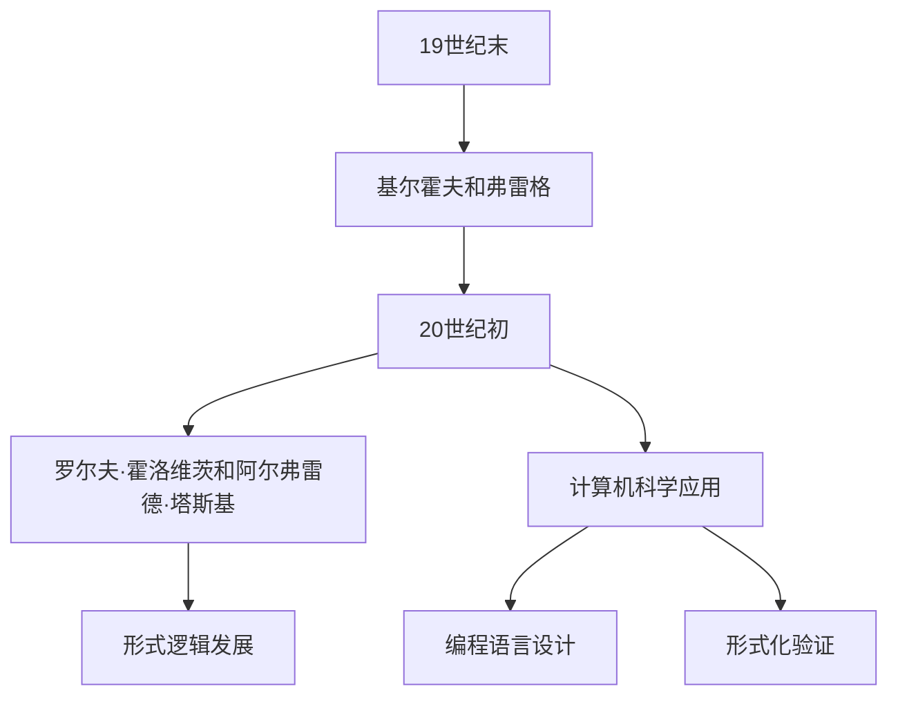

#### 1.2 类型论的核心观点

类型论的核心观点可以总结为以下几点：

1. **类型的抽象性**：类型是用于表示对象共性的抽象概念。例如，在编程语言中，整数类型可以表示所有的整数对象。
2. **类型的层次结构**：类型可以构成复合类型，如记录类型、联合类型等。这种层次结构有助于更好地组织和管理数据。
3. **类型系统的安全性**：类型系统可以确保程序的运行安全，防止类型错误的发生。例如，通过静态类型检查，编译器可以在编译期间发现类型错误。

**核心概念与联系**

为了更好地理解类型论的核心观点，我们可以通过一个Mermaid流程图来展示这些概念之间的关系：

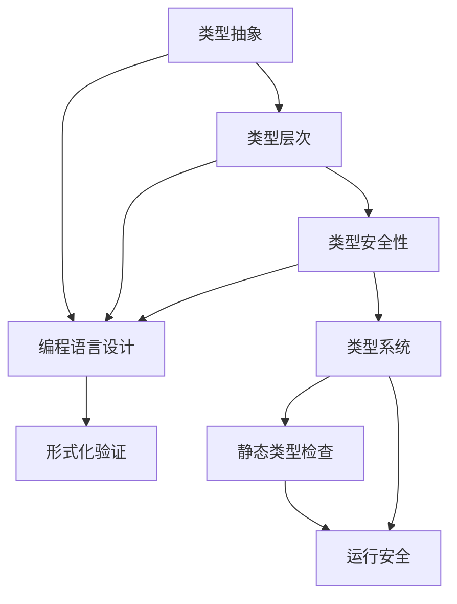

#### 1.3 类型论的应用领域

类型论在多个领域都有广泛的应用：

1. **编程语言设计**：类型论为编程语言的设计提供了理论基础，使得编程语言能够更好地支持抽象和数据管理。
2. **形式化验证**：类型论在形式化验证中发挥着重要作用，可以帮助验证程序的正确性，提高软件质量。
3. **软件工程**：类型论为软件工程提供了方法论，有助于开发出更可靠、更安全的软件系统。
4. **人工智能**：类型论在人工智能领域也有所应用，特别是在逻辑推理和知识表示方面。

**Mermaid 流程图：**

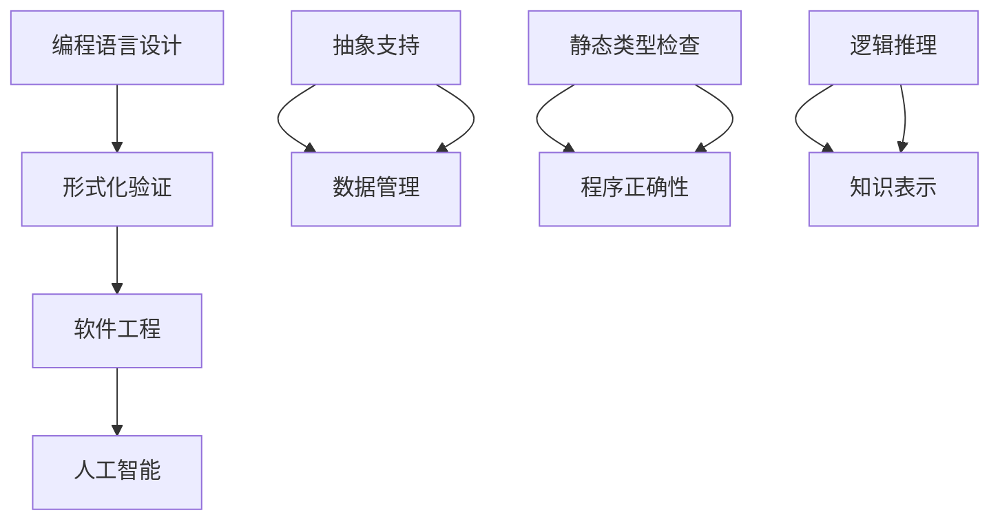

---

作者：AI天才研究院/AI Genius Institute & 禅与计算机程序设计艺术 /Zen And The Art of Computer Programming

**摘要：**

本文探讨了类型论的基本概念，包括其起源、核心观点以及应用领域。通过Mermaid流程图和伪代码，详细阐述了类型论的概念关系和算法原理。类型论作为一种抽象和层次化的概念，在编程语言设计、形式化验证和人工智能等领域发挥着重要作用，为现代计算机科学提供了坚实的理论基础。

## 第2章：类型论的数学基础

### 2.1 代数类型

代数类型是类型论中的一种基本类型，用于表示集合或抽象数据类型。在代数类型中，数据元素可以通过构造函数来创建，并通过选择器（也称为投影函数）来访问。

**核心概念与联系**

代数类型的主要组成部分包括构造函数和选择器。构造函数用于创建新的数据实例，而选择器则用于访问和修改数据实例中的元素。例如，在编程语言中，记录类型和联合类型都可以被视为代数类型。

**Mermaid 流程图：**

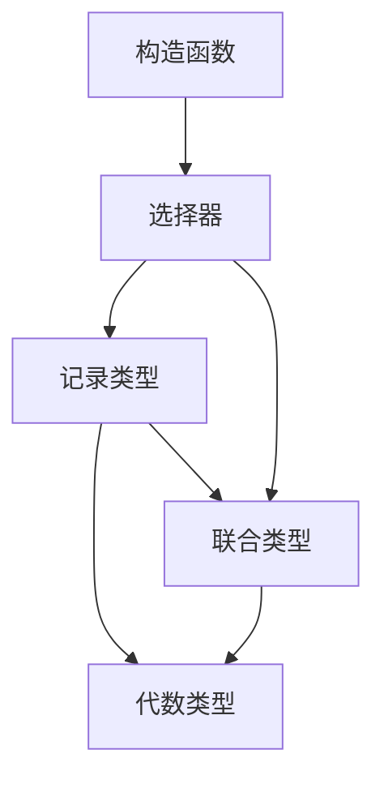

**伪代码示例：**

```python
# 定义一个代数类型：Person
class Person:
    def __init__(self, name, age):
        self.name = name
        self.age = age

# 构造函数示例
person1 = Person("Alice", 30)

# 选择器示例
print(person1.name)  # 输出：Alice
print(person1.age)   # 输出：30
```

### 2.2 计算类型

计算类型是类型论中用于表示可计算对象的类型。这类类型通常与函数和过程相关。在计算类型中，数据元素不仅可以是值，还可以是函数。

**核心概念与联系**

计算类型的主要特点是函数和过程，可以通过函数类型来表示。例如，在编程语言中，函数类型可以表示一个函数，该函数接受一个输入并返回一个输出。

**Mermaid 流程图：**

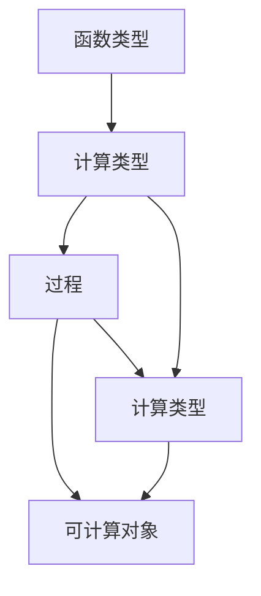

**伪代码示例：**

```python
# 定义一个计算类型：add
def add(x: int, y: int) -> int:
    return x + y

# 调用计算类型
result = add(3, 4)  # 输出：7
```

### 2.3 结构类型

结构类型是类型论中用于表示复杂数据结构的类型。这类类型通常包含多个成员，每个成员都有自己的类型和名称。

**核心概念与联系**

结构类型的主要特点是复合性，可以包含多个成员。例如，在编程语言中，记录类型和结构体都可以被视为结构类型。

**Mermaid 流程图：**

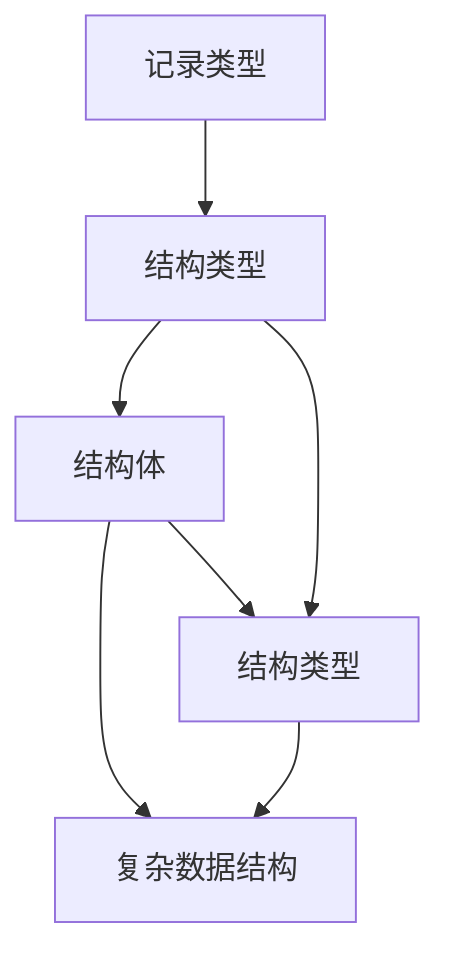

**伪代码示例：**

```python
# 定义一个结构类型：Address
class Address:
    def __init__(self, street, city, country):
        self.street = street
        self.city = city
        self.country = country

# 创建结构类型实例
address = Address("123 Main St", "Anytown", "USA")

# 访问结构类型成员
print(address.street)  # 输出：123 Main St
print(address.city)    # 输出：Anytown
print(address.country) # 输出：USA
```

---

在这一章中，我们详细介绍了类型论的数学基础，包括代数类型、计算类型和结构类型。通过Mermaid流程图和伪代码，我们展示了这些类型的核心概念和联系，并提供了具体的示例来帮助读者理解。类型论作为计算机科学的重要理论基础，对于理解编程语言、形式化验证和软件工程等领域具有重要意义。

## 第3章：类型论与形式化

### 3.1 形式化的概念

形式化是数学和逻辑学中的一个重要概念，指的是将自然语言描述的数学和逻辑概念转换为符号系统表示的过程。形式化的目的是提高数学和逻辑推理的准确性和可验证性，使得数学和逻辑理论更加严谨和可靠。

**核心概念与联系**

形式化涉及以下几个核心概念：

1. **符号语言**：形式化使用一种专门的符号语言来表示数学和逻辑概念。这种语言通常包含定义明确的符号和规则，使得表达更加精确。
2. **公理系统**：形式化通常基于一组公理，这些公理是无条件成立的假设，用于推导其他结论。
3. **推理规则**：形式化使用一系列推理规则来推导新的结论。推理规则定义了如何从已知的事实推导出新的结论。
4. **证明**：形式化中的证明是一种逻辑上严格的过程，用于证明一个命题是正确的。

**Mermaid 流程图：**

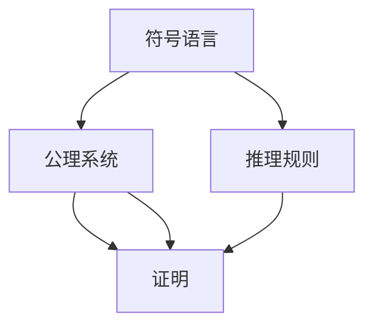

**伪代码示例：**

```python
# 定义形式化过程
def formalize_statement(statement: str) -> str:
    """
    将自然语言描述的数学和逻辑概念转换为符号语言表示。
    
    :param statement: 自然语言描述的数学和逻辑概念
    :return: 符号语言表示的数学和逻辑概念
    """
    # 具体转换逻辑
    # ...
    return symbolized_statement

# 调用形式化过程
original_statement = "所有偶数都能被2整除"
symbolized_statement = formalize_statement(original_statement)
print(symbolized_statement)
```

### 3.2 形式化的方法

形式化通常采用以下几种方法：

1. **形式化逻辑**：形式化逻辑是使用符号语言和推理规则来表示和推理逻辑命题的方法。常见的形式化逻辑包括命题逻辑、谓词逻辑等。
2. **形式化数学**：形式化数学是通过符号语言和公理系统来表示数学理论和证明定理的方法。例如，皮亚诺公理系统用于形式化自然数的基本性质。
3. **形式化编程**：形式化编程是使用形式化的方法来设计、验证和证明程序的正确性。这种方法通常涉及形式化验证工具和形式化编程语言。

**Mermaid 流程图：**

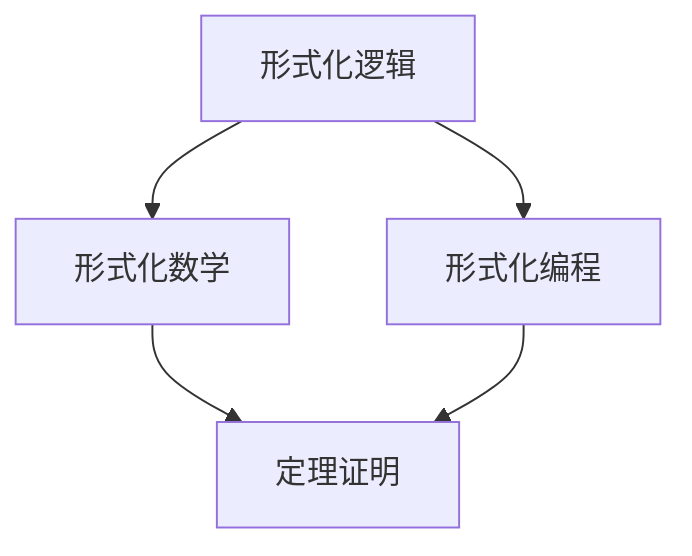

### 3.3 形式化在类型论中的应用

形式化在类型论中的应用非常重要，它为类型系统的正确性和安全性提供了理论基础。以下是形式化在类型论中的一些应用：

1. **类型检查**：形式化方法可以用于实现类型检查器，确保程序的每个操作都在正确的类型上执行。
2. **类型推断**：形式化方法可以用于自动推断变量和表达式的类型，提高编程效率和代码可读性。
3. **类型安全证明**：形式化方法可以用于证明类型系统的安全性质，确保程序在运行时不发生类型错误。

**Mermaid 流程图：**

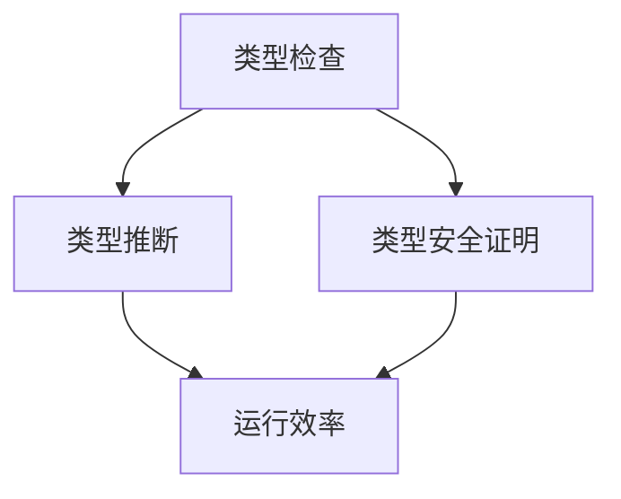

**伪代码示例：**

```python
# 定义形式化类型检查过程
def type_check(program: str) -> bool:
    """
    使用形式化方法检查程序的类型正确性。
    
    :param program: 程序代码字符串
    :return: 类型检查结果（True或False）
    """
    # 具体类型检查逻辑
    # ...
    return is_type_correct

# 调用形式化类型检查过程
program_code = "x = 3 + '5'"
result = type_check(program_code)
print(result)  # 输出：False
```

---

在这一章中，我们探讨了类型论与形式化之间的关系。通过介绍形式化的概念、方法和在类型论中的应用，我们展示了形式化在确保类型系统正确性和安全性方面的重要性。形式化不仅为类型论提供了理论基础，还为实际编程和软件开发提供了实用的工具和方法。

## 第4章：数学直觉的本质

### 4.1 数学直觉的概念

数学直觉是指人们在不经过明确逻辑推理的情况下，对数学问题的本质、解决方案或数学真理的一种直观感受。这种直觉并非凭空产生，而是基于长期的学习、实践和思考积累而来。

**核心概念与联系**

数学直觉涉及以下几个核心概念：

1. **直观感知**：数学直觉是一种直接的感知能力，使人们能够快速理解数学概念和问题。
2. **经验积累**：数学直觉是通过对大量数学知识和实践经验的积累形成的。
3. **心理模式**：数学直觉还涉及到人们形成的一些心理模式，这些模式有助于快速识别数学问题和解决方案。

**Mermaid 流程图：**

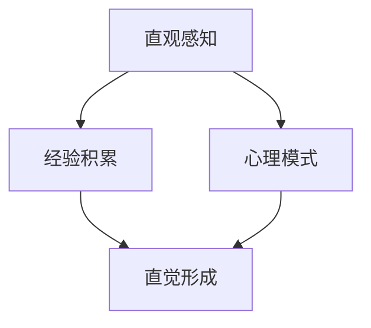

### 4.2 数学直觉的形成

数学直觉的形成是一个复杂的过程，通常受到以下几个方面的影响：

1. **早期教育**：在儿童时期，通过数学教育和游戏等活动，人们开始培养对数学的直观感知。
2. **大量练习**：通过反复的数学练习，人们能够加深对数学概念的理解，形成有效的心理模式。
3. **思维锻炼**：通过解决各种数学问题，人们的逻辑思维和创造力得到锻炼，有助于提高数学直觉。
4. **经验积累**：随着数学知识和实践经验的不断积累，数学直觉变得更加敏锐。

**Mermaid 流程图：**

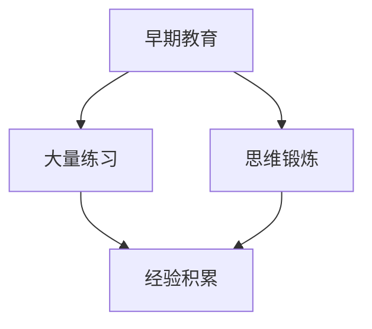

### 4.3 数学直觉的重要性

数学直觉在数学研究和应用中具有重要作用，主要表现在以下几个方面：

1. **快速发现和解决问题**：数学直觉可以帮助人们迅速识别数学问题，找到潜在的解决方案。
2. **创新和突破**：数学直觉在推动数学创新和解决复杂数学问题方面发挥着关键作用。许多重大数学发现都是基于直觉。
3. **提高效率**：在数学学习和应用过程中，直觉可以减少不必要的计算和推理步骤，提高工作效率。
4. **增强创造力**：数学直觉有助于培养创新思维，激发数学领域的创造力。

**Mermaid 流程图：**

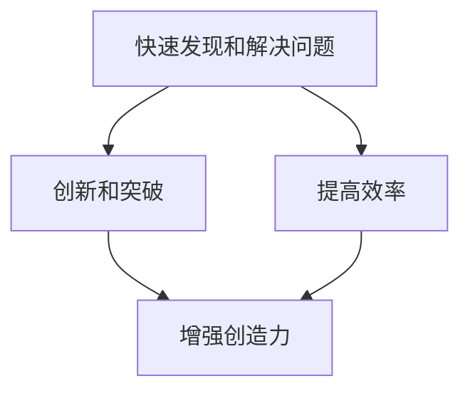

### 4.4 数学直觉与创造力

数学直觉与创造力密切相关，二者相互作用，共同推动数学的发展。数学直觉为创造力提供了基础，而创造力则通过新颖的思维方式和创新的方法，促进了数学直觉的提升。

1. **直觉激发创造力**：数学直觉可以帮助人们预见可能的新发现和新方法，激发创造力。
2. **创造力丰富直觉**：创造力的发挥可以使数学直觉更加敏锐和灵活，从而发现更多数学问题和解决方案。

**Mermaid 流程图：**

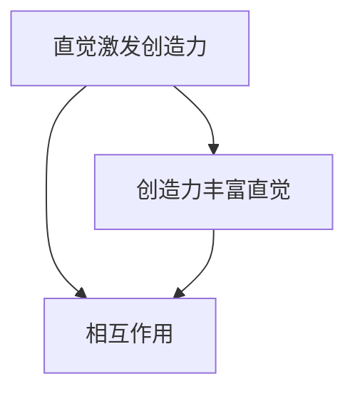

### 4.5 培养数学直觉的创造力

要培养数学直觉和创造力，可以采取以下方法：

1. **多读多练**：通过阅读数学书籍和论文，以及大量练习，积累数学知识和经验。
2. **多思考多提问**：在面对数学问题时，不要急于求解，而是先思考问题的本质和可能的解决方法。
3. **跨学科学习**：学习其他学科的知识和方法，有助于拓展思维，提高创造力。
4. **参与数学竞赛和讨论**：通过参与数学竞赛和讨论，激发数学直觉和创造力，与他人交流想法，共同进步。

**Mermaid 流程图：**

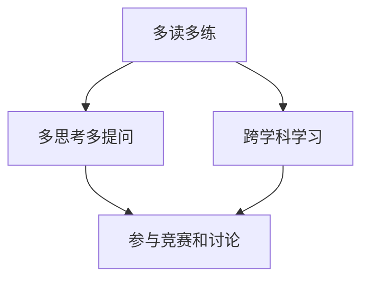

---

在这一章中，我们探讨了数学直觉的概念、形成过程、重要性以及与创造力的关系。通过介绍数学直觉的培养方法，我们希望读者能够认识到数学直觉的价值，并在数学学习和研究中不断提升自己的直觉和创造力。数学直觉作为一种宝贵的思维能力，对于解决数学问题和推动数学发展具有重要意义。

## 第5章：数学直觉与创造力

### 5.1 数学直觉与创造性思维

数学直觉与创造性思维密切相关，二者相辅相成，共同推动数学的发展。数学直觉是指人们在不经过明确逻辑推理的情况下，对数学问题的本质、解决方案或数学真理的一种直观感受。而创造性思维则是指人们运用新颖、独特的方法和思路，创造性地解决问题的能力。

**核心概念与联系**

数学直觉与创造性思维的连接点在于它们都能帮助人们超越传统逻辑思维，寻找新的解决方法和思路。数学直觉可以激发创造性思维，而创造性思维则能够丰富和深化数学直觉。

**Mermaid 流程图：**

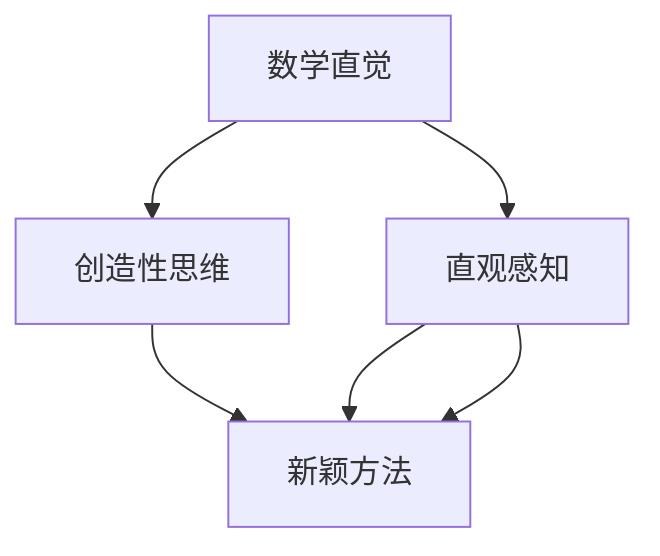

**伪代码示例：**

```python
# 定义数学直觉函数
def mathematical_intuition(problem):
    """
    利用数学直觉解决数学问题。
    
    :param problem: 数学问题
    :return: 解决方案
    """
    solution = intuitive_solution(problem)
    return solution

# 定义创造性思维函数
def creative_thinking(problem):
    """
    利用创造性思维解决数学问题。
    
    :param problem: 数学问题
    :return: 解决方案
    """
    solution = innovative_solution(problem)
    return solution

# 调用函数解决数学问题
problem = "证明勾股定理"
solution = mathematical_intuition(problem)
print(solution)  # 输出：勾股定理的证明过程

solution = creative_thinking(problem)
print(solution)  # 输出：一种新颖的证明方法
```

### 5.2 创造力在数学直觉中的作用

创造力在数学直觉中起着关键作用，它能够激发数学直觉的潜能，使得数学直觉更加敏锐和丰富。以下是创造力在数学直觉中的作用：

1. **拓展思维边界**：创造力能够帮助人们打破常规思维，探索未知领域，从而拓展数学直觉的边界。
2. **发现新方法**：创造力可以促使人们发现新的解题方法和思路，使得数学直觉更加多样化。
3. **激发灵感**：创造力能够激发数学直觉的灵感，使得人们在面对数学问题时，能够迅速找到解决方案。

**Mermaid 流程图：**

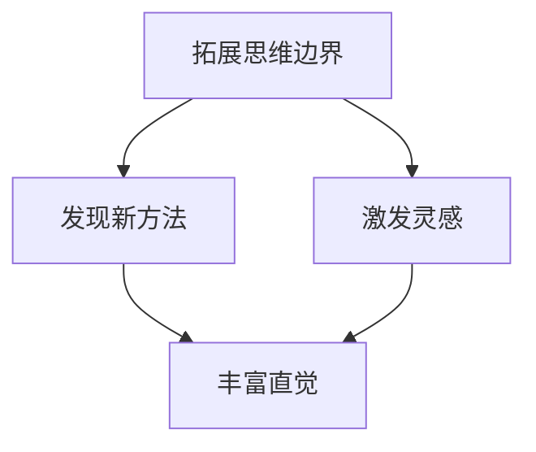

### 5.3 培养数学直觉的创造力

要培养数学直觉和创造力，可以采取以下方法：

1. **多阅读**：阅读数学书籍、论文和经典著作，了解数学历史和前沿研究，拓展数学知识面。
2. **多思考**：在面对数学问题时，不要急于求解，而是先思考问题的本质和可能的解决方法，培养逻辑思维。
3. **多练习**：通过大量练习，加深对数学概念的理解，培养数学直觉。
4. **跨学科学习**：学习其他学科的知识和方法，有助于拓展思维，提高创造力。
5. **参与竞赛和讨论**：参加数学竞赛和讨论，与他人交流想法，激发数学直觉和创造力。

**Mermaid 流程图：**

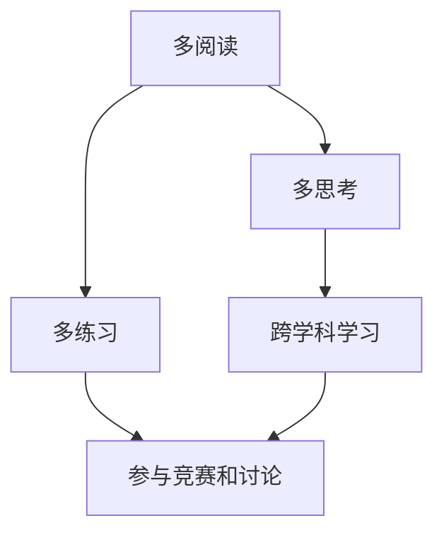

### 5.4 创造力与数学直觉在数学问题解决中的应用

创造力与数学直觉在数学问题解决中发挥着重要作用，它们共同推动数学问题的发现和解决。以下是创造力与数学直觉在数学问题解决中的应用：

1. **发现新问题**：创造力可以激发数学直觉，帮助人们发现新的数学问题和领域。
2. **提出新方法**：数学直觉与创造力结合，可以提出新颖的数学方法和思路，解决传统方法无法解决的问题。
3. **优化解决方案**：创造力可以优化数学直觉提出的解决方案，使其更加简洁和高效。

**Mermaid 流程图：**

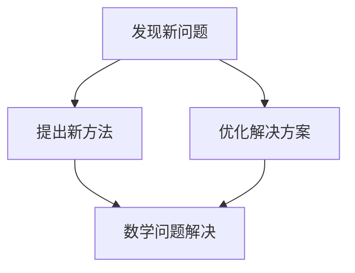

---

在这一章中，我们探讨了数学直觉与创造力的关系，以及它们在数学问题解决中的应用。通过介绍培养数学直觉和创造力的方法，我们希望读者能够认识到它们的重要性，并在数学学习和研究中不断提升自己的直觉和创造力。数学直觉和创造力共同推动数学的发展，是解决数学问题的宝贵能力。

## 第6章：数学直觉在问题解决中的应用

### 6.1 数学直觉在数学问题解决中的应用

数学直觉在数学问题解决中扮演着至关重要的角色。它可以帮助我们迅速识别问题、理解问题本质，并找到潜在的解决方案。以下是数学直觉在数学问题解决中的应用：

**核心概念与联系**

1. **快速识别问题**：数学直觉使人们能够迅速识别数学问题，理解问题的核心。
2. **探索解决方案**：数学直觉激发人们的创造力，促使他们探索不同的解决方案。
3. **验证方案**：数学直觉还可以帮助验证解决方案的正确性。

**Mermaid 流程图：**

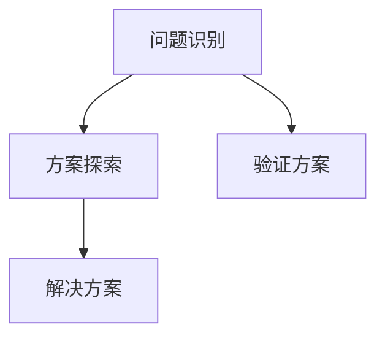

**伪代码示例：**

```python
# 定义数学问题解决函数
def solve_math_problem(problem):
    """
    利用数学直觉解决数学问题。
    
    :param problem: 数学问题
    :return: 解决方案
    """
    solution = intuitive_solution(problem)
    if verify_solution(solution):
        return solution
    else:
        return "解决方案不正确"

# 调用函数解决数学问题
problem = "证明勾股定理"
solution = solve_math_problem(problem)
print(solution)
```

### 6.2 数学直觉在算法设计中的应用

数学直觉在算法设计中也非常重要，它可以帮助设计者快速找到有效的算法策略。以下是数学直觉在算法设计中的应用：

**核心概念与联系**

1. **发现算法模式**：数学直觉可以帮助设计者识别潜在的算法模式，设计高效的算法。
2. **优化算法结构**：数学直觉可以帮助设计者优化算法结构，提高算法的运行效率。
3. **解决复杂问题**：数学直觉在解决复杂问题时，可以帮助设计者找到合适的算法策略。

**Mermaid 流程图：**

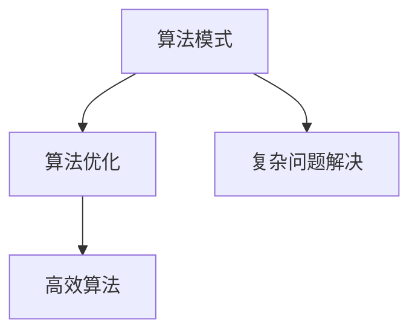

**伪代码示例：**

```python
# 定义算法设计函数
def design_algorithm(problem):
    """
    利用数学直觉设计算法。
    
    :param problem: 数学问题
    :return: 算法实现
    """
    algorithm = intuitive_algorithm(problem)
    optimized_algorithm = optimize_algorithm(algorithm)
    return optimized_algorithm

# 调用函数设计算法
problem = "计算斐波那契数列的第N项"
algorithm = design_algorithm(problem)
print(algorithm)
```

### 6.3 数学直觉在其他领域的应用

除了在数学和算法领域，数学直觉还在其他领域有着广泛的应用。以下是数学直觉在其他领域的一些应用：

**核心概念与联系**

1. **工程领域**：数学直觉在工程领域可以帮助设计者识别潜在的问题，提出创新性的解决方案。
2. **经济学领域**：数学直觉在经济学领域可以帮助研究者发现经济现象背后的规律，预测市场趋势。
3. **生物学领域**：数学直觉在生物学领域可以帮助研究者分析生物系统，揭示生物现象的本质。

**Mermaid 流程图：**

```mermaid
graph TD
    A[工程领域] --> B[经济学领域]
    A --> C[生物学领域]
    B --> D[问题识别]
    C --> D
```

**伪代码示例：**

```python
# 定义数学直觉应用函数
def apply_math_intuition(domain, problem):
    """
    在特定领域应用数学直觉。
    
    :param domain: 应用领域
    :param problem: 问题
    :return: 解决方案
    """
    solution = intuitive_solution(problem, domain)
    return solution

# 调用函数应用数学直觉
domain = "工程"
problem = "设计一个高效的水处理系统"
solution = apply_math_intuition(domain, problem)
print(solution)
```

---

在这一章中，我们详细探讨了数学直觉在数学问题解决、算法设计以及其他领域中的应用。通过介绍数学直觉的核心概念和伪代码示例，我们希望读者能够更好地理解数学直觉的价值，并在实际问题解决中灵活运用。数学直觉作为一种宝贵的思维能力，对于推动数学发展和解决复杂问题具有重要意义。

## 第7章：形式化与创造力的关系

### 7.1 形式化对创造力的限制

形式化在确保数学和逻辑推理的严谨性方面发挥了重要作用，但它也可能对创造力产生一定的限制。以下是形式化对创造力可能产生的限制：

1. **思维模式的固化**：形式化通常依赖于特定的符号系统和推理规则，这可能导致思维模式的固化，使得人们在解决问题时局限于传统的思维方式。
2. **细节的过分关注**：形式化强调逻辑推理的严密性，可能导致对细节的过分关注，忽略了整体和潜在的创造性思路。
3. **创造性思维的压抑**：过于严格的规则和约束可能会压抑创造性思维，使得人们不敢尝试新颖的想法。

**核心概念与联系**

形式化对创造力的限制主要体现在以下几个方面：

1. **符号系统的局限性**：符号系统可能无法完全捕捉人类思维的所有可能性，限制了创造性思维的发挥。
2. **推理规则的约束**：严格的推理规则可能会限制思维的自由度，使得人们在解决问题时难以跳出传统框架。
3. **形式化方法的复杂性**：形式化方法本身可能较为复杂，使得人们难以轻松应用。

**Mermaid 流程图：**

```mermaid
graph TD
    A[符号系统的局限性] --> B[推理规则的约束]
    A --> C[形式化方法的复杂性]
    B --> D[创造力限制]
    C --> D
```

### 7.2 创造力对形式化的影响

创造力在形式化过程中同样扮演着重要角色，它能够激发新的思维方式，丰富形式化的方法。以下是创造力对形式化可能产生的影响：

1. **新方法和新工具**：创造力可以激发新的形式化方法和工具，使得形式化更加灵活和有效。
2. **问题识别和解决**：创造力有助于识别形式化中的问题，并提出创新的解决方案。
3. **形式化方法的改进**：创造力可以推动形式化方法的改进，提高其应用效率和准确性。

**核心概念与联系**

创造力对形式化的影响主要体现在以下几个方面：

1. **思维的创新性**：创造力使得人们在形式化过程中能够提出新颖的思路和想法。
2. **方法的应用性**：创造力可以使得形式化方法在实际问题中更加有效和实用。
3. **理论的扩展性**：创造力有助于扩展形式化的理论体系，使其更加丰富和全面。

**Mermaid 流程图：**

```mermaid
graph TD
    A[思维的创新性] --> B[方法的应用性]
    A --> C[理论的扩展性]
    B --> D[形式化改进]
    C --> D
```

### 7.3 如何平衡形式化与创造力

为了在形式化和创造力之间找到一个平衡点，我们需要采取一些策略来优化二者之间的关系。以下是几种可能的策略：

1. **灵活应用形式化方法**：在形式化过程中，不要过分拘泥于传统的符号系统和推理规则，而是根据问题的具体特点灵活应用。
2. **鼓励创新性思维**：在形式化过程中，鼓励人们提出新颖的想法和解决方案，而不是仅仅依赖于既定的方法。
3. **跨学科合作**：通过跨学科合作，结合不同领域的知识和方法，可以提高形式化的创新性和实用性。
4. **持续学习和实践**：通过持续的学习和实践，不断提升自己的数学和逻辑思维能力，同时培养创造力和创新性思维。

**核心概念与联系**

平衡形式化与创造力的策略主要包括以下几个方面：

1. **灵活性**：在形式化过程中，灵活地应用不同方法，根据实际情况进行调整。
2. **创新性**：鼓励创新性思维，不断探索新的解决方案。
3. **实践性**：通过实际应用和不断实践，验证形式化和创造力的有效性。

**Mermaid 流程图：**

```mermaid
graph TD
    A[灵活性] --> B[创新性]
    A --> C[实践性]
    B --> D[形式化改进]
    C --> D
```

---

在这一章中，我们探讨了形式化与创造力之间的关系，以及如何平衡二者。形式化虽然有助于确保推理的严谨性，但可能对创造力产生一定的限制。而创造力则能够激发新的思维和方法，丰富形式化的过程。通过采取灵活的策略，我们可以找到一个平衡点，使形式化与创造力相互促进，共同推动数学和计算机科学的发展。

## 第8章：形式化与创造力在实践中的应用

### 8.1 形式化与创造力在科学研究中的应用

在科学研究领域，形式化和创造力都是至关重要的。形式化提供了严密的理论框架，确保研究的准确性和可重复性。而创造力则激发科学家提出新的假设和解决方法，推动科学进步。

**核心概念与联系**

1. **假设验证**：形式化可以帮助科学家构建假设，并通过严谨的逻辑推理来验证这些假设。
2. **算法设计**：创造力在算法设计中起到关键作用，帮助科学家开发出高效的计算方法和模型。

**Mermaid 流程图：**

```mermaid
graph TD
    A[假设验证] --> B[算法设计]
    A --> C[科学进步]
    B --> C
```

**伪代码示例：**

```python
# 假设验证
def test_hypothesis(hypothesis):
    """
    使用形式化方法验证科学假设。
    
    :param hypothesis: 科学假设
    :return: 验证结果
    """
    if formalize(hypothesis):
        return "假设成立"
    else:
        return "假设不成立"

# 算法设计
def design_algorithm(problem):
    """
    利用创造力设计解决科学问题的算法。
    
    :param problem: 科学问题
    :return: 算法实现
    """
    algorithm = creative_solution(problem)
    return algorithm
```

### 8.2 形式化与创造力在工程实践中的应用

在工程领域，形式化和创造力同样发挥着重要作用。形式化确保了工程设计的准确性和可靠性，而创造力则激发了新的工程解决方案，提高了工程效率。

**核心概念与联系**

1. **设计验证**：形式化方法可以用于验证工程设计，确保设计符合规范和标准。
2. **创新设计**：创造力在工程创新设计中起到关键作用，帮助工程师开发出新的技术和产品。

**Mermaid 流程图：**

```mermaid
graph TD
    A[设计验证] --> B[创新设计]
    A --> C[工程效率]
    B --> C
```

**伪代码示例：**

```python
# 设计验证
def verify_design(design):
    """
    使用形式化方法验证工程设计。
    
    :param design: 工程设计
    :return: 验证结果
    """
    if formalize(design):
        return "设计有效"
    else:
        return "设计无效"

# 创新设计
def innovative_design(problem):
    """
    利用创造力设计工程解决方案。
    
    :param problem: 工程问题
    :return: 创新设计
    """
    solution = creative_solution(problem)
    return solution
```

### 8.3 形式化与创造力在日常生活中的应用

在日常生活中，形式化和创造力同样有着广泛的应用。形式化帮助我们进行逻辑思考，处理复杂问题，而创造力则激发我们的创新思维，提高生活质量。

**核心概念与联系**

1. **决策制定**：形式化可以帮助我们进行理性的决策，确保决策过程的科学性和合理性。
2. **创新生活**：创造力帮助我们寻找新的生活方式和解决问题的方法，提高生活质量。

**Mermaid 流程图：**

```mermaid
graph TD
    A[决策制定] --> B[创新生活]
    A --> C[生活质量]
    B --> C
```

**伪代码示例：**

```python
# 决策制定
def make_decision(problem):
    """
    使用形式化方法制定决策。
    
    :param problem: 问题
    :return: 决策结果
    """
    solution = formalize_solution(problem)
    return solution

# 创新生活
def innovate_life(problem):
    """
    利用创造力改善生活。
    
    :param problem: 生活问题
    :return: 创新解决方案
    """
    solution = creative_solution(problem)
    return solution
```

---

在这一章中，我们探讨了形式化与创造力在科学研究、工程实践和日常生活中的应用。形式化提供了严谨的理论基础，而创造力激发了新的思路和方法。通过结合形式化和创造力，我们可以更有效地解决复杂问题，推动科学和工程的发展，提高生活质量。

## 附录：相关资源与工具

### 附录 A：类型论与数学直觉的研究资源

为了更深入地了解类型论与数学直觉的相关知识，以下是一些研究资源和工具，供读者参考：

1. **书籍推荐**：
   - 《类型论基础》（Type Theory and Formal Proof）- 由Edwin Brady和Robert Duncan编写的书籍，提供了类型论的详细介绍。
   - 《数学直觉与创造性思维》（Mathematical Intuition and Creative Thinking）- 由Albert Moebius和Paul Tymann编写的书籍，探讨了数学直觉的形成和应用。

2. **在线课程**：
   - Coursera上的《形式化方法》（Formal Methods）课程，由伦敦大学学院提供，涵盖了形式化的基本概念和应用。
   - edX上的《类型论基础》（Introduction to Type Theory）课程，由荷兰代尔夫特理工大学提供，介绍了类型论的核心概念。

3. **研究论文和期刊**：
   - 《逻辑学杂志》（Journal of Logic and Computation）- 发表关于逻辑和计算理论的最新研究。
   - 《形式化验证期刊》（Formal Verification Journal）- 专注于形式化验证技术的应用和研究。

### 附录 B：形式化与创造力相关的工具

以下是一些常用的工具，可以帮助研究人员和实践者进行形式化分析和创造力培养：

1. **形式化验证工具**：
   - Coq：一种基于类型论的交互式证明助手，用于形式化验证和证明构建。
   - Isabelle/HOL：一种基于高阶逻辑的证明助手，广泛用于形式化数学和形式化验证。

2. **创造力激发工具**：
   - MindMeister：一款思维导图工具，可以帮助人们组织思路和激发创意。
   - Miro：一款在线协作白板工具，适合团队进行创意讨论和头脑风暴。

3. **在线资源和平台**：
   - AI天才研究院（AI Genius Institute）：提供关于人工智能、计算机科学和数学直觉的深入研究和资源。
   - Zen And The Art of Computer Programming：一本经典书籍，讨论计算机程序设计和创造性思维。

### 附录 C：参考书籍与文献

以下是一些与类型论和数学直觉相关的经典书籍和文献，供读者进一步学习和研究：

1. **书籍**：
   - 《形式化数学的基础》（Foundations of Formal Mathematics）- 由Paul R. Halmos编写，提供了形式化数学的深入探讨。
   - 《数学的直觉和证明》（Intuition and Proof in Mathematics）- 由George Tourlakis编写，探讨了数学直觉与证明之间的关系。

2. **文献**：
   - 《类型论与编程语言设计》（Type Theory and Programming Languages）- 由Robert Harper编写，详细介绍了类型论在编程语言中的应用。
   - 《数学直觉与认知心理学》（Mathematical Intuition and Cognition）- 由Chris Freiling和John D. Layman编写，探讨了数学直觉的认知心理学基础。

通过这些资源和工具，读者可以更深入地了解类型论与数学直觉的相关知识，并在实际应用中加以运用。

## 文章总结

通过本文，我们深入探讨了类型论与数学直觉的相关概念、它们在编程语言设计、形式化验证、人工智能等领域的应用，以及形式化与创造力之间的关系。类型论提供了严谨的数学基础，使编程语言能够更好地支持抽象和数据管理。数学直觉则通过直观感知和经验积累，帮助我们在数学问题解决和算法设计中发现新的方法和思路。形式化确保了逻辑推理的严谨性，但同时也可能对创造力产生一定的限制。然而，通过平衡形式化与创造力，我们可以更好地推动科学研究和工程实践，提高问题的解决效率和创新能力。类型论与数学直觉的结合，不仅为计算机科学提供了坚实的理论基础，也为我们的生活和工作带来了新的启示和可能性。让我们在今后的学习和研究中，不断探索、实践，使这两者相辅相成，共同推动科技的进步。

