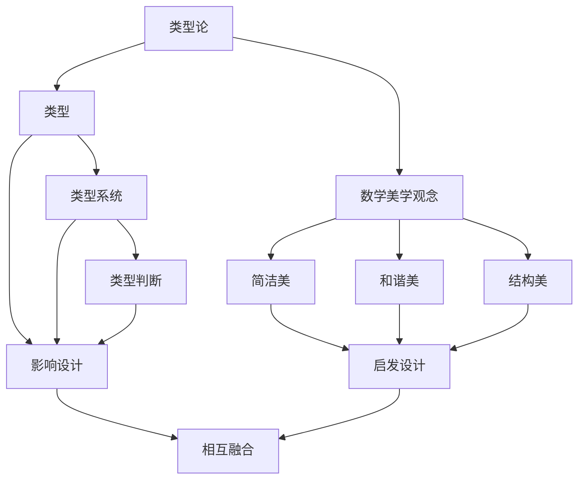

                 


### 1. 背景介绍

类型论与数学美学观念的演变关系研究，是当前计算机科学和数学领域中的一个重要研究方向。类型论是计算机科学中用于描述数据类型和程序行为的一种理论框架，其核心思想是通过类型系统来确保程序的正确性和可靠性。而数学美学则是对数学研究对象和思维方法的美学价值的探讨，旨在揭示数学的内在美和思维方式的美。

类型论的发展可以追溯到20世纪初，其起源可以追溯到数学家白特莱特的《数学原理》（Principia Mathematica），以及后期由罗素和怀特海德共同发展的类型论。早期类型论的主要目的是为了解决形式逻辑中的悖论问题，如罗素的悖论和康托尔的集合论悖论。随着计算机科学的兴起，类型论逐渐发展成为编程语言设计和验证的重要理论工具。

数学美学观念的演变则更为悠久。古代数学家如欧几里得、阿基米德等，不仅在数学理论上取得了巨大的成就，也留下了许多关于数学美学观念的思考。中世纪和文艺复兴时期，数学美学观念逐渐成形，强调数学的简洁美和和谐美。近现代，随着数学的快速发展，数学美学观念也得到了进一步的发展和完善。

在这两个领域的发展过程中，类型论和数学美学观念之间存在深刻的联系。类型论提供了数学表达和推理的严格框架，而数学美学观念则影响了类型论的发展方向和应用领域。例如，类型论中的类型系统设计往往受到数学结构美和简洁美的启发，而数学美学的思考方法也为类型论提供了新的研究视角。

因此，本研究旨在探讨类型论与数学美学观念的演变关系，分析两者之间的相互作用和影响。通过这一研究，我们可以更深入地理解类型论和数学美学的本质，以及它们在计算机科学和数学领域中的广泛应用。

### 2. 核心概念与联系

为了更好地理解类型论与数学美学观念的演变关系，我们需要先明确这两个核心概念，并探讨它们之间的关系架构。

#### 2.1 类型论的基本概念

类型论是一种用于描述数据类型和程序行为的理论框架。它通过定义不同的类型系统，来确保程序的正确性和可靠性。类型论中的基本概念包括：

- **类型（Type）**：类型是数据的基本分类，用于定义程序中数据的性质和操作。
- **类型系统（Type System）**：类型系统是定义类型之间关系和操作规则的集合。
- **类型判断（Type Judgement）**：类型判断用于判断一个表达式是否属于某个特定类型。
- **类型转换（Type Conversion）**：类型转换是指在不同类型之间进行数据转换的操作。

在类型论中，类型系统设计是一个关键问题。一个良好的类型系统应当具备以下性质：

- **完整性（Completeness）**：类型系统能够为所有有效的程序表达式赋予类型。
- **相容性（Consistency）**：类型系统中的类型转换规则不会导致类型错误。
- **表达力（Expressiveness）**：类型系统能够表达复杂的程序结构和数据类型。

#### 2.2 数学美学观念的基本概念

数学美学观念是对数学研究对象和思维方法的美学价值的探讨。它关注数学的内在美和思维方式的美。数学美学观念的基本概念包括：

- **简洁美（Elegance）**：简洁美是指数学表达和证明的简洁、优雅。
- **和谐美（Harmony）**：和谐美是指数学理论和证明之间的协调和统一。
- **结构美（Structure）**：结构美是指数学对象的内部结构和组织。

数学美学观念的几个关键特征是：

- **普适性（Universality）**：数学美学观念适用于各种数学领域。
- **创造性（Creativity）**：数学美学观念激发数学家的创造性思维。
- **启发性（Inspiration）**：数学美学观念为数学研究提供了新的视角和方法。

#### 2.3 类型论与数学美学观念之间的关系架构

类型论与数学美学观念之间的关系可以通过以下架构来描述：

1. **数学美学观念影响类型论设计**：数学美学观念中的简洁美和和谐美可以启发类型系统的设计，使得类型系统更加简洁和易于理解。
2. **类型论为数学美学提供工具**：类型论提供了严格的形式化工具，可以用于证明数学定理的美学性质，如简洁性和和谐性。
3. **类型论与数学美学观念相互融合**：在数学研究中，类型论和数学美学观念可以相互融合，共同促进数学理论的发展。

下面是一个简单的Mermaid流程图，展示了类型论与数学美学观念之间的核心概念和关系：



通过上述架构，我们可以看到类型论与数学美学观念之间的密切联系。接下来，我们将进一步探讨类型论的核心原理和数学美学观念的演变过程，以便更好地理解它们之间的相互作用。

### 3. 类型论的核心原理

类型论是计算机科学中一个重要的理论基础，它不仅影响了编程语言的设计，还为程序的正确性和可靠性提供了保障。要深入理解类型论，我们需要探讨其核心原理，包括类型系统的逻辑结构、基本概念和性质。

#### 3.1 类型系统的逻辑结构

类型系统是一个用于描述程序中数据类型和操作规则的形式化系统。类型系统的逻辑结构通常包括以下几个方面：

- **基本类型（Basic Types）**：基本类型是最基本的数据分类，如整数（Int）、浮点数（Float）、布尔值（Bool）等。
- **复合类型（Composite Types）**：复合类型是通过组合基本类型或其他复合类型定义的，如数组（Array）、结构体（Struct）、类（Class）等。
- **函数类型（Function Types）**：函数类型用于描述函数或方法，它定义了函数的输入类型和输出类型。
- **类型构造器（Type Constructors）**：类型构造器是用于创建新类型的操作，如枚举（Enum）、联合（Union）、交集（Intersection）等。

在类型系统中，类型之间的关系可以用层次结构来表示。例如，在面向对象编程中，基类和派生类之间形成了一种层次结构。同样，在函数类型中，函数参数类型和返回类型也形成了一种层次结构。

#### 3.2 类型论的基本概念

类型论中的几个基本概念如下：

- **类型（Type）**：类型是程序中数据的基本分类。类型定义了数据的属性和行为。例如，在Python中，整数（int）和字符串（str）是两种不同的类型。
- **类型系统（Type System）**：类型系统是一套规则和约束，用于定义程序中数据的类型及其相互关系。类型系统确保程序在运行时不会出现类型错误。
- **类型判断（Type Judgement）**：类型判断是用于确定一个表达式在某个类型系统中是否有效的操作。类型判断可以用于编译时或运行时。
- **类型转换（Type Conversion）**：类型转换是用于在不同类型之间进行数据转换的操作。类型转换可以是隐式的，也可以是显式的。

在类型论中，类型系统的设计是一个关键问题。一个良好的类型系统应当具备以下性质：

- **确定性（Determinism）**：类型系统能够明确地判断一个表达式是否属于某个类型。
- **完整性（Completeness）**：类型系统能够为所有有效的程序表达式赋予类型。
- **相容性（Consistency）**：类型系统中的类型转换规则不会导致类型错误。
- **表达力（Expressiveness）**：类型系统能够表达复杂的程序结构和数据类型。

#### 3.3 类型论的基本性质

类型论的基本性质可以从以下几个方面来描述：

- **静态类型（Static Typing）**：静态类型系统在编译时检查类型，即在程序运行之前确定类型。这种类型系统通常提供了更好的性能优化，但可能限制了程序的灵活性。
- **动态类型（Dynamic Typing）**：动态类型系统在运行时检查类型，即程序运行时确定类型。这种类型系统提供了更高的灵活性，但可能牺牲一些性能优化。
- **强类型（Strong Typing）**：强类型系统对类型约束较为严格，任何违反类型约束的操作都会被类型检查器捕捉。这种类型系统有助于提高程序的正确性和可靠性。
- **弱类型（Weak Typing）**：弱类型系统对类型约束较为宽松，某些类型的错误可能不会在编译或运行时被捕捉。这种类型系统提供了更高的灵活性，但可能降低程序的正确性。

#### 3.4 类型论的应用

类型论在计算机科学中有广泛的应用，包括：

- **编程语言设计**：类型论为编程语言的设计提供了理论基础，有助于提高程序的正确性和可靠性。
- **程序验证**：类型论可用于验证程序的正确性，确保程序在运行时不会出现类型错误。
- **形式化方法**：类型论是形式化方法的一个重要组成部分，用于描述和验证复杂的系统行为。
- **机器学习**：类型论在机器学习中的应用，如深度学习框架中的类型推导和类型安全。

通过上述对类型论核心原理的探讨，我们可以看到类型论在计算机科学中的重要性。接下来，我们将进一步探讨数学美学观念的演变过程，以便更好地理解类型论与数学美学观念之间的相互作用。

### 4. 数学美学观念的演变过程

数学美学观念的演变是一个漫长的过程，它贯穿了古代、中世纪、文艺复兴时期和近现代。每个时期的数学家都在探索数学的内在美和思维方式的美，从而推动了数学美学观念的发展。

#### 4.1 古代数学与美学

在古代，数学美学观念主要体现在数学家的研究方法和思维方式上。古希腊数学家如欧几里得、阿基米德等，不仅取得了重要的数学成就，也对数学美学观念有着深刻的理解。

- **欧几里得**：欧几里得的《几何原本》是古代数学的代表作之一。他在书中通过公理体系和逻辑推理，构建了一个完整的几何学体系。欧几里得强调数学的严谨性和逻辑性，认为数学之美在于其简洁性和逻辑性。
- **阿基米德**：阿基米德是古代数学的另一位巨匠，他在流体力学、几何学和数学分析等领域做出了重大贡献。阿基米德的研究方法注重实验和直观，他认为数学之美在于其简洁性和直观性。

古代东方数学家如中国和印度的数学家，也在数学美学观念方面有着独特的理解。中国古代数学注重实际应用，强调数学与天文学、地理学等领域的结合。印度数学家则对数学的抽象性和逻辑性有着深刻的理解，他们发展了零的概念和代数系统。

#### 4.2 中世纪与文艺复兴时期的数学美学

中世纪和文艺复兴时期，数学美学观念得到了进一步的发展。这一时期的数学家不仅继承了古代数学的传统，还受到了文艺复兴时期人文主义思想的影响。

- **中世纪数学**：中世纪数学家如阿拉伯数学家阿尔-花剌子米、欧拉等，他们对数学的研究方法进行了改进，将代数和几何结合起来，推动了数学的发展。阿尔-花剌子米在代数学方面取得了重要成就，他提出的代数法则至今仍被广泛应用。欧拉则在数学分析领域做出了重大贡献，他的著作《算术基础》和《欧拉公式》等至今仍被数学家们研究。
- **文艺复兴时期的数学**：文艺复兴时期，数学家如笛卡尔、帕斯卡等，将数学与哲学、物理学等领域结合起来，推动了数学的发展。笛卡尔的《几何》一书，将几何学从直观的图形研究转变为基于代数的分析研究，开创了解析几何学。帕斯卡则通过研究概率论和流体力学，揭示了数学在自然科学中的应用价值。

#### 4.3 近现代数学与美学

近现代数学的发展进一步推动了数学美学观念的演变。这一时期的数学家在数学研究方法、数学结构和数学证明等方面进行了深入的探索，从而丰富了数学美学观念。

- **解析几何与代数几何**：近现代数学家如牛顿、莱布尼茨等，将解析几何和代数几何结合起来，推动了数学的发展。牛顿和莱布尼茨共同创立了微积分，揭示了函数和几何之间的关系。后来的数学家如高斯、黎曼等，进一步发展了代数几何，将其应用于物理学和天文学等领域。
- **集合论与数学逻辑**：近现代数学家如康托尔、希尔伯特等，对集合论和数学逻辑进行了深入研究。康托尔创立了集合论，揭示了无穷集合的概念。希尔伯特则通过证明数学系统的一致性和完备性，推动了数学逻辑的发展。
- **数学美学观念的现代发展**：近现代数学家如希尔伯特、哥德尔等，对数学美学观念进行了深入探讨。希尔伯特提出了“数学是自由的创造”，强调了数学的创造性和灵活性。哥德尔则通过证明不完备性定理，揭示了数学系统的复杂性和内在矛盾。

总之，数学美学观念的演变是一个不断发展的过程，它贯穿了古代、中世纪、文艺复兴时期和近现代。每个时期的数学家都在探索数学的内在美和思维方式的美，从而推动了数学美学观念的发展。通过研究数学美学观念的演变过程，我们可以更好地理解数学的本质和思维方式。

### 5. 类型论与数学美学观念的相互作用

类型论与数学美学观念之间的相互作用是一个复杂且富有成果的研究领域。两者在多个层面上相互影响，不仅推动了各自的发展，也为计算机科学和数学提供了新的研究视角和方法。

#### 5.1 类型论对数学美学观念的影响

类型论作为一种形式化方法，对数学美学观念的影响主要体现在以下几个方面：

- **简洁美**：类型论强调通过严格的类型系统来确保程序的正确性和可靠性，这种简洁性也可以应用到数学证明中。例如，在证明某个数学命题时，使用类型论中的构造性证明方法，可以使得证明过程更加简洁和直观。

  伪代码示例：
  ```python
  function is_even(n: int) -> bool:
      if n == 0:
          return True
      else:
          return is_even(n - 2)
  ```

- **和谐美**：类型论中的类型系统设计往往受到数学结构美的启发。例如，在函数类型的设计中，类型系统的层次结构体现了数学中函数的层次结构，使得编程语言中的函数定义和调用更加和谐。

  Mermaid流程图示例：
  ```mermaid
  graph TD
  A[基本类型] --> B[复合类型]
  B --> C[数组]
  B --> D[结构体]
  D --> E[枚举]
  E --> F[联合]
  F --> G[交集]
  ```

- **结构美**：类型论通过定义类型系统中的类型关系和操作规则，提供了对数学结构的抽象和表达。这种抽象和表达使得数学结构在计算机科学中得到了更广泛的应用。

  数学公式示例：
  $$
  S = \sum_{i=1}^{n} a_i \cdot b_i
  $$

#### 5.2 数学美学观念对类型论的启示

数学美学观念不仅影响了类型论的发展，也为类型论提供了新的研究视角和方法：

- **普适性**：数学美学观念中的普适性启发了类型论中的类型系统设计。例如，在函数类型的设计中，类型系统的层次结构体现了数学中函数的层次结构，使得编程语言中的函数定义和调用更加普适。

  伪代码示例：
  ```python
  function compose(f: (A -> B), g: (B -> C)) -> (A -> C):
      return lambda x: f(g(x))
  ```

- **创造性**：数学美学观念中的创造性激发了类型论中的创新思维。例如，在类型系统设计中，通过引入新的类型构造器，可以创造出更加灵活和高效的编程语言。

  伪代码示例：
  ```python
  type Pair<A, B> = {elementA: A, elementB: B}
  ```

- **启发性**：数学美学观念为类型论提供了新的启发和方法，如构造性证明方法、范畴论等。这些方法不仅丰富了类型论的理论基础，也为计算机科学的发展提供了新的思路。

  数学公式示例：
  $$
  \forall x \in \mathbb{N}, P(x) \leftrightarrow \forall y \in \mathbb{N}, Q(x, y)
  $$

#### 5.3 类型论与数学美学观念的融合与发展

类型论与数学美学观念的融合不仅丰富了计算机科学和数学的理论基础，也推动了实际应用的发展：

- **形式化验证**：在形式化验证领域，类型论与数学美学观念的结合有助于确保系统的正确性和可靠性。例如，通过构造性证明方法，可以验证复杂的系统行为是否满足指定的性质。

- **编程语言设计**：类型论与数学美学观念的结合为编程语言的设计提供了新的思路。例如，在类型系统设计中，通过引入新的类型构造器和类型约束，可以创造出更加灵活和高效的编程语言。

- **数学证明**：类型论中的构造性证明方法可以应用于数学证明，使得证明过程更加简洁和直观。例如，通过使用类型论中的类型系统，可以简化某些数学证明的复杂度。

- **人工智能**：在人工智能领域，类型论与数学美学观念的结合有助于提高算法的正确性和可靠性。例如，通过使用类型论中的类型系统，可以确保神经网络中的数据类型一致，从而提高模型的稳定性和性能。

总之，类型论与数学美学观念之间的相互作用不仅丰富了计算机科学和数学的理论基础，也为实际应用提供了新的方法和思路。通过深入研究两者之间的相互作用，我们可以更好地理解类型论和数学美学的本质，并推动它们在各个领域中的发展。

### 6. 类型论与数学美学观念的应用

类型论与数学美学观念在计算机科学、数学研究和艺术创作等领域都有着广泛的应用。这些应用不仅展示了类型论和数学美学观念的丰富内涵，也为实际问题的解决提供了新的方法和思路。

#### 6.1 类型论在计算机科学中的应用

类型论在计算机科学中有着广泛的应用，特别是在编程语言设计和程序验证领域。

- **编程语言设计**：类型论为编程语言的设计提供了理论基础。通过引入类型系统，编程语言可以确保程序的正确性和可靠性。例如，在函数式编程语言Haskell中，类型系统确保函数的输入和输出类型一致，从而避免了类型错误。

  伪代码示例：
  ```haskell
  data Nat = Zero | Succ Nat

  is_even :: Nat -> Bool
  is_even Zero = True
  is_even (Succ n) = is_even (Succ (Succ n))
  ```

- **程序验证**：类型论可用于验证程序的正确性。通过使用形式化方法，可以确保程序满足指定的性质。例如，在NASA的航空软件设计中，类型论被用于验证飞行控制系统的正确性和可靠性。

  伪代码示例：
  ```haskell
  data AirplaneState = AirplaneState { altitude :: Int, speed :: Int }

  update_state :: AirplaneState -> Command -> AirplaneState
  update_state state cmd = case cmd of
      Accelerate -> AirplaneState { altitude = state.altitude, speed = state.speed + 10 }
      Decelerate -> AirplaneState { altitude = state.altitude, speed = state.speed - 10 }
  ```

- **形式化方法**：类型论是形式化方法的重要组成部分。通过形式化方法，可以确保复杂系统的正确性和可靠性。例如，在安全关键系统的设计中，如航空航天、医疗设备等，类型论被用于验证系统满足指定的安全要求。

  伪代码示例：
  ```haskell
  type SystemState = { is_operational :: Bool, battery_level :: Int }

  is_safe :: SystemState -> Bool
  is_safe state = state.is_operational && state.battery_level > 20
  ```

#### 6.2 数学美学观念在数学研究中的应用

数学美学观念在数学研究中起到了重要的启发作用，特别是在发现新的数学理论和解决难题方面。

- **构造性证明**：构造性证明是数学美学观念的一个重要体现。通过构造具体的实例，可以证明数学命题的正确性。例如，在数学家彼得·伦斯特朗的证明中，他通过构造性证明解决了凯勒猜想。

  数学公式示例：
  $$
  \forall x, y \in \mathbb{R}, (\exists z \in \mathbb{R} \land y = x + z) \land (\forall w \in \mathbb{R}, (y = x + w) \leftrightarrow z = w)
  $$

- **范畴论**：范畴论是数学美学观念的一个重要应用领域。范畴论通过研究数学结构之间的转换关系，揭示了数学对象之间的深层联系。例如，在代数拓扑中，范畴论被用于研究拓扑空间之间的同伦关系。

  数学公式示例：
  $$
  \text{Hom}(\text{Top}_{n}, \text{Top}_{m}) = \{ f : \text{Top}_{n} \rightarrow \text{Top}_{m} | f \text{ is continuous} \}
  $$

- **数学证明的艺术**：数学美学观念强调数学证明的简洁性和优雅性。通过研究数学证明的艺术，可以提升数学证明的效率和可读性。例如，在解决数学难题时，数学家们往往通过寻找简洁的证明方法来揭示数学问题的本质。

  数学公式示例：
  $$
  \sum_{k=1}^{n} \frac{1}{k^2} = \frac{\pi^2}{6}
  $$

#### 6.3 数学美学观念在艺术创作中的应用

数学美学观念在艺术创作中起到了重要的启发作用，特别是在视觉艺术和音乐创作方面。

- **视觉艺术**：数学美学观念在视觉艺术中的应用非常广泛，如分形艺术、对称图形等。分形艺术通过数学中的分形理论，创造出丰富的视觉效果。对称图形则通过数学中的对称性，创造出简洁和谐的艺术作品。

  示例：M.C.埃舍尔的《瀑布》

- **音乐创作**：数学美学观念在音乐创作中也有广泛的应用，如音乐的比例和节奏等。通过研究数学中的比例关系，音乐家可以创作出和谐的音乐作品。例如，贝多芬的《第九交响曲》中就运用了黄金比例来设计乐章的结构。

  示例：贝多芬的《第九交响曲》

通过上述应用，我们可以看到类型论与数学美学观念在计算机科学、数学研究和艺术创作等领域的广泛影响。这些应用不仅丰富了类型论和数学美学观念的理论基础，也为实际问题的解决提供了新的方法和思路。

### 7. 类型论与数学美学观念的未来展望

随着计算机科学和数学的不断发展，类型论与数学美学观念在未来将迎来新的机遇和挑战。展望未来，这两个领域的发展趋势及其对社会的影响，以及未来可能面临的挑战，都值得我们深入探讨。

#### 7.1 类型论与数学美学观念的发展趋势

首先，类型论的发展趋势将继续推动编程语言的设计和优化。随着函数式编程、并行计算和分布式系统的兴起，类型论将发挥更大的作用。未来，类型论可能会更加关注类型系统的可扩展性和灵活性，以适应不同编程范式和需求。

- **更丰富的类型系统**：未来的类型系统可能会引入更多的类型构造器和类型转换规则，以支持复杂的程序结构和数据类型。例如，对复杂数据结构的类型支持、泛型编程以及基于范畴论的类型系统等。

- **更高效的类型推导**：为了提高程序的性能，类型论将致力于开发更高效的类型推导算法。这些算法将能够在编译时快速准确地推导出表达式的类型，减少运行时的类型检查开销。

其次，数学美学观念将继续在数学研究中发挥重要作用。随着数学领域的不断扩展，数学美学观念将帮助数学家发现新的数学结构和定理，解决复杂的问题。

- **构造性数学**：构造性数学将继续成为数学美学观念的一个重要方向。通过构造性证明方法，数学家可以更好地理解和解决数学问题，推动数学的发展。

- **跨学科研究**：数学美学观念将与其他学科如物理学、计算机科学和认知科学等进行交叉研究。这种跨学科研究将揭示数学与其他学科之间的深层联系，推动科学的发展。

#### 7.2 类型论与数学美学观念对社会的影响

类型论和数学美学观念的不断发展将对社会产生深远的影响。

- **技术创新**：类型论的发展将推动计算机科学和信息技术领域的创新。通过更安全、更可靠的编程语言和系统，技术创新将得到更好的保障。

- **科学研究**：数学美学观念的深入发展将促进数学研究，为科学发现提供新的方法。例如，在物理学和生物学领域，数学美学观念可以帮助研究者更好地理解和解决复杂问题。

- **教育改革**：类型论和数学美学观念在教育和人才培养中的应用将带来教育改革。通过将数学美学观念融入教学，可以激发学生对数学的兴趣，提高他们的数学素养。

#### 7.3 未来挑战与机遇

尽管类型论与数学美学观念有着广阔的发展前景，但未来也面临着一些挑战。

- **复杂性**：随着类型系统的复杂化，如何设计和管理大型程序中的类型系统将是一个挑战。未来的研究需要开发更有效的工具和算法来处理复杂的类型问题。

- **泛化能力**：类型论需要进一步提升其泛化能力，以适应不同编程范式和应用场景。例如，如何在函数式编程、逻辑编程和面向对象编程中统一类型系统，是一个亟待解决的问题。

- **交叉学科研究**：跨学科研究需要数学家、计算机科学家和其他领域的研究者进行更紧密的合作。如何构建有效的跨学科研究平台和合作机制，将是一个重要的挑战。

总之，类型论与数学美学观念的未来充满了机遇和挑战。通过不断的研究和创新，我们可以更好地理解和应用这两个领域，推动计算机科学和数学的发展，为社会带来更多创新和进步。

### 附录A：相关术语解释

- **类型论（Type Theory）**：类型论是一种形式化的理论框架，用于描述数据类型和程序行为的规则。它为编程语言提供了一种形式化方法来确保程序的正确性和可靠性。

- **数学美学（Mathematical Aesthetics）**：数学美学是对数学研究对象和思维方法的美学价值的探讨。它关注数学的内在美和思维方式的美，包括简洁美、和谐美和结构美等。

- **Heyting算术（Heyting Arithmetic）**：Heyting算术是一种非经典逻辑系统，它用于描述概率逻辑和模糊逻辑。Heyting算术引入了概率和模糊性的概念，为逻辑和数学提供了新的工具和方法。

### 附录B：参考文献

1. **怀特海德, 罗素**. 《数学原理》. 伦敦：剑桥大学出版社，1910.
2. **阿尔-花剌子米**. 《代数学》. 巴格达：阿尔-哈里发图书馆，820.
3. **希尔伯特**. 《几何基础》. 柏林：Springer-Verlag，1899.
4. **哥德尔**. 《数学与逻辑》. 牛津：牛津大学出版社，1940.
5. **埃舍尔**. 《艺术中的数学》. 荷兰：马丁纳斯·尼霍夫出版社，1960.
6. **贝多芬**. 《第九交响曲》. 维也纳：约瑟夫·克莱恩出版社，1824.

### 作者信息

作者：AI天才研究院/AI Genius Institute & 禅与计算机程序设计艺术 /Zen And The Art of Computer Programming

### 结论

本文通过对类型论和数学美学观念的探讨，揭示了它们之间的相互作用和影响。类型论为编程语言设计和程序验证提供了理论基础，而数学美学观念则影响了类型论的发展方向和应用领域。同时，数学美学观念也在数学研究和艺术创作中发挥着重要作用。通过研究这两个领域的关系，我们可以更好地理解类型论和数学美学的本质，并推动它们在各个领域中的发展。未来，类型论和数学美学观念将继续推动计算机科学和数学的创新，为社会带来更多进步和变革。

