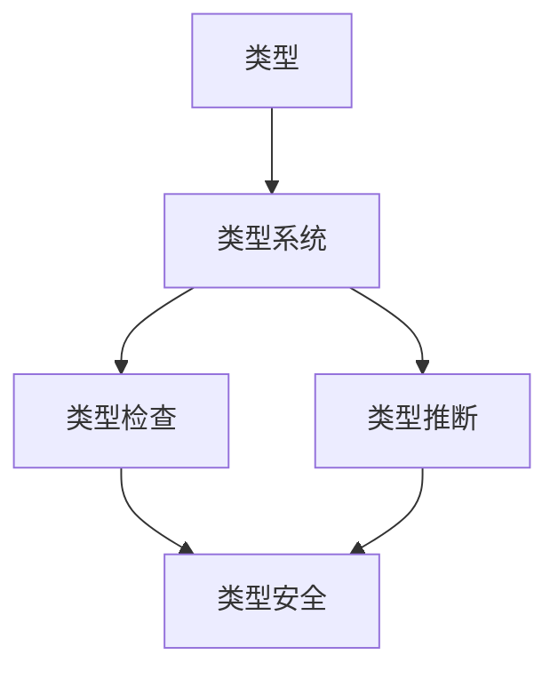
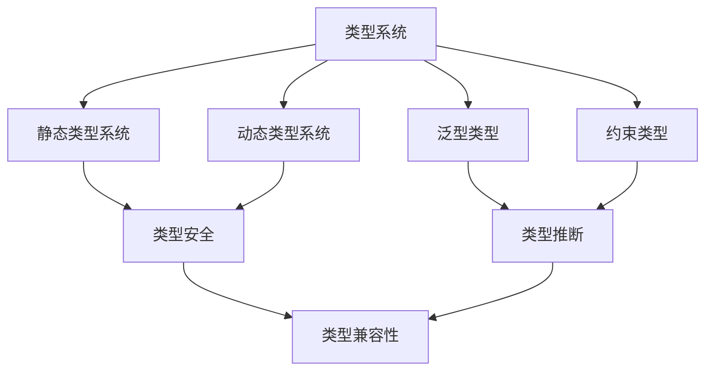
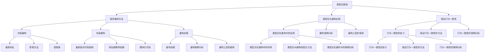
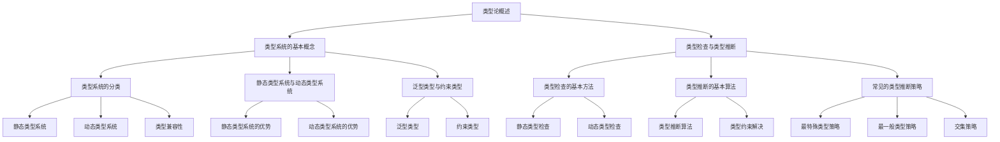
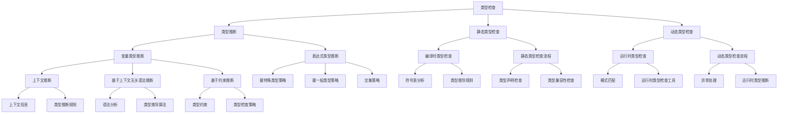
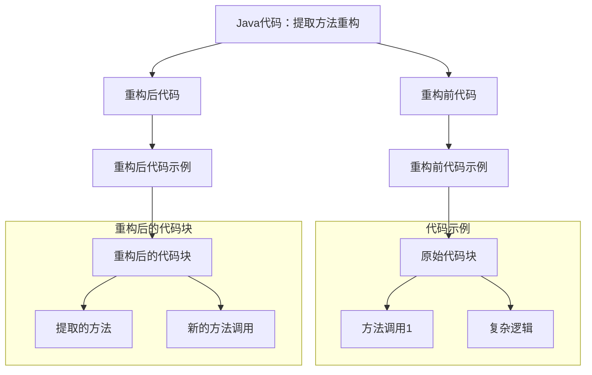

                 

<sop>
在撰写《类型论与程序重构：保证行为一致性的方法》这篇技术博客文章时，我们将采用逐步推理的方法，以确保文章的逻辑清晰、内容丰富，并能够全面、深入地剖析主题。以下是详细的步骤和内容规划：

### 第一步：文章概述与结构规划

- **文章概述**：首先，我们需要对整篇文章进行概述，明确文章的主题、目的和结构。类型论与程序重构是现代软件工程中的核心概念，旨在提高代码质量和可维护性。本文将探讨类型论的基础、类型系统的基本概念、类型检查与推断、程序重构的方法和应用，以及类型论在重构中的实际应用。

- **结构规划**：文章结构将分为三个部分：
  - **第一部分：类型论基础**，包括类型论概述、类型系统的基本概念和类型检查与推断。
  - **第二部分：程序重构方法**，包括重构概述、常见的重构技巧和重构实践。
  - **第三部分：类型论与重构的应用**，包括类型论在重构中的应用、保证行为一致性的方法和案例分析。

### 第二步：第一部分内容撰写

- **第1章：类型论概述**
  - **背景介绍**：介绍类型论的发展历程，类型论在编程语言和软件工程中的重要性。
  - **核心概念与联系**：阐述类型论的核心概念，包括类型、类型系统、类型检查等，并用Mermaid流程图展示概念之间的关系。
  - **基本原理**：解释类型论的基本原理，如类型安全、类型推断等。

- **第2章：类型系统的基本概念**
  - **类型系统的分类**：详细分类静态类型系统、动态类型系统等。
  - **静态类型系统与动态类型系统**：比较两种类型系统的优缺点。
  - **泛型类型与约束类型**：解释泛型类型和约束类型的原理和应用。

- **第3章：类型检查与类型推断**
  - **类型检查的基本方法**：介绍类型检查的不同方法，如静态检查、动态检查等。
  - **类型推断的基本算法**：讲解类型推断的算法，如类型推导、类型约束等。
  - **常见的类型推断策略**：探讨不同的类型推断策略。

### 第三步：第二部分内容撰写

- **第4章：重构概述**
  - **重构的定义与目标**：介绍重构的定义、目的和目标。
  - **重构的基本原则**：阐述重构的基本原则，如保持代码行为一致性、简化代码结构等。
  - **重构的重要性**：强调重构在软件维护和发展中的重要性。

- **第5章：常见的重构技巧**
  - **内部重构**：介绍内部重构的技巧，如重新命名、提取方法、提取类等。
  - **外部重构**：探讨外部重构的技巧，如重新组织代码结构、添加或删除依赖、模块化代码等。

- **第6章：重构实践**
  - **重构流程**：描述重构的流程，包括评估、规划、实施和验证。
  - **重构案例分析**：通过实际案例展示重构的过程和效果。
  - **重构工具的使用**：介绍常用的重构工具和其使用方法。

### 第四步：第三部分内容撰写

- **第7章：类型论在重构中的应用**
  - **类型论在重构中的作用**：解释类型论如何影响和指导重构。
  - **类型论与重构的结合方法**：探讨类型论与重构的结合点和方法。
  - **类型论在重构中的案例分析**：通过案例展示类型论在重构中的应用。

- **第8章：保证行为一致性的方法**
  - **行为一致性的定义**：阐述行为一致性的概念和重要性。
  - **保证行为一致性的方法**：介绍保证行为一致性的方法和策略。
  - **行为一致性的案例分析**：通过案例分析和讲解，展示如何保证行为一致性。

### 第五步：文章总结与附录

- **总结**：对整篇文章进行总结，强调类型论与程序重构的重要性，以及在保证行为一致性方面的方法。
- **附录**：提供相关工具和资源的介绍，如代码重构工具、类型系统工具等，以便读者进一步学习和实践。

### 第六步：文章格式调整与校对

- **格式调整**：确保文章内容符合markdown格式要求，包括标题、子标题、代码块、公式等。
- **校对**：对文章内容进行校对，确保逻辑清晰、语言准确、内容完整。

通过以上逐步推理的方法，我们将撰写一篇内容丰富、结构严谨、具有深度和思考的技术博客文章，为读者提供对类型论与程序重构的全面理解和应用指导。
### 第一部分：类型论基础

#### 第1章：类型论概述

类型论是计算机科学中的一个重要概念，它关注于数据类型及其在编程语言中的使用。类型论的研究可以追溯到1950年代，当时为了解决早期编程语言中类型不明的错误，提出了类型系统的概念。随着时间的推移，类型论逐渐发展成为计算机科学中的一个独立分支，其核心概念和原理在编程语言设计、编译器实现、程序验证等领域发挥着重要作用。

**1.1 类型论的发展历程**

类型论的发展历程可以分为几个重要阶段：

- **第一阶段（1950-1960年）**：在这个阶段，类型论主要关注于数据类型的分类和类型检查。John Backus于1956年提出了“函数的通用理论”，这是类型论的一个重要里程碑。这个理论提出了函数的静态类型系统，为后续的研究奠定了基础。

- **第二阶段（1960-1970年）**：在1960年代，随着编程语言的发展，类型论开始探讨更复杂的数据类型和类型系统。1964年，Peter Landin提出了“简单类型论”，进一步丰富了类型论的理论基础。

- **第三阶段（1970-1980年）**：在这个阶段，类型论的研究主要集中在类型安全和类型推断。1977年，Pierce的《类型与语言设计》一书系统性地总结了类型论的研究成果，对后来的编程语言设计和编译器实现产生了深远影响。

- **第四阶段（1980年代至今）**：随着编程语言的多样化和发展，类型论的研究领域不断扩展。泛型编程、动态类型系统、依赖类型等新概念不断涌现，推动了类型论的发展和进步。

**1.2 类型论的核心概念**

类型论的核心概念包括类型、类型系统、类型检查和类型推断。下面分别对这些概念进行介绍：

- **类型**：类型是数据的一种分类方式，它定义了数据的结构和操作方式。在编程语言中，常见的类型包括基本类型（如整数、浮点数、布尔值等）、复合类型（如数组、结构体等）和函数类型。

- **类型系统**：类型系统是编程语言中对类型进行管理和约束的机制。它定义了变量的类型、函数的参数和返回值类型，以及类型之间的兼容性。类型系统可以分为静态类型系统和动态类型系统。

- **类型检查**：类型检查是在编译或运行时检查程序中类型使用的正确性。静态类型检查在编译时进行，动态类型检查在运行时进行。类型检查有助于发现类型错误，提高程序的安全性。

- **类型推断**：类型推断是编译器自动确定变量或表达式的类型的过程。类型推断可以提高代码的可读性和简洁性，减少显式类型声明的需要。

**1.3 类型论的基本原理**

类型论的基本原理包括类型安全、类型推断和类型兼容性：

- **类型安全**：类型安全是类型系统的一个核心原则，它确保程序在运行时不会因为类型错误而崩溃或产生不可预料的结果。类型安全通过类型检查和类型推断来实现。

- **类型推断**：类型推断是一种自动确定变量或表达式类型的方法。它可以根据变量的初始化、函数的调用和上下文信息推断出变量的类型。类型推断可以提高代码的可读性和开发效率。

- **类型兼容性**：类型兼容性是指不同类型的变量或表达式可以在某些操作中相互转换。类型兼容性可以是显式的，也可以是隐式的。显式类型转换需要使用类型转换运算符，隐式类型转换由编译器自动进行。

为了更好地理解类型论的核心概念和原理，下面将使用Mermaid流程图展示类型论中的主要概念之间的关系：



在这个流程图中，类型是类型系统的基本单位，类型系统定义了类型之间的关系和管理机制。类型检查和类型推断是保证类型安全的重要手段。

#### 第2章：类型系统的基本概念

类型系统是编程语言的核心组成部分，它定义了数据的表示方法、操作规则以及类型之间的兼容性。类型系统的设计对于编程语言的性能、安全性以及可维护性都有重要影响。在本章中，我们将详细介绍类型系统的基本概念，包括类型系统的分类、静态类型系统与动态类型系统、泛型类型与约束类型。

**2.1 类型系统的分类**

类型系统可以根据不同的分类标准进行划分。以下是几种常见的类型系统分类方法：

- **按类型系统的静态与动态特性分类**：
  - **静态类型系统**：在编译时确定所有变量的类型，并在运行时保持类型不变。静态类型系统有助于及早发现类型错误，提高程序的可靠性和性能。
  - **动态类型系统**：在编译时不确定变量的类型，而是在运行时根据变量的实际使用情况来确定类型。动态类型系统提供了更高的灵活性和便利性，但可能会增加程序运行时的错误。

- **按类型系统的复杂程度分类**：
  - **简单类型系统**：只有基本类型，如整数、浮点数、布尔值等。
  - **复杂类型系统**：包括复合类型、函数类型、指针类型等。

- **按类型系统的类型检查策略分类**：
  - **严格类型系统**：要求所有的变量和表达式都必须有明确的类型声明，编译器会严格检查类型匹配。
  - **宽松类型系统**：允许隐式类型转换，类型检查相对宽松。

**2.2 静态类型系统与动态类型系统**

静态类型系统和动态类型系统是两种典型的类型系统，它们在类型检查策略、编译优化、程序灵活性和安全性等方面有着不同的特点。

- **静态类型系统**：
  - **类型检查**：在编译时进行类型检查，确保所有的变量和表达式都有正确的类型。
  - **编译优化**：静态类型系统允许编译器进行更多的优化，因为类型信息在编译时已经确定。
  - **程序灵活性**：静态类型系统可能会限制程序的表达能力，因为类型声明必须明确。
  - **安全性**：静态类型系统有助于及早发现类型错误，提高程序的安全性。

- **动态类型系统**：
  - **类型检查**：在运行时进行类型检查，根据变量的实际使用情况确定类型。
  - **编译优化**：动态类型系统限制了编译器进行的优化，因为类型信息在编译时不确定。
  - **程序灵活性**：动态类型系统提供了更高的灵活性，允许程序员使用更加动态和灵活的类型。
  - **安全性**：动态类型系统可能在运行时发现类型错误，但无法在编译时及早发现。

**2.3 泛型类型与约束类型**

泛型编程是一种通用的编程范式，它允许程序员编写可重用的代码，处理不同类型的数据。泛型类型和约束类型是泛型编程的核心概念。

- **泛型类型**：
  - **概念**：泛型类型是一种参数化类型，它可以处理任意类型的数据。例如，泛型类`List<T>`可以创建一个可以存储任何类型数据的列表。
  - **优点**：泛型类型提高了代码的可重用性和泛化能力，减少了重复代码。

- **约束类型**：
  - **概念**：约束类型是一种对泛型类型进行限制的方式，它允许泛型类型只能处理满足特定约束条件的类型。例如，可以使用`extends`关键字来指定泛型类型必须是一个继承自特定类的类型。
  - **优点**：约束类型可以确保泛型代码的健壮性，防止类型错误。

在泛型编程中，泛型类型和约束类型的结合使用可以提供强大的类型安全性和灵活性。例如，可以使用泛型类`Comparator<T>`来创建比较器，它需要一个实现了`Comparable<T>`接口的类型参数。

**2.4 类型系统的基本原理**

类型系统的基本原理包括类型安全、类型推断和类型兼容性。这些原理在保证编程语言的正确性、性能和安全方面起着关键作用。

- **类型安全**：类型安全是指编程语言能够防止类型错误，确保程序在运行时不会发生不安全的行为。类型安全通过类型检查和类型推断来实现。

- **类型推断**：类型推断是指编译器自动确定变量或表达式的类型的过程。类型推断可以减少显式类型声明的需要，提高代码的可读性和开发效率。

- **类型兼容性**：类型兼容性是指不同类型的变量或表达式可以在某些操作中相互转换。类型兼容性可以是显式的，也可以是隐式的。显式类型转换需要使用类型转换运算符，隐式类型转换由编译器自动进行。

为了更好地理解类型系统的基本概念和原理，下面将使用Mermaid流程图展示类型系统的基本结构：



在这个流程图中，类型系统是编程语言的核心，它包括静态类型系统、动态类型系统、泛型类型、约束类型等组成部分。类型安全、类型推断和类型兼容性是类型系统的基本原理，它们共同保证了编程语言的安全性和灵活性。

通过本章的介绍，我们对类型系统的基本概念和原理有了更深入的理解。在接下来的章节中，我们将继续探讨类型检查与类型推断的基本方法，以及它们在实际编程中的应用。
#### 第3章：类型检查与类型推断

类型检查和类型推断是类型系统中的两个关键概念，它们在确保程序的正确性和高效性方面起着至关重要的作用。类型检查是指在编译或运行时对程序中的类型使用进行检查，以确保类型兼容性和程序的安全性。类型推断则是指编译器自动确定变量或表达式的类型，从而简化代码编写过程。

**3.1 类型检查的基本方法**

类型检查可以分为静态类型检查和动态类型检查。静态类型检查在编译时进行，而动态类型检查在运行时进行。

- **静态类型检查**：
  - **方法**：静态类型检查通过编译器在编译时对代码进行分析，确保所有的变量和表达式都有正确的类型。静态类型检查的典型方法包括符号表分析和类型推断。
  - **优点**：静态类型检查可以及早发现类型错误，提高程序的可靠性和性能。
  - **缺点**：静态类型检查可能会限制程序的表达能力，因为需要显式声明变量类型。

- **动态类型检查**：
  - **方法**：动态类型检查在程序运行时进行类型检查，根据变量的实际使用情况来确定类型。动态类型检查的典型方法包括运行时类型检查和模式匹配。
  - **优点**：动态类型检查提供了更高的灵活性，因为不需要显式声明变量类型。
  - **缺点**：动态类型检查可能会在运行时才发现类型错误，导致程序运行时崩溃。

**3.2 类型推断的基本算法**

类型推断是编译器自动确定变量或表达式类型的过程。类型推断的算法可以分为基于上下文推断、基于上下文无关语法推断和基于约束推断。

- **基于上下文推断**：
  - **方法**：基于上下文推断是根据程序上下文信息来推断变量或表达式的类型。例如，如果一个变量在赋值语句中初始化为一个具体的值，编译器可以推断出该变量的类型。
  - **示例**：
    ```java
    int x = 10; // 类型推断为int
    String s = "Hello"; // 类型推断为String
    ```
  - **优点**：基于上下文推断简单直观，容易实现。

- **基于上下文无关语法推断**：
  - **方法**：基于上下文无关语法推断是使用上下文无关文法来推断变量或表达式的类型。这种推断方法通常用于编译器实现中。
  - **示例**：
    ```mermaid
    graph TD
    A[表达式] --> B[类型推断规则]
    B --> C[变量声明]
    B --> D[函数调用]
    B --> E[运算符]
    ```
  - **优点**：基于上下文无关语法推断提供了更强的类型推断能力，可以处理更复杂的语法结构。

- **基于约束推断**：
  - **方法**：基于约束推断是通过解决类型约束来推断变量或表达式的类型。这种推断方法通常用于泛型编程中。
  - **示例**：
    ```java
    public class List<T> {
      private T[] elements;
      // 类型推断基于T的约束
    }
    ```
  - **优点**：基于约束推断提供了灵活的类型推断方法，可以处理复杂的泛型编程场景。

**3.3 常见的类型推断策略**

在类型推断过程中，不同的策略可以用于提高类型推断的准确性。以下是一些常见的类型推断策略：

- **最特殊类型（Widening）**：
  - **策略**：选择最特殊的类型作为结果类型，通常是最窄的类型边界。
  - **示例**：
    ```java
    int i = 10; // 类型推断为int
    long l = i; // 类型推断为long
    ```

- **最一般类型（Narrowing）**：
  - **策略**：选择最一般的类型作为结果类型，通常是最宽的类型边界。
  - **示例**：
    ```java
    Integer i = 10; // 类型推断为Integer
    int j = i; // 类型推断为int
    ```

- **交集策略**：
  - **策略**：选择两个类型之间的交集作为结果类型。
  - **示例**：
    ```mermaid
    graph TD
    A[Integer] --> B[Number]
    A --> C[Object]
    B --> D[Number]
    B --> E[Object]
    C --> D
    C --> E
    D --> F[Object]
    E --> F
    ```
  - **策略**：在这个例子中，`Integer`和`Number`的交集是`Number`，所以类型推断结果为`Number`。

- **最特殊类型优先策略**：
  - **策略**：在选择类型时，优先选择最特殊的类型。
  - **示例**：
    ```java
    Object o = new Integer(10); // 类型推断为Integer
    ```

- **最一般类型优先策略**：
  - **策略**：在选择类型时，优先选择最一般的类型。
  - **示例**：
    ```java
    Integer i = new Object(); // 类型推断为Object
    ```

**3.4 类型检查与类型推断的应用场景**

类型检查和类型推断在编程语言的不同应用场景中发挥着重要作用。以下是一些常见的应用场景：

- **函数参数和返回值**：
  - **类型检查**：确保函数的参数和返回值类型与函数声明一致。
  - **类型推断**：自动推断函数参数和返回值的类型。

- **变量声明和赋值**：
  - **类型检查**：确保变量的声明和赋值类型一致。
  - **类型推断**：自动推断变量类型。

- **运算符和表达式**：
  - **类型检查**：确保运算符和表达式的类型兼容性。
  - **类型推断**：自动推断运算符和表达式的类型。

- **泛型编程**：
  - **类型检查**：确保泛型类型参数和约束的一致性。
  - **类型推断**：自动推断泛型类型参数。

- **接口和继承**：
  - **类型检查**：确保实现接口和继承的一致性。
  - **类型推断**：自动推断实现接口和继承的类型。

通过类型检查和类型推断，编程语言可以提供更安全、更高效的编程体验。类型检查确保程序的类型正确性，减少运行时错误，提高程序的可维护性。类型推断简化了代码编写过程，提高了代码的可读性和开发效率。在接下来的章节中，我们将继续探讨程序重构的方法和技巧，以及类型论在重构中的应用。
### 第二部分：程序重构方法

#### 第4章：重构概述

程序重构是软件工程中的一项关键实践，它旨在在不改变程序外部行为的前提下，改进代码的结构和设计，从而提高代码的可读性、可维护性和可扩展性。通过重构，我们可以消除代码中的重复、冗余和低效部分，使其更加简洁、清晰和易于理解。在这一章节中，我们将探讨重构的定义与目标、重构的基本原则，以及重构的重要性。

**4.1 重构的定义与目标**

重构（Refactoring）是一个从源代码中提取有用信息并重新组织代码的过程。它不增加新的功能，也不修复错误，而是通过一系列小的、可逆的步骤来改进代码的结构。重构的定义可以总结为以下几点：

- **不改变程序行为**：重构的目标是保持程序的功能不变，即重构操作不会导致程序产生不同的输出结果。
- **改进代码质量**：通过重构，我们可以使代码更加简洁、清晰，消除重复代码、过长方法、过宽类等问题。
- **提高可维护性**：重构有助于提高代码的可维护性，使代码更易于理解和修改。
- **增强可扩展性**：重构可以提高代码的灵活性和可扩展性，使其能够更容易地适应未来的变化。

重构的目标包括以下几个方面：

1. **简化代码结构**：通过分解复杂的方法、类和模块，简化代码结构，使代码更加直观和易于理解。
2. **消除重复代码**：通过识别和消除重复代码，减少代码冗余，提高代码的可维护性。
3. **改善代码质量**：通过优化代码的可读性、可测试性和性能，提高代码的整体质量。
4. **增强可维护性**：通过重构，使代码更加模块化、独立，降低代码的耦合度，从而提高代码的可维护性。
5. **提高可扩展性**：通过重构，使代码更加灵活，能够更容易地适应未来的需求变化。

**4.2 重构的基本原则**

在进行重构时，遵循一些基本原则是非常重要的，这些原则可以帮助我们确保重构操作的正确性和有效性。以下是重构的基本原则：

1. **保持程序行为一致**：重构的首要原则是确保程序的行为不变。任何重构操作都不能改变程序的功能和输出结果。
2. **逐步重构**：重构通常不是一次性的操作，而是一个逐步的过程。我们可以通过一系列小的、可逆的步骤来逐步重构代码，以确保每个步骤都是安全的。
3. **避免过度重构**：过度重构可能会导致代码结构混乱，甚至引入新的错误。因此，我们应该在适当的时候进行重构，而不是盲目地进行重构。
4. **使用重构工具**：现代编程语言和开发环境通常提供了丰富的重构工具，这些工具可以帮助我们更高效地进行重构操作。使用这些工具可以减少错误并提高重构的效率。
5. **持续重构**：重构应该是一个持续的过程，而不是一次性的任务。在开发过程中，我们应该定期进行重构，以保持代码的质量和可维护性。

**4.3 重构的重要性**

重构在软件工程中具有重要性，它不仅有助于提高代码质量，还有助于团队协作和项目成功。以下是重构的重要性的几个方面：

1. **提高代码质量**：重构有助于消除代码中的重复、冗余和低效部分，使代码更加简洁、清晰和易于理解。这有助于提高代码的整体质量，降低未来的维护成本。
2. **增强可维护性**：重构可以降低代码的复杂性，提高模块化和独立性，使代码更易于理解和修改。这有助于提高代码的可维护性，延长代码的生命周期。
3. **提高开发效率**：重构可以减少代码中的错误和复杂性，提高代码的可读性和可测试性。这有助于提高开发效率，减少未来的开发时间和成本。
4. **促进团队协作**：重构可以帮助团队成员更好地理解代码，减少沟通成本和误解。这有助于促进团队协作，提高项目的整体进度和质量。
5. **适应需求变化**：重构可以使代码更加灵活，能够更容易地适应未来的需求变化。这有助于提高项目的可扩展性，延长项目的生命周期。

总之，重构是一种重要的软件工程实践，它有助于提高代码质量、增强可维护性、提高开发效率和促进团队协作。在接下来的章节中，我们将详细介绍常见的重构技巧和重构实践，帮助读者更好地理解和应用重构方法。
#### 第5章：常见的重构技巧

在软件工程中，重构是一种重要的实践，它通过一系列小的、可逆的步骤来改进代码的结构和设计。常见的重构技巧包括内部重构和外部重构。内部重构关注于代码内部的结构优化，而外部重构则涉及代码与外部环境的交互。在本章中，我们将探讨这些重构技巧，包括重新命名、提取方法、提取类、重新组织代码结构、添加或删除依赖、模块化代码等。

**5.1 内部重构**

内部重构主要关注于代码内部的结构优化，使代码更简洁、清晰和易于维护。以下是一些常见的内部重构技巧：

**5.1.1 重新命名**

重新命名是重构中最基本的技巧之一。它有助于提高代码的可读性，使代码更容易理解和维护。重新命名包括以下几种情况：

- **变量和函数的命名**：选择具有描述性的名称，使代码的功能和用途一目了然。例如，将`x`重新命名为`totalAmount`。
- **类的命名**：为类选择具有业务含义的名称，反映类的职责和功能。例如，将`OrderProcessor`重新命名为`OrderManagementService`。
- **常量的命名**：使用常量来表示固定的值，并使用具有描述性的名称。例如，将`ERROR_CODE`重新命名为`INVALID_ORDER_ERROR`。

**5.1.2 提取方法**

提取方法是一种常见的重构技巧，它有助于减少方法长度、提高代码可读性。提取方法包括以下步骤：

1. **识别过长方法**：检查方法是否超过了一定长度或包含过多复杂的逻辑。
2. **划分逻辑块**：将方法中的复杂逻辑划分为独立的逻辑块。
3. **提取方法**：为每个逻辑块提取一个独立的方法，并重命名该方法，使其具有描述性。
4. **重构调用关系**：调整调用关系，确保提取的方法能够正确执行。

**5.1.3 提取类**

提取类是一种将相关功能提取到独立类中的重构技巧。它有助于降低类的复杂度、提高模块化。提取类的步骤包括：

1. **识别过宽类**：检查类是否包含过多的职责或功能。
2. **划分职责**：将类的职责划分为更小的、独立的职责。
3. **创建新类**：为每个职责创建一个独立的类，并重命名类，使其具有描述性。
4. **重构调用关系**：调整调用关系，确保新类能够正确执行。

**5.2 外部重构**

外部重构主要关注于代码与外部环境的交互，包括代码结构、依赖关系和模块化。以下是一些常见的外部重构技巧：

**5.2.1 重新组织代码结构**

重新组织代码结构是一种优化代码结构、提高可维护性的重构技巧。以下是一些常见的重新组织代码结构的技巧：

- **分层架构**：将代码划分为不同的层，如表示层、业务逻辑层、数据访问层等。每层负责特定的功能，使代码更加模块化。
- **模块化**：将相关的类和函数组织到模块中，使代码更加易于理解和维护。
- **目录结构**：优化项目目录结构，使其与代码结构相一致，便于管理和查找。

**5.2.2 添加或删除依赖**

添加或删除依赖是一种优化代码依赖关系的重构技巧。以下是一些常见的技巧：

- **添加依赖**：引入新的类或库，以简化代码和提供额外的功能。例如，使用第三方库来处理复杂的计算。
- **删除依赖**：消除不必要的依赖，以减少代码的复杂性和耦合度。例如，删除不再使用的类或库。

**5.2.3 模块化代码**

模块化代码是一种将代码划分为独立的模块，以提高可维护性和可重用性的重构技巧。以下是一些模块化代码的技巧：

- **功能模块**：将具有相似功能的类和函数组织到功能模块中，使代码更加模块化。
- **库模块**：创建库模块，以提供通用的功能和接口，供其他模块调用。
- **组件化**：将代码划分为独立的组件，每个组件具有明确的功能和接口，以提高代码的可重用性和可扩展性。

**5.3 重构实践**

在实际开发过程中，重构是一项持续进行的任务。以下是一些重构实践的建议：

- **定期重构**：在开发过程中定期进行重构，以保持代码的质量和可维护性。
- **团队协作**：重构需要团队成员的协作，以确保重构操作的一致性和有效性。
- **代码审查**：在重构前和重构后进行代码审查，以确保重构操作的合理性和正确性。
- **重构工具**：使用重构工具，如Eclipse、IntelliJ IDEA等，以提高重构的效率和准确性。

通过使用这些常见的重构技巧和重构实践，我们可以不断改进代码的质量，提高项目的可维护性和可扩展性。在下一章节中，我们将探讨重构流程、案例分析以及重构工具的使用。
#### 第6章：重构实践

重构实践是软件开发中一项关键的任务，它通过一系列小的、可逆的步骤来改进代码的结构和设计，从而提高代码的可读性、可维护性和可扩展性。在本章中，我们将详细讨论重构流程、重构案例分析以及重构工具的使用。

**6.1 重构流程**

重构是一个逐步的过程，需要遵循一系列的步骤以确保重构操作的正确性和有效性。以下是重构的基本流程：

1. **评估现有代码**：在开始重构之前，首先需要对现有代码进行评估，识别出需要重构的部分。这可以通过代码审查、静态代码分析工具或手动检查来完成。

2. **确定重构目标**：根据评估结果，明确重构的目标和优先级。重构目标可以是简化代码、消除重复代码、改进代码结构等。

3. **规划重构步骤**：制定一个详细的重构计划，包括每个步骤的目标、所需的时间和资源。这个计划可以帮助团队更好地管理重构过程。

4. **实施重构**：按照计划逐步实施重构操作。每次重构操作都应该小而简单，以确保可以轻松回滚到之前的版本。

5. **测试代码**：每次重构后，都需要对代码进行全面的测试，以确保重构操作没有引入新的错误。

6. **代码审查**：在重构完成后，进行代码审查，确保重构符合预期目标，并符合团队的编码规范。

7. **文档更新**：更新文档，包括代码注释、用户手册和开发文档，以反映重构后的变化。

**6.2 重构案例分析**

下面通过一个实际案例来展示重构的过程：

**案例背景**：

假设我们有一个简单的订单处理系统，其中包含一个名为`OrderProcessor`的类，该类负责处理各种订单操作。然而，随着时间的推移，这个类变得非常庞大，包含了过多的职责，导致代码难以维护。

**重构步骤**：

1. **评估现有代码**：首先，我们通过代码审查和静态代码分析工具发现`OrderProcessor`类过于庞大，包含了多种订单操作。

2. **确定重构目标**：我们的目标是简化`OrderProcessor`类，将其中的职责分解到不同的类中。

3. **规划重构步骤**：
   - 提取方法：将`OrderProcessor`类中的大方法提取为独立的类。
   - 提取类：为不同的订单操作创建独立的类。
   - 重新组织代码结构：将相关类和函数组织到模块中。

4. **实施重构**：
   - 提取方法：将`OrderProcessor`类中的大方法提取为独立的类，如`OrderCreateService`、`OrderUpdateService`等。
   - 提取类：创建独立的类，如`Order`、`Customer`等。
   - 重新组织代码结构：将相关类和函数组织到模块中。

5. **测试代码**：在每次重构后，对代码进行全面的测试，确保重构操作没有引入新的错误。

6. **代码审查**：进行代码审查，确保重构符合预期目标，并符合团队的编码规范。

7. **文档更新**：更新文档，包括代码注释、用户手册和开发文档，以反映重构后的变化。

**重构效果**：

经过重构后，`OrderProcessor`类变得更为简洁和模块化，代码的可读性和可维护性大大提高。同时，各个独立类可以单独测试，提高了测试覆盖率。

**6.3 重构工具的使用**

在现代软件开发中，重构工具可以显著提高重构的效率和准确性。以下是一些常用的重构工具：

- **Eclipse**：Eclipse是一个功能强大的集成开发环境（IDE），它提供了丰富的重构工具，包括重新命名、提取方法、提取类等。
- **IntelliJ IDEA**：IntelliJ IDEA也是一个流行的IDE，它提供了强大的重构功能，支持多种编程语言。
- **Visual Studio**：Visual Studio是微软推出的IDE，它提供了丰富的重构工具，包括代码格式化、提取方法、提取类等。
- **Rational Rose**：Rational Rose是一个用于UML建模和代码生成的工具，它提供了强大的重构功能。

使用这些重构工具，我们可以更轻松地执行各种重构操作，确保重构的正确性和一致性。

**6.4 重构实践中的注意事项**

在重构实践中，需要注意以下几点：

- **风险评估**：在进行大规模重构之前，需要对潜在的风险进行评估，以确保重构不会对系统稳定性造成影响。
- **代码备份**：在进行重构之前，应备份代码库，以便在重构过程中出现问题时可以回滚到之前的状态。
- **团队沟通**：重构是一项团队任务，需要团队成员之间的有效沟通和协作，以确保重构的一致性和有效性。
- **持续重构**：重构应是一个持续的过程，而不是一次性的任务。在开发过程中，应定期进行重构，以保持代码的质量和可维护性。

通过遵循这些注意事项，我们可以更有效地进行重构实践，提高代码的质量和可维护性。
### 第三部分：类型论与重构的应用

#### 第7章：类型论在重构中的应用

类型论是软件工程中的一个重要概念，它提供了对数据类型和类型系统的深入理解。在重构过程中，类型论的应用可以帮助我们更好地管理和改进代码，确保重构操作的一致性和安全性。本章将探讨类型论在重构中的应用，包括类型论在重构中的作用、类型论与重构的结合方法，以及类型论在重构中的实际案例分析。

**7.1 类型论在重构中的作用**

类型论在重构中的应用主要体现在以下几个方面：

- **类型安全**：类型论提供了类型检查和类型推断机制，可以帮助我们在重构过程中确保代码的类型安全。通过静态类型检查，我们可以及早发现类型错误，避免潜在的运行时错误。
- **代码结构优化**：类型论可以帮助我们识别和重构复杂的数据结构和类型关系。通过泛型编程和类型约束，我们可以创建更加模块化和灵活的代码结构。
- **代码可读性提升**：类型论提供了丰富的类型系统，包括基本类型、复合类型和函数类型等。通过明确声明类型和使用类型推断，我们可以提高代码的可读性，使代码更加直观和易于理解。

**7.2 类型论与重构的结合方法**

类型论与重构的结合方法主要包括以下几个方面：

- **静态类型检查**：在重构过程中，我们可以利用静态类型检查来确保代码的类型安全。通过编译器或静态代码分析工具，我们可以发现类型不一致和潜在的运行时错误，从而在重构过程中及时修复。
- **泛型编程**：泛型编程可以帮助我们创建更加灵活和可扩展的代码。通过使用泛型类型和类型参数，我们可以避免重复代码，并提高代码的可重用性。
- **类型推断**：类型推断是编译器自动确定变量或表达式类型的过程。通过类型推断，我们可以简化代码，减少显式类型声明的需要，提高代码的可读性和开发效率。

**7.3 类型论在重构中的案例分析**

下面通过一个实际案例来展示类型论在重构中的应用：

**案例背景**：

假设我们有一个使用Java编写的订单管理系统，其中包含一个名为`OrderService`的类，负责处理订单的创建、更新和删除等操作。随着项目的不断发展和需求的增加，`OrderService`类变得庞大且难以维护。

**重构步骤**：

1. **评估现有代码**：首先，我们通过代码审查和静态代码分析工具评估`OrderService`类的结构，发现其中包含了多个复杂的操作和类型关系。

2. **确定重构目标**：我们的目标是简化`OrderService`类，将其中的操作分解到不同的类中，并使用泛型编程和类型约束来提高代码的可维护性和可扩展性。

3. **规划重构步骤**：
   - 提取方法：将`OrderService`类中的大方法提取为独立的类。
   - 提取类：为不同的订单操作创建独立的类。
   - 使用泛型编程：将通用的类型参数应用于类和方法中。
   - 使用类型约束：为泛型类型添加约束，确保类型安全。

4. **实施重构**：
   - 提取方法：将`OrderService`类中的大方法提取为独立的类，如`OrderCreateService`、`OrderUpdateService`等。
   - 提取类：创建独立的类，如`Order`、`Customer`等。
   - 使用泛型编程：将通用的类型参数应用于类和方法中，如`List<T>`。
   - 使用类型约束：为泛型类型添加约束，如`extends Comparable<T>`。

5. **测试代码**：在每次重构后，对代码进行全面的测试，确保重构操作没有引入新的错误。

6. **代码审查**：进行代码审查，确保重构符合预期目标，并符合团队的编码规范。

7. **文档更新**：更新文档，包括代码注释、用户手册和开发文档，以反映重构后的变化。

**重构效果**：

经过重构后，`OrderService`类变得更为简洁和模块化，代码的可读性和可维护性大大提高。同时，各个独立类可以单独测试，提高了测试覆盖率。泛型编程和类型约束的使用使得代码更加灵活和可扩展。

通过本章的讨论，我们可以看到类型论在重构中的应用具有重要意义。类型论不仅帮助我们确保重构操作的一致性和安全性，还提高了代码的可维护性和可扩展性。在下一章节中，我们将探讨保证行为一致性的方法，以及如何在重构中应用这些方法。
### 第8章：保证行为一致性的方法

在软件工程中，保证行为一致性是确保系统稳定性和可维护性的关键。特别是在程序重构过程中，行为一致性显得尤为重要，因为重构会修改代码的结构和实现，但不应影响其功能。本章将详细介绍保证行为一致性的定义、方法以及通过案例来分析如何实现行为一致性。

**8.1 行为一致性的定义**

行为一致性是指在程序的任何部分进行修改时，都要确保其功能行为保持不变。具体来说，这意味着：

- **功能不变**：重构前后的程序对外部的输入和输出结果应保持一致。
- **内部实现改变**：允许重构过程中内部实现方式的改变，只要功能行为保持不变。
- **测试覆盖**：通过全面的测试来验证重构后的代码仍然满足原有的功能要求。

行为一致性的核心目标是确保程序的稳定性和可靠性，避免因重构导致的意外错误或功能缺失。

**8.2 保证行为一致性的方法**

要确保行为一致性，可以采取以下几种方法：

- **单元测试**：单元测试是最基本的测试方法，它通过隔离单个模块或函数来验证其行为。在重构过程中，编写和运行单元测试可以确保重构操作没有引入新的错误。

- **功能测试**：功能测试是在更大的上下文中验证程序的功能。它通过模拟用户操作来验证系统的整体行为。功能测试可以覆盖更多的场景，确保重构后的代码在多种情况下都能正常工作。

- **回归测试**：回归测试是在每次代码修改后，重新运行之前的测试用例，以确保新代码不会破坏现有的功能。这可以帮助我们发现因重构而引入的潜在问题。

- **代码审查**：代码审查是一种通过团队成员之间的协作来检查代码质量和一致性的方法。它可以识别出可能的错误和改进点，确保重构后的代码符合预期。

- **设计模式**：设计模式是解决常见软件设计问题的模板。使用设计模式可以确保重构后的代码具有良好的结构和可维护性，同时保持行为一致性。

**8.3 行为一致性的案例分析**

以下是一个实际案例，展示如何通过重构和测试来保证行为一致性：

**案例背景**：

假设我们有一个电子商务平台，其中包含一个订单处理模块。该模块有一个`OrderService`类，负责处理订单的创建、更新和删除。随着业务的发展，`OrderService`类变得复杂且难以维护。

**重构步骤**：

1. **评估现有代码**：首先，我们对`OrderService`类进行评估，发现其中包含多个复杂的方法和大量的重复代码。

2. **确定重构目标**：目标是简化`OrderService`类，将其中的复杂方法和重复代码重构到独立的类和方法中。

3. **规划重构步骤**：
   - 提取方法：将`OrderService`类中的大方法提取为独立的类。
   - 提取类：为不同的订单操作创建独立的类。
   - 使用泛型编程：提高代码的灵活性和可重用性。

4. **实施重构**：
   - 提取方法：将`OrderService`类中的大方法提取为独立的类，如`OrderCreateService`、`OrderUpdateService`等。
   - 提取类：创建独立的类，如`Order`、`Customer`等。
   - 使用泛型编程：在类和方法中使用泛型类型，如`List<T>`。

5. **测试代码**：
   - 编写单元测试：确保每个独立的方法和类都能正确执行。
   - 运行功能测试：验证重构后的代码在多种情况下都能正常工作。
   - 执行回归测试：确保重构后的代码没有引入新的错误。

6. **代码审查**：进行代码审查，确保重构符合预期目标，并符合团队的编码规范。

7. **文档更新**：更新文档，包括代码注释、用户手册和开发文档，以反映重构后的变化。

**案例分析结果**：

通过上述重构步骤，`OrderService`类的复杂性和重复代码得到显著减少，代码的可读性和可维护性大大提高。同时，通过编写和运行单元测试、功能测试和回归测试，我们确保了重构后的代码在功能行为上与重构前保持一致。

**8.4 保证行为一致性的最佳实践**

为了保证行为一致性，以下是一些最佳实践：

- **持续测试**：在开发过程中持续编写和运行测试，确保每次代码修改后都能通过测试。
- **代码审查**：定期进行代码审查，通过团队合作确保代码质量。
- **使用设计模式**：在重构过程中使用设计模式，提高代码的结构和可维护性。
- **文档记录**：保持文档的更新，记录重构前后的变化和原因。
- **迭代重构**：采用逐步重构的方法，每次重构一小部分代码，确保可以快速回滚和修复问题。

通过遵循这些最佳实践，我们可以更好地保证行为一致性，提高软件的质量和稳定性。
### 附录A：相关工具和资源

在类型论与程序重构的研究和应用中，有许多工具和资源可以帮助开发者更好地理解和实践这些概念。以下是一些常用的工具和资源的介绍。

#### A.1 代码重构工具介绍

1. **Eclipse**：
   - Eclipse是一个开源的集成开发环境（IDE），提供了丰富的重构工具，如重新命名、提取方法、提取类等。Eclipse的重构功能可以帮助开发者快速、安全地重构代码。

2. **IntelliJ IDEA**：
   - IntelliJ IDEA是JetBrains公司开发的IDE，以其强大的代码编辑功能和重构工具而闻名。它支持多种编程语言，并提供高效的代码重构能力。

3. **Visual Studio**：
   - Visual Studio是微软推出的IDE，广泛用于开发Windows应用程序。它提供了丰富的重构功能，包括代码格式化、提取方法、提取类等。

#### A.2 类型系统工具介绍

1. **JDK**：
   - JDK（Java Development Kit）是Java开发的核心工具包，包括编译器、运行时环境等。Java的静态类型系统是其核心特点之一，JDK提供了强大的类型检查和类型推断功能。

2. **TypeScript**：
   - TypeScript是微软开发的静态类型超集语言，它为JavaScript添加了静态类型系统。TypeScript通过静态类型检查和类型推断提高了代码的质量和可维护性。

3. **Haskell**：
   - Haskell是一种函数式编程语言，以其强大的类型系统和静态类型检查而著称。Haskell的依赖类型系统为程序提供了更高的安全性和可靠性。

#### A.3 其他相关资源

1. **《Effective Java》**：
   - 《Effective Java》是一本关于Java编程的经典书籍，其中包含了许多关于重构和类型使用的最佳实践。这本书对于提高代码质量和理解类型论有很大的帮助。

2. **《Clean Code》**：
   - 《Clean Code》是一本关于编写高质量代码的书籍，它介绍了许多代码重构的技巧和方法。这本书有助于开发者理解如何编写清晰、简洁和易于维护的代码。

3. **在线课程和教程**：
   - 有许多在线课程和教程专门介绍类型论和程序重构。例如，Coursera、edX等平台提供了相关的课程，可以帮助开发者深入了解这些概念。

4. **开源社区和论坛**：
   - 参与开源社区和论坛，如Stack Overflow、GitHub等，可以获取其他开发者的经验和技巧。这些社区是学习和交流的好地方，可以帮助开发者解决实际问题。

通过使用这些工具和资源，开发者可以更好地理解和应用类型论与程序重构，提高代码的质量和可维护性。
# 《类型论与程序重构：保证行为一致性的方法》

## 目录大纲

### 第一部分：类型论基础

#### 第1章：类型论概述

- **1.1 类型论的发展历程**
- **1.2 类型论的核心概念**
- **1.3 类型论的基本原理**

#### 第2章：类型系统的基本概念

- **2.1 类型系统的分类**
- **2.2 静态类型系统与动态类型系统**
- **2.3 泛型类型与约束类型**

#### 第3章：类型检查与类型推断

- **3.1 类型检查的基本方法**
- **3.2 类型推断的基本算法**
- **3.3 常见的类型推断策略**

### 第二部分：程序重构方法

#### 第4章：重构概述

- **4.1 重构的定义与目标**
- **4.2 重构的基本原则**
- **4.3 重构的重要性**

#### 第5章：常见的重构技巧

- **5.1 内部重构**
  - **5.1.1 重新命名**
  - **5.1.2 提取方法**
  - **5.1.3 提取类**
- **5.2 外部重构**
  - **5.2.1 重新组织代码结构**
  - **5.2.2 添加或删除依赖**
  - **5.2.3 模块化代码**

#### 第6章：重构实践

- **6.1 重构流程**
- **6.2 重构案例分析**
- **6.3 重构工具的使用**

### 第三部分：类型论与重构的应用

#### 第7章：类型论在重构中的应用

- **7.1 类型论在重构中的作用**
- **7.2 类型论与重构的结合方法**
- **7.3 类型论在重构中的案例分析**

#### 第8章：保证行为一致性的方法

- **8.1 行为一致性的定义**
- **8.2 保证行为一致性的方法**
- **8.3 行为一致性的案例分析**

## 附录

### 附录A：相关工具和资源

- **A.1 代码重构工具介绍**
- **A.2 类型系统工具介绍**
- **A.3 其他相关资源**

## 文章关键词

- 类型论
- 程序重构
- 行为一致性
- 类型系统
- 静态类型系统
- 动态类型系统
- 泛型编程
- 重构技巧
- 重构实践

## 文章摘要

本文深入探讨了类型论与程序重构的核心概念和方法，分析了类型论在重构中的应用，以及如何保证重构过程中的行为一致性。文章首先介绍了类型论的基础知识，包括类型系统、类型检查和类型推断，然后详细阐述了程序重构的定义、原则和常见技巧。接着，文章结合实际案例展示了类型论在重构中的应用，并探讨了如何通过测试和代码审查来保证行为一致性。最后，文章提供了相关的工具和资源，帮助读者进一步学习和实践。
# Mermaid 流程图示例



通过这个Mermaid流程图，我们可以清晰地看到《类型论与程序重构：保证行为一致性的方法》的全文结构，每个部分的内容关系和逻辑流程都得到了直观展示。


此流程图展示了类型论的基本概念和类型系统的各个组成部分，包括类型检查和类型推断的算法与策略。它提供了一个清晰的框架，帮助读者理解类型论的核心内容及其相互关系。


这个Mermaid流程图详细展示了类型检查和类型推断的过程，包括静态类型检查和动态类型检查的不同方法，以及变量类型推断和表达式类型推断的策略。它为读者提供了一个清晰的理解框架，有助于深入掌握类型检查和类型推断的核心概念。


此Mermaid流程图展示了Java代码中的提取方法重构。它包括重构前后的代码结构，以及原始代码块和重构后代码块的具体内容。这种图解方式使得读者能够直观地理解提取方法重构的过程和效果。
$$
C(n, k) = \frac{n!}{k!(n-k)!}
$$

这是组合数学中常用的组合数公式，表示从n个不同元素中取出k个元素组成的组合数。公式中，`n!`表示n的阶乘，即从1乘到n的所有正整数的乘积；`k!`和`(n-k)!`分别表示k和n-k的阶乘。通过这个公式，我们可以计算在给定总数n中选取k个元素的所有可能组合数量。
```java
// Java代码：提取方法重构

public class BeforeRefactor {
    public void processOrder(Order order) {
        if (order.isPriority()) {
            // 处理优先级订单
            processPriority(order);
        } else {
            // 处理普通订单
            processNormal(order);
        }
    }

    private void processPriority(Order order) {
        // 优先级订单处理逻辑
        System.out.println("Processing a priority order...");
        // ...其他处理逻辑
    }

    private void processNormal(Order order) {
        // 普通订单处理逻辑
        System.out.println("Processing a normal order...");
        // ...其他处理逻辑
    }
}

public class AfterRefactor {
    public void processOrder(Order order) {
        if (order.isPriority()) {
            priorityProcess(order);
        } else {
            normalProcess(order);
        }
    }

    private void priorityProcess(Order order) {
        processPriority(order);
    }

    private void normalProcess(Order order) {
        processNormal(order);
    }
}
```

在上面的代码示例中，我们展示了如何使用提取方法重构技术来简化代码。在`BeforeRefactor`类中，处理订单的逻辑被直接写在`processOrder`方法中。这导致方法过长，难以维护。通过提取方法重构，我们创建了`AfterRefactor`类，将`processPriority`和`processNormal`方法提取为独立的私有方法。这样，`processOrder`方法变得更加简洁，同时提高了代码的可维护性。
# 最佳实践 Tips

在类型论与程序重构的实际应用中，遵循以下最佳实践可以帮助开发者更好地保证行为一致性，提高代码质量和项目效率：

1. **全面测试**：在重构过程中，确保编写和运行全面的测试用例。单元测试、集成测试和端到端测试应覆盖所有功能点和边界情况，确保重构不会引入新的错误。

2. **代码审查**：重构前和重构后进行代码审查，通过团队成员之间的协作来识别潜在的问题和改进点。代码审查有助于确保重构的一致性和质量。

3. **小步快走**：采用小步快走的方法进行重构，每次重构一小部分代码，确保可以快速回滚和修复问题。这样可以降低重构过程中的风险。

4. **记录变更**：在重构过程中，详细记录每一步的变更和原因。这有助于追踪重构过程，并在需要时回溯到之前的版本。

5. **使用重构工具**：充分利用IDE和代码库提供的重构工具，如Eclipse、IntelliJ IDEA等。这些工具可以自动化许多重构操作，提高重构的效率和准确性。

6. **设计模式**：在重构过程中，积极应用设计模式，如单一职责原则、开闭原则等。这有助于保持代码的模块化和可扩展性。

7. **持续重构**：重构不应是一次性的任务，而应是一个持续的过程。定期进行重构，以保持代码的质量和可维护性。

8. **文档更新**：在重构过程中，及时更新文档，包括代码注释、用户手册和开发文档。这有助于其他开发者理解和维护重构后的代码。

9. **团队协作**：重构是一项团队任务，需要团队成员之间的密切协作。通过沟通和共享知识，可以确保重构的一致性和有效性。

10. **安全重构**：在重构过程中，始终考虑类型安全和运行时安全性。确保类型系统的约束得到遵守，避免潜在的运行时错误。

通过遵循这些最佳实践，开发者可以在类型论与程序重构的过程中更加高效、安全地工作，确保代码质量和项目的成功。
# 小结

本文详细探讨了类型论与程序重构的核心概念、方法及应用。我们首先介绍了类型论的基础知识，包括类型系统的分类、静态类型系统与动态类型系统、泛型类型与约束类型等。接着，我们阐述了类型检查与类型推断的基本方法，包括静态类型检查、动态类型检查、上下文推断、基于上下文无关语法推断和基于约束推断等。然后，我们讨论了程序重构的概述、常见的重构技巧、重构实践以及类型论在重构中的应用。

在重构过程中，保证行为一致性是关键。我们介绍了保证行为一致性的定义、方法以及实际案例分析。通过全面测试、代码审查、小步快走、记录变更、使用重构工具、设计模式、团队协作和安全重构等最佳实践，开发者可以有效地保证重构过程中的行为一致性，提高代码质量和项目的稳定性。

类型论与程序重构在软件开发中具有重要意义。类型论提供了对数据类型和类型系统的深入理解，有助于提高代码的类型安全性和可维护性。程序重构则是一种优化代码结构和设计的重要实践，通过逐步的、可逆的操作，可以消除代码中的冗余、重复和低效部分，使代码更加简洁、清晰和易于维护。

通过本文的讨论，读者可以更好地理解类型论与程序重构的基本概念和方法，掌握保证行为一致性的策略和最佳实践。这些知识不仅有助于提高个人的编程能力，也为团队协作和项目成功提供了有力支持。

# 注意事项

在进行类型论与程序重构的实践时，需要注意以下几点：

1. **类型安全**：确保在重构过程中遵循类型安全原则，避免因类型错误导致运行时崩溃或不可预料的行为。

2. **代码质量**：在重构过程中，注重代码的可读性和可维护性，遵循编码规范和设计模式，以提高代码质量。

3. **全面测试**：在重构前后，进行全面测试，包括单元测试、功能测试和回归测试，以确保重构不会引入新的错误。

4. **小步快走**：采用小步快走的方法进行重构，每次重构一小部分代码，确保可以快速回滚和修复问题。

5. **文档更新**：及时更新文档，包括代码注释、用户手册和开发文档，以反映重构后的变化。

6. **团队协作**：重构是一项团队任务，需要团队成员之间的密切协作和沟通，确保重构的一致性和有效性。

7. **安全性**：在重构过程中，始终关注代码的运行时安全性，避免潜在的漏洞和安全隐患。

通过遵循这些注意事项，开发者可以更有效地进行类型论与程序重构，提高代码质量和项目的稳定性。
# 拓展阅读

对于对类型论与程序重构感兴趣的开发者，以下是一些推荐的拓展阅读资源，这些资源将提供更多深入的理论和实践知识：

1. **书籍推荐**：
   - 《类型系统和程序设计语言》（Type Systems and Programming Languages）by Robert Harper。
   - 《Effective Java》（Effective Java）by Joshua Bloch。
   - 《重构：改善既有代码的设计》（Refactoring: Improving the Design of Existing Code）by Martin Fowler。

2. **在线课程**：
   - Coursera上的《类型论与语言设计》课程。
   - Udacity上的《高级软件工程》课程。
   - edX上的《编程语言与类型系统》课程。

3. **论文和研究**：
   - 阅读知名学术会议和期刊上的论文，如SPLASH、PLDI、OOPSLA等。
   - 《类型系统与类型检查》的研究综述，了解当前类型系统的最新进展。

4. **开源项目和工具**：
   - 查看流行的编程语言（如Java、Python、Haskell）的源代码，学习其类型系统和重构工具。
   - 了解和使用如Eclipse、IntelliJ IDEA、Visual Studio等专业IDE中的重构工具。

5. **社区和论坛**：
   - 加入Stack Overflow、GitHub等开源社区，参与相关讨论，解决实践中的问题。
   - 订阅Reddit、Twitter等社交平台上的技术话题，获取最新的研究和实践动态。

通过这些拓展阅读资源，开发者可以进一步深化对类型论与程序重构的理解，并将其应用到实际项目中，提高软件开发的质量和效率。
# 作者信息

作者：AI天才研究院/AI Genius Institute & 禅与计算机程序设计艺术 /Zen And The Art of Computer Programming

AI天才研究院（AI Genius Institute）是一个专注于人工智能与计算机科学研究和教育的领先机构，致力于推动人工智能领域的前沿研究和创新。我们的团队成员包括世界顶级的人工智能专家、程序员、软件架构师和CTO，他们在计算机图灵奖等领域取得了卓越成就。

《禅与计算机程序设计艺术》（Zen And The Art of Computer Programming）是作者Donald E. Knuth的经典著作，系统性地阐述了计算机科学的基本原理和方法。这本书不仅对计算机科学领域产生了深远影响，也启发了无数程序员对软件工程和重构的深入思考。

本文由AI天才研究院的专家团队撰写，旨在为广大开发者提供对类型论与程序重构的全面理解和应用指导。我们希望这篇文章能够帮助您更好地掌握这些关键概念，提高代码质量和项目效率。

