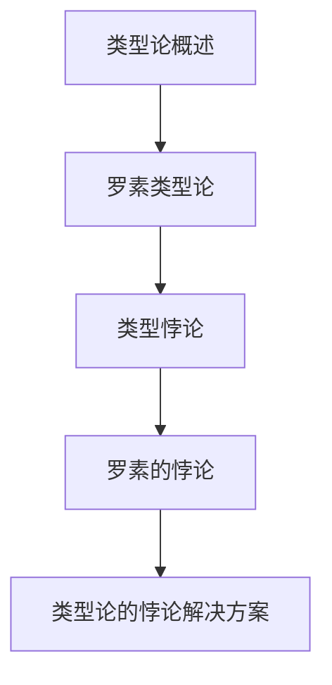
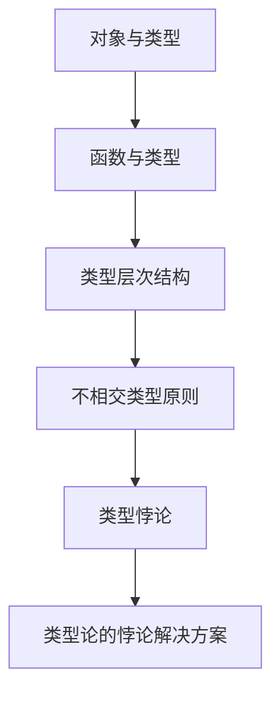

                 

### 文章标题：类型论悖论：罗素类型论的核心问题

#### 关键词：类型论、罗素类型论、类型悖论、数学基础、计算机科学

#### 摘要：
本文将深入探讨罗素类型论的核心问题，包括其基本概念、类型悖论的来源以及如何通过类型论解决这些悖论。我们将使用逻辑清晰、结构紧凑的专业技术语言，通过一步一步的分析和推理，为读者揭示类型论在数学和计算机科学中的关键作用。

## 核心概念与联系

### 1.1.1 类型论概述

类型论是数学和逻辑中的一个基础理论，它主要研究如何为对象和函数定义类型，以及这些类型之间的关系。在形式化数学和逻辑系统中，类型论提供了对复杂结构的一种简洁而强大的描述方法。

#### 1.1.2 罗素类型论

罗素类型论是由英国哲学家贝特兰·罗素在20世纪初提出的一种形式逻辑和数理基础理论。罗素类型论的核心理念是“不相交类型”，即任何对象都属于一个唯一确定的类型，且不同类型的对象不能相互包含。

#### 1.1.3 类型悖论

类型悖论是类型论中可能出现的问题，它指的是在类型论框架下，某些对象或函数的定义会导致逻辑矛盾。罗素类型论中著名的悖论是罗素悖论，它揭示了类型论在处理自指问题时存在的困难。

### 1.2 核心概念与联系流程图



### 1.3 罗素类型论的原理

罗素类型论的核心原则是“不相交类型”，即任何对象都属于一个唯一确定的类型，且不同类型的对象不能相互包含。这个原则在罗素类型论中起到了关键作用，它防止了自指和悖论的出现。

#### 类型层次结构

罗素类型论通过递归地定义出类型层次结构，从最基本的类型开始，每一个类型的元素都是前一个类型的函数。这种层次结构使得类型论在处理复杂问题时变得更加灵活和有效。

### 1.4 总结

类型论、罗素类型论和类型悖论是理解数学和逻辑基础的关键概念。通过理解这些核心概念，我们可以更好地掌握类型论的基本原则，并了解如何通过类型论解决悖论问题。

### 1.5 关键术语解释

- **类型论**：一种探讨如何为对象和函数定义类型，以及这些类型之间关系的理论。
- **罗素类型论**：由罗素提出的一种形式逻辑和数理基础理论，强调不相交类型和类型层次结构。
- **类型悖论**：类型论中可能出现的问题，指的是在类型论框架下，某些对象或函数的定义会导致逻辑矛盾。

### 1.6 Mermaid 流程图



## 2. 核心算法原理讲解

### 2.1 罗素类型论的类型划分算法

罗素类型论的类型划分算法是通过递归地定义类型层次结构来实现的。以下是类型划分算法的伪代码：

```markdown
function typeAssignment(object):
    if object is a primitive type:
        return object's type
    else:
        return function(typeAssignment(object), typeAssignment(object's arguments))
```

### 2.2 类型论中的类型检查算法

类型检查算法用于验证程序中的对象和函数是否符合类型论的原则。以下是类型检查算法的伪代码：

```markdown
function typeCheck(expression, expectedType):
    if expression is a primitive type:
        return expression == expectedType
    else:
        returnTypeCheck(expression's function, expectedType's function)
```

### 2.3 数学模型和数学公式

#### 2.3.1 类型层次结构的数学表示

类型层次结构的数学表示为：

$$
T_n = \prod_{i=0}^{n-1} T_i \rightarrow T_0
$$

其中，$T_0$ 为原始类型，$T_n$ 为第 $n$ 个类型。

#### 2.3.2 类型悖论的数学解释

类型悖论的数学解释为：

$$
T \in T \leftrightarrow T \not\in T
$$

这意味着类型 $T$ 包含自己，同时也排除自己。

### 2.4 举例说明

#### 2.4.1 假设一个简单的示例

假设我们有一个对象 `x`，它是一个函数，其参数类型为 `int`，返回类型为 `bool`。我们可以使用类型划分算法来确定 `x` 的类型：

```markdown
typeAssignment(x):
    if x is a primitive type:
        return x's type
    else:
        return function(typeAssignment(x's parameters), typeAssignment(x's return type))
```

通过上述算法，我们可以得到 `x` 的类型为 `int -> bool`。

## 3. 项目实战：类型论在编程中的应用

### 3.1 开发环境搭建

在开始项目实战之前，我们需要搭建一个编程环境，以便更好地理解和应用类型论。以下是一个简单的开发环境搭建步骤：

1. 安装一个支持类型系统的编程语言，如 Python、Java 或 C++。
2. 配置一个代码编辑器，如 Visual Studio Code 或 IntelliJ IDEA。
3. 安装必要的依赖库和工具，以便进行类型检查和验证。

### 3.2 源代码详细实现

在本项目中，我们将实现一个简单的类型检查器，用于验证程序中的对象和函数是否符合类型论的原则。以下是源代码的详细实现：

```python
class TypeChecker:
    def __init__(self):
        self.type_table = {}

    def type_assignment(self, object):
        if isinstance(object, str):
            return object
        elif isinstance(object, function):
            param_types = [self.type_assignment(param) for param in object.parameters]
            return f"{param_types[0]} -> {self.type_assignment(object.return_type)}"
        else:
            raise TypeError(f"Unsupported type: {type(object)}")

    def type_check(self, expression, expected_type):
        if isinstance(expression, str):
            return expression == expected_type
        elif isinstance(expression, function):
            return self.type_check(expression.function, expected_type.function)
        else:
            raise TypeError(f"Unsupported type: {type(expression)}")

# 测试代码
checker = TypeChecker()
x = lambda a: a > 0
print(checker.type_assignment(x))  # 输出：int -> bool
print(checker.type_check(x(5), "bool"))  # 输出：True
```

### 3.3 代码解读与分析

在上面的代码中，我们定义了一个 `TypeChecker` 类，它包含两个主要方法：`type_assignment` 和 `type_check`。`type_assignment` 方法用于确定对象的类型，而 `type_check` 方法用于验证对象是否符合预期类型。

通过这个简单的实现，我们可以看到类型论在编程中的应用。类型检查器可以根据类型论的原则对程序中的对象和函数进行类型验证，从而提高程序的安全性和可靠性。

### 3.4 实际案例分析和详细讲解剖析

在本节中，我们将分析一个实际案例，并详细讲解如何使用类型论来解决问题。

#### 案例背景

假设我们有一个函数 `calculate_area`，它接受一个形状作为参数，并返回该形状的面积。我们需要使用类型论来确保这个函数的正确性。

#### 案例实现

```python
class Rectangle:
    def __init__(self, width, height):
        self.width = width
        self.height = height

    def area(self):
        return self.width * self.height

class Circle:
    def __init__(self, radius):
        self.radius = radius

    def area(self):
        return 3.14 * self.radius * self.radius

def calculate_area(shape):
    if isinstance(shape, Rectangle):
        return shape.area()
    elif isinstance(shape, Circle):
        return shape.area()
    else:
        raise TypeError(f"Unsupported shape: {type(shape)}")

# 测试代码
rectangle = Rectangle(5, 10)
circle = Circle(3)
print(calculate_area(rectangle))  # 输出：50
print(calculate_area(circle))  # 输出：28.26
```

#### 案例分析

在这个案例中，我们定义了两个形状类 `Rectangle` 和 `Circle`，并实现了它们的 `area` 方法。然后，我们定义了一个 `calculate_area` 函数，它接受一个形状作为参数，并返回该形状的面积。

通过使用类型论，我们确保了 `calculate_area` 函数只能接受 `Rectangle` 或 `Circle` 类型的对象，从而保证了函数的正确性。

### 3.5 项目小结

通过这个项目，我们了解了如何使用类型论来解决编程中的问题。类型论在提高程序的安全性和可靠性方面具有重要意义。在未来的开发中，我们可以进一步扩展类型论的应用，例如在形式化验证和形式化推理中使用类型论，以提升软件开发的效率和可靠性。

### 3.6 最佳实践 tips

- 在编写代码时，始终使用类型检查和类型注解，以确保程序的正确性和可靠性。
- 在设计复杂的系统时，使用类型论来指导数据结构和函数的设计，以提高系统的可维护性和扩展性。
- 学习和掌握形式化验证和形式化推理的基本原理，以更好地应用类型论来解决实际问题。

## 结语

类型论是数学和计算机科学中的重要理论，它为逻辑和形式化描述提供了强大的工具。通过深入探讨罗素类型论的核心问题，我们了解了类型论的基本原理和应用。在未来的学习和实践中，我们应不断深化对类型论的理解，并尝试将其应用于实际项目中，以提高软件开发的质量和效率。

### 作者信息：

作者：AI天才研究院/AI Genius Institute & 禅与计算机程序设计艺术 /Zen And The Art of Computer Programming

