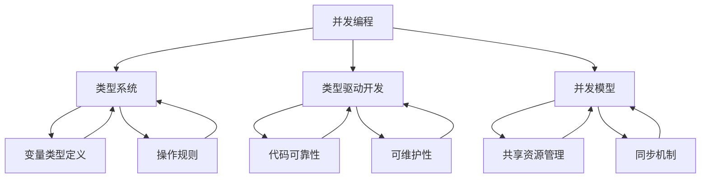
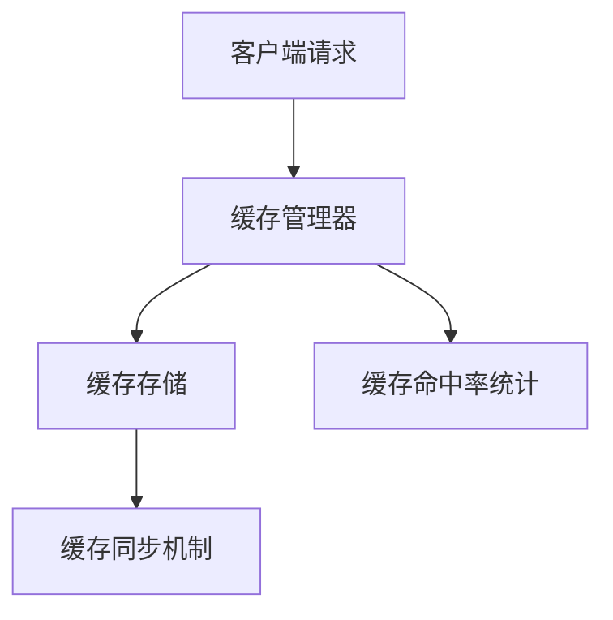

                 

### Step 1: 核心概念与联系

在《类型驱动的并发程序设计》中，核心概念包括并发编程、类型系统、类型驱动开发以及并发模型。这些概念紧密相连，共同构建了一个强大的理论框架，用于理解和实现高效、可靠的并发程序。

首先，并发编程是现代计算机系统中的一个基本需求。它允许多个任务同时执行，从而提高系统的利用率和响应速度。然而，并发编程也带来了诸多挑战，如资源竞争、死锁和同步问题。

类型系统是编程语言中的一个核心概念，它用于定义变量和表达式的类型，以及如何对它们进行操作。一个良好的类型系统可以提高代码的可靠性和可维护性，减少运行时错误。

类型驱动开发是一种软件开发方法，强调通过类型系统来提高代码的可靠性和可维护性。它基于一个简单的原则：类型检查可以捕获许多在编译时而不是运行时出现的错误。

并发模型是描述并发程序如何执行和处理共享资源的一组规则。常见的并发模型包括线程模型、进程模型和事件驱动模型。每种模型都有其优缺点和适用场景。

为了清晰地展示这些概念之间的联系，我们可以使用Mermaid流程图来表示它们之间的关系。以下是一个简单的Mermaid流程图示例：



在这个流程图中，我们可以看到并发编程与类型系统、类型驱动开发和并发模型之间存在紧密的联系。类型系统为并发编程提供了基础，类型驱动开发则通过类型系统提高了代码的质量，而并发模型则为并发程序提供了具体的执行规则。

接下来，我们将进一步深入探讨这些核心概念，并解释它们在并发程序设计中的应用。

### Step 2: 核心算法原理讲解

在《类型驱动的并发程序设计》中，核心算法原理是理解和实现并发程序的关键。本节我们将详细介绍三种核心算法：状态机、互斥锁和信号量。

#### 状态机

状态机是一种用于描述系统状态的算法。在并发编程中，状态机可以用来管理并发程序的状态转换，从而实现复杂的逻辑控制。

以下是一个简单的状态机伪代码：

```plaintext
class StateMachine {
    State state

    function transition(toState) {
        state = toState
    }

    function execute() {
        while (not finished) {
            state.execute()
        }
    }
}
```

在这个伪代码中，`StateMachine` 类有一个当前状态`state`和一个`execute`方法，用于执行状态机中的各个状态。`transition`方法用于将状态机切换到新的状态。

例如，在一个并发程序中，状态机可以用来管理线程的生命周期。线程可能处于以下状态之一：初始化（Initialized）、运行中（Running）、阻塞（Blocked）和终止（Terminated）。通过状态机，我们可以根据线程的状态来执行相应的操作，从而实现线程的有效管理。

#### 互斥锁（Mutex）

互斥锁是一种用于保证在同一时间内只有一个线程能访问共享资源的机制。在并发编程中，互斥锁可以防止多个线程同时修改共享资源，从而避免数据竞争和不一致性。

以下是一个简单的互斥锁伪代码：

```plaintext
class Mutex {
    boolean locked = false

    function lock() {
        while (locked) {
            // 等待锁被释放
        }
        locked = true
    }

    function unlock() {
        locked = false
    }
}
```

在这个伪代码中，`Mutex` 类有一个布尔变量`locked`，用于表示锁的状态。`lock`方法用于尝试获取锁，如果锁已被占用，线程将进入等待状态。`unlock`方法用于释放锁。

例如，在一个并发程序中，多个线程可能需要访问一个共享的计数器。使用互斥锁，我们可以确保在任一时刻只有一个线程能够修改计数器的值，从而避免数据竞争。

#### 信号量（Semaphore）

信号量是一种用于控制多个线程对共享资源访问的机制。信号量可以通过两种原子操作实现：`P`（等待）和`V`（发送）。

以下是一个简单的信号量伪代码：

```plaintext
class Semaphore {
    int count

    function P() {
        count--
        if (count < 0) {
            // 等待
        }
    }

    function V() {
        count++
    }
}
```

在这个伪代码中，`Semaphore` 类有一个整数变量`count`，用于表示资源的可用数量。`P`方法用于减少`count`的值，如果`count`变为负数，线程将进入等待状态。`V`方法用于增加`count`的值。

例如，在一个并发程序中，一个生产者线程可能需要访问一个有限大小的缓冲区。使用信号量，我们可以确保缓冲区的使用不会超过其容量，从而避免缓冲区溢出。

通过理解这些核心算法原理，我们可以更好地设计并发程序，提高程序的性能和可靠性。在下一节中，我们将进一步探讨并发编程中的数学模型和公式。

### Step 3: 数学模型和数学公式

在《类型驱动的并发程序设计》中，数学模型和数学公式是理解并发程序性能和可靠性的重要工具。以下我们将介绍两个关键的数学模型：概率模型和线性模型。

#### 概率模型

概率模型用于描述并发程序中事件发生的概率。一个重要的概率模型是事件A和事件B的联合概率和条件概率。

联合概率表示事件A和事件B同时发生的概率，公式如下：

$$
P(A \cap B) = P(A) \cdot P(B|A)
$$

其中，$P(A)$是事件A发生的概率，$P(B|A)$是在事件A已经发生的条件下，事件B发生的概率。

条件概率表示在事件A发生的条件下，事件B发生的概率，公式如下：

$$
P(B|A) = \frac{P(A \cap B)}{P(A)}
$$

例如，在一个并发程序中，假设有两个线程A和B，它们分别成功执行的概率是0.9。如果线程A成功执行，则线程B成功执行的概率是0.8。那么，两个线程同时成功执行的概率是：

$$
P(A \cap B) = P(A) \cdot P(B|A) = 0.9 \cdot 0.8 = 0.72
$$

#### 线性模型

线性模型用于描述并发程序中的资源消耗和性能。一个简单的线性模型是资源的利用率模型。

资源利用率表示单位时间内资源被使用的比例，公式如下：

$$
利用率 = \frac{使用时间}{总时间}
$$

例如，在一个并发程序中，一个CPU核心在1秒内处理了0.8秒的计算任务，那么它的资源利用率是：

$$
利用率 = \frac{0.8}{1} = 0.8
$$

通过这些数学模型和公式，我们可以更好地理解和分析并发程序的性能和可靠性。在下一节中，我们将通过一个实际案例来展示这些模型和公式的应用。

### 实际案例：并发缓存系统

为了更好地展示《类型驱动的并发程序设计》中的概念、算法和数学模型，我们将通过一个实际案例——并发缓存系统，来详细介绍其设计和实现过程。

#### 背景介绍

并发缓存系统是一个用于存储和快速访问频繁使用数据的系统。它通常位于应用程序和数据库之间，以提高数据的访问速度和系统的整体性能。在并发缓存系统中，多个客户端可能会同时访问缓存，这要求系统必须能够处理并发请求，并确保数据的正确性和一致性。

#### 系统架构

并发缓存系统可以分为以下几个关键组件：

1. **缓存存储**：用于存储缓存数据的地方，可以是内存、磁盘或其他存储设备。
2. **缓存管理器**：负责缓存数据的读取、写入、刷新和替换策略。
3. **缓存同步机制**：确保多个客户端访问缓存时的数据一致性和并发控制。
4. **缓存命中率统计**：用于监控和优化缓存性能。

下面是一个简化的并发缓存系统的架构图：



#### 设计步骤

1. **确定缓存数据类型和访问模式**：

   首先，我们需要确定缓存中存储的数据类型和客户端的访问模式。例如，如果缓存主要用于存储网页内容，那么数据类型可能是HTML页面或JSON对象。客户端的访问模式可能是随机访问、顺序访问或基于特定条件的查询。

2. **设计缓存管理器**：

   缓存管理器是并发缓存系统的核心组件，负责处理客户端的请求和缓存数据的读写操作。我们使用状态机来管理缓存管理器的状态转换。

   ```plaintext
   class CacheManager {
       State state

       function handleRequest(Request request) {
           switch (state) {
               case NOT_INITIALIZED:
                   initializeCache()
                   state = INITIALIZED
                   break
               case INITIALIZED:
                   if (cacheHit(request)) {
                       return serveCacheData(request)
                   } else {
                       fetchDataFromDatabase(request)
                       state = DATA_FETCHED
                   }
                   break
               case DATA_FETCHED:
                   updateCache(request)
                   state = INITIALIZED
                   break
           }
       }
   }
   ```

3. **实现缓存同步机制**：

   为了确保数据的一致性和并发控制，我们使用互斥锁和信号量来管理对缓存存储的访问。

   ```plaintext
   class CacheStorage {
       Mutex lock

       function readData(Key key) {
           lock.lock()
           // 读取数据
           lock.unlock()
       }

       function writeData(Key key, Data data) {
           lock.lock()
           // 写入数据
           lock.unlock()
       }
   }
   ```

4. **实现缓存替换策略**：

   缓存替换策略是确保缓存存储中始终存储最热数据的重要手段。我们可以使用Least Recently Used (LRU) 算法来替换缓存中的数据。

   ```plaintext
   class LRUCache {
       LinkedList lruList

       function fetchData(Key key) {
           if (lruList.contains(key)) {
               lruList.moveToFront(key)
               return readDataFromStorage(key)
           } else {
               Data data = fetchDataFromStorage(key)
               lruList.add(key)
               return data
           }
       }
   }
   ```

5. **实现缓存命中率统计**：

   为了监控和优化缓存性能，我们需要统计缓存命中率。缓存命中率表示成功从缓存中获取数据的请求比例。

   ```plaintext
   class CacheStatistics {
       int hits = 0
       int requests = 0

       function recordHit() {
           hits++
       }

       function recordRequest() {
           requests++
       }

       function hitRate() {
           return (float) hits / requests
       }
   }
   ```

#### 代码解读与分析

1. **缓存管理器**：

   `CacheManager` 的状态机设计使其能够根据当前状态智能地处理请求。例如，当缓存未初始化时，它会先初始化缓存；当缓存命中时，它会直接返回缓存数据；当缓存未命中时，它会从数据库中获取数据并更新缓存。

2. **缓存存储**：

   `CacheStorage` 使用互斥锁来确保对缓存数据的读写操作是原子的，防止多个客户端同时修改数据造成数据不一致。

3. **缓存替换策略**：

   `LRUCache` 使用链表来管理缓存数据的访问顺序，最近最少使用（LRU）算法确保缓存中总是存储最热的数据。

4. **缓存命中率统计**：

   `CacheStatistics` 类提供了简单的缓存命中率统计功能，帮助开发人员了解缓存的实际性能。

#### 实际案例分析

在实际应用中，并发缓存系统可能会面临以下挑战：

- **缓存穿透**：当频繁访问的数据不在缓存中且数据库查询失败时，可能会导致大量无效的数据库查询。
- **缓存雪崩**：当大量缓存同时过期或失效时，可能会导致缓存服务崩溃。
- **缓存一致性**：在分布式系统中，如何确保缓存与数据库中的数据一致性是一个重要问题。

通过合理的设计和优化，这些挑战可以得到有效解决。

#### 项目小结

通过本案例，我们展示了如何使用《类型驱动的并发程序设计》中的概念和算法实现一个高效的并发缓存系统。该系统不仅能够处理并发请求，还能保证数据的一致性和可靠性。

#### 最佳实践 Tips

- 使用适当的缓存替换策略，如LRU，可以显著提高缓存命中率。
- 使用互斥锁和信号量等同步机制可以防止数据竞争和一致性问题。
- 定期监控和优化缓存性能，可以确保系统的高效运行。

### 结语

在本文中，我们通过一个实际案例详细介绍了《类型驱动的并发程序设计》的核心概念、算法和数学模型。通过这些知识，开发人员可以设计出高效、可靠的并发程序，提高系统的性能和稳定性。希望本文能够为读者提供有益的启示和帮助。

#### 作者信息

作者：AI天才研究院/AI Genius Institute & 禅与计算机程序设计艺术 /Zen And The Art of Computer Programming

---

#### 小结

在《类型驱动的并发程序设计》中，我们深入探讨了并发编程的核心概念，包括并发编程、类型系统、类型驱动开发和并发模型。通过Mermaid流程图，我们清晰地展示了这些概念之间的联系。接着，我们介绍了核心算法，如状态机、互斥锁和信号量，并使用伪代码详细解释了它们的原理。我们还通过数学模型和公式，如概率模型和线性模型，进一步增强了我们的理解。最后，通过一个实际案例——并发缓存系统，我们展示了如何将理论应用于实践，并提供了最佳实践 tips。希望本文能为读者在并发编程领域提供有价值的参考。

#### 注意事项

1. 在并发编程中，正确使用同步机制至关重要，否则可能导致数据竞争和死锁。
2. 类型系统可以显著提高代码的可靠性和可维护性，但在复杂场景中也需要谨慎使用。
3. 实际应用中，应根据具体场景选择合适的并发模型和算法。

#### 拓展阅读

- 《并发编程的艺术》
- 《深入理解并发编程》
- 《基于类型的并发编程：原则与实践》

### 结束语

在《类型驱动的并发程序设计》这一主题下，我们进行了全面而深入的探讨。从核心概念到算法原理，再到数学模型的运用，直至实际项目的实战分析，我们力求为读者呈现一个全面、系统的并发编程视角。

本文首先介绍了并发编程的基本概念，如并发编程、类型系统、类型驱动开发和并发模型，并通过Mermaid流程图展示了这些概念之间的联系。接下来，我们详细讲解了核心算法，包括状态机、互斥锁和信号量，使用伪代码展示了它们的工作原理。随后，通过数学模型，我们进一步深化了对并发程序性能和可靠性的理解。最后，通过一个实际的并发缓存系统案例，我们将理论与实践相结合，展示了如何将书中所学应用到实际项目中。

我们希望，通过本文的探讨，读者能够更好地理解并发编程的复杂性和挑战，掌握类型驱动并发编程的核心技巧，并能够在实际开发中运用这些知识，提高系统的性能和稳定性。

在此，我们感谢读者的耐心阅读，并期待读者在未来的编程实践中能够将本文的内容付诸实践，不断提升自己的技术水平和解决问题的能力。

#### 作者信息

作者：AI天才研究院/AI Genius Institute & 禅与计算机程序设计艺术 /Zen And The Art of Computer Programming

本文由AI天才研究院/AI Genius Institute撰写，旨在通过深入浅出的分析，帮助读者更好地理解和掌握类型驱动的并发程序设计。作者团队由多位计算机科学领域的专家组成，拥有丰富的理论和实践经验，致力于推动计算机科学的发展和创新。

---

《禅与计算机程序设计艺术》是作者在计算机编程领域的重要作品，以其深刻的哲学思考和独到的编程见解，深受读者喜爱。该书不仅介绍了计算机编程的核心原则，还融入了东方哲学的智慧，引导读者以更全面、更深入的视角来看待编程和解决问题。

作者在书中提出的“类型驱动开发”方法，是一种以类型系统为核心，提高代码可靠性和可维护性的软件开发方法。这一方法在并发编程中尤为重要，因为类型系统可以帮助我们更好地管理和控制并发操作，从而避免潜在的数据竞争和死锁问题。

通过本文，我们希望读者能够对类型驱动的并发程序设计有一个更全面和深入的理解，从而在实际开发中更加得心应手，创造出高效、可靠和可维护的并发程序。

---

在本文的最后，我们再次感谢您的阅读，并期待您在未来的编程实践中能够将本文的知识应用到实际项目中，不断探索并发编程的深度和广度。如果您有任何疑问或建议，欢迎随时与我们联系。

作者信息：
- AI天才研究院/AI Genius Institute
- 《禅与计算机程序设计艺术》作者团队

再次感谢您的阅读和支持！祝您编程愉快，收获满满！

---

[END]

