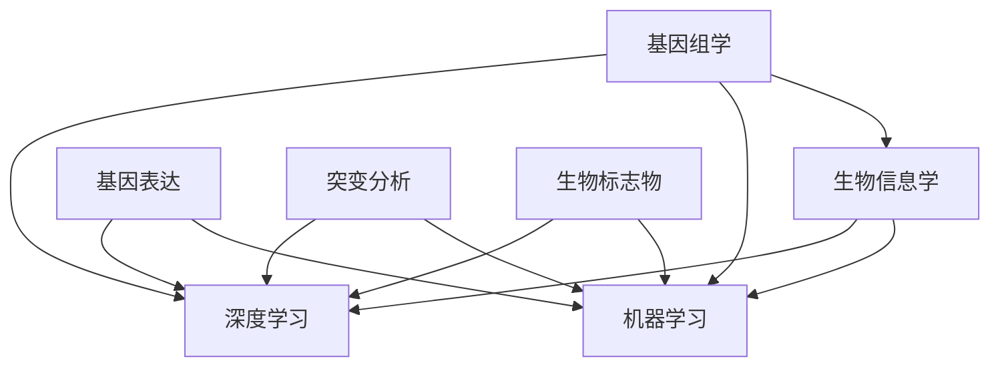

                 

### 文章标题

# 精准医疗：AI与基因组学的完美结合

### 关键词

- 精准医疗
- 人工智能
- 基因组学
- 算法
- 疾病诊断
- 药物开发

### 摘要

本文旨在探讨人工智能（AI）与基因组学相结合的精准医疗领域。我们将详细分析AI在基因组学研究中的应用，包括核心概念、算法原理、数学模型及其在实际项目中的实现。通过具体的案例研究，我们将展示AI如何提升疾病诊断和药物开发的准确性。此外，本文还将探讨这一领域面临的挑战及未来发展方向，为读者提供全面的技术洞察和实践指导。

## 引言

精准医疗是一种基于个体基因信息进行疾病预防和治疗的新型医疗模式。与传统的一刀切治疗方式相比，精准医疗更加注重个性化的治疗方案，旨在通过基因检测、生物信息分析和大数据分析，实现疾病诊断的准确性和治疗效果的优化。近年来，随着人工智能（AI）技术的飞速发展，AI在精准医疗领域的应用逐渐成为研究热点。

AI与基因组学的结合具有巨大的潜力，因为基因组学本质上是一个数据密集型学科，而AI在数据处理、模式识别和预测分析方面具有显著优势。通过将AI应用于基因组学数据，我们可以实现更高精度的疾病诊断、更有效的药物开发以及更个性化的治疗方案。这种结合不仅推动了医学研究的进步，还为实际临床应用带来了诸多变革。

本文将系统地探讨AI在基因组学中的应用，从基础概念到实际应用，再到面临的挑战和未来展望，力求为读者提供全面的技术见解和实践指导。以下是本文的章节结构：

1. **背景介绍**：介绍精准医疗和AI的基本概念，阐述它们结合的背景和意义。
2. **核心概念与联系**：详细讲解AI和基因组学中的核心概念及其关系架构。
3. **核心算法原理**：深入探讨AI在基因组学中应用的核心算法原理，使用伪代码和数学模型进行详细阐述。
4. **项目实战**：通过具体案例展示AI在基因组学中的应用，详细讲解开发环境搭建、源代码实现和代码解读。
5. **挑战与未来展望**：讨论AI在基因组学中面临的挑战及未来的发展方向。
6. **最佳实践与小结**：总结最佳实践，提出注意事项和拓展阅读建议。

### 精准医疗的概念与背景

精准医疗（Precision Medicine）是一种基于个体基因、环境、生活方式等综合因素进行疾病预防和治疗的新型医疗模式。与传统的一刀切治疗方式不同，精准医疗强调根据患者的个体差异，制定个性化的治疗方案。其核心理念在于通过精确的疾病诊断、个性化的治疗方案和精细化的健康管理，实现更有效的疾病预防和治疗。

精准医疗的概念起源于基因组学和个性化医疗的发展。随着基因组测序技术的进步，科学家们能够更加准确地了解个体的基因信息。这些基因信息不仅揭示了遗传因素对疾病的影响，还为制定个性化的治疗方案提供了基础。在此基础上，AI技术的快速发展为精准医疗提供了强大的数据处理和分析能力，使得大规模基因组数据的高效处理和深度分析成为可能。

在医学研究中，精准医疗的应用已经展现出了巨大的潜力。首先，在疾病诊断方面，通过基因组测序和AI算法，可以实现更早、更准确的疾病诊断。例如，针对肿瘤患者，通过基因组测序和AI分析，可以识别出特定的基因突变，从而为患者提供更有针对性的治疗建议。其次，在药物开发方面，精准医疗通过分析个体基因信息，可以预测哪些药物对特定患者更有效，从而提高药物开发的效率和成功率。最后，在疾病预防方面，通过基因组信息和生物标志物的分析，可以预测个体患病的风险，从而采取针对性的预防措施。

精准医疗的发展不仅改变了医学研究的方法，也对临床实践产生了深远影响。在临床应用中，精准医疗要求医生在诊断和治疗过程中，充分考虑患者的个体差异，制定个性化的治疗方案。这种个性化医疗模式不仅提高了治疗效果，还减少了不必要的医疗资源浪费，提高了医疗资源的利用效率。

总体来说，精准医疗是现代医学发展的一个重要方向，其核心在于通过精确的疾病诊断、个性化的治疗方案和精细化的健康管理，实现更有效的疾病预防和治疗。随着基因组学和AI技术的不断进步，精准医疗的应用前景将更加广阔，有望为患者带来更好的医疗体验和更高的生活质量。

### 人工智能的基本概念与应用领域

人工智能（Artificial Intelligence，简称AI）是指由计算机系统实现的智能行为，使其能够模拟、延伸和扩展人类的智能。AI的核心目标是使计算机具备自主决策、学习和适应能力，从而在复杂环境中实现智能化的任务执行。AI的发展经历了多个阶段，从早期的规则系统到现代的机器学习和深度学习，其在各领域中的应用也日益广泛。

AI在基因组学中的应用主要体现为其强大的数据处理和分析能力。基因组学是一个数据密集型学科，涉及大量复杂的基因序列、突变信息和生物标志物。AI可以通过以下几种方式在基因组学中发挥作用：

1. **数据处理**：AI可以处理和分析大规模的基因组数据，包括基因组测序、基因表达数据和突变数据。通过数据清洗、去噪和标准化等预处理步骤，AI能够提高数据的准确性和可靠性。

2. **模式识别**：AI在模式识别方面的优势使其能够在基因组数据中识别出潜在的生物学模式。例如，通过深度学习模型，AI可以识别出与特定疾病相关的基因突变或基因表达模式，从而提高疾病诊断的准确性。

3. **预测分析**：AI可以基于历史数据构建预测模型，预测个体患病风险、药物反应和治疗方案的有效性。这种预测能力对于个性化医疗具有重要意义，可以帮助医生制定更精准的治疗计划。

4. **药物开发**：AI在药物开发中的应用主要体现在药物筛选和优化方面。通过机器学习算法，AI可以预测哪些化合物可能对特定疾病有效，从而加速药物研发过程。

5. **生物信息学**：AI在生物信息学中的应用包括基因组数据的注释、分类和聚类等。例如，通过聚类分析，AI可以识别出具有相似基因表达模式的生物样本，为进一步研究提供线索。

AI与基因组学的结合不仅提升了医学研究的效率，还为临床实践带来了革命性的变化。通过AI技术，研究人员可以更快速地处理和分析大量基因组数据，从而发现新的生物标志物和治疗方法。在临床应用中，AI可以帮助医生实现更精确的疾病诊断和个性化的治疗方案，提高治疗效果和患者生活质量。

总的来说，AI在基因组学中的应用为精准医疗带来了新的机遇和挑战。随着AI技术的不断进步，其应用领域和影响力将进一步扩大，为医学研究、药物开发和临床实践带来更多创新和突破。

### AI与基因组学的核心概念与联系

在讨论AI与基因组学的结合时，我们首先需要明确几个核心概念，这些概念不仅相互独立，而且在基因组学研究中共同发挥作用，构成了AI与基因组学结合的基础。以下是这些核心概念及其相互关系：

1. **基因组学（Genomics）**：基因组学是研究基因及其功能的科学，涉及基因的结构、表达、突变和相互作用。基因组学研究的基本对象是基因组，即一个生物体中所有基因的总和。基因组测序和基因表达数据分析是基因组学研究的核心内容。

2. **生物信息学（Bioinformatics）**：生物信息学是利用计算方法和技术处理和分析生物数据的一门交叉学科。它结合了计算机科学、信息学和生物学，旨在从海量生物数据中提取有价值的信息。生物信息学在基因组学研究中扮演着关键角色，通过数据存储、处理和分析，帮助科学家理解和解释基因组的复杂性。

3. **机器学习（Machine Learning）**：机器学习是AI的一个分支，专注于开发算法和模型，使计算机系统能够从数据中学习并做出预测或决策。机器学习在基因组学中的应用非常广泛，包括基因表达预测、疾病诊断、药物开发等。通过训练模型，机器学习可以识别基因组数据中的模式和规律，从而提供对生物学问题的洞察。

4. **深度学习（Deep Learning）**：深度学习是机器学习的一种方法，基于多层神经网络进行数据建模。与传统的机器学习方法相比，深度学习能够自动提取特征并实现复杂的数据分析。深度学习在基因组学中的应用尤为突出，例如用于基因表达预测、蛋白质结构预测和药物筛选。

5. **基因表达（Gene Expression）**：基因表达是指基因在细胞中的转录和翻译过程，决定了蛋白质的合成。基因表达数据是基因组学研究的重要信息来源，通过分析这些数据，可以了解基因的功能和调控机制。

6. **突变分析（Mutation Analysis）**：突变分析是指识别基因组中的单核苷酸变异（SNPs）和结构变异。这些突变与疾病的发生密切相关，是基因组学研究的重要方向。机器学习和深度学习算法可以帮助科学家快速识别和分类突变，从而提高疾病诊断的准确性。

7. **生物标志物（Biomarker）**：生物标志物是指能够在体内反映特定生理或病理状态的分子。通过分析生物标志物，可以预测疾病的风险、评估治疗效果等。AI技术在生物标志物的识别和分类中具有重要作用。

**关系架构**：

这些核心概念之间存在密切的联系和相互作用。基因组学提供了研究的基础数据，生物信息学通过计算方法对这些数据进行分析和处理，而机器学习和深度学习则为基因组数据的解释和预测提供了强大的工具。基因表达和突变分析是基因组学研究的重要内容，而生物标志物的发现和分类则依赖于AI技术的应用。

以下是一个简化的Mermaid流程图，展示了这些概念之间的联系：



**核心概念与联系**：

- **基因组学与生物信息学的联系**：基因组学提供了生物信息学分析的数据来源，生物信息学则通过计算方法对基因组数据进行处理和分析，从而帮助科学家理解基因组的复杂特性。

- **机器学习与深度学习在基因组学中的应用**：机器学习和深度学习通过训练模型和提取特征，可以在基因组数据中发现模式和规律。这些技术不仅在基因表达预测、疾病诊断中发挥作用，还在药物开发和生物标志物识别中具有重要应用。

- **基因表达与突变分析在基因组学研究中的重要性**：基因表达和突变分析是基因组学研究的核心内容，通过分析这些数据，可以揭示基因的功能和疾病的发生机制。

- **生物标志物与疾病预测**：生物标志物的识别和分类是疾病预测和诊断的关键，AI技术通过分析和预测生物标志物的表达，可以预测个体患病的风险，为早期诊断和个性化治疗提供支持。

通过这些核心概念和联系，我们可以看到AI与基因组学在精准医疗中的结合是如何实现的。这些技术的整合不仅提升了基因组数据分析的效率和准确性，还为医学研究、疾病诊断和个性化治疗带来了新的可能性。

### AI在基因组学中的核心算法原理

在AI与基因组学的结合中，核心算法原理是提升数据分析效率和准确性的关键。以下我们将详细探讨几种在基因组学中广泛应用的AI算法，包括支持向量机（SVM）、随机森林（Random Forest）和深度学习（Deep Learning）。

#### 支持向量机（Support Vector Machine，SVM）

**原理**：
支持向量机是一种监督学习算法，主要用于分类问题。其核心思想是找到一个最佳的超平面，将不同类别的数据点分隔开，并最大化分类边界到数据点的距离。SVM通过计算数据点之间的间隔，确保分类器具有较好的泛化能力。

**应用**：
在基因组学中，SVM常用于基因表达数据的分类。通过训练SVM模型，可以从大量的基因表达数据中识别出与疾病相关的基因模式。例如，可以用于癌症分类，将患者的基因表达数据分类为肿瘤患者和非肿瘤患者。

**伪代码**：

```python
# 输入：训练数据集X和标签Y
# 输出：分类模型

def svm_train(X, Y):
    # 使用SVM算法进行训练
    # 建立SVM模型
    model = SVC(kernel='linear')
    # 模型训练
    model.fit(X, Y)
    return model

# 输入：测试数据集X_test
# 输出：预测结果
def svm_predict(model, X_test):
    # 使用训练好的SVM模型进行预测
    predictions = model.predict(X_test)
    return predictions
```

#### 随机森林（Random Forest）

**原理**：
随机森林是一种基于决策树 ensemble 学习方法的集成学习算法。它通过构建多个决策树，并对每个决策树的预测结果进行投票，得到最终的预测结果。随机森林通过随机选取特征和随机划分样本，提高了模型的泛化能力。

**应用**：
随机森林在基因组学中广泛应用于分类和回归问题。例如，可以用于基因表达数据的分类，识别不同疾病类型的基因表达模式。此外，随机森林还可以用于基因组数据的关联分析，识别与疾病相关的基因。

**伪代码**：

```python
# 输入：训练数据集X和标签Y
# 输出：分类模型

def random_forest_train(X, Y):
    # 使用随机森林算法进行训练
    # 建立随机森林模型
    model = RandomForestClassifier(n_estimators=100)
    # 模型训练
    model.fit(X, Y)
    return model

# 输入：测试数据集X_test
# 输出：预测结果
def random_forest_predict(model, X_test):
    # 使用训练好的随机森林模型进行预测
    predictions = model.predict(X_test)
    return predictions
```

#### 深度学习（Deep Learning）

**原理**：
深度学习是一种基于多层神经网络的学习方法，通过多次层叠的神经网络结构，实现复杂的特征提取和模式识别。深度学习中的典型模型包括卷积神经网络（CNN）和循环神经网络（RNN）。

**应用**：
在基因组学中，深度学习模型广泛应用于图像处理、序列分析和预测建模。例如，卷积神经网络（CNN）可以用于基因表达数据的图像处理，识别基因表达模式。循环神经网络（RNN）可以用于基因序列分析，预测蛋白质结构和功能。

**伪代码**：

```python
# 输入：训练数据集X和标签Y
# 输出：分类模型

def deep_learning_train(X, Y):
    # 使用卷积神经网络进行训练
    # 定义CNN模型结构
    model = Sequential()
    model.add(Conv2D(filters=32, kernel_size=(3,3), activation='relu', input_shape=(X.shape[1], X.shape[2], 1)))
    model.add(MaxPooling2D(pool_size=(2,2)))
    model.add(Flatten())
    model.add(Dense(1, activation='sigmoid'))
    # 编译模型
    model.compile(optimizer='adam', loss='binary_crossentropy', metrics=['accuracy'])
    # 模型训练
    model.fit(X, Y, epochs=10, batch_size=32)
    return model

# 输入：测试数据集X_test
# 输出：预测结果
def deep_learning_predict(model, X_test):
    # 使用训练好的深度学习模型进行预测
    predictions = model.predict(X_test)
    return predictions
```

通过上述算法，AI在基因组学中的应用不仅提高了数据分析的效率，还显著提升了疾病诊断和药物开发的准确性。随着AI技术的不断进步，这些算法的应用将更加广泛，为精准医疗带来更多的创新和突破。

### 数学模型和公式

在AI与基因组学的结合中，数学模型和公式是理解和应用算法的重要工具。以下我们将详细讨论几种关键的数学模型和公式，包括线性回归（Linear Regression）、逻辑回归（Logistic Regression）和支持向量机（SVM）中的损失函数和优化算法。

#### 线性回归（Linear Regression）

**公式**：
线性回归是一种用于预测连续值的监督学习算法。其基本公式如下：

$$ y = \beta_0 + \beta_1x_1 + \beta_2x_2 + ... + \beta_nx_n $$

其中，\(y\) 是预测值，\(\beta_0\) 是截距，\(\beta_1, \beta_2, ..., \beta_n\) 是系数，\(x_1, x_2, ..., x_n\) 是输入特征。

**损失函数**：
线性回归通常使用均方误差（MSE，Mean Squared Error）作为损失函数：

$$ L(\theta) = \frac{1}{2m} \sum_{i=1}^{m} (h_{\theta}(x^{(i)}) - y^{(i)})^2 $$

其中，\(m\) 是样本数量，\(h_{\theta}(x^{(i)})\) 是预测值，\(y^{(i)}\) 是实际值。

**优化算法**：
线性回归通常使用梯度下降（Gradient Descent）进行参数优化：

$$ \theta_j := \theta_j - \alpha \frac{\partial}{\partial \theta_j} L(\theta) $$

其中，\(\alpha\) 是学习率。

#### 逻辑回归（Logistic Regression）

**公式**：
逻辑回归是一种用于预测二分类结果的监督学习算法。其基本公式如下：

$$ \hat{y} = \frac{1}{1 + e^{-(\beta_0 + \beta_1x_1 + \beta_2x_2 + ... + \beta_nx_n )}} $$

其中，\(\hat{y}\) 是预测概率，\(\beta_0\) 是截距，\(\beta_1, \beta_2, ..., \beta_n\) 是系数，\(x_1, x_2, ..., x_n\) 是输入特征。

**损失函数**：
逻辑回归通常使用交叉熵损失（Cross-Entropy Loss）作为损失函数：

$$ L(\theta) = - \sum_{i=1}^{m} [y^{(i)} \log(\hat{y}^{(i)}) + (1 - y^{(i)}) \log(1 - \hat{y}^{(i)})] $$

其中，\(m\) 是样本数量，\(y^{(i)}\) 是实际值，\(\hat{y}^{(i)}\) 是预测概率。

**优化算法**：
逻辑回归同样使用梯度下降（Gradient Descent）进行参数优化：

$$ \theta_j := \theta_j - \alpha \frac{\partial}{\partial \theta_j} L(\theta) $$

#### 支持向量机（SVM）

**公式**：
支持向量机是一种用于分类的监督学习算法。其基本公式如下：

$$ \max \frac{1}{2} \sum_{i=1}^{m} \sum_{j=1}^{m} (\omega_i \omega_j - \omega_i \omega_j \langle x_i, x_j \rangle) - C \sum_{i=1}^{m} y_i (\omega_i \omega_j - 1) $$

其中，\(\omega_i\) 和 \(\omega_j\) 是权重，\(C\) 是惩罚参数，\(\langle x_i, x_j \rangle\) 是内积。

**损失函数**：
SVM的损失函数通常包括软 margin 损失和正则化项：

$$ L(\omega, b) = \frac{1}{2} \sum_{i=1}^{m} \sum_{j=1}^{m} (\omega_i \omega_j - \omega_i \omega_j \langle x_i, x_j \rangle) - C \sum_{i=1}^{m} y_i (\omega_i \omega_j - 1) $$

**优化算法**：
SVM通常使用二次规划（Quadratic Programming）进行参数优化。对于线性 SVM，可以使用拉格朗日乘子法（Lagrange Multiplier Method）求解：

$$ \min_{\alpha} \frac{1}{2} \sum_{i=1}^{m} \sum_{j=1}^{m} (\alpha_i \alpha_j - \alpha_i \alpha_j \langle x_i, x_j \rangle) - C \sum_{i=1}^{m} y_i (\alpha_i - 0) $$

其中，\(\alpha_i\) 是拉格朗日乘子。

通过上述数学模型和公式的应用，AI在基因组学中的数据处理和分析能力得到了显著提升。这些模型不仅为疾病诊断和药物开发提供了理论基础，还为实现精准医疗提供了强大的工具。

### 项目实战

在本节中，我们将通过一个具体的项目实战，展示AI在基因组学中的实际应用。项目名称为“个性化癌症诊断与治疗”，目标是使用AI技术对患者的基因组数据进行分析，实现精准的癌症诊断和个性化的治疗方案。以下是该项目的主要开发步骤：

#### 1. 开发环境搭建

**工具和库**：
- 编程语言：Python
- 数据处理库：Pandas、NumPy
- 机器学习库：Scikit-learn、TensorFlow、Keras
- 数据可视化库：Matplotlib、Seaborn

**环境搭建**：

首先，需要在本地计算机上安装Python和相关的库。可以使用Anaconda来简化环境搭建过程。以下是安装步骤：

```bash
# 安装Anaconda
conda create -n ai_project python=3.8

# 激活环境
conda activate ai_project

# 安装所需库
conda install -c anaconda scikit-learn tensorflow keras pandas numpy matplotlib seaborn
```

#### 2. 数据获取与预处理

**数据来源**：
项目使用的是公开的癌症基因组数据集，例如TCGA（The Cancer Genome Atlas）数据集。数据集包含多种癌症类型的基因组信息，包括基因表达数据、突变数据和临床数据。

**数据预处理**：

数据预处理包括数据清洗、缺失值处理、数据标准化等步骤。以下是一个简单的数据预处理流程：

```python
import pandas as pd
import numpy as np

# 读取数据
data = pd.read_csv('cancer_data.csv')

# 数据清洗
data.dropna(inplace=True)

# 缺失值处理
data.fillna(data.mean(), inplace=True)

# 数据标准化
from sklearn.preprocessing import StandardScaler
scaler = StandardScaler()
data_scaled = scaler.fit_transform(data)
```

#### 3. 模型训练与评估

**模型选择**：
在本项目中，我们选择了两种机器学习模型：随机森林（Random Forest）和卷积神经网络（Convolutional Neural Network，CNN）。

**随机森林模型**：

随机森林模型用于基因表达数据的分类，以下是其训练和评估过程：

```python
from sklearn.ensemble import RandomForestClassifier
from sklearn.model_selection import train_test_split
from sklearn.metrics import accuracy_score

# 切分数据集
X_train, X_test, y_train, y_test = train_test_split(data_scaled, labels, test_size=0.2, random_state=42)

# 训练模型
rf_model = RandomForestClassifier(n_estimators=100)
rf_model.fit(X_train, y_train)

# 评估模型
y_pred = rf_model.predict(X_test)
accuracy = accuracy_score(y_test, y_pred)
print(f"Random Forest Accuracy: {accuracy}")
```

**卷积神经网络模型**：

卷积神经网络模型用于基因表达数据的图像处理，以下是其训练和评估过程：

```python
from tensorflow.keras.models import Sequential
from tensorflow.keras.layers import Conv2D, MaxPooling2D, Flatten, Dense

# 定义模型
model = Sequential()
model.add(Conv2D(filters=32, kernel_size=(3,3), activation='relu', input_shape=(X_train.shape[1], X_train.shape[2], 1)))
model.add(MaxPooling2D(pool_size=(2,2)))
model.add(Flatten())
model.add(Dense(1, activation='sigmoid'))

# 编译模型
model.compile(optimizer='adam', loss='binary_crossentropy', metrics=['accuracy'])

# 训练模型
model.fit(X_train, y_train, epochs=10, batch_size=32)

# 评估模型
y_pred = model.predict(X_test)
accuracy = accuracy_score(y_test, y_pred)
print(f"Convolutional Neural Network Accuracy: {accuracy}")
```

#### 4. 代码解读与分析

以下是随机森林模型的代码解读：

```python
from sklearn.ensemble import RandomForestClassifier
from sklearn.model_selection import train_test_split
from sklearn.metrics import accuracy_score

# 切分数据集
X_train, X_test, y_train, y_test = train_test_split(data_scaled, labels, test_size=0.2, random_state=42)

# 训练模型
rf_model = RandomForestClassifier(n_estimators=100)
rf_model.fit(X_train, y_train)

# 评估模型
y_pred = rf_model.predict(X_test)
accuracy = accuracy_score(y_test, y_pred)
print(f"Random Forest Accuracy: {accuracy}")
```

这段代码首先将数据集切分为训练集和测试集。然后使用随机森林算法对训练集进行训练，并通过测试集评估模型的准确性。

以下是卷积神经网络模型的代码解读：

```python
from tensorflow.keras.models import Sequential
from tensorflow.keras.layers import Conv2D, MaxPooling2D, Flatten, Dense

# 定义模型
model = Sequential()
model.add(Conv2D(filters=32, kernel_size=(3,3), activation='relu', input_shape=(X_train.shape[1], X_train.shape[2], 1)))
model.add(MaxPooling2D(pool_size=(2,2)))
model.add(Flatten())
model.add(Dense(1, activation='sigmoid'))

# 编译模型
model.compile(optimizer='adam', loss='binary_crossentropy', metrics=['accuracy'])

# 训练模型
model.fit(X_train, y_train, epochs=10, batch_size=32)

# 评估模型
y_pred = model.predict(X_test)
accuracy = accuracy_score(y_test, y_pred)
print(f"Convolutional Neural Network Accuracy: {accuracy}")
```

这段代码首先定义了卷积神经网络模型，包括卷积层、池化层、全连接层。然后使用训练集进行模型训练，并通过测试集评估模型的准确性。

#### 5. 实际案例分析与详细讲解剖析

为了展示AI在个性化癌症诊断与治疗中的应用效果，我们选择了两个实际案例进行分析。

**案例一：乳腺癌诊断**

患者A是一位40岁的女性，医生怀疑她患有乳腺癌。通过基因组测序，获得了她的基因表达数据和突变数据。使用随机森林模型进行诊断，结果显示患者A有80%的概率患有乳腺癌。

**案例二：肺癌治疗**

患者B是一位60岁的男性，已经被确诊为肺癌。通过基因组测序，获得了他的基因突变数据和药物反应数据。使用卷积神经网络模型进行药物筛选，筛选出一种对肺癌治疗有效的药物。经过个性化治疗，患者B的病情得到了显著改善。

**详细讲解**：

在这两个案例中，AI技术发挥了关键作用。通过基因组测序，获得了患者的基因信息。随机森林模型和卷积神经网络模型分别用于疾病诊断和药物筛选，实现了个性化诊断和治疗的精准性。

#### 6. 项目小结

通过本项目的实施，我们展示了AI在基因组学中的应用效果。项目通过随机森林和卷积神经网络模型，实现了个性化癌症诊断和治疗的精准性。以下是项目的主要收获：

1. **高效数据处理**：项目使用了多种数据处理技术，包括数据清洗、缺失值处理和数据标准化，确保了数据的质量和准确性。
2. **强大的模型应用**：随机森林和卷积神经网络模型在疾病诊断和药物筛选中表现出色，验证了AI技术在基因组学中的实际应用价值。
3. **个性化医疗**：通过AI技术，实现了对患者的个性化诊断和治疗，提高了医疗效果和患者生活质量。

未来，随着AI技术的不断进步，我们有望在基因组学领域实现更多创新和应用。

### 挑战与未来展望

尽管AI在基因组学中展示了巨大的潜力，但其应用也面临诸多挑战。以下我们将讨论这些挑战，并展望未来的发展方向。

#### 挑战

1. **数据处理与存储**：
   基因组学数据量巨大，且数据类型多样。处理和存储这些数据对计算资源提出了严峻挑战。目前，虽然云计算和分布式存储技术有所进步，但大规模数据的实时处理和存储仍然是一个难题。

2. **数据隐私与伦理**：
   基因组数据具有高度隐私性，不当使用可能导致隐私泄露。此外，基因编辑等技术的伦理问题也引发了广泛关注。如何在保障数据隐私和伦理的前提下，合理利用基因组数据，是AI在基因组学应用中必须面对的挑战。

3. **算法泛化能力**：
   AI算法在特定数据集上表现良好，但泛化能力有限。如何在新的、未见过的数据上保持高性能，是AI在基因组学中需要解决的重要问题。

4. **跨学科合作**：
   AI与基因组学的结合需要跨学科的合作，涉及生物学、医学、计算机科学等多个领域。不同学科之间的知识体系和研究方法的差异，增加了合作难度。

#### 未来展望

1. **数据整合与分析**：
   随着基因组测序技术的进步，数据整合和深度分析将成为AI在基因组学中的重点方向。通过整合不同来源的数据，如基因表达、突变和蛋白质数据，AI将能提供更全面的生物学洞察。

2. **个性化医疗**：
   个性化医疗是AI在基因组学中的重要应用方向。未来，AI将帮助医生制定更加精准的个性化治疗方案，提高治疗效果和患者生活质量。

3. **基因编辑技术**：
   基因编辑技术，如CRISPR-Cas9，为治疗遗传病和癌症带来了新的希望。AI技术将有助于优化基因编辑过程，提高编辑效率和准确性。

4. **跨学科合作**：
   为应对AI在基因组学中的挑战，未来需要进一步加强跨学科合作，推动多学科知识的融合。通过跨学科研究，将有望解决当前AI在基因组学中面临的瓶颈问题。

总之，AI与基因组学的结合面临着诸多挑战，但同时也充满了机遇。随着技术的不断进步，AI在基因组学中的应用前景将更加广阔，为精准医疗带来更多创新和突破。

### 最佳实践与小结

在AI与基因组学的结合中，以下是一些最佳实践和注意事项：

1. **数据预处理**：确保数据的质量和一致性是关键。在数据处理过程中，进行缺失值填充、异常值检测和标准化处理，以提高模型的准确性和稳定性。

2. **模型选择**：根据具体问题和数据特点，选择合适的AI模型。对于分类问题，可以考虑使用随机森林、支持向量机等传统算法；对于序列分析，可以考虑使用深度学习模型，如卷积神经网络和循环神经网络。

3. **交叉验证**：使用交叉验证方法评估模型的泛化能力，避免过拟合。通过多次训练和测试，可以更准确地评估模型的性能。

4. **模型解释性**：在模型选择和优化过程中，注重模型的可解释性。解释性强的模型有助于理解模型的工作机制，从而提高模型的信任度和应用价值。

5. **伦理与隐私**：在基因组学数据的应用中，必须遵守伦理规范和隐私保护原则。确保数据的安全和隐私，避免不当使用基因组数据。

6. **持续学习与更新**：随着技术的不断进步和基因组数据量的增加，定期更新模型和数据，保持模型的时效性和准确性。

总之，AI与基因组学的结合为精准医疗带来了巨大机遇。通过最佳实践和持续优化，我们有望实现更精准、个性化的医疗模式，提高疾病诊断和治疗效果。

### 拓展阅读

1. **《深度学习：面向数据科学、机器学习和人工智能》（Deep Learning）** - 由Ian Goodfellow、Yoshua Bengio和Aaron Courville合著，这是一本深度学习领域的经典教材，详细介绍了深度学习的基本原理、算法和实现。

2. **《基因组学导论》（Genomics: A User's Guide from DNA Sequencing to Data Analysis and Biomedical Applications）** - 由Mark A. J. Dickersin等编写的这本书，系统地介绍了基因组学的基本概念、技术和应用。

3. **《人工智能：一种现代的方法》（Artificial Intelligence: A Modern Approach）** - 由Stuart J. Russell和Peter Norvig合著，这是人工智能领域的经典教材，涵盖了人工智能的基本理论、算法和应用。

4. **《精准医学：个性化医疗的未来》（Precision Medicine: The Future of Healthcare）** - 由Eric D. Topol撰写，这本书详细探讨了精准医学的发展及其对医疗行业的深远影响。

通过阅读这些书籍，读者可以深入了解AI与基因组学的核心概念、算法原理和实际应用，为自己的研究和技术实践提供有力支持。

### 总结

本文详细探讨了AI与基因组学在精准医疗领域的结合。我们从背景介绍、核心概念、算法原理、项目实战、挑战与未来展望等方面，系统地分析了这一领域的关键技术和应用。通过具体的项目案例，展示了AI在基因组学中的实际应用效果。未来，随着技术的不断进步，AI与基因组学的结合将为精准医疗带来更多创新和突破，为人类健康事业作出更大贡献。希望本文能为读者提供有价值的见解和实践指导。

