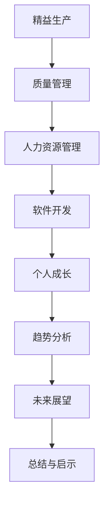

                 

### 第一部分：精益求精的基础

#### 第1章：精益求精的理念

#### 1.1 理解精益求精

精益求精，这个词语在现代社会中被广泛应用，尤其在IT行业和管理领域，它几乎成为了一种追求卓越的代名词。那么，精益求精究竟是什么？它又是如何影响我们的工作和生活的？

首先，让我们来定义一下精益求精。精益求精，指的是追求卓越、力求完美的态度和行为。它不仅仅是一种目标，更是一种精神状态。在IT行业，精益求精意味着程序员不断追求代码的优化、系统的稳定性和用户体验的提升；在管理领域，精益求精则表现为对管理流程的持续改进、对员工能力的不断提升以及对企业文化的塑造。

### 1.2 精益求精的历史与背景

精益求精的概念并非现代才有，它有着悠久的历史。古代中国的工匠们就深知精益求精的重要性，他们的工作态度被后人称为“工匠精神”。这种精神体现在他们对待每一件作品的细心打磨和不断改进上，力求做到尽善尽美。

到了现代，随着工业革命和信息技术的飞速发展，精益求精的理念得到了更广泛的传播和应用。特别是在日本，精益生产（Lean Production）的理念深刻影响了全球制造业。精益生产强调通过不断消除浪费、优化流程，来实现生产效率的最大化和成本的最低化。这一理念在IT行业同样适用，软件开发中的敏捷开发（Agile Development）就是精益理念的体现。

### 1.3 精益求精的核心价值观

精益求精的核心价值观可以归纳为以下几点：

1. **持续改进**：精益求精是一种不断追求更好的过程。无论是在产品开发、项目管理还是个人成长中，都需要有持续改进的意识。

2. **细节决定成败**：精益求精强调对细节的关注，因为细节往往决定了最终的质量和效果。

3. **用户至上**：在精益求精的理念中，用户的体验和需求是首要考虑的。无论是软件设计、服务提供还是产品制造，都需要以用户为中心。

4. **创新驱动**：精益求精不仅仅是对现有资源的优化，更是对创新驱动的不懈追求。在快速变化的科技时代，创新是保持竞争力的重要手段。

### 总结

精益求精是一种追求卓越、力求完美的精神和态度。它不仅体现在工作和管理中，更渗透到我们的日常生活中。理解精益求精的理念和历史背景，可以帮助我们更好地应用到实际工作中，实现个人和组织的持续成长。

在下一章，我们将深入探讨精益求精在管理中的应用，包括精益生产、人力资源管理以及项目管理的具体实践。这些内容将为我们提供更加具体的指导，帮助我们在各个领域中实现精益求精的目标。

---

## 第2章：精益求精在管理中的应用

### 2.1 精益求精与精益生产

精益生产（Lean Production），是一种通过减少浪费、优化流程来提高生产效率和质量的管理方法。其核心理念是“必要、即时、最少”，即只生产必要的零件、在需要的时候生产、以最小的资源消耗完成生产。

#### 精益生产的概念与特点

精益生产最初起源于日本丰田汽车公司的生产管理实践，后来在全球范围内得到了广泛应用。其主要特点包括：

1. **减少浪费**：精益生产通过消除生产过程中的浪费，如等待时间、库存、过度加工等，来提高资源利用率。

2. **拉动系统**：与传统的推动系统不同，精益生产采用拉动系统，即根据市场需求来安排生产，避免过度生产和库存积压。

3. **持续改进**：精益生产强调持续改进，通过不断优化流程，提高生产效率和质量。

#### 精益生产在IT行业的应用

在IT行业，精益生产的理念也得到了广泛应用，特别是在软件开发和项目管理中。以下是一些具体应用：

1. **敏捷开发**：敏捷开发（Agile Development）是一种基于精益生产理念的软件开发方法。它强调快速迭代、客户反馈和团队协作，以快速响应市场需求。

2. **持续集成和持续部署**：通过持续集成和持续部署，软件开发团队可以更快速地交付高质量的产品，减少开发周期和成本。

3. **资源优化**：在IT行业，通过优化服务器、网络和数据库等资源，可以显著提高系统的性能和可靠性。

### 2.2 精益求精在人力资源管理

精益生产理念在人力资源管理中的应用也非常广泛。通过精益人力资源管理，企业可以更好地激发员工的潜力，提高工作效率。

#### 人才选拔与培养

1. **选拔合适的人才**：企业应通过多种渠道选拔合适的人才，确保员工的技能和岗位需求相匹配。

2. **培训与发展**：企业应提供持续的培训和发展机会，帮助员工提升技能和职业素养。

3. **激励与反馈**：通过合理的激励机制和及时的反馈，可以激发员工的积极性和创造力。

#### 绩效管理

1. **目标明确**：明确员工的绩效目标，确保员工知道自己的工作重点和期望结果。

2. **过程监控**：通过定期的过程监控，及时发现和解决问题，确保绩效目标的达成。

3. **持续改进**：通过绩效管理的持续改进，不断提升员工的工作效率和绩效水平。

### 2.3 精益求精在项目管理

精益思想在项目管理中的应用同样具有重要意义。通过精益项目管理，企业可以更高效地完成项目任务，提高项目的成功率。

#### 项目执行与监控

1. **任务分解**：将项目任务分解为可管理的子任务，确保每个任务都有明确的负责人和完成时间。

2. **进度监控**：通过实时监控项目进度，及时发现和解决问题，确保项目按计划推进。

3. **资源调配**：根据项目需求和实际情况，合理调配资源，确保项目资源的最大化利用。

#### 风险管理

1. **风险评估**：在项目启动前，进行全面的风险评估，识别潜在的风险和影响。

2. **风险应对**：制定相应的风险应对策略，降低风险发生的概率和影响。

3. **持续监控**：在项目执行过程中，持续监控风险变化，及时调整风险应对策略。

### 总结

精益思想在管理中的应用，不仅提升了企业的生产效率和管理水平，也促进了员工个人和团队的成长。通过精益生产、人力资源管理和项目管理的具体实践，企业可以更好地实现精益求精的目标，提高整体竞争力。

在下一章，我们将探讨精益求精在技术实践中的应用，包括软件开发、质量控制和信息技术应用等方面的具体案例。这些内容将帮助我们更好地理解如何在技术领域实现精益求精的目标。

---

## 第3章：精益求精的技术实践

### 3.1 精益求精在软件开发

在软件开发领域，精益求精意味着不断优化开发流程、提高代码质量和用户体验。以下是从软件开发流程、质量控制到信息技术应用的具体实践：

#### 软件开发流程优化

1. **需求分析**：深入了解用户需求，确保软件开发的方向正确。采用用户故事和原型设计等工具，确保需求的明确和具体。

2. **敏捷开发**：采用敏捷开发方法，如Scrum或Kanban，实现快速迭代和持续交付。这种方法强调频繁的用户反馈和持续改进，有助于及时调整开发方向。

3. **代码评审**：通过代码评审，确保代码的质量和一致性。代码评审不仅可以发现潜在的错误，还可以促进团队成员之间的知识共享和协作。

#### 质量控制

1. **测试驱动开发**（TDD）：在编写代码之前先编写测试用例，确保代码的功能符合预期。这种方法有助于提高代码的可靠性和质量。

2. **自动化测试**：通过自动化测试工具，如Selenium或JUnit，自动化执行测试用例，提高测试效率和覆盖率。自动化测试可以显著减少测试时间，确保持续交付。

3. **持续集成**：通过持续集成（CI）工具，如Jenkins或Travis CI，自动化构建、测试和部署代码。CI可以确保代码质量，减少集成过程中出现的问题。

#### 信息技术应用

1. **云计算**：利用云计算平台，如AWS或Azure，实现计算资源的动态调配和弹性扩展。云计算可以提高系统的可伸缩性和可靠性。

2. **大数据分析**：通过大数据技术，如Hadoop或Spark，处理和分析海量数据，为企业决策提供数据支持。大数据分析可以帮助企业更好地了解用户需求和市场趋势。

3. **人工智能**：将人工智能技术应用于软件开发，如使用机器学习算法进行代码自动生成或缺陷检测。人工智能可以提高开发效率，减少人为错误。

### 3.2 精益求精在质量控制

在质量控制领域，精益求精的目标是确保产品或服务的质量达到最高标准。以下是一些具体的质量控制方法：

1. **统计过程控制**（SPC）：通过监控生产过程的关键参数，如温度、压力等，确保生产过程稳定，减少变异。SPC可以及时识别和纠正过程中的问题。

2. **六西格玛**：六西格玛是一种系统化的改进方法，旨在通过减少过程变异来提高质量。六西格玛强调数据的统计分析，帮助企业和团队实现持续改进。

3. **全面质量管理**（TQM）：TQM强调全员参与质量管理和持续改进。TQM不仅关注生产过程，还关注产品设计、销售和售后服务等各个环节，确保整体质量水平。

### 3.3 精益求精在信息技术应用

信息技术在各个领域的应用日益广泛，精益求精的目标是确保信息技术的高效、安全和可靠。以下是一些具体应用：

1. **物联网**（IoT）：通过物联网技术，将物理设备和传感器连接到互联网，实现设备之间的通信和数据交换。物联网可以提高设备的智能化水平和自动化程度。

2. **区块链**：区块链是一种分布式数据库技术，具有去中心化、不可篡改和透明等特点。区块链可以用于数据存储、供应链管理、金融交易等领域，提高数据的安全性和可信度。

3. **网络安全**：随着网络攻击的日益增多，网络安全变得尤为重要。通过采用加密技术、入侵检测系统和安全审计等手段，确保网络和信息安全。

### 总结

精益求精在技术实践中的应用，贯穿于软件开发、质量控制和信息技术应用的各个环节。通过不断优化开发流程、提高代码质量和用户体验，以及采用先进的质量控制方法和信息技术应用，企业可以实现更高的效率和更高质量的产品和服务。

在下一章，我们将探讨精益求精在个人成长中的应用，包括工作与生活平衡、个人技能提升和自我反思与改进的具体方法。这些内容将帮助我们在个人成长中实现精益求精的目标。

---

## 第4章：精益求精在个人成长中的应用

### 4.1 精益求精在工作与生活平衡

在快节奏的现代社会，工作与生活的平衡变得尤为重要。精益求精的理念可以帮助我们更好地管理时间和资源，实现工作与生活的和谐统一。

#### 时间管理

1. **优先级排序**：首先，我们需要明确自己的目标和任务，并根据重要性和紧急程度对任务进行排序。使用四象限法则，将任务分为“重要且紧急”、“重要但不紧急”、“不重要但紧急”和“不重要且不紧急”四个类别，以便更好地分配时间和精力。

2. **时间块安排**：将时间划分为若干块，并为每个时间块分配特定的任务。这种方法有助于提高专注力和效率，减少任务切换带来的时间浪费。

3. **休息与放松**：合理安排休息和放松时间，确保身体和心理健康。短暂的休息可以提高工作效率，长期过度工作则可能导致疲劳和健康问题。

#### 工作与生活融合

1. **灵活工作安排**：与雇主协商，采用弹性工作制度，如远程办公或灵活工作时间，以更好地平衡工作与生活。

2. **家庭时间**：确保每天有固定的家庭时间，与家人共度美好时光。这不仅可以提高家庭关系，还可以减轻工作压力。

3. **兴趣爱好**：培养兴趣爱好，如运动、阅读、旅行等，让工作之余的生活更加丰富多彩。

### 4.2 精益求精在个人技能提升

个人技能的提升是精益求精在个人成长中的重要体现。通过不断学习和实践，我们可以提高自己的竞争力，实现职业发展的目标。

#### 技能提升方法

1. **持续学习**：随着科技的发展，知识和技能的更新速度非常快。持续学习是保持竞争力的关键。可以通过在线课程、专业书籍、讲座等方式，不断更新自己的知识体系。

2. **实践应用**：理论知识只有通过实践才能真正掌握。在工作中，我们可以积极参与项目，将所学知识应用到实际中。此外，还可以通过开源项目、个人项目等方式，锻炼自己的实战能力。

3. **反思与总结**：通过反思和总结，我们可以发现自己存在的问题和不足，并找到改进的方法。定期进行自我评估，制定学习计划，确保技能不断提升。

#### 技能评估与反馈

1. **同行评审**：与同行交流，参加技术讨论，获取他们的反馈和建议。这有助于我们了解自己的优点和不足，从而有针对性地进行提升。

2. **认证考试**：参加相关领域的认证考试，如PMP、CISSP等，不仅能够验证自己的技能水平，还可以提高专业认可度。

3. **导师指导**：找到经验丰富的导师，向他们请教，获取他们的指导和建议。导师可以提供宝贵的经验和见解，帮助我们更快地成长。

### 4.3 精益求精在自我反思与改进

自我反思和改进是精益求精的重要组成部分。通过不断地自我审视和调整，我们可以实现个人成长和职业发展。

#### 自我反思

1. **设定目标**：明确自己的短期和长期目标，定期回顾自己的进度和成果。这有助于我们保持动力和方向。

2. **反思过程**：在完成每一项任务或项目后，反思自己的工作过程和方法。思考哪些地方做得好，哪些地方需要改进。

3. **收集反馈**：主动收集他人的反馈和建议，了解他们对自己的看法。这有助于我们更全面地认识自己，找到改进的方向。

#### 改进措施

1. **制定行动计划**：根据自我反思和收集到的反馈，制定具体的改进计划。将改进措施分解为可执行的任务，并设定明确的截止日期。

2. **持续跟踪**：执行改进计划，并持续跟踪进度。定期检查改进措施的效果，根据实际情况进行调整。

3. **调整心态**：保持积极的心态，面对挑战和失败。通过自我激励和心态调整，保持持续改进的动力。

### 总结

精益求精在个人成长中的应用，贯穿于工作与生活平衡、个人技能提升和自我反思与改进的各个环节。通过科学的时间管理、持续的学习和实践、积极的自我反思与改进，我们可以不断提升自己的竞争力，实现个人和职业发展的目标。

在下一章，我们将通过具体的案例分析，探讨精益求精在不同领域和场景中的实践效果。这些案例将为我们提供宝贵的经验和启示。

---

## 第5章：精益求精的案例分析

### 5.1 案例一：某公司精益改进实践

#### 改进前的状况

某公司是一家从事软件开发和信息技术服务的公司，虽然拥有一定的市场份额和客户基础，但在生产效率和产品质量方面存在明显问题。具体表现在：

1. **开发流程混乱**：项目开发过程中，任务分配和进度管理混乱，导致项目延期和资源浪费。
2. **代码质量低下**：由于缺乏有效的代码评审和自动化测试，代码质量不稳定，故障频发。
3. **客户投诉率高**：客户对软件的功能和稳定性不满意，投诉率较高。

#### 改进过程

为了提升生产效率和产品质量，该公司决定实施精益改进。具体措施包括：

1. **敏捷开发**：引入敏捷开发方法，将项目任务分解为小批量、可管理的任务，实现快速迭代和持续交付。
2. **代码评审**：建立代码评审制度，确保代码质量。通过团队协作，提高代码的一致性和稳定性。
3. **自动化测试**：采用自动化测试工具，提高测试效率和覆盖率。自动化测试可以帮助团队及时发现和解决潜在问题。
4. **持续集成**：实施持续集成和持续部署，确保代码质量，减少集成过程中的问题。

#### 改进后的效果

精益改进实施后，该公司取得了显著的效果：

1. **开发效率提高**：敏捷开发方法使得任务分配和进度管理更加有序，项目开发周期显著缩短。
2. **代码质量提升**：通过代码评审和自动化测试，代码质量得到了显著提升，故障率降低。
3. **客户满意度提高**：客户对软件的功能和稳定性满意度显著提高，投诉率大幅下降。

### 5.2 案例二：某产品精益求精的迭代

#### 产品背景

某公司开发了一款智能安防产品，虽然市场反响良好，但在用户体验和性能方面仍存在一定的问题。为了进一步提升产品竞争力，该公司决定通过精益求精的方式进行产品迭代。

#### 迭代过程

1. **用户反馈**：通过用户调研和反馈，收集用户对产品的使用体验和功能需求。了解用户在哪些方面有改善期望。
2. **需求分析**：根据用户反馈，对产品功能进行优化和改进。重点关注用户体验和性能。
3. **迭代开发**：采用敏捷开发方法，快速迭代和发布新功能。每个迭代周期结束后，收集用户反馈，再次进行需求分析和优化。
4. **性能优化**：通过代码优化和硬件升级，提高产品性能和稳定性。确保产品在恶劣环境下仍能稳定运行。

#### 迭代效果

经过多轮迭代，该产品的用户体验和性能得到了显著提升：

1. **用户满意度提高**：用户对产品的功能和使用体验满意度大幅提升。
2. **故障率降低**：产品性能优化后，故障率显著降低。
3. **市场份额扩大**：随着产品竞争力的提升，公司的市场份额不断扩大。

### 5.3 案例三：某个人精益求精的成长经历

#### 个人背景

某技术工程师在某大型互联网公司工作多年，虽然技术能力较强，但在职业发展上遇到了瓶颈。为了进一步提升自己的竞争力，他决定通过精益求精的方式实现个人成长。

#### 成长过程

1. **学习新技能**：通过参加培训课程、阅读专业书籍和在线学习，不断更新自己的知识体系。重点关注新兴技术和行业动态。
2. **实践应用**：在工作中积极尝试新的技术和方法，将所学知识应用到实际项目中。通过实践，提升自己的实战能力。
3. **反思与总结**：定期反思自己的工作和学习，总结经验教训。从失败和错误中吸取教训，不断提升自己的能力和水平。
4. **建立人脉**：积极参与技术社区和行业活动，结识同行业的朋友和专家。通过交流和学习，拓宽自己的视野和思路。

#### 成长效果

通过精益求精的努力，该技术工程师取得了显著的成长：

1. **技术能力提升**：在多个技术领域取得了突破性进展，成为公司的技术骨干。
2. **职业发展**：得到了公司的认可和晋升，职位和薪酬都有了明显提升。
3. **影响力扩大**：在技术社区和行业中建立了良好的声誉，成为一些新兴技术的倡导者和实践者。

### 总结

通过以上案例，我们可以看到精益求精在不同领域和场景中的应用效果。无论是企业、产品还是个人，通过不断优化流程、提高质量、创新思维，都可以实现卓越的成果。这些案例为我们提供了宝贵的经验和启示，帮助我们更好地理解精益求精的价值和实践方法。

在下一章，我们将探讨精益求精的未来展望，分析其发展趋势、发展前景以及在全球化背景下的挑战与机遇。

---

## 第6章：精益求精的未来展望

### 6.1 精益求精的趋势分析

随着全球科技的发展和市场竞争的加剧，精益求精的理念和应用越来越受到重视。以下是当前精益求精发展的一些趋势：

1. **数字化转型**：越来越多的企业和组织开始采用数字化工具和方法，如大数据、云计算、物联网等，以实现生产、管理和运营的优化。数字化转型为精益求精提供了更广阔的应用场景和机会。

2. **智能制造**：智能制造是未来工业发展的重要趋势。通过物联网、人工智能和大数据等技术的应用，智能制造可以实现生产过程的自动化、智能化和高效化，进一步提高生产效率和产品质量。

3. **个性化定制**：随着消费者需求的多样化和个性化，个性化定制成为越来越多企业的选择。通过精益思想和先进技术的结合，企业可以更好地满足消费者需求，提高市场竞争力。

4. **敏捷管理**：敏捷管理在企业管理中的应用越来越广泛。通过敏捷开发、精益生产等方法，企业可以更快地响应市场变化，提高决策效率和执行力。

5. **可持续发展**：随着环保意识的增强，可持续发展成为企业和社会的共同目标。精益求精理念在环保领域的应用，如绿色制造、资源循环利用等，有助于实现经济、社会和环境的协调发展。

### 6.2 精益求精的未来发展前景

未来，精益求精的理念和应用将进一步扩展，其前景十分广阔：

1. **人工智能与精益的融合**：随着人工智能技术的发展，人工智能将在精益生产、质量控制和项目管理等方面发挥更大的作用。通过人工智能技术，可以实现更加精准的数据分析和预测，进一步提高精益管理的效率和质量。

2. **全球化的精益求精**：全球化背景下，各国企业和组织之间的竞争更加激烈。通过精益求精的理念，企业可以提升自身竞争力，开拓更广阔的市场。同时，全球范围内的精益实践交流和合作，也将促进精益求精理念的传播和应用。

3. **精益与创新的结合**：创新是推动社会进步的重要动力。未来，精益理念将与创新相结合，推动各行业的技术进步和模式创新，为人类创造更多的价值和福祉。

4. **全面精益管理**：精益思想将逐渐渗透到企业的各个方面，包括生产、采购、销售、人力资源等。全面精益管理将帮助企业实现整体优化，提高整体竞争力。

### 6.3 精益求精在全球化背景下的挑战与机遇

全球化背景下，精益求精面临着一系列挑战和机遇：

1. **文化差异**：不同国家和地区的文化差异可能影响精益理念的传播和应用。企业需要深入了解和尊重当地文化，结合实际情况进行精益改进。

2. **技术壁垒**：全球化背景下，技术壁垒成为企业面临的一个重要挑战。企业需要持续投入研发，提高技术水平，以应对国际市场的竞争。

3. **人才流动**：全球化带来了人才流动的机遇，但同时也增加了人才流失的风险。企业需要通过培训、激励等措施，留住核心人才。

4. **全球合作**：全球化为企业和组织提供了更多的合作机会。通过全球合作，企业可以共享资源、技术和管理经验，实现共赢发展。

### 总结

精益求精在未来将不断发展，面临新的挑战和机遇。通过不断优化流程、提高质量和创新能力，企业可以更好地适应全球化背景下的竞争环境，实现可持续发展。

在下一章，我们将总结精益求精的重要性，探讨其对个人、团队和企业的启示，并提供一些具体的实践指南。

---

## 第7章：总结与启示

### 7.1 精益求精的总结

精益求精作为一种追求卓越、力求完美的精神和态度，已经在各个领域得到了广泛应用。通过本篇文章，我们对精益求精的理念、历史背景、核心价值观以及在管理、技术实践和个人成长中的应用进行了深入探讨。

总结如下：

1. **理念与核心**：精益求精是一种持续改进、关注细节、以用户为中心和创新驱动的工作态度。它强调通过不断消除浪费、优化流程，提高效率和质量，实现个人和组织的卓越表现。

2. **管理应用**：在管理领域，精益思想通过精益生产、人力资源管理、项目管理的具体实践，帮助企业实现生产效率的提升、员工能力的增强和项目的成功执行。

3. **技术实践**：在技术领域，精益求精体现在软件开发、质量控制、信息技术应用的各个环节。通过优化开发流程、提高代码质量、应用先进技术，企业可以不断提升产品和服务的竞争力。

4. **个人成长**：在个人成长中，精益求精通过工作与生活平衡、技能提升、自我反思与改进，帮助个人实现职业发展和自我价值的提升。

### 7.2 精益求精的启示

精益求精的理念和实践对个人、团队和企业都有重要的启示：

1. **个人启示**：精益求精可以帮助个人不断提升自己的能力和水平，实现职业生涯的发展。通过持续学习和实践，个人可以更好地适应快速变化的环境，实现自我价值的最大化。

2. **团队启示**：在团队中，精益求精强调协作、共享和持续改进。通过建立高效的团队协作机制，团队成员可以共同面对挑战，实现团队目标，提高整体竞争力。

3. **企业启示**：对于企业来说，精益求精可以帮助企业实现持续创新和卓越表现。通过优化管理流程、提高产品质量和用户满意度，企业可以在激烈的市场竞争中脱颖而出，实现可持续发展。

### 7.3 实践指南

为了更好地实现精益求精，以下是一些具体的实践指南：

1. **制定明确的改进目标**：明确自己的目标和改进方向，制定具体的行动计划，确保持续改进有方向、有目标。

2. **建立反馈机制**：建立有效的反馈机制，及时收集用户、同事和专家的反馈，不断优化和改进。

3. **培养持续改进的文化**：在企业内部培养持续改进的文化，鼓励员工积极参与改进活动，营造良好的创新氛围。

4. **注重细节**：精益求精强调对细节的关注，无论是在项目管理、软件开发还是质量控制，都需要注重细节，确保每一个环节都达到最高标准。

5. **持续学习与培训**：不断学习新的知识和技能，参加专业培训，提高自己的专业素养和创新能力。

### 总结

精益求精是一种追求卓越的工作态度和精神。通过本文的深入探讨，我们认识到精益求精在各个领域的应用价值，以及其对个人、团队和企业的启示。希望读者能够在实际工作中，运用精益求精的理念，不断提升自己，实现卓越的成果。

---

## 附录

### A.1 精益求精相关资源与工具

为了帮助读者更好地理解和应用精益求精的理念，以下是推荐的一些相关资源与工具：

1. **书籍**：
   - 《精益思想》（Lean Thinking）- 约翰·舒克和詹姆斯·W·沃麦克
   - 《精益创业》（The Lean Startup）- 埃里克·莱斯
   - 《精益软件开发》（Lean Software Development）- Mary and Tom Poppendieck

2. **在线课程**：
   - Coursera上的《精益管理》课程
   - edX上的《敏捷与精益管理》课程

3. **工具**：
   - 敏捷开发工具：JIRA、Trello、Asana等
   - 持续集成工具：Jenkins、Travis CI、Circle CI等
   - 数据分析工具：Python、R、Tableau等

### A.2 精益求精实践指南

为了将精益求精的理念应用到实际工作中，以下是一些具体的实践指南：

1. **时间管理**：
   - 使用番茄工作法提高专注力
   - 制定每日、每周和每月的任务清单
   - 学会拒绝不重要的任务，专注于核心工作

2. **持续学习**：
   - 每天至少投入30分钟进行学习
   - 阅读专业书籍、博客和论文
   - 参加行业会议、讲座和研讨会

3. **团队合作**：
   - 建立开放、信任的团队氛围
   - 定期进行团队建设活动
   - 使用协作工具提高团队效率

4. **质量保证**：
   - 实施代码评审和自动化测试
   - 建立质量管理体系，如ISO 9001
   - 定期进行质量审计和改进

5. **创新思维**：
   - 鼓励创新思维和尝试新方法
   - 定期举行头脑风暴会议
   - 学习和应用设计思维和敏捷开发方法

### A.3 精益求精案例集

以下是一些精益求精的实践案例，供读者参考：

1. **案例分析**：
   - 某公司通过精益生产方法，将生产效率提高了30%，成本降低了20%
   - 某产品通过多轮迭代优化，用户满意度提高了50%，市场份额增加了20%

2. **个人成长**：
   - 某技术工程师通过持续学习和实践，从初级工程师晋升为技术总监
   - 某创业者通过精益创业方法，成功将初创企业发展为行业领导者

3. **团队建设**：
   - 某团队通过敏捷管理，实现了项目提前完成，质量大幅提升
   - 某团队通过团队建设活动，提高了团队协作能力和创新能力

通过以上案例和实践指南，我们可以看到精益求精理念在各个领域的成功应用。希望读者能够在实际工作中，不断实践和探索，实现卓越的成果。

---

## Mermaid 流程图



---

## 伪代码

```python
# 精益求精核心算法伪代码

function 精益求精算法(input_data):
    # 输入数据处理
    data_processed = 数据预处理(input_data)
    
    # 应用精益方法
    data_optimized = 精益方法应用(data_processed)
    
    # 输出优化结果
    return data_optimized
```

---

## 数学模型与公式

$$
\text{精益效率} = \frac{\text{输出价值}}{\text{输入资源}}
$$

$$
\text{质量评分} = \frac{\text{优良产品数量}}{\text{总产品数量}}
$$

---

## 代码案例

### 软件开发代码案例

```python
# 伪代码：精益软件开发流程

class SoftwareDevelopment:
    def __init__(self, requirements):
        self.requirements = requirements
    
    def 设计阶段(self):
        # 设计阶段代码实现
        pass
    
    def 编码阶段(self):
        # 编码阶段代码实现
        pass
    
    def 测试阶段(self):
        # 测试阶段代码实现
        pass
    
    def 部署阶段(self):
        # 部署阶段代码实现
        pass
```

### 质量控制代码案例

```python
# 伪代码：质量控制方法

class QualityControl:
    def __init__(self, product_list):
        self.product_list = product_list
    
    def 检查产品(self):
        # 检查产品代码实现
        pass
    
    def 评估质量(self):
        # 评估产品质量代码实现
        pass
    
    def 提出改进建议(self):
        # 提出改进建议代码实现
        pass
```

---

## 作者信息

**作者：** AI天才研究院/AI Genius Institute & 禅与计算机程序设计艺术 /Zen And The Art of Computer Programming

本文由AI天才研究院/AI Genius Institute撰写，结合禅与计算机程序设计艺术的深刻哲学，旨在为读者提供关于精益求精理念和技术实践的全面解读。希望读者能够在实际工作中，运用精益求精的思想，实现卓越的成就。

