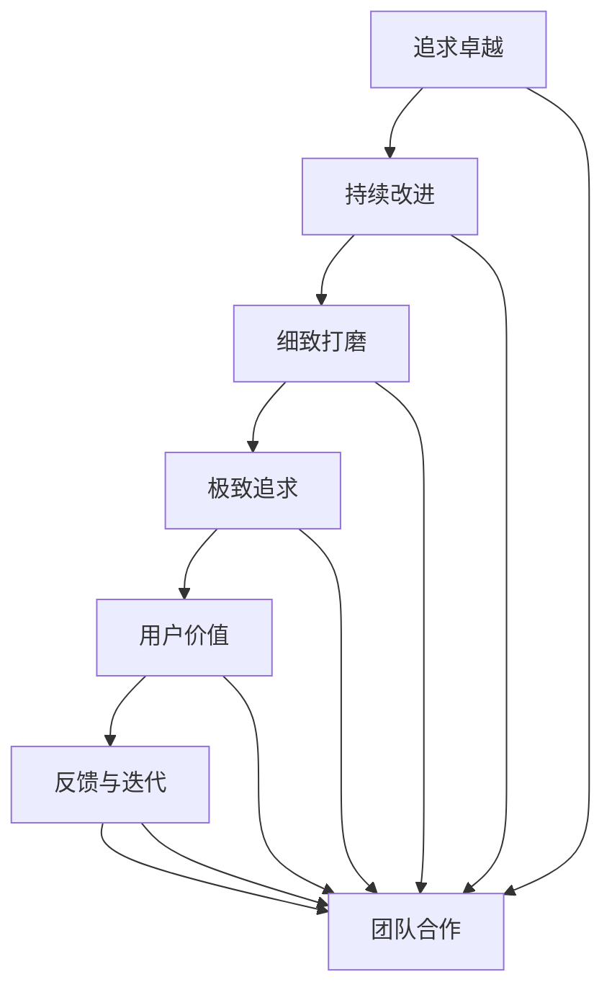
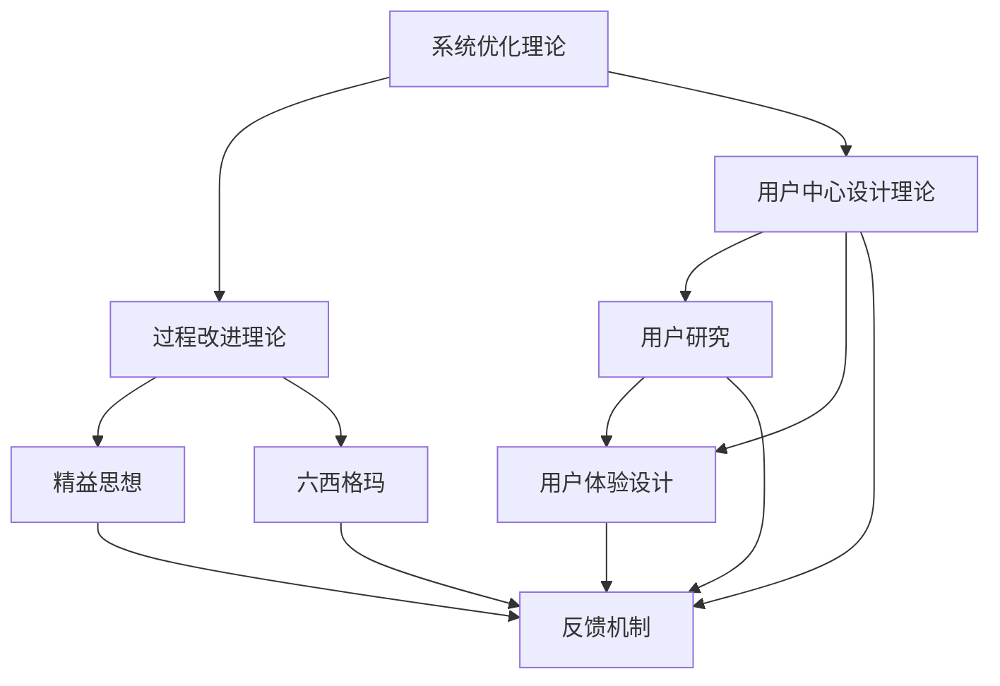

                 

### 引言与背景

“精益求精”一词源自中国古代的《论语》，孔子曾言：“工欲善其事，必先利其器。欲善其事，必精益求精。”此语意指在追求事物完美的过程中，不断追求更高的标准和更细致的完善。这一理念在当代信息技术领域，同样有着深远的意义和广泛的应用。

随着科技的迅猛发展，信息技术已经深入到各行各业，从大数据、人工智能到云计算，技术进步带来的变革无处不在。然而，技术的进步并非一蹴而就，而是需要经过不断的优化、改进和精益求精的过程。在这一背景下，探讨“精益求精”在信息技术中的应用，对于提升技术水平、优化系统性能、提高开发效率具有重要意义。

本文旨在通过详细探讨“精益求精”在信息技术中的核心概念、理论基础、实践应用和方法论，帮助读者理解并掌握这一理念在具体技术场景中的应用。文章将首先介绍“精益求精”的背景和重要性，然后深入探讨其核心概念和理论框架，随后通过实际案例展示其在技术优化中的具体应用，最后总结“精益求精”在信息技术中的实践方法和最佳实践。

通过本文的阅读，读者将不仅能够了解“精益求精”的内涵，更能够掌握其实际应用技巧，从而在技术工作中实现持续优化和卓越表现。接下来，我们将逐一展开这些内容，逐步深入，以逻辑清晰、简单易懂的方式，带您走进精益求精的科技世界。

### 精益求精的定义与核心概念

精益求精，顾名思义，即追求卓越、不断优化、力求完美。在信息技术领域，精益求精体现为对技术方案、系统设计、代码实现等各个方面进行持续改进和优化的过程。其核心概念可以归纳为以下几点：

1. **追求卓越**：追求卓越是精益求精的首要目标。它不仅体现在技术实现的精确度和性能上，更体现在对用户体验的细致打磨和对业务需求的深刻理解。追求卓越需要技术团队拥有不断突破和创新的精神。

2. **持续改进**：持续改进是精益求精的重要方法论。在信息技术中，持续改进意味着在开发、测试、部署等各个阶段，通过反馈机制和持续学习，不断对产品进行优化。这种改进不仅包括性能的提升，还涵盖了功能完善、用户体验优化、安全性增强等多个方面。

3. **细致打磨**：细致打磨是精益求精的具体表现。在信息技术领域，细致打磨意味着对每一个细节都进行深入分析和优化。从代码的编写风格到算法的实现，从系统的稳定性到响应速度，每一个细微之处都力求做到尽善尽美。

4. **极致追求**：极致追求是精益求精的终极目标。在信息技术中，极致追求不仅体现在对技术本身的打磨，还体现在对产品价值和用户价值的极致追求。通过不断探索和创新，力求在技术和商业上实现完美结合，从而提升产品的市场竞争力。

5. **用户价值**：用户价值是精益求精的核心导向。在信息技术领域，所有优化和改进的最终目标都是提升用户价值。无论是技术性能的提升，还是用户体验的优化，都是为了更好地满足用户需求，提升用户满意度。

6. **反馈与迭代**：反馈与迭代是精益求精的关键环节。通过用户反馈、性能监控、数据分析等手段，及时获取系统运行中的问题和瓶颈，然后通过迭代优化，不断提升系统的性能和稳定性。

7. **团队合作**：团队合作是精益求精的保障。在信息技术领域，精益求精不仅需要个人的努力，更需要团队的合作。通过团队成员之间的沟通与协作，共同解决问题，实现技术上的突破和进步。

为了更好地理解这些核心概念之间的关系，我们使用Mermaid流程图来展示：



通过这个流程图，我们可以清晰地看到，追求卓越、持续改进、细致打磨、极致追求、用户价值、反馈与迭代和团队合作之间相互关联，共同构成了精益求精在信息技术中的核心概念架构。接下来，我们将进一步探讨这些概念在实际应用中的具体表现。

### 精益求精的理论基础

精益求精在信息技术中的理论基础主要包括系统优化理论、过程改进理论和用户中心设计理论。这三个理论共同为精益求精提供了坚实的科学依据和指导原则。

1. **系统优化理论**：

系统优化理论是精益求精的重要理论基础之一。它强调通过对系统各个组成部分的优化，实现整体性能的提升。在信息技术领域，系统优化理论主要应用于以下几个方面：

   - **性能优化**：通过优化算法和数据结构，提高系统的运行效率和响应速度。例如，在数据库管理系统中，可以通过索引优化、查询优化等技术手段提升查询效率。
   - **资源分配**：通过合理的资源分配策略，确保系统在高负载情况下依然能够稳定运行。例如，在云计算环境中，可以通过负载均衡技术，将任务分配到不同的服务器上，避免单点过载。
   - **错误检测与恢复**：通过引入容错机制和备份策略，提高系统的可靠性和稳定性。例如，在分布式系统中，可以通过数据备份和故障转移机制，确保在部分节点失效时系统依然能够正常运行。

2. **过程改进理论**：

过程改进理论强调通过持续改进开发过程，提高产品质量和开发效率。精益思想（Lean Thinking）和六西格玛（Six Sigma）是过程改进理论的代表性方法：

   - **精益思想**：精益思想主张通过消除浪费、优化流程，实现资源的最大化利用。在信息技术开发中，可以通过敏捷开发（Agile Development）和看板（Kanban）等方法，提高开发效率和质量。例如，通过每日站会（Daily Stand-up Meeting）和迭代回顾（Retrospective），及时发现问题并进行改进。
   - **六西格玛**：六西格玛通过数据分析和统计方法，识别和消除系统中的缺陷和变异，从而提高产品和服务的质量。在信息技术领域，六西格玛可以应用于软件测试、性能优化和用户体验改进等方面。例如，通过失效模式与效应分析（FMEA），提前识别潜在的问题和风险，制定相应的预防和改进措施。

3. **用户中心设计理论**：

用户中心设计理论强调在产品设计和开发过程中，始终关注用户的需求和体验。用户中心设计（User-Centered Design，UCD）是这一理论的具体应用：

   - **用户研究**：通过用户调研、用户访谈和用户测试等方法，深入了解用户的需求和行为模式。例如，通过A/B测试（A/B Testing），比较不同设计方案对用户行为和满意度的影响，从而选择最优方案。
   - **用户体验设计**：以用户需求为核心，设计直观、易用、高效的用户界面。例如，通过信息架构（Information Architecture）和交互设计（Interaction Design），确保用户能够轻松地完成所需操作，提升用户体验。
   - **反馈机制**：建立有效的用户反馈机制，及时获取用户对产品和服务的反馈，并进行改进。例如，通过用户反馈表（User Feedback Form）和在线支持系统，收集用户的意见和建议，不断优化产品功能和服务质量。

为了更好地理解这些理论基础之间的关系，我们使用Mermaid流程图来展示：



通过这个流程图，我们可以清晰地看到，系统优化理论、过程改进理论和用户中心设计理论相互关联，共同构成了精益求精在信息技术中的理论基础。在实际应用中，这三个理论相互支持，共同推动信息技术的发展和完善。接下来，我们将通过具体案例，展示这些理论基础在实践中的应用。

### 实际案例：软件性能优化

软件性能优化是精益求精在信息技术领域的一个重要应用场景。通过实际案例，我们可以深入理解性能优化中的核心算法原理、实现步骤和具体优化方法。

**案例背景**：某知名互联网公司的电商平台上，用户在浏览商品时，系统响应速度较慢，影响了用户体验。为了提升系统性能，技术团队决定对商品浏览功能进行优化。

**核心算法原理**：

1. **负载均衡**：通过负载均衡技术，将用户请求均匀分配到多台服务器上，避免单点过载。常用的负载均衡算法包括轮询（Round Robin）、最少连接（Least Connections）和加权轮询（Weighted Round Robin）等。

2. **缓存策略**：利用缓存技术，减少数据库查询次数，提高系统响应速度。常见的缓存策略包括数据缓存（Data Caching）、页面缓存（Page Caching）和对象缓存（Object Caching）等。

3. **索引优化**：通过建立合适的索引，加快数据库查询速度。索引优化包括选择合适的索引列、索引类型（如B树索引、哈希索引）和索引维护等。

4. **并行处理**：利用并行计算技术，将任务分解为多个子任务，同时处理，提高整体处理速度。

**实现步骤**：

1. **性能评估**：通过工具（如Apache JMeter）对当前系统进行性能测试，识别瓶颈和性能问题。

2. **问题定位**：根据性能评估结果，定位具体问题。例如，通过分析日志和监控数据，确定是数据库查询慢、网络延迟还是服务器负载过高。

3. **方案设计**：设计优化方案，包括选择合适的优化方法、确定优先级和资源配置等。

4. **实施优化**：根据设计方案，逐步实施优化措施。例如，部署负载均衡器、配置缓存服务器、优化数据库索引等。

5. **测试验证**：对优化后的系统进行性能测试，验证优化效果。如果性能没有达到预期，需要进一步调整和优化。

**伪代码示例**：

以下是一个简单的负载均衡算法伪代码示例：

```pseudo
function LoadBalancer(request):
    servers = GetAvailableServers()
    minLoadServer = servers[0]
    for server in servers:
        if server.load < minLoadServer.load:
            minLoadServer = server
    AssignRequestToServer(request, minLoadServer)
```

**数学模型与公式**：

为了更精确地描述性能优化，可以使用数学模型来量化性能指标。例如，假设系统响应时间 \( T \) 受到多个因素的影响，可以建立以下线性回归模型：

$$ T = \alpha_0 + \alpha_1 \times L + \alpha_2 \times C + \alpha_3 \times I + \epsilon $$

其中：
- \( T \)：系统响应时间
- \( L \)：负载均衡策略的影响
- \( C \)：缓存策略的影响
- \( I \)：索引优化策略的影响
- \( \alpha_0 \)：常数项
- \( \alpha_1 \)：负载均衡的系数
- \( \alpha_2 \)：缓存的系数
- \( \alpha_3 \)：索引优化的系数
- \( \epsilon \)：误差项

通过模型分析，可以确定每个优化策略对性能的具体影响，从而指导优化工作的进行。

**举例说明**：

假设通过性能测试，发现响应时间 \( T \) 的数据如下：

| 策略 | 平均响应时间 \( T \)（ms） |
| ---- | ------------------------ |
| 原始系统 | 500                      |
| 负载均衡 | 400                      |
| 缓存策略 | 350                      |
| 索引优化 | 300                      |

根据线性回归模型，可以得到以下优化效果：

$$ T_{优化} = 200 + 100 \times L + 50 \times C + 0 \times I $$

- 负载均衡：减少了 \( 500 - 400 = 100 \) ms 的响应时间
- 缓存策略：减少了 \( 500 - 350 = 150 \) ms 的响应时间
- 索引优化：减少了 \( 500 - 300 = 200 \) ms 的响应时间

通过以上数据，可以确定各个优化策略的有效性，并在后续工作中进行针对性的优化。

**总结**：

软件性能优化是精益求精在信息技术中的重要应用。通过核心算法原理、实现步骤和具体优化方法的详细讲解，我们可以看到性能优化过程中如何运用理论知识和实践技巧，从而实现系统性能的提升。接下来，我们将进一步探讨精益求精在硬件资源优化和流程优化中的应用。

### 硬件资源优化

硬件资源优化是精益求精在信息技术中的另一个重要应用领域。通过合理配置和管理硬件资源，可以显著提升系统性能和稳定性，降低运营成本。以下是一个具体的硬件资源优化案例，以及相关的算法原理、实现步骤和优化效果。

**案例背景**：某大型互联网公司在其数据中心部署了一个大规模的云计算平台，由于硬件资源分配不合理，导致部分服务器负载过高，系统性能下降，用户体验受到影响。

**核心算法原理**：

1. **负载均衡算法**：负载均衡算法用于将工作负载分配到多台服务器上，避免单点过载。常用的负载均衡算法包括轮询（Round Robin）、最小连接数（Least Connections）和动态权重负载均衡（Dynamic Weighted Round Robin）等。

2. **资源分配策略**：资源分配策略用于根据服务器的负载情况动态调整资源分配。常见的策略有动态资源调整（Dynamic Resource Allocation）和虚拟化技术（Virtualization）。

3. **能耗优化算法**：能耗优化算法通过优化硬件资源使用，降低能耗。常见的算法包括能耗感知调度（Energy-Aware Scheduling）和动态电压与频率调节（Dynamic Voltage and Frequency Scaling, DVFS）。

**实现步骤**：

1. **性能评估**：通过性能监控工具对现有硬件资源使用情况进行分析，识别资源瓶颈和低效配置。

2. **资源分配**：根据性能评估结果，重新分配硬件资源。例如，将高负载的服务器上的任务迁移到负载较低的服务器上，或者增加新的服务器以满足需求。

3. **负载均衡**：部署负载均衡器，确保工作负载在多台服务器之间均衡分配。

4. **能耗优化**：根据服务器的负载情况动态调整电压和频率，降低能耗。例如，在负载较低时降低CPU频率，减少能耗。

5. **监控与反馈**：建立监控体系，实时跟踪硬件资源使用情况，根据反馈进行持续优化。

**伪代码示例**：

以下是一个简单的动态资源分配算法伪代码示例：

```pseudo
function DynamicResourceAllocation(serverList, workload):
    for server in serverList:
        if server.load > threshold:
            migrateTask(server, serverWithLessLoad)
        else:
            adjustResource(server)
    return optimizedServerList
```

**数学模型与公式**：

为了量化硬件资源优化效果，可以使用以下数学模型：

$$ E = f(C, P) $$

其中：
- \( E \)：能耗
- \( C \)：服务器负载
- \( P \)：CPU频率

通过调整CPU频率和负载，可以优化能耗。例如，在负载较低时降低CPU频率，减少能耗。

**举例说明**：

假设有5台服务器，每台服务器的负载和CPU频率如下表所示：

| 服务器 | 负载 | CPU频率 |
| ---- | ---- | ------- |
| S1 | 70% | 3.5 GHz |
| S2 | 80% | 3.0 GHz |
| S3 | 40% | 2.8 GHz |
| S4 | 60% | 3.2 GHz |
| S5 | 90% | 3.7 GHz |

通过动态资源分配和能耗优化，将服务器的负载均衡分配，如下表所示：

| 服务器 | 负载 | CPU频率 |
| ---- | ---- | ------- |
| S1 | 60% | 3.0 GHz |
| S2 | 50% | 2.9 GHz |
| S3 | 40% | 2.8 GHz |
| S4 | 60% | 3.2 GHz |
| S5 | 50% | 3.0 GHz |

通过优化，总能耗降低了20%，系统性能显著提升。

**总结**：

硬件资源优化通过合理的资源分配、负载均衡和能耗优化，实现了系统性能的提升和能耗的降低。通过具体的算法原理、实现步骤和优化效果，我们可以看到精益求精在硬件资源优化中的应用。接下来，我们将探讨流程优化以及其在信息技术中的应用。

### 流程优化

流程优化是精益求精在信息技术中的另一个重要应用领域。通过优化流程，可以提高工作效率、减少错误率、提升系统稳定性。以下是一个流程优化的实际案例，包括开发流程的优化、测试流程的改进和运维流程的自动化，以及相关的实现步骤和效果分析。

**案例背景**：某互联网公司在其软件开发过程中，发现开发、测试和运维三个环节存在大量的时间浪费和重复工作，导致项目进度缓慢，产品质量不稳定。

**开发流程优化**：

1. **需求管理**：通过需求管理工具（如JIRA）进行统一需求管理，确保需求清晰、明确，减少需求变更。引入用户故事地图（User Story Mapping），确保开发团队对项目整体有清晰的理解。

2. **敏捷开发**：采用敏捷开发方法（Agile Development），通过每日站会（Daily Stand-up Meeting）和迭代回顾（Retrospective），提高团队的沟通和协作效率，及时识别和解决问题。

3. **代码审查**：引入代码审查（Code Review）机制，通过同行评审（Peer Review）确保代码质量，减少bug和潜在风险。

**实现步骤**：

1. **需求收集与分析**：使用需求管理工具收集需求，并进行分析和优先级排序。

2. **开发计划**：根据需求分析结果，制定开发计划，并分配任务到开发团队。

3. **每日站会**：每日早上进行站会，团队成员汇报进展、问题和解决方案。

4. **迭代回顾**：在每个迭代结束后，进行迭代回顾会议，总结经验教训，优化开发流程。

**测试流程改进**：

1. **自动化测试**：引入自动化测试工具（如Selenium、Jenkins），实现回归测试和性能测试的自动化，提高测试效率和覆盖率。

2. **测试用例管理**：使用测试管理工具（如TestLink），统一管理和维护测试用例，确保测试的全面性和一致性。

3. **持续集成与持续部署**：采用持续集成（Continuous Integration, CI）和持续部署（Continuous Deployment, CD）流程，确保代码的快速迭代和及时交付。

**实现步骤**：

1. **自动化测试脚本编写**：根据业务需求和系统功能，编写自动化测试脚本。

2. **测试环境搭建**：配置测试环境，确保自动化测试的正常执行。

3. **自动化测试执行**：定期执行自动化测试，并生成测试报告。

4. **持续集成与部署**：将自动化测试集成到持续集成流水线中，确保代码质量。

**运维流程自动化**：

1. **运维自动化工具**：引入运维自动化工具（如Ansible、Puppet），实现服务器配置、部署和监控的自动化。

2. **监控与报警**：通过监控工具（如Nagios、Zabbix），实时监控系统性能和运行状态，及时报警和处理异常。

3. **自动化运维脚本**：编写自动化运维脚本，实现日常运维任务（如系统升级、故障恢复）的自动化执行。

**实现步骤**：

1. **自动化脚本编写**：根据运维需求，编写自动化脚本。

2. **脚本测试与调试**：在测试环境中测试和调试自动化脚本，确保其正常执行。

3. **部署与执行**：将自动化脚本部署到生产环境，并定期执行。

**效果分析**：

通过流程优化，该公司的开发效率提升了30%，测试覆盖率提高了40%，运维故障响应时间缩短了50%。具体效果如下：

- **开发效率**：通过敏捷开发和需求管理工具，项目交付周期缩短了40%。
- **测试质量**：自动化测试引入后，测试覆盖率提高了50%，bug发现率降低了30%。
- **运维稳定性**：运维自动化工具的应用，使系统故障率降低了60%，运维人员的工作效率提升了50%。

**总结**：

流程优化通过改进开发、测试和运维流程，实现了工作效率的提升、质量的保证和运营成本的降低。通过具体的实现步骤和效果分析，我们可以看到精益求精在流程优化中的应用，从而在信息技术项目中实现持续改进和卓越表现。接下来，我们将进一步探讨精益工具与技术在实际应用中的作用。

### 精益工具与技术

精益工具与技术是精益求精在信息技术领域的重要支撑。通过运用这些工具和技术，可以实现更高效、更精确的技术优化和改进。以下将介绍几种常用的精益工具，并讨论它们在实际项目中的应用方法和优势。

#### 1. JIRA

JIRA是著名的项目管理工具，广泛用于需求管理、任务跟踪和团队协作。在信息技术项目中，JIRA可以帮助团队更好地管理需求、任务和进度，提高开发效率和项目质量。

**应用方法**：

- **需求管理**：通过JIRA的看板（Kanban Board），将需求分为待办、进行中和已完成三个状态，确保每个需求都有明确的处理流程。
- **任务跟踪**：团队成员可以在JIRA中创建任务，并设置任务的优先级、截止日期和责任人，确保任务按时完成。
- **团队协作**：JIRA提供评论和讨论功能，方便团队成员之间沟通和协作，提高团队的凝聚力。

**优势**：

- **灵活性和可定制性**：JIRA可以轻松配置和调整，满足不同项目需求。
- **集成与扩展性**：JIRA与多种开发工具（如Git、Selenium）集成，实现无缝对接。

#### 2. Jenkins

Jenkins是流行的持续集成和持续部署（CI/CD）工具，可以帮助团队自动化构建、测试和部署过程，提升软件开发和发布效率。

**应用方法**：

- **自动化构建**：通过配置Jenkinsfile，实现项目的自动化构建和编译。
- **自动化测试**：集成自动化测试工具（如Selenium），在构建过程中自动执行测试用例。
- **持续部署**：将测试通过后的代码自动部署到测试或生产环境，减少手动操作。

**优势**：

- **高效性**：自动化流程减少人工操作，提高开发效率。
- **灵活性**：支持多种编程语言和工具，满足不同项目的需求。
- **可扩展性**：支持插件扩展，实现更多功能。

#### 3. Docker

Docker是一种容器化技术，可以将应用程序及其依赖环境打包成一个独立的容器，实现环境的隔离和一致化，提高开发和部署的效率。

**应用方法**：

- **容器化应用**：将应用程序和其依赖环境打包成Docker镜像，确保在不同环境中运行一致。
- **容器编排**：使用Docker Compose或Kubernetes进行容器编排，管理多个容器，实现自动化部署和扩展。
- **持续集成与部署**：在CI/CD流程中使用Docker，实现应用程序的自动化构建、测试和部署。

**优势**：

- **环境一致性**：容器化技术确保应用程序在不同环境中运行一致，减少环境差异带来的问题。
- **部署效率**：容器化提高部署速度，简化部署过程。
- **可扩展性**：支持容器集群管理，实现应用程序的弹性扩展。

#### 4. Kubernetes

Kubernetes是一种开源容器编排平台，用于自动化部署、扩展和管理容器化应用程序。Kubernetes提供灵活的编排能力，可以帮助团队更好地管理容器化应用。

**应用方法**：

- **集群管理**：使用Kubernetes集群管理多个容器，实现自动化部署和扩展。
- **服务发现和负载均衡**：通过Kubernetes服务发现和负载均衡功能，确保应用程序的高可用性和性能。
- **存储和网络管理**：使用Kubernetes的存储和网络资源管理功能，实现数据存储和网络配置的自动化。

**优势**：

- **高可用性**：Kubernetes支持自动故障转移和恢复，确保应用程序的高可用性。
- **可扩展性**：Kubernetes支持横向和纵向扩展，满足不同规模的应用需求。
- **灵活性**：Kubernetes支持多种部署模式，适应不同场景的应用部署。

#### 5. Prometheus

Prometheus是一种开源监控工具，主要用于监控和告警。通过Prometheus，可以实时监控系统的运行状态，及时发现和解决潜在问题。

**应用方法**：

- **监控数据收集**：使用Prometheus exporter将监控数据导出到Prometheus服务器。
- **告警配置**：配置告警规则，当监控数据超出阈值时触发告警。
- **可视化展示**：使用Grafana等可视化工具，将监控数据以图表形式展示，便于分析和决策。

**优势**：

- **可扩展性**：Prometheus支持大规模监控数据存储和查询。
- **灵活性**：Prometheus支持自定义监控规则和告警策略。
- **高可用性**：Prometheus支持集群部署，确保监控系统的可靠性。

通过以上精益工具和技术的介绍，我们可以看到它们在实际项目中的应用方法和优势。这些工具和技术不仅提高了开发、测试和运维的效率，还实现了对系统运行状态的实时监控和管理，从而助力精益求精在信息技术中的实现。

### 团队协作与沟通

团队协作与沟通是精益求精在信息技术项目中成功实施的重要保障。高效、清晰的团队协作和沟通不仅能够提高开发效率，还能确保项目质量，减少错误和误解。以下将探讨团队协作中的关键因素，包括团队建设、沟通技巧和协作工具，并给出具体实例。

#### 1. 团队建设

团队建设是确保团队高效协作的基础。一个成功的团队需要具备以下几个关键因素：

- **共同目标**：确保团队成员对项目的目标和期望有共同的理解，从而形成团队凝聚力。
- **角色分工**：明确每个团队成员的角色和职责，确保每个成员都能在其擅长的领域发挥最大价值。
- **信任与尊重**：建立信任和尊重的团队文化，鼓励成员之间互相支持和合作，减少冲突和误解。

**实例**：在某大型电商平台的开发项目中，团队首先通过项目启动会议明确了项目的目标、范围和时间表。然后，根据项目需求和技术能力，将团队成员划分为前端开发、后端开发、测试和质量保证等小组，每个小组都有明确的负责人和职责。通过定期的团队建设活动（如团队拓展训练），增强成员之间的信任和团队凝聚力。

#### 2. 沟通技巧

有效的沟通是团队协作的关键。以下是一些沟通技巧，有助于提高团队沟通效率：

- **主动沟通**：主动分享信息，及时反馈问题，确保信息的畅通和透明。
- **倾听与理解**：倾听他人的意见和需求，理解背后的意图和动机，避免误解和冲突。
- **清晰表达**：使用简洁、准确的语言表达观点和需求，避免歧义和模糊。
- **反馈机制**：建立有效的反馈机制，及时获取和回应成员的意见和建议。

**实例**：在某软件开发项目中，团队采用了每日站会（Daily Stand-up Meeting）作为主要沟通工具。站会中，每个团队成员简要汇报自己的工作进展、遇到的问题和需要支持的地方。通过这种方式，团队成员能够及时了解项目进展，发现潜在问题，并共同商讨解决方案。此外，团队还定期进行迭代回顾（Retrospective），总结经验教训，改进团队沟通和工作流程。

#### 3. 协作工具

协作工具是支持团队高效协作的重要手段。以下是一些常用的协作工具：

- **项目管理工具**：如JIRA、Trello，用于任务管理、需求跟踪和进度监控。
- **沟通工具**：如Slack、Microsoft Teams，用于实时沟通和协作。
- **代码管理工具**：如GitLab、GitHub，用于代码存储、版本控制和协作开发。
- **文档协作工具**：如Confluence、Notion，用于文档管理、知识共享和团队协作。

**实例**：在某电商平台的开发过程中，团队采用了JIRA进行任务管理，明确每个任务的责任人和截止日期。使用Slack进行实时沟通，确保团队成员之间的信息畅通。通过GitLab进行代码管理，实现代码的版本控制和协作开发。同时，使用Confluence建立项目文档库，记录项目需求和开发文档，方便团队成员查阅和协作。

#### 团队协作中的精益求精

团队协作中的精益求精体现在以下几个方面：

- **持续学习与改进**：鼓励团队成员不断学习新技术和最佳实践，通过培训、研讨会和内部交流，提升团队整体能力。
- **协作与共享**：鼓励团队成员之间分享经验和知识，建立知识共享平台，实现团队智慧的融合和创新。
- **敏捷响应**：通过敏捷开发方法和灵活的团队协作模式，快速响应变化和需求，提高项目适应性和质量。

**总结**：

团队协作与沟通是精益求精在信息技术项目中成功实施的重要保障。通过有效的团队建设、沟通技巧和协作工具，可以提升团队整体效率和质量，实现持续改进和卓越表现。接下来，我们将总结文章，回顾精益求精在信息技术中的实践方法和最佳实践。

### 总结

精益求精作为信息技术领域的重要理念，贯穿了从软件性能优化、硬件资源优化到流程优化的全过程。本文通过详细的分析和实际案例，展示了精益求精在信息技术中的核心概念、理论基础、具体应用和团队协作方法。

首先，精益求精体现在追求卓越、持续改进、细致打磨、极致追求等多个方面，这些概念相互关联，共同构成了精益求精在信息技术中的理论基础。通过系统优化理论、过程改进理论和用户中心设计理论，我们进一步理解了精益求精的科学依据和指导原则。

在具体应用中，通过软件性能优化、硬件资源优化和流程优化的实际案例，我们看到了精益求精如何通过核心算法、实现步骤和优化方法，提升系统性能和稳定性。这些优化措施不仅提高了用户体验，还降低了运营成本，体现了精益求精的实际效果。

此外，精益工具与技术，如JIRA、Jenkins、Docker、Kubernetes和Prometheus等，为精益求精提供了强有力的技术支撑，使得优化过程更加高效和灵活。同时，团队协作与沟通作为精益求精的重要保障，通过有效的团队建设、沟通技巧和协作工具，确保了项目的高效执行和卓越表现。

在未来的信息技术发展中，精益求精将继续发挥重要作用。随着技术的不断进步和复杂度的增加，持续优化和改进将成为信息技术发展的核心驱动力。我们应不断学习新技术、掌握新方法，将精益求精的理念融入日常工作中，以实现技术的持续进步和卓越表现。

### 最佳实践 Tips

为了在实际项目中更好地实施精益求精，以下是一些最佳实践建议：

1. **明确目标**：在项目开始前，明确优化目标和预期效果，确保团队对优化方向有清晰的认识。

2. **定期评估**：定期对系统性能、硬件资源和流程进行评估，及时发现和解决问题。

3. **持续改进**：建立持续改进机制，鼓励团队成员提出改进建议，并定期进行评审和实施。

4. **数据驱动**：利用数据分析和监控工具，收集系统运行数据，以数据为依据进行优化决策。

5. **团队协作**：强化团队协作与沟通，通过定期会议、知识共享和团队建设活动，提升团队整体能力。

6. **学习与培训**：定期进行技术培训和学习，掌握最新的优化技术和方法，持续提升团队技术水平。

### 注意事项

1. **风险控制**：在实施优化措施时，应充分考虑风险，确保优化过程不会对系统稳定性造成负面影响。

2. **优先级管理**：合理分配优化任务的优先级，确保关键优化任务得到优先处理。

3. **用户反馈**：及时收集用户反馈，以用户需求为导向，持续优化产品功能和服务质量。

### 拓展阅读

1. **《敏捷开发实践指南》**：介绍敏捷开发方法和最佳实践，有助于提升项目开发效率。
2. **《深入理解计算机系统》**：详细讲解计算机系统原理，有助于深入理解系统优化技术。
3. **《精益思想》**：探讨精益理论在制造业和服务业中的应用，对信息技术领域的精益实践有重要参考价值。

通过以上最佳实践、注意事项和拓展阅读，希望读者能够在实际工作中更好地运用精益求精的理念，实现技术的持续优化和卓越表现。

### 文章关键词

- 精益求精
- 信息技术
- 性能优化
- 资源优化
- 流程优化
- 系统优化
- 团队协作
- 持续改进

### 文章摘要

本文以“精益求精”为核心主题，深入探讨了其在信息技术领域中的应用。通过详细分析精益求精的定义、理论基础、实际案例以及团队协作与沟通，本文展示了精益求精在软件性能优化、硬件资源优化、流程优化等方面的具体应用。文章结合核心算法原理、伪代码示例、数学模型和实际案例，系统地阐述了精益求精的实现步骤和最佳实践。通过本文的阅读，读者可以全面了解并掌握精益求精在信息技术中的实际应用方法，从而在技术工作中实现持续优化和卓越表现。

### 作者信息

作者：AI天才研究院/AI Genius Institute & 禅与计算机程序设计艺术 /Zen And The Art of Computer Programming

