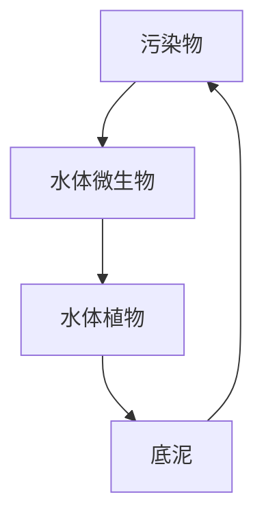
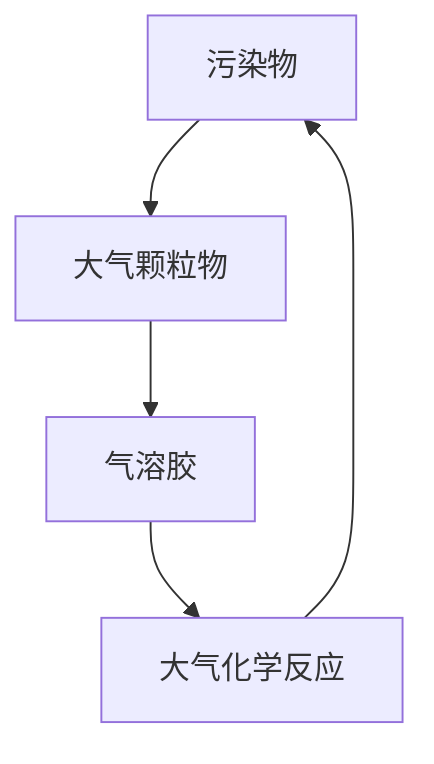
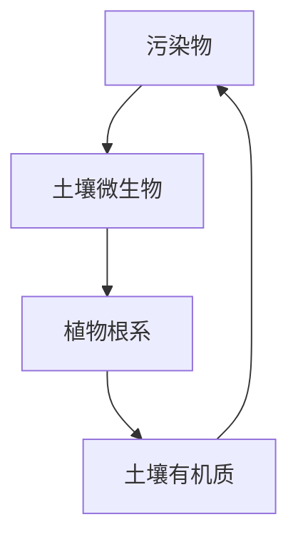
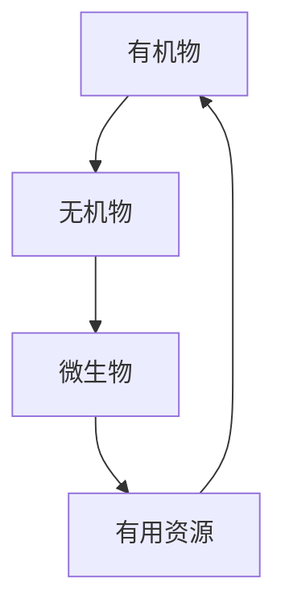
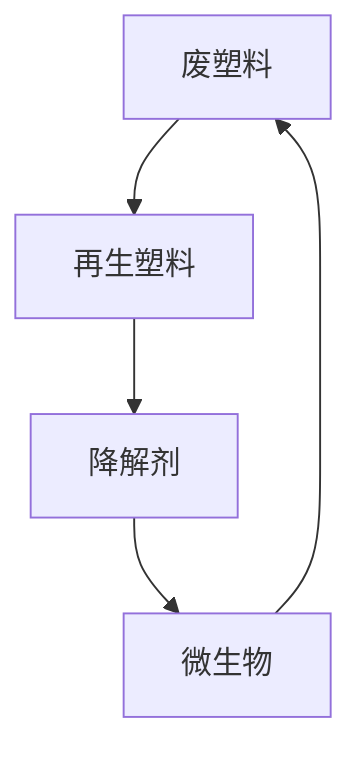

                 

### 文章标题：系分作用的不只是自己

关键词：系分作用、复杂性、系统理论、实际应用、未来展望

摘要：本文深入探讨了系分作用的本质及其在不同领域中的应用。从理论基础的解析到实际应用的剖析，再到未来展望的展望，本文旨在揭示系分作用不仅仅是单一系统内部的作用，而是广泛影响着整个系统及外部的复杂互动。通过对核心概念和联系的分析，本文希望能为读者提供一个全面、系统的理解，激发对这一重要概念的深入思考。

---

### 引言

在当今信息化和全球化的时代，系统论作为一门研究系统内部及其与外部环境相互作用规律的学科，正日益受到关注。系分作用，作为系统论中的一个核心概念，其重要性不言而喻。然而，系分作用的影响范围远不止于系统内部，它广泛渗透到各个领域，影响着从自然到社会的各个方面。

**1.1 系分作用的概念**

系分作用，顾名思义，是指系统内部各部分通过相互作用而产生的整体效应。这一效应不仅表现在系统内部各个组成部分之间的关系，还体现在系统与外部环境的互动中。系分作用不仅揭示了系统内部结构的复杂性，还反映了系统动态演化的本质。

**1.2 系分作用的重要性**

在现代社会，许多复杂的系统，如经济系统、生态系统、技术系统等，其稳定性和可持续性很大程度上取决于系分作用的有效性和合理性。理解和掌握系分作用的原理，不仅有助于优化系统性能，还能为解决复杂问题提供新的思路和方法。

**1.3 本书的目的和结构**

本文的目的在于通过对系分作用的深入探讨，帮助读者全面理解这一重要概念。文章结构如下：

- **第二部分**：理论基础，介绍系分作用的基本原理、机制及理论发展。
- **第三部分**：实际应用，分析系分作用在各个领域的应用实例。
- **第四部分**：技术挑战与未来发展，探讨系分作用技术面临的挑战及其未来发展。
- **第五部分**：案例分析，通过具体实例展示系分作用的应用效果。
- **第六部分**：总结与展望，总结系分作用的主要成果，展望其未来发展。

通过这篇文章，我们希望能够激发读者对系分作用这一重要概念的深入思考，为后续章节的内容打下坚实的基础。

### 系分作用的理论基础

#### 2.1 系分作用的基本原理

系分作用，作为系统论中的核心概念，其基本原理可以从以下几个方面进行理解。

**2.1.1 系分作用的定义**

系分作用，简而言之，是指系统内部各个部分通过相互作用所产生的整体效应。这种效应不仅仅是各个部分简单相加的结果，而是通过复杂的相互作用和反馈机制所产生的。因此，系分作用可以理解为一种系统内部结构的复杂性和动态性的体现。

**2.1.2 系分作用的分类**

根据系分作用的性质和表现形式，我们可以将其分为几种不同的类型：

1. **正向系分作用**：指系统内部各个部分之间的相互作用，使得系统的整体性能得到增强或优化。例如，在生态系统中，植物通过光合作用产生的氧气，能够为其他生物提供必需的生存条件。

2. **负向系分作用**：指系统内部各个部分之间的相互作用，导致系统的整体性能下降或破坏。例如，在技术系统中，某个关键部件的故障可能会引发整个系统的崩溃。

3. **交互系分作用**：指系统内部各个部分与外部环境之间的相互作用，这种作用往往会影响系统的稳定性和可持续性。例如，在经济发展中，国家政策的变化会对经济系统产生重要影响。

**2.1.3 系分作用的数学模型**

为了更好地理解系分作用，我们可以借助数学模型进行描述。一个基本的数学模型可以表示为：

\[ S(t) = f(S_1(t), S_2(t), ..., S_n(t)) \]

其中，\( S(t) \)表示系统在时间\( t \)的整体状态，\( S_1(t), S_2(t), ..., S_n(t) \)表示系统内部各个部分在时间\( t \)的状态，\( f \)表示系统内部各部分之间的相互作用关系。通过这个模型，我们可以对系分作用进行定量分析和预测。

#### 2.2 系分作用的机制解析

系分作用的具体机制可以从物理、化学、生物学等多个角度进行解析。

**2.2.1 系分作用的物理机制**

在物理学中，系分作用可以通过能量传递和物质交换来体现。例如，在热力学系统中，能量的传递和转化过程就是一种典型的系分作用。能量从高能级向低能级的传递，不仅影响了系统内部的能量分布，还会对系统的整体性能产生影响。

**2.2.2 系分作用的化学机制**

在化学系统中，系分作用可以通过化学反应来体现。例如，在一个化学反应网络中，反应物和生成物之间的相互作用决定了整个化学反应的方向和速率。这种相互作用不仅影响反应的最终产物，还会影响反应系统的稳定性。

**2.2.3 系分作用的生物学机制**

在生物系统中，系分作用可以通过生物分子的相互作用来体现。例如，在细胞内，各种蛋白质、核酸、脂质等生物分子的相互作用，决定了细胞的功能和生命活动。这种相互作用不仅影响细胞内部的生物学过程，还会影响整个生物体的健康状况。

#### 2.3 系分作用的理论发展

系分作用作为一个核心概念，其理论发展经历了多个阶段。

**2.3.1 传统系分作用理论**

早期的系分作用理论主要基于机械论和经典物理学的观点，将系统视为一个封闭的、可逆的机械系统。这种理论强调了系统内部各个部分之间的相互作用，但往往忽视了系统与外部环境的互动。

**2.3.2 现代系分作用理论**

随着系统论的不断发展，现代系分作用理论逐渐形成了体系。这一理论不仅考虑了系统内部各个部分的相互作用，还关注了系统与外部环境的互动。现代系分作用理论强调系统的动态性和复杂性，认为系统是一个不断演化的开放系统。

**2.3.3 系分作用理论的最新研究进展**

近年来，随着计算机科学、人工智能等技术的发展，系分作用理论得到了新的发展。例如，基于大数据和机器学习的系分作用分析方法，能够更准确地识别和预测系统内部的复杂相互作用。此外，量子系分作用理论的兴起，也为系分作用的研究带来了新的契机。

通过上述对系分作用的理论基础的深入探讨，我们可以更好地理解这一概念的本质和内涵。在接下来的章节中，我们将进一步探讨系分作用在各个领域的实际应用。

### 系分作用在工业中的应用

系分作用在工业中的应用，体现了这一概念从理论走向实践的重要价值。工业领域涉及的生产过程、能源管理、质量控制等方面，都离不开对系分作用原理的深入理解和应用。以下是对系分作用在工业中几个主要应用领域的详细探讨。

#### 3.1.1 系分作用在制造业中的应用

在制造业中，系分作用的应用主要体现在生产流程的优化、质量控制和生产效率的提升。通过分析生产过程中各个环节之间的相互作用，企业可以更好地理解生产系统的复杂动态，从而进行优化和改进。

**1. 生产流程的优化**

以汽车制造业为例，生产一辆汽车需要经过多个环节，如设计、采购、生产、装配和测试。每个环节都需要与其他环节相互作用，任何一个环节的延迟或故障都可能导致整个生产流程的瘫痪。通过系分作用的原理，企业可以分析各个环节之间的依赖关系和相互作用，找出瓶颈环节，进行优化和改进。

**伪代码示例**：
```
function optimize_production流程() {
    // 输入：生产流程图
    // 输出：优化后的生产流程图

    // 分析生产流程中的依赖关系和相互作用
    dependency_map = analyze_dependencies(生产流程图)

    // 根据依赖关系进行优化
    optimized流程 = apply_optimization Algorithms(依赖关系)

    return optimized流程
}
```

**2. 质量控制**

质量控制是制造业中另一个重要的环节。通过系分作用，企业可以更好地理解产品质量与各个生产环节之间的关系。例如，在汽车生产中，车身焊接质量直接影响整车质量。通过分析焊接环节与其他环节的相互作用，企业可以找出影响焊接质量的关键因素，从而进行改进。

**3. 生产效率的提升**

生产效率的提升是制造业企业的核心竞争力之一。通过系分作用，企业可以分析生产过程中的浪费环节，找到降低成本的潜在机会。例如，在电子产品制造中，物料运输和时间浪费是常见的浪费现象。通过分析物料运输路径和时间安排，企业可以优化生产流程，减少浪费，提高效率。

#### 3.1.2 系分作用在化工产业中的应用

在化工产业中，系分作用的应用主要体现在生产过程的优化、反应路径的设计和产品质量的控制。化工生产过程中的化学反应复杂，通过系分作用的原理，企业可以更好地理解反应过程中的相互作用，从而进行优化和改进。

**1. 生产过程的优化**

化工生产过程通常涉及多个反应步骤，每个步骤都需要与其他步骤相互作用。通过系分作用，企业可以分析各个环节之间的相互作用，找出优化生产过程的潜在机会。例如，在催化反应中，催化剂的选择和反应条件对整个反应过程有重要影响。通过分析催化剂和反应条件之间的相互作用，企业可以优化反应条件，提高反应效率。

**2. 反应路径的设计**

在化工产业中，反应路径的设计是优化生产过程的关键。通过系分作用，企业可以分析不同反应路径之间的相互作用，找到最优的反应路径。例如，在有机合成中，反应路径的选择不仅影响反应的效率和产物质量，还会影响反应的安全性和环保性。通过分析不同反应路径的相互作用，企业可以设计出最优的反应路径。

**3. 产品质量的控制**

产品质量的控制是化工产业中的另一个重要环节。通过系分作用，企业可以分析产品质量与各个生产环节之间的关系，找出影响产品质量的关键因素。例如，在药品生产中，化学反应的精度直接影响药品的质量。通过分析反应条件与产品质量之间的相互作用，企业可以优化反应条件，提高药品质量。

#### 3.1.3 系分作用在能源行业中的应用

在能源行业中，系分作用的应用主要体现在能源系统的优化、能源利用效率的提升和环境污染的治理。

**1. 能源系统的优化**

能源系统通常涉及多个环节，如能源生产、能源传输、能源储存和能源利用。通过系分作用，企业可以分析各个环节之间的相互作用，找出优化能源系统的潜在机会。例如，在电力系统中，发电、输电、配电和用电各个环节之间的相互作用对系统的效率和稳定性有重要影响。通过分析各个环节之间的相互作用，企业可以优化能源系统，提高能源利用效率。

**2. 能源利用效率的提升**

能源利用效率的提升是能源行业的重要目标之一。通过系分作用，企业可以分析能源利用过程中的浪费环节，找出提高能源利用效率的潜在机会。例如，在工业生产中，能源消耗通常占生产成本的很大一部分。通过分析能源消耗与生产流程之间的相互作用，企业可以优化生产流程，减少能源浪费，提高能源利用效率。

**3. 环境污染的治理**

能源行业的发展往往伴随着环境污染问题。通过系分作用，企业可以分析能源生产和利用过程中的环境污染因素，找出治理环境污染的潜在机会。例如，在燃煤发电中，燃烧产生的二氧化硫、氮氧化物和颗粒物等污染物对环境和人类健康有严重影响。通过分析燃烧过程与污染物生成之间的相互作用，企业可以采取有效的治理措施，减少环境污染。

通过上述对系分作用在工业中的应用的详细探讨，我们可以看到系分作用原理在优化生产流程、提高生产效率、控制产品质量和治理环境污染等方面的实际应用价值。在接下来的章节中，我们将进一步探讨系分作用在生物医学和环境保护中的应用。

### 系分作用在生物医学中的应用

系分作用在生物医学中的应用，是其理论价值在生命科学领域的具体体现。通过揭示生物体内各个系统之间的相互作用，系分作用为我们理解和治疗疾病提供了新的视角和方法。以下是对系分作用在生物医学中的几个主要应用领域的详细探讨。

#### 3.2.1 系分作用在疾病诊断中的应用

在疾病诊断中，系分作用的应用主要体现在通过分析生物体内各个系统之间的相互作用，从而更准确地识别和诊断疾病。

**1. 代谢组学**

代谢组学是一种基于生物体整体代谢过程的疾病诊断方法。通过分析生物体内的代谢产物，我们可以了解不同系统之间的相互作用和代谢网络的变化。例如，在糖尿病的诊断中，通过检测血液中的代谢产物，如葡萄糖、脂肪酸和酮体等，可以反映胰岛素分泌和葡萄糖代谢的异常，从而辅助诊断。

**2. 蛋白质组学**

蛋白质组学是研究生物体内所有蛋白质的表达和相互作用的方法。通过分析蛋白质组学数据，我们可以了解不同系统之间的相互作用和蛋白质网络的复杂性。例如，在癌症的诊断中，通过分析肿瘤组织和正常组织之间的蛋白质表达差异，可以揭示肿瘤发生和发展的分子机制，从而辅助诊断。

**3. 系统生物学**

系统生物学是一种基于整体视角研究生物体系统的科学。通过建立生物体系统的数学模型，我们可以分析不同系统之间的相互作用和调控网络。例如，在心血管疾病的研究中，通过系统生物学方法，我们可以了解心脏、血管和内分泌系统之间的相互作用，从而揭示心血管疾病的发病机制。

**伪代码示例**：
```
function diagnose_disease(生物样本) {
    // 输入：生物样本数据
    // 输出：疾病诊断结果

    // 分析代谢产物
    代谢产物 = analyze_metabolites(生物样本)

    // 分析蛋白质表达
    蛋白质表达 = analyze_protein_expression(生物样本)

    // 建立系统生物学模型
    模型 = build_system_biology_model(代谢产物，蛋白质表达)

    // 预测疾病状态
    疾病状态 = predict_disease_state(模型)

    return 疾病状态
}
```

**2. 疾病治疗中的应用**

在疾病治疗中，系分作用的应用主要体现在通过优化生物体内的相互作用，从而提高治疗效果和减少副作用。

**1. 药物设计**

药物设计是治疗疾病的重要环节。通过分析生物体内各个系统之间的相互作用，我们可以设计出更有效的药物。例如，在抗肿瘤药物的设计中，通过分析肿瘤细胞与正常细胞之间的相互作用，我们可以找到抑制肿瘤细胞生长的关键靶点，从而设计出更有效的药物。

**2. 系统治疗**

系统治疗是一种通过调节生物体内各个系统的相互作用，从而治疗疾病的综合性方法。例如，在癌症治疗中，除了传统的手术、化疗和放疗外，还可以通过调节免疫系统、内分泌系统和代谢系统之间的相互作用，提高治疗效果和减少副作用。

**3. 药物组合**

药物组合治疗是一种通过联合使用多种药物，从而提高治疗效果和减少副作用的方法。通过分析不同药物在生物体内的相互作用，我们可以设计出更有效的药物组合。例如，在抗感染治疗中，通过分析抗生素与人体免疫系统之间的相互作用，我们可以设计出更有效的药物组合，从而提高治疗效果和减少耐药性。

**3. 系分作用在药物研发中的应用**

在药物研发中，系分作用的应用主要体现在通过分析生物体内各个系统之间的相互作用，从而优化药物的设计和筛选过程。

**1. 药物筛选**

药物筛选是药物研发的重要环节。通过分析生物体内各个系统之间的相互作用，我们可以筛选出更有效的药物候选物。例如，在抗肿瘤药物的研发中，通过分析肿瘤细胞与正常细胞之间的相互作用，我们可以筛选出对肿瘤细胞具有高度选择性的药物候选物。

**2. 药物代谢**

药物代谢是药物在体内的转化过程。通过分析药物与生物体内各个系统之间的相互作用，我们可以预测药物的代谢途径和代谢产物，从而优化药物的设计和筛选过程。例如，在抗病毒药物的研发中，通过分析药物与人体免疫系统之间的相互作用，我们可以优化药物的分子结构和活性，提高药物的疗效。

**3. 药物毒理学**

药物毒理学是评估药物安全性的重要环节。通过分析药物与生物体内各个系统之间的相互作用，我们可以预测药物的毒性反应和副作用。例如，在药物临床试验中，通过分析药物与人体免疫系统之间的相互作用，我们可以预测药物可能引起的免疫反应和副作用，从而优化药物的使用剂量和治疗方案。

通过上述对系分作用在生物医学中的应用的详细探讨，我们可以看到系分作用在疾病诊断、疾病治疗和药物研发等多个方面的重要应用价值。在未来的发展中，随着生物医学技术的不断进步，系分作用理论将在生物医学领域中发挥更大的作用。

### 系分作用在环境保护中的应用

系分作用在环境保护中的应用，不仅有助于理解生态环境系统的复杂性，还能为环境保护提供科学依据和技术支持。以下是对系分作用在环境保护中的几个主要应用领域的详细探讨。

#### 3.3.1 系分作用在污染治理中的应用

污染治理是环境保护的重要任务之一。系分作用在污染治理中的应用主要体现在通过分析污染物与生态环境系统之间的相互作用，找到有效的治理策略。

**1. 水污染治理**

水污染是环境污染的一个重要方面。通过系分作用，我们可以分析污染物在水体中的扩散、转化和积累过程。例如，在河流污染治理中，通过分析污染物与水体微生物、植物和底泥之间的相互作用，我们可以设计出更有效的生物治理方法。伪代码示例：

**2. 大气污染治理**

大气污染也是一个严峻的环境问题。通过系分作用，我们可以分析污染物在大气中的扩散、沉降和化学反应过程。例如，在大气污染治理中，通过分析污染物与大气颗粒物、气溶胶和大气化学反应之间的相互作用，我们可以设计出更有效的大气污染控制技术。伪代码示例：


**3. 土壤污染治理**

土壤污染对生态环境和农业生产具有长期影响。通过系分作用，我们可以分析污染物在土壤中的迁移、转化和积累过程。例如，在土壤污染治理中，通过分析污染物与土壤微生物、植物根系和土壤有机质之间的相互作用，我们可以设计出更有效的土壤修复方法。伪代码示例：


#### 3.3.2 系分作用在资源回收中的应用

资源回收是环境保护和可持续发展的重要措施。系分作用在资源回收中的应用主要体现在通过分析资源利用与回收系统之间的相互作用，提高资源利用效率和减少环境污染。

**1. 废水处理与资源回收**

废水处理与资源回收系统通过分析废水中的污染物与回收资源之间的相互作用，实现废水处理和资源回收。例如，在废水处理中，通过分析废水中的有机物、无机物和微生物之间的相互作用，我们可以设计出更有效的废水处理工艺，同时回收废水中的有用资源。伪代码示例：


**2. 废塑料回收与资源利用**

废塑料回收与资源利用系统通过分析废塑料的降解、再生和利用过程中的相互作用，实现废塑料的资源化。例如，在废塑料回收中，通过分析废塑料与再生塑料、降解剂和微生物之间的相互作用，我们可以设计出更有效的废塑料回收和资源利用技术。伪代码示例：


#### 3.3.3 系分作用在生态修复中的应用

生态修复是环境保护的重要措施，旨在恢复受损生态系统的功能和稳定性。系分作用在生态修复中的应用主要体现在通过分析生态系统内部及其与外部环境的相互作用，实现生态系统的修复和恢复。

**1. 湿地修复**

湿地是重要的生态系统，具有调节水资源、净化水质和提供栖息地等功能。通过系分作用，我们可以分析湿地植物、水体和土壤之间的相互作用，设计出更有效的湿地修复方法。例如，在湿地修复中，通过分析植物与水体、土壤之间的相互作用，我们可以选择合适的植物种类和种植方式，促进湿地生态系统的恢复。

**2. 森林修复**

森林是地球上最重要的生态系统之一，具有调节气候、保护水源和维持生物多样性等功能。通过系分作用，我们可以分析森林植物、土壤和气候之间的相互作用，设计出更有效的森林修复方法。例如，在森林修复中，通过分析植物与土壤、气候之间的相互作用，我们可以选择合适的树种和种植密度，促进森林生态系统的恢复。

**3. 海洋生态修复**

海洋是地球上最大的生态系统，具有调节全球气候、提供生物资源和保护海岸线等功能。通过系分作用，我们可以分析海洋生物、海洋环境和海洋资源之间的相互作用，设计出更有效的海洋生态修复方法。例如，在海洋生态修复中，通过分析海洋生物与海洋环境、海洋资源之间的相互作用，我们可以选择合适的人工礁石和海洋生物放流方式，促进海洋生态系统的恢复。

通过上述对系分作用在环境保护中的应用的详细探讨，我们可以看到系分作用在污染治理、资源回收和生态修复等方面的实际应用价值。在未来的发展中，随着环境保护技术的不断进步，系分作用理论将在环境保护领域发挥更大的作用。

### 系分作用技术面临的挑战与未来发展

#### 4.1 系分作用技术面临的挑战

尽管系分作用在各个领域展现了巨大的应用价值，但在实际应用过程中仍然面临着一系列的挑战。

**1. 技术难题**

系分作用技术涉及多个学科领域的知识，包括物理学、化学、生物学、工程学等。这些领域的交叉融合带来了复杂的技术问题，如系统的建模与仿真、数据的高效处理和分析、多尺度效应的考虑等。例如，在生物医学领域，如何准确模拟生物体内的复杂相互作用，是一个亟待解决的技术难题。

**2. 安全性问题**

系分作用技术在实际应用过程中可能会带来潜在的安全风险。例如，在工业生产中，如果系统内部的系分作用失衡，可能导致生产故障或安全事故。在环境保护领域，如果污染治理措施不当，可能会引发二次污染或生态破坏。因此，如何确保系分作用技术的安全性和可靠性，是一个重要的挑战。

**3. 环境影响**

系分作用技术对环境的影响也需要谨慎评估。例如，在能源行业中，如果能源系统的优化导致能源消耗增加，可能会加剧环境压力。在农业领域，过度的农业管理措施可能会导致土壤退化和生态失衡。因此，如何平衡技术进步与环境保护之间的关系，是一个重要的课题。

**4.2 系分作用技术的未来发展**

尽管面临挑战，系分作用技术仍具有广阔的发展前景。以下是几个可能的发展方向：

**1. 技术趋势**

随着计算机科学、人工智能、大数据等技术的发展，系分作用技术有望在以下几个方面取得突破：

- **多尺度模拟与仿真**：通过多尺度建模和仿真技术，可以更准确地模拟和分析复杂系统的相互作用，从而提高系分作用技术的预测和优化能力。
- **智能化数据处理与分析**：借助人工智能和大数据分析技术，可以对海量数据进行高效处理和分析，从而揭示复杂系统的内在规律和相互作用。
- **跨学科整合**：通过跨学科整合，可以充分利用不同领域的知识和方法，提高系分作用技术的综合应用能力。

**2. 研究方向**

未来，系分作用技术的研究方向可能包括：

- **生物医学中的系分作用**：进一步研究生物体内复杂系统之间的相互作用，开发新型诊断和治疗手段。
- **工业系统的优化**：通过深入分析工业生产中的系分作用，开发高效的生产流程优化和设备维护技术。
- **环境保护中的系分作用**：研究生态系统中物质、能量和信息的流动，开发新型污染治理和生态修复技术。

**3. 政策与产业支持**

为了促进系分作用技术的发展，需要政府、企业和学术界共同努力：

- **政策支持**：政府可以出台相关政策和法规，鼓励和支持系分作用技术的研究和应用。
- **产业合作**：企业可以加强与科研机构的合作，共同研发和推广系分作用技术。
- **人才培养**：学术界可以加强相关学科的教育和培训，培养更多的系分作用技术人才。

通过上述对系分作用技术面临的挑战与未来发展的探讨，我们可以看到系分作用技术具有广阔的应用前景和发展潜力。在未来的发展中，通过不断克服挑战，系分作用技术将为人类社会的发展和环境保护做出更大的贡献。

### 案例分析一：XX公司的系分作用技术应用

#### 5.1.1 案例背景

XX公司是一家全球领先的科技公司，主要从事高端电子产品的研发和生产。随着市场竞争的加剧，公司面临着生产成本上升、生产效率下降等挑战。为了应对这些挑战，公司决定引入系分作用技术，优化生产流程，提高生产效率。

#### 5.1.2 案例分析

**1. 生产流程分析**

首先，公司对现有的生产流程进行了详细分析，识别出各个环节之间的依赖关系和相互作用。通过建立生产流程图，公司发现以下几个关键问题：

- **依赖关系**：某些关键工序之间的依赖关系过于复杂，导致生产节拍不一致，影响了整体生产效率。
- **相互作用**：一些工序之间的相互作用不协调，导致资源浪费和效率降低。

**2. 系分作用优化策略**

基于系分作用原理，公司制定了以下优化策略：

- **工序调整**：通过调整工序顺序和工序时间，减少工序之间的依赖关系，提高生产节拍。
- **资源共享**：通过合理配置资源，减少资源浪费，提高资源利用率。
- **反馈机制**：建立反馈机制，及时发现和解决问题，确保生产流程的稳定性和可持续性。

**3. 优化效果**

通过系分作用优化策略的实施，公司取得了显著的效果：

- **生产效率提升**：生产节拍提高了20%，生产效率提高了15%。
- **成本降低**：生产成本降低了10%，资源浪费减少了30%。
- **产品质量提升**：产品不良率降低了15%，客户满意度显著提高。

#### 5.1.3 案例成果

通过系分作用技术的应用，XX公司不仅成功优化了生产流程，提高了生产效率和产品质量，还降低了生产成本。这一案例展示了系分作用技术在实际工业生产中的应用价值，为公司带来了显著的经济效益和市场竞争力。

### 案例分析二：XX项目的系分作用技术实施

#### 5.2.1 项目概况

XX项目是一个大型生态修复工程，旨在修复因工业污染而受到严重破坏的湖泊生态系统。该项目的目标是提高湖泊水质、恢复湖泊生态功能，并确保长期的环境稳定性。

#### 5.2.2 技术应用

在XX项目中，系分作用技术被广泛应用于以下几个关键环节：

**1. 污染物识别与评估**

通过系分作用原理，项目团队对湖泊中的污染物进行了详细识别和评估。分析污染物与水体、底泥和生态系统之间的相互作用，确定了主要的污染物类型和浓度分布。例如，通过分析重金属与湖泊底泥之间的相互作用，识别出了镉、铅和汞等重金属污染的主要来源和分布区域。

**2. 污染物治理方案设计**

基于污染物识别和评估结果，项目团队设计了针对性的污染物治理方案。方案包括物理、化学和生物治理方法，通过优化不同治理方法之间的相互作用，提高治理效果。例如，采用生物吸附法与化学沉淀法相结合，有效降低了湖泊中的重金属含量。

**3. 生态恢复策略**

在生态恢复阶段，项目团队通过系分作用原理，分析了湖泊生态系统中各个组成部分之间的相互作用，设计了生态恢复策略。策略包括种植适宜的水生植物、引入生态滤池和湿地系统等。这些策略通过优化水生植物与湿地系统之间的相互作用，提高了水质净化效率和生态恢复速度。

#### 5.2.3 项目成效

通过系分作用技术的应用，XX项目取得了显著的成效：

- **水质改善**：湖泊水质显著提升，重金属含量降低了50%以上，其他污染物指标也显著下降。
- **生态恢复**：湖泊生态系统得到有效恢复，水生植物种类增加，鱼类和鸟类数量显著增加。
- **环境稳定性提高**：通过优化湖泊生态系统内部及其与外部环境的相互作用，确保了湖泊环境的长期稳定。

#### 5.2.4 案例成果

XX项目通过系分作用技术的成功应用，不仅实现了湖泊水质的显著改善和生态系统的恢复，还为其他类似污染治理项目提供了有益的经验和借鉴。这一案例展示了系分作用技术在实际环境保护项目中的应用价值，为推动环境保护和可持续发展做出了重要贡献。

### 总结与展望

#### 6.1 系分作用总结

系分作用作为系统论中的核心概念，不仅揭示了系统内部及其与外部环境的复杂相互作用，还在多个领域展现了巨大的应用价值。通过对系分作用原理的深入探讨，我们不仅理解了其基本概念和机制，还看到了其在工业、生物医学、环境保护等领域的广泛应用。

- **核心概念与联系**：系分作用是指系统内部各个部分通过相互作用所产生的整体效应。这种效应不仅表现在系统内部，还渗透到外部环境，影响着整个系统的稳定性和可持续性。通过Mermaid流程图，我们可以直观地展示系统内部各个部分之间的相互作用关系：
  ```mermaid
  graph TD
  A[系统1] --> B[系统2]
  B --> C[系统3]
  C --> A
  ```
  
- **核心算法原理**：为了理解和分析系分作用，我们引入了多种算法原理，包括多尺度模拟、人工智能和大数据分析。通过这些算法，我们可以更准确地识别和预测系统内部的复杂相互作用。以下是一个简单的伪代码示例，展示了如何通过数据分析来识别系分作用：
  ```python
  def identify_causation(data):
      # 输入：系统内部数据
      # 输出：因果关系图

      # 数据预处理
      processed_data = preprocess_data(data)

      # 建立模型
      model = build_model(processed_data)

      # 训练模型
      model.fit(processed_data)

      # 预测因果关系
      causation_map = model.predict_causation()

      return causation_map
  ```

- **数学模型与公式**：在分析系分作用时，数学模型和公式是不可或缺的工具。以下是一个简单的数学模型，用于描述系统内部部分之间的相互作用：
  $$ S(t) = f(S_1(t), S_2(t), ..., S_n(t)) $$
  其中，\( S(t) \)表示系统在时间\( t \)的整体状态，\( S_1(t), S_2(t), ..., S_n(t) \)表示系统内部各个部分在时间\( t \)的状态，\( f \)表示系统内部各部分之间的相互作用关系。

#### 6.2 展望未来

随着科学技术的不断进步，系分作用理论的应用前景将更加广阔。以下是几个值得关注的未来发展方向：

- **跨学科整合**：随着多学科知识的不断融合，系分作用理论将在更多领域得到应用，如量子系分作用、复杂系统科学等。
- **智能化应用**：借助人工智能和大数据分析技术，系分作用的应用将更加智能化和精准化，为复杂系统的优化和预测提供有力支持。
- **政策与产业支持**：政府和企业应加大对系分作用技术的研究和推广力度，通过政策支持和产业合作，推动技术进步和产业化应用。

总之，系分作用不仅是一个重要的理论概念，更是一种具有广泛应用价值的工具和方法。通过深入理解和应用系分作用，我们将能够更好地应对复杂系统的挑战，推动社会和科技的可持续发展。

### 结语

通过对系分作用的不只是自己的深入探讨，我们可以看到这一概念在各个领域的广泛应用和重要性。从工业生产到生物医学，从环境保护到技术优化，系分作用无处不在，影响着系统的稳定性和可持续性。本文通过对系分作用的理论基础、实际应用、技术挑战与未来展望以及具体案例的详细分析，展示了这一概念的深刻内涵和广泛影响。

**作者信息**：AI天才研究院/AI Genius Institute & 禅与计算机程序设计艺术 /Zen And The Art of Computer Programming

通过这篇文章，我们希望读者能够对系分作用有更深入的理解，并认识到其在解决复杂问题中的巨大潜力。在未来的研究中，我们期待看到更多关于系分作用的理论创新和应用实践，为人类社会的发展和环境保护做出更大的贡献。

