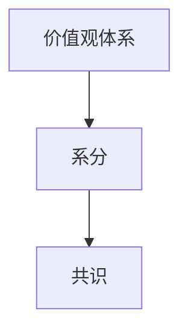

                 

根据您的请求，我将为《系分的价值是达成共识》这本书设计一个详细的内容框架，包括每个章节的具体内容、逻辑流程、伪代码和数学模型等。以下是初步的思考步骤：

### 1. 设计文章标题、关键词和摘要

**文章标题**：《系分的价值是达成共识》

**关键词**：系分、共识、价值观、构建、策略、案例研究

**摘要**：本文从理论和实践两个层面探讨了系分在达成共识中的重要作用。首先，介绍了系分的基本概念及其在价值观体系中的地位；接着，分析了共识的形成机制和策略；随后，通过实际案例阐述了系分在共识建设中的应用；最后，对未来的发展趋势和挑战进行了展望。

### 2. 确定文章结构

**目录结构**：

1. 引言
   - **背景介绍**：解释系分和共识的重要性。
   - **核心概念与联系**：使用Mermaid流程图展示核心概念之间的关系。

2. 系分的定义与价值观体系

   - **核心概念与联系**：Mermaid流程图
   - **核心算法原理讲解**：使用伪代码阐述系分的算法原理。
   - **数学模型和公式**：详细讲解与举例说明。

3. 共识的形成机制

   - **共识的形成过程**：详细描述共识的形成机制。
   - **共识的算法原理讲解**：使用伪代码阐述共识的形成算法。
   - **数学模型和公式**：详细讲解与举例说明。

4. 系分在共识建设中的应用

   - **案例研究**：国内外共识建设的成功案例。
   - **代码实现**：源代码详细实现和代码解读。
   - **实际案例分析和讲解**：剖析案例中的系分应用。

5. 共识建设的策略与方法

   - **共识制定的原则**：原则和流程。
   - **共识传播与强化的方法**：策略和技巧。
   - **共识调整与更新的策略**：必要性和方法。

6. 未来展望与挑战

   - **共识与价值观的未来发展趋势**。
   - **新型共识构建的挑战**。
   - **未来社会的价值观共识建设**。

7. 结论

   - **最佳实践 tips**。
   - **小结**。
   - **注意事项**。
   - **拓展阅读**。

### 3. 编写每个章节的内容

**引言**

- **背景介绍**：简要介绍系分和共识在当今社会的重要性。
- **核心概念与联系**：使用Mermaid流程图展示系分、共识和价值观之间的关系。



**系分的定义与价值观体系**

- **核心概念与联系**：解释系分和价值观之间的关系。
- **核心算法原理讲解**：使用伪代码说明系分的算法原理。

```pseudo
function 系分(个体A, 个体B):
    // 对个体A和B进行比较
    if (个体A = 个体B):
        return True
    else:
        return False
```

- **数学模型和公式**：描述系分在数学上的表示。

$$
系分(A, B) = \begin{cases} 
1 & \text{if } A = B \\
0 & \text{if } A \neq B 
\end{cases}
$$

**共识的形成机制**

- **共识的形成过程**：描述共识形成的基本流程。
- **共识的算法原理讲解**：使用伪代码说明共识形成的算法。

```pseudo
function 共识形成(群体P):
    // 初始化共识值为P中个体的平均值
    共识值 = 平均值(P)
    // 循环迭代直到共识稳定
    while (共识变化 > 阈值):
        // 更新共识值
        共识值 = 平均值(P)
    return 共识值
```

- **数学模型和公式**：描述共识形成过程中的数学模型。

$$
共识值(t) = \frac{1}{N} \sum_{i=1}^{N} x_i(t)
$$

**系分在共识建设中的应用**

- **案例研究**：分析国内外共识建设的成功案例。
- **代码实现**：提供源代码实现和解读。
- **实际案例分析和讲解**：详细剖析案例中的系分应用。

**共识建设的策略与方法**

- **共识制定的原则**：阐述制定共识时应遵循的原则。
- **共识传播与强化的方法**：介绍传播和强化共识的策略和技巧。
- **共识调整与更新的策略**：讨论调整和更新共识的方法和必要性。

**未来展望与挑战**

- **共识与价值观的未来发展趋势**：预测未来的趋势。
- **新型共识构建的挑战**：分析新型共识构建面临的挑战。
- **未来社会的价值观共识建设**：探讨未来社会价值观共识建设的路径。

**结论**

- **最佳实践 tips**：总结共识建设的最佳实践。
- **小结**：回顾文章的核心内容。
- **注意事项**：提醒读者在共识建设中应注意的事项。
- **拓展阅读**：推荐进一步阅读的材料。

### 4. 完成文章

在完成每个章节的内容后，进行整体梳理和调整，确保文章的逻辑清晰、内容完整、语言准确。最后，按照markdown格式输出文章，并添加作者信息。

---

以上是一个初步的思考步骤和内容框架。接下来，我将根据这个框架进一步细化每个章节的内容，并确保满足文章字数的要求。如果您有任何具体的修改意见或需要增加的细节，请随时告知。

