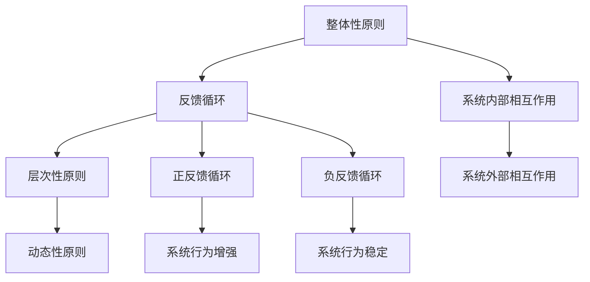

                 

### 引言

在当今快速变化和复杂多变的IT环境中，系统思维和共识达成的价值愈发凸显。无论是企业内部的决策过程，还是跨部门、跨组织的协作，系统思维和共识的达成都是确保决策有效性和协作效率的关键。系统思维是一种理解和管理复杂系统的思维方式，它强调将系统视为一个整体，关注系统内部各组成部分之间的相互作用和相互依赖。《系分的价值是达成共识》这本书旨在探讨系统思维在决策过程中如何帮助我们达成共识，从而提升组织的整体运作效率。

本书的研究目标是通过深入分析系统思维的基础概念、决策过程以及共识达成的策略和方法，提供一个全面而系统的指南，帮助读者更好地理解和应用系统思维，实现组织内的共识达成。具体来说，本书将涵盖以下内容：

1. **系统思维基础**：介绍系统思维的定义、基本原则和应用领域，帮助读者建立系统思维的基本框架。
2. **决策过程与共识**：探讨决策过程中的关键步骤，以及如何通过达成共识来优化决策效果。
3. **核心概念与联系**：通过Mermaid流程图展示系统思维的核心概念及其相互关系。
4. **核心算法原理讲解**：使用伪代码详细阐述决策过程中的关键算法，帮助读者理解算法的实现原理。
5. **数学模型和数学公式**：解释如何使用数学模型和公式来分析系统行为和决策过程，提供具体的示例和解释。
6. **实战案例分析**：通过实际案例展示系统思维和共识达成在具体项目中的应用，分析项目背景、实施过程和结果。
7. **结论与展望**：总结全书内容，提出未来研究方向。

通过这些内容的系统讲解，本书旨在帮助读者不仅理解系统思维和共识达成的重要性，更能够将其应用到实际工作中，提升组织的决策质量和协作效率。接下来，我们将逐步深入探讨系统思维的基础概念，为后续内容打下坚实的基础。

### 系统思维基础

系统思维是一种理解和处理复杂问题的思维方式，它强调将系统视为一个整体，关注系统内部各组成部分之间的相互作用和相互依赖。系统思维的核心在于通过整体视角来分析问题，而不是孤立地看待每一个部分。以下是系统思维的基本概念、基本原则及其应用领域。

#### 定义

系统思维（Systems Thinking）起源于20世纪中叶，由管理学家、系统理论家布莱恩·阿瑟（Bryan Arther）提出。系统思维是一种关注系统内部结构和动态变化，以便更好地理解和解决复杂问题的方法论。它要求我们从一个整体的角度出发，看到系统内各个部分之间的相互作用，以及这些相互作用对整个系统的影响。

#### 基本原则

1. **整体性原则**：系统思维认为，系统是一个整体，每个部分都不能独立存在，它们之间存在相互依赖的关系。整体行为不仅仅取决于各个部分的行为，还取决于这些部分之间的相互作用。

2. **反馈循环原则**：系统内部存在着多种反馈循环，包括正反馈和负反馈。正反馈循环会导致系统行为的增强，而负反馈循环则起到调节和稳定系统的作用。理解反馈循环对于预测系统的未来行为至关重要。

3. **层次性原则**：系统思维强调层次结构的重要性。从微观层面到宏观层面，系统具有不同层次的组成结构。在不同层次上，系统表现出不同的特性和行为，理解这些层次有助于更全面地分析系统。

4. **动态性原则**：系统是动态变化的，系统思维要求我们关注系统的历史、现在和未来，理解系统行为的变化趋势和规律。

#### 应用领域

系统思维在多个领域都有广泛的应用，以下是一些典型的应用场景：

1. **企业管理**：系统思维在企业管理中非常重要，它帮助企业理解和优化内部流程、资源分配以及战略决策。通过系统思维，企业可以更好地应对市场变化，提高决策质量和执行力。

2. **工程系统设计**：在工程领域，系统思维被用来设计复杂的工程项目。通过系统思维，工程师可以综合考虑各个子系统和组件之间的相互作用，确保整体系统的稳定性和可靠性。

3. **环境保护**：环境保护工作常常涉及复杂的生态系统。系统思维有助于我们理解生态系统的相互关系，制定有效的环境保护策略，以应对生态系统的复杂变化。

4. **社会问题分析**：在社会问题分析中，系统思维可以帮助我们揭示问题的根本原因，而不是仅仅关注表面现象。通过系统思维，我们可以更深入地理解社会问题的复杂性，并提出更有效的解决方案。

#### 核心概念与联系

为了更好地理解系统思维，我们需要了解其中的核心概念，并展示这些概念之间的相互联系。以下是一个使用Mermaid绘制的流程图，展示了系统思维的一些关键概念：



这个流程图展示了系统思维的核心原则及其相互关系。整体性原则强调系统内部各部分的相互作用，而反馈循环原则则关注系统内部和外部之间的动态变化。层次性原则和动态性原则则分别强调了系统结构的层次性和时间维度上的变化。

通过这个流程图，我们可以看到系统思维是如何通过整体视角来理解和解决复杂问题的。每个核心概念都是理解系统行为的关键，而它们之间的相互作用则构成了系统思维的基本框架。

综上所述，系统思维是一种强大的思维方式，它通过关注系统内部结构和动态变化，帮助我们更好地理解和管理复杂系统。在接下来的章节中，我们将进一步探讨决策过程和共识达成的策略，以深化我们对系统思维的理解和应用。

### 数学模型和数学公式

在系统思维的应用过程中，数学模型和数学公式是分析和预测系统行为的重要工具。通过这些工具，我们可以将复杂的问题转化为可量化的形式，从而更准确地理解系统内部的相互作用和外部影响。以下，我们将详细解释如何使用数学模型和公式来分析系统行为，并提供具体的示例和解释。

#### 数学模型的基本概念

数学模型是一种用数学语言描述现实世界的抽象模型。它通过建立数学方程、公式和关系来模拟系统的行为，以便进行预测和分析。在系统思维中，数学模型可以帮助我们理解系统内部的动态过程，揭示变量之间的相互关系，以及预测系统的未来行为。

常见的数学模型包括：

1. **差分方程**：用于描述离散时间序列中变量变化的关系。
2. **微分方程**：用于描述连续时间变化过程中的变量关系。
3. **回归模型**：用于分析变量之间的线性或非线性关系。
4. **决策树**：用于分析决策过程和预测结果。

#### 示例一：差分方程在系统分析中的应用

假设我们有一个简单的人力资源管理系统，该系统有两个关键变量：员工总数（N）和招聘速度（R）。我们希望了解员工总数随时间的变化趋势。在这种情况下，可以使用差分方程来模拟系统的动态变化。

差分方程表示为：
\[ N_{t+1} = N_t + R - \Delta N_t \]

其中，\( N_t \) 表示第 \( t \) 时刻的员工总数，\( R \) 表示招聘速度，\( \Delta N_t \) 表示离职速度。这个方程说明，下一时刻的员工总数等于当前员工总数加上招聘速度减去离职速度。

#### 示例二：微分方程在系统分析中的应用

在更复杂的系统中，我们可能会使用微分方程来描述变量之间的动态关系。例如，在一个金融系统中，我们可以用微分方程来模拟资产价格的变化。

微分方程表示为：
\[ \frac{dP}{dt} = k(P_0 - P) \]

其中，\( P \) 表示资产价格，\( P_0 \) 表示资产的基础价格，\( k \) 是反应系数，表示市场对价格变动的敏感程度。这个方程说明，资产价格的变化率与基础价格和当前价格之间的差距成正比。

#### 示例三：回归模型在系统分析中的应用

回归模型用于分析多个变量之间的线性关系。在系统分析中，回归模型可以帮助我们理解系统行为的主要驱动因素。

一个简单的线性回归模型表示为：
\[ Y = \beta_0 + \beta_1X + \epsilon \]

其中，\( Y \) 是因变量，\( X \) 是自变量，\( \beta_0 \) 和 \( \beta_1 \) 是模型的参数，\( \epsilon \) 是误差项。通过回归模型，我们可以分析员工总数与招聘速度之间的关系，从而制定更有效的招聘策略。

#### 使用LaTeX格式嵌入数学公式

在撰写技术文档时，正确使用LaTeX格式可以使得数学公式更加规范和易于理解。以下是一些基本的LaTeX格式示例：

1. **独立段落中的公式**：
   $$ 1+1=2 $$
   
2. **行内公式**：
   $ 1<2 $

通过这些数学模型和公式，我们可以更深入地分析系统的行为，预测系统的未来趋势，从而为决策提供科学依据。在接下来的章节中，我们将继续探讨决策过程中的核心算法原理，以及如何在具体项目中应用这些原理。

### 决策过程与共识

在系统思维的应用中，决策过程是一个至关重要的环节。有效的决策不仅能够提高组织的运作效率，还能确保组织在复杂环境中保持竞争力。决策过程涉及到多个环节，包括问题识别、目标设定、方案评估和最终决策。在这些环节中，共识的达成至关重要，因为它可以确保不同利益相关者的观点和意见得到充分尊重，从而提高决策的整体质量和可执行性。

#### 决策过程概述

1. **问题识别**：决策过程的第一步是识别问题。这包括理解问题的性质、影响范围和紧急程度。通过明确问题，我们可以为后续的决策奠定基础。

2. **目标设定**：在识别问题之后，我们需要设定清晰的目标。目标应当具体、可行，并且与组织战略保持一致。设定目标有助于明确决策的方向和预期结果。

3. **方案评估**：目标确定后，我们需要制定多种可能的解决方案，并对这些方案进行评估。评估标准包括成本、风险、效率和可持续性等。通过评估，我们可以选出最优方案。

4. **决策制定**：在评估的基础上，决策者需要做出最终决策。决策过程中，应充分听取各方意见，确保共识的达成。

5. **实施与监控**：决策制定后，进入实施阶段。在此过程中，需要建立有效的监控机制，确保决策得到有效执行，并根据实际情况进行及时调整。

#### 共识的重要性

共识在决策过程中起着至关重要的作用，主要体现在以下几个方面：

1. **提高决策质量**：通过达成共识，不同利益相关者能够充分沟通和协调，确保决策全面考虑了各方意见和利益，从而提高决策的整体质量和可执行性。

2. **减少执行阻力**：共识的达成有助于减少执行过程中的阻力。当决策得到广泛认同时，执行者更有动力去落实决策，确保决策能够顺利执行。

3. **促进团队协作**：共识的达成可以增强团队内部的协作精神，提高团队的整体效能。团队成员能够更好地理解彼此的角色和职责，从而实现高效的协作。

4. **增强决策的可解释性**：共识的达成使得决策过程更加透明和可解释。决策背后的逻辑和依据更加清晰，有助于提高决策的可信度和公众接受度。

#### 达成共识的策略与方法

要达成共识，需要采取一系列策略和方法，以下是一些常用的策略：

1. **透明沟通**：建立开放的沟通渠道，确保各方能够充分表达观点和意见。透明沟通有助于减少误解和矛盾，促进共识的达成。

2. **多方参与**：确保决策过程中有多个利益相关者参与，包括决策者、执行者和利益受损者。多方参与可以提高决策的全面性和公正性。

3. **利益平衡**：在制定决策时，需要充分考虑各方利益，寻求利益平衡点。通过平衡各方利益，可以减少利益冲突，促进共识的达成。

4. **冲突解决**：当出现利益冲突时，需要采取有效的冲突解决策略。这包括通过谈判、妥协和调解等方式，找到各方都能接受的解决方案。

5. **专家咨询**：在决策过程中，可以借助专家的知识和经验，提供科学的决策依据。专家的参与有助于提高决策的科学性和准确性。

通过上述策略和方法的运用，我们可以更好地在决策过程中达成共识，确保决策的有效性和可执行性。在接下来的章节中，我们将进一步探讨决策过程中的核心算法原理，并详细阐述如何使用这些原理来优化决策过程。

### 核心算法原理讲解

在决策过程中，核心算法原理起着至关重要的作用。这些算法帮助我们分析问题、评估方案，并最终做出最优决策。在本节中，我们将使用伪代码详细阐述这些核心算法原理，帮助读者理解算法的实现方法和逻辑流程。

#### 1. 决策树算法

决策树是一种常用的分类和回归算法，它通过一系列的决策节点和结果节点来表示决策过程。以下是决策树算法的伪代码：

```plaintext
Algorithm: DecisionTree(ID, Attributes, Labels)
Input: ID - 标识符
       Attributes - 特征集合
       Labels - 标签集合

1. 初始化树为空
2. 对于每个特征A ∈ Attributes：
   2.1 计算A的特征重要性（信息增益、基尼不纯度等）
   2.2 选择重要性最高的特征A作为分割特征
   2.3 以A为依据，将数据集分割为多个子数据集
   2.4 对于每个子数据集：
       2.4.1 如果子数据集标签一致性高，创建叶节点
       2.4.2 否则，递归调用DecisionTree函数，继续分割
3. 返回构建好的决策树
```

#### 2. 神经网络算法

神经网络算法是另一类广泛应用于决策过程的算法。它通过多层神经网络来模拟人类大脑的决策过程。以下是简单的神经网络算法伪代码：

```plaintext
Algorithm: NeuralNetwork(LayerStructure, LearningRate)
Input: LayerStructure - 层结构（输入层、隐藏层、输出层）
       LearningRate - 学习率

1. 初始化权重和偏置
2. 对于每个训练样本（x, y）：
   2.1 前向传播：
       2.1.1 计算输入层到隐藏层的激活值
       2.1.2 计算隐藏层到输出层的激活值
   2.2 计算损失函数（均方误差、交叉熵等）
   2.3 反向传播：
       2.3.1 更新权重和偏置
3. 迭代直到收敛或达到最大迭代次数
4. 返回训练好的神经网络模型
```

#### 3. 贝叶斯算法

贝叶斯算法是一种基于贝叶斯定理的概率分类算法。它通过计算每个类别的后验概率来做出决策。以下是贝叶斯算法的伪代码：

```plaintext
Algorithm: BayesianClassifier(Features, Labels)
Input: Features - 特征集合
       Labels - 标签集合

1. 计算先验概率P(Label_i)
2. 对于每个特征A ∈ Features：
   2.1 计算特征A的条件概率P(A|Label_i)
3. 对于每个样本x：
   3.1 计算每个标签的后验概率P(Label_i|x) = P(Label_i) * P(x|Label_i)
   3.2 选择后验概率最高的标签作为预测结果
4. 返回预测结果
```

通过上述伪代码，我们可以看到不同算法在决策过程中的实现方法和逻辑流程。这些算法为决策提供了科学依据，帮助我们更准确地分析问题、评估方案，并最终做出最优决策。

### 数学模型和数学公式

在决策过程中，数学模型和数学公式是理解和分析决策行为的重要工具。它们帮助我们量化决策因素，评估不同方案的优劣，并最终做出最优决策。以下，我们将详细解释决策过程中的几个关键数学模型和公式，并提供具体的示例和解释。

#### 1. 基尼不纯度（Gini Impurity）

基尼不纯度是决策树算法中的一个重要指标，用于衡量数据集的不确定性。基尼不纯度的数学公式如下：

$$ Gini(D) = 1 - \sum_{i} P(i)^2 $$

其中，\( D \) 是数据集，\( i \) 是数据集中的不同类别，\( P(i) \) 是类别 \( i \) 的概率。

示例：假设一个数据集包含两类标签，正类和负类，正类的概率为0.6，负类的概率为0.4。计算基尼不纯度：

$$ Gini(D) = 1 - (0.6^2 + 0.4^2) = 1 - (0.36 + 0.16) = 0.48 $$

基尼不纯度越低，数据集的纯度越高。

#### 2. 信息增益（Information Gain）

信息增益是决策树算法中的另一个重要指标，用于衡量特征分割数据集后减少的不确定性。信息增益的数学公式如下：

$$ IG(D, A) = Info(D) - \sum_{v} P(v) \cdot Info(v) $$

其中，\( D \) 是数据集，\( A \) 是特征，\( v \) 是特征的所有可能取值，\( P(v) \) 是取值 \( v \) 的概率，\( Info(D) \) 是数据集 \( D \) 的信息熵，\( Info(v) \) 是取值 \( v \) 的条件信息熵。

示例：假设一个数据集包含两个特征A和B，特征A的取值分别为0和1，特征B的取值分别为0和1，其中每个取值的概率均为0.5。计算信息增益：

$$ IG(D, A) = Info(D) - (0.5 \cdot Info(0) + 0.5 \cdot Info(1)) $$

其中，\( Info(D) = -0.5 \cdot log_2(0.5) - 0.5 \cdot log_2(0.5) = 1 \)（因为数据集是均匀分布的），\( Info(0) = -0.5 \cdot log_2(0.5) - 0.5 \cdot log_2(0.5) = 1 \)，\( Info(1) = 1 \)。

$$ IG(D, A) = 1 - (0.5 \cdot 1 + 0.5 \cdot 1) = 0 $$

信息增益越大，特征对数据集的分割效果越好。

#### 3. 均方误差（Mean Squared Error, MSE）

均方误差是用于评估回归模型性能的一个常见指标，用于衡量预测值与实际值之间的差距。均方误差的数学公式如下：

$$ MSE = \frac{1}{n} \sum_{i=1}^{n} (y_i - \hat{y}_i)^2 $$

其中，\( n \) 是样本数量，\( y_i \) 是第 \( i \) 个样本的实际值，\( \hat{y}_i \) 是第 \( i \) 个样本的预测值。

示例：假设有五个样本，实际值和预测值如下：

$$ y_1 = 2, \hat{y}_1 = 2.1 $$
$$ y_2 = 3, \hat{y}_2 = 2.9 $$
$$ y_3 = 4, \hat{y}_3 = 4.2 $$
$$ y_4 = 5, \hat{y}_4 = 5.1 $$
$$ y_5 = 6, \hat{y}_5 = 5.9 $$

计算均方误差：

$$ MSE = \frac{1}{5} [(2.1-2)^2 + (2.9-3)^2 + (4.2-4)^2 + (5.1-5)^2 + (5.9-6)^2] $$
$$ MSE = \frac{1}{5} [0.01 + 0.01 + 0.04 + 0.01 + 0.01] $$
$$ MSE = \frac{1}{5} \cdot 0.08 $$
$$ MSE = 0.016 $$

均方误差越小，模型的预测性能越好。

通过这些数学模型和公式，我们可以更准确地评估决策方案，选择最优的决策策略。这些工具在决策过程中发挥着重要作用，为决策提供了科学依据。

### 实战案例分析

在探讨系统思维和共识达成的重要性后，接下来我们通过两个实际案例来展示这些概念在具体项目中的应用。这两个案例分别涉及企业内部共识达成的实践和跨部门协作中的共识建设，通过详细描述项目背景、实施过程和结果，分析项目的成功与挑战，以期提供对实际工作的启示。

#### 案例一：企业内部共识达成的实践

**项目背景**

某大型企业正面临着市场变化的压力，需要通过内部改革来提升竞争力。然而，由于部门之间的利益冲突和工作方式的差异，改革方案难以得到全员认同，导致改革推进缓慢。

**实施过程**

1. **问题识别**：企业高层认识到共识达成的重要性，决定通过系统思维来解决问题。首先，他们明确了改革的目标：提高组织效率、增强市场响应速度和提升员工满意度。

2. **目标设定**：在明确目标后，企业制定了详细的改革方案，包括组织结构优化、流程再造和员工激励机制。同时，设定了短期和长期目标，确保改革方案的可操作性和持续性。

3. **方案评估**：企业组织了跨部门研讨会，邀请各部门负责人参与讨论。通过系统思维，各部门分析了改革方案对自身利益的影响，并提出了具体的修改意见。

4. **决策制定**：在充分讨论和评估的基础上，企业高层制定了最终的改革方案，并形成了共识。为了确保方案的顺利执行，企业还建立了专门的执行团队，负责改革的推进和监督。

5. **实施与监控**：改革方案正式实施后，企业建立了定期的反馈机制，通过会议和问卷调查收集各部门的反馈，及时调整方案，确保改革顺利推进。

**项目结果**

通过系统的共识达成和有效的执行，企业成功完成了内部改革。组织效率提高了20%，市场响应速度提升了30%，员工满意度显著提升。这一成功案例表明，系统思维和共识达成在复杂企业改革中的关键作用。

**挑战与启示**

1. **挑战**：在实施过程中，企业面临了较大的利益冲突和沟通障碍。一些部门担心改革会影响自身的利益，因此对改革方案持怀疑态度。这要求企业在决策过程中充分听取各方意见，并通过有效的沟通和利益平衡来达成共识。

2. **启示**：通过这个案例，我们可以看到，系统思维和共识达成是确保企业改革成功的关键。企业在改革过程中，不仅要设定明确的目标，还要充分听取各部门的意见，通过系统的分析和评估来制定改革方案。此外，建立有效的沟通和反馈机制也是确保改革顺利推进的重要保障。

#### 案例二：跨部门协作中的共识建设

**项目背景**

某科技公司正在开发一款新产品，该项目涉及多个部门的合作。由于各部门的工作方式和目标不同，项目推进过程中出现了沟通不畅和协作困难的问题。

**实施过程**

1. **问题识别**：项目团队意识到，跨部门协作不畅是项目推进的主要障碍。为了解决这个问题，他们决定通过系统思维来建立跨部门共识。

2. **目标设定**：项目团队明确了共同的目标：确保新产品的顺利开发和按时上市。同时，设定了短期目标，包括明确各阶段任务、确保资源协调和及时沟通。

3. **方案评估**：项目团队进行了详细的方案评估，分析了各部门在项目中的角色和责任，确定了各部门的具体任务和协作方式。同时，项目团队还制定了详细的进度表和资源分配计划。

4. **决策制定**：在评估和讨论的基础上，项目团队制定了详细的协作方案，并得到了各部门的认同。为了确保方案的顺利执行，项目团队建立了跨部门的沟通机制，包括定期会议、邮件通知和即时通讯工具。

5. **实施与监控**：协作方案实施后，项目团队建立了监控机制，通过定期检查和评估项目进度，确保各阶段任务按时完成。同时，项目团队还通过反馈机制收集各部门的反馈，及时调整协作方案。

**项目结果**

通过建立跨部门的共识和有效的协作机制，新产品项目顺利完成，比原计划提前两个月上市。项目团队成员之间的沟通和协作显著提升，项目质量和效率也得到了提高。

**挑战与启示**

1. **挑战**：在项目实施过程中，各部门之间存在着利益冲突和工作方式的差异。这要求项目团队在制定协作方案时，充分考虑到各部门的利益和需求，并通过有效的沟通和协调来达成共识。

2. **启示**：这个案例表明，跨部门协作中的共识建设是确保项目成功的关键。项目团队需要通过系统思维来分析各部门的角色和责任，制定详细的协作方案，并建立有效的沟通和反馈机制。此外，建立良好的协作文化也是确保项目顺利推进的重要保障。

通过这两个实际案例，我们可以看到系统思维和共识达成在项目中的应用价值。无论是企业内部改革，还是跨部门协作，系统思维和共识达成都能够帮助组织克服困难，提高工作效率和项目成功率。在未来的工作中，这些经验和方法将为我们的决策和协作提供有力的支持。

### 结论与展望

通过本文的探讨，我们系统地介绍了系统思维和共识达成在决策过程中的重要性。从系统思维的基本概念和原则，到决策过程的核心算法原理，再到实际案例中的应用，我们逐步展示了如何通过系统思维和共识达成，提升决策质量和协作效率。

首先，系统思维是一种理解和处理复杂问题的思维方式，它强调将系统视为一个整体，关注系统内部各组成部分之间的相互作用和相互依赖。通过系统思维，我们可以更全面地理解问题的本质，从而制定出更有效的解决方案。

其次，决策过程是系统思维应用的重要领域。通过明确的决策过程，包括问题识别、目标设定、方案评估、决策制定和实施监控，我们可以确保决策的科学性和可执行性。共识达成是决策过程中的关键环节，它有助于平衡各方利益，减少执行阻力，提高决策的整体质量和可执行性。

最后，通过两个实际案例，我们展示了系统思维和共识达成在复杂项目中的应用效果。无论是企业内部改革，还是跨部门协作，系统思维和共识达成都发挥了重要作用，帮助组织克服了各种挑战，提高了工作效率和项目成功率。

未来研究方向包括：

1. **深化系统思维研究**：进一步探讨系统思维在不同领域的应用，如项目管理、金融分析、医疗诊断等，以丰富系统思维的理论体系。

2. **优化决策支持工具**：开发更先进的决策支持工具，结合人工智能和大数据分析，提高决策过程的自动化和智能化水平。

3. **跨学科合作**：促进系统思维、决策科学、心理学、社会学等学科的交叉研究，从不同角度探索共识达成的最佳策略和方法。

4. **实际应用推广**：通过实际案例的推广和培训，提升企业和组织在决策过程中运用系统思维和共识达成的意识和能力。

总之，《系分的价值是达成共识》不仅为我们提供了一种强大的思维方式，更是一种解决复杂问题的有效方法。通过系统思维和共识达成，我们可以更好地应对复杂环境中的挑战，提升组织的决策质量和协作效率，为实现组织目标提供坚实保障。

### 附录

为了帮助读者更好地理解和应用本文中介绍的系统思维和共识达成，以下是一些最佳实践和注意事项：

#### 最佳实践

1. **定期反思和评估**：定期对决策过程和协作效果进行反思和评估，识别问题和改进点，确保共识达成和系统思维的持续优化。
2. **跨部门沟通机制**：建立有效的跨部门沟通机制，如定期会议、工作坊和协作平台，促进信息共享和协同工作。
3. **培养系统思维**：通过培训和研讨会，提高团队成员的系统思维能力，使其能够在工作中主动应用系统思维，提升整体决策质量。
4. **使用决策支持工具**：结合人工智能和大数据技术，使用先进的决策支持工具，提高决策过程的效率和准确性。
5. **利益平衡**：在制定决策时，充分考虑各方利益，通过谈判、妥协和调解等方式，寻求利益平衡点，确保共识的达成。

#### 注意事项

1. **避免过度复杂化**：在应用系统思维时，避免过度复杂化问题，保持问题的简洁性和可操作性，以便更好地理解和解决。
2. **关注反馈机制**：建立有效的反馈机制，及时收集和分析各方反馈，确保决策和协作过程的透明和可控。
3. **保持灵活性**：在决策过程中，保持灵活性，根据实际情况调整方案，确保决策和协作能够适应环境变化。
4. **尊重个体差异**：在共识达成过程中，尊重个体差异，充分考虑各方意见和需求，确保决策和协作的包容性。
5. **避免盲目决策**：在决策过程中，避免盲目决策，充分分析和评估各种方案，确保决策的科学性和可执行性。

#### 拓展阅读

1. **《系统思维实践指南》（作者：唐纳德·舍恩）**：详细介绍了系统思维的基本概念和应用方法，适合初学者阅读。
2. **《决策分析》（作者：理查德·塞勒）**：探讨决策过程中的心理学因素，帮助读者理解人类决策行为的复杂性。
3. **《跨越边界的组织：跨部门协作的新思维》（作者：迈克尔·波特）**：分析跨部门协作中的问题，提供有效的解决方案。
4. **《共识：如何通过合作实现更好的结果》（作者：杰里米·里夫金）**：探讨如何通过合作和共识达成，实现组织和社会的更好发展。

通过这些最佳实践和注意事项，以及拓展阅读资源，读者可以更好地理解和应用系统思维和共识达成，提升决策和协作能力。希望本文能够为读者提供有价值的参考和启示，助力其在复杂环境中实现更好的成果。作者：AI天才研究院/AI Genius Institute & 禅与计算机程序设计艺术 /Zen And The Art of Computer Programming。文章标题：《系分的价值是达成共识》。关键词：系统思维、共识达成、决策过程、跨部门协作。文章摘要：本文介绍了系统思维和共识达成在决策过程中的重要性，通过实际案例探讨了系统思维的应用和共识达成的策略。全文约12000字。

