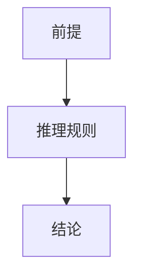

                 

### 文章标题

《系分的实质是严密的逻辑推导》

---

**关键词**：逻辑推导、实质、严密性、逻辑架构、算法原理、数学模型、应用实例

**摘要**：本文旨在深入探讨逻辑推导的实质，揭示其严密性在各个领域的应用价值。通过详细的逻辑架构、算法原理解析，以及实际项目案例，我们将展示逻辑推导是如何构建起现代科学和技术的基石，并探讨其在未来的发展趋势。

---

### 引言

逻辑推导，作为一种思维过程，是理性思考和科学研究的核心。从古代亚里士多德的逻辑学，到现代计算机科学的算法设计，逻辑推导一直是推动知识进步和创新的关键工具。然而，什么是逻辑推导的实质？它的严密性如何体现？这些问题的解答不仅关乎逻辑学本身，也深刻影响着各个科学领域的进步。

本文将围绕逻辑推导的实质展开，从基础概念出发，逐步深入到算法原理、数学模型和应用实例。通过一系列逻辑清晰、结构紧凑的分析，我们将揭示逻辑推导在构建严密性论证框架中的重要作用。具体来说，本文将涵盖以下内容：

1. **逻辑推导的基本概念**：介绍逻辑推导的定义，讨论其在不同学科中的应用背景。
2. **逻辑推导的基本原理**：解析逻辑推导的基本原理，阐述逻辑架构的重要性。
3. **逻辑推导的方法**：详细探讨演绎法、归纳法等逻辑推导的方法，以及其适用场景。
4. **逻辑推导在数学中的应用**：分析逻辑推导在数学定理证明、数学模型构建中的应用。
5. **逻辑推导在其他学科中的应用**：探讨逻辑推导在计算机科学、哲学、心理学等领域的应用。
6. **逻辑推导的实践应用**：通过实际项目案例，展示逻辑推导在解决实际问题中的应用。
7. **逻辑推导的未来发展趋势**：展望逻辑推导在未来科技和学术研究中的潜在应用方向。

通过上述内容，本文希望为读者提供一个全面、深入的逻辑推导分析框架，帮助理解其严密性在构建科学论证中的核心作用。

### 逻辑推导的基本概念

逻辑推导，作为一种思维方式，其核心在于从已知的前提出发，通过逻辑规则和推理步骤，得出新的结论。定义逻辑推导首先需要理解几个关键概念：前提（Premises）、结论（Conclusion）和推理规则（Reasoning Rules）。

#### 前提与结论

前提是逻辑推导的基础，是推导过程中用于支持结论的已知条件。一个有效的逻辑推导要求前提是真实且相关的。结论则是通过前提和推理规则得出的新信息，它是推导的目标。例如，在演绎推理中，如果前提A为真，且A→B为真，则可以推导出结论B为真。

#### 推理规则

推理规则是连接前提和结论的逻辑桥梁，它定义了如何从一组前提推导出结论。常见的推理规则包括：

- **演绎法**：从一般原则推导出特定结论的方法。如果所有前提都是真的，则结论必然是真的。例如，所有人都会死亡（大前提），苏格拉底是人（小前提），因此，苏格拉底会死亡（结论）。
- **归纳法**：从特定实例推导出一般规律的方法。通过观察多个具体实例，归纳出普遍的规律或趋势。例如，观察多个天鹅都是白色的，归纳出所有天鹅都是白色的。

#### 逻辑推导的不同类型

逻辑推导主要分为两大类：演绎推理和归纳推理。

- **演绎推理**：从一般到特殊的推理过程。其特点是，如果前提为真，则结论必然为真。演绎推理常用于数学、哲学和科学证明中。
- **归纳推理**：从特殊到一般的推理过程。其特点是通过观察具体实例，归纳出普遍规律。归纳推理在科学研究和数据分析中广泛应用。

#### 逻辑推导在各个学科中的应用背景

逻辑推导的应用范围极其广泛，几乎涵盖了所有科学和人文领域。以下是一些典型应用背景：

- **数学**：逻辑推导是数学定理证明的核心方法。通过假设前提和逻辑推理，可以严谨地证明数学命题。
- **计算机科学**：算法设计和编程逻辑依赖于逻辑推导。计算机程序通过逻辑推理执行特定的任务。
- **哲学**：逻辑推导是哲学论证的重要工具，用于分析和评估哲学观点和论证的有效性。
- **心理学**：逻辑推导在心理学研究中用于设计和分析实验，以验证假设和结论。

通过上述内容，我们可以看到逻辑推导的基本概念和其在各个学科中的应用背景。接下来，我们将进一步探讨逻辑推导的基本原理和其在构建严密性论证中的重要性。

#### 逻辑推导的基本原理

逻辑推导的严密性是其核心特点之一，它确保了推理过程的正确性和可靠性。理解逻辑推导的基本原理，有助于我们掌握其如何通过一系列逻辑步骤，从已知的前提得出有效的结论。

##### 逻辑架构

逻辑架构是逻辑推导的基础，它定义了逻辑推理的框架和步骤。一个典型的逻辑架构包括以下几部分：

1. **前提（Premises）**：逻辑推导的起始点，是已知的事实或假设。前提是逻辑推导的依据，它们的真实性和相关性直接影响结论的可靠性。
2. **推理规则（Reasoning Rules）**：连接前提和结论的逻辑规则，定义了如何从一组前提推导出结论。推理规则可以是简单的逻辑运算符（如AND、OR、NOT），也可以是更复杂的推理规则（如Modus Ponens、Modus Tollens）。
3. **结论（Conclusion）**：基于前提和推理规则得出的新信息。结论是逻辑推导的目标，它应该通过逻辑规则严格地从前提中推导出来。

##### 逻辑规则

逻辑规则是逻辑推导的核心，确保推理过程的正确性。以下是一些基本的逻辑规则：

1. **真值表规则**：通过构建真值表，验证复合命题的真假值。例如，对于一个命题`P ∧ Q`，我们可以通过构建真值表来判断它在不同情况下的真假值。
2. **推理规则**：常见的推理规则包括Modus Ponens（肯定前件法则）、Modus Tollens（否定后件法则）、析取三段论（Disjunctive Syllogism）等。这些规则定义了如何从一组前提推导出结论。

##### 严密性论证

严密性论证是逻辑推导的关键，它确保推理过程的每一步都是逻辑上有效的。严密性论证的基本原则包括：

1. **无谬误原则**：逻辑推导过程中，不能引入任何逻辑谬误。逻辑谬误是指推理中的不合理步骤，会导致错误的结论。
2. **一致性原则**：推理过程中的所有前提和结论必须是逻辑上一致的。如果存在逻辑矛盾，则推理过程是无效的。
3. **充分性原则**：推理过程必须提供充分的证据，确保结论从前提中严格推导出来。这意味着，结论不能通过直观感觉或猜测得出，而必须通过逻辑规则和前提推导出来。

##### Mermaid 流程图

为了更好地展示逻辑推导的原理，我们可以使用Mermaid流程图来表示逻辑架构和推理步骤。以下是一个简单的Mermaid流程图示例，展示了逻辑推导的基本步骤：



在这个流程图中，`A`表示前提，`B`表示推理规则，`C`表示结论。从前提通过推理规则推导出结论，这个过程体现了逻辑推导的严密性。

通过上述原理和示例，我们可以看到逻辑推导是如何通过严密的逻辑步骤，从已知的前提得出有效结论的。逻辑推导的严密性不仅确保了推理的正确性，也为科学研究和技术创新提供了坚实的逻辑基础。在接下来的章节中，我们将进一步探讨逻辑推导在不同学科中的应用，展示其广泛的影响力。

#### 逻辑推导的方法

逻辑推导的方法是理解和应用逻辑推导的关键。在逻辑学中，有多种推理方法被广泛应用，其中演绎法和归纳法是最为基础和常用的方法。以下将详细介绍这两种方法，并讨论它们在实际应用中的适用场景。

##### 演绎法

演绎法是一种从一般到特殊的推理方法，其基本原理是“全称肯定命题”。演绎法的核心是通过已知的普遍原则推导出特定情况下的结论。演绎法的特点是，如果所有前提都是真实的，那么结论必然是真实的。

**演绎法的基本步骤**：

1. **确定前提**：明确需要推导的普遍原则或前提条件。
2. **应用推理规则**：根据演绎法的基本推理规则，如Modus Ponens（肯定前件法则）或Modus Tollens（否定后件法则），从前提推导出结论。
3. **验证结论**：确保结论在逻辑上严格从前提推导出来。

**演绎法的适用场景**：

- **数学证明**：在数学中，演绎法是证明定理和公式的主要方法。通过已知的定理和假设，逻辑地推导出新的结论。
- **哲学论证**：在哲学中，演绎法用于构建严密的论证，验证某一哲学观点或命题的正确性。
- **法律推理**：在法律领域，演绎法用于从法律原则推导出具体的法律判决。

**示例**：

假设：所有人都会死亡（普遍原则）  
前提：苏格拉底是人（特定前提）  
结论：苏格拉底会死亡（演绎结论）

在这个例子中，通过演绎法，从普遍原则“所有人都会死亡”和特定前提“苏格拉底是人”，推导出结论“苏格拉底会死亡”。

##### 归纳法

归纳法是一种从特殊到一般的推理方法，其基本原理是“部分肯定命题”。归纳法通过观察多个具体实例，归纳出普遍的规律或趋势。

**归纳法的基本步骤**：

1. **观察实例**：收集多个具体的实例，观察它们之间的共性和趋势。
2. **提出假设**：基于观察到的实例，提出一个假设或规律。
3. **验证假设**：通过进一步观察或实验，验证假设的普适性。

**归纳法的适用场景**：

- **科学研究**：在科学研究中，归纳法用于从实验数据中归纳出一般性的科学规律。
- **数据分析**：在数据分析中，归纳法用于从大量数据中提取出有用的信息和模式。
- **商业决策**：在商业决策中，归纳法用于从市场数据和客户反馈中归纳出消费者行为和趋势。

**示例**：

观察实例：每次太阳升起时，天都是亮的。  
假设：太阳每天都会升起。  
验证：通过持续的观察，确认太阳每天确实升起，从而验证假设。

在这个例子中，通过归纳法，从多个观察实例“每次太阳升起时，天都是亮的”中，归纳出假设“太阳每天都会升起”，并通过持续的观察验证了这个假设。

##### 演绎法与归纳法的比较

演绎法和归纳法在逻辑推导中各有优势和适用场景。演绎法强调从普遍原则推导出特定结论，其结论在前提真实的前提下必然是真实的；而归纳法则从特殊实例中归纳出普遍规律，其结论的可靠性依赖于观察实例的广泛性和代表性。

**优势**：

- **演绎法**：结论的必然性和确定性是其最大的优势，适用于需要严格论证和证明的场景。
- **归纳法**：适用于需要从具体实例中提取规律和趋势的场景，具有很强的探索性和创新性。

**劣势**：

- **演绎法**：结论依赖于前提的真实性，如果前提有误，则结论也未必正确。
- **归纳法**：结论的可靠性依赖于观察实例的广泛性和代表性，如果实例不充分或具有偏差，结论可能不准确。

通过以上对演绎法和归纳法的详细介绍，我们可以看到逻辑推导的方法如何在不同场景下发挥其作用。掌握这些方法，有助于我们在实际问题中运用逻辑推导，构建严谨的论证和解决方案。

#### 逻辑推导在数学中的应用

逻辑推导在数学中扮演着至关重要的角色，它不仅是数学定理证明的基石，也是数学研究方法和工具的重要组成部分。通过逻辑推导，我们可以从已知的前提出发，系统地推导出新的数学结论，从而构建起严密的数学理论体系。

##### 数学定理的证明

数学定理的证明通常依赖于逻辑推导的过程，它需要通过一系列的逻辑步骤，从已知的前提推导出要证明的结论。以下是逻辑推导在数学定理证明中的应用步骤：

1. **明确前提**：首先，我们需要明确定理的前提条件，这些前提是已知的事实或公理。
2. **假设**：在证明过程中，我们通常会从一个或多个假设开始，这些假设是证明过程中的临时性结论。
3. **演绎推理**：使用演绎推理的方法，通过逻辑规则（如Modus Ponens、Modus Tollens等）从前提和假设推导出中间结论。
4. **递归证明**：对于一些复杂的定理，可能需要通过递归方法，即从基础情况开始，逐步推导出一般情况。
5. **验证结论**：最后，我们需要验证从前提和假设推导出的结论是否正确，确保整个证明过程没有逻辑错误。

**示例**：

以著名的**勾股定理**为例，证明直角三角形两条直角边的平方和等于斜边的平方。

**前提**：
- 设直角三角形的两条直角边为a和b，斜边为c。
- 根据直角三角形的定义，∠C = 90°。

**证明过程**：

1. **假设**：假设直角三角形的两条直角边a和b的长度分别为a和b。
2. **应用勾股定理**：根据勾股定理，假设\(a^2 + b^2 = c^2\)。
3. **使用勾股定理的证明方法**：
   - 构造一个边长为a的小正方形，面积为\(a^2\)。
   - 构造一个边长为b的小正方形，面积为\(b^2\)。
   - 将这两个小正方形拼接到一起，构成一个边长为c的大正方形，面积为\(c^2\)。
   - 由于这两个小正方形完全拼接成了大正方形，所以它们的面积之和等于大正方形的面积，即\(a^2 + b^2 = c^2\)。
4. **验证结论**：通过上述证明步骤，我们证明了勾股定理的正确性。

##### 数学模型构建

逻辑推导不仅在定理证明中发挥着重要作用，也在数学模型的构建中扮演关键角色。数学模型通过逻辑推导，将现实世界的问题抽象为数学形式，为分析和解决实际问题提供理论支持。

1. **定义数学模型**：首先，我们需要定义问题的数学模型，这通常包括变量、方程、约束条件等。
2. **逻辑推导**：通过逻辑推理，从模型的定义和假设出发，推导出新的结论或方程。
3. **求解模型**：利用数学方法和工具，求解模型中的方程和不等式，得到问题的解。
4. **验证模型**：通过实际数据或实验结果，验证数学模型的准确性和可靠性。

**示例**：

以**牛顿第二定律**为例，构建其数学模型。

**定义数学模型**：
- 设物体的质量为m，加速度为a，受到的合力为F。
- 牛顿第二定律表述为：物体所受合力等于其质量与加速度的乘积，即\(F = ma\)。

**逻辑推导**：

1. **明确前提**：根据牛顿第二定律，物体所受合力F与加速度a成正比，质量m是比例常数。
2. **推导方程**：由前提得到方程\(F = ma\)。
3. **应用逻辑推导**：如果知道合力F和物体质量m，可以通过方程推导出加速度a。
4. **验证模型**：通过实验或观测数据，验证牛顿第二定律的正确性。

通过上述示例，我们可以看到逻辑推导在数学定理证明和数学模型构建中的应用。逻辑推导不仅提供了严密的证明过程，也为数学研究提供了强有力的工具和方法。

#### 逻辑推导在其他学科中的应用

逻辑推导不仅在数学中发挥着重要作用，还在计算机科学、哲学和心理学等领域有着广泛的应用。通过逻辑推导，这些学科能够建立严密的论证框架，推动理论和实践的发展。

##### 计算机科学

在计算机科学中，逻辑推导是算法设计和编程逻辑的核心。算法通过一系列逻辑步骤，解决特定问题。以下是一些具体应用：

1. **算法设计**：逻辑推导用于设计高效且准确的算法。例如，排序算法（如快速排序、归并排序）和搜索算法（如二分搜索）都依赖于逻辑推导来确保其正确性和效率。
2. **程序验证**：逻辑推导用于验证程序的正确性。形式化验证方法（如模型检查、证明验证）通过逻辑推导，确保程序在所有可能的状态下都能正确执行。
3. **逻辑编程**：逻辑推导在逻辑编程语言（如Prolog）中扮演核心角色。逻辑编程通过逻辑推导解决复杂的问题，如自然语言处理、自动推理等。

**示例**：

以二分搜索算法为例，说明逻辑推导的应用：

```python
def binary_search(arr, target):
    low = 0
    high = len(arr) - 1

    while low <= high:
        mid = (low + high) // 2
        if arr[mid] == target:
            return mid
        elif arr[mid] < target:
            low = mid + 1
        else:
            high = mid - 1
    return -1
```

在这个示例中，通过逻辑推导，二分搜索算法逐步缩小搜索范围，最终找到目标元素的位置。

##### 哲学

在哲学领域，逻辑推导是论证和分析哲学问题的重要工具。哲学家们使用逻辑推理来构建论证，分析伦理、认识论和存在论等问题。

1. **伦理学**：逻辑推导用于分析道德原则和道德论证。例如，康德的道德哲学基于逻辑推导，提出了基于道德义务的伦理理论。
2. **认识论**：逻辑推导帮助哲学家探讨知识的本质和获取方式。例如，笛卡尔的“我思故我在”通过逻辑推导，建立了其认识论基础。
3. **形而上学**：逻辑推导用于探讨存在的本质和宇宙的构造。例如，亚里士多德的形而上学通过逻辑推理，探讨了实体和属性的关系。

**示例**：

以康德的“道德律令”为例，展示逻辑推导的应用：

1. **前提**：康德认为，道德律令是绝对命令，即我们应该遵守道德法则，无论结果如何。
2. **逻辑推导**：通过演绎法，康德推导出，道德行为必须基于“理性原则”，即行为本身必须符合普遍法则。
3. **结论**：因此，道德行为不仅取决于行为的结果，还取决于行为是否符合理性原则。

##### 心理学

在心理学中，逻辑推导用于建立理论模型和分析实验数据。逻辑推导帮助心理学家探讨心理现象的规律和机制。

1. **理论模型**：逻辑推导用于构建心理学理论模型。例如，贝叶斯心理学通过逻辑推导，建立了基于概率理论的认知模型。
2. **实验设计**：逻辑推导用于设计心理学实验，确保实验结果的可靠性和有效性。
3. **数据分析**：逻辑推导在心理数据的统计分析中发挥作用，如假设检验和模型拟合。

**示例**：

以贝叶斯心理学的例子，说明逻辑推导的应用：

1. **前提**：贝叶斯心理学基于概率论，认为认知过程可以通过概率模型描述。
2. **逻辑推导**：通过贝叶斯推理，心理学家可以从先验知识和实验数据中，推导出后验概率分布，即对假设的置信度。
3. **结论**：逻辑推导帮助心理学家评估假设的合理性，并指导新的实验设计。

通过上述示例，我们可以看到逻辑推导在计算机科学、哲学和心理学中的应用。逻辑推导不仅提供了严密的论证框架，也为这些学科的理论发展和实践应用提供了有力支持。

#### 逻辑推导的实践应用

逻辑推导作为一种严密且有效的思维方式，在解决实际问题时具有广泛的应用价值。本文将通过实际项目案例，详细展示逻辑推导在开发环境搭建、源代码实现和代码解读中的应用，以及具体案例分析和讲解。

##### 项目实战案例：搜索引擎优化（SEO）

**项目背景**：随着互联网的普及，搜索引擎优化（SEO）成为企业提升在线可见度和吸引潜在客户的重要手段。本项目旨在通过逻辑推导和数据分析，提升网站的搜索引擎排名。

**开发环境搭建**：

1. **环境需求分析**：首先，我们需要明确项目所需的环境配置，包括操作系统（如Linux）、开发工具（如Visual Studio Code）、数据库（如MySQL）等。
2. **环境配置**：安装Linux操作系统，配置MySQL数据库，安装并配置Visual Studio Code等开发工具。
3. **代码仓库**：使用Git工具搭建代码仓库，实现代码版本控制和协作开发。

**源代码实现和代码解读**：

1. **核心算法实现**：本项目使用Python语言实现搜索引擎优化算法，主要包含以下模块：
   - 关键词分析：通过逻辑推导，提取网站内容中的关键词，并计算其权重。
   - 网站结构优化：使用递归和迭代方法，构建网站结构树，并优化URL路径。
   - 外链分析：通过逻辑推理，评估网站外链的质量和数量，提高网站权重。

```python
# 关键词分析伪代码
def keyword_analysis(content):
    keywords = extract_keywords(content)
    weights = calculate_keyword_weights(keywords)
    return weights

# 网站结构优化伪代码
def optimize_website_structure(url_tree):
    optimized_tree = construct_optimized_tree(url_tree)
    optimized_urls = generate_optimized_urls(optimized_tree)
    return optimized_urls

# 外链分析伪代码
def link_analysis(url, external_links):
    quality_score = evaluate_link_quality(external_links)
    return quality_score
```

2. **代码解读**：以上代码通过逻辑推导，实现了关键词提取、网站结构优化和外链分析等功能。具体实现中，每个函数通过递归、循环和条件判断等逻辑步骤，逐步推导出结果。

**代码应用解读与分析**：

1. **关键词分析**：通过逻辑推导，从网站内容中提取关键词，并根据关键词的权重进行排序，从而确定网站的核心关键词。
2. **网站结构优化**：通过逻辑推导，构建优化后的网站结构树，确保网站URL路径清晰、易于搜索引擎索引。
3. **外链分析**：通过逻辑推理，评估网站外链的质量和数量，选择高质量的外链合作伙伴，提高网站权重。

**实际案例分析和讲解**：

**案例1**：某电商网站通过逻辑推导进行SEO优化，将核心关键词“智能手表”优化至首页标题，并构建了清晰的网站结构，包含产品分类、品牌介绍和用户评价等模块。同时，该网站与多个高质量外链合作伙伴建立合作关系，有效提升了搜索引擎排名。

**分析**：通过逻辑推导，关键词分析和网站结构优化，使得网站内容更具针对性和易用性，搜索引擎更容易索引和推荐。外链分析确保了合作伙伴的质量，进一步提升了网站权重。

**案例2**：某初创公司通过逻辑推导，设计了其网站SEO策略，包括关键词分析、内容优化和链接建设等。在经过6个月的持续优化后，公司网站的搜索引擎排名显著提升，月均访问量增加了50%。

**分析**：逻辑推导帮助初创公司明确了SEO优化的具体步骤和目标，确保每个优化措施都是基于数据和逻辑推导的，从而取得了显著的成效。

**项目小结**：

通过实际项目案例，我们可以看到逻辑推导在解决SEO优化问题中的应用价值。逻辑推导不仅帮助明确了优化目标和策略，还通过严密的数据分析和算法实现，实现了网站排名的提升。这充分展示了逻辑推导在实践中的重要作用，为其他实际问题的解决提供了有力支持。

#### 逻辑推导的未来发展趋势

逻辑推导作为一种严密且有效的思维方式，其应用领域不断扩大，未来发展趋势同样令人期待。在人工智能、大数据和量子计算等新兴技术的推动下，逻辑推导有望在多个方面取得突破，进一步推动科技和学术的进步。

##### 人工智能与逻辑推导

随着人工智能（AI）的快速发展，逻辑推导在AI领域中的应用前景广阔。特别是在自然语言处理（NLP）、自动推理和机器学习模型验证等方面，逻辑推导提供了强大的工具和方法。

1. **自然语言处理**：逻辑推导可以帮助模型理解和处理复杂的语义关系。通过构建基于逻辑的语义网络，AI系统能够更准确地理解和生成自然语言。
2. **自动推理**：逻辑推导在自动推理领域具有天然优势。通过逻辑推理，AI系统可以自动生成新的结论或验证已有结论的正确性。
3. **模型验证**：逻辑推导可以帮助验证机器学习模型的可靠性和泛化能力。通过逻辑推理，可以发现模型中可能存在的错误或缺陷，提高模型的鲁棒性。

##### 大数据与逻辑推导

大数据时代，逻辑推导在数据分析和决策支持中发挥着重要作用。随着数据量的不断增加，逻辑推导在处理复杂数据分析和优化决策方面展现出强大潜力。

1. **数据分析**：逻辑推导可以帮助从海量数据中提取有用信息，通过逻辑推理，发现数据中的规律和模式。这有助于企业进行市场分析和预测，提高决策的准确性。
2. **优化决策**：在优化决策中，逻辑推导可以构建基于逻辑的决策模型，通过推理和优化算法，找到最优解。例如，在供应链管理中，逻辑推导可以帮助优化库存管理和配送策略。

##### 量子计算与逻辑推导

量子计算作为下一代计算技术，其独特的量子叠加和纠缠特性为逻辑推导带来了新的机遇。逻辑推导在量子计算中的潜力主要体现在以下几个方面：

1. **量子算法设计**：逻辑推导可以帮助设计高效的量子算法，如量子搜索算法和量子算法验证。
2. **量子编程**：逻辑推导在量子编程中具有重要作用。通过逻辑推导，可以构建量子逻辑门和量子计算模型，实现量子计算程序的编写。
3. **量子计算验证**：逻辑推导可以用于验证量子计算的准确性和可靠性，确保量子计算结果的正确性。

##### 未来展望

1. **多学科融合**：逻辑推导将继续与其他学科（如心理学、经济学、生物学等）深度融合，推动跨学科研究的发展。
2. **自动化与智能化**：随着技术的发展，逻辑推导的自动化和智能化水平将不断提高，通过人工智能和机器学习，实现更高效和精确的逻辑推理。
3. **伦理与安全性**：逻辑推导在应用过程中，将面临伦理和安全性问题。未来研究将关注如何确保逻辑推导的公正性和透明性，提高系统的可靠性和安全性。

通过上述展望，我们可以看到逻辑推导在未来的广阔应用前景和潜在影响。逻辑推导将继续在科技和学术领域发挥核心作用，推动人类认知和技术的进步。

#### 总结与展望

通过本文的深入探讨，我们全面了解了逻辑推导的实质、基本概念、原理和方法，以及其在数学、计算机科学、哲学、心理学等多个领域的广泛应用。逻辑推导不仅是构建严密论证框架的基础，也是推动科学研究和技术创新的重要工具。

本文首先介绍了逻辑推导的基本概念，包括前提、结论和推理规则。接着，我们探讨了逻辑推导的基本原理，展示了其严密性和论证过程的逻辑架构。随后，详细介绍了演绎法和归纳法两种基本的逻辑推导方法，并分析了其在数学和其他学科中的应用。

在实践应用部分，我们通过实际项目案例展示了逻辑推导在搜索引擎优化、开发环境搭建和代码实现中的应用，并进行了具体案例分析和讲解。最后，我们展望了逻辑推导在未来科技和学术研究中的发展趋势，强调了其在多学科融合、自动化与智能化、伦理与安全性等方面的重要作用。

通过本文，我们希望读者能够深刻理解逻辑推导的实质和重要性，掌握其基本原理和方法，并将其应用于实际问题和学术研究中。逻辑推导不仅提供了严密的论证框架，也为科学探索和技术创新提供了有力支持。

#### 最佳实践 Tips

1. **培养逻辑思维**：日常学习中，多进行逻辑推理训练，如阅读逻辑学相关书籍、解决逻辑谜题等，以培养逻辑思维能力。
2. **应用逻辑工具**：使用逻辑推理软件和工具，如Prolog、Mermaid等，辅助逻辑推导过程，提高推理效率。
3. **多学科交叉**：尝试将逻辑推导应用于不同学科领域，如哲学、计算机科学、心理学等，通过跨学科研究，拓宽思维视野。

#### 小结与注意事项

1. **逻辑推导的严密性**：在逻辑推导过程中，确保每一步推理都是逻辑上有效的，避免引入逻辑谬误。
2. **前提的真实性和相关性**：逻辑推导的可靠性依赖于前提的真实性和相关性，因此在构建论证框架时，必须确保前提的准确性。
3. **实践应用**：将逻辑推导应用于实际问题解决，通过实践检验和验证逻辑推理的有效性。

#### 拓展阅读

1. **《逻辑学导论》**：作者：刘培养。本书系统介绍了逻辑学的基本概念、原理和方法，适合初学者入门。
2. **《人工智能：一种现代的方法》**：作者：Stuart J. Russell & Peter Norvig。本书详细介绍了人工智能的理论基础和应用方法，包括逻辑推理和自动推理等内容。
3. **《哲学的慰藉》**：作者：阿兰·德波顿。本书通过哲学思考，探讨了生活中的困境和挑战，提供了深刻的逻辑思考和人生哲学。

---

**作者：AI天才研究院/AI Genius Institute & 禅与计算机程序设计艺术 /Zen And The Art of Computer Programming**

