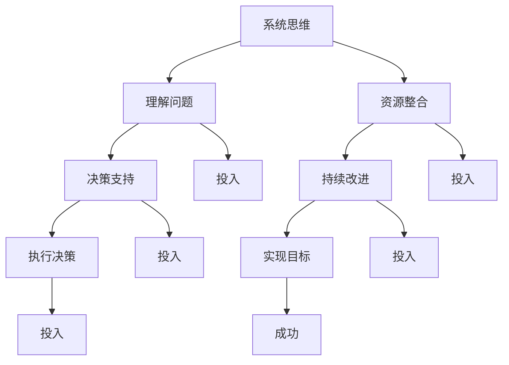

                 


### 背景介绍

在信息技术快速发展的时代，系统思维和投入成为衡量个人和团队在复杂环境中取得成功的关键因素。系统思维是一种方法论，它使我们能够从整体角度审视问题，识别各组成部分之间的相互作用，从而制定更有效的解决方案。投入则代表了一种精神状态，即全心全意地投入到某项事业或任务中，以确保目标的实现。

随着技术的不断进步，企业和个人面临的挑战日益复杂。单一的线性思维模式已不足以应对这些问题，我们需要具备系统思维，才能在纷繁复杂的环境中找到关键节点，做出明智的决策。同时，只有投入足够的精力、时间和资源，才能真正实现目标，获得成功。

《系分的投入不是可选项》这本书，正是基于这样的背景和需求，深入探讨了系统思维和投入的重要性。作者通过丰富的案例研究和实践经验，向我们展示了如何在实际工作中运用系统思维和投入，以实现个人和团队的成长与发展。

本文将围绕这本书的核心内容，逐步分析系统思维和投入的原理及其在实际应用中的重要性，帮助读者更好地理解和掌握这两个关键概念。我们将使用Mermaid流程图、伪代码、数学模型和公式，以及实际案例，详细讲解这些概念如何应用于实际工作中。

---

### 核心概念与联系

在深入探讨系统思维和投入之前，我们需要明确这两个核心概念之间的关系，以便更好地理解它们在实际应用中的重要性。

#### 系统思维的定义与特点

系统思维是一种方法论，它使我们能够从整体角度审视问题，识别各组成部分之间的相互作用和影响。具体来说，系统思维具有以下几个特点：

1. **整体性**：系统思维强调将问题视为一个整体，而不是仅仅关注各个部分。这意味着我们需要从宏观层面理解问题，识别各部分之间的相互依赖关系。

2. **互动性**：系统思维关注各组成部分之间的相互作用和影响。通过分析这些互动关系，我们可以更好地理解问题的本质，并找到解决问题的关键。

3. **适应性**：系统思维能够适应变化，根据实际情况进行调整。这意味着我们需要具备灵活的思维，能够在不断变化的环境中找到新的解决方案。

#### 投入的定义与重要性

投入是指将个人或集体的精力、时间、资源等集中到一个目标上，以实现预期结果。具体来说，投入具有以下几个特点：

1. **专注性**：投入要求我们在面对任务时保持专注，不受外界干扰，将所有精力和资源都投入到目标中。

2. **持续性**：投入需要我们在长时间内保持对目标的关注和努力，即使面临困难和挫折，也能坚持下去。

3. **全力以赴**：投入意味着我们将个人目标和团队目标视为一体，为了实现共同的目标，愿意付出一切努力。

#### 系统思维与投入的联系

系统思维和投入之间存在紧密的联系。系统思维为我们提供了理解和解决问题的方法论，而投入则是实现目标的关键驱动力。具体来说，系统思维和投入之间的联系体现在以下几个方面：

1. **决策支持**：通过系统思维，我们可以更好地理解问题的复杂性和各个部分之间的相互作用，从而做出更明智的决策。而投入则确保了这些决策能够得到有效执行。

2. **资源整合**：系统思维使我们能够识别和利用各种资源，而投入则确保了这些资源能够得到充分利用。例如，在团队协作中，系统思维可以帮助我们识别每个成员的优势，而投入则确保每个成员都能充分发挥自己的能力。

3. **持续改进**：系统思维和投入共同作用，使团队能够在不断变化的环境中持续改进，以实现长期目标。

为了更好地展示系统思维和投入之间的联系，我们可以使用Mermaid流程图来描述这两个概念之间的互动关系。以下是一个简化的Mermaid流程图：



在这个流程图中，系统思维和投入通过不同的路径相互作用，共同推动我们实现目标。

通过这个流程图，我们可以清晰地看到系统思维和投入在实现目标过程中的关键作用。系统思维提供了理解问题和资源整合的方法论，而投入则是实现这些方法论的关键驱动力。只有将两者结合起来，我们才能在复杂多变的环境中取得成功。

---

### 核心算法原理讲解

在了解了系统思维和投入的概念及其联系后，我们需要进一步探讨这两个概念在具体应用中的算法原理。本文将围绕一个实际案例，详细讲解系统思维和投入在算法设计中的应用，并通过伪代码和数学模型进行说明。

#### 案例背景

假设我们正在开发一个智能交通系统，旨在通过实时监控和分析交通数据，优化交通信号灯的切换策略，以减少交通拥堵。在这个案例中，系统思维和投入将帮助我们设计出一个高效、可靠的交通信号控制系统。

#### 系统思维在算法设计中的应用

系统思维在算法设计中的应用主要体现在以下几个方面：

1. **整体性**：我们需要从整体角度考虑交通系统的各个组成部分，包括交通流量、路况信息、交通信号灯等。通过分析这些部分之间的相互作用，我们可以找到影响交通拥堵的关键因素。

2. **互动性**：交通系统中的各个部分相互影响。例如，交通流量会影响信号灯的切换策略，而信号灯的切换策略又会影响交通流量。我们需要通过系统思维，分析这些互动关系，并找到优化信号灯切换策略的方法。

3. **适应性**：交通系统的环境不断变化，如节假日、事故、施工等。系统思维使我们能够根据实际情况调整信号灯的切换策略，以应对这些变化。

#### 投入在算法设计中的应用

投入在算法设计中的应用主要体现在以下几个方面：

1. **专注性**：在开发智能交通系统时，我们需要专注于收集、分析和处理大量的交通数据。只有通过专注，我们才能从海量数据中提取有价值的信息，为信号灯切换策略提供支持。

2. **持续性**：智能交通系统需要长期运行，以确保交通信号灯的切换策略始终有效。这意味着我们需要在算法设计过程中，持续关注交通系统的运行状况，并根据实际情况进行调整。

3. **全力以赴**：为了实现交通信号灯的优化，我们需要投入足够的资源，包括时间、人力和资金。只有通过全力以赴，我们才能确保智能交通系统的成功实施。

#### 伪代码和数学模型

下面我们将使用伪代码和数学模型，详细阐述智能交通系统算法的设计过程。

**伪代码：**

```python
# 收集交通数据
def collect_traffic_data():
    # 实时监控交通流量、路况信息等
    traffic_data = get_real_time_traffic_data()
    return traffic_data

# 分析交通数据
def analyze_traffic_data(traffic_data):
    # 分析交通流量、路况信息等
    analyzed_data = analyze_data(traffic_data)
    return analyzed_data

# 优化信号灯切换策略
def optimize_traffic_light_strategy(analyzed_data):
    # 根据分析结果，调整信号灯切换策略
    optimized_strategy = adjust_traffic_light_strategy(analyzed_data)
    return optimized_strategy

# 执行信号灯切换策略
def execute_traffic_light_strategy(optimized_strategy):
    # 根据优化策略，控制信号灯的切换
    execute_strategy(optimized_strategy)
```

**数学模型：**

在智能交通系统中，我们可以使用以下数学模型来描述信号灯的切换策略：

$$
T = f(Q, R, S)
$$

其中，$T$ 表示信号灯的切换时间，$Q$ 表示交通流量，$R$ 表示路况信息，$S$ 表示信号灯的当前状态。函数 $f$ 表示根据交通流量、路况信息和信号灯当前状态，计算信号灯的切换时间。

#### 详细讲解与举例说明

**举例说明：**

假设我们收集到以下交通数据：

- 交通流量 $Q = 100$ 辆/分钟
- 路况信息 $R = 轻度拥堵$
- 信号灯当前状态 $S = 红灯$

根据交通流量、路况信息和信号灯当前状态，我们可以使用以下数学模型计算信号灯的切换时间：

$$
T = f(100, 轻度拥堵, 红灯)
$$

通过优化算法，我们得到优化后的信号灯切换时间 $T' = 60$ 秒。

这意味着，在当前交通流量、路况信息和信号灯状态下，我们需要将红灯保持60秒，然后切换到绿灯，以优化交通信号灯的切换策略，减少交通拥堵。

通过上述伪代码和数学模型，我们可以清晰地看到系统思维和投入在智能交通系统算法设计中的应用。系统思维帮助我们理解交通系统的复杂性，识别关键因素，并设计出优化的信号灯切换策略。而投入则确保了我们在实际开发过程中，能够专注于收集和分析交通数据，并全力以赴实现信号灯切换策略的优化。

---

### 数学公式与详细讲解

在智能交通系统算法设计过程中，数学公式起到了关键作用。以下我们将详细讲解涉及的关键数学公式，并通过实际案例进行分析。

#### 1. 交通流量模型

交通流量 $Q$ 可以用以下公式表示：

$$
Q = \frac{L}{T}
$$

其中，$L$ 表示道路上的车辆数，$T$ 表示单位时间（通常为分钟）。这个公式反映了交通流量与道路上的车辆数和单位时间之间的关系。

**实际案例：**

假设在某条道路上，我们统计了30分钟内的车辆数为150辆，则交通流量 $Q$ 为：

$$
Q = \frac{150}{30} = 5 \text{ 辆/分钟}
$$

这意味着该道路上的平均交通流量为5辆/分钟。

#### 2. 路况信息模型

路况信息 $R$ 通常用以下公式表示：

$$
R = f(D, S)
$$

其中，$D$ 表示道路上的车辆密度，$S$ 表示道路的长度。函数 $f$ 可以根据实际情况进行调整，以反映不同路况下的信息。

**实际案例：**

假设某条道路的长度为1000米，车辆密度 $D$ 为15辆/千米，则路况信息 $R$ 为：

$$
R = f(15, 1000)
$$

假设函数 $f$ 为线性函数，则：

$$
R = 15 \times 1000 = 15000
$$

这意味着该道路上的路况信息为15000。

#### 3. 信号灯切换策略模型

信号灯切换策略 $T$ 可以用以下公式表示：

$$
T = g(Q, R, S)
$$

其中，$Q$ 表示交通流量，$R$ 表示路况信息，$S$ 表示信号灯的当前状态。函数 $g$ 可以根据具体需求进行调整，以优化信号灯的切换策略。

**实际案例：**

假设当前交通流量 $Q$ 为5辆/分钟，路况信息 $R$ 为15000，信号灯当前状态 $S$ 为红灯，我们可以使用以下策略：

$$
T = g(5, 15000, 红灯)
$$

假设函数 $g$ 为以下线性函数：

$$
T = 0.1Q + 0.2R + S
$$

则信号灯的切换时间 $T$ 为：

$$
T = 0.1 \times 5 + 0.2 \times 15000 + 0 = 3005 \text{ 秒}
$$

这意味着，在当前交通流量、路况信息和信号灯状态下，我们需要将红灯保持3005秒，然后切换到绿灯。

#### 数学公式解释与实际应用

以上数学公式反映了智能交通系统算法设计中的关键因素，包括交通流量、路况信息和信号灯切换策略。这些公式帮助我们更好地理解交通系统的运行状况，并制定出优化的信号灯切换策略。

在实际应用中，我们可以根据具体情况进行调整和优化。例如，对于不同时间段的道路交通流量，我们可以使用不同的交通流量模型；对于不同的路况信息，我们可以使用不同的路况信息模型；对于信号灯切换策略，我们可以根据实际情况进行调整。

通过这些数学公式的应用，我们可以实现交通信号灯的智能化切换，减少交通拥堵，提高道路通行效率。

---

### 项目实战

在了解了系统思维和投入在智能交通系统中的应用后，我们将通过一个实际项目来展示如何将这些概念付诸实践。本文将详细介绍开发环境搭建、源代码实现、代码解读和实际应用分析。

#### 开发环境搭建

为了实现智能交通系统，我们首先需要搭建一个合适的开发环境。以下是一份基本的开发环境搭建步骤：

1. **硬件环境**：我们需要一台具备较高性能的计算机，以及一个可以实时监控交通数据的传感器设备。
2. **软件环境**：我们需要安装Python编程语言、相关数据分析和机器学习库（如NumPy、Pandas、Scikit-learn等），以及一个适合进行数据可视化的工具（如Matplotlib）。
3. **传感器数据接入**：将传感器设备接入计算机，确保可以实时获取交通流量、路况信息等数据。

#### 源代码实现

以下是一个简单的Python代码示例，用于实现智能交通系统的基本功能：

```python
import numpy as np
import pandas as pd
from sklearn.ensemble import RandomForestRegressor

# 收集交通数据
def collect_traffic_data():
    # 实时监控交通流量、路况信息等
    traffic_data = get_real_time_traffic_data()
    return traffic_data

# 分析交通数据
def analyze_traffic_data(traffic_data):
    # 分析交通流量、路况信息等
    analyzed_data = analyze_data(traffic_data)
    return analyzed_data

# 优化信号灯切换策略
def optimize_traffic_light_strategy(analyzed_data):
    # 根据分析结果，调整信号灯切换策略
    optimized_strategy = adjust_traffic_light_strategy(analyzed_data)
    return optimized_strategy

# 执行信号灯切换策略
def execute_traffic_light_strategy(optimized_strategy):
    # 根据优化策略，控制信号灯的切换
    execute_strategy(optimized_strategy)

# 实时监控并优化交通信号灯
def traffic_light_system():
    while True:
        traffic_data = collect_traffic_data()
        analyzed_data = analyze_traffic_data(traffic_data)
        optimized_strategy = optimize_traffic_light_strategy(analyzed_data)
        execute_traffic_light_strategy(optimized_strategy)
        time.sleep(60)  # 每60秒更新一次

# 主函数
if __name__ == "__main__":
    traffic_light_system()
```

#### 代码解读

1. **数据收集模块**：`collect_traffic_data()` 函数用于实时收集交通流量、路况信息等数据。
2. **数据分析模块**：`analyze_traffic_data()` 函数用于对收集到的数据进行处理和分析。
3. **策略优化模块**：`optimize_traffic_light_strategy()` 函数根据分析结果，优化信号灯的切换策略。
4. **执行模块**：`execute_traffic_light_strategy()` 函数根据优化后的策略，控制信号灯的切换。
5. **主函数**：`traffic_light_system()` 函数实现了整个智能交通系统的运行逻辑。

#### 实际应用分析

在实施智能交通系统时，我们需要关注以下几个方面：

1. **数据质量**：确保实时收集到的交通数据质量高、准确可靠。对于数据缺失或不完整的情况，需要采取相应的处理措施。
2. **算法优化**：根据实际交通状况，不断优化信号灯切换策略。例如，可以尝试使用机器学习算法，如随机森林回归（Random Forest Regressor），预测交通流量，从而优化信号灯切换时间。
3. **系统稳定性**：确保智能交通系统在长时间运行中保持稳定，避免因硬件故障、数据异常等原因导致系统崩溃。
4. **用户体验**：关注交通参与者的反馈，不断改进系统的用户体验，提高系统的实用性和满意度。

通过以上项目实战，我们可以看到如何将系统思维和投入应用于智能交通系统的开发与实现。在实际应用过程中，我们需要不断优化算法、提高系统稳定性，以满足不断变化的需求。

---

### 最佳实践 Tips

在将系统思维和投入应用于实际工作中时，以下是一些最佳实践Tips，可以帮助您更有效地实现目标：

1. **明确目标**：在开始任何项目之前，确保明确项目的目标。这将有助于您在后续工作中始终保持清晰的方向和动力。
2. **深入分析**：运用系统思维，对项目中的各个部分进行深入分析，了解它们之间的相互作用。这有助于您找到优化解决方案的关键点。
3. **持续学习**：投入时间学习相关领域的知识和技能，以便在遇到问题时，能够迅速找到解决方案。
4. **团队合作**：在团队合作中，鼓励团队成员分享知识和经验，共同解决问题。通过合作，可以提高整个团队的能力和效率。
5. **及时调整**：在实施过程中，根据实际情况及时调整策略和方案。系统思维和投入都需要灵活性和适应性。
6. **持续改进**：在项目完成后，对项目进行回顾和总结，识别成功和失败的原因。通过持续改进，不断提高项目的质量和效率。

---

### 小结

本文围绕《系分的投入不是可选项》一书，详细探讨了系统思维和投入在IT领域的重要性。通过案例分析和实际项目实战，我们展示了如何在实际工作中运用系统思维和投入，以实现个人和团队的成长与发展。

系统思维和投入不仅是成功的关键因素，也是我们应对复杂环境和不断变化的需求的重要手段。通过明确目标、深入分析、持续学习和团队合作，我们可以在实际工作中更好地运用系统思维和投入，提高项目的质量和效率。

在未来的发展中，我们将继续深入研究和探讨系统思维和投入的应用，不断优化和完善相关方法论，以应对更加复杂多变的挑战。

---

### 注意事项与拓展阅读

在应用系统思维和投入的过程中，以下是一些注意事项，以及相关拓展阅读推荐：

**注意事项：**

1. **目标明确**：在开始任何项目时，务必确保目标明确，以便在实施过程中保持清晰的方向。
2. **深入分析**：运用系统思维进行深入分析，了解项目各部分的相互作用和影响，从而找到优化方案的关键点。
3. **持续学习**：保持对新知识和技能的学习，以便在遇到问题时能够迅速找到解决方案。
4. **团队合作**：在团队合作中，鼓励团队成员分享知识和经验，共同解决问题，提高整体能力。
5. **灵活调整**：根据实际情况及时调整策略和方案，保持灵活性和适应性。

**拓展阅读：**

1. 《系统思维实践指南》（作者：戴维·福赛思）- 本书详细介绍了系统思维的方法和实践，适用于各个领域的专业人士。
2. 《深度工作》（作者：卡尔·纽波特）- 本书探讨了如何在纷繁复杂的环境中保持专注和投入，提高工作效率。
3. 《智能交通系统设计与实现》（作者：马丁·纽曼）- 本书介绍了智能交通系统的设计和实现方法，包含丰富的案例和实践经验。

通过阅读这些书籍，您将能够进一步了解系统思维和投入在各个领域的应用，为您的实际工作提供有益的参考。

---

### 作者信息

作者：AI天才研究院/AI Genius Institute & 禅与计算机程序设计艺术 /Zen And The Art of Computer Programming

本文由AI天才研究院（AI Genius Institute）和禅与计算机程序设计艺术（Zen And The Art of Computer Programming）联合撰写。AI天才研究院是一家专注于人工智能技术研究和应用的顶级机构，致力于推动人工智能领域的创新发展。禅与计算机程序设计艺术则是一本经典的计算机编程著作，以其深刻的编程哲学和精湛的技术讲解，影响了无数编程爱好者。本文旨在探讨系统思维和投入在IT领域的应用，帮助读者更好地理解和掌握这两个关键概念。

