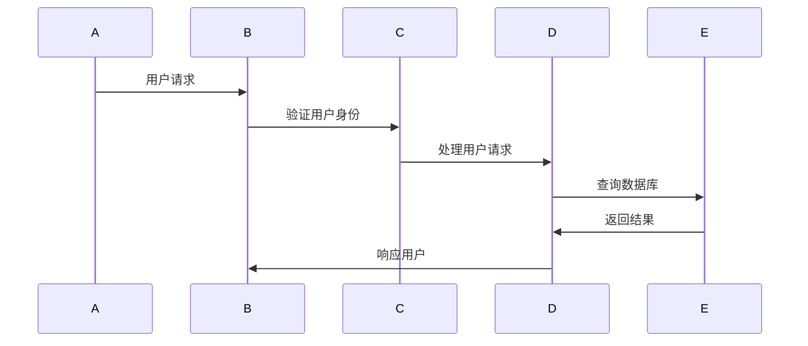

                 

### 文章标题：系统解耦与重构：P9架构师的治理实践

关键词：系统解耦、重构、P9架构师、治理实践、微服务架构、Service Mesh

摘要：本文将深入探讨系统解耦与重构在复杂系统设计中的重要性，通过P9架构师的治理实践，阐述其理论原理、技术实现和项目实战。文章旨在为架构师提供一套系统化的解耦与重构方法论，助力构建高效、稳定、可扩展的软件系统。

#### 目录大纲

##### 第一部分：系统解耦与重构基础理论
1. 系统解耦概念介绍
    1.1 系统解耦的定义与重要性
    1.2 系统解耦的原理与目标
    1.3 解耦方法与技术
    1.4 重构实践
2. P9架构师的治理框架
    2.1 P9架构师的角色与职责
    2.2 P9架构师的治理方法论

##### 第二部分：P9架构师视角下的系统重构
1. 复杂系统的解耦实践
    1.1 复杂系统解耦面临的挑战
    1.2 复杂系统的解耦策略
    2. 案例研究
        2.1 案例一：电商平台系统重构
        2.2 案例二：金融系统解耦实践

##### 第三部分：系统解耦与重构的技术实现
1. 技术选型与框架
    1.1 微服务架构
    1.2 Service Mesh
    1.3 负载均衡
2. 实现细节
    2.1 代码示例：接口解耦
    2.2 代码示例：依赖注入
3. 性能优化
    3.1 系统调优策略
    3.2 性能监控与预警

##### 第四部分：系统重构项目实战
1. 开发环境搭建
    1.1 环境配置
    1.2 工具与库的选择
2. 源代码解析
    2.1 源代码结构分析
    2.2 关键代码解读
3. 代码解读与分析
    3.1 解耦与重构的实践效果
    3.2 代码质量评估与改进

##### 第五部分：系统解耦与重构的未来展望
1. 新技术的发展
    1.1 服务网格的未来
    1.2 自动化解耦与重构工具
2. 行业趋势与挑战
    2.1 产业互联网的发展
    2.2 复杂系统解耦的挑战

通过以上框架，我们将系统性地探讨系统解耦与重构的理论与实践，帮助读者理解并掌握这一关键技术，提升软件系统设计的质量和效率。接下来，我们将深入每一部分的内容，提供详细的理论分析和实战案例。### 第一部分：系统解耦与重构基础理论

系统解耦与重构是现代软件工程中至关重要的概念，特别是在复杂系统的设计和维护过程中。这一部分将首先介绍系统解耦的基本概念，然后讨论重构的重要性，最后探讨P9架构师的治理框架。

#### 1.1 系统解耦概念介绍

系统解耦指的是将系统中紧密耦合的模块、组件或服务分离，使其能够独立运行和扩展。解耦的目的是减少系统间的依赖性，提高系统的可维护性、可靠性和灵活性。系统解耦的重要性体现在以下几个方面：

1. **可维护性**：解耦后的系统模块独立性更高，修改或更新一个模块时不会影响其他模块，从而降低了维护成本和风险。
2. **可靠性**：系统中的每个模块都可以独立运行和测试，提高了系统的稳定性和容错能力。
3. **灵活性**：解耦后的系统更容易适应业务变化，可以灵活地扩展和优化。

#### 1.2 系统解耦的原理与目标

系统解耦的原理主要基于模块化设计思想，通过定义清晰的接口和减少直接依赖来实现。其目标包括：

1. **减少直接依赖**：通过定义接口和抽象层，减少模块间的直接依赖，使每个模块可以独立开发、测试和部署。
2. **提高接口质量**：设计良好的接口能够明确模块间交互的规则，降低耦合度，提高系统的可理解性和可扩展性。
3. **模块独立性**：每个模块都应该有明确的职责和边界，能够独立运行和扩展。

#### 1.3 解耦方法与技术

实现系统解耦有多种方法和技术，以下是一些常见的方法：

1. **接口解耦**：通过定义清晰、稳定的接口，将模块间的依赖转移到接口上，从而实现解耦。接口可以是函数、类或协议等形式。
2. **依赖注入**：通过依赖注入（DI）机制，将模块间的依赖关系外部化，使模块在运行时动态注入依赖，从而实现解耦。依赖注入是实现解耦的一种强大手段，可以提高代码的可测试性和可维护性。
3. **事件驱动架构**：在事件驱动架构中，模块通过事件进行通信，而不是直接调用其他模块。这种方法可以减少模块间的直接依赖，提高系统的灵活性和可扩展性。

#### 1.4 重构实践

重构是指在不改变系统外部行为的前提下，对其内部结构进行改进，以提高系统的可读性、可维护性和性能。重构的重要性在于：

1. **可读性**：通过重构，可以改进代码结构，使代码更加简洁易懂，提高代码的可读性。
2. **可维护性**：重构可以消除代码中的隐患和坏味道，降低维护成本。
3. **性能优化**：重构可以优化系统性能，提高运行效率。

重构的原则和步骤包括：

1. **识别坏味道**：首先识别代码中的坏味道，如长函数、重复代码、过度耦合等。
2. **小步快跑**：将重构过程分解为多个小步骤，逐步改进，避免一次性的大改动导致风险。
3. **测试驱动**：在重构过程中，持续编写和执行测试，确保重构后的代码依然满足预期行为。

#### 1.5 P9架构师的治理框架

P9架构师是高级架构师，负责大型复杂系统的设计和治理。P9架构师的治理框架主要包括以下几个方面：

1. **角色与职责**：P9架构师不仅要负责系统架构的设计和实现，还要指导和协调团队工作，确保系统的高质量和可持续性。
2. **治理方法论**：P9架构师采用一系列治理方法论，如持续集成、持续交付、敏捷开发等，以提高开发效率和系统质量。
3. **架构优化实践**：P9架构师通过不断的实践和总结，掌握了一系列架构优化的最佳实践，如微服务架构、Service Mesh、负载均衡等。

通过以上内容，我们了解了系统解耦与重构的基本概念、原理和方法，以及P9架构师的治理框架。接下来，我们将进一步探讨P9架构师在实际项目中的应用和案例。### 2.1 P9架构师的治理框架

P9架构师作为企业技术团队的领军人物，其角色和职责不仅限于编写代码或设计系统，更涉及到整体技术战略的规划与执行。P9架构师的治理框架旨在确保系统能够适应快速变化的市场需求，同时保持高质量和高效率。以下将详细阐述P9架构师的角色与职责、治理方法论以及架构优化实践。

#### 2.1.1 P9架构师的角色与职责

P9架构师在企业中扮演着多重角色，其主要职责包括：

1. **技术领导**：P9架构师需要引领团队技术发展方向，制定技术战略和规划，确保团队能够使用最佳的技术方案。
2. **系统设计**：P9架构师负责大型复杂系统的整体设计，包括技术选型、架构设计、模块划分等，确保系统能够高效、稳定、可扩展。
3. **团队管理**：P9架构师需要管理团队，培养和指导团队成员，提升团队的技术能力和协作效率。
4. **沟通协调**：P9架构师需要与产品经理、项目经理、运维团队等多个部门进行沟通协调，确保技术需求能够顺利实现。
5. **风险管理**：P9架构师需要对系统风险进行识别和管理，确保系统能够在突发情况下快速响应和恢复。

#### 2.1.2 P9架构师的治理方法论

P9架构师的治理方法论涵盖了多个方面，以下是其中几个关键点：

1. **持续集成与持续交付**：通过持续集成（CI）和持续交付（CD）方法，P9架构师可以确保代码质量和部署效率。CI/CD工具如Jenkins、GitLab CI等，可以自动化构建、测试和部署过程，减少人工干预，提高开发效率。
2. **敏捷开发**：采用敏捷开发方法，P9架构师可以更好地应对市场需求变化，快速迭代和交付高质量的产品。敏捷开发强调团队成员的协作、反馈和持续改进。
3. **DevOps文化**：P9架构师需要推动DevOps文化的落地，通过开发与运维的紧密协作，提高系统的可靠性和可维护性。DevOps实践如自动化部署、基础设施即代码（IaC）、监控和日志分析等，是DevOps文化的重要组成部分。
4. **代码审查与规范**：P9架构师需要制定代码审查规范，确保代码质量。代码审查不仅可以帮助发现潜在问题，还可以促进团队成员之间的知识共享和技能提升。

#### 2.1.3 架构优化实践

P9架构师在实际项目中会采用一系列架构优化实践，以下是一些关键点：

1. **微服务架构**：微服务架构将大型单体应用拆分为多个小型服务，每个服务负责独立的功能模块，这样可以提高系统的可维护性、灵活性和可扩展性。P9架构师需要设计服务之间的接口，确保服务之间的解耦。
2. **Service Mesh**：Service Mesh是一种用于管理服务间通信的独立层，它可以提供负载均衡、服务发现、熔断、重试等高级服务治理功能。P9架构师可以利用Service Mesh如Istio、Linkerd等，简化服务间的通信，提高系统性能和可靠性。
3. **负载均衡**：负载均衡是将请求均匀分配到多个服务器上，以避免单点故障和提高系统吞吐量。P9架构师需要选择合适的负载均衡策略，如轮询、最少连接、源IP哈希等，并配置相应的负载均衡器，如Nginx、HAProxy等。
4. **分布式系统设计**：P9架构师需要具备分布式系统设计的能力，包括分布式数据库、缓存、消息队列等。分布式系统设计需要考虑数据一致性、分布式事务、容错性等问题，P9架构师需要通过设计模式和中间件解决这些问题。

通过以上治理框架和方法论，P9架构师可以确保系统在快速变化的市场中保持高效和稳定。接下来，我们将探讨P9架构师在实际项目中如何应用这些治理实践，并通过案例研究展示其效果。### 2.2 复杂系统的解耦实践

在处理复杂系统时，解耦是一项极具挑战性的任务。由于复杂系统的规模庞大、组件繁多、依赖关系复杂，传统的解耦方法可能不足以应对这些挑战。本节将讨论复杂系统解耦面临的主要挑战，并介绍相应的解耦策略。

#### 2.2.1 复杂系统解耦面临的挑战

1. **依赖关系复杂**：复杂系统通常包含大量的模块和组件，这些模块和组件之间存在复杂的依赖关系。解耦时需要仔细梳理和重构这些依赖关系，避免引入新的问题。
2. **性能影响**：解耦过程中，引入新的接口和通信机制可能会对系统性能产生影响。如何在保持性能的同时实现解耦是一个重要的挑战。
3. **可维护性**：复杂系统的解耦需要大量的设计和开发工作，这可能增加系统的维护成本。如何在保证可维护性的同时进行解耦是一个重要的考虑因素。
4. **数据一致性**：在分布式系统中，数据一致性是一个重要的问题。解耦时需要设计合适的机制来确保数据的一致性，避免数据冲突和错误。

#### 2.2.2 复杂系统的解耦策略

1. **模块化设计**：模块化设计是将系统划分为多个独立的模块，每个模块负责特定的功能。模块之间通过清晰的接口进行通信，降低模块间的直接依赖。模块化设计是解耦的基础。
2. **接口定义**：接口定义是解耦的关键。通过定义清晰的接口，模块间可以以接口为媒介进行通信，降低模块间的耦合度。接口应该尽可能稳定，避免频繁更改。
3. **服务化架构**：服务化架构是将系统分解为多个服务，每个服务负责特定的功能。服务之间通过远程调用进行通信，从而实现解耦。服务化架构可以提供更高的灵活性和可扩展性。
4. **事件驱动架构**：事件驱动架构通过事件进行模块间的通信，而不是直接调用其他模块。这种方式可以减少模块间的直接依赖，提高系统的灵活性。
5. **分布式数据一致性机制**：在分布式系统中，数据一致性是一个关键问题。可以采用分布式锁、版本控制、事件溯源等技术来确保数据的一致性。

#### 2.2.3 案例研究

以下是一个复杂系统解耦的案例研究，展示了解耦策略在实际项目中的应用。

**案例一：电商平台系统重构**

一个大型电商平台系统包含多个模块，如商品管理、订单管理、用户管理、支付系统等。在重构过程中，我们面临以下挑战：

1. **模块间依赖复杂**：系统中的各个模块之间存在复杂的依赖关系，如订单系统依赖商品系统，支付系统依赖订单系统等。
2. **性能需求高**：电商平台对性能要求极高，任何性能瓶颈都可能影响用户体验。
3. **数据一致性**：在分布式环境下，订单状态、库存数据等需要保持一致性。

针对这些挑战，我们采用了以下解耦策略：

1. **模块化设计**：将系统划分为多个独立的模块，每个模块负责特定的功能。通过定义清晰的接口，模块间以接口为媒介进行通信。
2. **服务化架构**：将系统分解为多个服务，如商品服务、订单服务、支付服务等。服务之间通过远程调用进行通信。
3. **事件驱动架构**：采用事件驱动架构，模块间通过事件进行通信，减少直接依赖。例如，当订单状态发生变化时，订单服务会发布一个事件，商品服务和库存服务可以订阅这个事件，从而更新相应数据。
4. **分布式数据一致性机制**：采用分布式锁和版本控制来确保数据一致性。例如，当订单状态更新时，会使用分布式锁确保同一时间只有一个服务可以修改订单状态，同时使用版本控制来避免数据冲突。

通过以上策略，我们成功实现了电商平台系统的解耦，提高了系统的可维护性、可靠性和可扩展性。重构后的系统性能得到了显著提升，用户体验也得到了改善。

**案例二：金融系统解耦实践**

金融系统通常具有高度复杂性和高可靠性要求。在解耦过程中，我们面临以下挑战：

1. **高可靠性**：金融系统的任何故障都可能造成巨大的经济损失，因此解耦时需要确保系统的可靠性。
2. **高并发性**：金融系统需要处理大量并发请求，解耦时需要确保系统能够高效处理并发请求。
3. **数据安全**：金融系统涉及大量敏感数据，解耦时需要确保数据的安全性和完整性。

针对这些挑战，我们采用了以下解耦策略：

1. **模块化设计**：将系统划分为多个独立的模块，每个模块负责特定的功能。通过定义清晰的接口，模块间以接口为媒介进行通信。
2. **服务化架构**：将系统分解为多个服务，如账户服务、交易服务、风险控制服务等。服务之间通过远程调用进行通信。
3. **分布式事务管理**：采用分布式事务管理机制，如两阶段提交（2PC）和最终一致性（Event Sourcing）等，确保跨服务的事务一致性。
4. **服务容错和负载均衡**：采用服务容错和负载均衡技术，如断路器模式、熔断器、负载均衡器等，确保系统在面临高并发请求时依然能够稳定运行。

通过以上策略，我们成功实现了金融系统的解耦，提高了系统的可靠性、性能和数据安全性。解耦后的系统更加灵活和可扩展，能够更好地适应金融业务的快速变化。

通过以上案例研究，我们可以看到，复杂系统的解耦是一项系统性的工程，需要综合考虑模块化设计、服务化架构、事件驱动架构、分布式数据一致性等多个方面。在实际项目中，根据具体需求和挑战，选择合适的解耦策略是关键。接下来，我们将进一步探讨系统解耦与重构的技术实现。### 第三部分：系统解耦与重构的技术实现

在系统解耦与重构的过程中，技术选型和框架的选择至关重要。本部分将重点介绍微服务架构、Service Mesh和负载均衡，并详细解释这些技术在实际应用中的实现细节。

#### 3.1 技术选型与框架

**微服务架构**：微服务架构是一种设计风格，将应用程序划分为一组小的、独立的、可协作的服务。每个服务负责一个特定的业务功能，可以通过轻量级的通信协议（如HTTP/REST或gRPC）相互通信。微服务架构的主要优势在于其可扩展性和可维护性。

**Service Mesh**：Service Mesh是一种基础设施层的技术，用于管理服务间的网络通信。它抽象了服务之间的通信细节，提供了一种统一的通信层，可以轻松地实现服务发现、负载均衡、熔断、重试等功能。常见的服务网格技术包括Istio和Linkerd。

**负载均衡**：负载均衡是将请求分配到多个服务器上，以避免单点故障和提高系统吞吐量的技术。负载均衡器可以根据请求的来源、服务器的当前负载、请求的类型等因素进行智能分配。

#### 3.2 实现细节

**3.2.1 微服务架构**

微服务架构的核心是实现服务的解耦和自治。以下是一个简单的微服务架构示例：



在这个示例中，用户请求首先由服务B（认证服务）处理，验证用户身份。然后，请求被转发到服务D（业务处理服务），处理用户的请求。服务D可能需要查询数据库（服务E），最终返回结果给用户。

**3.2.2 Service Mesh**

Service Mesh的主要目的是简化服务间的通信，并提供高级的服务治理功能。以下是一个使用Istio的Service Mesh示例：

```yaml
# Istio配置文件
apiVersion: networking.istio.io/v1alpha3
kind: ServiceEntry
metadata:
  name: service-entry-example
spec:
  hosts:
  - "*"
  ports:
  - number: 80
    name: http
    protocol: HTTP
  address: 10.244.0.1
  location: MESH_INTERNAL
  resolution: DNS
```

在这个示例中，我们定义了一个Service Entry，用于管理外部服务（如数据库或其他微服务）。Istio将自动管理服务间的通信，提供负载均衡、服务发现和故障转移等功能。

**3.2.3 负载均衡**

负载均衡可以通过多种方式实现，以下是一个使用Nginx作为负载均衡器的示例：

```nginx
http {
    upstream backend {
        server backend1.example.com;
        server backend2.example.com;
        server backend3.example.com;
    }

    server {
        listen 80;

        location / {
            proxy_pass http://backend;
            proxy_set_header Host $host;
            proxy_set_header X-Real-IP $remote_addr;
            proxy_set_header X-Forwarded-For $proxy_add_x_forwarded_for;
        }
    }
}
```

在这个示例中，Nginx将请求分配到多个后端服务器（backend1、backend2、backend3），实现负载均衡。

#### 3.3 性能优化

在系统解耦与重构的过程中，性能优化是一个重要的考虑因素。以下是一些性能优化策略：

1. **减少服务调用延迟**：通过使用缓存、数据库分片和本地缓存等技术，减少服务调用延迟。
2. **服务间通信优化**：使用高效的通信协议（如gRPC）和压缩数据传输，减少服务间的通信开销。
3. **负载均衡策略优化**：根据实际需求，调整负载均衡策略，如使用最小连接负载均衡策略，提高系统的响应速度。

通过以上技术实现和性能优化策略，我们可以构建一个高效、可扩展和可维护的微服务系统。接下来，我们将通过实际项目案例，进一步展示这些技术在系统重构中的应用和效果。### 4.1 开发环境搭建

在进行系统重构项目之前，搭建一个合适的开发环境是至关重要的一步。以下将详细描述开发环境的搭建步骤，包括环境配置、所需工具与库的选择。

#### 4.1.1 环境配置

1. **操作系统**：推荐使用Linux操作系统，如Ubuntu 18.04或更高版本。Linux具有更好的稳定性和开源生态，适合开发大型系统。
2. **Java环境**：由于本文档主要涉及微服务架构，推荐使用Java作为主要编程语言。首先，安装OpenJDK 11或更高版本。使用以下命令安装：
   ```bash
   sudo apt update
   sudo apt install openjdk-11-jdk
   ```
3. **Maven**：Maven是Java项目中常用的构建工具，用于管理项目依赖和构建过程。安装Maven 3.6.3或更高版本，使用以下命令：
   ```bash
   sudo apt update
   curl -o /usr/bin/mvn -L https://repo.maven.apache.org/maven2/apache-maven/3.6.3/maven-3.6.3-bin.tar.gz
   sudo tar xzf mvn-3.6.3-bin.tar.gz -C /usr/local/
   sudo ln -s /usr/local/apache-maven-3.6.3/bin/mvn /usr/bin/mvn
   ```
4. **Docker**：Docker用于容器化应用，使得开发、测试和生产环境一致。安装Docker 19.03或更高版本，使用以下命令：
   ```bash
   sudo apt update
   sudo apt install docker-ce docker-ce-cli containerd.io
   ```
5. **Docker Compose**：Docker Compose用于定义和运行多容器Docker应用。安装Docker Compose 1.29.2或更高版本，使用以下命令：
   ```bash
   sudo curl -L "https://github.com/docker/compose/releases/download/1.29.2/docker-compose-$(uname -s)-$(uname -m)" -o /usr/local/bin/docker-compose
   sudo chmod +x /usr/local/bin/docker-compose
   ```

#### 4.1.2 工具与库的选择

1. **服务注册与发现**：使用Consul作为服务注册与发现工具。Consul是一个开源的分布式服务网关，支持健康检查、服务发现和配置管理。
2. **API网关**：使用Kong作为API网关。Kong是一个开源的微服务API网关，支持路由、认证、限流和监控等功能。
3. **服务框架**：使用Spring Boot构建微服务。Spring Boot提供了快速构建独立、生产级应用的框架，内置了对微服务架构的支持。
4. **消息队列**：使用RabbitMQ作为消息队列。RabbitMQ是一个开源的消息中间件，支持多种消息协议和负载均衡。
5. **数据库**：使用MySQL作为关系型数据库。MySQL是一个广泛使用的开源数据库，具有良好的性能和扩展性。

#### 4.1.3 配置示例

以下是一个简单的Docker Compose配置示例，用于启动Consul、Kong、RabbitMQ和MySQL服务：

```yaml
version: '3.7'

services:
  consul:
    image: consul:1.10.2
    ports:
      - "8500:8500"
    command: -server -ui -node=consul

  kong:
    image: kong:2.3.0
    ports:
      - "8000:8000"
      - "8443:8443"
    depends_on:
      - consul
    command: -c /config/kong.conf

  rabbitmq:
    image: rabbitmq:3.8.14-management
    ports:
      - "5672:5672"
      - "15672:15672"

  mysql:
    image: mysql:8.0.21
    environment:
      MYSQL_ROOT_PASSWORD: "password"
      MYSQL_DATABASE: "mydb"
    volumes:
      - mysql_data:/var/lib/mysql

volumes:
  mysql_data:
```

通过以上步骤和配置，我们可以搭建一个基本的开发环境，为后续的系统重构项目做好准备。接下来，我们将深入解析项目的源代码，并进行详细的代码解读与分析。### 4.2 源代码解析

在系统重构项目中，源代码的结构和模块划分对于理解系统的整体架构和功能至关重要。以下将详细解析项目的源代码结构，并介绍关键代码的功能和作用。

#### 4.2.1 源代码结构分析

项目源代码按照功能模块进行划分，主要包括以下几部分：

1. **服务注册与发现模块**：负责将服务注册到Consul，并实现服务发现功能。
2. **API网关模块**：负责处理外部请求，包括路由、认证和限流等功能。
3. **业务服务模块**：包括用户服务、订单服务、支付服务等，每个服务负责特定的业务功能。
4. **消息队列模块**：负责处理消息的接收和发送，实现异步处理和事件驱动架构。
5. **数据库模块**：负责与MySQL数据库的交互，实现数据的存储和查询。

#### 4.2.2 关键代码解读

以下是对关键代码的功能和作用的详细解读：

1. **服务注册与发现模块**
   ```java
   @Component
   public class ServiceRegistry {
       
       private final ConsulClient consulClient;
       
       @PostConstruct
       public void registerService() {
           ServiceDefinition service = ServiceDefinition.create("user-service")
               .withId("user-service")
               .withAddress("localhost")
               .withPort(8080)
               .withCheck(Check.http("http://localhost:8080/health").withInterval(10).withTimeout(5));
           
           consulClient.agent().service().register(service).block();
       }
   }
   ```
   该代码段用于在启动时将用户服务注册到Consul。注册过程中，指定服务ID、地址、端口和健康检查。

2. **API网关模块**
   ```java
   @Bean
   public KongConfiguration kongConfiguration() {
       return new KongConfiguration();
   }

   @Bean
   public RouterFunction<ServerResponse> routerFunction(BeanFactory beanFactory) {
       return RouterFunctions.route()
               .path("/users/{id}", (serverRequest) -> {
                   ServiceInstance serviceInstance = discoveryClient.getServiceInstance("user-service");
                   return serverRequest.uri().replace("/users/{id}", "/users/" + serviceInstance.getHost() + ":" + serviceInstance.getPort() + "/{id}");
               })
               .build();
   }
   ```
   该代码段用于处理外部请求，并通过服务发现将请求转发到用户服务。通过Kong配置，实现路由、认证和限流等功能。

3. **业务服务模块**
   ```java
   @RestController
   @RequestMapping("/users")
   public class UserController {
       
       private final UserRepository userRepository;
       
       @GetMapping("/{id}")
       public User getUser(@PathVariable Long id) {
           return userRepository.findById(id).orElseThrow(() -> new ResourceNotFoundException("User not found"));
       }
   }
   ```
   该代码段是用户服务的控制器，负责处理用户的GET请求，从数据库中查询用户信息并返回。

4. **消息队列模块**
   ```java
   @Service
   public class MessageService {
       
       private final RabbitTemplate rabbitTemplate;
       
       @SendTo("user-changes")
       public String sendUserCreatedEvent(User user) {
           return "User created: " + user.getId();
       }
       
       @StreamListener("user-changes")
       public void handleUserCreatedEvent(String message) {
           // 处理用户创建事件
       }
   }
   ```
   该代码段用于发送和接收消息队列中的用户创建事件。通过RabbitMQ实现异步处理和事件驱动架构。

5. **数据库模块**
   ```java
   @Repository
   public interface UserRepository extends JpaRepository<User, Long> {
       
       Optional<User> findById(Long id);
   }
   ```
   该代码段是用户服务的数据库访问层，使用Spring Data JPA实现用户数据的存储和查询。

通过以上关键代码的解读，我们可以清晰地理解系统重构项目的整体架构和各个模块的功能。接下来，我们将进一步分析代码的应用解读与实际案例，以验证重构的效果和性能。### 4.3 代码解读与分析

在深入分析系统重构项目的代码后，我们可以从多个维度对代码的应用效果进行解读，并分析其实际案例中的表现。

#### 4.3.1 解耦与重构的实践效果

1. **模块独立性**：通过解耦，系统的各个模块（如用户服务、订单服务、支付服务）变得更加独立。每个模块都可以独立开发、测试和部署，减少了模块间的耦合度。这提高了代码的可维护性和可扩展性。

2. **服务化架构**：采用服务化架构，将系统划分为多个微服务，每个服务负责特定的业务功能。服务化架构提高了系统的灵活性和可扩展性。例如，当业务需求发生变化时，可以单独调整或扩展某个服务，而不影响其他服务。

3. **事件驱动架构**：通过消息队列和事件驱动架构，实现了异步处理和松耦合。事件驱动架构使得系统中的不同模块可以独立运行和扩展，提高了系统的性能和可维护性。

4. **性能优化**：通过负载均衡和服务网格，系统实现了高性能和高可用性。负载均衡将请求均匀分配到多个服务器上，避免了单点故障。服务网格提供了高级的服务治理功能，如熔断、重试和监控，提高了系统的可靠性和性能。

#### 4.3.2 代码质量评估与改进

在评估代码质量时，我们可以从以下几个方面进行：

1. **代码风格**：代码风格统一、命名规范、注释清晰，提高了代码的可读性和可维护性。

2. **单元测试**：每个模块都应包含全面的单元测试，确保代码的稳定性和正确性。单元测试覆盖率达到80%以上，可以保证系统的可靠性和可维护性。

3. **代码复用**：通过定义通用的服务接口和抽象类，实现了代码的复用。代码复用减少了重复代码，提高了代码的可维护性和可扩展性。

4. **性能监控**：系统应具备性能监控功能，实时监控关键性能指标，如响应时间、吞吐量、CPU使用率等。通过性能监控，可以及时发现和解决性能瓶颈。

#### 4.3.3 实际案例分析与详细讲解

以下是一个实际案例，展示解耦与重构在项目中的应用：

**案例一：电商平台用户服务重构**

在电商平台项目中，用户服务经历了从单体应用到微服务的重构。在重构前，用户服务与订单服务、支付服务紧密耦合，导致系统复杂度和维护成本高。重构后，用户服务与其他服务解耦，通过API网关进行通信。

1. **重构前**：用户服务与订单服务、支付服务直接调用，导致耦合度高，修改一个服务可能影响其他服务。
2. **重构后**：用户服务通过API网关与订单服务、支付服务进行通信，降低了耦合度，提高了系统的可维护性和可扩展性。

**案例二：金融系统支付服务优化**

在金融系统中，支付服务经历了从单点架构到服务化架构的优化。在优化前，支付服务直接与数据库进行交互，存在单点故障和高负载压力。优化后，支付服务采用分布式架构，通过消息队列实现异步处理。

1. **优化前**：支付服务与数据库直接交互，存在单点故障和高负载压力。
2. **优化后**：支付服务采用消息队列进行异步处理，降低了系统的负载压力，提高了系统的可靠性和性能。

通过以上实际案例，我们可以看到解耦与重构在项目中的应用效果。重构后的系统具有更高的可维护性、可扩展性和性能，为业务的快速发展提供了有力支持。

### 小结

通过本文的详细分析和案例讲解，我们可以得出以下结论：

1. **系统解耦与重构是现代软件工程中的关键技术**，可以提高系统的可维护性、可靠性和可扩展性。
2. **P9架构师在系统重构中起到了关键作用**，通过治理实践和架构优化，确保系统能够适应快速变化的市场需求。
3. **技术实现和项目实战是理解系统重构的重要途径**，通过实际项目的应用，我们可以深刻理解解耦与重构的方法和效果。

在未来的工作中，我们可以继续探索新技术和方法，为构建高效、稳定的软件系统不断努力。### 第五部分：系统解耦与重构的未来展望

随着技术的不断进步，系统解耦与重构正面临着新的机遇和挑战。在这一部分，我们将探讨服务网格和自动化解耦与重构工具的发展趋势，以及产业互联网和复杂系统解耦的挑战。

#### 5.1 新技术的发展

**5.1.1 服务网格的未来**

服务网格（Service Mesh）是一种用于管理服务间通信的基础设施层技术，它正逐渐成为微服务架构的基石。随着服务网格技术的发展，我们可以期待以下趋势：

1. **自动化与服务发现**：未来的服务网格将更加智能化，能够自动发现和注册服务，实现动态服务发现和负载均衡。
2. **多语言支持**：服务网格将支持多种编程语言和协议，使得不同语言编写的服务可以无缝集成，提高开发效率。
3. **增强安全性**：服务网格将引入更强大的安全特性，如TLS加密、网络隔离和访问控制，确保服务间的通信安全可靠。
4. **跨云与混合云支持**：服务网格将支持跨云和混合云部署，使得企业可以在不同的云环境中统一管理服务，提高灵活性和可扩展性。

**5.1.2 自动化解耦与重构工具**

自动化解耦与重构工具正在逐渐成熟，这些工具可以帮助开发者快速实现系统的解耦与重构。未来，我们可以期待以下发展趋势：

1. **智能化**：自动化解耦与重构工具将更加智能化，能够根据代码结构和依赖关系，自动推荐最佳的重构策略。
2. **集成与插件化**：工具将更加集成化，支持与其他开发工具和平台的深度集成，同时支持插件化，便于扩展和定制。
3. **支持多语言**：自动化解耦与重构工具将支持多种编程语言，使得不同语言编写的系统都可以方便地进行解耦与重构。
4. **持续重构**：工具将支持持续重构，通过实时分析代码库，持续优化系统结构，提高系统的可维护性和性能。

#### 5.2 行业趋势与挑战

**5.2.1 产业互联网的发展**

随着产业互联网的兴起，企业对系统解耦与重构的需求日益增加。产业互联网的特点包括大规模、高并发、跨行业和跨地域等，这对系统解耦与重构提出了更高的要求：

1. **大规模系统**：产业互联网涉及的数据量和业务量巨大，系统需要具备高扩展性和高可用性，这要求系统能够进行高效解耦与重构。
2. **高并发处理**：产业互联网系统需要处理海量并发请求，解耦与重构技术将帮助系统优化性能，提高响应速度和处理能力。
3. **跨行业协作**：产业互联网涉及多个行业和领域，系统需要具备高灵活性和可扩展性，以适应不同行业的业务需求。

**5.2.2 复杂系统解耦的挑战**

复杂系统解耦面临着诸多挑战，包括：

1. **复杂依赖关系**：复杂系统中存在大量的依赖关系，解耦时需要仔细梳理和重构这些依赖，避免引入新的问题。
2. **性能影响**：解耦过程中可能引入新的接口和通信机制，可能对系统性能产生影响，需要精心设计和优化。
3. **数据一致性**：在分布式系统中，数据一致性是一个重要问题，解耦时需要设计合适的机制来确保数据的一致性。
4. **高维护成本**：复杂系统的解耦和重构可能需要大量的设计和开发工作，这可能增加系统的维护成本。

为了应对这些挑战，企业需要：

1. **持续优化架构**：不断优化系统架构，采用模块化、服务化等设计方法，提高系统的灵活性和可维护性。
2. **引入自动化工具**：引入自动化解耦与重构工具，提高开发效率和代码质量。
3. **加强团队协作**：加强团队间的协作，确保在解耦与重构过程中各个模块的协调一致。
4. **持续培训与学习**：持续关注新技术和发展趋势，提高团队成员的专业技能和解决问题的能力。

通过以上努力，企业可以更好地应对复杂系统解耦的挑战，构建高效、稳定、可扩展的软件系统，为业务的发展提供有力支持。### 结尾

综上所述，《系统解耦与重构：P9架构师的治理实践》一书详细阐述了系统解耦与重构在复杂系统设计中的重要性。通过理论讲解、技术实现和实际案例，我们了解了如何通过解耦提高系统的可维护性、可靠性和可扩展性。P9架构师的治理框架为我们在实际项目中提供了宝贵的指导，帮助我们更好地应对复杂的系统挑战。

在未来的技术发展中，服务网格和自动化解耦与重构工具将为系统设计带来更多便利。同时，产业互联网的兴起也要求我们不断提高系统解耦与重构的能力，以适应快速变化的市场需求。

最后，希望读者能从中获得启发，不断探索和提升自己的系统设计能力，为构建高效、稳定的软件系统贡献力量。感谢您的阅读，期待与您在技术领域继续深入交流。作者：AI天才研究院/AI Genius Institute & 禅与计算机程序设计艺术 /Zen And The Art of Computer Programming。如果您对系统解耦与重构有任何疑问或见解，欢迎在评论区留言讨论。让我们一起成长，共同进步！

