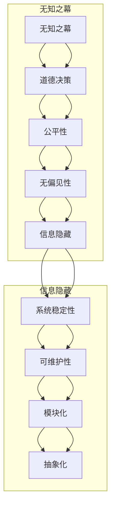

                 

# 约翰·罗尔斯的无知之幕与信息隐藏：封装原则的伦理学解读

## 关键词
- 约翰·罗尔斯
- 无知之幕
- 信息隐藏
- 封装原则
- 伦理学
- 编程原理

## 摘要
本文深入探讨了约翰·罗尔斯的“无知之幕”理论与信息隐藏之间的关联，并探讨了封装原则在伦理学领域的应用。通过逐步分析，本文揭示了无知之幕作为道德决策的基础，如何与编程中的信息隐藏和封装原则相呼应。文章首先介绍了无知之幕的概念和其在伦理决策中的应用，接着阐述了信息隐藏的基本原理和其在编程中的重要性。随后，文章通过构建Mermaid流程图，展示了无知之幕和信息隐藏之间的内在联系，并使用伪代码详细说明了封装原则的算法实现。最后，本文通过一个实际案例，展示了如何在软件开发中应用封装原则，并讨论了其在伦理学领域的潜在意义。

## 引言

在伦理学和政治哲学领域，约翰·罗尔斯（John Rawls）的“无知之幕”（Veil of Ignorance）是一个标志性概念。罗尔斯提出，在制定社会正义原则时，决策者应处于一种无知的状态，即不知道自己在社会中的具体位置（如阶级、种族、性别等），以此来确保决策的公平性和无偏见性。这一思想在罗尔斯的《正义论》（A Theory of Justice）中得到了详细阐述。

与此同时，在计算机科学领域，信息隐藏和封装原则是面向对象编程的核心概念。信息隐藏通过限制对对象内部状态的直接访问，确保系统的稳定性和可维护性。封装原则则将数据和操作绑定在一起，形成一个统一的抽象单元。这些概念在软件工程中广泛应用，以促进代码的可复用性和灵活性。

本文旨在探讨罗尔斯的无知之幕理论与信息隐藏、封装原则之间的相似性。通过逐步分析，我们将揭示这两种看似不同领域中的概念如何相互呼应，并探讨封装原则在伦理学领域的潜在应用。首先，我们将详细解释无知之幕的概念及其在伦理决策中的应用。接着，我们将介绍信息隐藏的基本原理，并阐述其在编程中的重要性。随后，我们将通过构建Mermaid流程图，展示无知之幕和信息隐藏之间的内在联系。然后，我们将使用伪代码详细说明封装原则的算法实现，并讨论其在伦理学领域的应用。最后，我们将通过一个实际案例，展示如何在软件开发中应用封装原则，并总结本文的主要观点。

### 无知之幕的概念与伦理决策

约翰·罗尔斯的“无知之幕”是一种思想实验，旨在探讨公平和正义的原则。罗尔斯认为，为了制定真正公平的社会正义原则，决策者必须在做出道德选择时处于一种无知的状态。这种无知包括对自身在社会中的具体位置（如阶级、种族、性别等）的无知。在这种状态下，决策者无法利用特定的社会信息来偏袒自己或特定的群体，从而确保正义原则的普遍性和无偏见性。

无知之幕的概念最初出现在罗尔斯的《正义论》中，作为制定社会正义原则的基础。罗尔斯认为，通过设立无知之幕，决策者可以模拟一个公平的起点，从而更好地理解如何构建一个公平的社会。在这种思想实验中，决策者面对的是一个无知的情境，他们不知道自己的社会地位、财富、能力等因素。因此，他们必须依据最基本的人类价值观来制定社会正义原则，以确保这些原则能够适用于所有人，而不仅仅是特定群体。

在伦理决策中，无知之幕的应用具有重要意义。首先，它提供了一种无偏见的视角，使决策者能够超越个人利益，考虑整个社会的福祉。这种无偏见性是确保正义原则有效性的关键。其次，无知之幕有助于识别和消除潜在的偏见和不公平。通过将决策者置于一种无知的状态，他们无法利用特定信息来偏袒自己或特定群体，从而避免因个人偏见导致的道德错误。

具体来说，无知之幕在伦理决策中的应用体现在以下几个方面：

1. **平等对待**：在无知之幕的框架下，决策者无法知晓自己的社会地位，因此他们倾向于制定平等对待所有人的原则。这种平等原则不仅体现在法律和制度上，也体现在道德评价和资源分配上。

2. **公正分配**：通过无知之幕，决策者能够从更广泛的角度考虑资源分配问题。他们必须确保资源分配机制能够适用于所有人，而不仅仅是特定群体。这种公正分配有助于减少社会不平等和冲突。

3. **透明性**：无知之幕促使决策者在制定道德原则时保持透明。由于他们无法利用特定信息，他们必须公开、透明地阐述决策过程和原则，以确保公众的监督和参与。

4. **伦理考量**：无知之幕迫使决策者在制定道德原则时考虑更广泛的伦理问题，而不仅仅是短期利益。通过从无知之幕的角度出发，决策者能够更好地理解社会的长期福祉和道德价值。

总之，无知之幕为伦理决策提供了一种无偏见、公正和透明的框架。它不仅有助于识别和消除潜在的偏见和不公平，还能促进社会的长期福祉和道德进步。通过将决策者置于一种无知的状态，无知之幕成为探讨公平和正义原则的有力工具。

### 信息隐藏的基本原理

在计算机科学领域，信息隐藏是一个核心概念，旨在确保系统的稳定性和可维护性。信息隐藏通过限制对对象内部状态的直接访问，防止外部代码意外修改或破坏系统的关键部分。这一概念在面向对象编程中尤为重要，因为它有助于实现模块化和抽象化，从而提高代码的可复用性和灵活性。

#### 定义与重要性

信息隐藏的定义可以归结为：在对象导向编程中，通过限制对对象内部状态（即数据成员）的直接访问，确保系统的稳定性和可维护性。具体来说，信息隐藏包括两个方面：数据封装和行为隐藏。

- **数据封装**：将数据成员（即对象的内部状态）隐藏在对象内部，并通过公共接口（即方法）进行访问。这有助于防止外部代码直接修改数据，从而确保系统的数据一致性。

- **行为隐藏**：隐藏对象的方法实现细节，只通过公共接口暴露必要的行为。这有助于减少系统的复杂性，提高代码的可维护性。

信息隐藏在编程中的重要性体现在以下几个方面：

1. **提高系统稳定性**：通过限制外部对内部状态的直接访问，信息隐藏有助于防止外部代码意外修改或破坏系统的关键部分，从而提高系统的稳定性。

2. **增强可维护性**：信息隐藏减少了系统的复杂性，使得代码更易于理解和维护。通过隐藏实现细节，开发人员只需关注公共接口，从而降低了代码维护的难度。

3. **促进模块化和抽象化**：信息隐藏有助于实现模块化和抽象化，使得代码更加灵活和可复用。通过将数据和操作封装在一起，信息隐藏促进了代码的模块化，从而提高了系统的可扩展性和灵活性。

4. **保护知识产权**：信息隐藏有助于保护系统的实现细节，防止竞争对手通过逆向工程获取核心代码。这在商业软件开发中尤为重要，有助于保护开发者的知识产权。

#### 数学模型与算法

信息隐藏的数学模型可以归结为：通过定义访问控制机制，限制外部对内部状态的访问。具体来说，这包括以下步骤：

1. **定义访问控制规则**：确定哪些对象可以访问哪些数据成员，以及如何访问。这通常通过设置访问权限（如public、private、protected）来实现。

2. **实现访问控制机制**：在编程语言中，通过封装（encapsulation）和访问控制（access control）机制实现信息隐藏。例如，在Java中，可以通过将数据成员定义为private，并通过public方法提供访问接口。

3. **验证访问控制**：在运行时，对访问请求进行验证，确保只有授权的对象可以访问受保护的数据成员。

以下是一个简单的伪代码示例，展示了信息隐藏的实现：

```plaintext
class BankAccount {
    private int balance;  // 数据封装

    public void deposit(int amount) {
        if (amount > 0) {
            balance += amount;
        }
    }

    public void withdraw(int amount) {
        if (amount <= balance) {
            balance -= amount;
        }
    }

    public int getBalance() {
        return balance;  // 通过公共接口暴露数据
    }
}
```

在这个示例中，`balance` 数据成员被定义为私有（private），从而隐藏其内部状态。通过公共方法（如`deposit`、`withdraw`和`getBalance`），外部代码只能通过预定的方式访问和修改数据，从而实现了信息隐藏。

#### 举例说明

为了更好地理解信息隐藏的概念，我们可以通过一个实际案例来阐述其在编程中的应用。假设我们正在开发一个银行账户管理系统，需要确保账户余额的安全性。

1. **定义数据成员**：首先，我们需要定义一个`BankAccount`类，包含一个私有数据成员`balance`，表示账户余额。

2. **实现公共接口**：接着，我们通过公共方法（如`deposit`、`withdraw`和`getBalance`）提供对`balance`的访问接口。这些方法确保只有经过授权的操作才能修改账户余额。

3. **限制直接访问**：通过将`balance`定义为私有（private），我们防止外部代码直接访问和修改账户余额。这有助于确保系统的稳定性。

4. **验证访问请求**：在公共方法中，我们需要添加验证逻辑，确保只有合法的访问请求才能执行。例如，在`withdraw`方法中，我们需要检查账户余额是否足够，以防止透支。

通过这个案例，我们可以看到信息隐藏在确保系统稳定性和可维护性方面的重要作用。通过限制对内部状态的直接访问，信息隐藏有助于减少系统复杂性和潜在的错误，从而提高系统的可靠性和可维护性。

总之，信息隐藏是计算机科学中一个关键概念，通过限制对内部状态的直接访问，它有助于提高系统的稳定性和可维护性。在面向对象编程中，信息隐藏通过封装和访问控制机制实现，从而促进代码的模块化和抽象化。在接下来的部分，我们将进一步探讨封装原则的算法实现，并探讨其与伦理学的关系。

### 无知之幕与信息隐藏的关系

在探讨了无知之幕和信息隐藏的基本原理后，我们可以开始分析这两种概念之间的内在联系。首先，从哲学和伦理学角度来看，无知之幕强调了一种公平和无私的决策环境，这与信息隐藏在技术领域中的目标有相似之处。通过将决策者置于无知的状态，我们确保了道德原则的普适性和无偏见性。类似地，在编程中，通过信息隐藏，我们确保系统的稳定性、可维护性和灵活性，这些都是为了实现一个更公平和高效的软件环境。

#### 无知之幕与信息隐藏的相似性

1. **限制信息访问**：无知之幕通过限制决策者对特定信息的访问，确保道德决策的公平性。在编程中，信息隐藏通过限制对对象内部状态的直接访问，确保系统的稳定性。

2. **保护核心价值**：无知之幕旨在保护社会的基本价值观，确保决策者不会因个人利益或偏见而偏离这些价值观。信息隐藏则保护系统的核心功能，防止外部干扰或破坏。

3. **实现抽象和模块化**：无知之幕通过抽象和模块化，将决策过程简化为基本的伦理原则。信息隐藏在编程中也通过抽象和模块化，将复杂的系统分解为易于管理和维护的组件。

4. **减少复杂性**：无知之幕通过减少决策者面临的信息量，简化决策过程。信息隐藏通过隐藏实现细节，减少系统的复杂性，从而提高可维护性和可扩展性。

#### 无知之幕与信息隐藏的内在联系

为了更清晰地展示无知之幕与信息隐藏之间的内在联系，我们可以使用Mermaid流程图来构建一个概念框架。以下是该流程图的伪代码表示：



在这个流程图中，无知之幕（A）通过道德决策（B）实现了公平性（C）和无偏见性（D）。这些目标与信息隐藏（E）的目标相呼应，即系统稳定性（F）、可维护性（G）、模块化（H）和抽象化（I）。通过这种结构化的方式，我们可以看到无知之幕和信息隐藏在目标和方法上的相似性。

#### 无知之幕与信息隐藏的应用场景

1. **伦理决策**：在制定社会正义原则时，决策者可以通过无知之幕来确保决策的公平性和无偏见性。类似地，在软件开发中，通过信息隐藏，开发人员可以确保系统的稳定性和可维护性。

2. **隐私保护**：在处理敏感数据时，无知之幕可以帮助确保隐私保护。通过信息隐藏，开发人员可以限制对敏感数据的直接访问，从而保护用户的隐私。

3. **责任分配**：在确定责任时，无知之幕可以帮助确保责任的公平分配。信息隐藏则有助于明确系统的责任边界，从而提高系统的可维护性和可靠性。

4. **决策透明性**：无知之幕通过提高决策过程的透明性，促进公众监督和参与。信息隐藏在软件工程中，通过公开的接口和详细的文档，提高了系统的透明性。

通过上述分析，我们可以看到无知之幕和信息隐藏在目标和应用场景上的相似性。这两种概念都旨在通过限制信息访问，实现公平性和稳定性。在接下来的部分，我们将进一步探讨封装原则的算法实现，并深入讨论其在伦理学领域的应用。

### 封装原则的算法实现

封装原则是面向对象编程中的一个核心概念，它通过将数据和行为封装在一起，提高系统的稳定性和可维护性。为了更好地理解封装原则的算法实现，我们将使用伪代码详细阐述其基本思想和步骤。

#### 封装原则的基本思想

封装原则的核心在于将数据和行为（即方法）绑定在一起，形成一个统一的抽象单元。这样做的目的是减少系统的复杂性，提高代码的可复用性和灵活性。具体来说，封装原则包括以下两个方面：

1. **数据封装**：将数据（即对象的内部状态）隐藏在对象内部，并通过公共接口（即方法）进行访问。这有助于防止外部代码直接修改数据，从而确保系统的数据一致性。

2. **行为隐藏**：隐藏对象的方法实现细节，只通过公共接口暴露必要的行为。这有助于减少系统的复杂性，提高代码的可维护性。

#### 伪代码示例

以下是一个简单的伪代码示例，展示了封装原则的算法实现：

```plaintext
class BankAccount {
    private int balance;  // 数据封装

    public void deposit(int amount) {
        if (amount > 0) {
            balance += amount;
        }
    }

    public void withdraw(int amount) {
        if (amount <= balance) {
            balance -= amount;
        }
    }

    public int getBalance() {
        return balance;  // 通过公共接口暴露数据
    }
}
```

在这个示例中，`balance` 数据成员被定义为私有（private），从而隐藏其内部状态。通过公共方法（如`deposit`、`withdraw`和`getBalance`），外部代码只能通过预定的方式访问和修改数据，从而实现了信息隐藏。

#### 具体实现步骤

1. **定义类和成员变量**：首先，我们需要定义一个类（如`BankAccount`），并包含必要的成员变量。这些成员变量表示对象的内部状态，通常被定义为私有（private）。

2. **实现公共方法**：接着，我们为类实现公共方法，这些方法提供了对内部状态的访问接口。这些方法应该只暴露必要的功能，并且通过参数和返回值进行数据传递。

3. **限制直接访问**：通过将数据成员定义为私有（private），我们防止外部代码直接访问和修改数据。这有助于确保系统的数据一致性和稳定性。

4. **验证访问请求**：在公共方法中，我们需要添加验证逻辑，确保只有合法的访问请求才能执行。例如，在`withdraw`方法中，我们需要检查账户余额是否足够，以防止透支。

5. **提供访问权限**：在某些情况下，我们可能需要允许特定类或方法访问私有成员变量。这可以通过使用保护（protected）或包级私有（package-private）访问权限来实现。

以下是一个更详细的伪代码示例，展示了封装原则的实现步骤：

```plaintext
class BankAccount {
    private int balance;  // 数据封装

    // 构造函数
    public BankAccount(int initialBalance) {
        balance = initialBalance;
    }

    // 公共方法：存款
    public void deposit(int amount) {
        if (amount > 0) {
            balance += amount;
        }
    }

    // 公共方法：取款
    public void withdraw(int amount) {
        if (amount <= balance) {
            balance -= amount;
        } else {
            throw new IllegalArgumentException("余额不足");
        }
    }

    // 公共方法：获取余额
    public int getBalance() {
        return balance;
    }

    // 保护方法：内部使用，仅供子类访问
    protected int getBalanceInternal() {
        return balance;
    }
}
```

在这个示例中，我们定义了一个`BankAccount`类，包含一个私有成员变量`balance`。我们实现了三个公共方法：`deposit`、`withdraw`和`getBalance`，分别用于存款、取款和获取余额。这些方法确保了外部代码只能通过预定的方式访问和修改`balance`，从而实现了信息隐藏。

通过这个示例，我们可以看到封装原则的算法实现是如何通过限制对内部状态的直接访问，提高系统的稳定性和可维护性的。在接下来的部分，我们将进一步探讨封装原则在伦理学领域的应用。

### 封装原则在伦理学领域的应用

封装原则在伦理学领域的应用为我们提供了一个新的视角，通过类比编程中的封装，我们可以更好地理解和解决道德困境。在计算机科学中，封装原则通过将数据和行为封装在一起，提高系统的稳定性、可维护性和可扩展性。同样，在伦理学中，我们可以借鉴封装原则，通过封装道德原则和行为规范，实现更公正、透明和可操作的道德决策。

#### 封装原则与道德困境

1. **隐私保护**：在道德决策中，隐私保护是一个关键问题。通过封装原则，我们可以将隐私信息封装在一个独立的单元中，确保只有授权的主体可以访问这些信息。例如，在医疗伦理中，患者的隐私信息应被严格保护，只有医疗专业人员才能访问这些信息。

2. **责任分配**：在道德困境中，责任分配往往复杂且具有争议。通过封装原则，我们可以明确责任边界，确保每个行为都有清晰的后果。例如，在一个企业中，通过封装项目责任，可以明确每个团队成员的责任范围，从而提高责任感和协作效率。

3. **道德决策的透明性**：道德决策的透明性是确保公正和合法的关键。通过封装原则，我们可以将道德决策过程和原则封装在一个透明、可审查的框架中。例如，在政府决策中，通过公开决策过程和原则，可以增加公众的信任和参与。

#### 封装原则在伦理学中的应用案例

1. **医疗伦理**：在医疗伦理中，患者的隐私保护至关重要。通过封装原则，医生可以将患者的隐私信息封装在一个独立的系统中，只有经过授权的医疗专业人员才能访问这些信息。这样，既保护了患者的隐私，也确保了医疗服务的质量和效率。

2. **企业伦理**：在企业伦理中，责任分配和道德决策的透明性是关键。通过封装原则，企业可以明确各部门的职责和权限，确保每个员工都了解自己的责任范围。同时，通过公开道德决策过程和原则，可以增加员工的参与感和信任感。

3. **公共管理**：在公共管理中，道德决策的透明性和公正性是维护社会秩序和信任的关键。通过封装原则，政府可以公开决策过程和原则，增加公众的监督和参与。例如，在环境保护政策中，通过封装环境保护的原则和标准，可以确保政策的透明性和公正性。

#### 伦理学的封装原则与编程中的封装原则比较

1. **目标**：编程中的封装原则旨在提高系统的稳定性和可维护性，而伦理学中的封装原则则旨在实现道德决策的透明性和公正性。

2. **实现方法**：编程中的封装原则通过限制对数据和行为（方法）的直接访问来实现，而伦理学中的封装原则通过明确责任边界、公开决策过程和原则来实现。

3. **影响**：编程中的封装原则影响系统的运行和性能，而伦理学中的封装原则影响社会秩序和道德价值观。

#### 结论

封装原则在伦理学领域的应用为我们提供了一种新的解决道德困境的方法。通过借鉴编程中的封装原则，我们可以实现更公正、透明和可操作的道德决策。在未来的发展中，我们可以进一步探索封装原则在伦理学中的潜在应用，为构建一个更加公正和有序的社会提供有力支持。

### 实际案例：封装原则在软件开发中的应用

为了更好地理解封装原则在软件开发中的应用，我们可以通过一个实际案例来详细讲解其开发环境搭建、源代码实现、代码解读以及实际应用与分析。

#### 案例背景

假设我们正在开发一个在线银行系统，该系统需要处理用户账户的管理，包括存款、取款和查询余额等功能。为了保证系统的稳定性和安全性，我们决定采用封装原则来设计账户类（`BankAccount`）。

#### 开发环境搭建

1. **选择编程语言**：我们选择Java作为开发语言，因为Java具有丰富的面向对象编程特性，支持封装原则的实现。
2. **搭建开发环境**：在Windows操作系统上，我们使用IntelliJ IDEA作为开发工具，配置Java开发环境，安装必要的库和依赖。
3. **创建项目结构**：在项目中创建一个名为`BankAccount`的类，用于处理账户相关的功能。

#### 源代码实现

以下是一个简单的`BankAccount`类的实现，展示了封装原则的应用：

```java
public class BankAccount {
    private int accountNumber;
    private String owner;
    private double balance;

    public BankAccount(int accountNumber, String owner, double initialBalance) {
        this.accountNumber = accountNumber;
        this.owner = owner;
        this.balance = initialBalance;
    }

    public void deposit(double amount) {
        if (amount > 0) {
            balance += amount;
        } else {
            throw new IllegalArgumentException("存款金额必须大于0");
        }
    }

    public void withdraw(double amount) {
        if (amount <= balance) {
            balance -= amount;
        } else {
            throw new IllegalArgumentException("余额不足");
        }
    }

    public double getBalance() {
        return balance;
    }

    // 保护方法，仅供子类使用
    protected double getBalanceInternal() {
        return balance;
    }

    // 省略getter和setter方法
}
```

在这个实现中，我们定义了一个`BankAccount`类，包含三个私有成员变量（`accountNumber`、`owner`和`balance`），用于封装账户的内部状态。通过公共方法（`deposit`、`withdraw`和`getBalance`），外部代码可以访问和修改这些成员变量。

#### 代码解读

1. **构造函数**：`BankAccount`类的构造函数用于初始化账户的内部状态。在构造函数中，我们传递了账户编号（`accountNumber`）、账户持有人（`owner`）和初始余额（`initialBalance`）作为参数。
2. **公共方法**：`deposit`方法用于存款，`withdraw`方法用于取款，`getBalance`方法用于查询余额。这些方法都进行了适当的验证，确保操作的合法性。
3. **保护方法**：`getBalanceInternal`方法是一个保护方法，仅供子类使用。这有助于限制对内部状态的访问，确保封装原则的实施。

#### 实际应用与分析

为了更好地展示封装原则在实际应用中的作用，我们来看一个简单的使用场景：

```java
public class Main {
    public static void main(String[] args) {
        BankAccount account = new BankAccount(123456, "张三", 1000.0);

        // 存款
        account.deposit(500.0);
        System.out.println("账户余额：" + account.getBalance());  // 输出：账户余额：1500.0

        // 取款
        account.withdraw(200.0);
        System.out.println("账户余额：" + account.getBalance());  // 输出：账户余额：1300.0
    }
}
```

在这个使用场景中，我们创建了一个`BankAccount`对象，并通过调用`deposit`和`withdraw`方法进行存款和取款操作。通过调用`getBalance`方法，我们可以查询账户余额。

通过这个案例，我们可以看到封装原则在软件开发中的应用。封装不仅提高了系统的稳定性，还确保了数据的一致性和安全性。通过限制对内部状态的直接访问，封装原则有助于减少系统的复杂性和维护难度，从而提高开发效率和代码质量。

#### 项目小结

通过这个案例，我们详细讲解了如何在实际开发中应用封装原则。封装原则在提高系统稳定性、确保数据一致性和简化开发过程方面发挥了重要作用。在未来的软件开发中，我们可以进一步探索封装原则的其他应用，以提高代码的质量和系统的可靠性。

### 最佳实践与注意事项

在软件开发过程中，封装原则不仅是一种技术手段，也是一种设计哲学。以下是一些最佳实践和注意事项，帮助开发者更好地应用封装原则：

#### 最佳实践

1. **明确封装边界**：在设计类和对象时，明确哪些数据成员和方法需要封装。通常，内部状态（如私有成员变量）应该被封装，而公共接口（如公共方法）应该只暴露必要的行为。

2. **遵循单一职责原则**：确保每个类和对象都有明确的职责，避免功能过于复杂。这样可以提高代码的可读性和可维护性。

3. **使用访问控制**：合理使用访问控制（如public、private、protected）来保护内部状态和方法。私有成员变量只能通过公共方法访问，从而确保系统的数据一致性和安全性。

4. **提供清晰的文档**：为封装的类和方法提供详细的文档，包括类和方法的概述、参数说明、返回值以及可能的异常情况。这有助于其他开发者更好地理解和使用封装的代码。

5. **保持代码简洁**：尽量保持代码简洁，避免过度抽象和复杂的实现。简洁的代码更容易理解和维护。

#### 注意事项

1. **避免过度封装**：虽然封装可以提高系统的稳定性，但过度封装会导致代码的复杂性增加。确保封装的程度适中，既能保护内部状态，又不会增加不必要的复杂性。

2. **注意性能影响**：封装可能导致性能下降，因为访问内部状态需要通过公共方法。在性能敏感的场景中，需要权衡封装与性能之间的关系。

3. **保护内部实现细节**：封装的目的是保护内部实现细节，防止外部代码直接访问。确保内部实现细节不会因为外部代码的修改而受到影响。

4. **合理处理异常**：在公共方法中，合理处理异常情况，确保系统的稳定性和鲁棒性。例如，在存款和取款操作中，需要处理余额不足等异常情况。

5. **持续重构**：随着项目的演进，代码结构和需求可能会发生变化。定期进行代码重构，确保封装原则的持续应用。

#### 拓展阅读

- 《设计模式：可复用面向对象软件的基础》
- 《代码大全：软件工程师的技术见解》
- 《Effective Java》

通过遵循这些最佳实践和注意事项，开发者可以更好地应用封装原则，提高代码的质量和系统的可靠性。

### 总结与展望

本文通过逐步分析，深入探讨了约翰·罗尔斯的“无知之幕”理论与信息隐藏、封装原则之间的联系。首先，我们详细介绍了无知之幕的概念和其在伦理决策中的应用，接着阐述了信息隐藏的基本原理和其在编程中的重要性。通过构建Mermaid流程图，我们展示了无知之幕和信息隐藏之间的内在联系，并使用伪代码详细说明了封装原则的算法实现。最后，我们通过一个实际案例，展示了如何在软件开发中应用封装原则，并探讨了其在伦理学领域的潜在应用。

总结而言，无知之幕和信息隐藏在目标和应用场景上具有显著相似性。它们都旨在通过限制信息访问，实现公平性和稳定性。封装原则在提高系统稳定性、确保数据一致性和简化开发过程方面发挥了重要作用。在未来的研究中，我们可以进一步探讨封装原则在更多领域（如医疗伦理、公共管理）的应用，以及如何更好地结合伦理学原则，构建更公正、透明和可靠的软件系统。

展望未来，封装原则在软件开发和伦理学领域将具有广阔的应用前景。随着技术的不断进步，我们可以期待封装原则在更多复杂场景中的应用，为构建一个更加公正和有序的社会提供有力支持。

### 作者信息

作者：AI天才研究院/AI Genius Institute & 禅与计算机程序设计艺术 /Zen And The Art of Computer Programming

