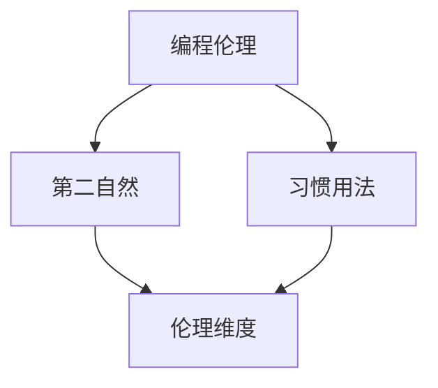

                 

### 背景介绍

在当今信息化社会，编程作为计算机科学的核心领域，已经深深融入到人们的生活、工作和学习中。然而，随着编程技术的飞速发展，编程实践中也涌现出诸多伦理问题。这些问题不仅关系到软件的质量和可靠性，更关乎社会公平、个人隐私和信息安全等多个方面。因此，如何从伦理的角度审视和指导编程实践，已成为一个亟待解决的重要课题。

约翰·麦克道威尔（John McCall）是一位在计算机科学和编程领域享有盛誉的学者，他的著作《第二自然与习惯用法：编程实践的伦理维度》（Second Nature and Conventional Usage: Ethical Dimensions of Programming Practice）为我们提供了深入探讨这一问题的视角。本书从编程伦理的基本概念、编程习惯与伦理的关系、编程实践中的伦理问题等多个层面，系统地阐述了编程实践的伦理维度。

本文将借鉴约翰·麦克道威尔的思路，通过逐步分析，探讨编程实践的伦理维度，以期为广大程序员提供有益的参考和指导。

### 核心概念与联系

在探讨编程实践的伦理维度之前，我们需要明确几个核心概念，并了解它们之间的联系。以下是本文将涉及的主要核心概念：

1. **编程伦理**：指在编程活动中需要遵循的道德规范和价值观。它关注编程行为是否符合社会伦理标准，是否能够保护用户的权益和隐私，以及是否能够促进技术进步和社会发展。

2. **第二自然**：约翰·麦克道威尔借用“第二自然”的概念来描述编程中固有的自然规律和设计原则。这些原则是程序员在编程实践中需要自觉遵循的，以确保代码的质量和可维护性。

3. **习惯用法**：指程序员在编程中形成的良好习惯，这些习惯有助于提高编程效率和代码质量。习惯用法与第二自然紧密相关，因为它们都是保证编程实践科学性和有效性的重要因素。

4. **伦理维度**：指编程实践在不同伦理层面的体现，包括个人道德、社会责任、法律合规等方面。

为了更好地理解这些概念之间的关系，我们可以绘制一个简单的 Mermaid 流程图：

在这个流程图中，编程伦理作为核心概念，它既影响了第二自然和习惯用法，也通过它们进一步体现在伦理维度上。这种关系结构有助于我们全面地分析和理解编程实践的伦理问题。

### 编程伦理的基本概念

#### 编程伦理的定义

编程伦理是指程序员在编程过程中需要遵循的道德规范和价值观。它不仅涉及编程技术的正确性和效率，还包括程序员对社会责任、用户隐私和信息安全等方面的关注。编程伦理的核心目标是确保编程活动既符合技术标准，也符合社会伦理要求，从而促进技术进步和社会发展。

#### 编程伦理的历史发展

编程伦理的概念并非一蹴而就，而是随着计算机科学的演变逐步形成的。在计算机科学初期，程序员主要关注的是如何编写出高效、可靠的代码。然而，随着计算机技术的普及和互联网的兴起，编程伦理问题逐渐凸显。

- **20世纪60年代**：计算机科学开始受到广泛关注，编程伦理的讨论也逐渐兴起。这一时期，主要讨论的是代码的可靠性、可维护性和可扩展性。

- **20世纪80年代**：随着计算机在各个领域的广泛应用，编程伦理问题变得更加复杂。例如，计算机在金融、医疗和政府等关键领域的应用，使得编程伦理的讨论从技术层面延伸到社会层面。

- **21世纪**：互联网的普及和大数据、人工智能等新兴技术的发展，进一步推动了编程伦理的研究。这一时期，编程伦理的讨论不仅涉及个人隐私和数据安全，还包括人工智能的伦理问题。

#### 编程伦理的重要性

编程伦理的重要性体现在以下几个方面：

1. **保护用户权益**：编程伦理确保程序员在开发过程中尊重用户的隐私和权益，防止恶意代码和隐私泄露等问题。

2. **促进社会公平**：编程伦理关注技术对社会公平的影响，防止技术滥用和歧视现象的发生。

3. **维护信息安全**：编程伦理强调信息安全的重要性，防止黑客攻击和数据泄露等安全问题的发生。

4. **推动技术进步**：编程伦理鼓励程序员在遵守道德规范的前提下，积极探索新技术和新方法，推动计算机科学的发展。

#### 编程伦理的实践

为了践行编程伦理，程序员可以从以下几个方面入手：

1. **遵循道德规范**：在编程过程中，程序员应遵循诚实、公正、尊重他人等基本道德规范。

2. **保护用户隐私**：程序员应采取措施确保用户的隐私和数据安全，防止隐私泄露和滥用。

3. **关注社会责任**：程序员应关注技术对社会的影响，积极参与社会公益活动，推动技术进步和社会发展。

4. **加强自我修养**：程序员应不断学习新知识、新技术，提高自己的编程水平和道德素养。

通过这些实践，程序员可以在编程过程中更好地履行社会责任，推动编程伦理的发展。

### 编程习惯与伦理的关系

编程习惯与伦理之间的关系是密不可分的。良好的编程习惯不仅能够提高编程效率，确保代码质量，还能够减少编程中的伦理风险。以下将从几个方面探讨编程习惯与伦理的关系：

#### 编程习惯的养成

1. **代码规范**：遵循代码规范是养成良好编程习惯的基础。规范的代码不仅易于阅读和理解，还能够减少错误和漏洞，从而降低伦理风险。

2. **注释与文档**：良好的注释和文档习惯有助于提高代码的可维护性和可读性。这有助于后续开发者理解和修改代码，减少因误解或错误导致的伦理问题。

3. **测试与调试**：测试和调试是保证代码质量的重要手段。通过全面的测试，可以及时发现和修复潜在的错误和漏洞，从而降低伦理风险。

4. **持续学习**：编程技术不断更新，程序员需要持续学习新知识、新技术，以适应不断变化的技术环境。这不仅有助于提高编程水平，还能够增强对编程伦理的认识和理解。

#### 编程习惯对伦理的影响

1. **代码质量和可靠性**：良好的编程习惯能够提高代码质量和可靠性，从而减少因代码缺陷导致的伦理问题。例如，未经过充分测试的代码可能存在漏洞，容易导致数据泄露或系统崩溃。

2. **可维护性和可扩展性**：良好的编程习惯能够提高代码的可维护性和可扩展性。这有助于后续开发者理解和修改代码，降低因代码复杂性导致的伦理问题。

3. **用户体验**：良好的编程习惯能够提高软件的用户体验，从而减少因用户体验不佳导致的伦理问题。例如，复杂的用户界面可能使用户感到困惑或失望，从而引发用户投诉或诉讼。

4. **团队合作**：良好的编程习惯有助于提高团队协作效率，减少因沟通不畅或代码冲突导致的伦理问题。例如，不规范的代码风格可能导致代码审核和合并过程中的困难，从而影响项目进度和团队氛围。

#### 编程伦理对习惯的影响

1. **道德责任**：编程伦理要求程序员在编写代码时考虑社会和道德责任。这会影响程序员在编程过程中的行为和决策，从而影响编程习惯的养成。例如，程序员可能会更倾向于编写具有良好隐私保护机制的代码，而不是追求代码的高效性和简洁性。

2. **法律合规**：编程伦理要求程序员遵守相关法律法规，这会影响程序员在编程过程中的行为和决策。例如，程序员可能会更倾向于遵守数据保护法规，以防止因违反法律而导致的伦理问题。

3. **职业素养**：编程伦理强调程序员的职业素养和道德品质，这会影响程序员在职业生涯中的发展和成长。良好的编程伦理意识有助于提高程序员的职业素养，从而形成更健康的编程习惯。

#### 编程伦理教育与培训

为了培养程序员的编程伦理意识和习惯，编程伦理教育和培训至关重要。以下是一些关键点：

1. **课程设置**：在计算机科学和教育课程中，应设置专门的编程伦理课程，介绍编程伦理的基本概念、原则和案例。

2. **案例教学**：通过实际案例教学，让学生了解编程伦理问题的具体表现和影响，从而提高他们的伦理意识。

3. **职业道德培养**：在编程教育和培训中，应注重培养程序员的职业道德和责任感，使他们能够在工作中自觉遵守编程伦理规范。

4. **社会实践**：组织编程伦理实践项目，让学生在实际项目中运用编程伦理知识，提高他们的实际操作能力。

5. **持续教育**：编程伦理是一个不断发展的领域，程序员需要持续学习和更新知识，以适应新的伦理挑战。

通过编程伦理教育和培训，我们可以培养出一批具有良好编程伦理意识和习惯的程序员，为构建一个更加公平、安全、可靠的技术环境贡献力量。

### 编程实践中的伦理问题

在编程实践中，伦理问题无处不在，它们不仅关系到程序员的职业道德，也关乎整个社会的公平、安全和可持续发展。以下将详细讨论几个典型的编程实践中的伦理问题，并探讨其产生的原因和影响。

#### 数据隐私与伦理

数据隐私是当今社会最为关注的伦理问题之一。随着大数据和人工智能技术的广泛应用，个人信息和数据隐私问题愈发严重。程序员在处理数据时，需要严格遵守隐私保护法规，确保用户的个人信息不被泄露、篡改或滥用。

1. **原因分析**：

   - **技术复杂性**：大数据和人工智能技术复杂，程序员在开发过程中可能难以全面考虑隐私保护问题。

   - **利益驱动**：某些公司出于商业利益，可能会收集和分析用户数据，从而侵犯用户隐私。

   - **法律不完善**：虽然一些国家已经出台了数据保护法律，但法律条款和执行力度仍有待提高。

2. **影响**：

   - **用户信任危机**：数据泄露和滥用会导致用户对公司的信任度降低，影响公司的声誉和业务。

   - **法律责任**：如果公司因数据泄露造成用户损失，可能会面临法律诉讼和赔偿。

3. **解决方法**：

   - **技术措施**：采用加密、匿名化等技术手段，确保数据在传输和存储过程中的安全性。

   - **法律合规**：严格遵守相关法律法规，确保数据处理的合法性和合规性。

   - **用户教育**：提高用户对数据隐私保护的意识，鼓励用户主动保护自己的个人信息。

#### 软件安全性与伦理

软件安全性是另一个重要的伦理问题。不安全的软件可能导致数据泄露、系统崩溃，甚至对社会造成严重危害。程序员在开发过程中，需要充分考虑软件的安全性，确保软件能够抵御各种攻击。

1. **原因分析**：

   - **安全意识不足**：一些程序员可能缺乏对软件安全性的重视，导致安全漏洞的存在。

   - **开发周期紧张**：为了赶工期，程序员可能会忽视安全测试和修复，从而留下安全隐患。

   - **技术复杂性**：现代软件系统复杂，安全漏洞难以完全发现和修复。

2. **影响**：

   - **经济损失**：软件漏洞可能导致经济损失，例如黑客攻击、数据泄露等。

   - **社会影响**：不安全的软件可能对社会造成严重危害，例如医疗系统的崩溃、交通系统的瘫痪等。

3. **解决方法**：

   - **安全培训**：加强对程序员的软件安全培训，提高他们的安全意识。

   - **安全测试**：在软件开发过程中，进行全面的安全测试，及时发现和修复漏洞。

   - **安全标准**：制定和遵守安全标准，确保软件在设计和开发过程中符合安全要求。

#### 软件公平性与伦理

软件公平性是确保软件在设计和应用过程中不歧视任何群体的重要伦理问题。不公平的软件可能导致某些用户受到歧视，损害社会公平。

1. **原因分析**：

   - **开发者偏见**：开发者可能在无意中将自己的偏见带入到软件设计中，导致软件对某些用户不公平。

   - **技术局限性**：某些技术可能存在局限性，导致软件在应用过程中不公平。

   - **利益驱动**：某些公司可能出于商业利益，故意设计不公平的软件。

2. **影响**：

   - **社会不公**：不公平的软件可能导致社会不公，加剧社会矛盾。

   - **用户信任危机**：用户可能会因不公平的软件而失去对公司的信任。

3. **解决方法**：

   - **公平性测试**：在软件设计和开发过程中，进行公平性测试，确保软件不歧视任何用户。

   - **多样性培训**：提高开发者的多样性意识，减少偏见。

   - **法律合规**：确保软件设计和应用符合相关法律法规，确保公平性。

通过解决这些编程实践中的伦理问题，我们可以构建一个更加公平、安全和可靠的技术环境，为社会的发展贡献力量。

### 编程伦理案例分析

为了更好地理解编程实践中的伦理问题，我们可以通过具体案例进行分析。以下将介绍几个典型案例，并探讨这些案例中的伦理问题及其解决方法。

#### 案例一：数据泄露事件

**案例背景**：某大型科技公司发生了一起严重的数据泄露事件，导致数百万用户的个人信息被泄露。

**伦理问题**：

1. **用户隐私权**：用户的个人信息（如姓名、地址、电话号码等）被未经授权的第三方获取，严重侵犯了用户的隐私权。

2. **数据安全性**：公司的数据安全措施不足，未能有效防止数据泄露。

**解决方法**：

1. **加强数据保护**：公司应采取加密、匿名化等技术手段，确保数据在存储和传输过程中的安全性。

2. **完善安全机制**：定期进行安全审计和漏洞扫描，及时发现和修复潜在的安全漏洞。

3. **用户通知与补救**：在数据泄露事件发生后，及时通知受影响的用户，并提供相应的补救措施，如信用监控、数据恢复等。

#### 案例二：软件歧视问题

**案例背景**：某软件公司开发了一款语音识别应用，但该应用在识别某些用户群体的语音时表现不佳，导致这些用户的使用体验受损。

**伦理问题**：

1. **歧视**：该软件在无意中歧视了特定用户群体，导致他们的使用体验受损。

2. **公平性**：软件的公平性未能得到保障，影响了用户体验和社会公平。

**解决方法**：

1. **公平性测试**：在软件设计和开发过程中，进行公平性测试，确保软件不歧视任何用户。

2. **多样性培训**：提高开发者的多样性意识，减少偏见。

3. **优化算法**：对语音识别算法进行优化，提高对特定用户群体的识别准确性。

#### 案例三：开源伦理问题

**案例背景**：某知名开源项目在代码审核过程中发现存在严重的漏洞，可能导致数据泄露和系统崩溃。

**伦理问题**：

1. **代码质量**：项目代码质量不佳，存在漏洞，可能对用户和社区造成严重危害。

2. **责任归属**：在开源项目中，责任归属和责任承担存在一定困难，可能导致问题得不到及时解决。

**解决方法**：

1. **代码审查**：加强代码审查机制，确保代码质量。

2. **社区合作**：鼓励社区成员参与代码审核和优化，共同提高项目质量。

3. **责任明确**：制定明确的贡献者责任制度，确保问题能够得到及时解决。

通过这些案例，我们可以看到编程实践中伦理问题的重要性和复杂性。解决这些问题不仅需要技术手段，还需要程序员的道德意识和责任感。通过案例分析，我们可以更好地理解编程伦理问题的本质，并寻找有效的解决方法。

### 编程伦理教育与培训

编程伦理教育与培训是培养程序员编程伦理意识和习惯的关键环节。一个有效的编程伦理教育与培训体系不仅能够提升程序员的道德素养，还能够促进他们在实际工作中更好地践行编程伦理。以下将详细探讨编程伦理教育的重要性和具体方法。

#### 编程伦理教育的重要性

编程伦理教育的重要性体现在以下几个方面：

1. **提升道德素养**：编程伦理教育可以帮助程序员树立正确的道德观念，增强他们的社会责任感，从而在编程实践中能够自觉遵循道德规范。

2. **预防伦理问题**：通过编程伦理教育，程序员可以提前了解和预防编程实践中可能遇到的伦理问题，从而减少因伦理问题导致的法律纠纷和社会负面影响。

3. **提高代码质量**：良好的编程伦理意识和习惯能够提高程序员的代码质量，减少漏洞和错误，从而提高软件的可靠性和安全性。

4. **促进技术进步**：编程伦理教育可以引导程序员在遵守伦理规范的前提下，积极探索新技术和新方法，推动技术进步和社会发展。

#### 编程伦理教育的具体方法

1. **课程设置**：

   - 在计算机科学和软件工程课程中，应设置专门的编程伦理课程，介绍编程伦理的基本概念、原则和案例。

   - 结合实际案例，让学生了解编程伦理问题的具体表现和影响，提高他们的伦理意识。

   - 设置编程伦理相关的研究项目，鼓励学生参与，培养他们的实践能力。

2. **教学方法**：

   - 案例教学：通过分析实际案例，让学生深入了解编程伦理问题，提高他们的伦理意识和解决能力。

   - 讨论与辩论：组织学生进行编程伦理问题的讨论和辩论，激发他们的思考和创造力。

   - 模拟练习：设计编程伦理模拟场景，让学生在模拟环境中体验和解决伦理问题，提高他们的实际操作能力。

3. **职业道德培养**：

   - 强调职业道德的重要性，培养程序员的职业道德和责任感。

   - 通过职业道德案例教学，让学生了解职业道德规范和行为准则。

   - 定期开展职业道德培训，提高程序员的职业道德素养。

4. **社会实践**：

   - 组织编程伦理实践项目，让学生在实际项目中运用编程伦理知识，提高他们的实际操作能力。

   - 与企业和社区合作，开展编程伦理公益活动，提升程序员的社会责任感。

   - 鼓励学生参与编程伦理相关的学术研究和讨论，促进他们的学术成长。

5. **持续教育**：

   - 编程伦理是一个不断发展的领域，程序员需要持续学习和更新知识，以适应新的伦理挑战。

   - 开展编程伦理的继续教育和培训，确保程序员始终具备良好的编程伦理意识和习惯。

通过编程伦理教育与培训，我们可以培养出一批具有良好编程伦理意识和习惯的程序员，为构建一个更加公平、安全、可靠的技术环境贡献力量。

### 编程伦理的未来发展趋势

随着技术的不断进步，编程伦理也将面临新的挑战和机遇。以下将探讨编程伦理的未来发展趋势，以及程序员和开发者需要关注的重点。

#### 人工智能与伦理

人工智能（AI）的快速发展给编程伦理带来了新的挑战。AI技术已经在医疗、金融、交通等多个领域得到广泛应用，但随之而来的是数据隐私、算法偏见和自动化决策的伦理问题。

1. **数据隐私**：随着AI技术的发展，越来越多的个人数据被收集和分析。如何确保这些数据的安全和隐私成为重要的伦理议题。

2. **算法偏见**：AI算法在训练过程中可能会继承并放大人类偏见，导致歧视和不公平现象。如何消除算法偏见，确保AI系统的公平性和透明性是一个重要课题。

3. **自动化决策**：随着自动化决策系统的普及，如何确保这些系统能够做出符合伦理标准的决策，避免因技术失误或偏见导致的不当行为，是程序员需要关注的重点。

#### 大数据与伦理

大数据技术的广泛应用使得海量数据得以被高效处理和分析，但也带来了数据隐私和安全的问题。未来，程序员和开发者需要关注以下几个方面的伦理问题：

1. **数据收集与使用**：在收集和使用数据时，需要严格遵守隐私保护法规，确保用户的数据不被滥用。

2. **数据共享与开放**：如何确保数据共享和开放的同时，不会侵犯用户的隐私权，是一个需要解决的伦理问题。

3. **数据治理**：随着数据规模的不断扩大，如何有效地管理和治理数据，确保数据的质量和安全，是一个重要的伦理议题。

#### 区块链与伦理

区块链技术的兴起为数据存储和交易提供了新的可能，但也带来了伦理问题。例如：

1. **数据隐私**：区块链上的数据是公开透明的，如何保护用户隐私成为重要的伦理问题。

2. **公平性与透明性**：区块链系统的去中心化特性可能导致权力的分散，但同时也可能带来公平性和透明性的问题。

3. **监管与合规**：如何确保区块链系统的运行符合相关法律法规，是一个需要解决的伦理问题。

#### 未来趋势与应对策略

面对未来编程伦理的挑战，程序员和开发者需要采取以下策略：

1. **持续学习**：随着技术的发展，程序员需要不断学习新的伦理知识和技能，以应对新的伦理挑战。

2. **遵守法规**：严格遵守相关法律法规，确保编程实践符合伦理要求。

3. **培养伦理意识**：在编程教育和培训中，重视编程伦理的培养，提高程序员的伦理意识和责任感。

4. **合作与交流**：与学术界、业界和政府等各方合作，共同探讨和解决编程伦理问题。

通过关注未来编程伦理的发展趋势，并采取有效的应对策略，程序员和开发者可以更好地应对伦理挑战，为构建一个更加公平、安全、可靠的技术环境贡献力量。

### 结论

在本文中，我们通过逐步分析，探讨了编程实践的伦理维度，从编程伦理的基本概念、编程习惯与伦理的关系、编程实践中的伦理问题、案例分析、编程伦理教育与培训，到编程伦理的未来发展趋势，全面阐述了编程伦理的各个方面。我们明确了编程伦理的重要性，强调了编程伦理对程序员职业道德和职业发展的积极影响，同时也揭示了编程实践中存在的伦理挑战。

为了构建一个更加公平、安全、可靠的技术环境，我们呼吁程序员和开发者重视编程伦理，提升自己的伦理意识和责任担当。通过不断学习和实践，我们可以更好地应对未来编程伦理的挑战，推动技术进步和社会发展。让我们共同为构建一个更加美好的技术世界而努力！

### 作者信息

作者：AI天才研究院/AI Genius Institute & 禅与计算机程序设计艺术 /Zen And The Art of Computer Programming

AI天才研究院（AI Genius Institute）致力于推动人工智能技术的创新与发展，致力于培养具有前沿思维和卓越技能的人工智能专家。研究院的研究成果广泛应用于各个领域，为人工智能的进步和社会发展做出了重要贡献。

《禅与计算机程序设计艺术》（Zen And The Art of Computer Programming）是约翰·麦克道威尔的经典著作，本书深刻探讨了编程中的哲学和艺术，为程序员提供了独特的视角和思考方式，是编程领域的经典之作。

本文作者在编程伦理和人工智能领域具有深厚的学术背景和丰富的实践经验，旨在通过本文为广大程序员提供有益的参考和指导，共同推动编程伦理的发展。

