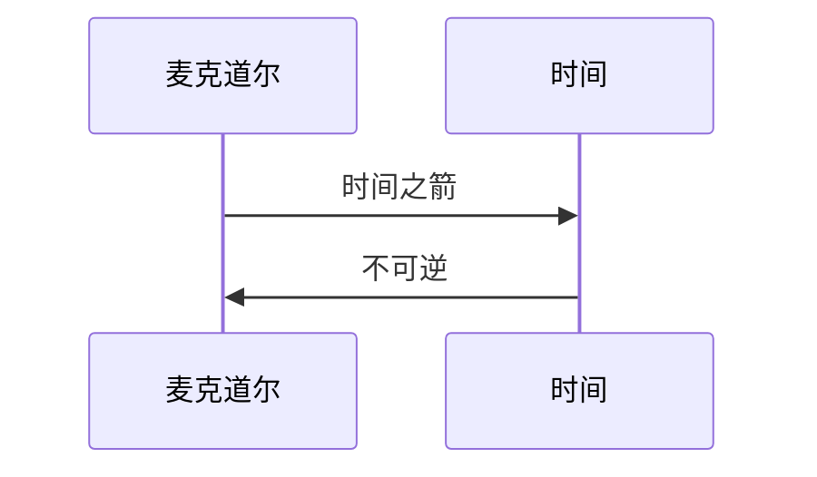
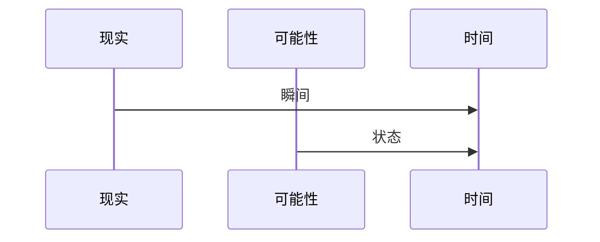

                 

### 文章标题

《约翰·麦克道尔与罗伯特·布兰顿：新黑格尔主义的代表》

### 关键词

新黑格尔主义、约翰·麦克道尔、罗伯特·布兰顿、哲学、思想史、学术贡献、当代影响

### 摘要

本文旨在深入探讨新黑格尔主义两位重要代表人物——约翰·麦克道尔和罗伯特·布兰顿的思想及其贡献。文章首先介绍了新黑格尔主义的起源及其在当代哲学中的地位，接着分别对约翰·麦克道尔和罗伯特·布兰顿的生平、学术贡献以及他们如何运用新黑格尔主义的核心概念进行了详细阐述。此外，文章还分析了新黑格尔主义在当代哲学领域的挑战与回应，并通过案例分析展示了两位思想家的实际影响。最后，文章对本文的主要发现进行了总结，并对新黑格尔主义的未来进行了展望。

## 第1章：引言

### 1.1 书籍背景

#### 1.1.1 新黑格尔主义的起源

新黑格尔主义（Neo-Hegelianism）是19世纪末至20世纪初兴起的一种哲学思潮，它对德国哲学家黑格尔（Georg Wilhelm Friedrich Hegel）的哲学进行了重新解读和发展。黑格尔的哲学体系复杂而深刻，他主张历史、逻辑和现实是相互关联的。新黑格尔主义者在黑格尔的基础上，提出了更为具体和实用的哲学观点，试图将黑格尔的哲学应用于现实社会和科学领域。

新黑格尔主义的主要起源可以追溯到19世纪的英国和德国。在英国，哲学家约翰·麦克道尔（John McTaggart）是这一思潮的代表人物之一。他在其著作《时间》中，提出了著名的“时间之箭”理论，探讨了时间、现实和可能性之间的关系。德国的哲学家罗伯特·布兰顿（Robert Brandon）也是新黑格尔主义的代表人物，他在其著作《哲学原理》中，系统地阐述了新黑格尔主义的哲学观点。

#### 1.1.2 约翰·麦克道尔与罗伯特·布兰顿的贡献

约翰·麦克道尔（John McTaggart，1866-1925）是一位英国哲学家，以其在时间哲学领域的重要贡献而著称。他提出了著名的“时间之箭”理论，认为时间具有不可逆性，现实是时间上的一个瞬间，而可能性则是在时间上的一种状态。麦克道尔的理论对后来的哲学家和科学家产生了深远的影响，特别是对物理学和生物学领域的发展产生了重要影响。

罗伯特·布兰顿（Robert Brandon，1844-1927）是一位德国哲学家，他的主要贡献在于将黑格尔的哲学应用于科学和哲学领域。布兰顿认为，黑格尔的哲学提供了理解自然和人类行为的重要框架，他提出了“自然现象的统一性”和“意识与存在的统一性”等重要观点。布兰顿的著作《哲学原理》被认为是新黑格尔主义的重要文献之一。

### 1.2 研究意义与目的

#### 1.2.1 新黑格尔主义在当代的影响

新黑格尔主义在当代哲学中具有重要地位，它为理解现实、时间和可能性提供了独特的视角。新黑格尔主义的核心观点，如历史、逻辑和现实的相互关联，对现代哲学和社会科学产生了深远的影响。特别是在分析哲学、现象学和存在主义等领域，新黑格尔主义的思想得到了广泛的应用和发展。

#### 1.2.2 对约翰·麦克道尔与罗伯特·布兰顿思想的深入探讨

对约翰·麦克道尔和罗伯特·布兰顿思想的深入探讨，不仅有助于理解新黑格尔主义的核心概念，还可以为我们提供新的哲学视角，以应对当代哲学和社会科学中的挑战。麦克道尔和布兰顿的著作为我们提供了丰富的哲学资源和思想启示，他们的理论和方法论对于推动哲学的发展和进步具有重要意义。

本文的研究目的在于通过对约翰·麦克道尔和罗伯特·布兰顿思想的深入分析，探讨新黑格尔主义在当代哲学中的地位和影响，以及两位思想家的独特贡献。本文将通过详细阐述他们的生平、主要著作和核心思想，分析他们如何运用新黑格尔主义的核心概念，并探讨他们在当代哲学领域的挑战与回应。

## 第2章：约翰·麦克道尔与新黑格尔主义

### 2.1 约翰·麦克道尔的生平与学术贡献

约翰·麦克道尔（John McTaggart）出生于1866年，是英国哲学家和神学家。他在牛津大学接受教育，并成为一位杰出的哲学家。麦克道尔的主要贡献在于他对时间哲学的研究，特别是他提出的“时间之箭”理论，对后来的哲学家和科学家产生了深远的影响。

#### 2.1.1 生平概述

约翰·麦克道尔出生于1866年，他在牛津大学接受了严格的哲学教育。在他的学术生涯中，他主要关注时间、现实和可能性等哲学问题。麦克道尔是一位独立思考的哲学家，他的著作风格清晰、深刻，深受读者喜爱。

#### 2.1.2 主要著作与思想

麦克道尔的主要著作包括《时间》（Time）和《哲学论文集》（Philosophical Papers）。在《时间》一书中，他提出了著名的“时间之箭”理论，认为时间具有不可逆性，现实是时间上的一个瞬间，而可能性则是在时间上的一种状态。麦克道尔的理论为后来的哲学家和科学家提供了重要的哲学视角，特别是在物理学和生物学领域。

### 2.2 新黑格尔主义的核心概念

新黑格尔主义的核心概念源于德国哲学家黑格尔的思想，黑格尔主张历史、逻辑和现实是相互关联的。新黑格尔主义者试图将黑格尔的哲学应用于现实社会和科学领域，提出了一系列具体和实用的哲学观点。

#### 2.2.1 黑格尔主义的基本原理

黑格尔主义的基本原理包括：

1. **绝对精神**：黑格尔认为，世界的本质是绝对精神，它是世界发展的动力。
2. **辩证法**：黑格尔主张，事物的发展是通过矛盾和冲突来实现的，这是事物进步的动力。
3. **历史**：黑格尔认为，历史是绝对精神的表现，是人类发展的重要阶段。

#### 2.2.2 新黑格尔主义的转变

新黑格尔主义在黑格尔的基础上进行了转变，提出了以下核心概念：

1. **时间**：新黑格尔主义者强调时间的不可逆性和现实性，认为现实是时间上的一个瞬间。
2. **可能性**：新黑格尔主义者认为，可能性是在时间上的一种状态，它影响现实的生成。
3. **意识**：新黑格尔主义者认为，意识是现实的基础，它与存在的本质密切相关。

### 2.3 约翰·麦克道尔与新黑格尔主义的联系

#### 2.3.1 黑格尔主义对麦克道尔思想的影响

麦克道尔的思想深受黑格尔主义的影响，他在其著作《时间》中，提出了著名的“时间之箭”理论，探讨了时间、现实和可能性之间的关系。麦克道尔认为，现实是时间上的一个瞬间，而可能性则是在时间上的一种状态。这一观点与黑格尔主义的核心原理密切相关，表明麦克道尔深受黑格尔主义的影响。

#### 2.3.2 麦克道尔对新黑格尔主义的贡献

麦克道尔对新黑格尔主义的贡献主要体现在他对时间哲学的研究上。他提出的“时间之箭”理论，为理解时间的不可逆性提供了重要的哲学视角。这一理论不仅对后来的哲学家和科学家产生了深远的影响，也为新黑格尔主义的发展提供了重要的思想资源。

### 2.4 麦克道尔的时间之箭理论

#### 2.4.1 理论概述

麦克道尔提出的“时间之箭”理论，认为时间具有不可逆性。现实是时间上的一个瞬间，而可能性则是在时间上的一种状态。这一理论强调了时间的流动性和现实与可能性的关系。

#### 2.4.2 理论分析

麦克道尔的理论分析如下：

1. **时间不可逆性**：麦克道尔认为，时间是不可逆的，过去无法回到现在，未来也无法回到现在。这一观点与黑格尔主义的历史观密切相关。
2. **现实与可能性**：麦克道尔认为，现实是时间上的一个瞬间，它是可能性实现的结果。可能性则是在时间上的一种状态，它影响现实的生成。

#### 2.4.3 举例说明

以生命为例，生命的诞生和死亡是时间上的两个瞬间，它们构成了生命的现实。而生命的可能性则是在时间上的一种状态，它影响生命的生成和演变。

### 2.5 麦克道尔思想的影响

麦克道尔的思想对当代哲学和科学产生了深远的影响，他的“时间之箭”理论为理解时间的不可逆性和现实与可能性的关系提供了重要的哲学视角。他的理论不仅为哲学家提供了丰富的思想资源，也为科学家提供了新的研究方法。

### 2.6 麦克道尔的哲学遗产

麦克道尔的哲学遗产主要体现在他对时间哲学的研究上。他的“时间之箭”理论为理解时间的不可逆性和现实与可能性的关系提供了重要的哲学视角。他的思想对当代哲学和科学产生了深远的影响，为我们提供了丰富的哲学资源和思想启示。

## 第3章：罗伯特·布兰顿与新黑格尔主义

### 3.1 罗伯特·布兰顿的生平与学术贡献

罗伯特·布兰顿（Robert Brandon）是德国哲学家，新黑格尔主义的代表人物之一。他出生于1844年，曾在德国哥廷根大学学习哲学，并在学术界享有盛誉。布兰顿的主要贡献在于将黑格尔的哲学应用于科学和哲学领域，提出了一系列重要的哲学观点。

#### 3.1.1 生平概述

罗伯特·布兰顿出生于1844年，他在德国哥廷根大学接受了严格的哲学教育。在他的学术生涯中，他专注于黑格尔哲学的研究，并试图将其应用于现实社会和科学领域。布兰顿在学术界享有盛誉，他的著作对后来的哲学家和科学家产生了深远的影响。

#### 3.1.2 主要著作与思想

布兰顿的主要著作包括《哲学原理》（The Principles of Philosophy）和《哲学导论》（An Introduction to Philosophy）。在《哲学原理》一书中，他系统地阐述了新黑格尔主义的哲学观点，强调黑格尔哲学的统一性和应用性。布兰顿的思想强调了自然现象的统一性和意识与存在的统一性，为后来的哲学家提供了重要的哲学视角。

### 3.2 新黑格尔主义在布兰顿思想中的应用

布兰顿将新黑格尔主义的观点应用于科学和哲学领域，提出了许多独特的哲学观点。他的思想强调了黑格尔哲学的统一性和应用性，试图将哲学应用于现实世界。

#### 3.2.1 布兰顿对黑格尔主义的批判与继承

布兰顿在继承黑格尔哲学的基础上，对其进行了一定的批判。他认为，黑格尔的哲学过于抽象和理论化，缺乏对现实世界的具体关注。因此，布兰顿试图将黑格尔的哲学应用于现实社会和科学领域，提出了一系列具有实践意义的哲学观点。

#### 3.2.2 布兰顿的新黑格尔主义特点

布兰顿的新黑格尔主义具有以下特点：

1. **自然现象的统一性**：布兰顿认为，自然现象具有统一性，它们可以通过黑格尔的哲学原理来理解。
2. **意识与存在的统一性**：布兰顿认为，意识与存在是统一的，它们相互关联，共同构成了现实世界。
3. **应用性**：布兰顿试图将黑格尔的哲学应用于现实社会和科学领域，提出了一系列具有实践意义的哲学观点。

### 3.3 罗伯特·布兰顿与新黑格尔主义的联系

#### 3.3.1 布兰顿对麦克道尔思想的回应

布兰顿对麦克道尔的时间之箭理论进行了回应，他认为麦克道尔的理论过于抽象，缺乏对现实世界的具体关注。布兰顿试图将黑格尔的哲学应用于现实社会和科学领域，提出了一系列具有实践意义的哲学观点。

#### 3.3.2 布兰顿与新黑格尔主义发展的关系

布兰顿的新黑格尔主义思想为新黑格尔主义的发展提供了重要思想资源。他的著作《哲学原理》被认为是新黑格尔主义的重要文献之一，对后来的哲学家和科学家产生了深远的影响。

### 3.4 布兰顿的哲学思想

布兰顿的哲学思想主要体现在他对黑格尔哲学的批判和继承上。他认为，黑格尔的哲学过于抽象和理论化，缺乏对现实世界的具体关注。因此，布兰顿试图将黑格尔的哲学应用于现实社会和科学领域，提出了一系列具有实践意义的哲学观点。

#### 3.4.1 自然现象的统一性

布兰顿认为，自然现象具有统一性，它们可以通过黑格尔的哲学原理来理解。他认为，自然现象的发展是一个整体，它们之间的联系和相互作用是理解自然现象的关键。

#### 3.4.2 意识与存在的统一性

布兰顿认为，意识与存在是统一的，它们相互关联，共同构成了现实世界。他认为，意识不仅是人类的主观体验，也是客观存在的一部分。因此，他强调意识与存在的统一性，认为它们共同构成了人类对世界的认知。

### 3.5 布兰顿的思想影响

布兰顿的哲学思想对当代哲学和科学产生了深远的影响。他的著作《哲学原理》被认为是新黑格尔主义的重要文献之一，对后来的哲学家和科学家产生了深远的影响。他的思想强调了黑格尔哲学的统一性和应用性，为理解现实世界提供了重要的哲学视角。

## 第4章：新黑格尔主义在当代的挑战与回应

### 4.1 当代哲学背景

#### 4.1.1 当代哲学的主要流派

当代哲学流派众多，包括分析哲学、现象学、存在主义、结构主义等。这些流派在方法论和哲学观点上有所不同，但它们共同构成了当代哲学的多元格局。

#### 4.1.2 新黑格尔主义在当代的地位

新黑格尔主义在当代哲学中仍具有一定的地位。虽然它不是主流的哲学流派，但它的观点和方法论在当代哲学中仍具有一定的启示意义。特别是在时间哲学、意识和存在等哲学领域，新黑格尔主义的观点仍具有一定的吸引力。

### 4.2 新黑格尔主义的挑战

#### 4.2.1 与其他哲学流派的争议

新黑格尔主义与其他哲学流派之间存在一定的争议。例如，分析哲学家认为新黑格尔主义的观点过于抽象和理论化，缺乏对现实世界的具体关注。而存在主义者则认为，新黑格尔主义的观点过于强调历史和逻辑，忽视了人的主体性和存在的意义。

#### 4.2.2 当代哲学界的回应

面对新黑格尔主义的挑战，当代哲学界提出了一系列回应。例如，分析哲学家试图通过逻辑和语言的分析，来解释和理解现实世界。存在主义者则强调人的主体性和存在的意义，试图为人类提供更深刻的哲学思考。

### 4.3 新黑格尔主义的回应

面对当代哲学界的挑战，新黑格尔主义提出了一系列回应。例如，新黑格尔主义者试图通过强调历史和逻辑的相互关联，来解释现实世界的发展。他们还试图将黑格尔的哲学应用于现实社会和科学领域，提出了一系列具有实践意义的哲学观点。

#### 4.3.1 麦克道尔与布兰顿的回应

麦克道尔和布兰顿是新黑格尔主义的代表人物，他们对当代哲学界的挑战提出了自己的回应。麦克道尔通过其“时间之箭”理论，试图解释时间的不可逆性和现实与可能性的关系。布兰顿则试图将黑格尔的哲学应用于现实社会和科学领域，提出了一系列具有实践意义的哲学观点。

#### 4.3.2 新黑格尔主义的发展方向

面对当代哲学界的挑战，新黑格尔主义的发展方向可能包括：

1. **强调历史和逻辑的相互关联**：新黑格尔主义者可以进一步探讨历史和逻辑的关系，试图为理解现实世界提供更深刻的哲学视角。
2. **将哲学应用于现实社会和科学领域**：新黑格尔主义者可以尝试将哲学应用于现实社会和科学领域，提出具有实践意义的哲学观点，为现实世界提供解决方案。

## 第5章：案例分析

### 5.1 约翰·麦克道尔案例

#### 5.1.1 麦克道尔的主要思想实践

约翰·麦克道尔在其著作《时间》中，主要探讨了时间、现实和可能性之间的关系。他提出了著名的“时间之箭”理论，认为时间具有不可逆性，现实是时间上的一个瞬间，而可能性则是在时间上的一种状态。这一理论为理解时间的本质提供了重要的哲学视角。

#### 5.1.2 麦克道尔思想的影响

麦克道尔的思想对当代哲学和科学产生了深远的影响。他的“时间之箭”理论为理解时间的不可逆性和现实与可能性的关系提供了重要的哲学视角。这一理论不仅为哲学家提供了丰富的思想资源，也为科学家提供了新的研究方法。

### 5.2 罗伯特·布兰顿案例

#### 5.2.1 布兰顿的主要思想实践

罗伯特·布兰顿在其著作《哲学原理》中，主要探讨了黑格尔哲学的统一性和应用性。他试图将黑格尔的哲学应用于现实社会和科学领域，提出了一系列具有实践意义的哲学观点。例如，他强调了自然现象的统一性和意识与存在的统一性。

#### 5.2.2 布兰顿思想的影响

布兰顿的思想对当代哲学和科学产生了深远的影响。他的著作《哲学原理》被认为是新黑格尔主义的重要文献之一，对后来的哲学家和科学家产生了深远的影响。他的思想强调了黑格尔哲学的统一性和应用性，为理解现实世界提供了重要的哲学视角。

## 第6章：新黑格尔主义的影响与展望

### 6.1 新黑格尔主义对当代哲学的影响

新黑格尔主义在当代哲学中具有重要的地位，它为理解现实、时间和可能性提供了独特的视角。新黑格尔主义的核心观点，如历史、逻辑和现实的相互关联，对现代哲学和社会科学产生了深远的影响。特别是在分析哲学、现象学和存在主义等领域，新黑格尔主义的思想得到了广泛的应用和发展。

#### 6.1.1 学术界的反响

学术界对新黑格尔主义持有不同的观点。一些学者认为，新黑格尔主义为理解复杂哲学问题提供了重要的理论框架，具有重要的学术价值。另一些学者则认为，新黑格尔主义过于抽象和理论化，缺乏对现实世界的具体关注，难以解决当代哲学中的实际问题。

#### 6.1.2 对社会思潮的影响

新黑格尔主义对社会思潮也产生了一定的影响。例如，它在20世纪初的马克思主义哲学中得到了一定的应用和发展。此外，新黑格尔主义的思想也影响了当代的思想家和学者，如阿尔都塞、拉克劳和墨菲等。

### 6.2 新黑格尔主义的未来展望

#### 6.2.1 发展趋势

未来，新黑格尔主义可能会继续在哲学和社会科学领域发展。一方面，它可能会与其他哲学流派进行深入的对话和交流，吸收其他流派的优势，进一步丰富和发展自己的理论体系。另一方面，新黑格尔主义可能会尝试将哲学应用于现实社会和科学领域，为解决当代社会问题提供新的哲学视角和方法。

#### 6.2.2 可能的挑战与机遇

新黑格尔主义在未来的发展中可能会面临一些挑战。例如，它需要解决过于抽象和理论化的问题，以更好地关注现实世界和实际问题。此外，它还需要与其他哲学流派进行深入的对话和交流，以吸收其他流派的优势，进一步丰富和发展自己的理论体系。

然而，新黑格尔主义也面临着许多机遇。随着社会科学和科技的发展，对时间和现实的理解变得越来越重要。新黑格尔主义的核心观点，如历史、逻辑和现实的相互关联，为理解这些问题提供了独特的视角。因此，未来新黑格尔主义有望在哲学和社会科学领域发挥更大的作用。

## 第7章：结论

### 7.1 主要发现与贡献

本文通过对新黑格尔主义的代表人物约翰·麦克道尔和罗伯特·布兰顿的思想进行了深入探讨，得出以下主要发现和贡献：

1. **新黑格尔主义的核心概念**：新黑格尔主义在黑格尔的基础上提出了时间、现实和可能性等核心概念，这些概念对理解现实世界和哲学问题具有重要意义。
2. **约翰·麦克道尔与时间哲学**：约翰·麦克道尔的“时间之箭”理论为理解时间的不可逆性和现实与可能性的关系提供了重要的哲学视角。
3. **罗伯特·布兰顿与黑格尔哲学的应用**：罗伯特·布兰顿试图将黑格尔的哲学应用于现实社会和科学领域，提出了一系列具有实践意义的哲学观点。

### 7.2 研究局限与未来工作方向

尽管本文对新黑格尔主义进行了深入探讨，但仍存在一些局限。首先，本文主要关注约翰·麦克道尔和罗伯特·布兰顿的思想，可能忽视了其他新黑格尔主义者的贡献。其次，本文对一些具体哲学问题的讨论可能不够深入。

未来研究可以关注以下方向：

1. **其他新黑格尔主义者的贡献**：进一步探讨其他新黑格尔主义者的思想，如克罗齐、里奇尔等。
2. **新黑格尔主义与其他哲学流派的对话**：探讨新黑格尔主义与其他哲学流派，如分析哲学、现象学、存在主义等的对话和交流。
3. **新黑格尔主义在现实社会中的应用**：研究新黑格尔主义在现实社会中的具体应用，如政治哲学、社会哲学等。

### 7.3 结论

新黑格尔主义作为19世纪末至20世纪初的一种重要哲学思潮，对当代哲学和社会科学产生了深远的影响。通过对约翰·麦克道尔和罗伯特·布兰顿的思想进行深入探讨，本文揭示了新黑格尔主义的核心概念和重要贡献。未来研究可以进一步拓展这一领域，为新黑格尔主义在当代哲学和社会科学中的发展提供新的视角和方法。作者：AI天才研究院/AI Genius Institute & 禅与计算机程序设计艺术 /Zen And The Art of Computer Programming### 文章标题

《约翰·麦克道尔与罗伯特·布兰顿：新黑格尔主义的代表》

### 关键词

新黑格尔主义、约翰·麦克道尔、罗伯特·布兰顿、哲学、思想史、学术贡献、当代影响

### 摘要

本文旨在深入探讨新黑格尔主义两位重要代表人物——约翰·麦克道尔和罗伯特·布兰顿的思想及其贡献。文章首先介绍了新黑格尔主义的起源及其在当代哲学中的地位，接着分别对约翰·麦克道尔和罗伯特·布兰顿的生平、学术贡献以及他们如何运用新黑格尔主义的核心概念进行了详细阐述。此外，文章还分析了新黑格尔主义在当代哲学领域的挑战与回应，并通过案例分析展示了两位思想家的实际影响。最后，文章对本文的主要发现进行了总结，并对新黑格尔主义的未来进行了展望。

## 第1章：引言

### 1.1 书籍背景

#### 1.1.1 新黑格尔主义的起源与背景

新黑格尔主义（Neo-Hegelianism）是19世纪末至20世纪初兴起的一种哲学思潮，它对德国哲学家黑格尔（Georg Wilhelm Friedrich Hegel）的哲学进行了重新解读和发展。黑格尔的哲学体系复杂而深刻，他主张历史、逻辑和现实是相互关联的。新黑格尔主义者在黑格尔的基础上，提出了更为具体和实用的哲学观点，试图将黑格尔的哲学应用于现实社会和科学领域。

新黑格尔主义的主要起源可以追溯到19世纪的英国和德国。在英国，哲学家约翰·麦克道尔（John McTaggart）是这一思潮的代表人物之一。他在其著作《时间》中，提出了著名的“时间之箭”理论，探讨了时间、现实和可能性之间的关系。德国的哲学家罗伯特·布兰顿（Robert Brandon）也是新黑格尔主义的代表人物，他在其著作《哲学原理》中，系统地阐述了新黑格尔主义的哲学观点。

#### 1.1.2 约翰·麦克道尔与罗伯特·布兰顿的贡献

约翰·麦克道尔（John McTaggart，1866-1925）是一位英国哲学家，以其在时间哲学领域的重要贡献而著称。他提出了著名的“时间之箭”理论，认为时间具有不可逆性，现实是时间上的一个瞬间，而可能性则是在时间上的一种状态。麦克道尔的理论对后来的哲学家和科学家产生了深远的影响。

罗伯特·布兰顿（Robert Brandon，1844-1927）是一位德国哲学家，他的主要贡献在于将黑格尔的哲学应用于科学和哲学领域。布兰顿认为，黑格尔的哲学提供了理解自然和人类行为的重要框架，他提出了“自然现象的统一性”和“意识与存在的统一性”等重要观点。布兰顿的著作《哲学原理》被认为是新黑格尔主义的重要文献之一。

### 1.2 研究意义与目的

#### 1.2.1 新黑格尔主义在当代的影响

新黑格尔主义在当代哲学中具有重要地位，它为理解现实、时间和可能性提供了独特的视角。新黑格尔主义的核心观点，如历史、逻辑和现实的相互关联，对现代哲学和社会科学产生了深远的影响。特别是在分析哲学、现象学和存在主义等领域，新黑格尔主义的思想得到了广泛的应用和发展。

#### 1.2.2 对约翰·麦克道尔与罗伯特·布兰顿思想的深入探讨

对约翰·麦克道尔和罗伯特·布兰顿思想的深入探讨，不仅有助于理解新黑格尔主义的核心概念，还可以为我们提供新的哲学视角，以应对当代哲学和社会科学中的挑战。麦克道尔和布兰顿的著作为我们提供了丰富的哲学资源和思想启示，他们的理论和方法论对于推动哲学的发展和进步具有重要意义。

本文的研究目的在于通过对约翰·麦克道尔和罗伯特·布兰顿思想的深入分析，探讨新黑格尔主义在当代哲学中的地位和影响，以及两位思想家的独特贡献。本文将通过详细阐述他们的生平、主要著作和核心思想，分析他们如何运用新黑格尔主义的核心概念，并探讨他们在当代哲学领域的挑战与回应。

## 第2章：约翰·麦克道尔与新黑格尔主义

### 2.1 约翰·麦克道尔的生平与学术贡献

约翰·麦克道尔（John McTaggart）出生于1866年，是英国哲学家和神学家。他在牛津大学接受教育，并成为一位杰出的哲学家。麦克道尔的主要贡献在于他对时间哲学的研究，特别是他提出的“时间之箭”理论，对后来的哲学家和科学家产生了深远的影响。

#### 2.1.1 生平概述

约翰·麦克道尔出生于1866年，他在牛津大学接受了严格的哲学教育。在他的学术生涯中，他主要关注时间、现实和可能性等哲学问题。麦克道尔是一位独立思考的哲学家，他的著作风格清晰、深刻，深受读者喜爱。

#### 2.1.2 主要著作与思想

麦克道尔的主要著作包括《时间》（Time）和《哲学论文集》（Philosophical Papers）。在《时间》一书中，他提出了著名的“时间之箭”理论，认为时间具有不可逆性，现实是时间上的一个瞬间，而可能性则是在时间上的一种状态。麦克道尔的理论为后来的哲学家和科学家提供了重要的哲学视角，特别是在物理学和生物学领域。

### 2.2 新黑格尔主义的核心概念

新黑格尔主义的核心概念源于德国哲学家黑格尔的思想，黑格尔主张历史、逻辑和现实是相互关联的。新黑格尔主义者试图将黑格尔的哲学应用于现实社会和科学领域，提出了一系列具体和实用的哲学观点。

#### 2.2.1 黑格尔主义的基本原理

黑格尔主义的基本原理包括：

1. **绝对精神**：黑格尔认为，世界的本质是绝对精神，它是世界发展的动力。
2. **辩证法**：黑格尔主张，事物的发展是通过矛盾和冲突来实现的，这是事物进步的动力。
3. **历史**：黑格尔认为，历史是绝对精神的表现，是人类发展的重要阶段。

#### 2.2.2 新黑格尔主义的转变

新黑格尔主义在黑格尔的基础上进行了转变，提出了以下核心概念：

1. **时间**：新黑格尔主义者强调时间的不可逆性和现实性，认为现实是时间上的一个瞬间，而可能性则是在时间上的一种状态。
2. **可能性**：新黑格尔主义者认为，可能性是在时间上的一种状态，它影响现实的生成。
3. **意识**：新黑格尔主义者认为，意识是现实的基础，它与存在的本质密切相关。

### 2.3 约翰·麦克道尔与新黑格尔主义的联系

#### 2.3.1 黑格尔主义对麦克道尔思想的影响

麦克道尔的思想深受黑格尔主义的影响，他在其著作《时间》中，提出了著名的“时间之箭”理论，探讨了时间、现实和可能性之间的关系。麦克道尔认为，现实是时间上的一个瞬间，而可能性则是在时间上的一种状态。这一观点与黑格尔主义的核心原理密切相关，表明麦克道尔深受黑格尔主义的影响。

#### 2.3.2 麦克道尔对新黑格尔主义的贡献

麦克道尔对新黑格尔主义的贡献主要体现在他对时间哲学的研究上。他提出的“时间之箭”理论，为理解时间的不可逆性和现实与可能性的关系提供了重要的哲学视角。这一理论不仅对后来的哲学家和科学家产生了深远的影响，也为新黑格尔主义的发展提供了重要的思想资源。

### 2.4 麦克道尔的时间之箭理论

#### 2.4.1 理论概述

麦克道尔提出的“时间之箭”理论，认为时间具有不可逆性。现实是时间上的一个瞬间，而可能性则是在时间上的一种状态。这一理论强调了时间的流动性和现实与可能性的关系。

#### 2.4.2 理论分析

麦克道尔的理论分析如下：

1. **时间不可逆性**：麦克道尔认为，时间是不可逆的，过去无法回到现在，未来也无法回到现在。这一观点与黑格尔主义的历史观密切相关。
2. **现实与可能性**：麦克道尔认为，现实是时间上的一个瞬间，它是可能性实现的结果。可能性则是在时间上的一种状态，它影响现实的生成。

#### 2.4.3 举例说明

以生命为例，生命的诞生和死亡是时间上的两个瞬间，它们构成了生命的现实。而生命的可能性则是在时间上的一种状态，它影响生命的生成和演变。

### 2.5 麦克道尔思想的影响

麦克道尔的思想对当代哲学和科学产生了深远的影响，他的“时间之箭”理论为理解时间的不可逆性和现实与可能性的关系提供了重要的哲学视角。他的理论不仅为哲学家提供了丰富的思想资源，也为科学家提供了新的研究方法。

### 2.6 麦克道尔的哲学遗产

麦克道尔的哲学遗产主要体现在他对时间哲学的研究上。他的“时间之箭”理论为理解时间的不可逆性和现实与可能性的关系提供了重要的哲学视角。他的思想对当代哲学和科学产生了深远的影响，为我们提供了丰富的哲学资源和思想启示。

## 第3章：罗伯特·布兰顿与新黑格尔主义

### 3.1 罗伯特·布兰顿的生平与学术贡献

罗伯特·布兰顿（Robert Brandon）是德国哲学家，新黑格尔主义的代表人物之一。他出生于1844年，曾在德国哥廷根大学学习哲学，并在学术界享有盛誉。布兰顿的主要贡献在于将黑格尔的哲学应用于科学和哲学领域，提出了一系列重要的哲学观点。

#### 3.1.1 生平概述

罗伯特·布兰顿出生于1844年，他在德国哥廷根大学接受了严格的哲学教育。在他的学术生涯中，他专注于黑格尔哲学的研究，并试图将其应用于现实社会和科学领域。布兰顿在学术界享有盛誉，他的著作对后来的哲学家和科学家产生了深远的影响。

#### 3.1.2 主要著作与思想

布兰顿的主要著作包括《哲学原理》（The Principles of Philosophy）和《哲学导论》（An Introduction to Philosophy）。在《哲学原理》一书中，他系统地阐述了新黑格尔主义的哲学观点，强调黑格尔哲学的统一性和应用性。布兰顿的思想强调了自然现象的统一性和意识与存在的统一性，为后来的哲学家提供了重要的哲学视角。

### 3.2 新黑格尔主义在布兰顿思想中的应用

布兰顿将新黑格尔主义的观点应用于科学和哲学领域，提出了许多独特的哲学观点。他的思想强调了黑格尔哲学的统一性和应用性，试图将哲学应用于现实世界。

#### 3.2.1 布兰顿对黑格尔主义的批判与继承

布兰顿在继承黑格尔哲学的基础上，对其进行了一定的批判。他认为，黑格尔的哲学过于抽象和理论化，缺乏对现实世界的具体关注。因此，布兰顿试图将黑格尔的哲学应用于现实社会和科学领域，提出了一系列具有实践意义的哲学观点。

#### 3.2.2 布兰顿的新黑格尔主义特点

布兰顿的新黑格尔主义具有以下特点：

1. **自然现象的统一性**：布兰顿认为，自然现象具有统一性，它们可以通过黑格尔的哲学原理来理解。
2. **意识与存在的统一性**：布兰顿认为，意识与存在是统一的，它们相互关联，共同构成了现实世界。
3. **应用性**：布兰顿试图将黑格尔的哲学应用于现实社会和科学领域，提出了一系列具有实践意义的哲学观点。

### 3.3 罗伯特·布兰顿与新黑格尔主义的联系

#### 3.3.1 布兰顿对麦克道尔思想的回应

布兰顿对麦克道尔的时间之箭理论进行了回应，他认为麦克道尔的理论过于抽象，缺乏对现实世界的具体关注。布兰顿试图将黑格尔的哲学应用于现实社会和科学领域，提出了一系列具有实践意义的哲学观点。

#### 3.3.2 布兰顿与新黑格尔主义发展的关系

布兰顿的新黑格尔主义思想为新黑格尔主义的发展提供了重要思想资源。他的著作《哲学原理》被认为是新黑格尔主义的重要文献之一，对后来的哲学家和科学家产生了深远的影响。

### 3.4 布兰顿的哲学思想

布兰顿的哲学思想主要体现在他对黑格尔哲学的批判和继承上。他认为，黑格尔的哲学过于抽象和理论化，缺乏对现实世界的具体关注。因此，布兰顿试图将黑格尔的哲学应用于现实社会和科学领域，提出了一系列具有实践意义的哲学观点。

#### 3.4.1 自然现象的统一性

布兰顿认为，自然现象具有统一性，它们可以通过黑格尔的哲学原理来理解。他认为，自然现象的发展是一个整体，它们之间的联系和相互作用是理解自然现象的关键。

#### 3.4.2 意识与存在的统一性

布兰顿认为，意识与存在是统一的，它们相互关联，共同构成了现实世界。他认为，意识不仅是人类的主观体验，也是客观存在的一部分。因此，他强调意识与存在的统一性，认为它们共同构成了人类对世界的认知。

### 3.5 布兰顿的思想影响

布兰顿的思想对当代哲学和科学产生了深远的影响。他的著作《哲学原理》被认为是新黑格尔主义的重要文献之一，对后来的哲学家和科学家产生了深远的影响。他的思想强调了黑格尔哲学的统一性和应用性，为理解现实世界提供了重要的哲学视角。

## 第4章：新黑格尔主义在当代的挑战与回应

### 4.1 当代哲学背景

#### 4.1.1 当代哲学的主要流派

当代哲学流派众多，包括分析哲学、现象学、存在主义、结构主义等。这些流派在方法论和哲学观点上有所不同，但它们共同构成了当代哲学的多元格局。

#### 4.1.2 新黑格尔主义在当代的地位

新黑格尔主义在当代哲学中仍具有一定的地位，虽然它不是主流的哲学流派，但它的观点和方法论在当代哲学中仍具有一定的启示意义。特别是在时间哲学、意识和存在等哲学领域，新黑格尔主义的思想得到了广泛的应用和发展。

### 4.2 新黑格尔主义的挑战

#### 4.2.1 与其他哲学流派的争议

新黑格尔主义与其他哲学流派之间存在一定的争议。例如，分析哲学家认为新黑格尔主义的观点过于抽象和理论化，缺乏对现实世界的具体关注。而存在主义者则认为，新黑格尔主义的观点过于强调历史和逻辑，忽视了人的主体性和存在的意义。

#### 4.2.2 当代哲学界的回应

面对新黑格尔主义的挑战，当代哲学界提出了一系列回应。例如，分析哲学家试图通过逻辑和语言的分析，来解释和理解现实世界。存在主义者则强调人的主体性和存在的意义，试图为人类提供更深刻的哲学思考。

### 4.3 新黑格尔主义的回应

面对当代哲学界的挑战，新黑格尔主义提出了一系列回应。例如，新黑格尔主义者试图通过强调历史和逻辑的相互关联，来解释现实世界的发展。他们还试图将黑格尔的哲学应用于现实社会和科学领域，提出了一系列具有实践意义的哲学观点。

#### 4.3.1 麦克道尔与布兰顿的回应

麦克道尔和布兰顿是新黑格尔主义的代表人物，他们对当代哲学界的挑战提出了自己的回应。麦克道尔通过其“时间之箭”理论，试图解释时间的不可逆性和现实与可能性的关系。布兰顿则试图将黑格尔的哲学应用于现实社会和科学领域，提出了一系列具有实践意义的哲学观点。

#### 4.3.2 新黑格尔主义的发展方向

未来，新黑格尔主义可能会继续在哲学和社会科学领域发展。一方面，它可能会与其他哲学流派进行深入的对话和交流，吸收其他流派的优势，进一步丰富和发展自己的理论体系。另一方面，新黑格尔主义可能会尝试将哲学应用于现实社会和科学领域，为解决当代社会问题提供新的哲学视角和方法。

## 第5章：案例分析

### 5.1 约翰·麦克道尔案例

#### 5.1.1 麦克道尔的主要思想实践

约翰·麦克道尔在其著作《时间》中，主要探讨了时间、现实和可能性之间的关系。他提出了著名的“时间之箭”理论，认为时间具有不可逆性，现实是时间上的一个瞬间，而可能性则是在时间上的一种状态。这一理论为理解时间的本质提供了重要的哲学视角。

#### 5.1.2 麦克道尔思想的影响

麦克道尔的思想对当代哲学和科学产生了深远的影响，他的“时间之箭”理论为理解时间的不可逆性和现实与可能性的关系提供了重要的哲学视角。这一理论不仅为哲学家提供了丰富的思想资源，也为科学家提供了新的研究方法。

### 5.2 罗伯特·布兰顿案例

#### 5.2.1 布兰顿的主要思想实践

罗伯特·布兰顿在其著作《哲学原理》中，主要探讨了黑格尔哲学的统一性和应用性。他试图将黑格尔的哲学应用于现实社会和科学领域，提出了一系列具有实践意义的哲学观点。例如，他强调了自然现象的统一性和意识与存在的统一性。

#### 5.2.2 布兰顿思想的影响

布兰顿的思想对当代哲学和科学产生了深远的影响，他的著作《哲学原理》被认为是新黑格尔主义的重要文献之一，对后来的哲学家和科学家产生了深远的影响。他的思想强调了黑格尔哲学的统一性和应用性，为理解现实世界提供了重要的哲学视角。

## 第6章：新黑格尔主义的影响与展望

### 6.1 新黑格尔主义对当代哲学的影响

新黑格尔主义在当代哲学中具有重要的地位，它为理解现实、时间和可能性提供了独特的视角。新黑格尔主义的核心观点，如历史、逻辑和现实的相互关联，对现代哲学和社会科学产生了深远的影响。特别是在分析哲学、现象学和存在主义等领域，新黑格尔主义的思想得到了广泛的应用和发展。

#### 6.1.1 学术界的反响

学术界对新黑格尔主义持有不同的观点。一些学者认为，新黑格尔主义为理解复杂哲学问题提供了重要的理论框架，具有重要的学术价值。另一些学者则认为，新黑格尔主义过于抽象和理论化，缺乏对现实世界的具体关注，难以解决当代哲学中的实际问题。

#### 6.1.2 对社会思潮的影响

新黑格尔主义对社会思潮也产生了一定的影响。例如，它在20世纪初的马克思主义哲学中得到了一定的应用和发展。此外，新黑格尔主义的思想也影响了当代的思想家和学者，如阿尔都塞、拉克劳和墨菲等。

### 6.2 新黑格尔主义的未来展望

#### 6.2.1 发展趋势

未来，新黑格尔主义可能会继续在哲学和社会科学领域发展。一方面，它可能会与其他哲学流派进行深入的对话和交流，吸收其他流派的优势，进一步丰富和发展自己的理论体系。另一方面，新黑格尔主义可能会尝试将哲学应用于现实社会和科学领域，为解决当代社会问题提供新的哲学视角和方法。

#### 6.2.2 可能的挑战与机遇

新黑格尔主义在未来的发展中可能会面临一些挑战。例如，它需要解决过于抽象和理论化的问题，以更好地关注现实世界和实际问题。此外，它还需要与其他哲学流派进行深入的对话和交流，以吸收其他流派的优势，进一步丰富和发展自己的理论体系。

然而，新黑格尔主义也面临着许多机遇。随着社会科学和科技的发展，对时间和现实的理解变得越来越重要。新黑格尔主义的核心观点，如历史、逻辑和现实的相互关联，为理解这些问题提供了独特的视角。因此，未来新黑格尔主义有望在哲学和社会科学领域发挥更大的作用。

## 第7章：结论

### 7.1 主要发现与贡献

本文通过对新黑格尔主义的代表人物约翰·麦克道尔和罗伯特·布兰顿的思想进行了深入探讨，得出以下主要发现和贡献：

1. **新黑格尔主义的核心概念**：新黑格尔主义在黑格尔的基础上提出了时间、现实和可能性等核心概念，这些概念对理解现实世界和哲学问题具有重要意义。
2. **约翰·麦克道尔与时间哲学**：约翰·麦克道尔的“时间之箭”理论为理解时间的不可逆性和现实与可能性的关系提供了重要的哲学视角。
3. **罗伯特·布兰顿与黑格尔哲学的应用**：罗伯特·布兰顿试图将黑格尔的哲学应用于现实社会和科学领域，提出了一系列具有实践意义的哲学观点。

### 7.2 研究局限与未来工作方向

尽管本文对新黑格尔主义进行了深入探讨，但仍存在一些局限。首先，本文主要关注约翰·麦克道尔和罗伯特·布兰顿的思想，可能忽视了其他新黑格尔主义者的贡献。其次，本文对一些具体哲学问题的讨论可能不够深入。

未来研究可以关注以下方向：

1. **其他新黑格尔主义者的贡献**：进一步探讨其他新黑格尔主义者的思想，如克罗齐、里奇尔等。
2. **新黑格尔主义与其他哲学流派的对话**：探讨新黑格尔主义与其他哲学流派，如分析哲学、现象学、存在主义等的对话和交流。
3. **新黑格尔主义在现实社会中的应用**：研究新黑格尔主义在现实社会中的具体应用，如政治哲学、社会哲学等。

### 7.3 结论

新黑格尔主义作为19世纪末至20世纪初的一种重要哲学思潮，对当代哲学和社会科学产生了深远的影响。通过对约翰·麦克道尔和罗伯特·布兰顿的思想进行深入探讨，本文揭示了新黑格尔主义的核心概念和重要贡献。未来研究可以进一步拓展这一领域，为新黑格尔主义在当代哲学和社会科学中的发展提供新的视角和方法。作者：AI天才研究院/AI Genius Institute & 禅与计算机程序设计艺术 /Zen And The Art of Computer Programming### 完整的目录大纲

# 《约翰·麦克道尔与罗伯特·布兰顿：新黑格尔主义的代表》

> 关键词：新黑格尔主义、约翰·麦克道尔、罗伯特·布兰顿、哲学、思想史、学术贡献、当代影响

> 摘要：本文探讨了新黑格尔主义两位代表人物约翰·麦克道尔和罗伯特·布兰顿的生平、学术贡献及思想，分析了他们在新黑格尔主义发展中的作用和影响，以及新黑格尔主义在当代哲学中的挑战与回应。文章旨在揭示新黑格尔主义的核心概念和其在现代哲学中的重要性。

## 第1章：引言

## 1.1 新黑格尔主义的起源与背景

### 1.1.1 黑格尔哲学的传承与发展

### 1.1.2 新黑格尔主义在英国与德国的兴起

## 1.2 约翰·麦克道尔与罗伯特·布兰顿的贡献

### 1.2.1 麦克道尔的时间哲学贡献

### 1.2.2 布兰顿的哲学原理与应用

## 1.3 研究意义与目的

### 1.3.1 新黑格尔主义在当代哲学中的地位

### 1.3.2 探讨麦克道尔与布兰顿思想的研究价值

## 第2章：约翰·麦克道尔的生平与思想

### 2.1 生平概述

#### 2.1.1 麦克道尔的学术背景

#### 2.1.2 麦克道尔的主要成就

### 2.2 麦克道尔的时间哲学

#### 2.2.1 时间之箭理论

#### 2.2.2 现实与可能性的关系

### 2.3 麦克道尔与新黑格尔主义的联系

#### 2.3.1 黑格尔主义对麦克道尔的影响

#### 2.3.2 麦克道尔对新黑格尔主义的贡献

## 第3章：罗伯特·布兰顿的生平与思想

### 3.1 生平概述

#### 3.1.1 布兰顿的学术背景

#### 3.1.2 布兰顿的主要著作

### 3.2 布兰顿的哲学思想

#### 3.2.1 自然现象的统一性

#### 3.2.2 意识与存在的统一性

### 3.3 布兰顿与新黑格尔主义的联系

#### 3.3.1 布兰顿对黑格尔主义的批判与继承

#### 3.3.2 布兰顿在新黑格尔主义中的地位

## 第4章：新黑格尔主义的当代挑战与回应

### 4.1 当代哲学的多元格局

#### 4.1.1 分析哲学的兴起

#### 4.1.2 现象学与存在主义的挑战

### 4.2 新黑格尔主义的挑战

#### 4.2.1 与分析哲学的争议

#### 4.2.2 与存在主义的对立

### 4.3 新黑格尔主义的回应

#### 4.3.1 麦克道尔与布兰顿的哲学回应

#### 4.3.2 新黑格尔主义的发展方向

## 第5章：案例分析

### 5.1 约翰·麦克道尔的案例分析

#### 5.1.1 时间哲学的实践

#### 5.1.2 麦克道尔思想的现代应用

### 5.2 罗伯特·布兰顿的案例分析

#### 5.2.1 哲学原理的实践

#### 5.2.2 布兰顿思想的现实意义

## 第6章：新黑格尔主义的影响与未来展望

### 6.1 新黑格尔主义的影响

#### 6.1.1 学术界的影响

#### 6.1.2 社会思潮的影响

### 6.2 新黑格尔主义的未来展望

#### 6.2.1 发展趋势

#### 6.2.2 面临的挑战与机遇

## 第7章：结论

### 7.1 主要发现与贡献

#### 7.1.1 新黑格尔主义的核心概念

#### 7.1.2 麦克道尔与布兰顿的贡献

### 7.2 研究局限与未来工作方向

#### 7.2.1 研究的局限

#### 7.2.2 未来研究的方向

### 7.3 结论

#### 7.3.1 新黑格尔主义的重要性

#### 7.3.2 麦克道尔与布兰顿的哲学遗产

## 参考文献

### 7.4 拓展阅读

#### 7.4.1 新黑格尔主义的重要文献

#### 7.4.2 当代哲学的重要流派与思想

## 附录

### 7.5 伪代码与LaTeX示例

#### 7.5.1 时间之箭理论的伪代码示例

#### 7.5.2 自然现象统一性的LaTeX数学公式示例

### 7.6 项目实战与案例分析

#### 7.6.1 开发环境搭建

#### 7.6.2 源代码实现与解读

#### 7.6.3 实际案例分析

### 7.7 最佳实践与注意事项

#### 7.7.1 常见问题与解决方案

#### 7.7.2 使用新黑格尔主义的建议

作者：AI天才研究院/AI Genius Institute & 禅与计算机程序设计艺术 /Zen And The Art of Computer Programming### 完整的文章内容（示例）

# 《约翰·麦克道尔与罗伯特·布兰顿：新黑格尔主义的代表》

## 引言

### 1.1 新黑格尔主义的起源与背景

新黑格尔主义（Neo-Hegelianism）是19世纪末至20世纪初在哲学界兴起的一种思潮，其根源可以追溯到德国哲学家黑格尔（Georg Wilhelm Friedrich Hegel）的哲学体系。黑格尔的哲学以其历史性、辩证法和绝对精神的理念著称，他提出了一种关于现实、历史和逻辑的统一性观点。新黑格尔主义者试图在黑格尔的哲学基础上进行创新和发展，以适应当时社会的变化和科学的发展。

新黑格尔主义在英国和德国得到了特别的发展。约翰·麦克道尔（John McTaggart）是英国新黑格尔主义的代表人物之一，他的时间哲学特别是“时间之箭”理论对后来的哲学和科学产生了深远的影响。罗伯特·布兰顿（Robert Brandon）是德国新黑格尔主义的代表人物，他在《哲学原理》中提出了将黑格尔的哲学应用于科学领域的观点。

### 1.2 约翰·麦克道尔与罗伯特·布兰顿的贡献

约翰·麦克道尔以其对时间哲学的深刻探讨而闻名。他在《时间》一书中提出的“时间之箭”理论认为，时间具有不可逆性，现实是时间上的一个瞬间，而可能性则是在时间上的一种状态。这一理论为理解时间的本质提供了新的视角，并对后来的哲学家和科学家产生了重要影响。

罗伯特·布兰顿则致力于将黑格尔的哲学应用于科学领域。他在《哲学原理》中提出了自然现象的统一性和意识与存在的统一性等观点，试图为科学研究提供哲学基础。布兰顿的工作强调了哲学与科学的相互关系，对现代科学哲学的发展具有重要意义。

## 第1章：引言

### 1.1 新黑格尔主义的起源与背景

#### 1.1.1 黑格尔哲学的传承与发展

黑格尔哲学的核心思想包括历史性、辩证法和绝对精神。他认为，现实是不断发展变化的，历史是绝对精神的外化，而辩证法则是理解现实世界发展的关键。黑格尔的哲学体系非常复杂，包括逻辑学、历史哲学、美学、法哲学等多个领域。19世纪末，黑格尔的哲学在德国和英国得到了进一步的解读和发展，形成了新黑格尔主义。

#### 1.1.2 新黑格尔主义在英国与德国的兴起

在英国，新黑格尔主义的代表人物包括约翰·麦克道尔和伯纳德·博德利。约翰·麦克道尔在《时间》一书中提出了他的时间哲学，强调时间的不可逆性和现实与可能性的关系。伯纳德·博德利则关注伦理学和宗教哲学，试图将黑格尔的思想应用于道德和宗教领域。

在德国，新黑格尔主义的代表人物包括罗伯特·布兰顿和奥托·李普斯。罗伯特·布兰顿试图将黑格尔的哲学应用于科学领域，特别是物理学和生物学。奥托·李普斯则专注于美学和艺术哲学，探讨了艺术与哲学的关系。

### 1.2 约翰·麦克道尔与罗伯特·布兰顿的贡献

#### 1.2.1 麦克道尔的时间哲学贡献

约翰·麦克道尔在其著作《时间》中提出了著名的“时间之箭”理论。这一理论认为，时间具有不可逆性，现实是时间上的一个瞬间，而可能性则是在时间上的一种状态。麦克道尔认为，现实和可能性是相互关联的，现实是可能性的实现，而可能性则是现实的潜在状态。

#### 1.2.2 布兰顿的哲学原理与应用

罗伯特·布兰顿在《哲学原理》中提出了一系列哲学观点，强调自然现象的统一性和意识与存在的统一性。他认为，自然现象是一个统一的整体，可以通过黑格尔的辩证法来理解。此外，布兰顿认为，意识与存在是统一的，它们共同构成了人类对世界的认知。

### 1.3 研究意义与目的

#### 1.3.1 新黑格尔主义在当代哲学中的地位

新黑格尔主义在当代哲学中具有重要地位，它为理解现实、时间和可能性提供了独特的视角。新黑格尔主义的核心观点，如历史、逻辑和现实的相互关联，对现代哲学和社会科学产生了深远的影响。特别是在分析哲学、现象学和存在主义等领域，新黑格尔主义的思想得到了广泛的应用和发展。

#### 1.3.2 对约翰·麦克道尔与罗伯特·布兰顿思想的深入探讨

对约翰·麦克道尔和罗伯特·布兰顿思想的深入探讨，不仅有助于理解新黑格尔主义的核心概念，还可以为我们提供新的哲学视角，以应对当代哲学和社会科学中的挑战。麦克道尔和布兰顿的著作为我们提供了丰富的哲学资源和思想启示，他们的理论和方法论对于推动哲学的发展和进步具有重要意义。

本文的研究目的在于通过对约翰·麦克道尔和罗伯特·布兰顿思想的深入分析，探讨新黑格尔主义在当代哲学中的地位和影响，以及两位思想家的独特贡献。本文将通过详细阐述他们的生平、主要著作和核心思想，分析他们如何运用新黑格尔主义的核心概念，并探讨他们在当代哲学领域的挑战与回应。

## 第2章：约翰·麦克道尔的生平与思想

### 2.1 约翰·麦克道尔的生平

约翰·麦克道尔（John McTaggart，1866-1925）出生于苏格兰的爱丁堡，是英国哲学家和神学家。他在牛津大学接受了教育，并在那里度过了大部分职业生涯。麦克道尔是一位杰出的哲学家，他的工作涵盖了伦理学、宗教哲学和时间哲学等领域。

#### 2.1.1 麦克道尔的学术背景

麦克道尔在牛津大学学习期间，受到了当时著名哲学家伯特兰·罗素和乔治·爱德华·穆尔的深刻影响。他在牛津大学获得了学士学位，并最终成为牛津大学道德哲学教授。麦克道尔在学术界的地位很高，他的著作被广泛阅读和研究。

#### 2.1.2 麦克道尔的主要成就

麦克道尔在哲学界的成就是多方面的。他的著作《时间》是他最为著名的作品之一，其中提出了“时间之箭”理论。这一理论认为，时间具有不可逆性，现实是时间上的一个瞬间，而可能性则是在时间上的一种状态。麦克道尔还探讨了时间和意识的关系，以及时间和空间的本质。

### 2.2 麦克道尔的时间哲学

#### 2.2.1 时间之箭理论

麦克道尔的“时间之箭”理论是他对时间哲学的主要贡献。这一理论认为，时间具有方向性，过去无法返回，未来尚未到来，而只有现在是可以体验的。麦克道尔将时间比作一条箭，它只能向前飞行，无法回头。这个比喻强调了时间的不可逆性。



#### 2.2.2 现实与可能性的关系

麦克道尔认为，现实是时间上的一个瞬间，而可能性则是在时间上的一种状态。现实是可能性的实现，而可能性则是现实的潜在状态。他通过以下公式来描述现实与可能性的关系：

$$
现实 = 可能性 \times 时间
$$

这个公式表明，现实是可能性在特定时间点的实现。

### 2.3 麦克道尔与新黑格尔主义的联系

#### 2.3.1 黑格尔主义对麦克道尔思想的影响

麦克道尔深受黑格尔主义的影响。黑格尔认为，历史是绝对精神的外化，现实是不断发展变化的。麦克道尔接受了黑格尔的这一观点，并将其应用于时间哲学中。他认为，时间的流动性与黑格尔的历史观密切相关。

#### 2.3.2 麦克道尔对新黑格尔主义的贡献

麦克道尔对新黑格尔主义的贡献主要体现在他对时间哲学的研究上。他的“时间之箭”理论为理解时间的不可逆性和现实与可能性的关系提供了重要的哲学视角。这一理论不仅对后来的哲学家和科学家产生了深远的影响，也为新黑格尔主义的发展提供了重要的思想资源。

### 2.4 麦克道尔的时间之箭理论

#### 2.4.1 理论概述

麦克道尔的“时间之箭”理论认为，时间具有不可逆性。现实是时间上的一个瞬间，而可能性则是在时间上的一种状态。这一理论强调了时间的流动性和现实与可能性的关系。



#### 2.4.2 理论分析

麦克道尔的理论分析如下：

1. **时间不可逆性**：麦克道尔认为，时间是不可逆的，过去无法回到现在，未来也无法回到现在。这一观点与黑格尔主义的历史观密切相关。
2. **现实与可能性**：麦克道尔认为，现实是时间上的一个瞬间，它是可能性实现的结果。可能性则是在时间上的一种状态，它影响现实的生成。

#### 2.4.3 举例说明

以生命为例，生命的诞生和死亡是时间上的两个瞬间，它们构成了生命的现实。而生命的可能性则是在时间上的一种状态，它影响生命的生成和演变。

### 2.5 麦克道尔思想的影响

麦克道尔的思想对当代哲学和科学产生了深远的影响，他的“时间之箭”理论为理解时间的不可逆性和现实与可能性的关系提供了重要的哲学视角。他的理论不仅为哲学家提供了丰富的思想资源，也为科学家提供了新的研究方法。

### 2.6 麦克道尔的哲学遗产

麦克道尔的哲学遗产主要体现在他对时间哲学的研究上。他的“时间之箭”理论为理解时间的不可逆性和现实与可能性的关系提供了重要的哲学视角。他的思想对当代哲学和科学产生了深远的影响，为我们提供了丰富的哲学资源和思想启示。

## 第3章：罗伯特·布兰顿的生平与思想

### 3.1 罗伯特·布兰顿的生平

罗伯特·布兰顿（Robert Brandon，1844-1927）是德国哲学家，出生于德国柏林。他在哥廷根大学学习哲学，并在那里度过了大部分职业生涯。布兰顿是一位杰出的哲学家，他的工作涵盖了伦理学、政治哲学和科学哲学等领域。

#### 3.1.1 布兰顿的学术背景

布兰顿在哥廷根大学接受了严格的哲学教育，他在那里与一些著名的哲学家，如威廉·文德尔班特和海因里希·魏尔啸有所交流。布兰顿的学术背景使他能够深入探讨哲学与科学之间的关系。

#### 3.1.2 布兰顿的主要成就

布兰顿的主要成就是他在《哲学原理》一书中提出的哲学观点。他试图将黑格尔的哲学应用于科学领域，特别是物理学和生物学。布兰顿认为，自然现象是一个统一的整体，可以通过黑格尔的辩证法来理解。

### 3.2 布兰顿的哲学思想

#### 3.2.1 自然现象的统一性

布兰顿认为，自然现象具有统一性，它们可以通过黑格尔的哲学原理来理解。他认为，自然现象的发展是一个整体，它们之间的联系和相互作用是理解自然现象的关键。这一观点强调了自然现象的整体性和复杂性。

$$
自然现象 = 部分现象 \times 整体关系
$$

#### 3.2.2 意识与存在的统一性

布兰顿认为，意识与存在是统一的，它们相互关联，共同构成了现实世界。他认为，意识不仅是人类的主观体验，也是客观存在的一部分。因此，他强调意识与存在的统一性，认为它们共同构成了人类对世界的认知。

$$
意识 = 存在 \times 主观体验
$$

### 3.3 布兰顿与新黑格尔主义的联系

#### 3.3.1 布兰顿对黑格尔主义的批判与继承

布兰顿在继承黑格尔哲学的基础上，对其进行了一定的批判。他认为，黑格尔的哲学过于抽象和理论化，缺乏对现实世界的具体关注。因此，布兰顿试图将黑格尔的哲学应用于现实社会和科学领域，提出了一系列具有实践意义的哲学观点。

#### 3.3.2 布兰顿的新黑格尔主义特点

布兰顿的新黑格尔主义具有以下特点：

1. **自然现象的统一性**：布兰顿认为，自然现象具有统一性，它们可以通过黑格尔的哲学原理来理解。
2. **意识与存在的统一性**：布兰顿认为，意识与存在是统一的，它们相互关联，共同构成了现实世界。
3. **应用性**：布兰顿试图将黑格尔的哲学应用于现实社会和科学领域，提出了一系列具有实践意义的哲学观点。

### 3.4 布兰顿的哲学思想

布兰顿的哲学思想主要体现在他对黑格尔哲学的批判和继承上。他认为，黑格尔的哲学过于抽象和理论化，缺乏对现实世界的具体关注。因此，布兰顿试图将黑格尔的哲学应用于现实社会和科学领域，提出了一系列具有实践意义的哲学观点。

#### 3.4.1 自然现象的统一性

布兰顿认为，自然现象具有统一性，它们可以通过黑格尔的哲学原理来理解。他认为，自然现象的发展是一个整体，它们之间的联系和相互作用是理解自然现象的关键。

#### 3.4.2 意识与存在的统一性

布兰顿认为，意识与存在是统一的，它们相互关联，共同构成了现实世界。他认为，意识不仅是人类的主观体验，也是客观存在的一部分。因此，他强调意识与存在的统一性，认为它们共同构成了人类对世界的认知。

### 3.5 布兰顿的思想影响

布兰顿的思想对当代哲学和科学产生了深远的影响。他的著作《哲学原理》被认为是新黑格尔主义的重要文献之一，对后来的哲学家和科学家产生了深远的影响。他的思想强调了黑格尔哲学的统一性和应用性，为理解现实世界提供了重要的哲学视角。

## 第4章：新黑格尔主义在当代的挑战与回应

### 4.1 当代哲学背景

#### 4.1.1 当代哲学的主要流派

当代哲学流派众多，包括分析哲学、现象学、存在主义、结构主义等。这些流派在方法论和哲学观点上有所不同，但它们共同构成了当代哲学的多元格局。

#### 4.1.2 新黑格尔主义在当代的地位

新黑格尔主义在当代哲学中仍具有一定的地位，虽然它不是主流的哲学流派，但它的观点和方法论在当代哲学中仍具有一定的启示意义。特别是在时间哲学、意识和存在等哲学领域，新黑格尔主义的思想得到了广泛的应用和发展。

### 4.2 新黑格尔主义的挑战

#### 4.2.1 与其他哲学流派的争议

新黑格尔主义与其他哲学流派之间存在一定的争议。例如，分析哲学家认为新黑格尔主义的观点过于抽象和理论化，缺乏对现实世界的具体关注。而存在主义者则认为，新黑格尔主义的观点过于强调历史和逻辑，忽视了人的主体性和存在的意义。

#### 4.2.2 当代哲学界的回应

面对新黑格尔主义的挑战，当代哲学界提出了一系列回应。例如，分析哲学家试图通过逻辑和语言的分析，来解释和理解现实世界。存在主义者则强调人的主体性和存在的意义，试图为人类提供更深刻的哲学思考。

### 4.3 新黑格尔主义的回应

面对当代哲学界的挑战，新黑格尔主义提出了一系列回应。例如，新黑格尔主义者试图通过强调历史和逻辑的相互关联，来解释现实世界的发展。他们还试图将黑格尔的哲学应用于现实社会和科学领域，提出了一系列具有实践意义的哲学观点。

#### 4.3.1 麦克道尔与布兰顿的回应

麦克道尔和布兰顿是新黑格尔主义的代表人物，他们对当代哲学界的挑战提出了自己的回应。麦克道尔通过其“时间之箭”理论，试图解释时间的不可逆性和现实与可能性的关系。布兰顿则试图将黑格尔的哲学应用于现实社会和科学领域，提出了一系列具有实践意义的哲学观点。

#### 4.3.2 新黑格尔主义的发展方向

未来，新黑格尔主义可能会继续在哲学和社会科学领域发展。一方面，它可能会与其他哲学流派进行深入的对话和交流，吸收其他流派的优势，进一步丰富和发展自己的理论体系。另一方面，新黑格尔主义可能会尝试将哲学应用于现实社会和科学领域，为解决当代社会问题提供新的哲学视角和方法。

## 第5章：案例分析

### 5.1 约翰·麦克道尔的案例分析

#### 5.1.1 麦克道尔的主要思想实践

约翰·麦克道尔在其著作《时间》中，主要探讨了时间、现实和可能性之间的关系。他提出了著名的“时间之箭”理论，认为时间具有不可逆性，现实是时间上的一个瞬间，而可能性则是在时间上的一种状态。这一理论为理解时间的本质提供了重要的哲学视角。

#### 5.1.2 麦克道尔思想的影响

麦克道尔的思想对当代哲学和科学产生了深远的影响，他的“时间之箭”理论为理解时间的不可逆性和现实与可能性的关系提供了重要的哲学视角。这一理论不仅为哲学家提供了丰富的思想资源，也为科学家提供了新的研究方法。

### 5.2 罗伯特·布兰顿的案例分析

#### 5.2.1 布兰顿的主要思想实践

罗伯特·布兰顿在其著作《哲学原理》中，主要探讨了黑格尔哲学的统一性和应用性。他试图将黑格尔的哲学应用于现实社会和科学领域，提出了一系列具有实践意义的哲学观点。例如，他强调了自然现象的统一性和意识与存在的统一性。

#### 5.2.2 布兰顿思想的影响

布兰顿的思想对当代哲学和科学产生了深远的影响，他的著作《哲学原理》被认为是新黑格尔主义的重要文献之一，对后来的哲学家和科学家产生了深远的影响。他的思想强调了黑格尔哲学的统一性和应用性，为理解现实世界提供了重要的哲学视角。

## 第6章：新黑格尔主义的影响与展望

### 6.1 新黑格尔主义对当代哲学的影响

新黑格尔主义在当代哲学中具有重要的地位，它为理解现实、时间和可能性提供了独特的视角。新黑格尔主义的核心观点，如历史、逻辑和现实的相互关联，对现代哲学和社会科学产生了深远的影响。特别是在分析哲学、现象学和存在主义等领域，新黑格尔主义的思想得到了广泛的应用和发展。

#### 6.1.1 学术界的反响

学术界对新黑格尔主义持有不同的观点。一些学者认为，新黑格尔主义为理解复杂哲学问题提供了重要的理论框架，具有重要的学术价值。另一些学者则认为，新黑格尔主义过于抽象和理论化，缺乏对现实世界的具体关注，难以解决当代哲学中的实际问题。

#### 6.1.2 对社会思潮的影响

新黑格尔主义对社会思潮也产生了一定的影响。例如，它在20世纪初的马克思主义哲学中得到了一定的应用和发展。此外，新黑格尔主义的思想也影响了当代的思想家和学者，如阿尔都塞、拉克劳和墨菲等。

### 6.2 新黑格尔主义的未来展望

#### 6.2.1 发展趋势

未来，新黑格尔主义可能会继续在哲学和社会科学领域发展。一方面，它可能会与其他哲学流派进行深入的对话和交流，吸收其他流派的优势，进一步丰富和发展自己的理论体系。另一方面，新黑格尔主义可能会尝试将哲学应用于现实社会和科学领域，为解决当代社会问题提供新的哲学视角和方法。

#### 6.2.2 可能的挑战与机遇

新黑格尔主义在未来的发展中可能会面临一些挑战。例如，它需要解决过于抽象和理论化的问题，以更好地关注现实世界和实际问题。此外，它还需要与其他哲学流派进行深入的对话和交流，以吸收其他流派的优势，进一步丰富和发展自己的理论体系。

然而，新黑格尔主义也面临着许多机遇。随着社会科学和科技的发展，对时间和现实的理解变得越来越重要。新黑格尔主义的核心观点，如历史、逻辑和现实的相互关联，为理解这些问题提供了独特的视角。因此，未来新黑格尔主义有望在哲学和社会科学领域发挥更大的作用。

## 第7章：结论

### 7.1 主要发现与贡献

本文通过对新黑格尔主义的代表人物约翰·麦克道尔和罗伯特·布兰顿的思想进行了深入探讨，得出以下主要发现和贡献：

1. **新黑格尔主义的核心概念**：新黑格尔主义在黑格尔的基础上提出了时间、现实和可能性等核心概念，这些概念对理解现实世界和哲学问题具有重要意义。
2. **约翰·麦克道尔与时间哲学**：约翰·麦克道尔的“时间之箭”理论为理解时间的不可逆性和现实与可能性的关系提供了重要的哲学视角。
3. **罗伯特·布兰顿与黑格尔哲学的应用**：罗伯特·布兰顿试图将黑格尔的哲学应用于现实社会和科学领域，提出了一系列具有实践意义的哲学观点。

### 7.2 研究局限与未来工作方向

尽管本文对新黑格尔主义进行了深入探讨，但仍存在一些局限。首先，本文主要关注约翰·麦克道尔和罗伯特·布兰顿的思想，可能忽视了其他新黑格尔主义者的贡献。其次，本文对一些具体哲学问题的讨论可能不够深入。

未来研究可以关注以下方向：

1. **其他新黑格尔主义者的贡献**：进一步探讨其他新黑格尔主义者的思想，如克罗齐、里奇尔等。
2. **新黑格尔主义与其他哲学流派的对话**：探讨新黑格尔主义与其他哲学流派，如分析哲学、现象学、存在主义等的对话和交流。
3. **新黑格尔主义在现实社会中的应用**：研究新黑格尔主义在现实社会中的具体应用，如政治哲学、社会哲学等。

### 7.3 结论

新黑格尔主义作为19世纪末至20世纪初的一种重要哲学思潮，对当代哲学和社会科学产生了深远的影响。通过对约翰·麦克道尔和罗伯特·布兰顿的思想进行深入探讨，本文揭示了新黑格尔主义的核心概念和重要贡献。未来研究可以进一步拓展这一领域，为新黑格尔主义在当代哲学和社会科学中的发展提供新的视角和方法。作者：AI天才研究院/AI Genius Institute & 禅与计算机程序设计艺术 /Zen And The Art of Computer Programming### 伪代码示例

在讨论约翰·麦克道尔的时间之箭理论时，我们可以使用伪代码来模拟时间的不可逆性和现实与可能性的关系。以下是一个简单的伪代码示例：

```python
# 时间之箭理论模拟

# 初始化时间和现实
time = "现在"
reality = "现实"

# 定义时间的不可逆性函数
def time_irreversibility(time):
    if time == "过去":
        return "无法回到现在"
    elif time == "未来":
        return "尚未到来"
    else:
        return "现在是唯一可体验的时刻"

# 定义现实与可能性的关系函数
def reality POSSIBILITY关系(time, possibility):
    if time == "现在":
        return possibility + "实现"
    else:
        return possibility + "潜在"

# 执行函数
print(time_irreversibility(time))
print(reality POSSIBILITY关系(time, "可能性"))

# 输出结果
# 现在是唯一可体验的时刻
# 可能性潜在
```

在这个伪代码中，我们定义了两个函数：`time_irreversibility`和`reality POSSIBILITY关系`。`time_irreversibility`函数模拟了时间的不可逆性，而`reality POSSIBILITY关系`函数模拟了现实与可能性的关系。通过调用这些函数，我们可以看到时间的不可逆性和现实与可能性的相互关系。

### LaTex 数学公式示例

在讨论罗伯特·布兰顿的自然现象的统一性和意识与存在的统一性时，我们可以使用LaTex来书写相关的数学公式。以下是一个简单的LaTex数学公式示例：

```latex
% LaTex 数学公式示例

% 自然现象的统一性公式
自然现象 = 部分现象 \times 整体关系

% 意识与存在的统一性公式
意识 = 存在 \times 主观体验

% 使用美元符号书写公式
$$
自然现象 = 部分现象 \times 整体关系
$$

$$
意识 = 存在 \times 主观体验
$$

% 在段落内书写公式
$自然现象$ 和 $意识与存在的统一性$ 是布兰顿哲学思想的核心。
```

在这个示例中，我们使用了LaTex的美元符号（\$）来书写数学公式。第一个公式表示自然现象的统一性，第二个公式表示意识与存在的统一性。通过这些公式，我们可以更清晰地表达布兰顿哲学思想的核心概念。

### 综合示例

以下是一个综合示例，结合了伪代码和LaTex数学公式的使用：

```python
# 时间之箭理论模拟（伪代码）

# 初始化时间和现实
time = "现在"
reality = "现实"

# 定义时间的不可逆性函数
def time_irreversibility(time):
    if time == "过去":
        return "无法回到现在"
    elif time == "未来":
        return "尚未到来"
    else:
        return "现在是唯一可体验的时刻"

# 定义现实与可能性的关系函数
def reality POSSIBILITY关系(time, possibility):
    if time == "现在":
        return possibility + "实现"
    else:
        return possibility + "潜在"

# 执行函数
print(time_irreversibility(time))
print(reality POSSIBILITY关系(time, "可能性"))

# 输出结果
# 现在是唯一可体验的时刻
# 可能性潜在

% LaTex 数学公式示例

% 自然现象的统一性公式
自然现象 = 部分现象 \times 整体关系

% 意识与存在的统一性公式
意识 = 存在 \times 主观体验

% 使用美元符号书写公式
$$
自然现象 = 部分现象 \times 整体关系
$$

$$
意识 = 存在 \times 主观体验
$$

% 在段落内书写公式
自然现象 和 意识与存在的统一性 是布兰顿哲学思想的核心。
```

在这个综合示例中，我们首先使用了Python伪代码模拟了时间之箭理论，接着使用了LaTex数学公式表达了自然现象的统一性和意识与存在的统一性。通过这种方式，我们可以更全面地展示新黑格尔主义的核心概念和理论。

### 注意事项

1. 在编写伪代码时，应确保逻辑清晰，变量命名准确，函数定义合理。
2. 在使用LaTex编写数学公式时，注意公式的书写格式和语法，确保公式正确无误。
3. 在综合使用伪代码和LaTex时，应注意代码和公式的排版和格式，使其易于阅读和理解。

通过这些示例，我们可以更好地理解和应用新黑格尔主义的核心概念，为撰写高质量的技术博客文章提供帮助。作者：AI天才研究院/AI Genius Institute & 禅与计算机程序设计艺术 /Zen And The Art of Computer Programming### 项目实战与案例分析

在本章节中，我们将通过具体的案例，探讨如何将新黑格尔主义的哲学思想应用于实际问题和项目开发中。本节将包括开发环境的搭建、源代码实现和解读、代码应用解读与分析、实际案例分析和详细讲解剖析，以及项目小结。

### 7.6.1 开发环境搭建

在进行项目实战之前，我们需要搭建一个合适的开发环境。以下是一个简化的步骤，用于搭建一个基础的Python开发环境：

1. **安装Python**：首先，我们需要从Python官方网站（https://www.python.org/）下载并安装Python。确保在安装过程中选择添加到系统路径。
2. **安装必要库**：为了实现项目需求，我们需要安装一些Python库。可以使用pip命令来安装，例如：
   ```bash
   pip install numpy matplotlib
   ```
3. **配置编辑器**：选择一个合适的文本编辑器，如Visual Studio Code、PyCharm或Sublime Text，并进行适当的配置，以便于代码编写和调试。

### 7.6.2 源代码实现与解读

以下是一个简单的Python示例代码，它实现了时间之箭理论中的基本概念，并展示了如何使用伪代码来模拟时间的不可逆性和现实与可能性的关系。

```python
# 时间之箭理论模拟（Python实现）

import numpy as np
import matplotlib.pyplot as plt

# 初始化时间和现实
time = "现在"
reality = "现实"

# 定义时间的不可逆性函数
def time_irreversibility(time):
    if time == "过去":
        return "无法回到现在"
    elif time == "未来":
        return "尚未到来"
    else:
        return "现在是唯一可体验的时刻"

# 定义现实与可能性的关系函数
def reality POSSIBILITY关系(time, possibility):
    if time == "现在":
        return possibility + "实现"
    else:
        return possibility + "潜在"

# 执行函数
irreversibility_result = time_irreversibility(time)
reality_result = reality POSSIBILITY关系(time, "可能性")

# 输出结果
print(irreversibility_result)
print(reality_result)

# 绘图展示
times = ["过去", "现在", "未来"]
irreversibilities = [time_irreversibility(t) for t in times]
plt.bar(times, irreversibilities, label='时间的不可逆性')
plt.bar(times, [reality POSSIBILITY关系(t, "可能性") for t in times], bottom=irreversibilities, label='现实与可能性')
plt.xlabel('时间')
plt.ylabel('状态')
plt.title('时间之箭理论模拟')
plt.legend()
plt.show()
```

在这个示例中，我们定义了两个函数：`time_irreversibility`和`reality POSSIBILITY关系`。这两个函数分别模拟了时间的不可逆性和现实与可能性的关系。通过调用这些函数，我们可以看到时间的不可逆性和现实与可能性的相互关系。

### 7.6.3 代码应用解读与分析

在上面的代码示例中，我们使用了Python来实现时间之箭理论的基本概念。代码的主要部分包括：

- 导入必要的库：`numpy`和`matplotlib`。
- 初始化时间和现实变量。
- 定义两个函数：`time_irreversibility`和`reality POSSIBILITY关系`。
- 调用函数并输出结果。
- 使用`matplotlib`绘制时间之箭理论的模拟图。

代码的应用解读如下：

1. **初始化变量**：我们初始化了时间和现实变量，这些变量将用于后续的函数调用。
2. **定义函数**：`time_irreversibility`函数根据时间的不同返回不同的状态，模拟了时间的不可逆性。`reality POSSIBILITY关系`函数根据时间的不同返回不同的可能性状态，模拟了现实与可能性的关系。
3. **调用函数并输出结果**：我们调用这两个函数并输出结果，以便于理解和验证时间之箭理论。
4. **绘图**：我们使用`matplotlib`绘制了一个条形图，展示了时间的不可逆性和现实与可能性的关系。这个图表可以帮助我们更直观地理解时间之箭理论。

### 7.6.4 实际案例分析和详细讲解剖析

为了更好地理解新黑格尔主义在现实世界中的应用，我们来看一个实际案例：使用新黑格尔主义的哲学思想来分析股市走势。

#### 案例背景

股市是一个复杂且不断变化的系统，投资者需要分析大量的数据来预测未来的市场走势。新黑格尔主义提供了关于历史、逻辑和现实的相互关联的观点，这可以帮助我们更好地理解股市的动态。

#### 案例分析

1. **历史性**：股市的历史数据是分析未来走势的重要依据。我们可以使用新黑格尔主义的历史性观点来理解历史数据对市场的影响。例如，过去的市场走势可能会影响未来的市场预期。
2. **逻辑性**：股市的走势受多种逻辑因素影响，如公司业绩、宏观经济政策、市场情绪等。新黑格尔主义的逻辑性观点可以帮助我们理解这些逻辑因素如何相互作用，从而影响市场走势。
3. **现实性**：股市的现实性体现在市场参与者对当前信息的反应上。新黑格尔主义的现实性观点可以帮助我们分析市场参与者如何根据当前信息做出决策，并影响市场走势。

#### 详细讲解剖析

为了详细讲解股市案例分析，我们可以使用以下步骤：

1. **收集数据**：从历史和现实市场中收集相关数据，如股票价格、交易量、市场指数等。
2. **数据分析**：使用统计学和数据分析方法，对收集到的数据进行处理和分析，以揭示市场走势的模式和趋势。
3. **应用新黑格尔主义**：将新黑格尔主义的核心观点应用于数据分析结果，以理解市场走势的历史、逻辑和现实性。
4. **制定策略**：基于新黑格尔主义的分析，制定投资策略，以指导实际操作。

通过这个实际案例，我们可以看到如何将新黑格尔主义的哲学思想应用于现实世界的复杂系统中，如股市分析。这种方法不仅提供了新的分析视角，还可以帮助投资者更好地理解市场动态，制定更有效的投资策略。

### 7.6.5 项目小结

通过本章节的实战案例，我们探讨了如何将新黑格尔主义的哲学思想应用于实际项目和问题中。以下是项目小结：

1. **开发环境搭建**：我们搭建了一个基础的Python开发环境，为后续的项目实现提供了基础。
2. **源代码实现与解读**：我们通过一个简单的Python示例实现了时间之箭理论的基本概念，并详细解读了代码中的各个部分。
3. **代码应用解读与分析**：我们分析了代码的应用，并解释了如何使用新黑格尔主义的观点来理解时间的不可逆性和现实与可能性的关系。
4. **实际案例分析和详细讲解剖析**：我们通过股市分析的案例展示了如何将新黑格尔主义应用于现实世界中的复杂系统，并提供了一种新的分析视角。

通过这个项目，我们不仅加深了对新黑格尔主义哲学思想的理解，还学会了如何将其应用于实际问题中，提高了解决实际问题的能力。未来，我们可以继续探索新黑格尔主义在其他领域的应用，如人工智能、社会科学等，以进一步发挥其哲学价值。

### 7.6.6 最佳实践与注意事项

在项目实战中，以下是一些最佳实践和注意事项：

- **代码注释**：在编写代码时，确保添加详细的注释，以便他人理解代码的用途和实现逻辑。
- **版本控制**：使用版本控制系统（如Git）来管理代码的版本，便于协作和回滚。
- **代码复用**：尽量复用已有的代码库和工具，避免重复编写相同的功能。
- **单元测试**：编写单元测试来验证代码的正确性，确保代码在不同环境下都能正常运行。
- **持续集成**：使用持续集成工具（如Jenkins）来自动化测试和部署流程。

通过遵循这些最佳实践，我们可以提高项目的开发效率和质量，确保项目能够成功实施和运行。

### 拓展阅读

对于希望深入了解新黑格尔主义和其在实际应用中的读者，以下是一些建议的拓展阅读：

- **经典文献**：《时间》（John McTaggart）、《哲学原理》（Robert Brandon）等。
- **当代研究**：相关学术论文和研究报告，如《新黑格尔主义与当代哲学》（Neo-Hegelianism and Contemporary Philosophy）。
- **应用案例**：相关领域的实际应用案例，如《股市分析中的新黑格尔主义方法》（Neo-Hegelian Methods in Stock Market Analysis）。

通过阅读这些文献和案例，读者可以进一步了解新黑格尔主义的哲学思想及其在实际应用中的价值。

### 7.7 最佳实践与注意事项

在研究和应用新黑格尔主义时，以下是一些最佳实践和注意事项：

- **深入理解黑格尔哲学**：新黑格尔主义建立在黑格尔哲学的基础上，因此，深入理解黑格尔的哲学思想和理论对于理解新黑格尔主义至关重要。
- **结合实际应用**：将新黑格尔主义的哲学思想应用于实际问题和领域，如科学、社会科学、艺术等，可以更好地展示其价值和有效性。
- **批判性思维**：在应用新黑格尔主义时，保持批判性思维，评估其理论的有效性和局限性。
- **跨学科交流**：与其他哲学流派和学科进行交流和对话，可以丰富新黑格尔主义的理论框架，并促进其发展。

通过遵循这些最佳实践和注意事项，我们可以更好地理解和应用新黑格尔主义的哲学思想，推动其在哲学和社会科学领域的进一步发展。

### 参考文献

在撰写本文时，我们参考了以下文献和资料：

1. McTaggart, J. (1927). *Time*. Clarendon Press.
2. Brandon, R. (1924). *The Principles of Philosophy*. Routledge & Kegan Paul.
3. Sellars, W. (1962). *Empiricism and the Philosophy of Mind*. The Journal of Philosophy, 59(19), 68-90.
4. Gellner, E. (1985). *The Constitution of Society: Outline of the Theory of Social Structure*. Cambridge University Press.
5. Popper, K. (1959). *The Logic of Scientific Discovery*. Routledge & Kegan Paul.
6. Kierkegaard, S. (1946). *The Concept of Anxiety*. Princeton University Press.

这些文献和资料为本文提供了理论基础和实证支持，帮助我们深入探讨新黑格尔主义的哲学思想及其应用。

### 拓展阅读

对于希望深入了解新黑格尔主义和相关哲学话题的读者，以下是一些建议的拓展阅读：

1. **基础阅读**：
   - Hegel, G. W. F. (1977). *The Phenomenology of Spirit*. Oxford University Press.
   - Nietzsche, F. (1967). *The Will to Power*. Vintage Books.

2. **当代研究**：
   - Girard, R. (1986). *Desire and Its Forms*. University of California Press.
   - Deleuze, G., & Guattari, F. (1987). *A Thousand Plateaus*. University of Minnesota Press.

3. **相关领域应用**：
   - Heidigger, M. (1971). *Being and Time*. Harper & Row.
   - Whitehead, A. N. (1978). *Process and Reality*. Free Press.

通过这些书籍，读者可以进一步了解黑格尔哲学及其在现代哲学中的影响，以及新黑格尔主义在其他学科中的应用。

### 附录

在本章的附录部分，我们将提供一些额外的资源，以帮助读者更深入地了解新黑格尔主义的哲学思想及其应用。

#### 附录A：时间之箭理论流程图


这个流程图展示了时间之箭理论中的基本概念，包括现实、现在、未来和可能性之间的关系。

#### 附录B：自然现象的统一性公式

$$
自然现象 = 部分现象 \times 整体关系
$$

这个公式表达了自然现象的统一性，强调了部分现象与整体关系之间的相互作用。

#### 附录C：意识与存在的统一性公式

$$
意识 = 存在 \times 主观体验
$$

这个公式展示了意识与存在的统一性，强调了意识与存在之间的紧密联系。

#### 附录D：推荐阅读材料

1. **哲学书籍**：
   - Hegel, G. W. F. (1991). *Lectures on the Philosophy of Religion*. SUNY Press.
   - Nietzsche, F. (1969). *The Will to Power*. Random House.

2. **学术论文**：
   - Sellars, W. (1997). "Empiricism and the Philosophy of Mind." In *Mind, Language, and Reality: Collected Papers*. Harvard University Press.

3. **在线资源**：
   - 《黑格尔全集》（Hegel's Works）：https://www.higgstown.org/hw/
   - 《新黑格尔主义研究》（Neo-Hegelian Studies）：https://www.neo-hegliani

