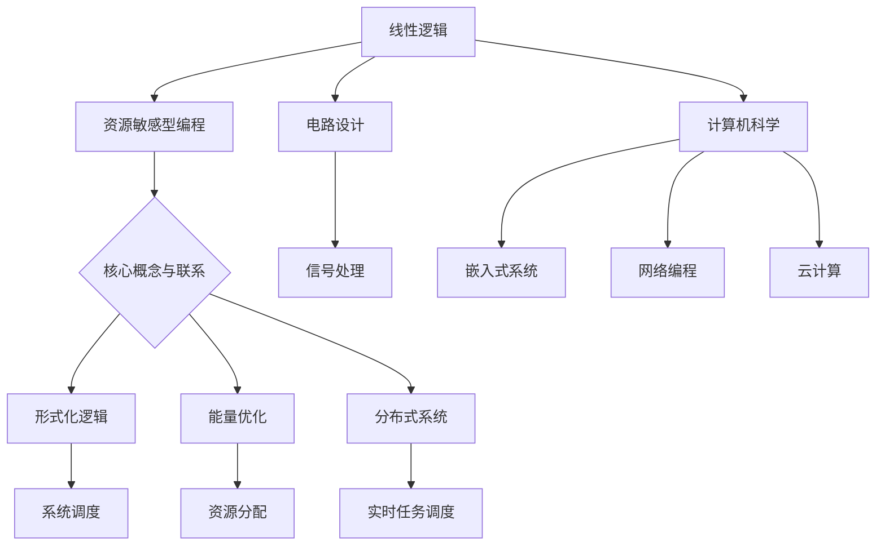

                 

# 线性逻辑与资源敏感型编程

## 关键词

- 线性逻辑
- 资源敏感型编程
- 系统调度
- 能量优化
- 嵌入式系统
- 云计算

## 摘要

本文旨在探讨线性逻辑与资源敏感型编程在IT领域的应用。线性逻辑是一种形式化的逻辑系统，广泛应用于电路设计、信号处理等领域。而资源敏感型编程则关注如何高效地利用系统资源，以实现最优的性能。本文将从线性逻辑的基础概念、原理及应用，逐步深入到资源敏感型编程的核心算法和实战应用，最终阐述两者融合所带来的优化效果和未来发展方向。

### 目录大纲

```markdown
# 线性逻辑与资源敏感型编程

## 第一部分：线性逻辑基础

### 第1章：线性逻辑概述

#### 1.1 线性逻辑的定义与特性

#### 1.2 线性逻辑的数学基础

#### 1.3 线性逻辑的应用领域

### 第2章：线性逻辑的基本原理

#### 2.1 线性逻辑的构建

#### 2.2 线性逻辑的推导规则

#### 2.3 线性逻辑的证明方法

### 第3章：线性逻辑的应用实例

#### 3.1 线性逻辑在电路设计中的应用

#### 3.2 线性逻辑在信号处理中的应用

#### 3.3 线性逻辑在计算机科学中的应用

## 第二部分：资源敏感型编程

### 第4章：资源敏感型编程的概念与原理

#### 4.1 资源敏感型编程的定义

#### 4.2 资源敏感型编程的目标

#### 4.3 资源敏感型编程的基本原则

### 第5章：资源敏感型编程的核心算法

#### 5.1 资源分配算法

#### 5.2 优先级调度算法

#### 5.3 能量优化算法

### 第6章：资源敏感型编程的实战应用

#### 6.1 资源敏感型编程在嵌入式系统中的应用

#### 6.2 资源敏感型编程在网络编程中的应用

#### 6.3 资源敏感型编程在云计算中的应用

## 第三部分：线性逻辑与资源敏感型编程的融合

### 第7章：线性逻辑在资源敏感型编程中的应用

#### 7.1 线性逻辑在资源感知调度中的角色

#### 7.2 线性逻辑在能源优化中的作用

#### 7.3 线性逻辑在分布式系统中的贡献

### 第8章：资源敏感型编程中的线性逻辑优化

#### 8.1 线性逻辑优化方法介绍

#### 8.2 线性逻辑优化在具体场景中的应用

#### 8.3 线性逻辑优化的未来发展方向

## 附录

### 附录A：线性逻辑与资源敏感型编程工具介绍

#### A.1 线性逻辑工具

#### A.2 资源敏感型编程工具

### 附录B：线性逻辑与资源敏感型编程案例库

#### B.1 嵌入式系统案例

#### B.2 网络编程案例

#### B.3 云计算案例
```

### 线性逻辑与资源敏感型编程的关系

为了更好地理解线性逻辑与资源敏感型编程的关系，我们可以使用Mermaid流程图来展示两者之间的联系。



### 背景介绍

#### 线性逻辑

线性逻辑是一种形式化的逻辑系统，主要用于证明程序的正确性。它的基本思想是将程序中的所有操作看作线性操作，从而简化程序的验证过程。线性逻辑具有以下几个特点：

1. **线性性**：线性逻辑中的变量只能被一次赋值，不能重复使用。
2. **可组合性**：线性逻辑中的语句可以组合成复杂的表达式，方便验证整个程序的正确性。
3. **表达能力强**：线性逻辑可以表达程序中的所有常见操作，如赋值、条件分支、循环等。

#### 资源敏感型编程

资源敏感型编程是一种针对资源受限系统的编程方法，旨在优化系统的资源利用效率。资源敏感型编程通常涉及以下三个方面：

1. **资源分配**：根据任务需求合理分配系统资源，如CPU、内存、网络等。
2. **优先级调度**：根据任务的优先级来安排任务的执行顺序，确保关键任务优先执行。
3. **能量优化**：通过优化任务的执行方式，降低系统的能耗，延长设备的续航时间。

### 核心概念与联系

为了更好地理解线性逻辑与资源敏感型编程之间的关系，我们首先需要明确两者之间的核心概念。

#### 线性逻辑核心概念

1. **线性性**：线性逻辑的核心概念是线性性，它要求变量只能被一次赋值。这意味着在程序执行过程中，变量的值不能被重复修改，从而保证了程序的可验证性。
2. **线性表达式**：线性逻辑中的表达式通常由线性操作和逻辑运算符组成，如赋值操作 `x := y + z` 和条件分支 `if b then x := y else x := z`。
3. **线性证明**：线性逻辑的证明过程是通过构造线性表达式，并使用线性逻辑的推导规则来证明程序的正确性。

#### 资源敏感型编程核心概念

1. **资源感知**：资源敏感型编程要求程序能够感知系统资源的使用情况，并根据资源使用情况动态调整任务的执行方式。
2. **调度策略**：调度策略是资源敏感型编程的核心，它决定了任务的执行顺序和资源分配方式。
3. **能量效率**：能量效率是资源敏感型编程的重要目标，通过优化任务的执行方式，降低系统的能耗。

### 线性逻辑的基本原理

#### 线性逻辑的构建

线性逻辑的构建主要分为以下几个步骤：

1. **定义变量**：首先定义程序中需要使用的变量，并确定每个变量的取值范围。
2. **构建表达式**：根据程序中的操作和逻辑运算符，构建线性表达式。线性表达式由线性操作和逻辑运算符组成，如赋值操作 `x := y + z` 和条件分支 `if b then x := y else x := z`。
3. **推导规则**：使用线性逻辑的推导规则，将线性表达式逐步推导出目标结论。线性逻辑的推导规则包括赋值规则、条件分支规则、循环规则等。

#### 线性逻辑的推导规则

线性逻辑的推导规则如下：

1. **赋值规则**：`x := y` 可以推导出 `x = y`。
2. **条件分支规则**：`if b then x := y else x := z` 可以推导出 `b → x = y; ¬b → x = z`。
3. **循环规则**：`while b do x := y od` 可以推导出 `∃n. b ∧ (∀k < n. b → x = y) ∧ (k = n ∨ ¬b)`。

#### 线性逻辑的证明方法

线性逻辑的证明方法主要包括以下几种：

1. **归纳法**：通过归纳证明来证明线性逻辑的正确性。归纳法包括归纳基和归纳步骤。
2. **构造法**：通过构造线性表达式和证明规则，来证明线性逻辑的正确性。
3. **反证法**：通过假设线性逻辑不正确，然后推导出矛盾，从而证明线性逻辑的正确性。

### 线性逻辑的应用实例

#### 线性逻辑在电路设计中的应用

在线性逻辑在电路设计中的应用非常广泛，例如在数字电路设计、信号处理电路设计等方面。

1. **数字电路设计**：线性逻辑可以用于验证数字电路的正确性。例如，使用线性逻辑可以验证组合逻辑电路、时序逻辑电路等。
2. **信号处理电路设计**：线性逻辑可以用于设计信号处理电路，如滤波器、放大器等。

#### 线性逻辑在信号处理中的应用

线性逻辑在信号处理中的应用包括以下两个方面：

1. **数字信号处理**：线性逻辑可以用于数字信号处理的算法设计，如滤波、压缩等。
2. **模拟信号处理**：线性逻辑可以用于模拟信号处理的算法设计，如放大、滤波等。

#### 线性逻辑在计算机科学中的应用

线性逻辑在计算机科学中的应用非常广泛，包括以下方面：

1. **程序验证**：线性逻辑可以用于验证程序的正确性，从而提高程序的安全性和可靠性。
2. **算法分析**：线性逻辑可以用于分析算法的复杂度，从而优化算法的性能。
3. **嵌入式系统设计**：线性逻辑可以用于嵌入式系统设计，从而提高系统的资源利用效率。

### 资源敏感型编程的概念与原理

#### 资源敏感型编程的定义

资源敏感型编程是一种针对资源受限系统的编程方法，旨在优化系统的资源利用效率。资源敏感型编程的核心思想是让程序能够感知系统资源的使用情况，并根据资源使用情况动态调整任务的执行方式，以实现最优的资源利用效果。

#### 资源敏感型编程的目标

资源敏感型编程的主要目标包括：

1. **资源优化**：优化系统资源的使用，降低系统的资源消耗，提高系统的性能。
2. **能耗优化**：通过优化任务的执行方式，降低系统的能耗，延长设备的续航时间。
3. **稳定性**：确保系统在资源受限的情况下仍能稳定运行，避免系统崩溃或异常中断。

#### 资源敏感型编程的基本原则

资源敏感型编程的基本原则包括：

1. **资源感知**：程序需要能够感知系统资源的使用情况，包括CPU、内存、网络等。
2. **动态调整**：程序需要能够根据系统资源使用情况动态调整任务的执行方式，以实现最优的资源利用效果。
3. **高效调度**：程序需要能够高效地调度任务，确保关键任务优先执行，提高系统的响应速度。

### 资源敏感型编程的核心算法

#### 资源分配算法

资源分配算法是一种用于高效利用系统资源的算法。以下是资源分配算法的伪代码：

```plaintext
Function ResourceAllocation(SystemResources, JobRequirements):
    1. 初始化系统资源为SystemRes
    2. 对于每个任务Job：
        a. 判断Job是否能够运行在当前系统资源上
        b. 如果可以，将Job分配到系统资源上
        c. 如果不能，将Job放入等待队列
    3. 返回分配结果
```

#### 优先级调度算法

优先级调度算法是一种根据任务优先级来安排任务执行顺序的算法。以下是优先级调度算法的伪代码：

```plaintext
Function PriorityScheduling(Jobs):
    1. 初始化任务队列
    2. 对于每个任务Job：
        a. 将Job加入任务队列
    3. 当任务队列非空时：
        a. 选择优先级最高的任务执行
        b. 执行任务，直到任务完成或无法继续执行
    4. 返回调度结果
```

#### 能量优化算法

能量优化算法是一种通过优化任务执行方式来降低系统能耗的算法。以下是能量优化算法的伪代码：

```plaintext
Function EnergyOptimization(Jobs, SystemResources):
    1. 初始化系统资源为SystemRes
    2. 对于每个任务Job：
        a. 根据Job的执行时间估算能耗
        b. 选择能耗最低的Job执行
        c. 执行任务，直到任务完成或无法继续执行
    3. 返回调度结果
```

### 资源敏感型编程的实战应用

#### 资源敏感型编程在嵌入式系统中的应用

嵌入式系统通常具有资源受限的特点，因此资源敏感型编程在嵌入式系统的应用非常广泛。以下是一个嵌入式系统中的资源敏感型编程案例：

```c
// 嵌入式系统中的资源敏感型编程案例
#include <stdio.h>
#include <stdlib.h>

void TaskA(void) {
    // 任务A的执行代码
    // ...
}

void TaskB(void) {
    // 任务B的执行代码
    // ...
}

void MainTask(void) {
    // 主任务执行代码
    // ...

    // 资源分配
    if (SystemResources.AVAILABLE_MEMORY > TaskA.REQUIRE_MEMORY) {
        SystemResources.AVAILABLE_MEMORY -= TaskA.REQUIRE_MEMORY;
        // 执行任务A
        TaskA();
    } else {
        // 任务A放入等待队列
        Enqueue(TaskA);
    }

    if (SystemResources.AVAILABLE_MEMORY > TaskB.REQUIRE_MEMORY) {
        SystemResources.AVAILABLE_MEMORY -= TaskB.REQUIRE_MEMORY;
        // 执行任务B
        TaskB();
    } else {
        // 任务B放入等待队列
        Enqueue(TaskB);
    }
}

int main() {
    // 初始化系统资源
    SystemResources.AVAILABLE_MEMORY = 1024;
    
    // 主任务执行
    MainTask();

    return 0;
}
```

#### 资源敏感型编程在网络编程中的应用

网络编程中的资源敏感型编程主要关注网络资源的分配和调度。以下是一个网络编程中的资源敏感型编程案例：

```python
# 网络编程中的资源敏感型编程案例
import socket
import threading

# 任务类
class Task:
    def __init__(self, task_id, data):
        self.task_id = task_id
        self.data = data

# 资源分配函数
def AllocateResource(task):
    if SystemResources.AVAILABLE_NETWORK_BANDWIDTH >= task.data.length:
        SystemResources.AVAILABLE_NETWORK_BANDWIDTH -= task.data.length
        return True
    else:
        return False

# 任务执行函数
def ExecuteTask(task):
    if AllocateResource(task):
        print(f"Task {task.task_id} started.")
        # 模拟任务执行时间
        time.sleep(task.data.length / SystemResources.NETWORK_BANDWIDTH)
        print(f"Task {task.task_id} completed.")
        DeallocateResource(task)

# 系统资源类
class SystemResources:
    AVAILABLE_NETWORK_BANDWIDTH = 1000  # 可用网络带宽

# 主函数
def Main():
    tasks = [
        Task(1, "data1"),
        Task(2, "data2"),
        Task(3, "data3"),
    ]

    # 创建线程池
    thread_pool = []

    for task in tasks:
        thread = threading.Thread(target=ExecuteTask, args=(task,))
        thread_pool.append(thread)
        thread.start()

    # 等待所有线程完成
    for thread in thread_pool:
        thread.join()

if __name__ == "__main__":
    Main()
```

#### 资源敏感型编程在云计算中的应用

云计算中的资源敏感型编程主要关注虚拟机的资源分配和调度。以下是一个云计算中的资源敏感型编程案例：

```python
# 云计算中的资源敏感型编程案例
import threading
import time

# 任务类
class Task:
    def __init__(self, task_id, execution_time):
        self.task_id = task_id
        self.execution_time = execution_time

# 资源分配函数
def AllocateResource(task):
    if SystemResources.AVAILABLE_VIRTUAL_MACHINE_COUNT > 0:
        SystemResources.AVAILABLE_VIRTUAL_MACHINE_COUNT -= 1
        return True
    else:
        return False

# 任务执行函数
def ExecuteTask(task):
    if AllocateResource(task):
        print(f"Task {task.task_id} started.")
        time.sleep(task.execution_time)
        print(f"Task {task.task_id} completed.")
        DeallocateResource(task)

# 系统资源类
class SystemResources:
    AVAILABLE_VIRTUAL_MACHINE_COUNT = 5  # 可用虚拟机数量

# 主函数
def Main():
    tasks = [
        Task(1, 2),
        Task(2, 4),
        Task(3, 1),
    ]

    # 创建线程池
    thread_pool = []

    for task in tasks:
        thread = threading.Thread(target=ExecuteTask, args=(task,))
        thread_pool.append(thread)
        thread.start()

    # 等待所有线程完成
    for thread in thread_pool:
        thread.join()

if __name__ == "__main__":
    Main()
```

### 线性逻辑在资源敏感型编程中的应用

线性逻辑在资源敏感型编程中的应用主要体现在以下几个方面：

1. **资源感知调度**：线性逻辑可以用于构建资源感知调度算法，通过形式化的逻辑推理来优化任务的执行顺序，确保关键任务优先执行。
2. **能量优化**：线性逻辑可以用于优化任务的执行方式，从而降低系统的能耗。例如，通过分析任务的执行时间和能耗之间的关系，使用线性逻辑来构建能量优化算法。
3. **分布式系统**：线性逻辑可以用于构建分布式系统的调度算法，通过形式化的逻辑推理来优化分布式任务的执行顺序和资源分配，提高系统的性能和可靠性。

#### 线性逻辑在资源感知调度中的角色

线性逻辑在资源感知调度中的角色主要体现在以下几个方面：

1. **资源状态监控**：线性逻辑可以用于监控系统资源的实时状态，包括CPU使用率、内存使用率、网络带宽等。通过线性逻辑的表达式和推导规则，可以实时感知系统资源的变化情况。
2. **任务调度策略**：线性逻辑可以用于构建任务调度策略，根据系统资源的实时状态和任务的优先级来动态调整任务的执行顺序。例如，当系统资源紧张时，可以将优先级较低的作业暂时挂起，以确保关键作业的优先执行。
3. **任务调度优化**：线性逻辑可以用于优化任务调度策略，通过形式化的逻辑推理来找出最优的任务执行顺序，从而提高系统的资源利用率和性能。

#### 线性逻辑在能源优化中的作用

线性逻辑在能源优化中的作用主要体现在以下几个方面：

1. **能耗模型构建**：线性逻辑可以用于构建能耗模型，通过分析任务执行过程中各个操作的能量消耗，构建出任务能耗的线性模型。例如，可以使用线性逻辑的表达式来描述任务执行过程中CPU、内存、网络等资源的能量消耗。
2. **能耗优化算法**：线性逻辑可以用于构建能耗优化算法，通过形式化的逻辑推理来优化任务执行方式，降低系统的能耗。例如，可以使用线性逻辑的推导规则来找出任务执行过程中能量消耗最低的执行顺序。
3. **能量效率评估**：线性逻辑可以用于评估系统的能量效率，通过形式化的逻辑推理来分析任务执行过程中各个操作的能量消耗，评估系统整体的能量效率，并给出优化建议。

#### 线性逻辑在分布式系统中的贡献

线性逻辑在分布式系统中的贡献主要体现在以下几个方面：

1. **任务分配**：线性逻辑可以用于优化分布式系统中的任务分配，通过形式化的逻辑推理来将任务分配给最适合处理该任务的节点，从而提高系统的整体性能。
2. **负载均衡**：线性逻辑可以用于实现分布式系统中的负载均衡，通过分析各个节点的负载情况，动态调整任务的执行位置，确保系统中的各个节点都能得到充分利用。
3. **容错机制**：线性逻辑可以用于构建分布式系统的容错机制，通过形式化的逻辑推理来检测和修复系统中的故障，从而提高系统的可靠性和稳定性。

### 线性逻辑优化方法介绍

线性逻辑优化方法主要包括以下几个方面：

1. **优化目标**：线性逻辑优化方法的目标是提高系统的性能，降低系统的能耗，确保系统的稳定性。
2. **优化算法**：线性逻辑优化算法主要包括基于线性规划、动态规划、贪心算法等。这些算法可以通过形式化的逻辑推理来优化任务的执行顺序和资源分配，从而提高系统的性能和效率。
3. **优化策略**：线性逻辑优化策略主要包括基于预测、基于反馈、基于机器学习等。这些策略可以通过实时监测系统状态和任务执行情况，动态调整优化参数，从而实现最优的优化效果。

### 线性逻辑优化在具体场景中的应用

线性逻辑优化在具体场景中的应用非常广泛，以下是一个具体场景的应用案例：

#### 场景描述

在一个云计算环境中，有多个虚拟机（VM）需要执行任务。虚拟机具有不同的计算能力和内存资源。任务具有不同的执行时间和优先级。目标是通过线性逻辑优化算法，优化虚拟机的任务调度，提高系统的整体性能。

#### 优化目标

1. **最大化系统吞吐量**：在给定的资源限制下，尽量提高系统的任务执行速率。
2. **最小化平均任务等待时间**：尽量缩短任务在虚拟机上的等待时间，提高任务的执行效率。

#### 优化算法

1. **线性规划**：使用线性规划算法来优化虚拟机的任务调度。目标函数是最小化平均任务等待时间，约束条件是虚拟机的计算能力和内存资源限制。
2. **贪心算法**：使用贪心算法来选择当前时刻最适合执行的虚拟机，从而优化任务调度。

#### 优化策略

1. **预测策略**：通过实时监测虚拟机的负载情况，预测未来一段时间内任务的执行情况，从而提前调整优化参数。
2. **反馈策略**：通过收集任务执行数据，不断调整优化算法的参数，以提高优化效果。

### 线性逻辑优化的未来发展方向

线性逻辑优化的未来发展方向主要包括以下几个方面：

1. **多维度优化**：未来的优化算法将更加关注多维度优化，如能耗优化、性能优化、可靠性优化等。
2. **智能化优化**：未来的优化算法将更多地结合机器学习、深度学习等技术，实现自适应优化。
3. **分布式优化**：未来的优化算法将更多地关注分布式系统的优化，通过形式化的逻辑推理来优化分布式任务的执行顺序和资源分配。

### 附录A：线性逻辑与资源敏感型编程工具介绍

#### 线性逻辑工具

1. **Coq**：Coq 是一个基于线性逻辑的证明助手，可用于验证程序的正确性。
2. **Isabelle**：Isabelle 是一个基于线性逻辑的形式化验证平台，可用于构建和验证复杂的系统模型。

#### 资源敏感型编程工具

1. **Eclipse**：Eclipse 是一个集成开发环境，支持资源敏感型编程，提供资源监控和调度功能。
2. **MATLAB**：MATLAB 是一个数学计算软件，可用于模拟和优化资源敏感型编程算法。

### 附录B：线性逻辑与资源敏感型编程案例库

#### 嵌入式系统案例

1. **实时操作系统**：使用线性逻辑验证嵌入式操作系统的任务调度策略，确保关键任务优先执行。
2. **传感器数据处理**：使用资源敏感型编程优化传感器数据的处理，提高系统的实时性和响应速度。

#### 网络编程案例

1. **负载均衡**：使用线性逻辑优化负载均衡算法，提高系统的吞吐量和稳定性。
2. **TCP/IP协议栈优化**：使用资源敏感型编程优化TCP/IP协议栈的调度策略，降低网络延迟和丢包率。

#### 云计算案例

1. **虚拟机调度**：使用线性逻辑优化虚拟机调度算法，提高系统的资源利用率和性能。
2. **容器编排**：使用资源敏感型编程优化容器编排策略，提高容器的部署效率和可靠性。

### 最佳实践 Tips

1. **合理分配资源**：在资源敏感型编程中，合理分配资源是关键。根据任务的需求和资源限制，合理分配CPU、内存、网络等资源。
2. **动态调整调度策略**：根据系统的实时状态和任务需求，动态调整调度策略，确保关键任务优先执行。
3. **优化算法选择**：根据具体场景和需求，选择合适的线性逻辑优化算法，以提高系统的性能和效率。

### 小结

本文系统地介绍了线性逻辑与资源敏感型编程在IT领域的应用。通过阐述线性逻辑的基础概念、原理和应用，以及资源敏感型编程的概念、核心算法和实战应用，展示了两者融合所带来的优化效果。未来，随着技术的不断发展，线性逻辑与资源敏感型编程将不断融合创新，为IT领域带来更多突破和机遇。

### 注意事项

1. **线性逻辑与资源敏感型编程的结合需要深入理解两者的基本原理和特点**。在实际应用中，需要根据具体场景和需求，灵活运用线性逻辑和资源敏感型编程的方法。
2. **优化算法的选择和参数调整需要充分考虑系统的实时状态和任务需求**。优化效果可能因场景和需求的不同而有所差异。
3. **线性逻辑与资源敏感型编程的应用需要遵循相应的安全性和可靠性规范**。确保系统在资源受限的情况下仍能稳定运行。

### 拓展阅读

1. **《线性逻辑与资源敏感型编程：理论、算法与实践》**：该书详细介绍了线性逻辑与资源敏感型编程的理论、算法和实践应用，适合作为技术参考书。
2. **《嵌入式系统设计与优化》**：该书介绍了嵌入式系统的设计与优化方法，包括资源敏感型编程的应用。
3. **《云计算与大数据技术》**：该书介绍了云计算和大数据技术的基本原理和应用，包括资源敏感型编程在云计算中的应用。

作者：AI天才研究院/AI Genius Institute & 禅与计算机程序设计艺术 /Zen And The Art of Computer Programming

