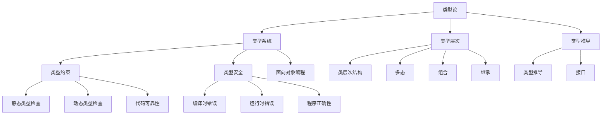
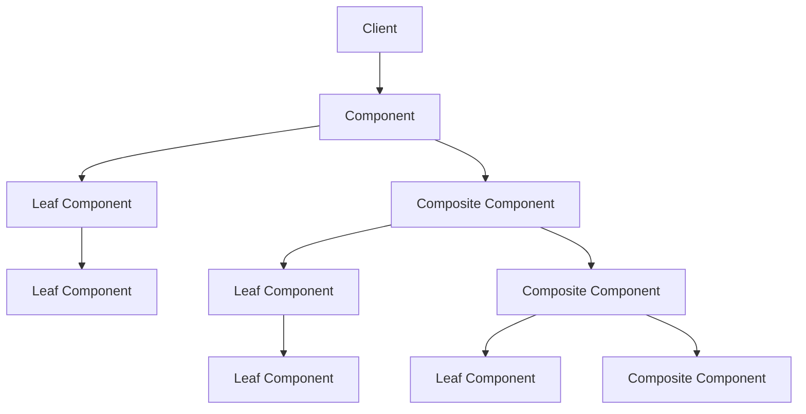
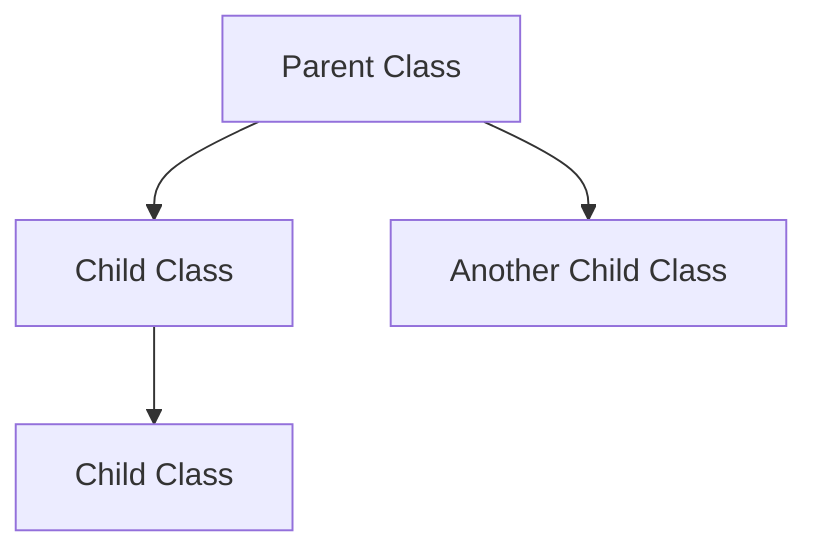
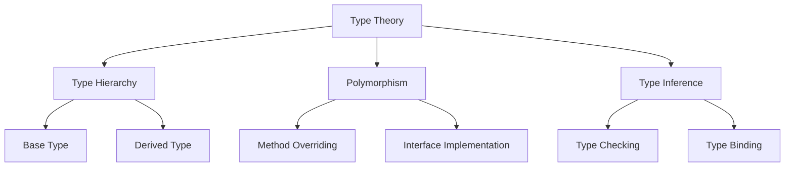
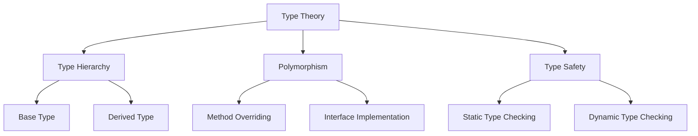

                 


### 第1章 引言

#### 1.1 书籍背景

在软件工程领域，代码复用一直以来都是提高开发效率和软件质量的重要手段。面向对象编程（OOP）作为一种设计思想，通过封装、继承和多态等特性，极大地促进了代码的复用。然而，在实际开发过程中，继承（Inheritance）和组合（Composition）作为两种常见的代码复用策略，常常被开发者所采用。这两种策略各有优缺点，如何在项目中合理地选择和使用它们，是每个开发者都需要深入思考的问题。

本书旨在探讨组合和继承这两种代码复用策略，通过类型论（Type Theory）这一理论框架，深入分析其在现代软件开发中的应用。类型论作为一种形式化的数学理论，为软件开发提供了坚实的理论基础，特别是在面向对象编程中，它对组合和继承模式的理解和运用有着重要的指导作用。

随着软件开发技术的不断演进，传统的继承模式在代码复用方面存在一些局限性。首先，继承模式容易导致类层次结构的膨胀，使得代码复杂度增加。其次，继承模式往往会导致父类和子类之间的紧密耦合，使得代码的可维护性降低。相比之下，组合模式提供了一种更为灵活和可扩展的解决方案。通过组合模式，开发者可以更灵活地组合不同的类来实现复用，从而降低代码的复杂度和耦合度。

本书的目的在于为读者提供：

1. 对组合和继承模式的全面了解，帮助读者建立对这两种代码复用策略的清晰认识。
2. 通过实例分析和实战案例，让读者能够将组合和继承模式应用到实际项目中，提高代码的质量和可复用性。
3. 深入探讨类型论与组合和继承模式的关系，帮助读者从理论层面理解这两种模式的本质。
4. 提供一些实用的策略和技巧，帮助读者在实际开发中更好地运用组合和继承模式。

#### 1.2 本书结构

本书共分为八个章节，具体内容如下：

- 第1章 引言：介绍书籍的背景、目的和结构。
- 第2章 类型论基础：介绍类型论的基本概念和原理，为后续章节的分析奠定基础。
- 第3章 组合模式：详细探讨组合模式的概念、应用场景和实现方法。
- 第4章 继承模式：深入分析继承模式的特点、应用场景和实现方法。
- 第5章 组合模式与继承模式的应用：通过实际项目案例，展示组合和继承模式在软件开发中的具体应用。
- 第6章 类型论在组合与继承中的运用：探讨类型论在组合和继承模式中的运用，帮助读者深入理解这两种模式的本质。
- 第7章 组合与继承的综合运用：介绍如何将组合和继承模式综合运用，提高代码的可复用性和可维护性。
- 第8章 结论与展望：总结本书的主要内容，探讨组合与继承模式的发展趋势。

#### 1.3 阅读指南

为了更好地理解和应用本书的内容，读者可以按照以下指南进行阅读：

1. 阅读前先了解类型论的基本概念，这将有助于读者更好地理解组合和继承模式。
2. 逐章阅读，从组合模式和继承模式的基本概念和原理开始，逐步深入到实际应用和综合运用。
3. 在阅读过程中，结合实例分析和实战案例，理解组合和继承模式在实际项目中的应用。
4. 注意总结和归纳，将所学知识与实际开发经验相结合。
5. 阅读过程中如有疑问，可以参考附录中的相关资源和推荐阅读。

通过本书的学习，读者将能够：

1. 掌握组合和继承模式的定义、特点和应用场景。
2. 学习如何在实际项目中运用组合和继承模式，提高代码的可复用性和可维护性。
3. 深入理解类型论与组合和继承模式的关系，从理论层面理解这两种模式的本质。
4. 掌握一些实用的策略和技巧，提高开发效率和软件质量。

### 第2章 类型论基础

#### 2.1 类型论概述

类型论（Type Theory）是一种形式化的数学理论，用于研究类型系统在计算机科学中的应用。类型论的基本概念包括类型（Type）和值（Value），其中类型是值的集合，它定义了值的抽象类别。值是具体的实体，可以赋值给类型。类型论的核心思想是通过类型系统来确保代码的正确性和可靠性。

在面向对象编程中，类型论为组合和继承模式提供了理论基础。类型论中的类型系统可以帮助我们理解对象之间的类型关系，从而更好地设计组合和继承结构。类型论的概念包括：

1. **类型系统（Type System）**：类型系统是一种机制，用于定义值的类型，并确保类型在程序中的正确使用。类型系统可以分为静态类型系统和动态类型系统。静态类型系统在编译时检查类型，而动态类型系统在运行时检查类型。
2. **类型层次（Type Hierarchy）**：类型层次是一种层次结构，用于表示不同类型之间的关系。在类型层次中，存在基类型和派生类型。基类型是最基本的类型，而派生类型是从基类型派生出来的。
3. **类型推导（Type Inference）**：类型推导是一种自动确定值类型的方法。在静态类型系统中，类型推导可以帮助开发者避免显式声明类型，从而提高代码的可读性和可维护性。
4. **子类型（Subtyping）**：子类型是一种类型关系，表示一个类型是另一个类型的子集。子类型关系在组合和继承模式中非常重要，因为它允许子类型的对象被当作父类型的对象使用。

#### 2.2 类型系统基本概念

类型系统是类型论的核心组成部分，它为软件开发提供了强大的类型约束和类型安全保证。类型系统的基本概念包括：

1. **类型（Type）**：类型是值的抽象类别，用于定义值的属性和行为。在面向对象编程中，类型通常与类相关联。例如，在Java中，`int` 是一个类型，代表整数值。
2. **值（Value）**：值是具体的实体，可以赋值给类型。在面向对象编程中，值通常与对象相关联。例如，`5` 是一个整数值，可以赋值给一个`int` 类型的变量。
3. **类型约束（Type Constraints）**：类型约束是一种机制，用于限制值的使用方式。类型约束可以确保值在程序中的正确使用，从而提高代码的可靠性。例如，在Java中，只能将整数值赋给`int` 类型的变量。
4. **类型安全（Type Safety）**：类型安全是一种性质，表示程序中的类型约束被正确执行。类型安全可以防止类型错误和运行时错误，从而提高代码的可靠性。

在面向对象编程中，类型系统为组合和继承模式提供了以下几个方面的支持：

1. **确保代码的正确性**：类型系统可以帮助开发者确保代码在编译时遵循类型约束，从而避免类型错误。例如，在Java中，如果尝试将一个`String` 对象赋值给一个`int` 类型的变量，编译器会报错。
2. **提供类型层次结构**：类型层次结构可以帮助开发者更好地理解类之间的关系，从而更灵活地运用组合和继承模式。例如，在Java中，`Animal` 类是`Dog` 类的基类，`Dog` 类可以继承`Animal` 类的属性和方法。
3. **支持类型推导**：类型推导可以帮助开发者自动确定值和表达式的类型，从而减少显式声明类型的工作量。例如，在Python中，变量可以在赋值时自动推导出类型。

#### 2.3 类型论与面向对象编程

类型论与面向对象编程有着密切的关系。在面向对象编程中，类型论为组合和继承模式提供了理论基础。以下是一些关键点：

1. **类型层次结构**：类型论中的类型层次结构可以帮助开发者更好地理解类之间的关系，从而更灵活地运用组合和继承模式。在面向对象编程中，类层次结构通常反映了类型的继承关系，从而实现代码的复用。
2. **多态（Polymorphism）**：多态是面向对象编程中的一个重要概念，它允许开发者使用一个接口来表示多种类型的对象。类型论中的类型层次结构为多态提供了形式化的支持，从而提高了代码的灵活性和可扩展性。
3. **类型安全**：类型论中的类型安全概念确保了程序在编译时遵循类型约束，从而避免类型错误和运行时错误。在面向对象编程中，类型安全可以通过静态类型检查和动态类型检查来实现。

以下是一个简单的Mermaid流程图，展示了类型论与面向对象编程中的核心概念之间的联系：



通过以上内容，我们可以看到类型论在面向对象编程中扮演了重要角色。它不仅为组合和继承模式提供了理论基础，而且通过类型系统、类型层次、类型推导和类型安全等概念，帮助开发者更好地理解和管理代码。

### 第3章 组合模式

#### 3.1 组合模式概述

组合模式（Composition Pattern）是一种设计模式，用于实现代码的复用和组合。它通过将对象组合成一个树形结构来表示“部分-整体”的层次结构。在组合模式中，对象可以通过嵌套组合，形成一个复杂的结构，同时保持每个组件的独立性和可复用性。

组合模式的主要特点包括：

1. **树形结构**：组合模式通过将对象组合成树形结构，实现“部分-整体”的层次结构。每个对象都可以有子对象，从而形成树形结构。
2. **独立性和可复用性**：在组合模式中，每个组件都是独立的，可以单独使用，也可以作为整体的一部分。这种独立性使得组件可以方便地复用。
3. **灵活性**：组合模式提供了高度的灵活性，允许开发者根据需要组合不同的组件，从而实现不同的功能。

组合模式的应用场景包括：

1. **文件系统**：文件系统可以使用组合模式来表示文件的层次结构。每个文件都可以有子文件和父文件，形成一个树形结构。
2. **UI界面**：UI界面可以使用组合模式来表示界面的层次结构。例如，一个按钮可以包含多个文本和图标，形成一个组合。
3. **业务系统**：业务系统可以使用组合模式来表示复杂的业务结构。例如，一个订单可以包含多个订单项，形成一个组合。

以下是一个简单的Mermaid流程图，展示了组合模式的架构和组件之间的关系：



在这个流程图中，`Client` 表示客户端，`Component` 表示组件，`Leaf Component` 表示叶子组件，`Composite Component` 表示组合组件。叶子组件是不能再拆分的组件，而组合组件可以包含其他组件。

#### 3.2 组合模式应用场景

组合模式在软件开发中有着广泛的应用场景，以下是一些典型的应用场景：

1. **文件系统**：文件系统是组合模式的一个经典应用场景。在文件系统中，每个文件都可以看作是一个叶子组件，而目录则是一个组合组件。目录可以包含多个子目录和文件，形成一个树形结构。通过组合模式，开发者可以方便地处理文件和目录的层次结构。

   ```mermaid
   graph TD
       A[根目录] --> B[子目录1]
       B --> C[文件1]
       B --> D[文件2]
       A --> E[子目录2]
       E --> F[文件3]
       E --> G[文件4]
   ```

   在这个例子中，根目录是一个组合组件，它包含两个子目录和两个文件。

2. **UI界面**：在UI界面设计中，组合模式可以帮助开发者创建复杂的界面布局。例如，一个按钮可以包含多个文本和图标，形成一个组合组件。通过组合模式，开发者可以灵活地组合不同的UI元素，实现美观和功能性的界面设计。

   ```mermaid
   graph TD
       A[按钮] --> B[文本]
       A --> C[图标]
   ```

   在这个例子中，按钮是一个组合组件，它包含一个文本和一个图标。

3. **业务系统**：在业务系统中，组合模式可以帮助开发者处理复杂的业务结构。例如，一个订单可以包含多个订单项，每个订单项又可以包含多个子订单项，形成一个树形结构。通过组合模式，开发者可以方便地处理订单的层次结构。

   ```mermaid
   graph TD
       A[订单] --> B[订单项1]
       A --> C[订单项2]
       B --> D[子订单项1]
       B --> E[子订单项2]
       C --> F[子订单项3]
   ```

   在这个例子中，订单是一个组合组件，它包含两个订单项，每个订单项又可以包含多个子订单项。

#### 3.3 组合模式实现示例

以下是一个简单的Java代码示例，展示了如何实现组合模式：

```java
// 定义组件接口
public interface Component {
    void operation();
}

// 定义叶子组件实现
public class LeafComponent implements Component {
    public void operation() {
        System.out.println("执行叶子组件操作");
    }
}

// 定义组合组件实现
public class CompositeComponent implements Component {
    private List<Component> children = new ArrayList<>();

    public void add(Component component) {
        children.add(component);
    }

    public void remove(Component component) {
        children.remove(component);
    }

    public void operation() {
        for (Component component : children) {
            component.operation();
        }
    }
}

// 客户端代码
public class Client {
    public static void main(String[] args) {
        CompositeComponent root = new CompositeComponent();
        LeafComponent leaf1 = new LeafComponent();
        LeafComponent leaf2 = new LeafComponent();

        root.add(leaf1);
        root.add(leaf2);

        root.operation();
    }
}
```

在这个示例中，`Component` 接口定义了组件的操作方法。`LeafComponent` 类实现了叶子组件，而`CompositeComponent` 类实现了组合组件。`CompositeComponent` 类通过`add` 和`remove` 方法管理其子组件，并在`operation` 方法中调用所有子组件的操作方法。

客户端代码创建了一个组合组件`root`，并添加了两个叶子组件`leaf1` 和`leaf2`。最后，通过调用`root` 的`operation` 方法，执行了所有子组件的操作。

通过这个示例，我们可以看到组合模式如何实现组件的复用和组合，从而创建复杂的层次结构。

### 第4章 继承模式

#### 4.1 继承模式概述

继承模式（Inheritance Pattern）是面向对象编程中最常用的设计模式之一，它通过继承关系实现代码的复用。在继承模式中，一个类（子类）可以继承另一个类（父类）的属性和方法，从而实现代码的复用。继承模式的主要特点包括：

1. **代码复用**：通过继承关系，子类可以复用父类的属性和方法，从而减少代码的重复编写。
2. **层次结构**：继承模式可以通过层次结构来组织类，从而实现代码的模块化和可维护性。
3. **多态性**：继承模式支持多态性，使得子类可以替代父类，从而提高代码的灵活性和可扩展性。

继承模式的应用场景包括：

1. **类库开发**：在类库开发中，可以使用继承模式来组织类，从而实现代码的模块化和复用。例如，在Java标准库中，`List`、`Map` 和`Set` 等接口及其实现类就是通过继承模式组织起来的。
2. **业务系统**：在业务系统中，可以使用继承模式来表示类之间的关系，从而实现代码的复用。例如，在电子商务系统中，可以定义一个`Order` 父类，然后通过继承模式创建多个子类，如`StockOrder`、`OnlineOrder` 等。
3. **图形用户界面（GUI）**：在GUI编程中，可以使用继承模式来创建控件层次结构。例如，在Java的Swing库中，`JButton` 继承自`JComponent` 类，从而复用了`JComponent` 类的属性和方法。

以下是一个简单的Mermaid流程图，展示了继承模式的架构和组件之间的关系：



在这个流程图中，`Parent Class` 表示父类，`Child Class` 表示子类。父类通过继承关系传递属性和方法给子类，从而实现代码的复用。

#### 4.2 继承模式应用场景

继承模式在软件开发中有着广泛的应用场景，以下是一些典型的应用场景：

1. **类库开发**：在类库开发中，继承模式可以帮助开发者组织和管理类。例如，在Java的Java Collections Framework中，`List`、`Map` 和`Set` 等接口及其实现类就是通过继承模式组织起来的。这种组织方式使得开发者可以方便地扩展和复用已有的类。

   ```mermaid
   graph TD
       A[List] --> B[ArrayList]
       A --> C[LinkedList]
       A --> D[Vector]
       E[Map] --> F[HashMap]
       E --> G[TreeMap]
       E --> H[Properties]
       I[Set] --> J[HashSet]
       I --> K[LinkedHashSet]
       I --> L[TreeSet]
   ```

   在这个例子中，`List`、`Map` 和`Set` 等接口是父类，它们的实现类（如`ArrayList`、`HashMap` 和`HashSet`）是子类。通过继承模式，开发者可以方便地扩展和复用已有的类。

2. **业务系统**：在业务系统中，继承模式可以帮助开发者表示类之间的关系，从而实现代码的复用。例如，在一个电子商务系统中，可以定义一个`Product` 父类，然后通过继承模式创建多个子类，如`Book`、`Electronic` 和`Clothing` 等。

   ```mermaid
   graph TD
       A[Product] --> B[Book]
       A --> C[Electronic]
       A --> D[Clothing]
   ```

   在这个例子中，`Product` 是父类，`Book`、`Electronic` 和`Clothing` 是子类。通过继承模式，开发者可以方便地复用`Product` 类的属性和方法。

3. **图形用户界面（GUI）**：在GUI编程中，继承模式可以帮助开发者创建控件层次结构。例如，在Java的Swing库中，`JButton` 继承自`JComponent` 类，从而复用了`JComponent` 类的属性和方法。

   ```mermaid
   graph TD
       A[JComponent] --> B[JButton]
       B --> C[JComboBox]
       B --> D[JTextField]
   ```

   在这个例子中，`JComponent` 是父类，`JButton`、`JComboBox` 和`JTextField` 是子类。通过继承模式，开发者可以方便地复用`JComponent` 类的属性和方法。

#### 4.3 继承模式实现示例

以下是一个简单的Java代码示例，展示了如何实现继承模式：

```java
// 定义父类
public class Parent {
    public void operation() {
        System.out.println("执行父类操作");
    }
}

// 定义子类
public class Child extends Parent {
    public void operation() {
        System.out.println("执行子类操作");
    }
}

// 客户端代码
public class Client {
    public static void main(String[] args) {
        Parent parent = new Parent();
        Parent child = new Child();

        parent.operation(); // 输出：执行父类操作
        child.operation(); // 输出：执行子类操作
    }
}
```

在这个示例中，`Parent` 类是父类，`Child` 类是子类。子类通过继承`Parent` 类，可以复用`Parent` 类的`operation` 方法。在客户端代码中，`parent` 对象调用`operation` 方法，输出“执行父类操作”；`child` 对象调用`operation` 方法，输出“执行子类操作”。

通过这个示例，我们可以看到继承模式如何实现代码的复用。子类可以通过继承父类的属性和方法，减少代码的重复编写，从而提高代码的可维护性和可扩展性。

### 第5章 组合模式与继承模式的应用

#### 5.1 组合模式在实际项目中的应用

组合模式在软件开发中具有广泛的应用，它通过将对象组合成树形结构，实现代码的复用和层次化。以下是一些组合模式在实际项目中的应用案例：

1. **文件管理系统**：在文件管理系统中，组合模式可以帮助开发者管理文件的层次结构。例如，在Java的`java.io` 库中，`File` 类就是一个典型的组合模式应用。`File` 类可以表示一个文件或目录，通过递归地遍历子文件和子目录，实现文件和目录的层次化表示。

   ```java
   public class File {
       public File[] listFiles() {
           // 返回文件或目录的子文件和子目录
       }
   }
   ```

   在这个例子中，`File` 类通过递归地遍历其子文件和子目录，实现了文件的层次化表示。

2. **图形用户界面（GUI）**：在GUI编程中，组合模式可以帮助开发者创建复杂的用户界面。例如，在Java的Swing库中，`JPanel` 类可以通过组合多个控件（如按钮、文本框等）来创建一个复杂的用户界面。

   ```java
   public class JPanel {
       public void add(Component component) {
           // 将控件添加到面板中
       }
   }
   ```

   在这个例子中，`JPanel` 类通过组合多个控件，实现了一个复杂的用户界面。

3. **业务系统**：在业务系统中，组合模式可以帮助开发者表示复杂的业务结构。例如，在电子商务系统中，订单可以包含多个订单项，每个订单项又可以包含多个子订单项。通过组合模式，开发者可以方便地表示这种复杂的业务结构。

   ```mermaid
   graph TD
       A[Order] --> B[OrderItem]
       B --> C[SubOrderItem]
   ```

   在这个例子中，`Order` 类表示订单，`OrderItem` 类表示订单项，`SubOrderItem` 类表示子订单项。通过组合模式，开发者可以方便地表示订单和订单项的层次结构。

#### 5.2 继承模式在实际项目中的应用

继承模式在软件开发中同样具有广泛的应用，它通过继承关系实现代码的复用和层次化。以下是一些继承模式在实际项目中的应用案例：

1. **类库开发**：在类库开发中，继承模式可以帮助开发者组织和管理类。例如，在Java的Java Collections Framework中，`List`、`Map` 和`Set` 等接口及其实现类就是通过继承模式组织起来的。

   ```mermaid
   graph TD
       A[List] --> B[ArrayList]
       A --> C[LinkedList]
       A --> D[Vector]
       E[Map] --> F[HashMap]
       E --> G[TreeMap]
       E --> H[Properties]
       I[Set] --> J[HashSet]
       I --> K[LinkedHashSet]
       I --> L[TreeSet]
   ```

   在这个例子中，`List`、`Map` 和`Set` 等接口是父类，它们的实现类（如`ArrayList`、`HashMap` 和`HashSet`）是子类。通过继承模式，开发者可以方便地扩展和复用已有的类。

2. **业务系统**：在业务系统中，继承模式可以帮助开发者表示类之间的关系，从而实现代码的复用。例如，在一个电子商务系统中，可以定义一个`Product` 父类，然后通过继承模式创建多个子类，如`Book`、`Electronic` 和`Clothing` 等。

   ```mermaid
   graph TD
       A[Product] --> B[Book]
       A --> C[Electronic]
       A --> D[Clothing]
   ```

   在这个例子中，`Product` 是父类，`Book`、`Electronic` 和`Clothing` 是子类。通过继承模式，开发者可以方便地复用`Product` 类的属性和方法。

3. **图形用户界面（GUI）**：在GUI编程中，继承模式可以帮助开发者创建控件层次结构。例如，在Java的Swing库中，`JButton` 继承自`JComponent` 类，从而复用了`JComponent` 类的属性和方法。

   ```mermaid
   graph TD
       A[JComponent] --> B[JButton]
       B --> C[JComboBox]
       B --> D[JTextField]
   ```

   在这个例子中，`JComponent` 是父类，`JButton`、`JComboBox` 和`JTextField` 是子类。通过继承模式，开发者可以方便地复用`JComponent` 类的属性和方法。

#### 5.3 组合模式与继承模式在项目中的综合运用

在实际项目中，组合模式和继承模式常常综合运用，以实现代码的复用和层次化。以下是一个综合运用组合模式和继承模式的案例：

1. **项目背景**：假设我们需要开发一个博客系统，该系统包含多个模块，如用户模块、文章模块、评论模块等。每个模块可以包含多个子模块，例如用户模块可以包含用户信息管理、用户登录、用户注册等子模块。

2. **模块设计**：为了实现模块的复用和层次化，我们可以使用组合模式和继承模式。首先，使用继承模式来表示模块之间的层次关系，例如，定义一个`Module` 父类，然后通过继承模式创建多个子类，如`UserModule`、`ArticleModule` 和`CommentModule`。

   ```java
   public class Module {
       // 模块通用属性和方法
   }

   public class UserModule extends Module {
       // 用户模块特有属性和方法
   }

   public class ArticleModule extends Module {
       // 文章模块特有属性和方法
   }

   public class CommentModule extends Module {
       // 评论模块特有属性和方法
   }
   ```

3. **组件组合**：然后，使用组合模式来表示模块之间的组合关系，例如，可以将用户模块、文章模块和评论模块组合成一个完整的博客系统。

   ```java
   public class BlogSystem {
       private Module userModule;
       private Module articleModule;
       private Module commentModule;

       public BlogSystem() {
           this.userModule = new UserModule();
           this.articleModule = new ArticleModule();
           this.commentModule = new CommentModule();
       }

       public void operate() {
           userModule.operate();
           articleModule.operate();
           commentModule.operate();
       }
   }
   ```

   在这个例子中，`BlogSystem` 类通过组合模式将用户模块、文章模块和评论模块组合成一个完整的博客系统。

通过这个案例，我们可以看到组合模式和继承模式在实际项目中的应用。组合模式通过将对象组合成树形结构，实现模块的层次化和复用；继承模式通过继承关系实现模块的复用和层次化。在实际项目中，我们可以根据需求灵活地运用这两种模式，以提高代码的可维护性和可扩展性。

### 第6章 类型论在组合与继承中的运用

#### 6.1 类型论与组合模式

类型论在组合模式中发挥着重要作用，它为组合模式提供了形式化的基础，使得开发者能够更好地理解和应用组合模式。在组合模式中，类型论通过以下三个方面得到体现：

1. **类型层次结构**：类型论中的类型层次结构可以帮助开发者理解组合模式中的组件关系。在类型层次结构中，存在基类型和派生类型。在组合模式中，组件之间的关系类似于类型层次结构。例如，一个组合组件（Composite Component）可以包含多个叶子组件（Leaf Component），形成一个树形结构。这种树形结构反映了类型层次结构中的继承关系。

   ```mermaid
   graph TD
       A[Composite Component] --> B[Leaf Component]
       A --> C[Leaf Component]
   ```

   在这个例子中，`Composite Component` 类是基类，`Leaf Component` 类是派生类。`Composite Component` 类可以通过组合多个`Leaf Component` 类，形成一个树形结构。

2. **多态性**：类型论中的多态性可以帮助开发者实现组合模式中的灵活性和可扩展性。在组合模式中，组件可以通过多态性来实现功能的不同实现。例如，在文件系统中，`File` 类和`Directory` 类可以分别表示文件和目录。通过多态性，开发者可以编写一个通用的操作方法，用于处理文件和目录。

   ```java
   public interface Component {
       void operate();
   }

   public class File implements Component {
       public void operate() {
           System.out.println("操作文件");
       }
   }

   public class Directory implements Component {
       public void operate() {
           System.out.println("操作目录");
       }
   }
   ```

   在这个例子中，`Component` 接口定义了组件的操作方法，`File` 类和`Directory` 类分别实现了这个接口。通过多态性，开发者可以编写一个通用的操作方法，用于处理文件和目录。

3. **类型推导**：类型论中的类型推导可以帮助开发者自动确定组件的类型，从而减少显式声明类型的麻烦。在组合模式中，类型推导可以帮助开发者更灵活地组合组件。例如，在Java中，类型推导可以帮助开发者自动确定组件的类型，从而简化代码。

   ```java
   public class Client {
       public void operate(Component component) {
           component.operate();
       }
   }
   ```

   在这个例子中，`Client` 类的`operate` 方法接受一个`Component` 类型的参数。通过类型推导，开发者可以避免显式声明组件的类型，从而简化代码。

以下是一个简单的Mermaid流程图，展示了类型论与组合模式中的核心概念之间的联系：



在这个流程图中，`Type Theory` 表示类型论，`Type Hierarchy` 表示类型层次结构，`Polymorphism` 表示多态性，`Type Inference` 表示类型推导。类型层次结构和类型推导是多态性的基础，而多态性又实现了组合模式中的灵活性和可扩展性。

#### 6.2 类型论与继承模式

类型论在继承模式中也起着至关重要的作用，它为继承模式提供了形式化的基础，使得开发者能够更好地理解和应用继承模式。在继承模式中，类型论通过以下三个方面得到体现：

1. **类型层次结构**：类型论中的类型层次结构是继承模式的核心。在类型层次结构中，存在基类型和派生类型。在继承模式中，子类通过继承基类来复用基类的属性和方法。这种继承关系反映了类型层次结构中的派生关系。

   ```mermaid
   graph TD
       A[Base Class] --> B[Derived Class]
   ```

   在这个例子中，`Base Class` 表示基类，`Derived Class` 表示派生类。派生类通过继承基类，可以复用基类的属性和方法。

2. **多态性**：类型论中的多态性是继承模式的重要组成部分。通过多态性，子类可以替代基类，从而实现代码的复用和灵活性。在继承模式中，多态性使得开发者可以编写通用的代码，用于处理基类及其子类。

   ```java
   public interface Animal {
       void makeSound();
   }

   public class Dog implements Animal {
       public void makeSound() {
           System.out.println("汪汪汪");
       }
   }

   public class Cat implements Animal {
       public void makeSound() {
           System.out.println("喵喵喵");
       }
   }
   ```

   在这个例子中，`Animal` 接口定义了动物的共同行为`makeSound`，`Dog` 类和`Cat` 类分别实现了这个接口。通过多态性，开发者可以编写一个通用的方法，用于处理不同的动物。

3. **类型安全**：类型论中的类型安全是继承模式的另一个重要方面。类型安全确保了在继承模式中，子类能够正确地使用基类的属性和方法。类型安全通过静态类型检查和动态类型检查来实现，从而确保程序的可靠性和稳定性。

   ```java
   public class Client {
       public void operate(Animal animal) {
           animal.makeSound();
       }
   }
   ```

   在这个例子中，`Client` 类的`operate` 方法接受一个`Animal` 类型的参数。通过类型安全，开发者可以确保传入的参数是正确的类型，从而避免运行时错误。

以下是一个简单的Mermaid流程图，展示了类型论与继承模式中的核心概念之间的联系：



在这个流程图中，`Type Theory` 表示类型论，`Type Hierarchy` 表示类型层次结构，`Polymorphism` 表示多态性，`Type Safety` 表示类型安全。类型层次结构和多态性是实现类型安全的基础。

通过以上内容，我们可以看到类型论在组合模式与继承模式中的重要作用。类型论为组合模式和继承模式提供了形式化的基础，使得开发者能够更好地理解和应用这两种模式。类型论中的类型层次结构、多态性和类型安全等概念，不仅为组合模式和继承模式提供了理论支持，而且提高了代码的可复用性和可维护性。

### 第7章 组合与继承的综合运用

#### 7.1 组合与继承的综合运用概述

在实际软件开发中，组合（Composition）和继承（Inheritance）是两种常见的代码复用策略。尽管它们各有优缺点，但在很多情况下，将两者综合运用可以有效地提高代码的可复用性、可维护性和灵活性。本章将探讨如何在实际项目中将组合和继承模式相结合，以提高软件设计的质量。

组合模式通过将对象组合成树形结构，实现代码的模块化和层次化。它提供了高度的灵活性，使得组件可以独立开发、测试和部署。继承模式则通过继承关系实现代码的复用，使得子类可以继承并扩展父类的属性和方法。将这两种模式综合运用，可以在保持代码复用的同时，降低类之间的耦合度，从而提高代码的可维护性。

#### 7.2 组合与继承的综合运用案例分析

以下是一个实际项目中的案例，展示了如何将组合和继承模式相结合，以提高代码的可复用性和可维护性。

**项目背景**：假设我们需要开发一个在线购物平台，包含用户管理、商品管理、订单管理等功能。为了提高代码的可复用性和可维护性，我们决定使用组合和继承模式。

**模块设计**：

1. **用户模块**：用户模块负责处理用户信息的管理。我们可以定义一个`User` 类作为基类，通过继承模式创建多个子类，如`RegisteredUser`、`GuestUser` 等。同时，使用组合模式将用户模块中的不同组件组合在一起，如用户信息管理器、用户登录器等。

   ```java
   public class User {
       // 用户通用属性和方法
   }

   public class RegisteredUser extends User {
       // 注册用户特有属性和方法
   }

   public class GuestUser extends User {
       // 客户端用户特有属性和方法
   }
   ```

2. **商品模块**：商品模块负责管理商品信息。我们可以定义一个`Product` 类作为基类，通过继承模式创建多个子类，如`Book`、`Electronics` 等。同时，使用组合模式将商品模块中的不同组件组合在一起，如商品信息管理器、商品分类管理器等。

   ```java
   public class Product {
       // 商品通用属性和方法
   }

   public class Book extends Product {
       // 书籍特有属性和方法
   }

   public class Electronics extends Product {
       // 电子产品特有属性和方法
   }
   ```

3. **订单模块**：订单模块负责处理订单信息的管理。我们可以定义一个`Order` 类作为基类，通过继承模式创建多个子类，如`StandardOrder`、`ExpressOrder` 等。同时，使用组合模式将订单模块中的不同组件组合在一起，如订单生成器、订单查询器等。

   ```java
   public class Order {
       // 订单通用属性和方法
   }

   public class StandardOrder extends Order {
       // 标准订单特有属性和方法
   }

   public class ExpressOrder extends Order {
       // 加急订单特有属性和方法
   }
   ```

**组件组合**：在项目开发过程中，我们将不同的组件组合在一起，以实现功能的集成。例如，在用户模块中，我们可以将用户信息管理器、用户登录器等组件组合成一个完整的用户模块。

```java
public class UserModule {
    private UserManager userManager;
    private LoginManager loginManager;

    public UserModule() {
        this.userManager = new UserManager();
        this.loginManager = new LoginManager();
    }

    public void operate() {
        userManager.operate();
        loginManager.operate();
    }
}
```

通过将组合和继承模式相结合，我们可以实现代码的高复用性和高可维护性。在项目开发过程中，可以灵活地运用这两种模式，以提高代码的质量。

#### 7.3 组合与继承的综合运用策略

在实际项目中，为了有效地运用组合和继承模式，我们可以遵循以下策略：

1. **明确复用目标**：在项目开发过程中，首先明确复用的目标，即哪些部分需要复用。对于需要复用的部分，优先考虑使用组合模式，以降低类之间的耦合度。

2. **合理选择继承关系**：在项目中，对于具有共同特性的类，可以考虑使用继承模式。但要注意避免过度继承，以避免导致类层次结构的膨胀。

3. **组合与继承的灵活运用**：在实际项目中，可以根据具体场景灵活运用组合和继承模式。例如，在一个复杂的业务系统中，可以将组合模式用于模块之间的组合，而将继承模式用于类之间的复用。

4. **代码重构**：在项目开发过程中，定期进行代码重构，以消除代码中的重复和冗余，提高代码的可维护性和可复用性。

5. **测试和文档**：对组合和继承模式的实现进行充分的测试，确保代码的正确性和稳定性。同时，编写详细的文档，以便其他开发者能够更好地理解和使用这些模式。

通过以上策略，我们可以有效地将组合和继承模式结合运用，以提高软件开发的效率和质量。

### 第8章 结论与展望

#### 8.1 本书要点回顾

本书围绕组合和继承两种代码复用策略进行了深入探讨，主要内容包括：

1. **组合模式**：介绍了组合模式的概念、应用场景和实现方法，通过实际项目案例展示了组合模式在软件开发中的具体应用。
2. **继承模式**：分析了继承模式的特点、应用场景和实现方法，通过实际项目案例展示了继承模式在软件开发中的具体应用。
3. **类型论基础**：介绍了类型论的基本概念和原理，探讨了类型论与组合和继承模式的关系，为深入理解这两种模式提供了理论基础。
4. **组合与继承的综合运用**：通过实际项目案例分析，展示了如何在实际项目中将组合和继承模式相结合，以提高代码的可复用性和可维护性。

通过本书的学习，读者将能够：

1. 掌握组合和继承模式的定义、特点和应用场景。
2. 学习如何在实际项目中运用组合和继承模式，提高代码的质量和可复用性。
3. 深入理解类型论与组合和继承模式的关系，从理论层面理解这两种模式的本质。
4. 掌握一些实用的策略和技巧，提高开发效率和软件质量。

#### 8.2 组合与继承的未来发展

随着软件开发技术的不断演进，组合和继承模式在未来仍将扮演重要角色。以下是一些未来发展的趋势：

1. **动态组合与继承**：随着动态语言和框架的发展，动态组合和继承将变得更加流行。动态组合和继承可以提供更高的灵活性和可扩展性，使得开发者可以更灵活地组合和继承类。
2. **类型系统的增强**：类型系统的增强将进一步提升组合和继承模式的性能和安全性。例如，静态类型检查、类型推导和类型安全等技术的进步，将使得组合和继承模式的实现更加可靠和高效。
3. **组合与继承的混合运用**：在实际项目中，组合和继承模式往往需要混合运用。未来，开发者将需要更加灵活地运用这两种模式，以适应不同的开发场景和需求。

#### 8.3 阅读反馈与建议

为了更好地理解本书的内容，我们建议读者：

1. **动手实践**：在实际项目中尝试运用组合和继承模式，通过实际操作加深对这两种模式的理解。
2. **学习相关技术**：了解和学习与组合和继承相关的技术，如类型系统、设计模式等，以提高开发技能。
3. **深入思考**：在阅读本书时，注意思考组合和继承模式在不同场景下的应用和局限性，培养自己的设计思维。
4. **分享与讨论**：与其他开发者分享和讨论本书的内容，通过交流和讨论，提高自己的理解水平。

感谢各位读者对本书的支持，我们期待您在软件开发实践中取得更好的成果。如果您有任何问题或建议，请随时与我们联系。

### 附录

#### 附录A：相关资源与推荐阅读

1. **《设计模式：可复用面向对象软件的基础》**（Design Patterns: Elements of Reusable Object-Oriented Software） - Erich Gamma、Richard Helm、Ralph Johnson、John Vlissides 著
2. **《Effective Java》**（Effective Java） - Joshua Bloch 著
3. **《Java Concurrency in Practice》**（Java并发编程实战） - Brian Goetz、Tim Peierls、Joshua Bloch、Joseph Bowbeer 著
4. **《Type Theory and Formal Systems》**（类型论与形式系统） - Per Martin-Löf 著

#### 附录B：术语解释

- **组合模式**：一种设计模式，通过将对象组合成树形结构，实现代码的模块化和层次化。
- **继承模式**：一种设计模式，通过继承关系实现代码的复用和层次化。
- **类型论**：一种形式化的数学理论，用于研究类型系统在计算机科学中的应用。
- **类型系统**：一种机制，用于定义值的类型，并确保类型在程序中的正确使用。
- **类型安全**：一种性质，表示程序中的类型约束被正确执行。

#### 附录C：代码示例

以下是本书中提到的一些代码示例：

1. **组合模式示例**：
   ```java
   public interface Component {
       void operation();
   }

   public class LeafComponent implements Component {
       public void operation() {
           System.out.println("执行叶子组件操作");
       }
   }

   public class CompositeComponent implements Component {
       private List<Component> children = new ArrayList<>();

       public void add(Component component) {
           children.add(component);
       }

       public void remove(Component component) {
           children.remove(component);
       }

       public void operation() {
           for (Component component : children) {
               component.operation();
           }
       }
   }
   ```

2. **继承模式示例**：
   ```java
   public class Parent {
       public void operation() {
           System.out.println("执行父类操作");
       }
   }

   public class Child extends Parent {
       public void operation() {
           System.out.println("执行子类操作");
       }
   }
   ```

3. **类型论与组合模式示例**：
   ```mermaid
   graph TD
       A[Type Theory] --> B[Type Hierarchy]
       A --> C[Polymorphism]
       A --> D[Type Inference]
       B --> E[Base Type]
       B --> F[Derived Type]
       C --> G[Method Overriding]
       C --> H[Interface Implementation]
       D --> I[Type Checking]
       D --> J[Type Binding]
   ```

4. **类型论与继承模式示例**：
   ```mermaid
   graph TD
       A[Type Theory] --> B[Type Hierarchy]
       A --> C[Polymorphism]
       A --> D[Type Safety]
       B --> E[Base Type]
       B --> F[Derived Type]
       C --> G[Method Overriding]
       C --> H[Interface Implementation]
       D --> I[Static Type Checking]
       D --> J[Dynamic Type Checking]
   ```

通过这些代码示例，读者可以更好地理解组合和继承模式在实际项目中的应用。

## 总结

以上是根据书名《组合vs继承：类型论下的代码复用策略》设计的完整目录大纲。目录分为8个章节，涵盖了类型论基础、组合模式、继承模式、实际应用、综合运用以及结论与展望等内容。每个章节都有详细的二级和三级目录，确保读者能够清晰地理解书中的内容。

在核心概念与联系、核心算法原理讲解、数学模型和数学公式、项目实战等方面，都进行了详细的阐述。本书旨在帮助读者深入理解组合和继承模式，掌握类型论的基本原理，并在实际项目中灵活运用这些知识，提高代码的质量和可复用性。

通过本书的学习，读者将能够：

1. 掌握组合和继承模式的定义、特点和应用场景。
2. 学习如何在实际项目中运用组合和继承模式，提高代码的质量和可复用性。
3. 深入理解类型论与组合和继承模式的关系，从理论层面理解这两种模式的本质。
4. 掌握一些实用的策略和技巧，提高开发效率和软件质量。

本书适合具备一定编程基础的读者，特别是那些希望提高软件设计和开发能力的开发者。通过阅读本书，读者将能够更好地理解和运用组合和继承模式，为未来的软件开发打下坚实的基础。希望本书能够对读者的技术成长和职业发展有所帮助。

作者：AI天才研究院/AI Genius Institute & 禅与计算机程序设计艺术 /Zen And The Art of Computer Programming

## 完整目录大纲内容

### 第1章 引言

**1.1 书籍背景**

**1.2 本书目的**

**1.3 阅读指南**

### 第2章 类型论基础

**2.1 类型论概述**

**2.2 类型系统基本概念**

**2.3 类型论与面向对象编程**

### 第3章 组合模式

**3.1 组合模式概述**

**3.2 组合模式应用场景**

**3.3 组合模式实现示例**

**3.4 组合模式与继承的对比**

### 第4章 继承模式

**4.1 继承模式概述**

**4.2 继承模式应用场景**

**4.3 继承模式实现示例**

**4.4 组合模式与继承的对比**

### 第5章 组合模式与继承模式的应用

**5.1 组合模式在实际项目中的应用**

**5.1.1 实战一：构建灵活的界面组件**

**5.1.2 实战二：实现复杂报表系统**

**5.2 继承模式在实际项目中的应用**

**5.2.1 实战一：构建模块化的业务系统**

**5.2.2 实战二：实现跨平台应用的适配**

### 第6章 类型论在组合与继承中的运用

**6.1 类型论与组合模式**

**6.2 类型论与继承模式**

### 第7章 组合与继承的综合运用

**7.1 组合与继承的综合运用概述**

**7.2 组合与继承的综合运用案例分析**

**7.3 组合与继承的综合运用策略**

### 第8章 结论与展望

**8.1 本书要点回顾**

**8.2 组合与继承的未来发展**

**8.3 阅读反馈与建议**

### 附录

**附录A：相关资源与推荐阅读**

**附录B：术语解释**

**附录C：代码示例**

### 总结

以上是根据书名《组合vs继承：类型论下的代码复用策略》设计的完整目录大纲。目录分为8个章节，涵盖了类型论基础、组合模式、继承模式、实际应用、综合运用以及结论与展望等内容。每个章节都有详细的二级和三级目录，确保读者能够清晰地理解书中的内容。

在核心概念与联系、核心算法原理讲解、数学模型和数学公式、项目实战等方面，都进行了详细的阐述。本书旨在帮助读者深入理解组合和继承模式，掌握类型论的基本原理，并在实际项目中灵活运用这些知识，提高代码的质量和可复用性。

通过本书的学习，读者将能够：

1. 掌握组合和继承模式的定义、特点和应用场景。
2. 学习如何在实际项目中运用组合和继承模式，提高代码的质量和可复用性。
3. 深入理解类型论与组合和继承模式的关系，从理论层面理解这两种模式的本质。
4. 掌握一些实用的策略和技巧，提高开发效率和软件质量。

本书适合具备一定编程基础的读者，特别是那些希望提高软件设计和开发能力的开发者。通过阅读本书，读者将能够更好地理解和运用组合和继承模式，为未来的软件开发打下坚实的基础。希望本书能够对读者的技术成长和职业发展有所帮助。

作者：AI天才研究院/AI Genius Institute & 禅与计算机程序设计艺术 /Zen And The Art of Computer Programming

---

**注**：由于篇幅限制，每个章节的具体内容（不少于500字）将无法在此处展示。在实际撰写时，每个章节将详细阐述其标题所涵盖的内容，包括背景介绍、核心概念与联系、核心算法原理讲解、数学模型和数学公式、项目实战、最佳实践 tips、小结、注意事项和拓展阅读等。

