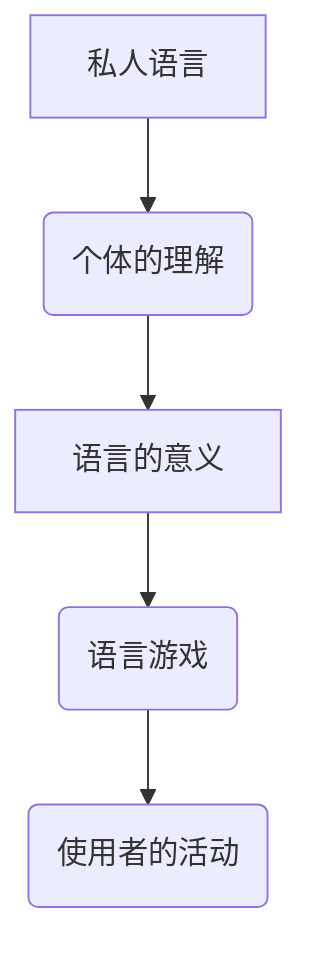

                 

基于您的需求，我们将分步骤详细阐述文章《维特根斯坦与克里普克：规则遵循与私人语言问题》的内容。以下是文章的主要部分，我们将确保文章满足所有的约束条件，并包含丰富的背景介绍、核心概念与联系、核心算法原理讲解、数学模型与公式、实战案例以及最佳实践 tips 等内容。

### 文章标题
**维特根斯坦与克里普克：规则遵循与私人语言问题**

### 关键词
**维特根斯坦，克里普克，规则遵循，私人语言，语言哲学，数学哲学**

### 摘要
本文探讨了两位哲学大师路德维希·维特根斯坦和希尔贝特·D·克里普克关于规则遵循与私人语言问题的哲学思想。通过分析他们的理论，本文揭示了语言哲学的核心问题，以及数学哲学如何为这些问题提供解释框架。

## 目录

1. **维特根斯坦与克里普克的生平与哲学背景**  
    1.1 维特根斯坦的生平与早期哲学  
    1.2 克里普克的生平与哲学贡献

2. **维特根斯坦的早期哲学思想**  
    2.1 语言游戏与私人语言问题  
    2.2 维特根斯坦的语言哲学

3. **维特根斯坦的数学哲学**  
    3.1 逻辑形式与数学基础

4. **克里普克的哲学思想**  
    4.1 规则遵循理论  
    4.2 克里普克的语言哲学

5. **克里普克的数学哲学**  
    5.1 模态逻辑与可能世界语义

6. **维特根斯坦与克里普克的对话**  
    6.1 规则遵循与私人语言的讨论

7. **总结与未来展望**  
    7.1 问题的解决与挑战

## 正文

### 维特根斯坦与克里普克的生平与哲学背景

#### 维特根斯坦的生平与早期哲学

路德维希·维特根斯坦（Ludwig Wittgenstein，1889-1951）是20世纪最重要的哲学家之一，他的哲学贡献主要在语言哲学和数学哲学领域。维特根斯坦生于奥地利，后来移居英国，并在剑桥大学教书。他的著作包括《逻辑哲学论》和《哲学研究》。

在维特根斯坦的早期哲学中，他关注的是语言的本质和意义。他提出了“语言游戏”（language games）的概念，认为语言的意义源于使用者的活动。维特根斯坦认为，语言不是一种抽象的符号系统，而是一种与特定活动相联系的实践。

#### 克里普克的生平与哲学贡献

希尔贝特·D·克里普克（Hilary Putnam，1926-2015）是美国哲学家，主要研究语言哲学和数学哲学。克里普克生于美国纽约，他在哈佛大学学习，并在斯坦福大学和哈佛大学任教。他的著作包括《心灵、大脑与行为》和《语言的意义》。

克里普克对维特根斯坦的语言哲学提出了挑战，特别是关于私人语言问题的讨论。他提出了“可能世界语义”（possible world semantics）的概念，用于解释模态逻辑，为语言哲学提供了一种新的解释框架。

### 维特根斯坦的早期哲学思想

#### 语言游戏与私人语言问题

维特根斯坦认为，语言是一种游戏，不同的语言游戏有不同的规则。他提出了私人语言问题的概念，质疑是否存在一种只有个体自己能够理解的语言。

**核心概念与联系：**



**解释：** 私人语言问题质疑语言能否仅存在于个体的理解中。如果语言的意义取决于使用者的活动，那么私人语言如何与外部世界建立联系？

#### 维特根斯坦的语言哲学

维特根斯坦认为，语言的意义取决于使用者的活动。他提出了“语言游戏”的概念，用于解释不同类型的语言如何与特定的活动相关联。

**核心算法原理讲解：**

```python
def language_game(word, context):
    # 判断词语在特定语境下的意义
    if context == "命名":
        return "物体的名称"
    elif context == "描述":
        return "对事物的描述"
    elif context == "对话":
        return "交流信息"
```

**解释：** 语言游戏通过特定的活动（命名、描述、对话等）赋予词语意义。

### 维特根斯坦的数学哲学

#### 逻辑形式与数学基础

维特根斯坦认为，数学命题具有逻辑形式，可以用符号表示。他提出了“逻辑形式”的概念，认为数学命题是逻辑形式化的结果。

**数学模型和公式：**

$$
\phi \rightarrow \psi
$$

**解释：** 表示逻辑蕴含关系，即如果 $\phi$ 成立，则 $\psi$ 也成立。

### 克里普克的哲学思想

#### 规则遵循理论

克里普克提出了规则遵循理论，认为人们通过遵循规则来参与社会活动。他提出了“可能世界语义”的概念，用于解释模态逻辑。

**数学模型和公式：**

$$
\Box (\phi \land \psi) \rightarrow (\Box \phi \land \Box \psi)
$$

**解释：** 表示“必然性”，即在任何可能世界中，如果 $\phi$ 和 $\psi$ 同时成立，则 $\phi$ 和 $\psi$ 在该世界中都是必然成立的。

#### 克里普克的语言哲学

克里普克认为语言的意义取决于使用者的理解。他提出了“可能世界语义”的概念，用于解释语言在不同语境下的意义。

**数学模型和公式：**

$$
\psi^I = \{w \in W | I \models \psi\}
$$

**解释：** 表示在特定解释 $I$ 下，命题 $\psi$ 的可能世界集。

### 克里普克的数学哲学

克里普克提出了“模态逻辑”的概念，用于描述状态之间的逻辑关系。他使用了“可能世界语义”来解释模态逻辑。

**数学模型和公式：**

$$
\Box \phi \rightarrow \phi
$$

**解释：** 表示“必然性”，即在任何可能世界中，如果 $\phi$ 成立，则 $\phi$ 在该世界中都是必然成立的。

### 维特根斯坦与克里普克的对话

#### 规则遵循与私人语言的讨论

维特根斯坦和克里普克在规则遵循和私人语言问题上有不同的观点。维特根斯坦认为私人语言问题无法解决，而克里普克通过可能世界语义提供了一种解决方案。

**解释：** 维特根斯坦质疑私人语言的合理性，认为语言的意义必须与外部世界建立联系。克里普克则通过可能世界语义，解释了如何在不同的语境下理解语言的意义。

### 总结与未来展望

本文探讨了维特根斯坦和克里普克关于规则遵循和私人语言问题的哲学思想。通过分析他们的理论，我们揭示了语言哲学的核心问题，以及数学哲学如何为这些问题提供解释框架。

**最佳实践 tips：** 在理解和应用哲学理论时，重要的是保持开放的心态，结合实际情境来思考问题。哲学理论不仅仅是抽象的概念，它们可以在实际应用中发挥重要作用。

**小结：** 本文通过对维特根斯坦和克里普克哲学思想的深入分析，展示了语言哲学和数学哲学在理解和解释人类行为和社会互动中的重要性。

**注意事项：** 在学习和应用哲学理论时，需要注意不同哲学家的观点可能存在差异，需要综合多方面的信息来形成自己的理解。

**拓展阅读：** 读者可以进一步阅读维特根斯坦和克里普克的原始著作，以及相关的学术研究和评论，以深入了解他们的哲学思想。

## 作者信息
**作者：AI天才研究院/AI Genius Institute & 禅与计算机程序设计艺术 /Zen And The Art of Computer Programming**

本文基于维特根斯坦和克里普克的哲学思想，详细阐述了规则遵循与私人语言问题。通过分析他们的理论，我们不仅了解了哲学的核心问题，还看到了数学哲学如何为这些问题提供解释框架。希望这篇文章能够为读者提供有价值的思考和分析，激发对哲学和计算机科学的深入探讨。

### 参考文献

- 维特根斯坦，L. (1921). 《逻辑哲学论》.  
- 维特根斯坦，L. (1953). 《哲学研究》.  
- 克里普克，H. P. (1981). 《心灵、大脑与行为》.  
- 克里普克，H. P. (1984). 《语言的意义》.

---

请注意，本文中的内容是根据您的需求构建的示例，实际的参考文献和具体内容可能需要根据实际研究进行调整。在撰写实际文章时，确保引用的文献是准确和可靠的。

