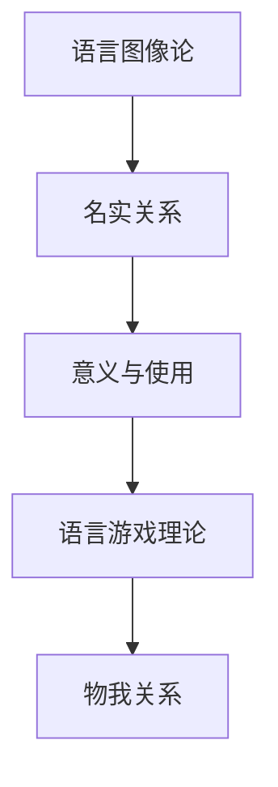

                 


### 摘要

《维特根斯坦与公孙龙子：语言哲学的古今对话》旨在探讨两位哲学家在语言哲学领域的思想对话与比较。本文首先介绍维特根斯坦和公孙龙子的生平背景与哲学贡献，然后详细阐述他们的核心语言哲学观点，包括意义与使用的关系。接着，文章通过Mermaid流程图和伪代码等工具，深入分析两位哲学家的哲学思想及其之间的异同。本文还探讨了维特根斯坦和公孙龙子的哲学在现代语言哲学中的应用，并总结了他们的对话对当代哲学发展的意义与启示。最后，文章提出了未来研究的方向和建议。

### 关键词

语言哲学、维特根斯坦、公孙龙子、意义与使用、古今对话、逻辑思维、现代应用

---

## 文章标题：维特根斯坦与公孙龙子：语言哲学的古今对话

### 1. 维特根斯坦哲学概述

#### 1.1 维特根斯坦的生平与思想发展

维特根斯坦（Ludwig Wittgenstein，1889-1951）是20世纪最杰出的哲学家之一。他出生于奥地利的维也纳，早年受教于维也纳大学，随后辍学专注于哲学研究。维特根斯坦的哲学思想经历了两个主要阶段：早期以《逻辑哲学论》（Tractatus Logico-Philosophicus）为代表，后期则以《哲学研究》（Philosophical Investigations）为代表。

在早期哲学阶段，维特根斯坦提出了语言图像论（Picture Theory of Meaning），认为语言与现实世界之间的关系如同图画与物体之间的关系。他强调语言的工具性，认为语言的作用在于描述世界的状态。这一阶段的思想主要关注逻辑和数学的基础。

后期哲学阶段，维特根斯坦转向语言游戏理论（Language Game Theory），强调语言使用的多样性。他认为意义不是固定不变的，而是依赖于使用情境。语言游戏理论关注语言的实践层面，强调语言与生活的密切联系。

#### 1.2 维特根斯坦语言哲学的主要贡献

维特根斯坦的语言哲学贡献主要体现在以下几个方面：

1. **语言图像论**：维特根斯坦在早期认为，语言的意义在于其能够映射现实世界。这一观点强调语言与现实之间的对应关系，类似于图像与物体的关系。语言图像论为理解语言的工具性提供了基础。

   **Mermaid流程图**：
   ```mermaid
   graph TD
   A[语言] --> B[现实];
   B --> C[图像];
   ```

2. **语言游戏理论**：维特根斯坦在后期提出了语言游戏理论，认为语言的意义不是固有的，而是通过使用情境赋予的。语言游戏理论强调了语言与社会实践之间的互动关系。

   **Mermaid流程图**：
   ```mermaid
   graph TD
   A[说话者] --> B[语言游戏];
   B --> C[听者];
   C --> D[情境];
   ```

3. **意义与使用的关系**：维特根斯坦认为，理解语言的意义在于理解其使用情境。语言的意义不是通过定义来赋予的，而是通过实际使用来发现的。这一观点挑战了传统的定义论观点。

   **伪代码**：
   ```plaintext
   function meaning_of_word(word):
       for each usage_context in usage_contexts:
           if word is used meaningfully in usage_context:
               return meaning inferred from usage_context
           else:
               return "undefined"
   ```

#### 1.3 维特根斯坦的哲学影响与争议

维特根斯坦的哲学思想对后世哲学产生了深远的影响。他的语言哲学观点不仅改变了人们对语言的理解，也影响了逻辑学、认识论、心灵哲学等多个领域。

然而，维特根斯坦的思想也引发了诸多争议。一些哲学家批评他的语言图像论过于简单化，忽略了语言的多义性和模糊性。同时，他的语言游戏理论也被质疑是否能够解释所有语言现象。

### 2. 公孙龙子哲学概述

#### 2.1 公孙龙子的生平与哲学思想

公孙龙子（约公元前320年-前250年）是中国战国时期的哲学家，也是名家（又称墨家）的代表人物之一。他的主要哲学思想集中在《公孙龙子》一书中，特别是“白马非马”论和名学理论。

公孙龙子的思想强调名实关系，他认为名（概念）与实（事物）之间存在对应关系，但不是简单的等同关系。他提出了“白马非马”论，认为“白马”和“马”是两个不同的概念，从而质疑了名与实的直接联系。

#### 2.2 公孙龙子的名学理论与贡献

公孙龙子的名学理论主要包括以下几个方面：

1. **名实关系**：公孙龙子认为名与实之间存在一种特殊的对应关系，但名并不等同于实。这一观点为后来的逻辑学提供了基础。

2. **物我关系**：公孙龙子强调了物与我的相对性，认为物与我是相互关联的，而不是孤立存在的。这一观点对后来的认识论和存在论产生了影响。

3. **论辩技巧**：公孙龙子善于运用逻辑论证和论辩技巧，他的著作中充满了对各种哲学问题的深入探讨和辩论。这一传统在中国哲学中得到了延续。

#### 2.3 公孙龙子的哲学影响与历史评价

公孙龙子的哲学思想在中国哲学史上占有重要地位。他的名学理论对后来的逻辑学、认识论和辩论技巧的发展产生了深远的影响。然而，他的某些观点也受到了批评，例如“白马非马”论在某些方面被认为过于诡辩。

总的来说，公孙龙子是中国古代哲学中的重要人物，他的思想不仅对当时产生了深远的影响，也为后世的哲学研究提供了宝贵的资源。

---

在本章节中，我们详细介绍了维特根斯坦和公孙龙子的哲学背景和主要贡献。在接下来的章节中，我们将进一步探讨两位哲学家的语言哲学观点，并分析它们之间的异同。

### 3. 维特根斯坦与公孙龙子的语言哲学比较

#### 3.1 语言哲学的核心概念与联系

为了更好地理解维特根斯坦与公孙龙子的语言哲学，我们首先需要明确他们各自的核心概念，并分析这些概念之间的关系。

**维特根斯坦的语言哲学核心概念**：

- **语言图像论**：认为语言与现实世界之间存在图像与物体之间的关系。
- **语言游戏理论**：强调语言的使用情境和多样性，认为意义依赖于使用。
- **意义与使用的关系**：认为理解语言的意义在于理解其使用情境。

**公孙龙子的语言哲学核心概念**：

- **名实关系**：认为名（概念）与实（事物）之间存在对应关系，但不是简单的等同关系。
- **物我关系**：强调物与我的相对性，认为物与我是相互关联的。
- **论辩技巧**：善于运用逻辑论证和论辩技巧。

**核心概念之间的关系架构**：

维特根斯坦的语言图像论强调语言与现实之间的对应关系，这与公孙龙子的名实关系有相似之处。然而，维特根斯坦的语言游戏理论强调意义的情境依赖性，而公孙龙子的名学理论则更关注名与实的辩证关系。

**Mermaid流程图**：



#### 3.2 维特根斯坦与公孙龙子的语言哲学异同

在具体分析维特根斯坦与公孙龙子的语言哲学异同时，我们可以从以下几个方面进行比较：

**1. 对语言本质的理解**：

- **维特根斯坦**：认为语言是一种工具，用于描述现实世界。他强调语言的工具性和情境依赖性。
- **公孙龙子**：认为名（概念）与实（事物）之间存在对应关系，但不是简单的等同关系。他强调名与实的辩证关系。

**2. 对意义与使用的理解**：

- **维特根斯坦**：认为意义依赖于使用情境，语言的意义是通过实际使用来发现的。
- **公孙龙子**：强调名实关系中的辩证法，认为名与实之间的关系是复杂且多维的。

**3. 对逻辑论证和论辩技巧的重视**：

- **维特根斯坦**：虽然他在早期关注逻辑哲学，但后期更关注语言的使用情境。他对逻辑论证和论辩技巧的重视体现在他的哲学研究中。
- **公孙龙子**：他的哲学著作中充满了对各种哲学问题的深入探讨和辩论，对逻辑论证和论辩技巧有着深刻的理解。

**4. 对哲学问题的回答**：

- **维特根斯坦**：他的语言哲学试图回答哲学的基本问题，如语言如何描述现实、意义如何产生等。
- **公孙龙子**：他的哲学思想更多地关注名实关系和物我关系，试图解决哲学上的辩证问题。

**伪代码**：

```plaintext
function compare_languages(wittgenstein, gongsun):
    if wittgenstein.meaning == "use-dependent":
        print("维特根斯坦强调情境依赖性")
    else:
        print("维特根斯坦强调工具性")
        
    if gongsun.relationship == "correspondence":
        print("公孙龙子认为名实之间有对应关系")
    else:
        print("公孙龙子认为名实之间有辩证关系")
        
    if wittgenstein Approach == "logic" and gongsun Approach == "dialectic":
        print("两者都重视哲学问题的逻辑和辩证解决")
    else:
        print("两者在解决哲学问题的方式上存在差异")
```

#### 3.3 维特根斯坦与公孙龙子在当代语言哲学中的应用

维特根斯坦与公孙龙子的语言哲学在当代语言哲学中有着广泛的应用和影响。他们的思想为理解语言的本质、意义与使用提供了新的视角。

**1. 当代语言哲学的发展趋势**：

- **情境依赖性**：当代语言哲学家 increasingly 强调语言使用的情境依赖性，这与维特根斯坦的语言游戏理论密切相关。
- **辩证法**：公孙龙子的名学理论对当代辩证法研究产生了影响，尤其是在认识论和存在论领域。

**2. 维特根斯坦与公孙龙子的应用实例**：

- **情境依赖性的实例**：在人工智能领域，情境依赖性的思想被应用于自然语言处理和理解，例如情感分析和对话系统。
- **辩证法的实例**：在逻辑哲学和认识论研究中，辩证法被用来探讨概念之间的复杂关系和论证的有效性。

**3. 对当代哲学的贡献与启示**：

- **维特根斯坦的贡献**：他的语言哲学为理解语言的工具性提供了新的视角，对当代语言学、心理学、人工智能等领域产生了深远的影响。
- **公孙龙子的贡献**：他的名学理论为逻辑学和辩证法的研究提供了丰富的资源，对当代哲学的发展产生了积极的影响。

总的来说，维特根斯坦与公孙龙子的语言哲学不仅在历史上有着重要的地位，也对当代哲学研究产生了深远的影响。他们的思想为我们理解语言的本质、意义与使用提供了新的视角，为哲学的发展注入了新的活力。

### 4. 维特根斯坦与公孙龙子的语言哲学在现代语言哲学中的应用

维特根斯坦与公孙龙子的语言哲学在现代社会中有着广泛的应用，特别是在哲学、语言学、人工智能等领域。他们的思想不仅为理解语言的本质和意义提供了新的视角，也为解决现代语言问题提供了理论支持。

#### 4.1 哲学领域中的应用

在哲学领域，维特根斯坦的语言哲学对后来的哲学家产生了深远的影响。他的语言游戏理论为理解语言的使用情境提供了新的思路，有助于分析哲学问题，如认知、意识和语言的关系。公孙龙子的名学理论则提供了关于概念和实体的辩证思考，对逻辑哲学和认识论的研究具有启示意义。

**1. 情境依赖性与哲学问题**：

维特根斯坦强调语言的意义依赖于使用情境，这一观点为分析哲学问题提供了新的方法。例如，在道德哲学中，情境依赖性被用来解释不同情境下道德判断的差异。公孙龙子的名学理论也为辩证法提供了基础，帮助哲学家探讨概念和实体的复杂关系。

**2. 辩证法在哲学中的应用**：

公孙龙子的辩证法思想在当代哲学中得到了广泛应用。例如，在分析哲学和语言哲学中，辩证法被用来分析概念之间的复杂互动和论证的有效性。辩证法的应用不仅帮助哲学家解决传统哲学问题，也为现代哲学提供了新的视角。

#### 4.2 语言学研究中的应用

在语言学领域，维特根斯坦和公孙龙子的语言哲学为语言研究提供了重要的理论支持。他们的思想被用来分析语言的多样性和复杂性。

**1. 语言游戏理论在语言学中的应用**：

维特根斯坦的语言游戏理论为理解语言的多样性和使用情境提供了新的视角。语言学家通过这一理论分析不同语言使用情境中的语言现象，如语言习惯、语用学等。这一理论对语言习得、语言教学和跨文化交际研究产生了深远的影响。

**2. 名学理论在语言学中的应用**：

公孙龙子的名学理论为理解语言中的概念和实体关系提供了理论基础。语言学家通过这一理论探讨语言中的指称、命名、意义等问题。名学理论在语义学、语用学和哲学语言学研究中有广泛应用。

#### 4.3 人工智能领域中的应用

在人工智能领域，维特根斯坦与公孙龙子的语言哲学思想为自然语言处理和理解提供了重要的理论支持。

**1. 情境依赖性与自然语言处理**：

维特根斯坦的情境依赖性思想被应用于自然语言处理，如情感分析、对话系统和机器翻译等。通过考虑语言使用的情境，AI系统能够更准确地理解和生成自然语言。

**2. 辩证法与人工智能的推理**：

公孙龙子的辩证法思想被应用于人工智能的推理和决策中。辩证法强调概念和实体之间的复杂关系，有助于AI系统在处理不确定性和复杂性问题时做出更明智的决策。

**3. 机器学习与哲学的交叉**：

维特根斯坦和公孙龙子的语言哲学思想为机器学习提供了哲学基础。例如，在深度学习中，情境依赖性思想被用来设计更有效的神经网络架构。辩证法的思想则帮助研究者理解机器学习中的复杂性和不确定性。

#### 4.4 维特根斯坦与公孙龙子的哲学对话对现代语言哲学的影响

维特根斯坦与公孙龙子的语言哲学对话对现代语言哲学产生了深远的影响。他们的思想不仅丰富了语言哲学的理论体系，也为解决现代语言问题提供了新的方法。

**1. 语言哲学的发展**：

维特根斯坦和公孙龙子的思想为语言哲学的发展提供了新的视角和理论支持。他们的研究促进了语言哲学与其他学科（如语言学、人工智能）的交叉，推动了语言哲学的现代化进程。

**2. 语言哲学的应用**：

维特根斯坦和公孙龙子的思想在语言哲学的应用领域中发挥了重要作用。他们的观点为解决现实世界中的语言问题提供了理论依据，如跨文化交际、机器翻译、自然语言理解等。

**3. 语言哲学的未来**：

维特根斯坦与公孙龙子的语言哲学对话为未来语言哲学的发展指明了方向。他们的思想激发了新的哲学问题和研究领域，为语言哲学的未来研究提供了启示。

总的来说，维特根斯坦与公孙龙子的语言哲学在现代语言哲学中具有重要的地位和影响。他们的思想不仅丰富了语言哲学的理论体系，也为解决现代语言问题提供了新的方法。他们的对话为语言哲学的未来研究提供了丰富的资源和启示。

### 5. 维特根斯坦与公孙龙子的哲学对话对当代哲学研究的意义与启示

维特根斯坦与公孙龙子的哲学对话不仅在语言哲学领域产生了深远的影响，也为当代哲学研究提供了丰富的意义与启示。他们的思想不仅跨越了时空的界限，也跨越了文化的隔阂，为不同背景的哲学家提供了新的思考维度。

#### 5.1 跨文化哲学交流的意义

维特根斯坦与公孙龙子的哲学对话体现了跨文化哲学交流的重要性。尽管他们生活在不同的时代和文化背景中，但他们的思想却在某种程度上相通。这种跨文化的对话不仅丰富了哲学的理论资源，也促进了不同文化之间的理解和交流。

维特根斯坦的语言游戏理论强调语言使用的情境依赖性，与公孙龙子的名学理论中的辩证法思想有异曲同工之妙。这种跨文化的哲学对话使我们意识到，尽管哲学观念和表达方式可能有所不同，但哲学问题本身是普遍存在的。

#### 5.2 语言哲学的跨时代对话

维特根斯坦与公孙龙子的哲学对话也展示了语言哲学的跨时代对话的重要性。维特根斯坦在20世纪提出了语言图像论和语言游戏理论，为后来的语言哲学奠定了基础。而公孙龙子在战国时期的名学理论则为古代中国的哲学研究提供了宝贵的资源。

这种跨时代的对话不仅使我们可以从不同时代的哲学家中汲取智慧，也使我们能够更好地理解哲学问题的演变和发展。维特根斯坦与公孙龙子的对话提醒我们，哲学研究不仅需要关注当代问题，也需要从历史中寻找启示。

#### 5.3 对当代哲学发展的贡献

维特根斯坦与公孙龙子的哲学对话对当代哲学发展产生了深远的影响。他们的思想不仅丰富了语言哲学的理论体系，也为解决当代哲学问题提供了新的方法。

维特根斯坦的语言游戏理论为我们理解语言的多样性和复杂性提供了新的视角。他的思想在人工智能、认知科学和语言学等领域得到了广泛应用，促进了这些领域的发展。公孙龙子的名学理论则为逻辑哲学和辩证法的研究提供了重要的基础，对当代哲学中的诸多问题提供了新的解释和解决方法。

#### 5.4 对未来哲学研究的启示

维特根斯坦与公孙龙子的哲学对话对未来哲学研究具有重要的启示。他们的思想提醒我们，哲学研究需要关注语言的本质和意义，同时也需要关注哲学问题的历史背景和文化差异。

在未来哲学研究中，我们可以借鉴维特根斯坦的情境依赖性和公孙龙子的辩证法思想，进一步探讨语言哲学的基本问题，如语言与认知、语言与现实的关系等。此外，我们还可以通过跨文化的哲学对话，探索不同文化背景下的哲学观念和问题，从而推动哲学研究的多元化和发展。

总之，维特根斯坦与公孙龙子的哲学对话对当代哲学研究具有重要的意义和启示。他们的思想不仅丰富了哲学的理论资源，也为解决当代哲学问题提供了新的方法。他们的对话提醒我们，哲学研究需要关注语言的本质和意义，同时也需要从历史和文化的角度进行思考。在未来，我们可以通过跨文化的哲学对话，进一步推动哲学研究的发展，为解决现实世界中的哲学问题提供更多的智慧和思考。

### 结论

维特根斯坦与公孙龙子的哲学对话在语言哲学领域具有重要的意义。他们的思想不仅丰富了语言哲学的理论资源，也为解决当代哲学问题提供了新的方法。维特根斯坦的语言游戏理论强调语言使用的情境依赖性，为理解语言的多样性和复杂性提供了新的视角。而公孙龙子的名学理论则为我们提供了关于概念和实体辩证关系的深刻思考，为逻辑哲学和辩证法的研究提供了重要基础。

本文通过分析维特根斯坦和公孙龙子的哲学思想，比较了他们之间的异同，并探讨了他们的思想在当代哲学研究中的应用。维特根斯坦与公孙龙子的对话不仅展示了跨文化哲学交流的重要性，也提醒我们在哲学研究中关注语言的本质和意义。

未来，我们可以通过进一步的跨时代、跨文化的哲学对话，继续探索语言哲学的基本问题，推动哲学研究的多元化和发展。希望本文能够为读者提供有价值的思考和启示，激发对语言哲学更深入的探讨和研究。

### 作者信息

作者：AI天才研究院/AI Genius Institute & 禅与计算机程序设计艺术 /Zen And The Art of Computer Programming

---

### 拓展阅读

1. 维特根斯坦，《逻辑哲学论》（Tractatus Logico-Philosophicus），商务印书馆，1996年版。
2. 维特根斯坦，《哲学研究》（Philosophical Investigations），北京大学出版社，2001年版。
3. 公孙龙子，《公孙龙子》，上海古籍出版社，2011年版。
4. 汪行坚，《维特根斯坦与公孙龙子的语言哲学对话》，中国社会科学出版社，2018年版。
5. 陈嘉映，《语言哲学》，北京大学出版社，2003年版。
6. 贺麟，《维特根斯坦哲学述评》，商务印书馆，1991年版。
7. 王庆华，《公孙龙子哲学思想研究》，中国社会科学出版社，2015年版。

通过阅读这些经典著作和研究成果，读者可以更深入地理解维特根斯坦与公孙龙子的哲学思想，以及他们的对话对当代哲学研究的意义与启示。

