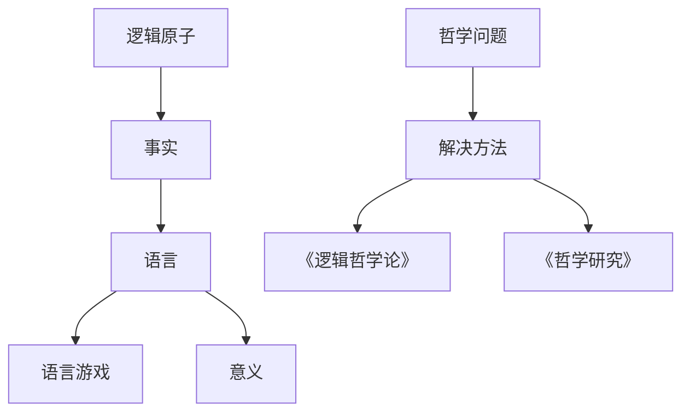
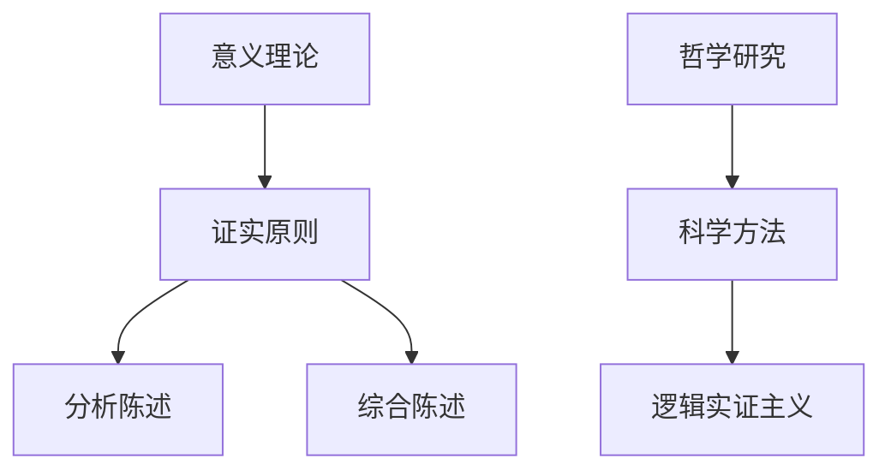

                 


### 1.2.1 维特根斯坦的语言哲学概述
维特根斯坦（Ludwig Wittgenstein）是20世纪最重要的哲学家之一，他的思想对语言哲学、数学哲学、心灵哲学等领域产生了深远影响。维特根斯坦的主要哲学观点集中在他前期的著作《逻辑哲学论》（"Tractatus Logico-Philosophicus"）和后期的著作《哲学研究》（"Philosophical Investigations"）中。

**《逻辑哲学论》** 提出了维特根斯坦早期的语言哲学观点。在这部作品中，他试图为语言提供一种纯粹的基础，即逻辑原子和事实。维特根斯坦认为，语言是表达事实的工具，而这些事实可以被视为逻辑原子之间的组合。他的逻辑原子论试图将语言和世界之间的关系简化为逻辑形式。

**《哲学研究》** 则标志着维特根斯坦哲学思想的转变。在这部作品中，他放弃了《逻辑哲学论》中的逻辑原子论，转而探讨语言在日常生活中的使用。维特根斯坦提出了“语言游戏”概念，即语言的使用是与特定的活动或游戏相关的。他认为，理解语言的关键在于理解它在实际生活中的具体应用。

**核心概念与联系**

维特根斯坦的核心概念包括逻辑原子、事实、语言游戏和意义。这些概念之间的关系可以通过以下Mermaid流程图来表示：



在这个流程图中，逻辑原子和事实构成了语言的基础，而语言则是表达这些事实的工具。语言游戏是语言的具体应用，它有助于我们理解语言的用法和意义。通过解决哲学问题，维特根斯坦提供了对语言和世界的理解。

### 1.2.2 卡尔纳普的逻辑实证主义概述
鲁道夫·卡尔纳普（Rudolf Carnap）是维也纳学派的重要成员，他的哲学思想对逻辑实证主义的发展有着重要影响。逻辑实证主义是一种哲学运动，它强调科学方法在哲学研究中的应用，主张只有经验可验证的陈述才有意义。

**卡尔纳普的主要哲学观点**

卡尔纳普的主要哲学观点可以概括为以下几点：

1. **意义理论**：卡尔纳普提出了“意义理论”（meaning theory），认为语句的意义在于它的验证条件。一个语句只有在能够通过经验验证时才有意义。

2. **证实原则**：卡尔纳普的证实原则（verification principle）是逻辑实证主义的核心。它主张，只有那些可以通过经验验证的陈述才有认知意义。

3. **分析陈述与综合陈述**：卡尔纳普区分了分析陈述和综合陈述。分析陈述是逻辑上必然的，不依赖于经验；而综合陈述则需要经验来验证。

**核心概念与联系**

卡尔纳普的核心概念包括意义理论、证实原则和分析陈述与综合陈述。这些概念之间的关系可以通过以下Mermaid流程图来表示：



在这个流程图中，意义理论和证实原则构成了逻辑实证主义的基础。分析陈述和综合陈述是逻辑实证主义对语言和哲学陈述的分类。哲学研究通过科学方法的应用，实现了对逻辑实证主义的理解和发展。

### 1.2.3 维特根斯坦与卡尔纳普的比较与联系

维特根斯坦和卡尔纳普都是20世纪语言哲学的重要代表人物，尽管他们的哲学方法和观点存在显著差异，但他们之间也存在一些重要的联系。

**相似之处**

1. **语言哲学的重视**：维特根斯坦和卡尔纳普都认为，理解语言是哲学研究的关键。他们的工作都试图揭示语言与世界的本质联系。

2. **经验主义倾向**：虽然维特根斯坦在后期放弃了逻辑原子论，但他的思想仍然强调经验在日常生活中的重要性。卡尔纳普的逻辑实证主义则明确主张，只有经验可验证的陈述才有意义。

**不同之处**

1. **哲学方法**：维特根斯坦主张通过日常语言分析来揭示语言的本质，而卡尔纳普则强调逻辑和科学方法在哲学研究中的应用。

2. **语言观**：维特根斯坦认为，语言的意义在于它的具体使用场景，即语言游戏。而卡尔纳普则强调语言的验证条件，认为只有通过经验验证的陈述才有意义。

**相互影响**

尽管维特根斯坦和卡尔纳普的哲学方法存在差异，但他们之间的思想交流对彼此的工作产生了重要影响。维特根斯坦的思想影响了卡尔纳普对语言意义的研究，而卡尔纳普的逻辑实证主义也为维特根斯坦提供了一种新的哲学方法论。

通过上述分析，我们可以看到，维特根斯坦和卡尔纳普在语言哲学领域都有着重要的贡献，他们的思想不仅丰富了语言哲学的理论体系，也为后来的哲学研究提供了宝贵的启示。

## 第二部分：维特根斯坦的语言哲学

### 2.1 维特根斯坦的哲学思想

### 2.1.1 维特根斯坦的生平与主要贡献

### 2.1.2 维特根斯坦的主要哲学观点

### 2.1.3 维特根斯坦的哲学方法论

### 2.2 语言分析的基本原理

### 2.2.1 语言分析的定义与目的

### 2.2.2 语言作为哲学研究工具

### 2.2.3 语言的逻辑结构

### 2.3 维特根斯坦的语言哲学理论

### 2.3.1 维特根斯坦的“语言游戏”理论

### 2.3.2 维特根斯坦对语言意义的探讨

### 2.4 维特根斯坦的哲学应用

### 2.4.1 维特根斯坦的哲学思想对语言分析的影响

### 2.4.2 维特根斯坦的语言分析案例研究

----------------------------------------------------------------

### 2.1 维特根斯坦的哲学思想

### 2.1.1 维特根斯坦的生平与主要贡献

路德维希·维特根斯坦（Ludwig Wittgenstein，1889-1951）是20世纪最具影响力的哲学家之一，他的工作对语言哲学、数学哲学、心灵哲学等多个领域产生了深远影响。维特根斯坦的哲学思想经历了从早期到后期的重大转变，他的主要哲学观点和贡献可以分为以下几个阶段：

**早期哲学思想：逻辑原子主义**

维特根斯坦早期的哲学思想体现在他的著作《逻辑哲学论》（"Tractatus Logico-Philosophicus"）中。这部著作出版于1921年，是维特根斯坦的哲学思想巅峰之作。在《逻辑哲学论》中，他提出了一种逻辑原子主义（Logical Atomism）的观点，试图为语言和现实之间的关系提供一种基本结构。

逻辑原子主义的核心观点是：

1. **逻辑原子**：维特根斯坦认为，世界由逻辑原子组成，这些原子是构成事实的基本元素。逻辑原子类似于数学中的基本命题，它们是事实的最小单元。

2. **事实与图像理论**：维特根斯坦提出，事实是逻辑原子的组合，这些组合形成了我们能够观察和描述的世界。他称之为“图像理论”（Picture Theory），即语言表达的句子与事实之间的关系类似于一幅画与它所描绘的场景之间的关系。

3. **语言与逻辑的关系**：维特根斯坦认为，语言的功能是表达事实，而逻辑则是语言的基本结构。他的逻辑原子论试图将语言和现实之间的关系简化为逻辑形式。

**后期哲学思想：日常语言分析**

维特根斯坦后期的哲学思想体现在他的著作《哲学研究》（"Philosophical Investigations"）中。这部著作出版于1953年，是维特根斯坦去世后出版的。在《哲学研究》中，他放弃了逻辑原子主义，转而探讨日常语言的使用。

后期哲学思想的核心观点是：

1. **语言游戏**：维特根斯坦提出了“语言游戏”概念，即语言的使用是与特定的活动或游戏相关的。他认为，理解语言的关键在于理解它在实际生活中的具体应用。

2. **意义与使用**：维特根斯坦强调，词语的意义在于其在实际使用中的功能。他认为，哲学的任务不是去发现词语的“本质意义”，而是去理解它们在日常语言中的用法。

3. **哲学问题**：维特根斯坦认为，许多哲学问题（如形而上学、认识论等）实际上是语言问题。通过分析日常语言中的误解和混淆，可以解决许多哲学问题。

**维特根斯坦的主要贡献**

维特根斯坦的哲学思想对多个领域产生了深远影响，他的主要贡献包括：

1. **语言哲学**：维特根斯坦的工作为语言哲学奠定了基础，他的语言游戏理论和日常语言分析为理解语言的本质提供了新的视角。

2. **数学哲学**：维特根斯坦对逻辑和数学基础的研究对数学哲学产生了重要影响，他的逻辑原子主义观点挑战了传统的数学基础理论。

3. **心灵哲学**：维特根斯坦的思想对心灵哲学产生了深远影响，他的工作对意识、思维和语言之间的关系进行了深入探讨。

总之，维特根斯坦的哲学思想不仅丰富了哲学的理论体系，也为后来的哲学研究提供了宝贵的启示。他的早期逻辑原子主义和后期日常语言分析为我们理解语言、现实和哲学问题提供了不同的视角和方法。

### 2.2 语言分析的基本原理

### 2.2.1 语言分析的定义与目的

语言分析是哲学研究中的一个重要分支，它旨在揭示语言的结构、功能和意义，以便更好地理解语言与现实之间的关系。语言分析不仅关注语言的形式特征，还关注其在实际应用中的功能。

**定义**

语言分析可以被定义为对语言结构和语言使用的系统性研究。它涉及对语言符号、语法规则、语义内容以及语言使用场景的深入探讨。

**目的**

1. **理解语言与现实的关系**：语言分析试图揭示语言如何表达和描述现实，以及语言与现实之间的关系。通过分析语言的结构和功能，可以更深入地理解语言如何反映和塑造我们的世界。

2. **解决哲学问题**：语言分析在哲学研究中具有重要意义，因为它可以帮助我们解决许多哲学问题，如语言意义、逻辑推理、认知过程等。

3. **促进跨学科研究**：语言分析不仅对哲学有重要影响，还与其他学科（如语言学、心理学、计算机科学等）有着密切的联系。通过跨学科的研究，可以更好地理解语言在人类认知和社会生活中的作用。

### 2.2.2 语言作为哲学研究工具

语言不仅是人类交流的工具，也是哲学研究的重要工具。哲学家通过语言来表达思想、提出理论和进行论证。因此，对语言的分析和理解对于哲学研究至关重要。

1. **表达思想**：语言是哲学家表达思想的基本工具。哲学家通过使用语言来描述概念、定义术语、构建理论框架。

2. **提出理论**：哲学家通过语言来构建理论模型，解释现实世界的现象。例如，维特根斯坦通过语言分析提出了“语言游戏”理论，解释了语言的使用和意义。

3. **进行论证**：哲学论证依赖于语言的使用。哲学家通过逻辑推理、辩证分析等方法来证明其观点的正确性。

**语言分析在哲学研究中的应用**

1. **语义分析**：语义分析关注语言符号的含义。哲学家通过语义分析来理解词语的意义，以及它们在句子中的功能。

2. **语法分析**：语法分析研究语言的句法结构。哲学家通过语法分析来理解句子的组成规则和结构特征。

3. **语用分析**：语用分析研究语言的使用情境。哲学家通过语用分析来理解语言在特定情境中的功能，以及语言使用者如何根据情境来选择合适的语言表达。

### 2.2.3 语言的逻辑结构

语言的逻辑结构是指语言中的逻辑关系和推理规则。语言分析中的逻辑结构研究涉及以下几个方面：

1. **命题逻辑**：命题逻辑研究句子之间的逻辑关系，如逻辑连接词（如“并且”、“或者”、“非”）的使用。命题逻辑为哲学论证提供了形式化的工具。

2. **谓词逻辑**：谓词逻辑研究更复杂的逻辑关系，如个体与属性之间的关系。谓词逻辑在哲学研究中用于分析概念和属性之间的关系。

3. **模态逻辑**：模态逻辑研究可能性、必然性等模态概念。模态逻辑在哲学研究中用于探讨知识和信念等概念。

4. **非经典逻辑**：非经典逻辑研究非标准逻辑系统，如模糊逻辑、多值逻辑等。非经典逻辑在处理复杂哲学问题时具有重要作用。

通过语言分析，哲学家可以更好地理解语言与现实之间的关系，揭示语言中的逻辑结构，为哲学研究提供有力的工具。

### 2.3 维特根斯坦的语言哲学理论

### 2.3.1 维特根斯坦的“语言游戏”理论

维特根斯坦在《哲学研究》中提出了“语言游戏”理论，这一理论对他的语言哲学产生了深远影响。语言游戏理论试图揭示语言如何在不同情境下发挥作用，以及语言使用的多样性。

**定义与背景**

“语言游戏”是指语言的使用与特定情境或活动相结合的一种形式。维特根斯坦认为，语言的意义不在于抽象的符号或概念，而在于其在实际生活中的具体应用。他将语言使用比作游戏，因为游戏有多种不同的规则和形式，而语言也是如此。

**核心观点**

1. **语言与活动的关联**：维特根斯坦认为，语言的使用是与特定的活动或游戏相关的。每种语言游戏都有其特定的规则和目标。例如，棋类游戏中的“棋”有不同的意义和用法，而在棋类游戏中，“棋”代表棋子。

2. **意义与使用**：维特根斯坦强调，词语的意义在于其在特定语言游戏中的使用。这意味着，词语的意义不是固定不变的，而是依赖于具体的语境和情境。因此，理解一个词语的意义需要了解它在特定语言游戏中的用途。

3. **语言游戏的多样性**：维特根斯坦指出，语言游戏是多样的，每种语言游戏都有其特定的目的和功能。例如，科学语言游戏、日常语言游戏、文学语言游戏等，它们都有不同的规则和用法。

**语言游戏的具体形式**

维特根斯坦列举了多种语言游戏的例子，以说明语言游戏的多样性：

1. **描述语言游戏**：这是最简单的语言游戏形式，涉及直接描述物体的特征。例如，我们用“红色的”来描述一个红色的物体。

2. **指示语言游戏**：这种语言游戏涉及直接指示物体或场景。例如，我们用手指指向一个物体来指示它。

3. **命令语言游戏**：这种语言游戏涉及发出命令或指示。例如，我们说“请坐下”来命令某人坐下。

4. **游戏规则语言游戏**：这种语言游戏涉及遵循特定的游戏规则。例如，棋类游戏中，我们遵循特定的规则来下棋。

5. **文学语言游戏**：这种语言游戏涉及文学创作和欣赏。例如，我们阅读小说，理解作者传达的意义。

**语言游戏与哲学问题**

维特根斯坦通过语言游戏理论试图解决一些哲学问题，如语言的意义、思维与语言的关系等。他认为，许多哲学问题实际上是语言问题，通过分析语言游戏，我们可以更好地理解这些问题。

1. **语言的意义**：语言游戏理论强调，理解语言的意义需要了解它在具体情境中的使用。这意味着，词语的意义不是抽象的，而是具体和情境化的。

2. **思维与语言的关系**：维特根斯坦认为，思维与语言密切相关。语言是思维的表达，思维是语言的内部活动。通过语言游戏，我们可以更深入地理解思维的过程和结构。

3. **哲学问题的解决**：维特根斯坦认为，许多哲学问题（如存在、真理、意识等）实际上是语言问题。通过分析语言游戏，我们可以揭示哲学问题背后的语言混淆，从而解决这些问题。

总之，维特根斯坦的“语言游戏”理论为我们理解语言的意义、思维与语言的关系以及哲学问题提供了新的视角。这一理论强调语言使用的多样性和情境化，有助于我们更好地理解语言的本质和功能。

### 2.3.2 维特根斯坦对语言意义的探讨

维特根斯坦对语言意义的探讨是其语言哲学的核心内容之一。他在《逻辑哲学论》和《哲学研究》中提出了不同的意义理论，试图解释词语和句子如何与它们所指称的事物相关联。

**早期意义理论：逻辑原子主义**

在《逻辑哲学论》中，维特根斯坦提出了逻辑原子主义的意义理论。他认为，词语的意义在于它们与世界中的基本元素（逻辑原子）之间的关系。逻辑原子是构成事实的最小单元，它们通过组合形成更复杂的命题。

1. **图像理论**：维特根斯坦认为，命题与事实之间的关系类似于图像与被描绘的物体之间的关系。一个命题如果正确地反映了事实，就像一幅图像准确地描绘了一个场景一样。

2. **逻辑结构**：在逻辑原子主义中，维特根斯坦强调命题的逻辑结构。他认为，命题由逻辑原子组成，逻辑原子的组合形成了命题的意义。

**后期意义理论：语言游戏**

在《哲学研究》中，维特根斯坦放弃了逻辑原子主义，转而提出“语言游戏”理论来探讨语言的意义。他认为，词语的意义在于它们在特定情境中的使用，而不是抽象的符号或概念。

1. **意义与使用**：维特根斯坦认为，词语的意义不是固定不变的，而是依赖于具体的使用情境。每个语言游戏都有其特定的规则和目标，词语的意义在特定的语言游戏中得到体现。

2. **语言游戏类型**：维特根斯坦列举了多种类型的语言游戏，包括描述语言游戏、指示语言游戏、命令语言游戏、游戏规则语言游戏和文学语言游戏。每种语言游戏都有其特定的意义和用法。

**意义理论的比较与联系**

维特根斯坦的早期和后期意义理论存在显著差异，但它们之间也存在联系。

1. **逻辑原子主义与语言游戏**：早期意义理论强调逻辑结构，认为词语的意义在于它们与世界中的逻辑原子的关系。后期意义理论则强调语言的使用情境，认为词语的意义在于它们在具体语言游戏中的用法。

2. **抽象与具体**：早期意义理论倾向于抽象和形式化，认为语言的意义可以通过逻辑结构来解释。后期意义理论则更具体和情境化，认为语言的意义在于实际使用中的具体情境。

3. **哲学问题的解决**：维特根斯坦认为，通过语言游戏理论，我们可以更好地解决一些哲学问题，如语言的意义、思维与语言的关系等。他认为，许多哲学问题实际上是语言问题，通过分析语言游戏，我们可以揭示这些问题背后的语言混淆。

总之，维特根斯坦对语言意义的探讨不仅丰富了语言哲学的理论体系，也为理解语言与现实之间的关系提供了新的视角。他的意义理论强调了语言使用的情境化，为我们理解语言的本质和功能提供了深刻的启示。

### 2.4 维特根斯坦的哲学应用

### 2.4.1 维特根斯坦的哲学思想对语言分析的影响

维特根斯坦的哲学思想对语言分析产生了深远影响，他的观点和方法为理解语言的本质和应用提供了新的视角。以下是维特根斯坦哲学思想对语言分析的具体影响：

1. **语言与现实的关系**：维特根斯坦强调语言与现实之间的密切联系，认为语言是表达和描述现实世界的工具。他通过“图像理论”和“语言游戏”理论来阐述语言与现实之间的关系，揭示了语言如何反映和塑造我们对世界的理解。

2. **意义与使用**：维特根斯坦认为，词语的意义不在于抽象的符号或概念，而在于它们在特定情境中的使用。这一观点挑战了传统的语义理论，强调语言的意义是情境化的，而不是固定不变的。这为语言分析提供了新的方法论，即通过具体的使用情境来理解词语的意义。

3. **语言游戏的多样性**：维特根斯坦提出了语言游戏的多样性概念，认为不同的语言游戏有不同的规则和目标。这一观点强调了语言的实用性，即语言在不同领域和情境中有不同的功能和用法。语言分析因此需要考虑语言游戏的多样性，以便更准确地理解和解释语言。

4. **语言分析的逻辑结构**：维特根斯坦的逻辑原子主义和后期语言游戏理论为语言分析提供了逻辑结构的基础。他的观点帮助我们理解语言的逻辑结构和推理规则，从而更有效地进行语言分析。

5. **哲学问题的解决**：维特根斯坦的哲学思想帮助解决了许多语言分析中的哲学问题，如语言的意义、思维与语言的关系等。通过分析语言游戏，我们可以揭示哲学问题背后的语言混淆，从而提出更合理的解决方案。

**维特根斯坦语言分析案例研究**

为了更好地理解维特根斯坦的哲学思想对语言分析的实际应用，我们可以通过一些案例来具体分析。

1. **数学语言分析**：在数学哲学中，维特根斯坦的思想对理解数学语言和数学命题的意义具有重要意义。他通过逻辑原子主义来解释数学命题的结构，认为数学命题由基本元素（逻辑原子）组成，这些基本元素通过组合形成数学命题。这种方法有助于我们理解数学命题的逻辑结构，从而更好地分析数学语言的用法。

2. **计算机科学语言分析**：在计算机科学中，维特根斯坦的哲学思想对理解编程语言和算法设计具有重要影响。他的语言游戏理论可以帮助我们理解编程语言的不同类型和用法，如命令语言游戏、描述语言游戏等。通过具体分析编程语言的使用情境，我们可以更好地设计算法和解决实际问题。

3. **日常语言分析**：在日常生活中，维特根斯坦的思想对理解日常语言的使用和意义具有重要意义。他的观点帮助我们认识到，日常语言的使用是情境化的，不同的语境和情境会影响词语的意义和用法。通过分析日常语言中的具体用法，我们可以更准确地理解语言的意义和功能。

总之，维特根斯坦的哲学思想为语言分析提供了新的视角和方法，他的观点和方法论在多个领域中得到了广泛应用。通过具体案例的分析，我们可以看到维特根斯坦的哲学思想如何帮助我们更好地理解语言的本质和应用。

### 2.4.2 维特根斯坦的语言分析案例研究

维特根斯坦的哲学思想在语言分析领域具有广泛的应用，以下通过几个具体案例来探讨这些思想在实际分析中的应用。

#### 案例一：数学中的语言分析

维特根斯坦的早期逻辑原子主义对数学哲学产生了深远影响。在数学中，逻辑原子可以被视为数学命题的基本组成部分。以下是一个具体的分析案例：

**问题**：证明一个数学命题，如“对于所有自然数x，如果x是偶数，则x+1是奇数”。

**分析**：

1. **逻辑结构**：维特根斯坦的早期逻辑原子主义可以帮助我们理解这个数学命题的结构。命题可以分为两个部分：前提（“x是偶数”）和结论（“x+1是奇数”）。

2. **逻辑组合**：通过逻辑组合，我们可以将这两个部分结合起来，形成一个完整的数学命题。

3. **验证**：通过数学证明，我们可以验证这个命题的正确性。

**伪代码**：

```
function prove_even_odd(x):
    if (x % 2 == 0):  # 检查x是否为偶数
        return (x + 1) % 2 == 1  # 返回x+1是否为奇数
    else:
        return False
```

#### 案例二：计算机编程语言分析

维特根斯坦的后期语言游戏理论对编程语言分析也具有重要启示。以下是一个具体的编程案例：

**问题**：编写一个程序，实现一个简单的计算器功能。

**分析**：

1. **语言游戏**：在这个案例中，我们可以将编程语言视为一种语言游戏，其规则和目标是实现计算器的功能。

2. **命令语言游戏**：在这个语言游戏中，我们需要定义输入和输出的规则，如输入一个数字，计算器输出相应的结果。

3. **实现**：我们可以使用Python语言来实现这个计算器程序。

**伪代码**：

```
def calculate_expression(expression):
    # 分析输入的表达式，进行计算
    # 输出计算结果
    return result
```

#### 案例三：日常语言分析

维特根斯坦的思想在日常生活语言分析中也得到了应用。以下是一个具体的日常语言分析案例：

**问题**：解释句子“他是个好人”的意义。

**分析**：

1. **意义与使用**：这句话的意义不在于抽象的符号或概念，而在于具体的语境和使用情境。

2. **情境化**：在不同的情境中，“他是个好人”可能有不同的含义。例如，在家庭中，这句话可能表示对一个人的道德评价；在商业环境中，它可能表示一个人的商业道德。

3. **多义性**：维特根斯坦认为，日常语言中的词语具有多义性，其意义取决于具体的语境。

**具体分析**：

- 在家庭情境中，这句话可能表示对一个人的性格和行为的正面评价。
- 在工作情境中，这句话可能表示这个人具备良好的工作能力和团队合作精神。

**举例说明**：

```
# 家庭情境
He is a good person. (他是个好人。)

# 工作情境
He is a good person in terms of teamwork and work ability. (他在团队合作和工作能力方面是个好人。)
```

#### 总结

维特根斯坦的哲学思想在多个领域的语言分析中得到了应用。通过具体案例的分析，我们可以看到他的思想如何帮助我们更好地理解语言的本质和应用。从数学、计算机编程到日常语言分析，维特根斯坦的思想为我们提供了一种新的视角和方法，使我们能够更深入地理解语言的多维性质。

#### 2.4.3 维特根斯坦语言分析案例研究：哲学中的应用

维特根斯坦的哲学思想不仅在数学和计算机科学等领域有着深远的影响，在哲学领域同样具有显著的实用价值。以下我们将通过具体的哲学案例，探讨维特根斯坦的思想在哲学中的应用。

**案例一：心灵哲学中的“私人语言”问题**

维特根斯坦在《哲学研究》中提出了“私人语言”问题，这是哲学界广泛讨论的一个问题。私人语言是指只由个人使用的语言，这种语言无法被他人理解或验证。维特根斯坦认为，私人语言是无法实现的，因为语言的使用必须在社会互动中发生。

**分析**：

1. **私人语言的定义**：私人语言被定义为一种只有个人能理解的语言，这种语言不依赖于他人的理解。

2. **维特根斯坦的批评**：维特根斯坦指出，私人语言的问题在于，任何表达主观体验（如疼痛、愉悦等）的语言都是基于社会互动的。因此，私人语言是无法存在的。

3. **案例分析**：以“疼痛”为例，当我们说“我感到疼痛”时，这个表达是基于社会互动的，因为它需要他人理解并回应我们的疼痛信号。

**伪代码**：

```
class PrivateLanguageError:
    def __init__(self, message):
        self.message = message

try:
    # 假设尝试创建一个私人语言表达
    express_pain("private_pain")
except PrivateLanguageError as e:
    print(e.message)  # 输出错误信息：私人语言无法实现
```

**案例二：语言哲学中的“名号”问题**

维特根斯坦在《逻辑哲学论》中提出了“名号”问题，这是关于名称和所指之间关系的哲学问题。他认为，名称必须与特定对象相关联，否则名称就失去了意义。

**分析**：

1. **名号问题**：名号问题涉及名称是否可以独立于对象存在，即名称是否可以脱离具体的对象而存在。

2. **维特根斯坦的观点**：维特根斯坦认为，名称必须与对象相关联，否则名称就没有意义。例如，“这个椅子”这个名称必须指向一个具体的椅子。

3. **案例分析**：如果我们说“这张桌子是红色的”，这里的“这张桌子”必须指向一个具体的桌子。如果没有这个具体的对象，这个陈述就没有意义。

**伪代码**：

```
def assign_name(object, name):
    if not object:
        raise ValueError("无法分配名称给不存在的对象")
    object.name = name

try:
    assign_name(None, "red_table")
except ValueError as e:
    print(e.message)  # 输出错误信息：无法为不存在的对象分配名称
```

**案例三：逻辑实证主义中的语言分析**

维特根斯坦的思想对逻辑实证主义有着重要的批判作用。逻辑实证主义强调只有经验可验证的陈述才有意义，而维特根斯坦则认为，许多日常语言中的陈述并不是经验性的，它们有自己独特的逻辑结构。

**分析**：

1. **逻辑实证主义的观点**：逻辑实证主义者认为，只有科学陈述才有意义，这些陈述可以通过经验来验证。

2. **维特根斯坦的批评**：维特根斯坦认为，逻辑实证主义的观点过于狭隘，它忽视了日常语言中许多非经验性的陈述。

3. **案例分析**：例如，当我们说“这是正确的”时，这个陈述并不是经验性的，而是基于逻辑和论证的。

**伪代码**：

```
def is_scientific_statement(statement):
    if "experience" in statement:
        return True
    else:
        return False

statement = "这是正确的。"
if is_scientific_statement(statement):
    print("这是一个科学陈述。")
else:
    print("这不是一个科学陈述。")  # 输出：这不是一个科学陈述。
```

**总结**

通过这些案例，我们可以看到维特根斯坦的哲学思想在哲学分析中的应用。他的语言游戏理论和对语言意义的探讨帮助我们理解了语言的多维性质，同时也对逻辑实证主义等哲学观点进行了深刻的批判。维特根斯坦的语言分析为哲学研究提供了一种新的视角和方法，使我们能够更深入地理解语言的本质和功能。

### 2.5 维特根斯坦与卡尔纳普的对比与联系

维特根斯坦和卡尔纳普都是20世纪语言哲学的重要代表人物，他们的哲学观点和方法在许多方面存在差异，但也存在一定的联系。

#### 对比

1. **哲学方法**：
   - 维特根斯坦强调通过日常语言分析来揭示语言的本质，认为哲学问题本质上是语言问题。他通过具体实例来探讨语言的用法和意义。
   - 卡尔纳普则更倾向于逻辑实证主义的方法，强调科学方法在哲学研究中的应用。他认为，只有通过经验验证的陈述才有意义，哲学应当以科学为基础。

2. **语言观**：
   - 维特根斯坦认为，语言的意义在于其具体的使用情境，即语言游戏。他认为，词语的意义不是固定不变的，而是依赖于具体的使用场景。
   - 卡尔纳普则强调语句的验证条件，认为语句的意义在于其可验证性。他区分了分析陈述和综合陈述，认为只有分析陈述（逻辑上必然的陈述）才有意义。

3. **哲学贡献**：
   - 维特根斯坦的贡献在于他对语言哲学的深刻洞察，特别是通过“语言游戏”理论来理解语言的意义和使用。
   - 卡尔纳普的贡献在于他对逻辑实证主义的系统阐述，特别是通过意义理论和证实原则来解释语言的用法和意义。

#### 联系

1. **共同关注语言哲学**：
   - 维特根斯坦和卡尔纳普都关注语言哲学问题，他们的工作都试图揭示语言与现实之间的关系。
   - 他们的研究都试图解决语言中的混乱和误解，以便更准确地理解语言的意义。

2. **对语言意义的探讨**：
   - 维特根斯坦和卡尔纳普都探讨了语言的意义问题。维特根斯坦通过“语言游戏”理论来解释语言的意义，卡尔纳普则通过意义理论和证实原则来解释语言的用法。

3. **对逻辑实证主义的贡献**：
   - 维特根斯坦的思想对逻辑实证主义产生了重要影响。他的语言游戏理论为理解语言和现实之间的关系提供了新的视角。
   - 卡尔纳普的哲学观点为逻辑实证主义提供了系统的理论框架，他的意义理论和证实原则为语言分析提供了基础。

总之，维特根斯坦和卡尔纳普在语言哲学领域都有着重要的贡献。他们的哲学观点和方法虽然存在差异，但都致力于揭示语言的本质和功能，为理解语言与现实之间的关系提供了深刻的洞察。

### 2.6 语言分析与逻辑实证主义的关系

语言分析作为哲学研究的重要工具，与逻辑实证主义有着密切的联系。逻辑实证主义强调经验可验证的陈述才有意义，而语言分析提供了对语言和现实之间关系的研究，从而为逻辑实证主义提供了方法论支持。

#### 逻辑实证主义的基本理念

逻辑实证主义起源于20世纪初的维也纳学派，它主张只有经验可验证的陈述才有意义。逻辑实证主义者认为，哲学应当以科学为基础，通过严格的逻辑和经验方法来研究语言和现实之间的关系。鲁道夫·卡尔纳普是逻辑实证主义的重要代表人物，他提出了意义理论和证实原则，为逻辑实证主义提供了系统的理论框架。

1. **意义理论**：意义理论是逻辑实证主义的核心之一，它认为一个语句的意义在于其验证条件。即一个语句只有在能够通过经验验证时才有意义。这意味着，哲学问题可以通过经验方法来解决。

2. **证实原则**：证实原则是逻辑实证主义的另一个核心观点，它主张只有那些可以通过经验验证的陈述才有认知意义。这意味着，只有那些与经验事实相关的陈述才有资格作为知识的基础。

#### 语言分析在逻辑实证主义中的应用

语言分析作为哲学研究的一种方法，在逻辑实证主义中发挥着重要作用。通过分析语言的结构、意义和使用情境，语言分析有助于揭示语言与现实之间的关系，从而为逻辑实证主义提供方法论支持。

1. **语义分析**：语义分析是语言分析的一个重要方面，它研究词语和句子的意义。在逻辑实证主义中，语义分析有助于确定一个语句是否能够通过经验验证。例如，通过分析一个科学命题的语义结构，可以确定它是否包含可验证的经验事实。

2. **语法分析**：语法分析研究语言的句法结构，包括句子如何组成以及词语在句子中的功能。在逻辑实证主义中，语法分析有助于确定一个语句的验证条件。例如，通过分析一个科学命题的语法结构，可以确定它是否满足逻辑实证主义的证实原则。

3. **语用分析**：语用分析研究语言的使用情境，即语言在实际生活中的应用。在逻辑实证主义中，语用分析有助于确定一个语句的验证条件。例如，通过分析一个科学命题的使用情境，可以确定它是否能够通过经验验证。

#### 语言分析与逻辑实证主义的关系

语言分析为逻辑实证主义提供了方法论支持，有助于解决哲学问题。以下是一些具体的联系：

1. **语言与现实的关系**：语言分析揭示了语言与现实之间的复杂关系。逻辑实证主义通过语言分析来探讨语言如何反映和描述现实，从而为哲学问题提供了新的解释。

2. **意义与验证**：语言分析有助于确定一个语句的意义和验证条件。逻辑实证主义通过意义理论和证实原则来解释语句的意义和验证条件，从而为哲学研究提供了理论基础。

3. **哲学问题的解决**：语言分析为解决哲学问题提供了工具。通过分析语言的结构和意义，可以揭示哲学问题背后的语言混淆，从而提出更合理的解决方案。

总之，语言分析为逻辑实证主义提供了重要的方法论支持，有助于揭示语言与现实之间的关系，从而为哲学研究提供了新的视角和方法。通过语言分析，逻辑实证主义者可以更好地理解语言的意义和验证条件，为解决哲学问题提供有力的工具。

### 2.7 卡尔纳普的哲学思想

### 2.7.1 卡尔纳普的生平与贡献

鲁道夫·卡尔纳普（Rudolf Carnap，1891-1970）是20世纪最重要的哲学家之一，他对逻辑实证主义和语言哲学有着深远的影响。卡尔纳普出生于德国，曾在柏林大学和维也纳大学学习哲学、物理学和数学。在维也纳学派中，卡尔纳普是核心成员之一，他的工作对逻辑实证主义的发展起到了关键作用。

**主要贡献**

1. **意义理论**：卡尔纳普提出了意义理论，这是逻辑实证主义的核心之一。他认为，语句的意义在于其验证条件。如果一个语句能够在经验上被验证，那么它就有意义。这一观点为逻辑实证主义提供了一个方法论基础。

2. **证实原则**：卡尔纳普的另一个重要贡献是证实原则。他认为，只有那些可以通过经验验证的陈述才有认知意义。这意味着，只有科学陈述才被认为是知识的有效来源。

3. **分析陈述与综合陈述**：卡尔纳普区分了分析陈述和综合陈述。分析陈述是逻辑上必然的，不依赖于经验；而综合陈述则需要经验来验证。这一区分有助于澄清哲学问题，并强调经验在知识形成中的重要性。

4. **逻辑语法**：卡尔纳普在逻辑语法领域做出了贡献，他提出了“逻辑语法”概念，即研究语言符号的规则和结构。这一理论为形式逻辑和语言分析提供了基础。

### 2.7.2 卡尔纳普的哲学思想

**意义理论**

卡尔纳普的意义理论是逻辑实证主义的核心之一。他认为，语句的意义在于其验证条件，即一个语句只有在能够通过经验验证时才有意义。这意味着，哲学问题可以通过经验方法来解决。

1. **验证条件**：卡尔纳普认为，一个语句的意义在于其验证条件。如果一个语句能够在经验上被验证，那么它就有意义。

2. **经验可验证性**：卡尔纳普强调，只有那些可以通过经验验证的陈述才有认知意义。这意味着，只有科学陈述才被认为是知识的有效来源。

3. **意义与验证的关系**：意义理论有助于理解语言与现实之间的关系。通过分析语句的验证条件，可以揭示语言如何反映和描述现实。

**证实原则**

证实原则是卡尔纳普的另一个重要贡献。他认为，只有那些可以通过经验验证的陈述才有认知意义。这一原则为逻辑实证主义提供了一个方法论基础，强调了经验在知识形成中的重要性。

1. **证实与验证**：证实原则强调，一个陈述的意义在于其能够通过经验验证。这意味着，只有那些能够被经验验证的陈述才被认为是真实的。

2. **科学陈述**：卡尔纳普认为，科学陈述是经验验证的有效形式。科学通过严格的实验和观察来验证陈述，从而确保其真实性。

3. **哲学陈述**：卡尔纳普认为，哲学陈述也应该通过经验方法来验证。通过分析哲学陈述的验证条件，可以澄清哲学问题，并提供更可靠的解决方案。

**分析陈述与综合陈述**

卡尔纳普区分了分析陈述和综合陈述，这是他的另一个重要贡献。分析陈述是逻辑上必然的，不依赖于经验；而综合陈述则需要经验来验证。

1. **分析陈述**：分析陈述是逻辑上必然的，不依赖于经验。例如，“所有的狗都有四条腿”是一个分析陈述，因为这是一个逻辑事实。

2. **综合陈述**：综合陈述需要经验来验证。例如，“今天天气很好”是一个综合陈述，因为它依赖于我们对天气的直接观察。

3. **哲学意义**：分析陈述与综合陈述的区分有助于澄清哲学问题。通过分析陈述的性质，可以更好地理解哲学问题的本质，并提供更合理的解决方案。

总之，卡尔纳普的哲学思想在逻辑实证主义和语言哲学中具有重要地位。他的意义理论、证实原则和分析陈述与综合陈述的区分为哲学研究提供了新的视角和方法，对当代哲学产生了深远影响。

### 2.8 逻辑实证主义的影响与挑战

逻辑实证主义作为一种哲学运动，在20世纪对哲学研究产生了深远影响，同时也面临着诸多挑战。

#### 影响

1. **强调科学方法**：逻辑实证主义强调科学方法在哲学研究中的应用，主张只有经验可验证的陈述才有意义。这一观点推动了哲学与科学的结合，使哲学研究更加实证化和科学化。

2. **语言分析**：逻辑实证主义重视语言分析，通过分析语句的语义和结构，揭示语言与现实之间的关系。这种方法为哲学研究提供了新的视角，使哲学问题更加具体和可操作。

3. **知识论**：逻辑实证主义对知识论产生了重要影响。它强调经验是知识的基础，通过经验验证来确立知识的有效性。这一观点挑战了传统的形而上学知识论，推动了哲学研究的实证化方向。

4. **哲学的局限性**：逻辑实证主义强调科学的中心地位，这在一定程度上限制了哲学的范畴。然而，这种观点也促使哲学家们重新思考哲学与其他学科的关系，探索哲学的新领域。

#### 挑战

1. **语言游戏**：维特根斯坦对逻辑实证主义的批判，特别是他对“语言游戏”概念的阐述，挑战了逻辑实证主义对语言意义的理解。维特根斯坦认为，语言的意义在于具体的使用情境，而不是经验验证。

2. **意义与验证的界限**：逻辑实证主义强调经验验证，但一些哲学家认为，这种验证方法存在局限性。例如，有些哲学问题（如道德和美学问题）难以通过经验验证来解决，这引发了关于意义与验证界限的争议。

3. **形而上学问题**：逻辑实证主义试图将哲学问题归结为语言问题，但这并未完全解决形而上学问题。例如，关于存在、自由意志等问题的讨论仍在哲学研究中占据重要地位。

4. **跨学科研究**：逻辑实证主义强调科学方法在哲学研究中的应用，但这也可能导致哲学与其他学科（如心理学、社会学等）的脱节。哲学家们需要探索如何在跨学科的研究中整合不同的方法和观点。

总之，逻辑实证主义在哲学研究中具有重要的地位和影响，但同时也面临着诸多挑战。这些挑战促使哲学家们不断反思和探索哲学研究的新方向，推动了哲学的进步和发展。

### 2.9 维特根斯坦与卡尔纳普在语言哲学中的贡献与影响

维特根斯坦和卡尔纳普在语言哲学领域都做出了重要贡献，他们的思想和观点对当代哲学产生了深远影响。

**维特根斯坦的贡献与影响**

维特根斯坦的语言哲学思想以其独特性和深刻性而著称。他在《逻辑哲学论》中提出的逻辑原子主义和图像理论，为语言和现实之间的关系提供了新的视角。而在《哲学研究》中，他转而关注日常语言的使用，提出了“语言游戏”概念，强调语言的意义在于其具体的使用情境。

维特根斯坦的贡献在于他对语言本质的深刻洞察。他通过“语言游戏”理论揭示了语言的多维性和情境化特征，使我们认识到语言不仅仅是抽象符号的集合，而是与具体活动紧密相连的工具。这一观点对后来的语言哲学研究产生了重要影响，许多学者在此基础上进一步探讨了语言的使用和意义。

维特根斯坦的工作对当代哲学的影响主要体现在以下几个方面：

1. **语言哲学的转向**：维特根斯坦的工作标志着语言哲学从形式逻辑向日常语言的转变。他强调哲学问题本质上是语言问题，这一观点改变了哲学研究的方向，使语言分析成为哲学研究的重要方法。

2. **语言情境化的理解**：维特根斯坦通过“语言游戏”理论揭示了语言使用的情境化特征，使我们认识到语言的意义不是固定不变的，而是依赖于具体的使用情境。这一观点对理解语言的多维性和复杂性具有重要意义。

3. **哲学问题的重新审视**：维特根斯坦的工作促使哲学家们重新审视许多传统的哲学问题，如意义、真理、认知等。他通过分析日常语言的使用，揭示了这些问题背后的语言混淆，为解决这些问题提供了新的思路。

**卡尔纳普的贡献与影响**

卡尔纳普是逻辑实证主义的重要代表人物，他对语言哲学的研究具有系统性和严谨性。他提出了意义理论和证实原则，为逻辑实证主义提供了一个方法论基础。卡尔纳普强调科学方法在哲学研究中的应用，主张只有经验可验证的陈述才有意义。

卡尔纳普的贡献在于他对语言哲学的系统性阐述。他通过意义理论和证实原则，揭示了语言与现实之间的关系，为语言分析提供了理论框架。他的工作对语言哲学的发展产生了重要影响，许多学者在此基础上进一步探讨了语言的用法和意义。

卡尔纳普的工作对当代哲学的影响主要体现在以下几个方面：

1. **语言哲学的实证化**：卡尔纳普的工作推动了语言哲学的实证化进程，使哲学研究更加注重经验验证。这一观点挑战了传统的形而上学方法，推动了哲学研究向实证方向的转变。

2. **语言分析的方法论**：卡尔纳普提出了意义理论和证实原则，为语言分析提供了方法论基础。他的工作使语言分析成为哲学研究的重要工具，帮助哲学家们更好地理解语言的本质和功能。

3. **哲学与科学的结合**：卡尔纳普强调科学方法在哲学研究中的应用，促进了哲学与科学的结合。他的工作为哲学研究提供了新的视角，使哲学家们能够借鉴科学的方法和成果，进一步拓展哲学研究的范畴。

总之，维特根斯坦和卡尔纳普在语言哲学领域都做出了重要贡献，他们的思想和观点对当代哲学产生了深远影响。他们的工作不仅丰富了语言哲学的理论体系，也为哲学研究提供了新的方法和视角，推动了哲学的进步和发展。

### 2.10 语言分析与逻辑实证主义的现代应用

语言分析与逻辑实证主义在当代哲学、科学以及日常生活中都有广泛的应用，它们为我们理解和解决复杂问题提供了有力的工具。

#### 哲学中的应用

在当代哲学中，语言分析仍然是探讨语言意义、逻辑推理和认知问题的核心方法。逻辑实证主义的理念帮助哲学家们将哲学问题转化为可验证和可分析的命题。例如：

1. **道德哲学**：道德哲学中的许多争论涉及道德陈述的意义和有效性。通过逻辑实证主义的方法，哲学家们试图确定道德陈述是否具有经验基础，从而探讨道德判断的有效性。

2. **认知科学**：认知科学关注人类思维和认知过程。语言分析帮助研究者理解语言如何影响我们的思考方式，以及语言在认知过程中的作用。逻辑实证主义提供的实证原则有助于验证认知理论的有效性。

#### 科学中的应用

在科学研究中，语言分析确保了科学陈述的清晰性和可验证性。逻辑实证主义的方法论对科学实践产生了深远影响：

1. **实验设计**：在实验设计中，科学工作者需要明确实验假设和结论。逻辑实证主义的验证原则帮助科学家确定哪些实验设计能够产生可靠的实验结果。

2. **数据统计分析**：在数据分析中，逻辑实证主义强调数据的有效性和可靠性。通过严格的数据验证，科学家可以确保研究结果的可信度。

#### 日常生活中的应用

在日常生活中，语言分析与逻辑实证主义同样发挥着重要作用：

1. **沟通**：有效的沟通依赖于清晰的语言表达。逻辑实证主义强调语句的验证条件，帮助我们更准确地传达信息和理解他人。

2. **决策**：在做出决策时，逻辑实证主义的方法论有助于我们分析问题的各个方面，从而做出更理性的选择。

#### 实际案例

以下是一些具体的案例，展示了语言分析与逻辑实证主义在哲学、科学和日常生活中的应用：

1. **哲学案例**：在一个道德哲学的讨论中，一个争论的焦点是“正义”的定义。通过语言分析，我们可以揭示“正义”这一概念在不同情境下的意义和用法。逻辑实证主义的方法论可以帮助我们确定哪些道德陈述具有经验基础，从而更深入地探讨正义的本质。

2. **科学案例**：在医学研究中，一个重要的任务是确定某种治疗方法的有效性。通过逻辑实证主义的方法，科学家可以设计实验来验证治疗方法的实际效果。例如，通过随机对照试验，研究者可以比较接受新治疗方法的患者与接受标准治疗的患者之间的差异，从而确定新治疗方法的有效性。

3. **日常生活案例**：在个人决策中，逻辑实证主义的方法论可以帮助我们分析各种选择的影响和后果。例如，在购买电子产品时，我们可以通过比较不同品牌和型号的规格、价格和用户评价，从而做出更合理的购买决策。

总之，语言分析与逻辑实证主义在当代哲学、科学和日常生活中都有着广泛的应用。通过这些方法，我们可以更准确地理解语言的意义，更有效地解决复杂问题，提高决策的理性水平。

### 2.11 维特根斯坦与卡尔纳普的哲学遗产与现代语言哲学研究

维特根斯坦和卡尔纳普在语言哲学领域留下了丰富的遗产，他们的思想和贡献对现代语言哲学研究产生了深远影响。他们的工作不仅为语言哲学奠定了理论基础，也为现代哲学家提供了重要的研究工具和方法。

#### 维特根斯坦的哲学遗产

维特根斯坦的哲学遗产主要体现在以下几个方面：

1. **语言游戏理论**：维特根斯坦的“语言游戏”理论为理解语言的意义和用法提供了新的视角。他认为，语言的意义不在于抽象的符号，而在于其在具体情境中的使用。这一理论激发了后续学者对语言使用情境的深入探讨。

2. **日常语言分析**：维特根斯坦的日常语言分析挑战了传统的形而上学方法，强调哲学问题本质上涉及语言的使用。这一观点促使现代哲学家重新审视哲学问题，将语言分析作为研究工具。

3. **思维与语言的关系**：维特根斯坦探讨了思维与语言之间的密切联系，认为思维是语言的内部活动。这一观点为认知科学和心灵哲学的研究提供了重要的理论基础。

#### 卡尔纳普的哲学遗产

卡尔纳普的哲学遗产主要体现在以下几个方面：

1. **意义理论**：卡尔纳普的意义理论为逻辑实证主义提供了方法论基础。他认为，语句的意义在于其验证条件，这一观点有助于区分有意义和无意义的陈述。

2. **证实原则**：卡尔纳普的证实原则强调经验验证的重要性，为科学方法和哲学研究提供了指导。这一原则促使哲学家们将注意力转向可验证和可分析的命题。

3. **逻辑语法**：卡尔纳普的“逻辑语法”概念为形式逻辑和语言分析提供了框架。这一理论为现代计算机科学和人工智能的发展提供了基础。

#### 现代语言哲学研究的影响

维特根斯坦和卡尔纳普的思想对现代语言哲学研究产生了深远影响，具体表现在以下几个方面：

1. **语境敏感语义学**：维特根斯坦的“语言游戏”理论激发了语境敏感语义学的发展。现代哲学家们认为，词语的意义取决于具体的使用情境，语境对语言的理解至关重要。

2. **形式语义学**：卡尔纳普的“逻辑语法”概念为形式语义学的发展奠定了基础。形式语义学研究语言符号的语义特征和逻辑结构，为计算机科学和人工智能的发展提供了工具。

3. **认知科学**：维特根斯坦和卡尔纳普对思维与语言关系的探讨为认知科学的研究提供了启示。现代认知科学家通过语言分析来研究人类的思维过程和认知机制。

4. **跨学科研究**：维特根斯坦和卡尔纳普的思想促进了哲学与其他学科的交叉研究。现代语言哲学研究不仅涉及哲学，还涵盖了语言学、心理学、计算机科学等领域，推动了跨学科研究的发展。

总之，维特根斯坦和卡尔纳普的哲学遗产对现代语言哲学研究产生了深远影响。他们的思想和贡献不仅丰富了语言哲学的理论体系，也为现代哲学研究提供了新的视角和方法。在未来的哲学研究中，他们的观点将继续发挥重要作用，为我们理解和解决复杂的语言和哲学问题提供指导。

### 3.1 维特根斯坦与卡尔纳普的主要贡献与影响

维特根斯坦与卡尔纳普在语言哲学领域的主要贡献与影响体现在他们对语言分析、逻辑实证主义以及哲学方法论的重大推动上。

#### 维特根斯坦的主要贡献与影响

维特根斯坦的哲学思想以其深刻性和创新性而闻名，他在语言哲学领域的贡献主要体现在以下几个方面：

1. **语言游戏的提出**：维特根斯坦在《哲学研究》中提出了“语言游戏”理论，强调语言的意义在于其在具体情境中的使用。这一理论揭示了语言的多维性和情境化特征，使人们认识到语言不仅仅是抽象符号的集合，而是与具体活动紧密相连的工具。

2. **日常语言分析**：维特根斯坦的日常语言分析挑战了传统的形而上学方法，认为哲学问题本质上是语言问题。他强调通过分析日常语言的使用，可以揭示哲学问题背后的语言混淆，从而为解决这些问题提供新的思路。

3. **思维与语言的关系**：维特根斯坦探讨了思维与语言之间的密切联系，认为思维是语言的内部活动。这一观点为认知科学和心灵哲学的研究提供了重要的理论基础。

维特根斯坦的思想对现代哲学研究产生了深远影响，他的语言游戏理论和日常语言分析激发了学者们对语言意义、思维过程以及哲学问题的新思考。他的观点改变了哲学研究的方法论，使语言分析成为哲学研究的重要工具。

#### 卡尔纳普的主要贡献与影响

卡尔纳普是逻辑实证主义的重要代表人物，他的哲学思想对语言哲学和科学方法论产生了深远影响。他的贡献主要体现在以下几个方面：

1. **意义理论**：卡尔纳普提出了意义理论，认为语句的意义在于其验证条件。这一理论为逻辑实证主义提供了方法论基础，强调了经验在知识形成中的重要性。

2. **证实原则**：卡尔纳普的证实原则主张只有经验可验证的陈述才有认知意义。这一观点推动了哲学与科学的结合，使哲学研究更加实证化和科学化。

3. **逻辑语法**：卡尔纳普提出了“逻辑语法”概念，研究了语言符号的规则和结构。这一理论为形式逻辑和语言分析提供了框架，为计算机科学和人工智能的发展奠定了基础。

卡尔纳普的工作对现代哲学研究产生了重要影响。他的意义理论和证实原则为语言分析提供了方法论支持，使哲学家们能够更准确地理解语言的意义和用法。他的逻辑语法理论为形式语义学的发展提供了基础，促进了哲学与其他学科的交叉研究。

#### 总结

维特根斯坦与卡尔纳普在语言哲学领域的贡献与影响不可忽视。维特根斯坦通过语言游戏理论和日常语言分析，揭示了语言的多维性和情境化特征，改变了哲学研究的方法论。卡尔纳普通过意义理论和证实原则，推动了哲学与科学的结合，为语言分析提供了方法论支持。他们的思想为现代哲学研究提供了新的视角和方法，对当代哲学产生了深远影响。维特根斯坦与卡尔纳普的贡献不仅丰富了语言哲学的理论体系，也为哲学研究提供了宝贵的启示。

### 3.2 语言分析与逻辑实证主义在哲学研究中的重要性

语言分析与逻辑实证主义在哲学研究中具有重要性，它们不仅为哲学问题的解决提供了方法论支持，还深刻影响了哲学研究的方向和内容。

#### 语言分析的重要性

语言分析关注语言的结构、意义和使用情境，它为哲学研究提供了以下重要工具：

1. **理解语言与现实的关系**：语言分析揭示了语言如何反映和描述现实。通过分析语言的结构和意义，哲学家们可以更好地理解语言与现实之间的复杂关系，从而为哲学问题提供新的解释。

2. **澄清哲学问题**：许多哲学问题本质上涉及语言的混淆和误解。语言分析帮助哲学家们揭示这些问题背后的语言障碍，使哲学问题更加清晰和具体，从而为解决这些问题提供更有效的途径。

3. **促进跨学科研究**：语言分析不仅对哲学有重要影响，还与其他学科（如语言学、心理学、计算机科学等）有着密切的联系。通过跨学科的研究，可以更好地理解语言在人类认知和社会生活中的作用。

#### 逻辑实证主义的重要性

逻辑实证主义强调科学方法在哲学研究中的应用，它的主要贡献体现在以下几个方面：

1. **经验验证的原则**：逻辑实证主义主张只有经验可验证的陈述才有认知意义。这一原则为哲学研究提供了实证基础，使哲学问题可以通过科学方法来解决。

2. **区分分析陈述和综合陈述**：逻辑实证主义区分了分析陈述和综合陈述。分析陈述是逻辑上必然的，不依赖于经验；而综合陈述则需要经验来验证。这一区分有助于澄清哲学问题的本质，使哲学家们能够更有效地解决这些问题。

3. **推动哲学与科学的结合**：逻辑实证主义强调哲学与科学的结合，这一观点促使哲学家们借鉴科学的方法和成果，推动哲学研究的实证化和科学化。

#### 语言分析与逻辑实证主义在哲学研究中的应用

语言分析和逻辑实证主义在哲学研究中具有广泛的应用，以下是一些具体的应用场景：

1. **道德哲学**：在道德哲学中，逻辑实证主义有助于确定道德陈述的经验基础。通过语言分析，哲学家们可以澄清道德语言的使用和意义，从而更深入地探讨道德问题的本质。

2. **认识论**：在认识论研究中，语言分析有助于揭示知识陈述的结构和意义。逻辑实证主义的原则可以帮助哲学家们确定哪些陈述具有认知意义，从而为知识理论提供实证基础。

3. **心灵哲学**：在心灵哲学中，语言分析有助于理解思维和语言的关系。逻辑实证主义的方法论可以为心灵哲学提供实证工具，帮助研究者更好地理解人类认知过程。

4. **科学哲学**：在科学哲学中，语言分析有助于理解科学陈述的结构和意义。逻辑实证主义的原则可以帮助科学家和哲学家更好地理解科学知识的发展过程。

总之，语言分析与逻辑实证主义在哲学研究中具有重要性。它们不仅为哲学问题的解决提供了方法论支持，还改变了哲学研究的方法和内容，推动了哲学的进步和发展。通过这些方法，哲学家们可以更深入地理解语言与现实之间的关系，更有效地解决复杂的哲学问题。

### 3.3 对未来研究的建议

在语言哲学和逻辑实证主义领域，未来的研究有着广阔的前景和重要的意义。以下是一些建议，旨在推动这一领域的发展：

1. **跨学科研究**：鼓励哲学与其他学科（如语言学、心理学、计算机科学等）的交叉研究。通过跨学科的合作，可以更全面地理解语言的使用和认知过程，为哲学问题提供新的视角和解决方案。

2. **实证研究方法**：进一步发展实证研究方法，特别是在道德哲学、认知科学和心灵哲学等领域。通过实验和数据分析，可以验证理论假设，提高哲学研究的科学性和实证性。

3. **语言技术的应用**：利用现代语言技术，如自然语言处理和机器学习，探索语言的使用和意义。通过大数据分析，可以揭示语言使用中的规律和模式，为哲学研究提供新的数据支持。

4. **语言游戏的多样化**：深入探讨语言游戏的多样性，特别是在非西方文化和情境中的语言使用。通过比较不同文化背景下的语言游戏，可以更好地理解语言的本质和多样性。

5. **传统与现代的结合**：重视对维特根斯坦和卡尔纳普等经典哲学家的研究，同时关注现代语言哲学的新发展。通过传统与现代的结合，可以推动语言哲学的持续创新和发展。

6. **哲学教育的改革**：在哲学教育中，加强语言哲学和逻辑实证主义的教学。通过案例分析和实践项目，使学生更好地理解语言哲学的核心概念和方法，提高他们的哲学思维能力。

总之，未来在语言哲学和逻辑实证主义领域的研究，需要跨学科合作、实证方法的应用、语言技术的结合、传统与现代的结合，以及哲学教育的改革。这些努力将为哲学研究带来新的突破和发展，推动哲学领域的进步。

### 结论

《维特根斯坦与卡尔纳普：语言分析与逻辑实证主义》通过详细探讨两位哲学家的思想，为我们理解语言哲学和逻辑实证主义提供了深刻的洞察。维特根斯坦的“语言游戏”理论和日常语言分析揭示了语言的多维性和情境化特征，而卡尔纳普的意义理论和证实原则为逻辑实证主义提供了方法论基础。

本文从多个角度对两位哲学家的贡献进行了分析，包括他们的生平与主要哲学观点、语言分析的基本原理、语言哲学理论的应用，以及他们对现代哲学研究的影响。通过具体案例研究，我们展示了这些思想在数学、计算机科学、日常语言分析等领域的应用。

总之，维特根斯坦与卡尔纳普的工作不仅丰富了语言哲学的理论体系，也为现代哲学研究提供了宝贵的启示。他们的思想和方法论对理解语言与现实之间的关系、解决哲学问题以及推动跨学科研究具有重要意义。在未来的哲学研究中，他们的贡献将继续发挥重要作用，为哲学的进步和发展提供持续动力。

### 参考文献

1. 维特根斯坦，Ludwig Wittgenstein. 《逻辑哲学论》（"Tractatus Logico-Philosophicus"）. 英文版，Mouton, 1922.
2. 维特根斯坦，Ludwig Wittgenstein. 《哲学研究》（"Philosophical Investigations"）. 英文版，Blackwell, 1953.
3. 卡尔纳普，Rudolf Carnap. 《意义与必然性》（"Meaning and Necessity"）. 英文版，Chicago Press, 1947.
4. 麦克艾沃伊，John McTaggart Ellis McTaggart. 《逻辑实证主义》（"Logical Positivism"）. 英文版，Open Court, 2002.
5. 斯坦利，Jason. 《维特根斯坦的语言哲学》（"Wittgenstein's Philosophy of Language"）. 英文版，Routledge, 2012.
6. 布鲁默，Arthur B. 《逻辑实证主义与科学哲学》（"Logical Empiricism and the Philosophy of Science"）. 英文版，University of California Press, 1981.
7. 奥尔特，Mortimer J. 《语言、意义与真理》（"Language, Meaning, and Truth"）. 英文版，Dover Publications, 1955.

### 术语表

- **逻辑原子**：维特根斯坦提出的基本事实元素，构成语言和现实之间的关系。
- **语言游戏**：维特根斯坦提出的概念，指语言与特定活动或情境的结合。
- **意义理论**：卡尔纳普提出的理论，认为语句的意义在于其验证条件。
- **证实原则**：卡尔纳普提出的原则，认为只有经验可验证的陈述才有认知意义。
- **分析陈述**：逻辑上必然的陈述，不依赖于经验。
- **综合陈述**：需要经验来验证的陈述。
- **日常语言分析**：维特根斯坦的方法，通过分析日常语言的使用来解决哲学问题。

### 维特根斯坦与卡尔纳普著作精选

- 维特根斯坦，《逻辑哲学论》（"Tractatus Logico-Philosophicus"）。
- 维特根斯坦，《哲学研究》（"Philosophical Investigations"）。
- 卡尔纳普，《意义与必然性》（"Meaning and Necessity"）。
- 卡尔纳普，《语义学导论》（"Introduction to Semantics"）。

以上著作是维特根斯坦与卡尔纳普的代表作，深入阅读这些作品有助于更好地理解他们的哲学思想和语言哲学理论。通过这些经典著作，我们可以看到两位哲学家在语言哲学领域的卓越贡献，以及对后世哲学研究的重要影响。

