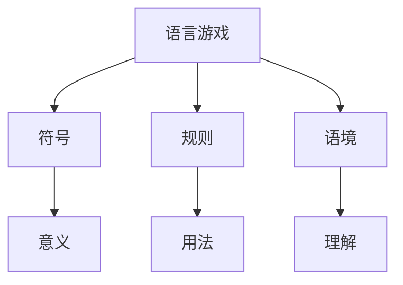
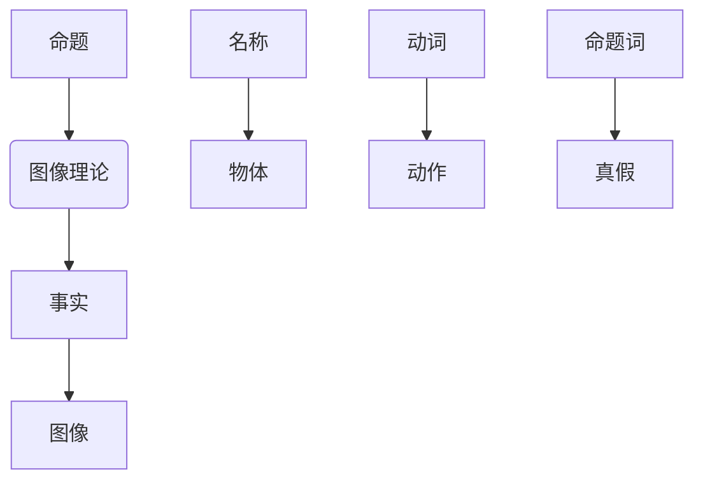
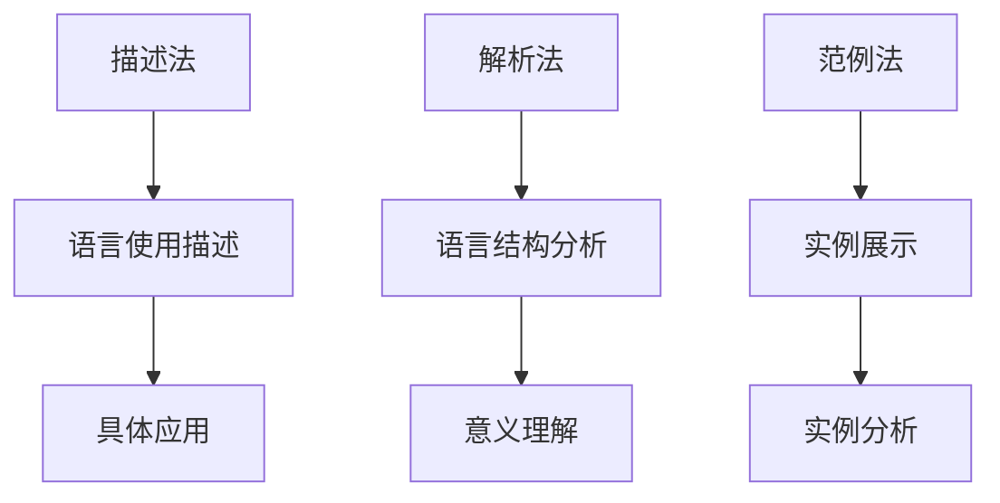
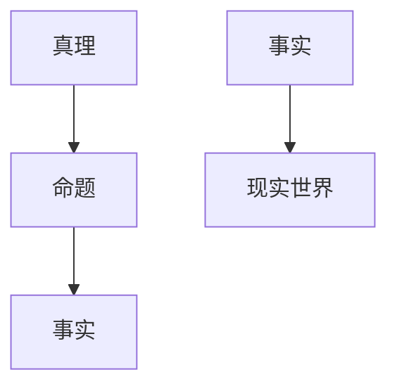
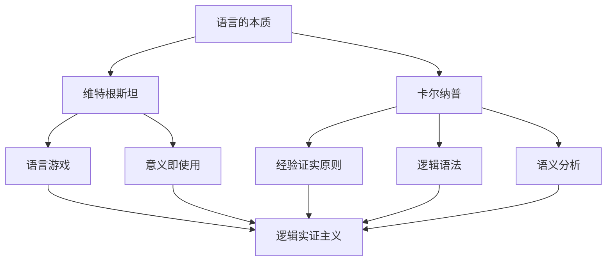
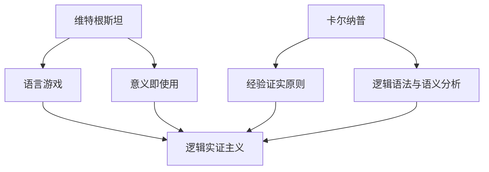

                 

### 维特根斯坦的生平与思想

路德维希·维特根斯坦（Ludwig Wittgenstein）是20世纪最杰出的哲学家之一，他的思想对西方哲学产生了深远的影响。维特根斯坦生于1889年4月26日，奥地利，他的家庭背景极为显赫，其父卡尔·维特根斯坦是著名的矿业大亨。尽管家庭富裕，但维特根斯坦的童年却并不快乐，他在与家人的互动中常常感到孤独和疏离。

在学术方面，维特根斯坦早年在瑞士和英国的私立学校接受教育，随后进入剑桥大学学习。在剑桥，他遇到了哲学家伯特兰·罗素（Bertrand Russell），这对他的哲学发展产生了决定性的影响。1906年，维特根斯坦开始与罗素合作研究数学逻辑，这段经历使他意识到哲学的核心问题在于语言的本质。

在早期，维特根斯坦的思想受到了实证主义和逻辑实证主义的影响。他的第一部重要作品《逻辑哲学论》（"Tractatus Logico-Philosophicus"）于1921年出版，这部著作被视为逻辑实证主义的巅峰之作。书中，维特根斯坦提出了“图像理论”（Image Theory），主张语言是思想的直接表达，命题是事实的图像，这一观点在当时哲学界引起了巨大争议。

然而，维特根斯坦的思想在他晚期发生了显著转变。他认为早期作品中的理论过于抽象，忽略了人类语言的实际使用。于是，他撰写了《哲学研究》（"Philosophical Investigations"），这是他后期思想的代表作。在这部著作中，维特根斯坦提出了“语言游戏”（Language Game）理论，强调语言使用是与特定的社会实践相结合的。他认为，语言的含义不是固定的，而是在使用中得以显现。

维特根斯坦的思想对语言哲学、心灵哲学、数学哲学等领域都有深远的影响。他主张哲学的根本问题在于对语言的正确理解，而不是对抽象理论的构建。这种语言中心主义（linguistic centrism）的观点促使后来的哲学家重新思考语言、思维和现实之间的关系。

总结来说，维特根斯坦的生平和思想经历了一个从早期逻辑实证主义到后期语言哲学的演变过程。他的理论不仅对哲学领域产生了深远影响，也为我们理解语言和思维的本质提供了宝贵的启示。在接下来的章节中，我们将进一步探讨维特根斯坦的语言分析理论及其应用。

### 维特根斯坦的语言分析理论

维特根斯坦的语言分析理论是他哲学思想的基石，其核心观点集中在语言的构成、意义、使用和真理等方面。在这部分，我们将详细探讨这些概念，并使用Mermaid流程图来展示它们之间的关系。

#### 语言与意义

维特根斯坦认为，语言是由一系列符号组成的，这些符号本身并没有固定的意义，而是通过其在特定语境中的使用来赋予意义。他提出了“语言游戏”（Language Game）的概念，即语言的使用是与特定的社会实践相联系的。每个语言游戏都有其特定的规则和目的。

- **语言游戏**：使用语言的活动，包括交流、思考、表达等。每个语言游戏都有特定的符号和规则。
  
- **规则**：语言游戏的规则定义了符号的使用方式和语言的意义。例如，棋类的规则定义了棋子的走法，数学的规则定义了数学公式的使用。

- **语境**：语言的意义是在特定语境中确定的。脱离语境，符号和语言将失去意义。

**Mermaid流程图：语言游戏模型**



#### 符号与命题

维特根斯坦将语言中的符号分为三类：名称、动词和命题词。名称直接指代物体或实体，动词表示动作或状态，命题词表示命题的真假。

- **名称**：指代特定物体或实体的符号，如“狗”、“水”等。
  
- **动词**：表示动作或状态的符号，如“跑”、“吃”等。

- **命题词**：表示命题真假的符号，如“是真的”、“是假的”等。

维特根斯坦认为，命题的意义在于其能够描述一个事实，即命题的真假取决于实际情况。他提出了“图像理论”（Image Theory），认为命题是事实的图像。

**Mermaid流程图：符号分类和图像理论**



#### 语言分析的方法

维特根斯坦强调，语言分析的关键在于理解语言的使用，而不是试图找出语言的普遍规则。他提出了“语言分析的三种方法”：

1. **描述法**：描述语言的使用情况，而不是试图解释语言的本质。
2. **解析法**：通过分析语言的结构来理解其含义。
3. **范例法**：通过具体的语言实例来展示语言的使用。

**Mermaid流程图：语言分析方法**



#### 真理与事实

维特根斯坦认为，真理与事实是紧密相连的。一个命题如果能够准确描述事实，就是真的；如果与事实不符，就是假的。他强调，真理不是抽象的概念，而是具体的事实状态。

- **真理**：命题能够准确描述事实的状态。
- **事实**：现实世界中具体存在的情况。

**Mermaid流程图：真理与事实的关系**



#### 举例说明

为了更好地理解维特根斯坦的语言分析理论，我们可以通过一个简单的例子来说明：

假设有一个命题：“猫在桌子上面。”

- **符号**：猫、桌子、在、上面。
- **语境**：这个命题是在讨论猫的位置。
- **意义**：这个命题描述了猫在桌子上的事实。

通过语言分析，我们可以理解这个命题的含义，并确定其在特定语境下的真伪。如果现实中有猫在桌子上，这个命题就是真的；如果没有，就是假的。

**伪代码：语言分析实例**

```python
# 输入：命题("猫在桌子上面")
# 输出：命题的真伪（True/False）

def analyze_sentence(sentence):
    # 提取符号
    symbols = extract_symbols(sentence)
    # 确定语境
    context = determine_context(sentence)
    # 分析符号和语境
    meaning = analyze_symbols(symbols, context)
    # 判断命题的真伪
    truth = is_true(meaning)
    return truth

# 输出：命题的真伪
print(analyze_sentence("猫在桌子上面"))
```

通过这个例子，我们可以看到如何通过维特根斯坦的语言分析理论来理解一个简单的命题。这种方法不仅帮助我们理解语言，也为哲学研究提供了新的视角。

总之，维特根斯坦的语言分析理论强调了语言使用的具体性和社会性。他的思想对后来的哲学研究产生了深远的影响，为我们理解语言、思维和现实之间的关系提供了重要的理论依据。

### 维特根斯坦的生平与思想

路德维希·维特根斯坦（Ludwig Wittgenstein）是20世纪最杰出的哲学家之一，他的思想对西方哲学产生了深远的影响。维特根斯坦生于1889年4月26日，奥地利，他的家庭背景极为显赫，其父卡尔·维特根斯坦是著名的矿业大亨。尽管家庭富裕，但维特根斯坦的童年却并不快乐，他在与家人的互动中常常感到孤独和疏离。

在学术方面，维特根斯坦早年在瑞士和英国的私立学校接受教育，随后进入剑桥大学学习。在剑桥，他遇到了哲学家伯特兰·罗素（Bertrand Russell），这对他的哲学发展产生了决定性的影响。1906年，维特根斯坦开始与罗素合作研究数学逻辑，这段经历使他意识到哲学的核心问题在于语言的本质。

在早期，维特根斯坦的思想受到了实证主义和逻辑实证主义的影响。他的第一部重要作品《逻辑哲学论》（"Tractatus Logico-Philosophicus"）于1921年出版，这部著作被视为逻辑实证主义的巅峰之作。书中，维特根斯坦提出了“图像理论”（Image Theory），主张语言是思想的直接表达，命题是事实的图像，这一观点在当时哲学界引起了巨大争议。

然而，维特根斯坦的思想在他晚期发生了显著转变。他认为早期作品中的理论过于抽象，忽略了人类语言的实际使用。于是，他撰写了《哲学研究》（"Philosophical Investigations"），这是他后期思想的代表作。在这部著作中，维特根斯坦提出了“语言游戏”（Language Game）理论，强调语言使用是与特定的社会实践相结合的。他认为，语言的含义不是固定的，而是在使用中得以显现。

维特根斯坦的思想对语言哲学、心灵哲学、数学哲学等领域都有深远的影响。他主张哲学的根本问题在于对语言的正确理解，而不是对抽象理论的构建。这种语言中心主义（linguistic centrism）的观点促使后来的哲学家重新思考语言、思维和现实之间的关系。

维特根斯坦的哲学生涯可以分为两个主要阶段：早期逻辑实证主义阶段和后期语言哲学阶段。早期，他关注逻辑和数学的基础，提出了著名的图像理论；而后期，他转向对语言实际使用的探讨，提出了语言游戏理论。这种转变不仅反映了维特根斯坦哲学思想的深度和广度，也体现了他在哲学领域持续不断的探索和思考。

维特根斯坦的生平和思想经历了一个从早期逻辑实证主义到后期语言哲学的演变过程。他的理论不仅对哲学领域产生了深远影响，也为我们理解语言和思维的本质提供了宝贵的启示。在接下来的章节中，我们将进一步探讨维特根斯坦的语言分析理论及其应用。

### 卡尔纳普的哲学与逻辑实证主义

鲁道夫·卡尔纳普（Rudolf Carnap）是20世纪另一位重要的哲学家，他的思想对逻辑实证主义的发展产生了深远的影响。与维特根斯坦不同，卡尔纳普更加关注科学的哲学基础和语言分析，他试图通过逻辑和数学的方法来解决哲学问题。

#### 卡尔纳普的生平与思想

卡尔纳普生于1891年5月18日，德国，他在柏林大学接受了教育，师从于著名哲学家恩斯特·马赫（Ernst Mach）和海因里希·沃尔夫（Heinrich Wolff）。马赫的实证主义思想对卡尔纳普产生了深刻影响，使他开始思考科学方法和语言的本质。

在哲学方面，卡尔纳普的主要贡献集中在逻辑实证主义领域。逻辑实证主义主张只有通过经验验证的命题才有意义，即“经验证实原则”（Empirical Verification Principle）。这一原则强调，哲学问题的解决应该基于科学方法和经验证据。

#### 经验证实原则

卡尔纳普认为，一个命题的意义取决于其是否能够通过经验来证实。具体来说，经验证实原则包括以下几个方面：

- **观察术语**：只有通过直接观察可以验证的术语才有意义。例如，“桌子”、“椅子”等是观察术语，可以通过视觉、触觉等感官来验证。

- **理论术语**：理论术语虽然不能直接通过观察验证，但其意义可以通过观察术语来解释。例如，“原子”、“电子”等理论术语，可以通过观察到的现象（如化学反应、电磁效应）来间接证实。

- **操作定义**：对于一些抽象的概念，可以通过操作定义来明确其意义。例如，可以将“速度”定义为物体在单位时间内通过的距离。

#### **逻辑语法与语义分析**

卡尔纳普在逻辑语法和语义分析方面做出了重要贡献。他主张，哲学研究应该采用逻辑和数学的工具，通过形式化的方法来分析语言和命题的结构。他的著作《语义学导论》（"Introduction to Semantics"）提出了逻辑语义学的基本原则。

- **逻辑语法**：研究语言的形式结构，包括命题、语句、逻辑连接词等。通过逻辑语法，可以分析命题的结构和逻辑关系。

- **语义分析**：研究语言的意义和解释，包括命题的真值、语义规则等。通过语义分析，可以确定命题的真假和语言的正确使用。

#### **卡尔纳普与维特根斯坦的对比**

尽管卡尔纳普和维特根斯坦都对语言分析有深刻见解，但他们的方法存在显著差异。

- **方法上的差异**：维特根斯坦强调语言的使用和具体情境，认为语言的意义在于其实际应用；而卡尔纳普则更加关注逻辑和数学的形式化方法，试图通过精确的语言结构来分析命题的意义。

- **对实证主义的看法**：维特根斯坦对实证主义持有一定的批判态度，认为实证主义过于狭隘；而卡尔纳普则认为实证主义是哲学研究的重要基础，强调经验证实原则。

- **哲学目标**：维特根斯坦的哲学目标在于揭示语言和思维的真相，强调语言中心主义；而卡尔纳普则试图通过逻辑实证主义来建立一种科学哲学，解决哲学问题。

总之，卡尔纳普的哲学思想在逻辑实证主义领域具有重要地位，他的理论和方法为哲学研究提供了新的视角。通过对卡尔纳普生平和思想的了解，我们可以更好地理解逻辑实证主义的核心观点和基本原理。

### 逻辑实证主义的基本原理

逻辑实证主义是20世纪哲学的重要流派，其核心思想是主张哲学问题的解决应基于科学方法和经验验证。鲁道夫·卡尔纳普（Rudolf Carnap）是这一流派的代表人物之一，他的理论对逻辑实证主义的发展产生了深远影响。在这一节中，我们将详细探讨逻辑实证主义的基本原理、起源和发展，以及其主要观点和批判。

#### 基本原理

逻辑实证主义的基本原理可以概括为以下几点：

1. **经验证实原则**：逻辑实证主义主张，只有那些可以通过经验验证的命题才有意义。这意味着，一个命题必须与观察到的经验事实相关联，才能被认为是有效的。

2. **还原原则**：逻辑实证主义认为，所有哲学问题都可以归结为科学问题。哲学上的争议可以通过科学的方法来澄清，即通过经验验证来解决。

3. **语义验证**：逻辑实证主义强调，命题的真假可以通过经验来验证。语义验证是通过分析命题的意义和其与经验事实的关系来确定的。

#### 起源和发展

逻辑实证主义的起源可以追溯到19世纪末和20世纪初的实证主义哲学。实证主义主张，哲学的研究应基于可观察和可验证的事实，而不是抽象的概念和理论。在20世纪初，逻辑实证主义逐渐形成并发展成为一个独立的哲学流派。

1. **前期实证主义**：包括奥古斯特·孔德（Auguste Comte）、约翰·斯图尔特·密尔（John Stuart Mill）等人的思想，他们强调科学方法和经验验证。

2. **逻辑实证主义**：在20世纪初期，由维也纳学派（Vienna Circle）的成员，如鲁道夫·卡尔纳普、莫里茨·石里克（Moritz Schlick）、理查德·冯·赖特（Richard von Mises）等人进一步发展。他们试图将实证主义与逻辑和数学的方法相结合，以解决哲学问题。

3. **后期发展**：在20世纪中后期，逻辑实证主义受到批判和发展，逐渐演变为分析哲学。一些哲学家，如瓦尔特·考夫曼（Walter Kaufmann）和玛丽·希尔德（Mary Hesse），提出了对逻辑实证主义的批判和改进。

#### 主要观点

逻辑实证主义的主要观点包括：

1. **科学哲学**：逻辑实证主义认为，哲学的研究应借鉴科学的方法，通过经验验证和逻辑分析来解决哲学问题。

2. **语言分析**：逻辑实证主义强调语言在哲学研究中的重要性。他们认为，哲学问题往往源于语言的使用和误解，通过语言分析可以澄清这些误解。

3. **意义论**：逻辑实证主义主张，一个命题的意义在于其能否通过经验来验证。如果命题不能被经验验证，则被认为是没有意义的。

#### 批判

尽管逻辑实证主义在哲学领域具有重要地位，但也受到了一些批判：

1. **经验验证的局限性**：逻辑实证主义过于强调经验验证，忽略了抽象概念和理论的重要性。

2. **语义验证的局限性**：一些哲学家认为，语义验证不能完全解决哲学问题，因为经验验证有时是有限的或不确定的。

3. **语言中心主义**：逻辑实证主义过于强调语言分析，忽视了其他哲学问题的探讨。

总之，逻辑实证主义作为一种哲学流派，在20世纪哲学中发挥了重要作用。它强调科学方法和经验验证，试图通过逻辑和数学的方法来解决哲学问题。尽管其存在局限性，但逻辑实证主义对哲学研究的方法和视角产生了深远的影响。

### 语言分析在维特根斯坦与卡尔纳普思想中的联系

维特根斯坦和卡尔纳普都是20世纪重要的哲学家，他们的思想在语言分析领域有着深刻的贡献。虽然两位哲学家的方法和观点存在差异，但在语言分析的核心概念和目标上，他们有着紧密的联系。在这部分，我们将探讨维特根斯坦与卡尔纳普对语言分析的理解、共同关注的问题与目标，并使用Mermaid流程图来展示他们之间的联系。

#### 对语言分析的理解

维特根斯坦和卡尔纳普都认为语言是哲学研究的核心，但他们各自的观点有所不同。

1. **维特根斯坦**：维特根斯坦主张语言的意义在于其具体的使用情境，即“语言游戏”（Language Game）。他认为，语言的使用是与特定的社会实践相联系的，每个语言游戏都有其特定的规则和目的。维特根斯坦强调，理解语言的含义需要关注其在实际中的运用。

2. **卡尔纳普**：卡尔纳普则更加关注逻辑和数学的形式化方法，认为语言分析可以通过逻辑语法和语义学来实现。他提出了“经验证实原则”（Empirical Verification Principle），主张只有那些可以通过经验验证的命题才有意义。卡尔纳普强调，语义验证是通过分析命题的结构和与经验事实的关系来确定的。

#### 共同关注的问题与目标

尽管两位哲学家的方法和观点有所不同，但在语言分析的核心问题和目标上，他们有着共同的关注点：

1. **语言的本质**：维特根斯坦和卡尔纳普都试图揭示语言的本质，理解语言如何表达思想和现实。

2. **意义的解释**：他们都认为，语言的意义不是固有的，而是通过使用和解释来确定的。维特根斯坦提出了“意义即使用”（Meaning is Use）的观点，卡尔纳普则强调通过逻辑和语义分析来确定命题的意义。

3. **逻辑实证主义**：两位哲学家都在逻辑实证主义背景下工作，强调科学方法和经验验证在哲学研究中的重要性。

#### Mermaid流程图：维特根斯坦与卡尔纳普的语言分析联系

为了更直观地展示维特根斯坦与卡尔纳普的语言分析联系，我们可以使用Mermaid流程图来表示他们共同关注的核心概念和理论。



#### 联系与差异

通过上述流程图，我们可以看到维特根斯坦和卡尔纳普在语言分析上的紧密联系。他们都关注语言的本质、意义的解释和逻辑实证主义。然而，他们在具体方法和视角上存在一些差异：

1. **方法上的差异**：维特根斯坦更注重语言的实际使用和社会实践，而卡尔纳普则更倾向于逻辑和数学的形式化方法。

2. **对实证主义的看法**：维特根斯坦对实证主义持批判态度，认为其过于狭隘；而卡尔纳普则认为实证主义是哲学研究的重要基础。

3. **哲学目标**：维特根斯坦的哲学目标在于揭示语言和思维的真相，强调语言中心主义；而卡尔纳普则试图通过逻辑实证主义来建立一种科学哲学。

尽管存在这些差异，维特根斯坦和卡尔纳普在语言分析领域的贡献是不可忽视的。他们的思想和理论共同推动了哲学的发展，为我们理解语言、思维和现实之间的关系提供了宝贵的视角。

### 维特根斯坦与卡尔纳普的思想对比与讨论

维特根斯坦和卡尔纳普在哲学上的贡献不可忽视，虽然他们都关注语言分析，但他们的方法和观点存在显著差异。在这部分，我们将对比两位哲学家的思想，探讨他们在语言分析中的贡献和差异，并使用Mermaid流程图来展示这些差异和联系。

#### 对语言分析的理解

维特根斯坦和卡尔纳普对语言分析的理解存在显著差异。

1. **维特根斯坦**：维特根斯坦强调语言的具体使用情境，提出了“语言游戏”（Language Game）理论。他认为，语言的意义在于其实际应用，每个语言游戏都有其特定的规则和目的。维特根斯坦主张，理解语言的含义需要关注其在实际中的运用。

2. **卡尔纳普**：卡尔纳普则更加关注逻辑和数学的形式化方法，认为语言分析可以通过逻辑语法和语义学来实现。他提出了“经验证实原则”（Empirical Verification Principle），主张只有那些可以通过经验验证的命题才有意义。卡尔纳普强调，语义验证是通过分析命题的结构和与经验事实的关系来确定的。

#### 语言分析中的贡献

在语言分析方面，维特根斯坦和卡尔纳普各自做出了重要贡献。

1. **维特根斯坦的贡献**：
   - **语言游戏理论**：维特根斯坦提出了“语言游戏”概念，强调语言的使用是与特定社会实践相结合的。这一理论揭示了语言的多面性和复杂性，为我们理解语言提供了新的视角。
   - **意义即使用**：维特根斯坦主张，语言的意义在于其具体的使用情境，这一观点挑战了传统哲学中对语言意义的固定理解。

2. **卡尔纳普的贡献**：
   - **经验证实原则**：卡尔纳普提出了经验证实原则，主张只有那些可以通过经验验证的命题才有意义。这一原则为逻辑实证主义奠定了基础，推动了哲学研究中的科学方法。
   - **逻辑语法与语义分析**：卡尔纳普通过逻辑语法和语义分析的方法，试图将哲学问题形式化，从而为哲学提供了一种更为精确和系统的研究方法。

#### 差异与联系

维特根斯坦和卡尔纳普在语言分析中的差异和联系可以通过以下Mermaid流程图来展示：



通过这个流程图，我们可以看到维特根斯坦和卡尔纳普在语言分析上的联系和差异：

1. **共同点**：
   - **逻辑实证主义**：两位哲学家都关注逻辑实证主义，认为科学方法和经验验证是哲学研究的重要基础。
   - **语言的重要性**：他们都认为语言是哲学研究的核心，强调语言在理解思想和现实中的关键作用。

2. **差异**：
   - **方法上的差异**：维特根斯坦更注重语言的实际使用和社会实践，而卡尔纳普则更倾向于逻辑和数学的形式化方法。
   - **对实证主义的看法**：维特根斯坦对实证主义持批判态度，认为其过于狭隘；而卡尔纳普则认为实证主义是哲学研究的重要基础。
   - **哲学目标**：维特根斯坦的哲学目标在于揭示语言和思维的真相，强调语言中心主义；而卡尔纳普则试图通过逻辑实证主义来建立一种科学哲学。

总之，维特根斯坦和卡尔纳普在语言分析领域各自做出了重要贡献，他们的思想和理论为我们理解语言、思维和现实之间的关系提供了宝贵的视角。通过对比和讨论，我们可以更好地理解他们的思想，并从中汲取哲学智慧。

### 维特根斯坦与卡尔纳普思想的影响与应用

维特根斯坦和卡尔纳普的哲学思想对20世纪的哲学、语言分析以及相关领域产生了深远的影响。他们的理论不仅推动了哲学的发展，也为语言分析、科学哲学、计算机科学等领域提供了新的视角和工具。在这部分，我们将探讨维特根斯坦与卡尔纳普思想在不同领域的影响与应用。

#### 哲学领域

维特根斯坦和卡尔纳普的哲学思想对20世纪的哲学产生了重大影响。维特根斯坦的“语言游戏”理论和“意义即使用”的观点挑战了传统哲学对语言和思维的理解，促使哲学家们重新思考语言、意义和现实之间的关系。他的晚期作品《哲学研究》尤其对后来的语言哲学和心灵哲学产生了深远影响，推动了日常语言哲学（ordinary language philosophy）的发展。

卡尔纳普的逻辑实证主义为哲学研究提供了一种新的方法，即通过逻辑和数学的形式化方法来分析命题和语言。他的理论为科学哲学和语义学奠定了基础，影响了后来的分析哲学派别，如“逻辑实证主义”、“批判理性主义”和“操作主义”。

#### 语言分析领域

维特根斯坦和卡尔纳普的思想对语言分析领域有着深远的影响。维特根斯坦的“语言游戏”理论揭示了语言的多面性和复杂性，为语言学家提供了新的视角，促使他们在研究语言时关注语言的实际使用和社会实践。他的思想也被应用于语义学和语用学的研究，为这些领域提供了理论基础。

卡尔纳普的经验证实原则和语义分析的方法为语言分析提供了一种形式化的研究途径。他的理论推动了逻辑语法和语义学的发展，为语言学家和哲学家提供了一种更为精确和系统的研究方法。

#### 科学哲学领域

卡尔纳普的逻辑实证主义对科学哲学的发展产生了重要影响。他的理论为科学方法论和科学知识的验证提供了基础，促进了科学哲学的研究。逻辑实证主义强调科学理论的可检验性和经验基础，影响了后来的科学哲学流派，如“批判理性主义”和“科学实在论”。

维特根斯坦的思想也为科学哲学提供了新的视角。他通过对语言和思维的分析，揭示了科学理论中的语言问题，推动了科学哲学中对语言和意义的探讨。

#### 计算机科学领域

维特根斯坦和卡尔纳普的思想在计算机科学领域也得到了应用。维特根斯坦的“意义即使用”的观点为编程语言的设计和语义分析提供了理论基础。他的思想启示了程序设计者如何通过明确的语言设计来避免歧义，提高程序的可理解性和可靠性。

卡尔纳普的经验证实原则和逻辑分析方法也为计算机科学提供了方法论支持。他的理论影响了计算机科学中的形式化方法和模型检验，为软件开发和系统验证提供了工具。

#### 实际案例

为了更直观地展示维特根斯坦与卡尔纳普思想的应用，我们可以通过一个实际案例来探讨：

**案例：自然语言处理中的语义分析**

在自然语言处理（NLP）领域，语义分析是关键任务之一。维特根斯坦的“语言游戏”理论可以帮助我们理解语言的使用情境，从而更好地分析自然语言中的语义。例如，在机器翻译中，理解句子中的词语和短语的实际意义是至关重要的。通过应用维特根斯坦的理论，我们可以识别句子中的不同语言游戏，从而提高翻译的准确性。

卡尔纳普的经验证实原则和逻辑分析方法为语义分析提供了一种形式化的方法。在NLP中，我们可以使用逻辑语法和语义网络来表示语言的结构和意义。通过分析语言的结构和语义，我们可以构建更精确的语义模型，从而提高自然语言处理系统的性能。

**伪代码示例：语义分析中的逻辑语法**

```python
# 输入：句子（Sentence）
# 输出：语义表示（Semantic Representation）

def semantic_analysis(sentence):
    # 提取句子中的词汇和短语
    words = extract_words(sentence)
    # 分析词汇和短语的结构
    structure = analyze_structure(words)
    # 构建语义表示
    semantic_representation = build_representation(structure)
    return semantic_representation

# 输出：语义表示
print(semantic_analysis("The cat is on the table."))
```

通过这个伪代码示例，我们可以看到如何通过维特根斯坦和卡尔纳普的思想来分析自然语言中的语义。这种方法不仅帮助我们理解语言，也为NLP的应用提供了重要的理论支持。

总之，维特根斯坦与卡尔纳普的哲学思想在多个领域产生了深远影响。他们的理论为我们理解语言、思维和现实之间的关系提供了新的视角，也为实际应用提供了重要的方法和技术。通过进一步的研究和探索，我们可以继续从他们的思想中汲取智慧，推动各个领域的发展。

### 维特根斯坦与卡尔纳普思想的综合评价

维特根斯坦和卡尔纳普是20世纪哲学领域的两位重要人物，他们的思想在语言分析、逻辑实证主义和科学哲学等领域产生了深远的影响。通过对他们思想的分析，我们可以看到，虽然两位哲学家在方法和视角上有所不同，但他们的贡献都是不可忽视的。

#### 贡献与影响

维特根斯坦的“语言游戏”理论和“意义即使用”的观点为哲学提供了新的视角。他强调语言的具体使用情境，揭示了语言的多面性和复杂性，推动了日常语言哲学的发展。他的思想对后来的语言哲学、心灵哲学和科学哲学产生了重要影响。维特根斯坦的工作促使哲学家重新思考语言的本质和意义，以及它们与思想和现实之间的关系。

卡尔纳普的逻辑实证主义则为哲学研究提供了一种形式化的方法。他的经验证实原则和语义分析的方法为科学哲学奠定了基础，影响了分析哲学的发展。卡尔纳普的工作强调了科学方法和经验验证在哲学研究中的重要性，推动了科学哲学和语义学的进步。

#### 差异与联系

维特根斯坦和卡尔纳普在方法上存在显著差异。维特根斯坦更关注语言的实际使用和社会实践，强调语言的具体情境；而卡尔纳普则更注重逻辑和数学的形式化方法，试图通过精确的语言结构来分析命题的意义。尽管他们在方法和视角上有所不同，但在关注语言和意义的问题上，他们有着共同的目标。

#### 未来展望

维特根斯坦和卡尔纳普的思想在当今的哲学和科学研究中仍然具有重要价值。他们的理论不仅为我们理解语言、思维和现实之间的关系提供了新的视角，也为实际应用提供了重要的方法和技术。未来，我们可以继续从他们的思想中汲取智慧，进一步探索语言分析、科学哲学和计算机科学等领域。

在语言哲学方面，维特根斯坦的“语言游戏”理论和“意义即使用”的观点可以继续应用于自然语言处理、语义分析和语言教学等领域，为我们理解和应用语言提供新的思路。卡尔纳普的经验证实原则和语义分析的方法可以为科学哲学的研究提供新的工具，帮助我们更好地理解科学理论和实践。

在计算机科学领域，维特根斯坦和卡尔纳普的思想可以应用于编程语言的设计、软件工程和人工智能的发展中。通过深入理解和应用他们的理论，我们可以构建更精确、可靠的计算机系统，推动技术的进步。

总之，维特根斯坦和卡尔纳普的思想在哲学、语言分析和科学哲学等领域都具有深远的影响。他们的理论不仅为我们提供了新的视角和方法，也为未来的研究提供了宝贵的启示。通过对他们思想的深入研究和应用，我们可以继续推动哲学和科学的发展，为人类文明的进步做出贡献。

