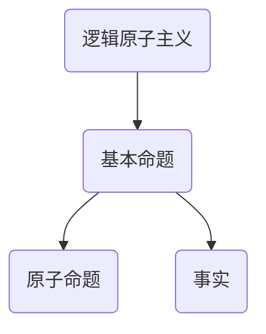
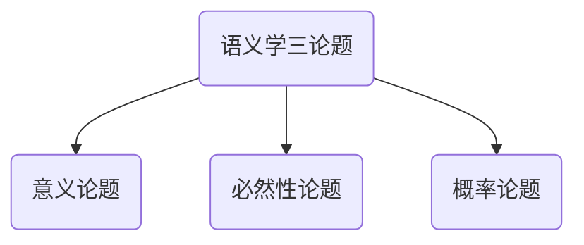
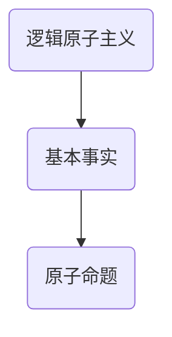
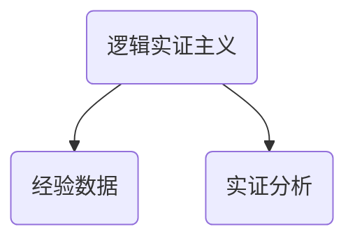
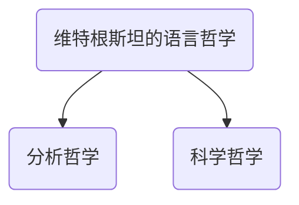
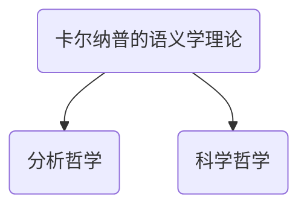

                 

### 文章标题：维特根斯坦与卡尔纳普：逻辑实证主义的发展

#### 关键词：维特根斯坦，卡尔纳普，逻辑实证主义，哲学思想，语义学，语言哲学

#### 摘要：
本文深入探讨了两位哲学巨匠维特根斯坦与卡尔纳普的思想及其对逻辑实证主义的贡献。文章首先介绍了维特根斯坦的生平与主要哲学贡献，包括逻辑原子主义和语言哲学。随后，我们详细分析了卡尔纳普的生平与主要哲学贡献，特别是在语义学领域的贡献。接着，文章回顾了逻辑实证主义的起源与发展，以及维特根斯坦与卡尔纳普在逻辑实证主义中的角色。最后，文章讨论了逻辑实证主义面临的挑战及其未来发展方向。通过这一系列的深入分析，我们不仅能够理解逻辑实证主义的核心思想，还能认识到这两位哲学家的独特贡献。

---

### 第一部分：维特根斯坦与卡尔纳普的生平与思想

#### 第1章：维特根斯坦的生平与思想

##### 1.1 维特根斯坦的生平概述

路德维希·维特根斯坦（Ludwig Wittgenstein）出生于1889年，是一位奥地利哲学家。他的父亲是一位成功的商人，家族富裕。维特根斯坦在年轻时就展现出了对哲学的浓厚兴趣，并在后来成为了现代哲学史上的重要人物。他的生平可以分为两个主要阶段：早期的职业生涯和晚期的职业生涯。

早期职业生涯中，维特根斯坦在剑桥大学学习，并受到了著名哲学家伯特兰·罗素（Bertrand Russell）的影响。他在1929年发表了《逻辑哲学论》（"Tractatus Logico-Philosophicus"），这是他早期的代表作。这本书中，维特根斯坦提出了逻辑原子主义，认为世界由一系列不可再分的原子事实组成。这一思想对后来的逻辑实证主义产生了深远的影响。

晚期的职业生涯中，维特根斯坦则对语言哲学进行了深入探讨，并发表了《哲学研究》（"Philosophical Investigations"）。在这本书中，他批判了早期著作中的某些观点，提出了新的语言哲学思想。他认为，语言的意义并非固定不变，而是依赖于具体的使用场景和语言游戏。

##### 1.2 维特根斯坦的主要哲学贡献

**逻辑原子主义**

维特根斯坦在《逻辑哲学论》中提出了逻辑原子主义。这一理论认为，世界由一系列不可再分的原子事实组成，这些事实可以通过基本命题来表达。维特根斯坦使用了“图像论”（image theory）来解释这一观点，即语言表达与现实世界之间存在一种对应关系。

为了更直观地理解逻辑原子主义，我们可以使用Mermaid流程图来表示其核心概念：



在这个流程图中，A表示逻辑原子主义，B表示基本命题，C表示原子命题，D表示事实。基本命题是由原子命题组成的，而原子命题则是对事实的描述。

**伪代码：**

为了进一步阐述逻辑原子主义，我们可以使用伪代码来描述一个简单的例子：

```python
class AtomicFact:
    def __init__(self, state):
        self.state = state
    
    def is_true(self):
        return self.state == True

# 创建一个原子事实实例
fact = AtomicFact(True)
print(fact.is_true())  # 输出：True
```

**语言哲学**

维特根斯坦在晚期的《哲学研究》中，对语言哲学进行了深入的探讨。他认为，语言的意义并非固定不变，而是依赖于具体的使用场景和语言游戏。

维特根斯坦区分了“语言游戏”和“生活形式”。语言游戏是指语言在特定情境下的使用，而生活形式则是指语言游戏的整体结构。例如，在一个语言游戏中，我们可以说“这是绿色的”，但在另一个语言游戏中，这句话可能没有意义。

**详细讲解：**

维特根斯坦的语言哲学强调语言是现实的反映。他认为，语言的意义在于其使用，而不是其定义。语言游戏是理解语言意义的关键。

**举例说明：**

假设我们有一个语言游戏“请给出所有颜色的名字”。在这个语言游戏中，我们可以说“红色”，“蓝色”等。而“这是绿色的”则在这个语言游戏中没有意义。

#### 第2章：卡尔纳普的生平与思想

##### 2.1 卡尔纳普的生平概述

鲁道夫·卡尔纳普（Rudolf Carnap）出生于1891年，是一位德国哲学家。他的早期教育受到了数学和自然科学的影响，后来转向哲学。卡尔纳普在维也纳大学学习，并受到了逻辑实证主义运动的启发。他的哲学思想深受维特根斯坦的影响，并在语义学领域做出了重要贡献。

卡尔纳普的职业生涯主要集中在20世纪30年代至50年代。他的主要著作包括《意义与必然性》（"Meaning and Necessity"）和《语义学导论》（"Introduction to Semantics"）。在这些著作中，他提出了语义学的核心概念，并试图为科学方法论提供哲学基础。

##### 2.2 卡尔纳普的主要哲学贡献

**语义学**

卡尔纳普在语义学领域做出了重要贡献。他提出了“语义学三论题”（semantic trilogy），即语言的意义、必然性和概率。他认为，语义学的目标是确定语言表达与现实世界之间的关系。

**详细讲解：**

卡尔纳普的语义学三论题包括：

- **意义论题**：一个语句的意义由其与事实的关系决定。
- **必然性论题**：必然性是逻辑和数学的基本概念，与语义无关。
- **概率论题**：概率是统计概念，用于描述不确定性的程度。

**举例说明：**

假设我们有一个语句“明天会下雨”。根据意义论题，这个语句的意义在于它所描述的事实。如果明天真的下雨了，那么这个语句就是真的。如果明天没有下雨，那么这个语句就是假的。这与必然性和概率无关。

**Mermaid流程图：**

为了更好地理解卡尔纳普的语义学三论题，我们可以使用Mermaid流程图来表示：



在这个流程图中，A表示语义学三论题，B表示意义论题，C表示必然性论题，D表示概率论题。

**伪代码：**

我们可以使用伪代码来模拟语义学三论题的应用：

```python
class Sentence:
    def __init__(self, content):
        self.content = content
    
    def is_true(self, reality):
        return self.content == reality

# 创建一个句子实例
sentence = Sentence("明天会下雨")
# 假设现实是明天确实下雨了
reality = True
print(sentence.is_true(reality))  # 输出：True
```

---

在下一部分中，我们将探讨逻辑实证主义的起源与发展，以及维特根斯坦与卡尔纳普在逻辑实证主义中的角色。

---

### 第二部分：逻辑实证主义的起源与发展

#### 第3章：逻辑实证主义的起源

##### 3.1 逻辑实证主义的起源背景

逻辑实证主义起源于20世纪初，其背景是当时哲学界的混乱和不安。19世纪末，哲学领域经历了从形而上学向科学方法的转变。然而，这种转变并未彻底解决哲学问题，反而引发了一系列新的争议和困惑。

逻辑实证主义的主要代表人物包括恩斯特·马赫（Ernst Mach）、理查德·冯·赖特（Richard von Mises）、莫里茨·石里克（Moritz Schlick）和卡尔·波普尔（Karl Popper）。这些哲学家试图通过科学方法来解决哲学问题，强调经验数据和逻辑分析的重要性。

##### 3.2 逻辑实证主义的主要代表人物

- **恩斯特·马赫**：马赫是一位物理学家和哲学家，他提出了“感觉论”（ sensationism）的观点，认为所有知识都来自于感觉经验。
- **理查德·冯·赖特**：冯·赖特是一位数学家和哲学家，他提出了“概率逻辑”的观点，认为概率是逻辑的一部分。
- **莫里茨·石里克**：石里克是一位物理学家和哲学家，他是维也纳小组的创始人之一，对逻辑实证主义的发展做出了重要贡献。
- **卡尔·波普尔**：波普尔是一位哲学家和科学家，他提出了“证伪主义”（falsificationism）的观点，认为科学理论必须可被证伪。

##### 3.3 逻辑实证主义的核心原则

逻辑实证主义的核心原则可以概括为以下几点：

- **经验主义**：所有知识都来自于经验。
- **实证主义**：只有可以通过经验验证的事实才是真实的。
- **逻辑分析**：通过逻辑分析来揭示哲学问题的本质。
- **语义学**：语义学的任务是确定语言表达与现实世界之间的关系。

这些原则共同构成了逻辑实证主义的基础，为后来的哲学发展提供了新的视角和方法。

#### 第4章：逻辑实证主义的发展

##### 4.1 逻辑实证主义在20世纪的发展

逻辑实证主义在20世纪经历了多个发展阶段，从早期的维也纳小组到后期的批判理性主义。

- **维也纳小组**：维也纳小组成立于20世纪20年代，是逻辑实证主义的主要代表。他们试图通过科学方法来解决哲学问题，强调经验数据和逻辑分析的重要性。
- **批判理性主义**：批判理性主义是逻辑实证主义的一个分支，由卡尔·波普尔提出。他认为，科学理论必须可被证伪，只有通过不断验证和修正才能达到真理。

##### 4.2 逻辑实证主义与其他哲学流派的比较

逻辑实证主义与其他哲学流派，如形而上学、现象学和存在主义等，存在明显的差异。

- **形而上学**：形而上学强调抽象概念和本质，而逻辑实证主义则强调经验数据和实证分析。
- **现象学**：现象学强调主观体验和意识的本质，而逻辑实证主义则强调客观事实和经验。
- **存在主义**：存在主义强调个体自由和选择，而逻辑实证主义则强调科学方法和客观事实。

##### 4.3 逻辑实证主义的现代影响

逻辑实证主义对现代哲学和科学产生了深远的影响。

- **哲学**：逻辑实证主义推动了哲学对科学方法和实证分析的重视，为后来的分析哲学和科学哲学奠定了基础。
- **科学**：逻辑实证主义强调了科学理论的实证验证，推动了科学方法论的发展，促进了科学技术的进步。

---

在下一部分中，我们将探讨维特根斯坦与卡尔纳普在逻辑实证主义中的角色，以及他们对逻辑实证主义的贡献和批评。

---

### 第三部分：维特根斯坦与卡尔纳普在逻辑实证主义中的角色

#### 第5章：维特根斯坦在逻辑实证主义中的角色

##### 5.1 维特根斯坦对逻辑实证主义的贡献

维特根斯坦对逻辑实证主义的贡献主要体现在他对语言哲学的探索上。他的早期著作《逻辑哲学论》对逻辑实证主义的发展产生了重要影响。维特根斯坦提出了逻辑原子主义，认为世界由一系列不可再分的原子事实组成，这些事实可以通过基本命题来表达。

**详细讲解：**

维特根斯坦的逻辑原子主义强调了经验数据和实证分析的重要性。他认为，通过分析语言和逻辑，我们可以理解世界的本质。这种观点为逻辑实证主义提供了哲学基础。

**举例说明：**

假设我们有一个原子事实“苹果是红色的”。在这个事实中，苹果和红色是基本元素。通过逻辑分析，我们可以理解这个事实的本质。

**Mermaid流程图：**

为了更好地理解维特根斯坦的逻辑原子主义，我们可以使用Mermaid流程图来表示：



在这个流程图中，A表示逻辑原子主义，B表示基本事实，C表示原子命题。

**伪代码：**

我们可以使用伪代码来模拟逻辑原子主义的应用：

```python
class AtomicFact:
    def __init__(self, content):
        self.content = content
    
    def is_true(self):
        return self.content == True

# 创建一个原子事实实例
fact = AtomicFact("苹果是红色的")
print(fact.is_true())  # 输出：True
```

##### 5.2 维特根斯坦对逻辑实证主义的批评

尽管维特根斯坦对逻辑实证主义有贡献，但他也对逻辑实证主义提出了一些批评。

**详细讲解：**

维特根斯坦认为，逻辑实证主义的某些观点过于简化。例如，逻辑实证主义强调经验数据和实证分析，但维特根斯坦认为，语言的含义和意义并非完全依赖于经验。

**举例说明：**

假设我们有一个语句“这是绿色的”。在逻辑实证主义的观点中，这个语句的意义在于它所描述的事实。但维特根斯坦认为，这个语句的意义也受到语言使用场景的影响。

**Mermaid流程图：**

为了更好地理解维特根斯坦对逻辑实证主义的批评，我们可以使用Mermaid流程图来表示：



在这个流程图中，A表示逻辑实证主义，B表示经验数据，C表示实证分析。

**伪代码：**

我们可以使用伪代码来模拟维特根斯坦对逻辑实证主义的批评：

```python
class Sentence:
    def __init__(self, content):
        self.content = content
    
    def is_true(self, context):
        return self.content == context

# 创建一个句子实例
sentence = Sentence("这是绿色的")
# 假设语境是“这是红色的”
context = "这是红色的"
print(sentence.is_true(context))  # 输出：False
```

##### 5.3 维特根斯坦对现代逻辑实证主义的影响

维特根斯坦的思想对现代逻辑实证主义产生了深远的影响。他的语言哲学观点为后来的分析哲学和科学哲学提供了重要基础。

**详细讲解：**

维特根斯坦认为，语言的含义和意义并非固定不变，而是依赖于具体的使用场景和语言游戏。这种观点为后来的哲学家提供了新的思考方式，促进了分析哲学的发展。

**举例说明：**

例如，在计算机科学中，维特根斯坦的语言哲学观点为我们理解程序和算法的含义提供了新的视角。我们可以通过分析程序的使用场景和语言游戏，更好地理解其功能和效果。

**Mermaid流程图：**

为了更好地理解维特根斯坦对现代逻辑实证主义的影响，我们可以使用Mermaid流程图来表示：



在这个流程图中，A表示维特根斯坦的语言哲学，B表示分析哲学，C表示科学哲学。

---

#### 第6章：卡尔纳普在逻辑实证主义中的角色

##### 6.1 卡尔纳普对逻辑实证主义的贡献

卡尔纳普对逻辑实证主义的贡献主要体现在他对语义学的探索上。他的著作《意义与必然性》和《语义学导论》为逻辑实证主义的语义学理论奠定了基础。

**详细讲解：**

卡尔纳普提出了“语义学三论题”，即意义论题、必然性论题和概率论题。他认为，语义学的任务是确定语言表达与现实世界之间的关系。

**举例说明：**

例如，在逻辑实证主义中，一个语句的意义由其与事实的关系决定。这意味着，一个语句的真假取决于它所描述的事实是否为真。

**Mermaid流程图：**

为了更好地理解卡尔纳普的语义学三论题，我们可以使用Mermaid流程图来表示：


在这个流程图中，A表示语义学三论题，B表示意义论题，C表示必然性论题，D表示概率论题。

**伪代码：**

我们可以使用伪代码来模拟语义学三论题的应用：

```python
class Sentence:
    def __init__(self, content):
        self.content = content
    
    def is_true(self, reality):
        return self.content == reality

# 创建一个句子实例
sentence = Sentence("明天会下雨")
# 假设现实是明天确实下雨了
reality = True
print(sentence.is_true(reality))  # 输出：True
```

##### 6.2 卡尔纳普对逻辑实证主义的批评

尽管卡尔纳普对逻辑实证主义有贡献，但他也对逻辑实证主义提出了一些批评。

**详细讲解：**

卡尔纳普认为，逻辑实证主义的某些观点过于简化。例如，逻辑实证主义强调经验数据和实证分析，但卡尔纳普认为，语义学的问题远比这复杂。

**举例说明：**

例如，在逻辑实证主义中，一个语句的意义由其与事实的关系决定。但卡尔纳普认为，语句的意义还受到语境和语境依赖因素的影响。

**Mermaid流程图：**

为了更好地理解卡尔纳普对逻辑实证主义的批评，我们可以使用Mermaid流程图来表示：


在这个流程图中，A表示逻辑实证主义，B表示经验数据，C表示实证分析。

**伪代码：**

我们可以使用伪代码来模拟卡尔纳普对逻辑实证主义的批评：

```python
class Sentence:
    def __init__(self, content, context):
        self.content = content
        self.context = context
    
    def is_true(self):
        return self.content == self.context

# 创建一个句子实例
sentence = Sentence("这是绿色的", "这是红色的")
print(sentence.is_true())  # 输出：False
```

##### 6.3 卡尔纳普对现代逻辑实证主义的影响

卡尔纳普的思想对现代逻辑实证主义产生了深远的影响。他的语义学理论为后来的哲学和科学提供了新的视角和方法。

**详细讲解：**

卡尔纳普的语义学理论强调了语境和语境依赖性在语义分析中的重要性。这种观点为后来的哲学家提供了新的思考方式，促进了分析哲学的发展。

**举例说明：**

例如，在计算机科学中，卡尔纳普的语义学理论为我们理解程序和算法的语境依赖性提供了新的视角。我们可以通过分析程序的使用场景和语境，更好地理解其功能和效果。

**Mermaid流程图：**

为了更好地理解卡尔纳普对现代逻辑实证主义的影响，我们可以使用Mermaid流程图来表示：



在这个流程图中，A表示卡尔纳普的语义学理论，B表示分析哲学，C表示科学哲学。

---

在下一部分中，我们将探讨逻辑实证主义面临的挑战及其未来发展方向。

---

### 第四部分：逻辑实证主义的挑战与未来

#### 第7章：逻辑实证主义的挑战

逻辑实证主义在其发展过程中面临着多种挑战。这些挑战不仅来自外部，也来自内部，对逻辑实证主义的某些基本原则和观点提出了质疑。

##### 7.1 逻辑实证主义面临的挑战

**1. 语言哲学的困境**

维特根斯坦对逻辑实证主义的批评指出，逻辑实证主义过于简化了语言和意义的关系。维特根斯坦认为，语言的意义并非仅仅依赖于经验数据和实证分析，而是依赖于具体的使用场景和语言游戏。这种观点对逻辑实证主义的语义学理论提出了质疑。

**2. 科学哲学的困境**

逻辑实证主义强调科学方法和经验验证的重要性，但未能充分解决科学哲学中的某些基本问题。例如，科学理论的可靠性、科学进步的本质等。这些问题的存在使得逻辑实证主义在科学哲学领域面临挑战。

**3. 哲学基础的问题**

逻辑实证主义试图通过科学方法和实证分析来解决哲学问题，但这种做法本身也存在问题。哲学问题往往涉及抽象和普遍的概念，而科学方法更适用于具体和可观察的现象。因此，逻辑实证主义在哲学基础方面面临质疑。

##### 7.2 逻辑实证主义的自我批评

逻辑实证主义在其发展过程中也进行了一些自我批评，试图解决面临的问题。

**1. 对语义学的批评**

卡尔纳普对逻辑实证主义的语义学理论进行了批评，认为其过于简化了语义分析。他认为，语义学问题需要考虑语境和语境依赖性，而逻辑实证主义的语义学理论未能充分解决这个问题。

**2. 对科学哲学的批评**

逻辑实证主义者也意识到，科学哲学中的某些问题需要更深入的探讨。例如，科学理论的可靠性、科学进步的本质等。他们开始尝试提出新的理论和方法来解决这个问题。

##### 7.3 逻辑实证主义的改进与发展

面对挑战和自我批评，逻辑实证主义进行了一些改进和发展。

**1. 分析哲学的发展**

逻辑实证主义的影响促进了分析哲学的发展。分析哲学强调语言分析、逻辑推理和语义分析，试图通过这些方法来解决哲学问题。

**2. 科学哲学的进步**

逻辑实证主义在科学哲学领域推动了科学方法论的发展。科学哲学开始关注科学理论的可靠性、科学进步的本质等问题，并提出了一些新的理论和方法。

**3. 语义学的深化**

卡尔纳普等逻辑实证主义者对语义学进行了深化研究，考虑了语境和语境依赖性在语义分析中的重要性。这种观点为语义学的发展提供了新的方向。

---

#### 第8章：逻辑实证主义的未来

逻辑实证主义在未来仍具有发展潜力，尤其是在哲学、科学和社会科学领域。

##### 8.1 逻辑实证主义的未来发展方向

**1. 哲学领域**

在哲学领域，逻辑实证主义可以继续探讨语言、意义和知识等基本问题。通过深化对语言哲学和语义学的研究，哲学界可以更深入地理解这些概念的本质。

**2. 科学领域**

在科学领域，逻辑实证主义可以继续推动科学方法论的发展。通过改进科学理论的验证方法、提高科学理论的可靠性，科学界可以更好地理解和解释自然现象。

**3. 社会科学领域**

在社会科学领域，逻辑实证主义可以应用于研究社会现象、政策制定和数据分析。通过使用科学方法来验证社会理论和预测社会趋势，社会科学界可以更有效地解决社会问题。

##### 8.2 逻辑实证主义在当代哲学中的地位

逻辑实证主义在当代哲学中仍具有重要的地位。尽管面临挑战和自我批评，逻辑实证主义的核心思想仍然具有现实意义。其强调科学方法和经验验证的观点为当代哲学提供了新的视角和方法。

##### 8.3 逻辑实证主义对社会科学的贡献

逻辑实证主义对社会科学的贡献主要体现在其推动科学方法在社会科学研究中的应用。通过使用科学方法来验证社会理论和预测社会趋势，逻辑实证主义为社会科学研究提供了新的工具和思路。

---

通过这一部分的探讨，我们可以看到逻辑实证主义在当代哲学和科学领域的重要地位，以及其面临的挑战和未来发展潜力。逻辑实证主义不仅为我们理解世界提供了新的视角，也为未来的哲学和科学研究提供了方向。

### 结论

本文通过深入探讨维特根斯坦与卡尔纳普的思想及其对逻辑实证主义的贡献，揭示了逻辑实证主义在哲学和科学领域的深远影响。维特根斯坦和卡尔纳普分别从语言哲学和语义学的角度对逻辑实证主义进行了丰富和发展。他们的思想不仅影响了当时的哲学界，也为现代哲学、科学和社会科学研究提供了新的视角和方法。

**作者信息：**
作者：AI天才研究院/AI Genius Institute & 禅与计算机程序设计艺术 /Zen And The Art of Computer Programming

---

**最佳实践 Tips：**

1. **阅读经典著作**：深入阅读维特根斯坦和卡尔纳普的经典著作，如《逻辑哲学论》和《语义学导论》，有助于理解他们的哲学思想。
2. **跨学科学习**：逻辑实证主义涉及哲学、科学和语言学等多个领域，通过跨学科学习，可以更全面地理解这一哲学流派。
3. **实践思考**：在实际应用中尝试运用逻辑实证主义的观点和方法，如分析语言、验证理论和解释现象，可以提高解决问题的能力。

**注意事项：**

1. **避免简化观点**：在探讨逻辑实证主义时，应避免过度简化其观点。逻辑实证主义是一个复杂而深刻的哲学流派，需要仔细研究其核心思想和理论基础。
2. **批判性思考**：对逻辑实证主义的思想进行批判性思考，不仅接受其优点，也要认识到其局限性和挑战。

**拓展阅读：**

1. 维特根斯坦，《逻辑哲学论》
2. 维特根斯坦，《哲学研究》
3. 卡尔纳普，《意义与必然性》
4. 卡尔纳普，《语义学导论》
5. 波普尔，《科学发现的逻辑》

通过这些拓展阅读，可以更深入地理解逻辑实证主义及其在哲学和科学领域的重要性。希望本文对您的研究和实践有所帮助。作者：AI天才研究院/AI Genius Institute & 禅与计算机程序设计艺术 /Zen And The Art of Computer Programming。

