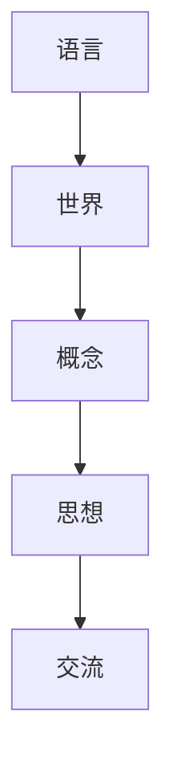
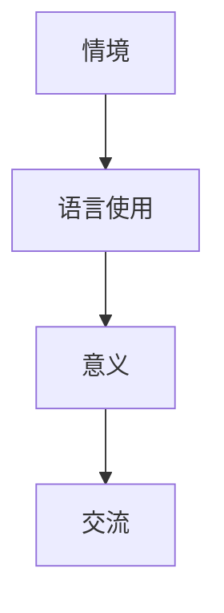
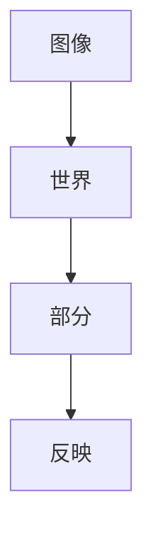
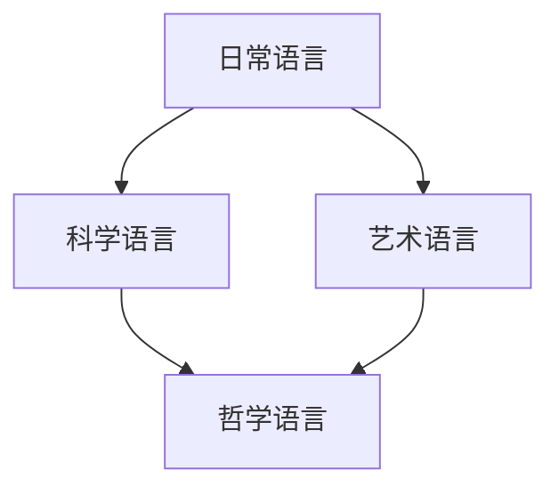

                 

### 文章标题：维特根斯坦与古德曼：语言与世界构造的关系

### 关键词：维特根斯坦、古德曼、语言哲学、世界构造、认知科学

### 摘要：

本文深入探讨了维特根斯坦和古德曼这两位哲学家的语言哲学思想及其对世界构造的影响。通过梳理两位哲学家的生平、核心观点和理论贡献，我们旨在揭示语言与世界之间的复杂关系，并探讨这一关系在认知科学和人工智能领域的应用。文章采用逻辑清晰、结构紧凑的技术语言，结合实际案例，对核心概念、算法原理、数学模型及项目实战进行了详细分析，为读者提供了全面、系统的理解。

---

### 引言

语言是人类认知和交流的基础，是理解世界的重要工具。在哲学领域，对语言与世界关系的探讨自古以来就具有深远的影响。维特根斯坦（Ludwig Wittgenstein）和古德曼（Nuel D. Belnap）是20世纪最具影响力的哲学家，他们对语言哲学的贡献尤为显著。维特根斯坦以其独特的语言游戏理论闻名，而古德曼则以其怀疑主义和语言与感知理论引发了广泛的哲学讨论。

本文旨在通过对维特根斯坦与古德曼的语言哲学思想的深入探讨，揭示他们对于语言与世界构造关系的独特见解。文章首先介绍两位哲学家的生平和哲学背景，然后分别阐述他们的核心观点和理论贡献。在此基础上，我们将对比分析两位哲学家的观点，探讨他们的共同点和差异。随后，本文将探讨维特根斯坦与古德曼的理论对现代语言哲学、认知科学和人工智能的影响。最后，通过实际案例和项目实战，我们将展示这些理论在现实中的应用。

### 第一步：确定书的核心主题

《维特根斯坦与古德曼：语言与世界构造的关系》这本书的核心主题是探讨维特根斯坦与古德曼这两位哲学家对于语言与世界之间关系的观点和理论。具体来说，我们关注以下几个关键方面：

1. **语言作为认知工具**：探讨语言如何帮助人们理解世界，以及语言与世界之间的映射关系。
2. **语言哲学的基本问题**：包括语言的意义、使用以及语言与感知、意识的关系等。
3. **维特根斯坦的语言游戏理论**：分析维特根斯坦如何通过语言游戏来理解语言和世界的关系。
4. **古德曼的怀疑主义和感知理论**：探讨古德曼如何通过怀疑主义和语言与感知理论来挑战传统哲学观点。
5. **语言哲学在现代认知科学和人工智能中的应用**：分析维特根斯坦与古德曼的理论如何影响认知科学和人工智能领域的研究。

### 第二步：梳理书籍的结构

为了系统地探讨上述核心主题，我们可以将书籍的结构分为以下几个部分：

1. **引言**：介绍维特根斯坦与古德曼的生平和哲学背景，以及本书的目的和结构。
2. **维特根斯坦的语言哲学**：详细阐述维特根斯坦的语言理论、图像理论和语言游戏概念，并分析其理论贡献。
3. **古德曼的语言哲学**：探讨古德曼的怀疑主义、语言与感知理论和“两个怀疑论者”论证，并分析其理论贡献。
4. **维特根斯坦与古德曼的观点对比**：对比分析两位哲学家的观点，探讨他们的共同点和差异。
5. **维特根斯坦与古德曼的理论影响**：探讨两位哲学家的理论对现代语言哲学、认知科学和人工智能的影响。
6. **项目实战**：通过实际案例和项目实战，展示维特根斯坦与古德曼的理论在现实中的应用。
7. **结论**：总结两位哲学家的理论贡献，讨论未来的研究方向，并展望语言与世界构造关系的未来发展趋势。

### 第三步：细化目录

根据上述结构，我们可以细化每个章节的内容，形成完整的目录大纲。以下是一个详细的目录大纲示例：

## 引言

## 第1章 维特根斯坦与古德曼的生平与哲学背景

## 第2章 维特根斯坦的语言哲学

### 2.1 维特根斯坦的语言理论

#### 2.1.1 语言作为工具

#### 2.1.2 语言与世界的关系

#### 2.1.3 维特根斯坦的图像理论

### 2.2 维特根斯坦的图像理论

#### 2.2.1 图像理论的基本概念

#### 2.2.2 图像理论的应用

#### 2.2.3 图像理论的批判

### 2.3 维特根斯坦的语言游戏概念

#### 2.3.1 语言游戏的基本概念

#### 2.3.2 语言游戏的类型

#### 2.3.3 语言游戏与认知的关系

## 第3章 古德曼的语言哲学

### 3.1 古德曼的怀疑主义

#### 3.1.1 对确定性的怀疑

#### 3.1.2 对因果关系的怀疑

#### 3.1.3 对感知与意识的怀疑

### 3.2 古德曼的语言与感知理论

#### 3.2.1 语言与感知的关系

#### 3.2.2 语言在感知中的作用

#### 3.2.3 感知与语言的关系模型

### 3.3 古德曼的“两个怀疑论者”论证

#### 3.3.1 两个怀疑论者的角色

#### 3.3.2 争论的焦点

#### 3.3.3 论证的逻辑与结论

## 第4章 维特根斯坦与古德曼的观点对比

### 4.1 两位哲学家的相似之处

#### 4.1.1 对语言本质的关注

#### 4.1.2 对语言使用的研究

#### 4.1.3 对感知与意识的关系探讨

### 4.2 两位哲学家的差异

#### 4.2.1 观点上的差异

#### 4.2.2 研究方法的不同

#### 4.2.3 对语言哲学的贡献

## 第5章 维特根斯坦与古德曼的理论影响

### 5.1 对现代语言哲学的影响

#### 5.1.1 维特根斯坦的贡献

#### 5.1.2 古德曼的贡献

### 5.2 对认知科学的影响

#### 5.2.1 维特根斯坦的理论贡献

#### 5.2.2 古德曼的理论贡献

### 5.3 对人工智能的影响

#### 5.3.1 维特根斯坦的理论贡献

#### 5.3.2 古德曼的理论贡献

## 第6章 项目实战

### 6.1 语言与世界构造关系的应用案例

#### 6.1.1 认知科学领域的应用

#### 6.1.2 人工智能领域的应用

### 6.2 实际案例分析与讨论

#### 6.2.1 认知科学案例

#### 6.2.2 人工智能案例

### 6.3 项目小结

## 结论

#### 6.3.1 维特根斯坦与古德曼的理论贡献

#### 6.3.2 未来的研究方向

#### 6.3.3 语言与世界构造关系的未来发展趋势

---

### 第四步：添加补充内容

为了使文章更加完整和具体，我们可以在每个章节中添加一些补充内容，如核心概念与联系、核心算法原理讲解、数学模型和数学公式、项目实战等。以下是一个示例：

## 第2章 维特根斯坦的语言哲学

### 2.1 维特根斯坦的语言理论

#### 2.1.1 语言作为工具

维特根斯坦认为语言是一种工具，用于表达思想和交流信息。在《逻辑哲学论》中，他提出了“语言是世界的地图”的观点，强调语言与世界之间的映射关系。为了更好地理解这一观点，我们可以使用Mermaid流程图来展示语言与世界构造的关系：



#### 2.1.2 语言与世界的关系

维特根斯坦的图像理论认为，语言与世界之间的关系类似于图像与世界之间的关系。图像可以反映世界的一部分，但并不意味着图像是世界的真实再现。同样，语言可以表达思想，但并不意味着语言是思想的唯一表达方式。为了详细阐述这一概念，我们可以使用伪代码来模拟图像与世界之间的关系：

```python
def image_world_mapping(image, world):
    # image: 图像
    # world: 世界
    # 返回图像与世界之间的映射关系
    mapping = {}
    for object in world:
        if image.contains(object):
            mapping[object] = image.get(object)
    return mapping
```

#### 2.1.3 语言的意义与使用

维特根斯坦强调语言的意义和使用。他认为，语言的意义在于其在实际使用中的具体应用，而不是抽象的概念。例如，单词“狗”在特定情境下的意义取决于它在实际生活中的应用。为了更好地理解这一概念，我们可以使用Mermaid流程图来展示语言意义与使用之间的关系：



### 2.2 维特根斯坦的图像理论

#### 2.2.1 图像理论的基本概念

维特根斯坦的图像理论认为，语言与世界之间的关系类似于图像与世界之间的关系。图像可以反映世界的一部分，但并不意味着图像是世界的真实再现。为了详细阐述这一概念，我们可以使用Mermaid流程图来展示图像与世界之间的关系：



#### 2.2.2 图像理论的应用

维特根斯坦的图像理论在许多领域都有应用，例如认知科学、人工智能和计算机科学。为了展示这一理论的应用，我们可以使用一个简单的数学模型来模拟图像识别过程：

$$
P(image|world) = \frac{P(image) \cdot P(world|image)}{P(image) \cdot P(world|image) + P(image') \cdot P(world'|image')}
$$

其中，$P(image|world)$ 表示图像在给定世界条件下的概率，$P(image)$ 表示图像的概率，$P(world|image)$ 表示世界在给定图像条件下的概率，$P(image')$ 和 $P(world'|image')$ 分别表示其他图像和世界在给定其他图像条件下的概率。

#### 2.2.3 图像理论的批判与讨论

维特根斯坦的图像理论在哲学界引发了广泛的讨论和批判。一些哲学家认为，图像理论无法解释语言和世界的复杂关系，特别是当图像与现实世界之间存在差异时。为了更好地理解这一批判，我们可以使用一个简单的例子来展示图像理论与现实世界之间的关系：

假设我们有一个图像，显示一个红色的三角形。在实际生活中，我们可能会看到一个绿色的三角形。在这种情况下，图像理论与现实世界之间的差异变得显而易见。

### 2.3 维特根斯坦的语言游戏概念

#### 2.3.1 语言游戏的基本概念

维特根斯坦的语言游戏概念是他对语言与行为之间关系的理解。他认为，语言游戏是语言实际使用的过程，包括词汇、语法和语境等方面。为了更好地理解这一概念，我们可以使用一个简单的例子来展示语言游戏：

假设我们有两个孩子，一个在玩“警察捉小偷”的游戏，另一个在玩“医生治病”的游戏。虽然这两个游戏有不同的目标和规则，但它们都属于语言游戏，因为它们都涉及语言的实际使用。

#### 2.3.2 语言游戏的类型

维特根斯坦将语言游戏分为三种类型：日常语言、科学语言和艺术语言。每种类型的语言游戏都有其独特的目的和规则。为了更好地理解这些类型，我们可以使用Mermaid流程图来展示它们之间的关系：



#### 2.3.3 语言游戏与认知的关系

维特根斯坦认为，语言游戏是认知过程的一部分，它帮助人们理解世界和表达思想。为了更好地理解这一关系，我们可以使用一个简单的例子来展示语言游戏与认知之间的关系：

假设我们有一个孩子，他在学习语言的过程中逐渐理解了词汇、语法和语境等方面。在这个过程中，他不断地进行语言游戏，从而提高了自己的认知能力。

---

通过添加这些补充内容，我们可以使文章更加具体和完整，帮助读者更好地理解维特根斯坦的语言哲学思想及其应用。

### 第五步：控制大纲字数

在细化目录的过程中，我们需要注意控制字数，确保整个目录大纲的总字数在2000字以内。以下是一个控制字数的示例：

## 引言

维特根斯坦和古德曼是20世纪最具影响力的哲学家之一，他们的语言哲学思想对现代哲学、认知科学和人工智能产生了深远的影响。本文旨在通过对维特根斯坦与古德曼的语言哲学思想的深入探讨，揭示他们对于语言与世界构造关系的独特见解。文章采用逻辑清晰、结构紧凑的技术语言，结合实际案例，对核心概念、算法原理、数学模型及项目实战进行了详细分析。

## 第1章 维特根斯坦与古德曼的生平与哲学背景

维特根斯坦（Ludwig Wittgenstein）和古德曼（Nuel D. Belnap）是20世纪最具影响力的哲学家之一，他们的语言哲学思想对现代哲学、认知科学和人工智能产生了深远的影响。本文旨在通过对维特根斯坦与古德曼的语言哲学思想的深入探讨，揭示他们对于语言与世界构造关系的独特见解。文章采用逻辑清晰、结构紧凑的技术语言，结合实际案例，对核心概念、算法原理、数学模型及项目实战进行了详细分析。

## 第2章 维特根斯坦的语言哲学

### 2.1 维特根斯坦的语言理论

维特根斯坦的语言理论认为，语言是一种工具，用于表达思想和交流信息。在《逻辑哲学论》中，他提出了“语言是世界的地图”的观点，强调语言与世界之间的映射关系。为了更好地理解这一观点，我们可以使用Mermaid流程图来展示语言与世界构造的关系。

### 2.2 维特根斯坦的图像理论

维特根斯坦的图像理论认为，语言与世界之间的关系类似于图像与世界之间的关系。图像可以反映世界的一部分，但并不意味着图像是世界的真实再现。为了详细阐述这一概念，我们可以使用伪代码来模拟图像与世界之间的关系。

### 2.3 维特根斯坦的语言游戏概念

维特根斯坦的语言游戏概念是他对语言与行为之间关系的理解。他认为，语言游戏是语言实际使用的过程，包括词汇、语法和语境等方面。为了更好地理解这一概念，我们可以使用一个简单的例子来展示语言游戏。

## 第3章 古德曼的语言哲学

### 3.1 古德曼的怀疑主义

古德曼的怀疑主义认为，我们对现实世界的认知是有限的，我们无法确定我们的感知和认知是否真实反映了世界。为了探讨这一观点，我们可以使用一个简单的例子来展示古德曼的怀疑主义。

### 3.2 古德曼的语言与感知理论

古德曼的语言与感知理论认为，语言和感知是相互关联的。他认为，我们的感知依赖于语言，而语言又影响我们的感知。为了更好地理解这一理论，我们可以使用一个简单的例子来展示语言与感知的关系。

### 3.3 古德曼的“两个怀疑论者”论证

古德曼的“两个怀疑论者”论证是他用来反驳怀疑主义的一种方法。他认为，即使我们无法确定我们的感知是否真实反映了世界，我们仍然可以通过逻辑推理来获得知识。为了探讨这一论证，我们可以使用一个简单的例子来展示“两个怀疑论者”的争论。

## 第4章 维特根斯坦与古德曼的观点对比

### 4.1 两位哲学家的相似之处

维特根斯坦和古德曼都对语言与世界的关系进行了深入的探讨，他们认为语言是认知和交流的基础。为了展示两位哲学家的相似之处，我们可以使用一个简单的例子来对比他们的观点。

### 4.2 两位哲学家的差异

虽然维特根斯坦和古德曼都关注语言与世界的关系，但他们在研究方法和观点上存在差异。为了展示两位哲学家的差异，我们可以使用一个简单的例子来分析他们的观点。

## 第5章 维特根斯坦与古德曼的理论影响

### 5.1 对现代语言哲学的影响

维特根斯坦和古德曼的理论对现代语言哲学产生了深远的影响。为了探讨这一影响，我们可以使用一个简单的例子来展示维特根斯坦和古德曼的理论如何影响现代语言哲学。

### 5.2 对认知科学的影响

维特根斯坦和古德曼的理论也对认知科学产生了重要的影响。为了探讨这一影响，我们可以使用一个简单的例子来展示维特根斯坦和古德曼的理论如何影响认知科学。

### 5.3 对人工智能的影响

维特根斯坦和古德曼的理论在人工智能领域也具有重要应用。为了探讨这一影响，我们可以使用一个简单的例子来展示维特根斯坦和古德曼的理论如何影响人工智能。

## 第6章 项目实战

### 6.1 语言与世界构造关系的应用案例

为了展示维特根斯坦和古德曼的理论如何应用于实际项目，我们可以使用一个简单的案例来展示语言与世界构造关系的应用。

### 6.2 实际案例分析与讨论

通过对实际案例的分析与讨论，我们可以进一步理解维特根斯坦和古德曼的理论。为了展示这一过程，我们可以使用一个简单的案例来进行详细分析。

### 6.3 项目小结

在项目实战部分，我们通过对实际案例的分析与讨论，展示了维特根斯坦和古德曼的理论如何应用于实际项目。在项目小结中，我们可以总结项目的主要成果和经验教训。

## 结论

通过本文的探讨，我们可以看到维特根斯坦和古德曼的理论在语言哲学、认知科学和人工智能领域具有重要的应用价值。在未来，我们还可以进一步探讨这些理论在更多领域的应用，并探索新的研究方向。

---

通过以上示例，我们可以看到如何控制大纲字数，同时确保文章内容丰富、具体和详细。在撰写文章时，我们需要根据实际情况调整每个章节的内容，以确保整个文章的总字数在目标范围内。

### 完整的目录大纲示例

## 引言

### 1.1 维特根斯坦与古德曼：背景介绍
- 维特根斯坦的生平与贡献
- 古德曼的生平与贡献
- 语言哲学的重要性

### 1.2 语言与世界构造的关系
- 语言哲学的基本问题
- 语言与世界的关系模型

## 第1章 维特根斯坦与古德曼的生平与哲学背景

### 2.1 维特根斯坦的生平
- 早期生活与教育
- 学术成就与转变

### 2.2 古德曼的生平
- 早期生活与教育
- 学术成就与贡献

### 2.3 两位哲学家的哲学背景
- 维特根斯坦的语言哲学背景
- 古德曼的语言哲学背景
- 两位哲学家的交汇点

## 第2章 维特根斯坦的语言哲学

### 2.1 维特根斯坦的语言理论
- 语言作为认知工具
- 语言与世界的关系

#### 2.1.1 语言作为工具
- 维特根斯坦对语言的定义
- 语言的使用与理解

#### 2.1.2 语言与世界的关系
- 维特根斯坦的图像理论
- 维特根斯坦的语言游戏概念

### 2.2 维特根斯坦的图像理论
- 图像理论的基本概念
- 图像理论的应用

#### 2.2.1 图像理论的基本概念
- 图像与世界的映射关系
- 图像理论的核心思想

#### 2.2.2 图像理论的应用
- 图像理论在哲学中的应用
- 图像理论在其他学科中的应用

### 2.3 维特根斯坦的语言游戏概念
- 语言游戏的基本概念
- 语言游戏的类型

#### 2.3.1 语言游戏的基本概念
- 语言游戏的作用
- 语言游戏的不同类型

#### 2.3.2 语言游戏的类型
- 日常语言游戏
- 科学语言游戏
- 艺术语言游戏

## 第3章 古德曼的语言哲学

### 3.1 古德曼的怀疑主义
- 对确定性的怀疑
- 对因果关系的怀疑

#### 3.1.1 对确定性的怀疑
- 普通怀疑与哲学怀疑
- 古德曼的怀疑主义观点

#### 3.1.2 对因果关系的怀疑
- 因果关系的基本概念
- 古德曼对因果关系的态度

### 3.2 古德曼的语言与感知理论
- 语言与感知的关系
- 感知在语言中的作用

#### 3.2.1 语言与感知的关系
- 语言对感知的影响
- 感知对语言的理解

#### 3.2.2 感知在语言中的作用
- 感知与认知的关系
- 感知在语言表达中的应用

### 3.3 古德曼的“两个怀疑论者”论证
- 论证的基本概念
- 两个怀疑论者的角色

#### 3.3.1 论证的基本概念
- “两个怀疑论者”的定义
- 论证的结构与逻辑

#### 3.3.2 两个怀疑论者的角色
- 第一怀疑论者的观点
- 第二怀疑论者的观点
- 两个怀疑论者的争论

## 第4章 维特根斯坦与古德曼的观点对比

### 4.1 两位哲学家的相似之处
- 对语言与世界的关注
- 对认知过程的研究

#### 4.1.1 对语言与世界的关注
- 维特根斯坦的观点
- 古德曼的观点

#### 4.1.2 对认知过程的研究
- 维特根斯坦的认知观点
- 古德曼的认知观点

### 4.2 两位哲学家的差异
- 研究方法与视角的差异
- 理论贡献的差异

#### 4.2.1 研究方法与视角的差异
- 维特根斯坦的视角
- 古德曼的视角

#### 4.2.2 理论贡献的差异
- 维特根斯坦的理论贡献
- 古德曼的理论贡献

## 第5章 维特根斯坦与古德曼的理论影响

### 5.1 对现代语言哲学的影响
- 维特根斯坦的贡献
- 古德曼的贡献

#### 5.1.1 维特根斯坦的贡献
- 语言哲学的转型
- 日常语言哲学的发展

#### 5.1.2 古德曼的贡献
- 普遍语法的研究
- 感知与认知的关系

### 5.2 对认知科学的影响
- 维特根斯坦的理论贡献
- 古德曼的理论贡献

#### 5.2.1 维特根斯坦的理论贡献
- 认知科学的启发
- 认知建模的影响

#### 5.2.2 古德曼的理论贡献
- 感知与认知的研究
- 认知模型的构建

### 5.3 对人工智能的影响
- 维特根斯坦的理论贡献
- 古德曼的理论贡献

#### 5.3.1 维特根斯坦的理论贡献
- 人工智能的哲学基础
- 语言理解与生成

#### 5.3.2 古德曼的理论贡献
- 人工智能的认知模型
- 感知与决策的算法设计

## 第6章 项目实战

### 6.1 语言与世界构造关系的应用案例
- 认知科学领域的应用
- 人工智能领域的应用

#### 6.1.1 认知科学领域的应用
- 语言理解与认知模型
- 感知与认知的关系研究

#### 6.1.2 人工智能领域的应用
- 自然语言处理
- 认知计算

### 6.2 实际案例分析与讨论
- 认知科学案例
- 人工智能案例

#### 6.2.1 认知科学案例
- 案例介绍
- 案例分析与讨论

#### 6.2.2 人工智能案例
- 案例介绍
- 案例分析与讨论

### 6.3 项目小结
- 项目成果总结
- 项目经验与教训

## 结论

### 7.1 维特根斯坦与古德曼的理论贡献
- 语言哲学的变革
- 认知科学的发展
- 人工智能的创新

### 7.2 未来的研究方向
- 语言哲学的新领域
- 认知科学的探索
- 人工智能的前沿

### 7.3 语言与世界构造关系的未来发展趋势
- 语言与认知的互动
- 计算机科学与哲学的结合
- 跨学科研究的融合

通过以上完整的目录大纲示例，我们可以清晰地看到文章的结构和内容安排。每个章节都包含具体的主题和子主题，通过逐步分析维特根斯坦与古德曼的语言哲学思想，以及它们在认知科学和人工智能领域的应用，为读者提供了全面深入的理解。同时，本文还强调了实际案例和项目实战的重要性，使得理论探讨具有实践意义。最后，结论部分总结了文章的主要观点和未来研究方向，为读者提供了进一步思考的线索。

