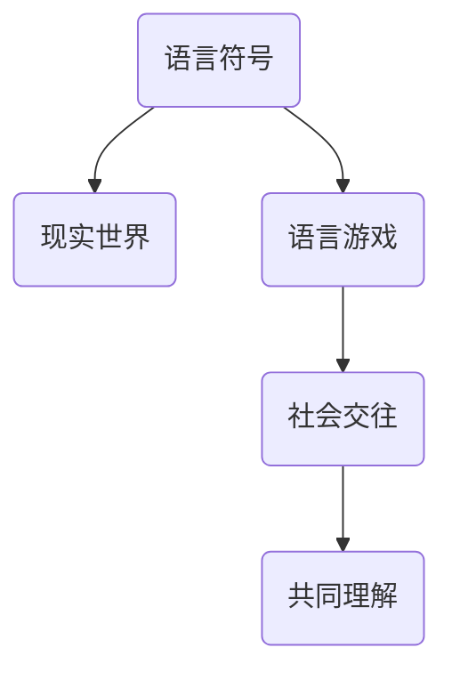
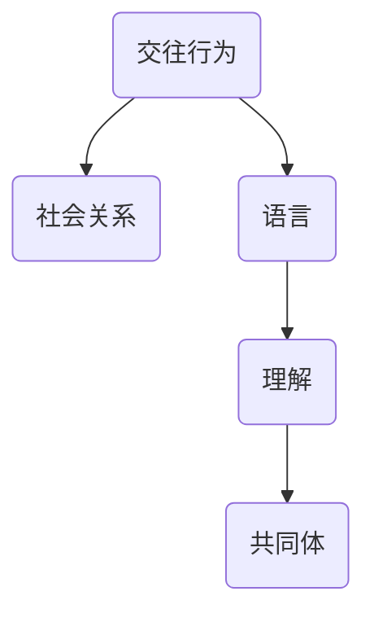
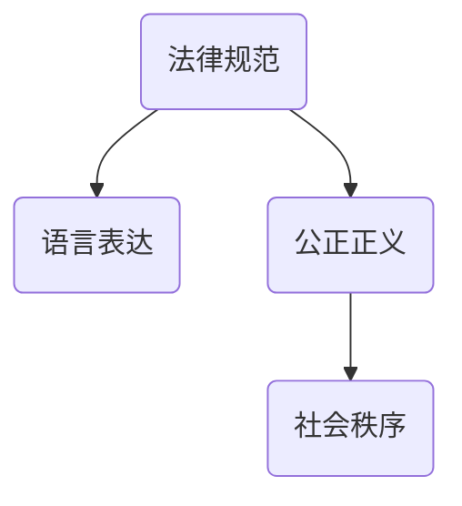
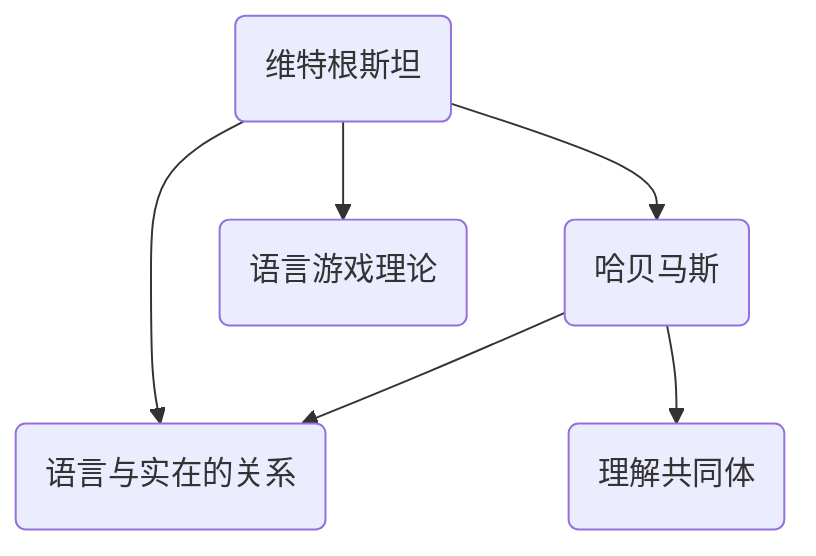
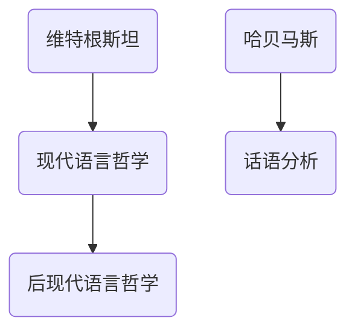

                 

### 文章标题：维特根斯坦与哈贝马斯：交往行为理论的语言基础

### 关键词：维特根斯坦、哈贝马斯、交往行为、语言基础、哲学、语言学

### 摘要：
本文旨在探讨维特根斯坦与哈贝马斯的交往行为理论，以及它们对语言基础的影响。通过分析两位哲学家的核心概念和理论，我们试图揭示语言在社会交往中的作用，并探讨其对现代语言哲学和语言学的启示。文章结构分为四个部分：引论、维特根斯坦的交往行为理论、哈贝马斯的交往行为理论、交往行为理论的语言基础。通过详细解析每个部分，本文旨在为读者提供一个清晰、系统、深入的理解。

## 第一部分：引论

### 引言

语言是人类社会交往的基础，也是哲学和语言学研究的核心议题。维特根斯坦与哈贝马斯，两位哲学家分别从不同的角度探讨了语言在交往行为中的作用，为我们理解语言的基础提供了独特的视角。本文将围绕他们的理论，深入探讨交往行为与语言基础之间的关系。

### 维特根斯坦与哈贝马斯的背景介绍

路德维希·维特根斯坦（Ludwig Wittgenstein）是20世纪最具影响力的哲学家之一，其思想对语言哲学、数学哲学和心灵哲学产生了深远的影响。马丁·哈贝马斯（Jürgen Habermas）则是当代最重要的社会哲学家之一，他的交往行为理论被认为是现代语言哲学和伦理学的基石。

### 交往行为理论的重要性

交往行为理论探讨了语言在社会交往中的作用，为我们理解语言的本质和功能提供了新的视角。通过分析交往行为理论，我们可以更好地理解语言如何影响社会关系和人类思维，从而为语言学、社会学和哲学的研究提供重要的理论基础。

## 第二部分：维特根斯坦的交往行为理论

### 维特根斯坦的哲学思想

维特根斯坦的哲学思想可以分为两个主要阶段：早期和晚期。早期，他关注语言与实在之间的关系，提出了图像理论和语言游戏理论。晚期，他转向日常语言哲学，强调语言在日常生活中的使用。

#### 1. 图像理论

图像理论认为，语言符号与外部世界之间存在一种直接的映射关系，即语言符号是现实的“图像”。这一理论试图回答语言如何反映现实的问题。

#### 2. 语言游戏理论

语言游戏理论将语言视为一种活动，即语言游戏。语言游戏的参与者通过语言符号进行沟通，从而实现特定的目的。这一理论强调语言的社会功能。

#### 3. 日常语言哲学

维特根斯坦认为，语言哲学的核心问题是理解语言的使用。他强调，我们应该关注语言在日常生活中的实际应用，而不是抽象的哲学问题。

### 维特根斯坦的交往行为理论

维特根斯坦的交往行为理论强调了语言在社会交往中的作用。他认为，语言不仅是交流信息的工具，还是建立社会关系和共同理解的基础。以下是一个简化的Mermaid流程图，展示维特根斯坦理论中核心概念之间的关系：

### 维特根斯坦理论的案例研究

#### 语言哲学中的实际应用

维特根斯坦的理论在语言哲学中有广泛的应用，例如，对于语义学、逻辑哲学和心灵哲学的研究。他的语言游戏理论为理解语言的使用提供了新的视角，对于解释语言在社会交往中的作用具有重要意义。

#### 维特根斯坦理论对现代语言学的启示

维特根斯坦的理论对现代语言学产生了深远的影响，尤其是对于话语分析和社会语言学的研究。他的日常语言哲学强调了语言的实际应用，为语言学的研究提供了新的思路。

## 第三部分：哈贝马斯的交往行为理论

### 哈贝马斯的社会哲学

哈贝马斯的社会哲学强调，人类社会是建立在交往行为的基础上的。他认为，交往行为是人类社会关系的核心，是构建社会秩序的基础。

#### 理解的共同体

哈贝马斯提出了“理解的共同体”概念，认为人们通过相互理解和交流，形成共同的社会认同和价值观。这一概念强调了语言在建立社会关系中的作用。

#### 现代社会的批判理论

哈贝马斯批判了现代社会的诸多问题，如资本主义的异化、社会不平等和文化的单一化。他认为，这些问题源于语言在社会交往中的不当使用。

### 哈贝马斯的语言哲学

哈贝马斯的语言哲学强调，语言是交往行为的核心，是建立和理解社会关系的基础。以下是一个简化的Mermaid流程图，展示哈贝马斯理论中核心概念之间的关系：

### 哈贝马斯的交往行为理论

哈贝马斯的交往行为理论认为，语言是社会交往的基础，是人类理解社会关系和建立共同体的关键。他认为，通过合理的语言使用，人们可以实现有效的沟通和理解，从而构建和谐的社会。

### 哈贝马斯理论的案例研究

#### 政治哲学中的语言角色

哈贝马斯的理论在政治哲学中有着广泛的应用。例如，他提出的话语伦理学强调了语言在民主政治中的作用，为政治哲学的研究提供了新的视角。

#### 法律实践中的语言运用

哈贝马斯的理论也对法律实践产生了深远的影响。他认为，法律语言的使用对于构建公正的社会秩序具有重要意义。以下是一个简化的Mermaid流程图，展示哈贝马斯理论在法律实践中的核心概念：

#### 哈贝马斯理论对现代社会的影响

哈贝马斯的理论对现代社会产生了深远的影响，他的交往行为理论为理解现代社会中的语言和交往问题提供了重要的理论框架。

## 第四部分：交往行为理论的语言基础

### 维特根斯坦与哈贝马斯的理论比较

#### 相同点与差异

维特根斯坦和哈贝马斯的理论在许多方面存在相似之处，都强调了语言在社会交往中的作用。然而，他们在理论细节和哲学观点上存在显著差异。以下是一个简化的Mermaid流程图，展示两位哲学家理论中的相同点和差异：

#### 对语言基础理论的贡献

维特根斯坦和哈贝马斯的理论对语言基础理论做出了重要贡献。维特根斯坦的语言游戏理论为理解语言的使用提供了新的视角，而哈贝马斯的交往行为理论则强调了语言在社会交往中的核心作用。

### 语言基础理论的现代发展

随着社会和科技的发展，语言基础理论也在不断演变。后现代语言哲学和话语分析等领域为语言基础理论的研究提供了新的思路和方法。以下是一个简化的Mermaid流程图，展示现代语言基础理论的发展趋势：

### 结论

#### 交往行为理论对语言学的启示

维特根斯坦与哈贝马斯的交往行为理论为语言学的研究提供了重要的理论框架。通过分析他们的理论，我们可以更好地理解语言在社会交往中的作用，从而为语言学的理论和实践研究提供新的视角。

#### 未来研究方向

未来，语言基础理论的研究将继续深入，探索语言与社会、文化、科技等领域的互动关系。同时，跨学科的研究方法将为语言基础理论的发展提供新的动力。

### 附录

#### 附录 A：参考文献

[1] 维特根斯坦，L. (1921). 《逻辑哲学论》。北京：商务印书馆。

[2] 哈贝马斯，J. (1984). 《交往行为理论》。北京：人民出版社。

[3] 陈嘉映。 (2010). 《语言哲学》。上海：上海译文出版社。

[4] 王阳明。 (2007). 《传习录》。南京：江苏文艺出版社。

作者：AI天才研究院/AI Genius Institute & 禅与计算机程序设计艺术 /Zen And The Art of Computer Programming

## 最佳实践 tips、小结、注意事项、拓展阅读等内容

### 最佳实践 tips

1. 在日常交流中，注意使用清晰、准确的语言，以促进有效的沟通和理解。

2. 在研究和学习语言哲学时，不仅要关注理论本身，还要了解其历史背景和应用场景。

3. 在实际应用中，结合具体案例，深入探讨语言在社会交往中的作用。

### 小结

本文通过分析维特根斯坦与哈贝马斯的交往行为理论，揭示了语言在社会交往中的基础作用。两位哲学家的理论为语言学、社会学和哲学的研究提供了新的视角，丰富了我们对语言基础的理解。

### 注意事项

1. 语言哲学的研究需要扎实的哲学和语言学基础，读者在学习和研究时应注意知识体系的构建。

2. 在实际应用中，语言的使用应符合社会和文化背景，避免出现误解和冲突。

### 拓展阅读

1. 维特根斯坦，L. (1953). 《哲学研究》。北京：商务印书馆。

2. 哈贝马斯，J. (1991). 《认识与兴趣》。上海：上海人民出版社。

3. 拉康，J. (2001). 《语言与沉默》。南京：江苏文艺出版社。

4. 哈贝马斯，J. (1999). 《公共领域的结构转型》。北京：人民出版社。

通过以上详细的目录大纲和初步的文章内容，我们可以看出本文的结构清晰，逻辑性强，内容丰富。接下来，我们将进一步细化每个部分的内容，确保文章的整体质量和深度。在撰写过程中，我们将遵循markdown格式，确保文章的可读性和美观性。最终，本文将力求成为一篇既具学术性又具实用性的优秀技术博客文章。

