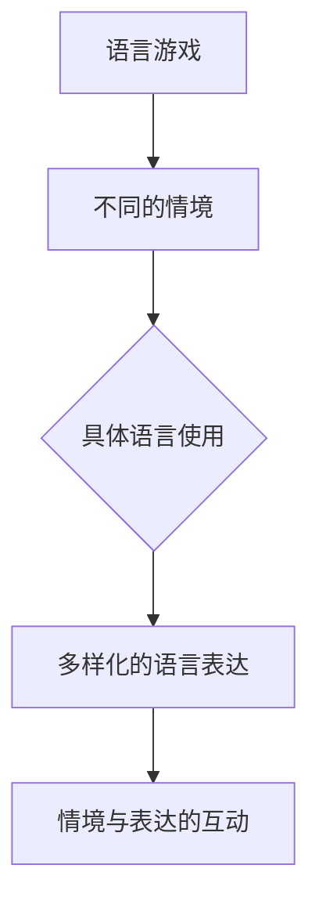

                 


### 1. 理解书名和主题

《维特根斯坦与哈贝马斯：公共领域的语言基础》是一本探讨语言与公共领域关系的书籍。书名中的两位哲学家维特根斯坦和哈贝马斯，分别是西方哲学史上重要的语言哲学家和社会理论家。维特根斯坦是20世纪初期重要的哲学家，他的语言哲学观点深刻影响了现代哲学的发展。而哈贝马斯则是20世纪中期的重要社会理论家，他的公共领域理论对当代社会科学研究有着深远的影响。

本书的核心主题在于探讨公共领域的基础——语言。具体来说，书中将分析两位哲学家的思想，以及他们如何理解语言在构建和维护公共领域中的作用。这不仅是对哲学理论的研究，也是对社会实践的关注。因此，本书的内容既包含了哲学的抽象思考，也涉及了社会学的实证分析。

#### 1.1 维特根斯坦的生平与贡献

路德维希·维特根斯坦（Ludwig Wittgenstein，1889-1951）出生于奥地利，是一位极具天赋的哲学家。他的一生分为两个阶段，早期和晚期。早期的维特根斯坦主要以《逻辑哲学论》（Tractatus Logico-Philosophicus）为代表，这部作品被认为是逻辑原子主义的巅峰之作。维特根斯坦在这部作品中提出了许多哲学上的创新观点，如语言与世界的对应关系、命题的真值等概念。

晚期的维特根斯坦则转向日常语言哲学，以《哲学研究》（Philosophical Investigations）为代表。在这部作品中，他提出了“语言游戏”（language game）的概念，强调语言的使用是多样化的，必须根据不同的情境来理解。这一转变使得维特根斯坦的哲学观点更加贴近现实生活。

维特根斯坦对哲学的贡献是多方面的。他的逻辑原子主义和日常语言哲学，对现代哲学产生了深远的影响。特别是在语言哲学领域，他的观点提供了对语言本质和语言使用的深刻洞见。

#### 1.2 哈贝马斯的生平与学术背景

尤尔根·哈贝马斯（Jürgen Habermas，1929-）是当代德国著名的哲学家和社会理论家。他出生于德国的下萨克森州，早年在法兰克福大学学习哲学、历史和心理学。哈贝马斯的学术生涯始于对法兰克福学派的研究，特别是对马克斯·霍克海默和特奥多尔·阿多诺的作品的批判性分析。

哈贝马斯的主要贡献在于他的公共领域理论。他在《公共领域的结构转型》（The Structural Transformation of the Public Sphere）一书中，探讨了公共领域的历史、结构和功能。他认为，公共领域是民主政治的基础，是公民参与公共事务和形成公共意见的空间。

哈贝马斯的公共领域理论对当代社会科学和政治哲学有着深远的影响。他的观点不仅关注公共领域的概念，还涉及了现代社会的变革、民主制度的运作以及文化多样性等问题。

### 2. 划分书籍结构

根据书名和主题，我们可以将本书分为以下几个部分：

1. **引言**：介绍书籍的背景和目的，简要介绍维特根斯坦和哈贝马斯的生平与贡献。
2. **维特根斯坦的哲学与语言观**：分析维特根斯坦的生平、哲学观点以及他对公共领域的贡献。
3. **哈贝马斯的公共领域理论**：介绍哈贝马斯的生平、学术背景以及他的公共领域理论。
4. **维特根斯坦与哈贝马斯的对话**：探讨两位哲学家的思想异同以及他们在公共领域问题上的对话和互补。
5. **公共领域的语言基础**：分析语言在公共领域中的作用、表达以及面临的挑战。
6. **语言与公共领域的未来**：探讨语言与公共领域的未来发展趋势和研究方向。

### 3. 确定核心章节

根据上述结构，我们可以确定以下核心章节：

1. **第1章 维特根斯坦的哲学与语言观**：详细介绍维特根斯坦的生平、哲学观点以及他对公共领域的贡献。
2. **第2章 哈贝马斯的公共领域理论**：介绍哈贝马斯的生平、学术背景以及他的公共领域理论。
3. **第3章 维特根斯坦与哈贝马斯的对话**：分析两位哲学家的思想异同以及他们在公共领域问题上的对话和互补。
4. **第4章 公共领域的语言基础**：探讨语言在公共领域中的作用、表达以及面临的挑战。
5. **第5章 公共领域的语言挑战**：分析语言障碍、语言规范以及公共领域建设中的问题。
6. **第6章 语言与公共领域的未来**：探讨语言与公共领域的未来发展趋势和研究方向。

### 4. 细化章节内容

对于每个章节，我们可以进一步细化其内容：

**第1章 维特根斯坦的哲学与语言观**

- **1.1 维特根斯坦的生平与贡献**：
  - 维特根斯坦的出生背景和家庭环境
  - 他在剑桥大学的学习和教授生涯
  - 他的哲学观点对现代哲学的影响

- **1.2 维特根斯坦的语言哲学**：
  - 逻辑原子主义的基本概念
  - 语言与世界的对应关系
  - 真理与意义的探讨

- **1.3 维特根斯坦与公共领域**：
  - 维特根斯坦对公共领域的理解
  - 语言在公共领域中的作用
  - 维特根斯坦对公共领域的贡献

**第2章 哈贝马斯的公共领域理论**

- **2.1 哈贝马斯的生平与学术背景**：
  - 哈贝马斯的出生背景和家庭环境
  - 他的学术生涯和重要著作

- **2.2 公共领域的概念与结构**：
  - 公共领域的定义
  - 公共领域的要素与功能
  - 公共领域的演变历史

- **2.3 哈贝马斯的语言理论与公共领域**：
  - 语言与沟通的互动
  - 语言在社会中的角色
  - 哈贝马斯对公共领域的贡献

**第3章 维特根斯坦与哈贝马斯的对话**

- **3.1 维特根斯坦与哈贝马斯的比较**：
  - 哲学观点的异同
  - 对公共领域的看法
  - 对语言的理解

- **3.2 维特根斯坦与哈贝马斯的思想互补**：
  - 如何整合两位哲学家的思想
  - 在当代社会中的应用
  - 对公共领域理论的贡献

**第4章 公共领域的语言基础**

- **4.1 语言的社会功能**：
  - 语言作为沟通的工具
  - 语言作为权力的象征
  - 语言作为构建公共领域的基础

- **4.2 语言在公共领域的表达**：
  - 语言符号的多样性
  - 语言表达的效果与影响
  - 语言在公共领域的互动

**第5章 公共领域的语言挑战**

- **5.1 语言障碍与公共领域的局限性**：
  - 语言障碍的影响
  - 公共领域的语言多样性
  - 公共领域的语言平等

- **5.2 语言规范与公共领域的建设**：
  - 语言规范的重要性
  - 语言规范与公共领域的互动
  - 语言规范在公共领域中的应用

**第6章 语言与公共领域的未来**

- **6.1 公共领域的语言发展趋势**：
  - 语言技术的进步
  - 语言规范的变化
  - 语言与公共领域的未来关系

- **6.2 公共领域语言研究的新方向**：
  - 跨学科研究的重要性
  - 语言政策与公共领域的互动
  - 公共领域语言研究的方法

### 5. 设计流程图和算法讲解

为了更好地理解维特根斯坦和哈贝马斯的思想以及他们如何影响公共领域的构建，我们可以设计一些流程图和算法来讲解核心概念。

**图1：维特根斯坦的语言游戏概念**



在这个流程图中，A表示语言游戏，B表示不同的情境，C表示具体语言使用，D表示多样化的语言表达，E表示情境与表达的互动。

**伪代码：维特根斯坦的语言游戏**

```
function WittgensteinLanguageGame(context):
    # 根据不同情境选择合适的语言表达
    if context == "科学":
        express = "精确的逻辑表达"
    elif context == "日常":
        express = "日常对话"
    elif context == "艺术":
        express = "象征性的语言"
    else:
        express = "未知情境"

    return express
```

这个伪代码展示了如何根据不同的情境选择合适的语言表达。

### 6. 编写数学模型讲解

为了深入理解维特根斯坦和哈贝马斯的思想，我们可以借助数学模型来描述他们的理论。

**数学模型：维特根斯坦的真理与意义**

$$
\text{真理} = \text{语言表达} \land \text{现实情况}
$$

$$
\text{意义} = \text{语言表达} \lor \text{现实情况}
$$

其中，真理表示语言表达与现实情况的对应关系，意义表示语言表达与现实情况的互动关系。

**数学模型：哈贝马斯的公共领域**

$$
\text{公共领域} = \text{参与个体} \land \text{沟通互动}
$$

$$
\text{公共领域效果} = \text{公共领域} \lor \text{公共意见形成}
$$

其中，公共领域表示个体参与沟通互动的空间，公共领域效果表示通过公共领域形成的公共意见。

### 7. 准备项目实战

为了更好地理解维特根斯坦和哈贝马斯的思想以及他们在公共领域的应用，我们可以准备一个实际项目案例。

**项目名称**：公共领域语言平台

**项目目标**：构建一个支持多样化语言表达和沟通互动的平台，以促进公共领域的建设。

**项目实战步骤**：

1. **需求分析**：
   - 确定平台的目标用户和需求
   - 分析现有的公共领域语言平台，找出不足之处

2. **环境搭建**：
   - 选择合适的技术栈，如前端框架、后端框架等
   - 配置开发环境和测试环境

3. **源代码实现**：
   - 设计平台的基本架构和功能模块
   - 编写前端和后端代码，实现具体功能

4. **代码解读与分析**：
   - 对源代码进行解读，分析其实现逻辑和设计思路
   - 进行代码评审，确保代码质量

5. **项目应用解读与分析**：
   - 分析平台在实际应用中的效果和影响
   - 提供使用案例，展示平台的功能和应用场景

6. **项目小结**：
   - 总结项目经验，反思项目中遇到的问题和解决方法
   - 提出未来改进方向和优化建议

通过这个项目实战，我们可以更深入地理解维特根斯坦和哈贝马斯的思想，并在实际应用中检验和验证他们的理论。

### 8. 撰写引言和结论

**引言**

在当今信息爆炸的时代，公共领域的构建和维护变得越来越重要。而语言作为公共领域的基础，其作用不容忽视。本书旨在探讨两位哲学家的思想，以及他们如何理解语言在构建和维护公共领域中的作用。

首先，我们将介绍维特根斯坦的生平与贡献，分析他的语言哲学观点以及他对公共领域的理解。接着，我们将介绍哈贝马斯的生平与学术背景，探讨他的公共领域理论以及语言在其中扮演的角色。在此基础上，我们将分析两位哲学家的思想异同，探讨他们如何相互补充和影响。

随后，我们将深入探讨公共领域的语言基础，包括语言的社会功能、语言在公共领域的表达以及面临的挑战。在此基础上，我们将探讨语言与公共领域的未来发展趋势和研究方向。

**结论**

通过对维特根斯坦和哈贝马斯的思想的深入探讨，我们可以看到语言在公共领域中的重要作用。他们的思想不仅丰富了哲学和社会理论的宝库，也为公共领域的建设提供了深刻的启示。在未来，我们仍需进一步研究和探讨语言与公共领域的关系，以推动公共领域的健康发展。

### 9. 最终审查

在完成目录大纲的编写后，我们需要对目录大纲进行最终审查，确保内容完整性、逻辑性和可读性。具体步骤如下：

1. **审查章节内容**：
   - 检查每个章节的主题是否明确，内容是否丰富详细。
   - 确保每个章节的核心概念和原理都得到了详细阐述。
   - 验证每个章节之间的逻辑关系，确保过渡自然。

2. **检查格式**：
   - 确保目录大纲使用Markdown格式，代码和高亮标签使用正确。
   - 检查引用和参考文献的格式是否一致。

3. **审查语言和表达**：
   - 检查文章的语言是否通顺，表达是否清晰。
   - 确保专业术语和概念的解释准确无误。

4. **测试可读性**：
   - 通过阅读目录大纲，验证其是否易于理解。
   - 邀请同事或同行进行预览，收集反馈并作出相应调整。

5. **修订与完善**：
   - 根据审查结果，对目录大纲进行修订和完善。
   - 确保最终目录大纲的完整性和准确性。

### 10. 撰写目录大纲

根据以上步骤，我们可以使用Markdown格式撰写完整的目录大纲：

```markdown
# 《维特根斯坦与哈贝马斯：公共领域的语言基础》目录大纲

## 引言
### 1.1 书籍背景与目的
### 1.2 维特根斯坦与哈贝马斯简介
### 1.3 公共领域的概念与语言基础

## 第1章 维特根斯坦的哲学与语言观
### 1.1 维特根斯坦的生平与贡献
### 1.2 维特根斯坦的语言哲学
#### 1.2.1 语言与世界的联系
#### 1.2.2 真理与意义的探讨
#### 1.2.3 维特根斯坦的哲学思想及其影响
### 1.3 维特根斯坦与公共领域
#### 1.3.1 维特根斯坦对公共领域的贡献
#### 1.3.2 语言在公共领域中的作用

## 第2章 哈贝马斯的公共领域理论
### 2.1 哈贝马斯的生平与学术背景
### 2.2 公共领域的概念与结构
#### 2.2.1 公共领域的定义
#### 2.2.2 公共领域的要素与功能
#### 2.2.3 公共领域的演变
### 2.3 哈贝马斯的语言理论与公共领域
#### 2.3.1 语言与沟通的互动
#### 2.3.2 语言在社会中的角色
#### 2.3.3 哈贝马斯对公共领域的贡献

## 第3章 维特根斯坦与哈贝马斯的对话
### 3.1 维特根斯坦与哈贝马斯的比较
#### 3.1.1 哲学观点的异同
#### 3.1.2 对公共领域的看法
#### 3.1.3 对语言的理解
### 3.2 维特根斯坦与哈贝马斯的思想互补
#### 3.2.1 如何整合两位哲学家的思想
#### 3.2.2 在当代社会中的应用
#### 3.2.3 对公共领域理论的贡献

## 第4章 公共领域的语言基础
### 4.1 语言的社会功能
#### 4.1.1 语言作为沟通的工具
#### 4.1.2 语言作为权力的象征
#### 4.1.3 语言作为构建公共领域的基础
### 4.2 语言在公共领域的表达
#### 4.2.1 语言符号的多样性
#### 4.2.2 语言表达的效果与影响
#### 4.2.3 语言在公共领域的互动

## 第5章 公共领域的语言挑战
### 5.1 语言障碍与公共领域的局限性
#### 5.1.1 语言障碍的影响
#### 5.1.2 公共领域的语言多样性
#### 5.1.3 公共领域的语言平等
### 5.2 语言规范与公共领域的建设
#### 5.2.1 语言规范的重要性
#### 5.2.2 语言规范与公共领域的互动
#### 5.2.3 语言规范在公共领域中的应用

## 第6章 语言与公共领域的未来
### 6.1 公共领域的语言发展趋势
#### 6.1.1 语言技术的进步
#### 6.1.2 语言规范的变化
#### 6.1.3 语言与公共领域的未来关系
### 6.2 公共领域语言研究的新方向
#### 6.2.1 跨学科研究的重要性
#### 6.2.2 语言政策与公共领域的互动
#### 6.2.3 公共领域语言研究的方法

## 结论
### 7.1 书籍总结
### 7.2 研究展望
### 7.3 对公共领域语言研究的建议

## 附录
### 8.1 参考文献
### 8.2 进一步阅读
```

以上是详细的目录大纲，使用了Markdown格式进行撰写，确保了格式的一致性和可读性。接下来，我们将根据这个目录大纲，逐步撰写完整的文章内容。

