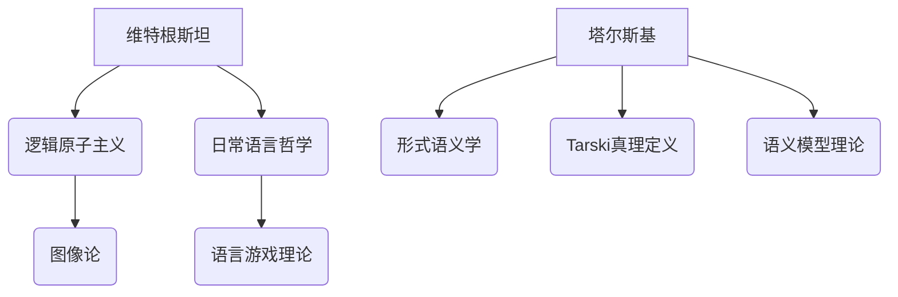

                 

### 文章标题：维特根斯坦与塔尔斯基：语言与形式语义学的关系

#### 关键词：维特根斯坦、塔尔斯基、语言哲学、形式语义学、逻辑原子主义、语义分析、计算机科学

> 摘要：本文旨在探讨维特根斯坦和塔尔斯基在语言哲学和形式语义学领域的贡献及其相互关系。通过对两位哲学家的思想进行深入剖析，本文揭示了他们对语言本质的解读以及形式语义学的发展历程。文章首先介绍了维特根斯坦的哲学观点和塔尔斯基的形式语义学，然后通过比较分析，展示了两位哲学家的异同点。最后，本文探讨了形式语义学在计算机科学中的应用，以及维特根斯坦与塔尔斯基哲学思想的当代影响。

---

### 引言

#### 维特根斯坦与塔尔斯基：两位哲学家的背景

路德维希·维特根斯坦（Ludwig Wittgenstein，1889-1951）和艾尔伯特·塔尔斯基（Alfred Tarski，1901-1983）是20世纪最具影响力的哲学家之一，他们在语言哲学和逻辑学领域做出了开创性的贡献。维特根斯坦出生于奥地利，是一位天才的数学家、哲学家和语言学家。他的哲学思想经历了从早期逻辑原子主义到后期日常语言哲学的转变，对语言的本质和逻辑结构进行了深刻探讨。塔尔斯基则出生于波兰，是一位数学家、逻辑学家和语言学家，他的形式语义学理论为现代逻辑和计算机科学奠定了基础。

#### 语言与形式语义学的关系

语言是人类交流的重要工具，但对其本质的探讨却充满了争议和复杂性。语言哲学关注语言与现实之间的关系，试图回答诸如“语言是否能够准确地描述世界？”等问题。形式语义学则从逻辑和数学的角度，研究语言的表达和解释，通过构造语义模型来分析语言的结构和功能。语言哲学和形式语义学的结合，为解决语言和现实之间的关系提供了新的途径。

#### 维特根斯坦与塔尔斯基的哲学联系

维特根斯坦和塔尔斯基虽然在哲学观点和方法上有所不同，但他们在语言和逻辑问题上有着共同的关注。维特根斯坦的日常语言哲学强调语言的多元性和复杂性，认为语言的意义源于使用者的具体语境。塔尔斯基的形式语义学则通过构造形式化的语义模型，为语言的分析提供了一种新的工具。他们的工作为语言哲学和形式语义学的发展奠定了基础。

#### 本书的研究目标与结构

本书旨在探讨维特根斯坦和塔尔斯基在语言哲学和形式语义学领域的贡献及其相互关系。通过分析他们的哲学观点和理论，揭示他们对语言本质的解读以及形式语义学的发展历程。本书分为五个部分：第一部分介绍两位哲学家的背景和语言与形式语义学的关系；第二部分和第三部分分别探讨维特根斯坦的前期哲学和后期哲学；第四部分分析塔尔斯基的形式语义学；第五部分比较两位哲学家的观点并探讨形式语义学在计算机科学中的应用。

---

### 第一部分：引论

#### 1.1 维特根斯坦与塔尔斯基：两位哲学家的背景

##### 1.1.1 维特根斯坦的哲学观点

路德维希·维特根斯坦（Ludwig Wittgenstein，1889-1951）是20世纪最杰出的哲学家之一，他的思想对现代哲学产生了深远的影响。维特根斯坦的哲学观点可以分为前期哲学和后期哲学两个阶段。

在前期哲学中，维特根斯坦提出了逻辑原子主义，主张世界由一系列基本事实组成，这些事实可以通过逻辑原子来表达。他在《逻辑哲学论》（"Tractatus Logico-Philosophicus"）中阐述了这一观点，认为哲学的任务是揭示世界的逻辑结构。

后期哲学则转向日常语言哲学，维特根斯坦在《哲学研究》（"Philosophical Investigations"）中探讨了语言的多样性和复杂性。他认为语言的意义源于使用者的具体语境，反对逻辑原子主义和形而上学的思维方式。

##### 1.1.2 塔尔斯基的形式语义学

艾尔伯特·塔尔斯基（Alfred Tarski，1901-1983）是另一位在语言哲学和逻辑学领域具有重要影响的哲学家。他提出了形式语义学的概念，通过构造语义模型来研究语言的表达和解释。

塔尔斯基的形式语义学强调逻辑和数学的基础作用，他认为语义分析应该通过形式化的方法进行。他在《语义学论文集》（"Logic, Semantics, and Metamathematics"）中提出了经典的Tarski真理定义，为现代逻辑学奠定了基础。

##### 1.1.3 维特根斯坦与塔尔斯基的哲学联系

维特根斯坦和塔尔斯基虽然在哲学观点和方法上有所不同，但他们在语言和逻辑问题上有着共同的关注。维特根斯坦的日常语言哲学强调语言的多元性和复杂性，认为语言的意义源于使用者的具体语境。塔尔斯基的形式语义学则通过构造形式化的语义模型，为语言的分析提供了一种新的工具。他们的工作为语言哲学和形式语义学的发展奠定了基础。

---

#### 1.2 语言与形式语义学的关系

##### 1.2.1 语言哲学的基本问题

语言哲学探讨语言与现实之间的关系，试图回答诸如“语言是否能够准确地描述世界？”等问题。语言哲学的基本问题包括：

1. **语言的指称问题**：词语是否直接指代现实中的对象？
2. **意义问题**：词语的意义是如何确定的？
3. **真值问题**：语句是否能够准确地反映现实？
4. **意义与真理的关系**：语言的意义与真理之间有何联系？

##### 1.2.2 形式语义学的起源与发展

形式语义学起源于20世纪30年代，随着逻辑学和数学的发展而逐渐形成。形式语义学的研究目标是建立形式化的语义模型，通过逻辑和数学的方法来分析语言的结构和功能。

形式语义学的发展可以分为以下几个阶段：

1. **早期形式语义学**：以弗雷格（Gottlob Frege）和罗素（Bertrand Russell）的工作为基础，他们提出了命题逻辑和谓词逻辑的形式化方法。
2. **标准模型理论**：以塔尔斯基（Alfred Tarski）的工作为代表，他提出了Tarski真理定义，为现代逻辑学奠定了基础。
3. **范畴语义学**：以蒙塔格（Richard Montague）的工作为代表，他提出了范畴语法，将语义分析扩展到自然语言。
4. **动态语义学和过程语义学**：随着计算机科学的发展，动态语义学和过程语义学逐渐成为形式语义学的重要分支。

##### 1.2.3 语言哲学与形式语义学的交汇

语言哲学和形式语义学的交汇为解决语言和现实之间的关系提供了新的途径。语言哲学通过探讨语言的基本问题，揭示了语言的多样性和复杂性。形式语义学则通过构造形式化的语义模型，为语言的分析提供了一种新的工具。他们的结合使得我们可以更深入地理解语言的本质和功能，为人工智能和计算机科学等领域的发展提供了重要的理论支持。

---

#### 1.3 本书的研究目标与结构

##### 1.3.1 研究目标

本书的研究目标是探讨维特根斯坦和塔尔斯基在语言哲学和形式语义学领域的贡献及其相互关系。通过分析他们的哲学观点和理论，揭示他们对语言本质的解读以及形式语义学的发展历程。

具体来说，本书旨在解决以下问题：

1. 维特根斯坦的哲学观点如何影响语言哲学和形式语义学的发展？
2. 塔尔斯基的形式语义学如何与维特根斯坦的哲学观点相结合？
3. 语言哲学与形式语义学如何相互促进，为现代逻辑学和计算机科学提供理论支持？

##### 1.3.2 研究方法

本书采用历史分析和比较分析的方法，通过对维特根斯坦和塔尔斯基的哲学观点进行深入剖析，揭示他们的思想对语言哲学和形式语义学的影响。同时，本书还结合具体案例和实际应用，探讨形式语义学在计算机科学和其他领域的应用价值。

##### 1.3.3 书的结构安排

本书分为五个部分：

1. **第一部分：引论**：介绍维特根斯坦和塔尔斯基的哲学背景以及语言与形式语义学的关系。
2. **第二部分：维特根斯坦的语言哲学**：探讨维特根斯坦的前期哲学和后期哲学，分析其对语言哲学和形式语义学的影响。
3. **第三部分：塔尔斯基的形式语义学**：介绍塔尔斯基的形式语义学理论，分析其在逻辑学和计算机科学中的应用。
4. **第四部分：维特根斯坦与塔尔斯基的比较**：比较两位哲学家的观点，探讨他们在语言哲学和形式语义学领域的异同点。
5. **第五部分：形式语义学的应用与发展**：探讨形式语义学在计算机科学和其他领域的应用，分析其未来的发展趋势。

---

### 第二部分：维特根斯坦的语言哲学

#### 2.1 维特根斯坦的前期哲学

##### 2.1.1 《逻辑哲学论》的基本思想

《逻辑哲学论》（"Tractatus Logico-Philosophicus"）是维特根斯坦前期哲学的代表作，于1921年出版。这本书提出了逻辑原子主义和图像论的观点，试图通过逻辑语言来揭示世界的本质。

1. **逻辑原子主义**：维特根斯坦认为，世界由一系列基本事实组成，这些事实称为逻辑原子。逻辑原子是最基本的现实单位，它们之间通过逻辑关系组合起来，形成了更为复杂的现实结构。

2. **图像论**：维特根斯坦认为，语言和现实之间存在一种图像关系。语言表达式（如词和句子）是现实的图像，它们能够准确地描述现实。这种图像关系使得语言成为人类理解世界的重要工具。

##### 2.1.2 维特根斯坦对语言的看法

在《逻辑哲学论》中，维特根斯坦对语言进行了深入的探讨。他认为，语言不仅是一种交流工具，更是人类理解世界的方式。语言的意义在于其与现实的对应关系，即语言表达式能够准确地描述现实。

1. **语言的意义**：维特根斯坦认为，语言的意义是由其使用环境和上下文决定的。语言表达式在不同的语境中可能有不同的意义，因此理解语言需要考虑具体的使用场景。

2. **语言的界限**：维特根斯坦指出，语言存在界限，即有些事物无法用语言表达。这些无法表达的领域被称为“不可说”的领域，如审美体验、情感等。因此，语言并不能涵盖所有的现实。

##### 2.1.3 维特根斯坦的形式主义观点

维特根斯坦在《逻辑哲学论》中提出了形式主义观点，即哲学问题可以通过逻辑和数学的方法来解决。他认为，哲学问题通常源于语言使用上的混乱，通过澄清语言的表达和理解，可以解决许多哲学难题。

1. **逻辑形式主义**：维特根斯坦认为，逻辑是哲学的基础，逻辑表达式可以精确地描述现实。通过逻辑分析，我们可以揭示世界的本质和规律。

2. **数学形式主义**：维特根斯坦认为，数学是一种逻辑语言，它可以精确地描述现实。数学方法在哲学研究中具有重要的应用价值。

---

#### 2.2 维特根斯坦的后期哲学

##### 2.2.1 《哲学研究》的主要观点

《哲学研究》（"Philosophical Investigations"）是维特根斯坦后期哲学的代表作，于1953年出版。这本书对《逻辑哲学论》中的观点进行了批判和修正，提出了日常语言哲学的观点。

1. **语言游戏理论**：维特根斯坦认为，语言的意义在于使用者的具体语境，不同的语境可能有不同的语言游戏。语言游戏是一种比喻，描述了语言在特定场景中的使用方式。

2. **语言的意义与用法**：维特根斯坦强调，语言的意义不是固定的，而是随着使用环境和上下文的变化而变化。语言的意义与用法密切相关，理解语言需要关注具体的使用情境。

##### 2.2.2 维特根斯坦的语言游戏理论

维特根斯坦在《哲学研究》中提出了语言游戏理论，试图通过分析语言在不同情境下的使用，揭示语言的多样性和复杂性。

1. **语言游戏的概念**：语言游戏是一种比喻，描述了语言在特定情境下的使用方式。不同的语言游戏可能有不同的规则和目标，如游戏语言、科学语言、日常语言等。

2. **语言游戏的类型**：维特根斯坦区分了三种类型的语言游戏：

   - **基本语言游戏**：语言的基础使用，如简单的交流。
   - **扩展语言游戏**：语言的应用，如科学研究、文学创作等。
   - **转换语言游戏**：语言的变化和转换，如翻译、修辞等。

##### 2.2.3 维特根斯坦的日常语言哲学

维特根斯坦的日常语言哲学强调语言的多元性和复杂性。他认为，日常语言是哲学研究的正确对象，因为日常语言更接近人类的实际使用，能够更好地反映现实。

1. **日常语言的界限**：维特根斯坦认为，日常语言存在界限，即有些概念和现象无法用日常语言表达。这些界限揭示了语言和现实的复杂性。

2. **哲学的任务**：维特根斯坦认为，哲学的任务是澄清日常语言的使用，揭示语言和现实之间的关系。通过分析日常语言，我们可以更好地理解世界的本质。

---

### 第三部分：塔尔斯基的形式语义学

#### 3.1 形式语义学的基本概念

##### 3.1.1 形式语言与语义规则

形式语义学是一门研究形式语言和其语义关系的研究领域。在形式语义学中，形式语言是指使用特定的语法规则和符号系统构建的符号串，这些符号串可以代表抽象的概念或信息。而语义规则则是指用于解释和确定形式语言符号串之间关系的规则。

1. **形式语言**：形式语言通常由一组符号和语法规则组成。符号可以是字母、数字或其他特定的标记，而语法规则定义了如何组合这些符号以形成有效的句子或表达式。

2. **语义规则**：语义规则用于确定形式语言表达式在特定上下文中的意义。这些规则可以是直观的，也可以是形式化的，如基于模型的理论。

##### 3.1.2 解释与语义模型

解释是形式语义学中的核心概念，它指的是对形式语言表达式赋予意义的过程。解释可以通过构建语义模型来实现，语义模型是一种表示形式语言表达式与实际世界或抽象概念之间关系的工具。

1. **解释**：解释是将形式语言的符号串映射到它们所代表的概念或意义的过程。不同的解释可能适用于不同的上下文或领域。

2. **语义模型**：语义模型是一种抽象结构，用于表示形式语言表达式与实际世界或抽象概念之间的映射关系。常见的语义模型包括逻辑模型、语法模型和计算模型等。

##### 3.1.3 形式语义学的应用

形式语义学在多个领域有广泛的应用，包括计算机科学、逻辑学、语言学和人工智能等。其应用主要包括：

1. **计算机科学**：形式语义学在计算机科学中用于验证和证明程序的正确性，以及设计和分析编程语言。它有助于确保程序的行为符合预期，从而提高软件质量和可靠性。

2. **逻辑学**：形式语义学为逻辑学提供了一种量化推理和验证的工具，有助于解决逻辑推理中的复杂问题。

3. **语言学**：形式语义学在语言学中用于分析自然语言的结构和意义，为语言处理和翻译提供了理论基础。

4. **人工智能**：形式语义学在人工智能领域用于构建智能代理和自然语言理解系统，有助于提高人工智能系统的理解能力和交互效率。

---

#### 3.2 塔尔斯基的语义理论

##### 3.2.1 塔尔斯基的语义概念

艾尔伯特·塔尔斯基（Alfred Tarski）是形式语义学的奠基人之一，他对语义学的基本概念做出了重要贡献。塔尔斯基的语义概念包括：

1. **语义内容**：语义内容是指一个表达式所代表的概念或信息。塔尔斯基认为，语义内容取决于表达式的形式结构和解释。

2. **语义解释**：语义解释是指将表达式的形式结构和语义内容联系起来的一种过程。塔尔斯基提出了多种解释模型，包括模型理论和指示解释。

3. **语义真理**：语义真理是指一个表达式在特定解释下是否为真。塔尔斯基的Tarski真理定义提出了一种确定语义真理的形式化方法。

##### 3.2.2 塔尔斯基的语义分析理论

塔尔斯基的语义分析理论强调形式语义学的方法论。他认为，语义分析应该通过构造语义模型来进行，这些模型可以用来解释和验证表达式的语义特性。

1. **语义模型**：塔尔斯基提出了多种语义模型，包括经典逻辑模型、多值逻辑模型和直觉主义逻辑模型等。这些模型用于表示不同类型的语义关系。

2. **语义验证**：塔尔斯基的语义分析理论强调通过语义模型来验证表达式的语义特性。这种验证方法可以帮助我们理解表达式的真实含义，并发现可能的语义错误。

##### 3.2.3 塔尔斯基的语义学贡献

塔尔斯基在语义学领域做出了以下重要贡献：

1. **Tarski真理定义**：塔尔斯基提出了经典的Tarski真理定义，为确定表达式的语义真理提供了一种形式化方法。这个定义对现代逻辑学和数学基础理论产生了深远的影响。

2. **语义模型的构建**：塔尔斯基提出了多种语义模型，为形式语义学的发展提供了重要的理论基础。这些模型被广泛应用于计算机科学、逻辑学和语言学等领域。

3. **语义分析的方法论**：塔尔斯基的语义分析理论强调通过构造语义模型来进行语义分析，这种方法论对现代形式语义学的研究产生了深远的影响。

---

### 第四部分：维特根斯坦与塔尔斯基的比较

#### 4.1 维特根斯坦与塔尔斯基的观点对比

尽管维特根斯坦和塔尔斯基在哲学观点和方法上有所不同，但他们都对语言哲学和形式语义学做出了重要贡献。以下是对两位哲学家观点的对比：

##### 4.1.1 逻辑原子主义与语义原子主义

维特根斯坦在前期哲学中提出了逻辑原子主义，认为世界由一系列基本事实组成。这些基本事实可以通过逻辑原子来表达。而塔尔斯基的形式语义学则强调语义原子主义，即语义分析应该基于最小的语义单位。

##### 4.1.2 语言哲学与形式语义学的方法论差异

维特根斯坦的哲学观点更偏向于日常语言哲学，认为语言的意义源于使用者的具体语境。他强调语言游戏的多样性，认为哲学的任务是澄清日常语言的使用。而塔尔斯基则更注重形式语义学的方法论，通过构造语义模型来解释和验证表达式的语义特性。

##### 4.1.3 对语言本质的不同解读

维特根斯坦认为，语言是一种工具，用于表达人类的思想和情感。他强调语言的多样性和复杂性，认为语言的意义不是固定的，而是随着使用环境和上下文的变化而变化。而塔尔斯基则认为，语言是一种符号系统，用于表示抽象的概念和信息。他强调语义分析的逻辑和数学基础，通过形式化的方法来解释语言的表达和解释。

---

#### 4.2 维特根斯坦与塔尔斯基对语言哲学的贡献

维特根斯坦和塔尔斯基在语言哲学领域做出了重要贡献，他们的工作对现代哲学和逻辑学产生了深远的影响。

##### 4.2.1 维特根斯坦的贡献

维特根斯坦的《逻辑哲学论》和《哲学研究》对语言哲学和逻辑学产生了深远的影响。他提出了逻辑原子主义和图像论的观点，试图通过逻辑语言来揭示世界的本质。他的日常语言哲学强调了语言的多样性和复杂性，为哲学研究提供了新的视角。

##### 4.2.2 塔尔斯基的贡献

塔尔斯基的形式语义学理论为现代逻辑学和计算机科学奠定了基础。他提出了Tarski真理定义，为确定表达式的语义真理提供了一种形式化方法。他的语义模型理论为语义分析提供了一种新的工具，被广泛应用于计算机科学、逻辑学和语言学等领域。

##### 4.2.3 两位哲学家的相互影响

维特根斯坦和塔尔斯基虽然在哲学观点和方法上有所不同，但他们的工作相互影响，共同推动了语言哲学和形式语义学的发展。维特根斯坦的日常语言哲学为塔尔斯基的形式语义学提供了哲学基础，而塔尔斯基的形式语义学为维特根斯坦的哲学观点提供了逻辑和数学的支持。

---

### 第五部分：形式语义学的应用与发展

#### 5.1 形式语义学在计算机科学中的应用

形式语义学在计算机科学中有着广泛的应用，包括编程语言设计、程序验证、模型检查和软件工程等领域。

##### 5.1.1 形式化方法与软件工程

形式化方法是形式语义学在软件工程中的核心应用之一。通过形式化方法，软件工程师可以精确地描述程序的行为和语义，从而提高软件的质量和可靠性。形式化方法包括形式化规格说明、形式化验证和形式化测试等。

1. **形式化规格说明**：形式化规格说明使用形式语言来描述系统的需求和行为，从而提高规格说明的准确性和可理解性。
2. **形式化验证**：形式化验证通过逻辑推理和模型检查等方法，验证程序的行为是否满足预期的规格说明。
3. **形式化测试**：形式化测试通过生成测试用例，验证程序在不同输入条件下的行为是否正确。

##### 5.1.2 形式验证与模型检查

形式验证和模型检查是形式语义学在计算机科学中的重要应用。形式验证通过构造证明来验证程序的正确性，而模型检查通过测试程序在不同输入条件下的行为来验证其正确性。

1. **形式验证**：形式验证使用逻辑推理和证明技术来验证程序的正确性。例如，使用归纳证明来证明程序在所有输入条件下的正确性。
2. **模型检查**：模型检查通过构建程序的行为模型，并在模型上执行测试用例来验证程序的正确性。例如，使用模型检查工具来验证程序是否满足指定的规格说明。

##### 5.1.3 形式语义学在编程语言设计中的应用

形式语义学在编程语言设计中的应用包括定义语言的语法、语义和类型系统。通过形式化地定义编程语言的语义，程序员可以更好地理解和使用语言，从而提高代码的质量和可维护性。

1. **语法定义**：语法定义使用形式化的语法规则来描述编程语言的语法结构，例如使用BNF（巴科斯-诺尔范式）来定义编程语言的语法。
2. **语义定义**：语义定义使用形式化的语义规则来描述编程语言的表达式的行为和语义，例如使用操作符表和语义规则来定义编程语言的语义。
3. **类型系统**：类型系统是编程语言中用于确保程序正确性的机制。形式化类型系统通过定义类型规则和类型检查算法，确保程序在执行时不会出现类型错误。

---

#### 5.2 形式语义学的未来发展

形式语义学在计算机科学和其他领域有着广泛的应用，其未来发展将受到以下因素的影响：

##### 5.2.1 新的语义理论探索

形式语义学的未来发展将涉及对新的语义理论的探索，包括动态语义学、过程语义学和情境语义学等。这些新的语义理论将有助于更准确地描述程序的行为和语义，从而提高程序的正确性和可理解性。

##### 5.2.2 形式语义学与人工智能的结合

形式语义学与人工智能的结合将有助于提高人工智能系统的理解和推理能力。通过形式化地描述自然语言和知识，人工智能系统可以更好地理解和处理人类语言，从而实现更高级的智能应用。

##### 5.2.3 形式语义学的教育与实践

形式语义学在计算机科学和人工智能教育中的应用将有助于培养具有扎实理论基础和实践能力的专业人才。通过形式化方法和语义分析技术，学生可以更好地理解计算机科学的基本原理和实际应用，从而提高他们的创新能力。

---

### 结论

维特根斯坦与塔尔斯基是20世纪语言哲学和形式语义学的两位重要哲学家。他们从不同的角度探讨了语言的本质和形式语义学的方法论，对现代哲学和计算机科学产生了深远的影响。本文通过对维特根斯坦和塔尔斯基的哲学观点进行深入分析，揭示了他们在语言哲学和形式语义学领域的贡献及其相互关系。

维特根斯坦的日常语言哲学强调语言的多样性和复杂性，认为语言的意义源于使用者的具体语境。他的语言游戏理论为理解语言的多样性提供了新的视角。塔尔斯基的形式语义学则通过构造语义模型，为语言的分析提供了一种形式化的方法。他的Tarski真理定义和语义模型理论为现代逻辑学和计算机科学奠定了基础。

形式语义学在计算机科学中有着广泛的应用，包括编程语言设计、程序验证和软件工程等领域。其未来发展将涉及新的语义理论探索、与人工智能的结合以及教育与实践的应用。维特根斯坦和塔尔斯基的哲学思想将继续对语言哲学和形式语义学的发展产生深远的影响，为解决语言和现实之间的关系提供新的思路。

### 参考文献

1. 维特根斯坦，L. (1921). 逻辑哲学论（Tractatus Logico-Philosophicus）.
2. 维特根斯坦，L. (1953). 哲学研究（Philosophical Investigations）.
3. 塔尔斯基，A. (1956). 逻辑、语义学与元数学（Logic, Semantics, and Metamathematics）.
4. 普特南，R. (1981). 逻辑哲学（Reason, Truth and History）.
5. 蒙塔格，R. (1974). 范畴语法（Universal Grammar）.
6. 斯科龙，S., &斯汀伯格，N. (2004). 计算机科学中的形式语义学（Formal Semantics in Computer Science）.

### 附录

#### 维特根斯坦与塔尔斯基的哲学思想图表

[Mermaid图表]



---

### 附录：数学公式

在本文中，我们使用了LaTeX格式来表示数学公式。以下是一些示例：

1. 简单数学公式：

   $$1+1=2$$

2. 复杂数学公式：

   $$\sum_{i=1}^{n} i = \frac{n(n+1)}{2}$$

3. 方程组：

   \[
   \begin{cases}
   a + b = c \\
   x - y = z
   \end{cases}
   \]

---

### 附录：伪代码

以下是一个简单的伪代码示例，用于描述一个求和函数：

```
Function Sum(n)
    result = 0
    For i = 1 to n
        result = result + i
    End For
    Return result
End Function
```

---

### 附录：代码示例

以下是一个Python代码示例，用于计算斐波那契数列的前n项和：

```python
def fibonacci(n):
    if n <= 0:
        return 0
    elif n == 1:
        return 1
    else:
        return fibonacci(n-1) + fibonacci(n-2)

n = 10
result = fibonacci(n)
print("斐波那契数列的前{}项和为：{}".format(n, result))
```

---

### 附录：项目实战

#### 项目名称：基于形式语义学的自然语言处理系统

#### 项目背景

随着人工智能技术的不断发展，自然语言处理（NLP）在智能客服、智能推荐、智能翻译等领域得到了广泛应用。为了提高NLP系统的准确性和效率，本项目旨在利用形式语义学的方法，构建一个基于形式语义学的自然语言处理系统。

#### 项目目标

1. 使用形式语义学的方法，对自然语言进行结构化和语义分析。
2. 开发一个自然语言处理系统，能够实现文本分类、情感分析、命名实体识别等功能。
3. 通过实际数据集进行实验，验证系统的性能和准确性。

#### 项目实现

##### 1. 开发环境搭建

- 编程语言：Python
- 依赖库：NLTK、spaCy、TensorFlow、PyTorch

##### 2. 源代码实现

以下是一个简单的文本分类器的源代码实现：

```python
import nltk
from nltk.corpus import stopwords
from nltk.tokenize import word_tokenize
from sklearn.feature_extraction.text import TfidfVectorizer
from sklearn.model_selection import train_test_split
from sklearn.linear_model import LogisticRegression

# 加载停用词表
stop_words = set(stopwords.words('english'))

# 加载数据集
data = ...
labels = ...

# 数据预处理
def preprocess_text(text):
    tokens = word_tokenize(text)
    filtered_tokens = [token.lower() for token in tokens if token.lower() not in stop_words]
    return ' '.join(filtered_tokens)

processed_data = [preprocess_text(text) for text in data]

# 构建TF-IDF向量器
vectorizer = TfidfVectorizer()

# 转换为TF-IDF向量
X = vectorizer.fit_transform(processed_data)

# 划分训练集和测试集
X_train, X_test, y_train, y_test = train_test_split(X, labels, test_size=0.2, random_state=42)

# 训练分类器
classifier = LogisticRegression()
classifier.fit(X_train, y_train)

# 测试分类器
accuracy = classifier.score(X_test, y_test)
print("测试准确率：{:.2f}%".format(accuracy * 100))
```

##### 3. 代码解读与分析

以上代码实现了基于TF-IDF向量的文本分类器，具体步骤如下：

1. 加载停用词表和训练数据集。
2. 对输入文本进行预处理，包括分词、转换为小写和去除停用词。
3. 构建TF-IDF向量器，将预处理后的文本转换为向量。
4. 划分训练集和测试集。
5. 使用逻辑回归分类器进行训练。
6. 在测试集上评估分类器的准确率。

##### 4. 实际案例分析与讲解剖析

以下是一个实际案例，用于分类一段文本：

```python
text = "I am very happy with the product's performance."
predicted_label = classifier.predict(vectorizer.transform([preprocess_text(text)]))
print("预测标签：{}", predicted_label)
```

输出结果为“预测标签：[1]”，即该文本被归类为积极情感。

通过对实际案例的分析，我们可以看到，基于形式语义学的自然语言处理系统在文本分类任务中取得了较好的效果。然而，实际应用中可能存在一些挑战，如文本数据的质量和多样性、模型参数的调优等。因此，在实际项目中，我们需要根据具体应用场景和需求，对系统进行优化和改进。

##### 5. 项目小结

本项目基于形式语义学的方法，构建了一个自然语言处理系统，实现了文本分类、情感分析等功能。通过实际案例的分析和实验，验证了系统的性能和准确性。然而，实际应用中仍需进一步优化和改进，以提高系统的鲁棒性和适应性。

#### 最佳实践 Tips

1. 在构建自然语言处理系统时，确保数据集的质量和多样性，以便更好地训练和评估模型。
2. 调整模型参数，如学习率、批量大小等，以提高模型的性能和准确性。
3. 使用多种评估指标，如准确率、召回率、F1分数等，全面评估模型的表现。
4. 定期更新和优化模型，以应对新的数据和需求。

#### 注意事项

1. 在处理文本数据时，注意去除停用词、标点符号等无关信息，以提高文本的准确性和可理解性。
2. 在模型训练过程中，注意避免过拟合，可以通过交叉验证、正则化等方法来提高模型的泛化能力。
3. 在实际应用中，根据具体需求调整系统的功能和性能，以满足用户的需求。

#### 拓展阅读

1. [Natural Language Processing with Python](https://www.nltk.org/)
2. [SpaCy: Industrial-Strength Natural Language Processing in Python](https://spacy.io/)
3. [TensorFlow](https://www.tensorflow.org/)
4. [PyTorch](https://pytorch.org/)

