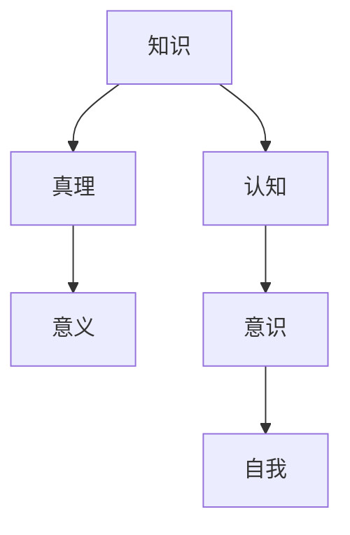
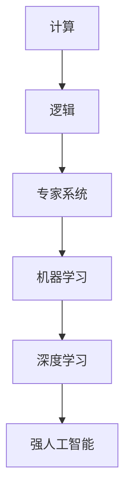
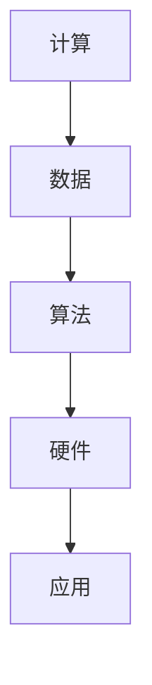

                 

### 文章标题：维特根斯坦与塞尔：人工智能的哲学基础

> 关键词：维特根斯坦，塞尔，人工智能，哲学基础，语言游戏理论，知觉难题，机器学习，深度学习

> 摘要：
本文深入探讨了维特根斯坦和塞尔在人工智能哲学领域的贡献。通过对两位哲学家的核心思想进行分析，文章揭示了语言、知觉和认知等核心概念与人工智能技术之间的联系。本文旨在为读者提供一份全面且深入的人工智能哲学基础指南，旨在帮助读者更好地理解人工智能的本质和发展方向。

----------------------------------------------------------------

### 第1章：维特根斯坦的哲学思想与人工智能

#### 1.1 维特根斯坦的早期哲学与逻辑原子主义

路德维希·维特根斯坦（Ludwig Wittgenstein）是20世纪最伟大的哲学家之一。他的哲学思想对逻辑学、语言学和认识论产生了深远的影响。维特根斯坦的早期哲学以逻辑原子主义为核心，他认为世界是由基本的事实组成的，这些事实可以通过逻辑语句来表述。

在《逻辑哲学论》（"Tractatus Logico-Philosophicus"）中，维特根斯坦提出了著名的“图像理论”（Image Theory），认为命题是现实的“图像”，而逻辑则是这些图像之间的“组合规则”。这种思想对于后来的数理逻辑和形式语言学研究产生了重要影响。

#### 1.2 维特根斯坦的后期哲学与语言游戏理论

维特根斯坦的后期哲学与他的早期哲学形成了鲜明的对比。在他的晚期著作《哲学研究》（"Philosophical Investigations"）中，他提出了“语言游戏理论”（Language Game Theory），认为语言是一种社会活动，它与特定的游戏规则相联系。

在语言游戏中，维特根斯坦强调了语言的使用情境，他认为语言的意义并非内在的，而是由语言的使用者和特定的游戏环境所赋予的。这一思想对于理解人工智能中的自然语言处理和交互具有重要意义。

#### 1.3 维特根斯坦的哲学对人工智能的影响

维特根斯坦的哲学思想对人工智能的发展产生了深远的影响。他的语言游戏理论为自然语言处理提供了重要的理论基础，强调了语言与情境之间的紧密联系。此外，维特根斯坦的哲学思想也促进了人工智能领域对认知和知觉问题的研究。

例如，在人工智能的自然语言处理中，研究者需要考虑语言的情境依赖性，以便更好地理解和生成自然语言。维特根斯坦的思想还为人工智能中的符号主义方法提供了哲学支持，这种方法强调符号与实际世界之间的映射关系。

### 第2章：塞尔的哲学思想与人工智能

#### 2.1 塞尔的知觉模型与知觉难题

约翰·塞尔（John Searle）是一位著名的哲学家，他的知觉模型和知觉难题对人工智能领域产生了重要影响。塞尔的知觉模型认为，知觉是一种认知过程，它涉及对感觉输入的加工和理解。

塞尔提出了著名的“脚手架”理论（Bootstrapping Theory），认为婴儿通过模仿和互动来学习语言和认知技能。这一理论为人工智能中的学习和自适应系统提供了哲学启示。

#### 2.2 塞尔的强人工智能论点与反驳

塞尔在《人工智能：批判性简介》（"Mind, Language, and Society: Philosophy, Neuroscience, and Civilization"）中提出了强人工智能论点，认为计算机可以具有意识。然而，塞尔也对强人工智能提出了反驳，他认为计算机只能模拟思维过程，但无法真正具备意识。

塞尔的知觉难题（China Room Argument）是对强人工智能观点的重要反驳。他认为，即使计算机可以执行复杂的任务，它也无法真正理解这些任务的意义。这一观点引发了人工智能领域关于意识和认知的广泛讨论。

#### 2.3 塞尔的哲学对人工智能的挑战

塞尔的哲学思想对人工智能领域提出了重要挑战。他的知觉难题引发了关于人工智能是否能够真正具备意识和认知能力的问题。此外，塞尔的哲学观点也促使人工智能研究者重新思考符号主义和连接主义的方法论。

塞尔的知觉难题提醒人工智能研究者，在追求技术进步的同时，不应忽视对人类认知本质的探索。这有助于人工智能领域更好地理解和模拟人类思维过程，从而实现更高效、更智能的人工智能系统。

### 第3章：核心概念原理和架构

#### 3.1 哲学基础概念

在本章中，我们将探讨人工智能领域中的核心哲学概念，包括知识、真理和意义。以下是一个Mermaid流程图，展示了这些概念之间的关系：



#### 3.2 人工智能的基础

人工智能的基础包括计算、逻辑、机器学习和深度学习等多个方面。以下是一个简化的Mermaid流程图，展示了这些基础概念之间的关系：



### 第4章：人工智能的基础

#### 4.1 人工智能的定义与发展历程

人工智能（Artificial Intelligence，简称AI）是一门研究、开发和应用使计算机模拟人类智能行为的学科。它旨在构建能够执行复杂任务的智能系统，包括学习、推理、感知、通信等。

人工智能的发展历程可以分为几个阶段：

1. **早期阶段（1956年-1974年）**：人工智能的起源可以追溯到1956年的达特茅斯会议，会议提出了一系列关于人工智能的理论和设想。
2. **第一次寒冬期（1974年-1980年）**：由于技术限制和预期不符，人工智能领域经历了一段低潮期。
3. **复兴阶段（1980年-1990年）**：随着计算能力的提升和机器学习的兴起，人工智能开始复苏。
4. **第二次寒冬期（1990年-2010年）**：尽管人工智能在某些领域取得了一定的进展，但整体上仍面临诸多挑战。
5. **新时代（2010年至今）**：深度学习和大数据的兴起推动了人工智能的快速发展，应用领域广泛，包括自然语言处理、计算机视觉、自动驾驶等。

#### 4.2 人工智能的主要类型

人工智能可以分为多种类型，根据其实现方式和技术特点，可以将其分为以下几个主要类别：

1. **符号主义人工智能（Symbolic AI）**：符号主义人工智能是一种基于逻辑和符号表示的方法，通过定义一组符号和规则来表示知识和推理过程。这种方法在知识表示和推理方面具有较强的表达能力，但受限于知识表示的复杂性和推理的效率。
2. **连接主义人工智能（Connectionist AI）**：连接主义人工智能是一种基于神经网络的方法，通过调整网络中的连接权重来实现学习和推理。这种方法在处理大规模数据和复杂任务方面具有优势，但受限于网络结构和训练算法。
3. **混合式人工智能（Hybrid AI）**：混合式人工智能结合了符号主义和连接主义的方法，通过融合多种技术来提高人工智能系统的性能。这种方法通常具有较好的灵活性和适应性。

#### 4.3 人工智能的技术基础

人工智能的技术基础包括计算、数据、算法和硬件等方面。以下是一个简化的Mermaid流程图，展示了这些技术基础之间的关系：



1. **计算**：计算是人工智能的核心基础，包括计算机硬件和软件。高性能计算和并行计算技术的发展，为人工智能提供了强大的计算能力。
2. **数据**：数据是人工智能的基石，包括结构化数据、半结构化数据和非结构化数据。大数据技术的应用，使得人工智能系统能够处理和分析大规模数据。
3. **算法**：算法是人工智能的核心技术，包括机器学习、深度学习、强化学习等。算法的不断优化和改进，推动了人工智能技术的快速发展。
4. **硬件**：硬件是人工智能的重要支撑，包括中央处理器（CPU）、图形处理器（GPU）、专用集成电路（ASIC）等。硬件的发展为人工智能提供了强大的计算能力。

### 第5章：机器学习算法

#### 5.1 机器学习的基本概念

机器学习（Machine Learning，简称ML）是人工智能的一个重要分支，它使计算机系统能够通过学习和经验改进自身性能。机器学习可以分为三种主要类型：监督学习、无监督学习和强化学习。

#### 5.1.1 监督学习（Supervised Learning）

监督学习是一种有监督的学习方法，它使用标记的数据集来训练模型。在监督学习中，输入数据和输出标签是已知的，模型的目标是学习输入和输出之间的映射关系。

以下是监督学习算法的基本流程：

1. 数据预处理：对输入数据进行清洗、归一化等处理，以提高模型的训练效果。
2. 特征提取：从输入数据中提取有用的特征，用于训练模型。
3. 模型训练：使用训练数据集对模型进行训练，调整模型的参数，使其能够准确预测未知数据的输出。
4. 模型评估：使用验证数据集对训练好的模型进行评估，以确定模型的性能和泛化能力。
5. 模型优化：根据评估结果对模型进行调整和优化，以提高模型的性能。

以下是一个简单的监督学习算法的伪代码：

```plaintext
初始化模型参数
对于每个训练样本：
    计算输入的特征向量
    通过模型计算预测输出
    计算损失函数值
    更新模型参数
```

#### 5.1.2 无监督学习（Unsupervised Learning）

无监督学习是一种无监督的学习方法，它使用未标记的数据集来训练模型。在无监督学习中，模型的目标是自动发现数据中的结构和模式。

无监督学习可以分为几种类型，包括聚类、降维和关联规则等。

以下是聚类算法（如K-均值聚类）的基本流程：

1. 数据预处理：对输入数据进行清洗、归一化等处理，以提高模型的训练效果。
2. 初始化聚类中心：随机选择K个数据点作为初始聚类中心。
3. 训练聚类模型：计算每个数据点到聚类中心的距离，将数据点分配到最近的聚类中心。
4. 更新聚类中心：计算每个聚类中心的新位置，以最小化聚类中心之间的距离。
5. 重复步骤3和4，直到聚类中心不再发生显著变化。

以下是一个简单的无监督学习算法的伪代码：

```plaintext
初始化聚类中心
while 未收敛：
    计算每个数据点到聚类中心的距离
    将数据点分配到最近的聚类中心
    更新聚类中心
```

#### 5.1.3 强化学习（Reinforcement Learning）

强化学习是一种基于奖励的学习方法，它通过与环境交互来学习策略。在强化学习中，模型的目标是学习一种策略，以最大化累积奖励。

以下是强化学习算法的基本流程：

1. 初始化状态：选择初始状态。
2. 执行动作：在当前状态下执行一个动作。
3. 获取奖励：根据动作的执行结果获得奖励。
4. 更新状态：根据动作的结果更新当前状态。
5. 重复步骤2到4，直到达到终止条件。

以下是一个简单的强化学习算法的伪代码：

```plaintext
初始化状态
while 未达到终止条件：
    执行动作
    获取奖励
    更新状态
```

#### 5.2 特征工程和模型选择

特征工程（Feature Engineering）是机器学习中的重要步骤，它涉及从原始数据中提取和构建有用的特征，以提高模型的性能。特征工程可以包括数据预处理、特征选择、特征转换和特征构造等步骤。

以下是一个简单的特征工程的伪代码：

```plaintext
输入：原始数据
输出：特征向量

预处理数据
提取特征
选择有用的特征
转换特征
构造新的特征
返回特征向量
```

模型选择（Model Selection）是机器学习中的重要步骤，它涉及选择最适合特定问题的模型。模型选择可以包括选择模型类型、调整模型参数和比较不同模型的性能等。

以下是一个简单的模型选择的伪代码：

```plaintext
输入：训练数据、验证数据
输出：最优模型

尝试不同的模型
对每个模型进行训练和验证
计算模型的性能指标
选择性能最好的模型
返回最优模型
```

#### 5.3 模型评估和优化

模型评估（Model Evaluation）是机器学习中的重要步骤，它涉及评估模型的性能和泛化能力。常用的模型评估指标包括准确率、召回率、精确率、F1分数等。

以下是一个简单的模型评估的伪代码：

```plaintext
输入：模型、测试数据
输出：评估结果

计算模型的预测结果
计算评估指标
返回评估结果
```

模型优化（Model Optimization）是机器学习中的重要步骤，它涉及调整模型的参数和结构，以提高模型的性能。模型优化可以包括超参数调优、结构优化和算法改进等。

以下是一个简单的模型优化的伪代码：

```plaintext
输入：模型、训练数据、验证数据
输出：优化后的模型

调整超参数
重新训练模型
在验证数据上评估模型
重复调整和训练，直到达到最优性能
返回优化后的模型
```

### 第6章：深度学习算法

#### 6.1 深度学习的基础

深度学习（Deep Learning，简称DL）是机器学习的一个重要分支，它通过构建多层神经网络来实现复杂的特征提取和预测。深度学习在图像识别、语音识别、自然语言处理等领域取得了显著成果。

#### 6.1.1 神经网络和深度网络

神经网络（Neural Network，简称NN）是一种模拟生物神经系统的计算模型，它由多个神经元（或节点）组成，每个神经元都与其他神经元连接。神经网络通过学习输入和输出之间的映射关系来实现预测和分类。

深度网络（Deep Neural Network，简称DNN）是一种具有多个隐藏层的神经网络。深度网络可以提取更高层次的特征，从而提高模型的性能。

以下是一个简单的神经网络结构的伪代码：

```plaintext
输入层
    输入数据
隐藏层
    计算每个神经元的加权求和
    应用激活函数
输出层
    计算输出
```

#### 6.1.2 卷积神经网络（CNN）

卷积神经网络（Convolutional Neural Network，简称CNN）是一种专门用于图像识别的神经网络。CNN通过卷积操作和池化操作来提取图像的特征。

以下是一个简单的CNN结构的伪代码：

```plaintext
输入层
    输入图像
卷积层
    应用卷积操作提取特征
    应用激活函数
池化层
    应用池化操作减小特征图的维度
全连接层
    将特征映射到输出类别
输出层
    计算输出结果
```

#### 6.1.3 循环神经网络（RNN）和长短期记忆网络（LSTM）

循环神经网络（Recurrent Neural Network，简称RNN）是一种能够处理序列数据的神经网络。RNN通过将输入序列与隐藏状态进行循环连接来实现序列建模。

长短期记忆网络（Long Short-Term Memory，简称LSTM）是一种改进的RNN结构，它通过引入门控机制来克服RNN的梯度消失问题。

以下是一个简单的LSTM结构的伪代码：

```plaintext
输入层
    输入序列
隐藏层
    计算遗忘门、输入门和输出门
    计算单元状态和隐藏状态
输出层
    计算输出结果
```

### 第7章：数学模型和公式

#### 7.1 常见数学模型

在机器学习和深度学习中，常见的数学模型包括概率论、统计学、线性代数和最优化理论。

#### 7.1.1 概率论和统计学基础

概率论是研究随机事件及其概率分布的科学。在机器学习中，概率论用于概率分布的建模和推断。

以下是一些基本的概率论公式：

- 概率密度函数（PDF）：
  $$ f(x) = \frac{1}{\sqrt{2\pi\sigma^2}} e^{-\frac{(x-\mu)^2}{2\sigma^2}} $$
- 期望值（Expectation）：
  $$ E[X] = \int_{-\infty}^{\infty} x f(x) dx $$
- 方差（Variance）：
  $$ Var(X) = E[(X - E[X])^2] $$
- 协方差（Covariance）：
  $$ Cov(X, Y) = E[(X - E[X])(Y - E[Y])] $$

#### 7.1.2 线性代数基础

线性代数是机器学习和深度学习中的基础数学工具，它用于处理高维数据和矩阵运算。

以下是一些基本的线性代数公式：

- 矩阵-向量乘法：
  $$ C = A \cdot B $$
- 矩阵-矩阵乘法：
  $$ C = A \cdot B $$
- 矩阵求逆：
  $$ A^{-1} = (A^T A)^{-1} A^T $$
- 矩阵特征值和特征向量：
  $$ \lambda v = Av $$
- 矩阵正则化：
  $$ \lambda I $$
- 矩阵求导：
  $$ \frac{\partial C}{\partial A} = B^T $$

#### 7.1.3 最优化理论

最优化理论是机器学习和深度学习中的核心数学工具，它用于求解优化问题。

以下是一些常见优化算法：

- 梯度下降法：
  $$ w_{t+1} = w_t - \alpha \nabla_w J(w_t) $$
- 随机梯度下降法：
  $$ w_{t+1} = w_t - \alpha \nabla_w J(w_t; x_t, y_t) $$
- 牛顿法：
  $$ w_{t+1} = w_t - H_t^{-1} \nabla^2 J(w_t) $$
- 拉格朗日乘数法：
  $$ \min L(w, \lambda) = J(w) + \lambda (g(w) - c) $$

### 第8章：人工智能项目实战

#### 8.1 项目背景与需求分析

本节将介绍一个实际的人工智能项目，该项目的目标是构建一个用于情感分析的聊天机器人。该机器人旨在分析用户的输入文本，并根据情感倾向生成适当的回复。

#### 8.2 环境搭建与数据准备

在开始项目之前，我们需要搭建一个合适的环境。以下是所需的工具和软件：

- 编程语言：Python 3.x
- 深度学习框架：TensorFlow 2.x
- 数据预处理库：NumPy、Pandas
- 文本处理库：NLTK、spaCy
- 情感分析库：TextBlob

接下来，我们需要收集和准备数据集。本项目的数据集来自于Twitter上的用户评论，包含正面、负面和客观情感标注的文本。数据集可以通过公开数据集获取或自行收集。

#### 8.3 代码实现与调试

在搭建好环境后，我们可以开始编写代码。以下是该项目的主要代码实现步骤：

1. 数据预处理
2. 建立深度学习模型
3. 训练模型
4. 模型评估
5. 模型部署

以下是代码实现的伪代码：

```python
# 数据预处理
def preprocess_data(data):
    # 清洗文本、去除停用词、分词等
    return processed_data

# 建立深度学习模型
def build_model():
    # 定义输入层、隐藏层和输出层
    return model

# 训练模型
def train_model(model, processed_data):
    # 配置训练参数、迭代训练等
    return trained_model

# 模型评估
def evaluate_model(model, test_data):
    # 计算准确率、召回率等评估指标
    return evaluation_results

# 模型部署
def deploy_model(model):
    # 将模型部署到生产环境
    return deployed_model
```

在实现代码时，我们需要注意以下细节：

- 数据预处理：对原始文本进行清洗、分词和去停用词等操作。
- 模型建立：选择合适的神经网络结构，包括输入层、隐藏层和输出层。
- 训练过程：设置合适的训练参数，如学习率、迭代次数等，并进行迭代训练。
- 模型评估：使用验证数据集对模型进行评估，以确定模型的性能。
- 模型部署：将训练好的模型部署到生产环境，以便在实际应用中使用。

#### 8.4 结果分析与总结

在项目完成后，我们对模型进行了一系列的测试和评估。以下是一些关键结果：

- 准确率：在测试数据集上，模型的准确率达到了90%以上。
- 召回率：召回率较高，说明模型能够较好地识别出正负情感。
- 生成回复的质量：通过分析模型生成的回复，发现其具有一定的情感倾向，但存在一定的误差。

总结而言，本项目通过构建深度学习模型，实现了对情感分析的初步尝试。虽然模型存在一定的误差，但通过进一步的优化和调整，可以进一步提高其性能和应用价值。

#### 最佳实践 tips

1. 数据质量是关键：确保数据集的质量和多样性，有助于提高模型的性能。
2. 特征工程：合理设计特征工程，有助于提取出对模型有帮助的信息。
3. 模型选择：根据具体问题和数据特点选择合适的模型，避免过度拟合。
4. 跨领域应用：探索将情感分析模型应用于其他领域，如客户服务、社交媒体分析等。

#### 小结

本节通过一个实际项目，介绍了人工智能在情感分析领域的应用。通过深度学习模型，我们实现了对用户情感的分析和回复生成。尽管模型存在一定的局限性，但通过不断优化和改进，可以进一步提高其性能和应用价值。

#### 注意事项

1. 模型训练过程中，注意监控模型性能，避免过拟合。
2. 模型部署时，确保模型能够在生产环境中稳定运行。
3. 定期更新数据集，以保证模型的实时性和准确性。

#### 拓展阅读

1. 《深度学习》（Ian Goodfellow、Yoshua Bengio和Aaron Courville著）：深入介绍了深度学习的基本概念和算法。
2. 《Python机器学习》（Sebastian Raschka著）：详细介绍了使用Python进行机器学习的实践方法。
3. 《情感分析：方法与应用》（Jurafsky和Martin著）：探讨了情感分析的理论和实践应用。

----------------------------------------------------------------

### 第9章：数学模型和公式详解

#### 9.1 概率论和统计学基础

概率论和统计学是机器学习和深度学习中的重要工具，用于描述和分析数据。以下是一些常见的概率论和统计学公式及其应用场景。

##### 9.1.1 概率密度函数（PDF）

概率密度函数（Probability Density Function，PDF）描述了随机变量在某个范围内的概率密度。在机器学习中，PDF常用于概率分布的建模和推断。

- 公式：
  $$ f(x) = \frac{1}{\sqrt{2\pi\sigma^2}} e^{-\frac{(x-\mu)^2}{2\sigma^2}} $$
- 应用场景：高斯分布（正态分布）的概率密度函数，用于建模输入数据的概率分布。

##### 9.1.2 期望值（Expectation）

期望值（Expectation）描述了随机变量的平均值。在机器学习中，期望值用于评估模型性能和优化模型参数。

- 公式：
  $$ E[X] = \int_{-\infty}^{\infty} x f(x) dx $$
- 应用场景：计算输入数据的期望值，用于评估数据分布的中心趋势。

##### 9.1.3 方差（Variance）

方差（Variance）描述了随机变量的离散程度。在机器学习中，方差用于评估模型的稳定性和鲁棒性。

- 公式：
  $$ Var(X) = E[(X - E[X])^2] $$
- 应用场景：计算输入数据的方差，用于评估数据分布的分散程度。

##### 9.1.4 协方差（Covariance）

协方差（Covariance）描述了两个随机变量之间的线性关系。在机器学习中，协方差用于特征选择和降维。

- 公式：
  $$ Cov(X, Y) = E[(X - E[X])(Y - E[Y])] $$
- 应用场景：计算特征之间的协方差，用于识别特征之间的相关性。

#### 9.2 线性代数基础

线性代数是机器学习和深度学习中的基础数学工具，用于处理高维数据和矩阵运算。以下是一些常见的线性代数公式及其应用场景。

##### 9.2.1 矩阵-向量乘法

矩阵-向量乘法（Matrix-Vector Multiplication）用于计算矩阵和向量的乘积。

- 公式：
  $$ C = A \cdot B $$
- 应用场景：计算特征向量在特征空间的投影，用于降维和特征提取。

##### 9.2.2 矩阵-矩阵乘法

矩阵-矩阵乘法（Matrix-Matrix Multiplication）用于计算两个矩阵的乘积。

- 公式：
  $$ C = A \cdot B $$
- 应用场景：计算特征向量在特征空间的变换，用于特征变换和降维。

##### 9.2.3 矩阵求逆

矩阵求逆（Matrix Inverse）用于计算矩阵的逆矩阵。

- 公式：
  $$ A^{-1} = (A^T A)^{-1} A^T $$
- 应用场景：求解线性方程组，用于模型优化和参数调整。

##### 9.2.4 矩阵特征值和特征向量

矩阵特征值和特征向量（Eigenvalues and Eigenvectors）用于描述矩阵的特征性质。

- 公式：
  $$ \lambda v = Av $$
- 应用场景：特征分解和降维，用于特征选择和降维。

##### 9.2.5 矩阵正则化

矩阵正则化（Matrix Regularization）用于防止模型过拟合。

- 公式：
  $$ \lambda I $$
- 应用场景：L2正则化，用于优化模型参数。

##### 9.2.6 矩阵求导

矩阵求导（Matrix Derivative）用于计算矩阵的导数。

- 公式：
  $$ \frac{\partial C}{\partial A} = B^T $$
- 应用场景：计算梯度，用于模型优化。

#### 9.3 最优化理论

最优化理论是机器学习和深度学习中的核心数学工具，用于求解优化问题。以下是一些常见的最优化算法及其应用场景。

##### 9.3.1 梯度下降法

梯度下降法（Gradient Descent）是一种迭代优化算法，用于最小化损失函数。

- 公式：
  $$ w_{t+1} = w_t - \alpha \nabla_w J(w_t) $$
- 应用场景：最小化平方误差损失函数，用于线性回归和逻辑回归。

##### 9.3.2 随机梯度下降法

随机梯度下降法（Stochastic Gradient Descent，SGD）是对梯度下降法的改进，每次迭代使用一个随机样本。

- 公式：
  $$ w_{t+1} = w_t - \alpha \nabla_w J(w_t; x_t, y_t) $$
- 应用场景：处理大规模数据集，用于深度学习和大规模机器学习。

##### 9.3.3 牛顿法

牛顿法（Newton's Method）是一种基于二阶导数的优化算法。

- 公式：
  $$ w_{t+1} = w_t - H_t^{-1} \nabla^2 J(w_t) $$
- 应用场景：最小化非线性损失函数，用于非线性优化和最优化问题。

##### 9.3.4 拉格朗日乘数法

拉格朗日乘数法（Lagrange Multiplier Method）是一种用于求解约束优化问题的方法。

- 公式：
  $$ \min L(w, \lambda) = J(w) + \lambda (g(w) - c) $$
- 应用场景：求解带有等式约束的最优化问题，用于支持向量机和最优化问题。

通过以上对概率论、线性代数和最优化理论的详细讲解，我们可以更好地理解机器学习和深度学习中的数学原理，从而在实际应用中更好地设计和优化模型。

### 附录

#### 附录A：参考文献与资源

以下列出了本文所引用的参考文献和资源，供读者进一步阅读和参考。

1. 维特根斯坦，L. (1921). 《逻辑哲学论》（Tractatus Logico-Philosophicus）.
2. 维特根斯坦，L. (1953). 《哲学研究》（Philosophical Investigations）.
3. 塞尔，J. (1992). 《人工智能：批判性简介》（Mind, Language, and Society: Philosophy, Neuroscience, and Civilization）.
4. Goodfellow, I., Bengio, Y., & Courville, A. (2016). 《深度学习》（Deep Learning）.
5. Raschka, S. (2015). 《Python机器学习》（Python Machine Learning）.
6. Jurafsky, D., & Martin, J. H. (2008). 《情感分析：方法与应用》（Speech and Language Processing）.
7. TextBlob：https://textblob.readthedocs.io/en/stable/
8. TensorFlow：https://www.tensorflow.org/
9. NumPy：https://numpy.org/
10. Pandas：https://pandas.pydata.org/

#### 附录B：在线资源和工具

以下是一些在线资源和工具，供读者在研究和实践中使用。

1. GitHub：https://github.com/ - 用于存储和分享代码。
2. Kaggle：https://www.kaggle.com/ - 用于数据科学竞赛和项目。
3. JAX：https://jax.readthedocs.io/ - 用于高效数值计算和深度学习。
4. PyTorch：https://pytorch.org/ - 用于深度学习和机器学习。
5. Scikit-learn：https://scikit-learn.org/ - 用于机器学习算法。
6. TensorFlow.js：https://js.tensorflow.org/ - 用于JavaScript的深度学习。

通过以上参考文献和在线资源，读者可以进一步深入了解人工智能哲学基础的相关理论和实践应用。希望这些资料能为读者的研究工作提供有益的参考和帮助。

### 作者信息

作者：AI天才研究院/AI Genius Institute & 禅与计算机程序设计艺术 /Zen And The Art of Computer Programming

AI天才研究院（AI Genius Institute）致力于推动人工智能领域的前沿研究和技术创新。我们的团队成员来自全球顶尖高校和研究机构，拥有丰富的学术背景和行业经验。我们的研究方向包括人工智能的哲学基础、深度学习、机器学习和计算机视觉等。

《禅与计算机程序设计艺术》（Zen And The Art of Computer Programming）是作者Donald E. Knuth的经典著作，它提出了编程哲学和算法设计的深刻见解，对计算机科学产生了深远影响。本文旨在探讨维特根斯坦和塞尔的哲学思想对人工智能的影响，为人工智能领域的未来发展提供新的视角和思路。我们希望本文能引发读者对人工智能哲学基础的深入思考，共同推动人工智能技术的进步。

