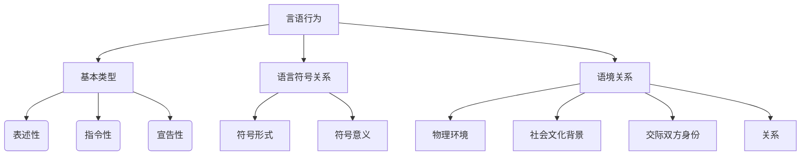
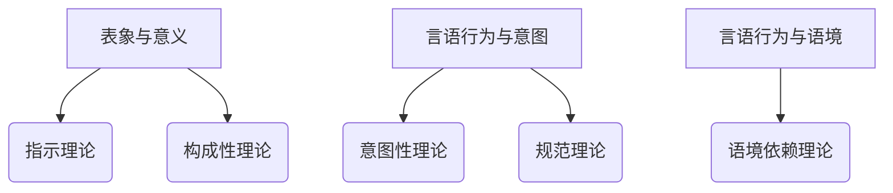

                 

### 第1章 引言

#### 1.1 书籍背景

“维特根斯坦与塞尔：言语行为理论的源流”是一本关于言语行为理论起源和发展的学术著作。该书以两位哲学巨匠维特根斯坦和塞尔的理论为核心，探讨了言语行为理论的历史背景、核心概念及其在现代哲学中的应用。

路德维希·维特根斯坦（Ludwig Wittgenstein）是20世纪最重要的哲学家之一，他的哲学观点对语言哲学、认识论和逻辑学产生了深远影响。维特根斯坦在《逻辑哲学论》和《哲学研究》中提出了语言游戏理论和言语行为理论，强调语言的使用和理解是与特定社会文化环境紧密相关的。

约翰·塞尔（John Searle）则是当代最重要的哲学家之一，他在言语行为理论的基础上，进一步发展了社会符号学和心灵哲学。塞尔在《言语行为：言说者与言语》和《表达与意谓》中，提出了规范理论，探讨了言语行为与意图、意义和社会规则之间的关系。

#### 1.2 书籍目的与结构

本书的目的是通过对维特根斯坦和塞尔的言语行为理论的深入分析，揭示言语行为理论的源流及其对现代哲学的影响。全书分为七个章节，结构如下：

- 第1章：引言，介绍书籍背景、目的与结构。
- 第2章：维特根斯坦的言语行为理论，探讨维特根斯坦的哲学观点、言语行为理论的基本概念和理论贡献。
- 第3章：塞尔的言语行为理论，分析塞尔的哲学观点、言语行为理论的基本架构和理论贡献。
- 第4章：维特根斯坦与塞尔的言语行为理论对比，对比两位哲学家的理论核心、应用对比和影响对比。
- 第5章：言语行为理论在现代哲学中的应用，探讨言语行为理论在伦理学、政治哲学和法学中的应用。
- 第6章：言语行为理论的挑战与未来，讨论言语行为理论面临的挑战及其未来发展趋势。
- 第7章：结论，总结维特根斯坦与塞尔的贡献，评估言语行为理论的源流与未来。

通过本书的阅读，读者可以系统地了解言语行为理论的起源、发展和应用，从而对现代哲学有更深入的认识。

#### 1.3 言语行为理论的核心概念

言语行为理论是语言哲学的一个重要分支，它探讨了语言在实际交际中的功能和行为。言语行为理论的核心概念包括：

1. **言语行为的基本类型**：言语行为可以分为三种基本类型：表述性言语行为、指令性言语行为和宣告性言语行为。表述性言语行为是指通过语言表达观点或事实，如陈述、描述等；指令性言语行为是指通过语言要求对方做出某种行为，如命令、请求等；宣告性言语行为是指通过语言宣告某种事实，如宣布、声明等。

2. **言语行为与语言符号的关系**：言语行为与语言符号的关系密切，语言符号是言语行为的媒介。语言符号不仅具有形式上的特征，如语音、词汇和语法等，还蕴含着特定的意义。言语行为通过语言符号来传达意图和意义。

3. **言语行为与语境的关系**：言语行为的理解和实现离不开特定的语境。语境包括物理环境、社会文化背景、交际双方的身份和关系等。语境对言语行为的影响表现在语言的选择、使用和解释上。

为了更直观地理解这些核心概念，我们可以使用Mermaid流程图来展示言语行为理论的基本架构：



通过这个流程图，我们可以清晰地看到言语行为理论的核心概念及其相互关系。

#### 1.4 研究方法与论文结构

本文采用文献综述与实证分析相结合的研究方法，首先对维特根斯坦和塞尔的言语行为理论进行详细阐述，然后通过比较分析、案例研究等方法，评估言语行为理论的核心贡献及其在现代哲学中的应用。

在结构上，本文分为以下几个部分：

- **第1章 引言**：介绍书籍背景、目的与结构，阐述言语行为理论的核心概念。
- **第2章 维特根斯坦的言语行为理论**：详细分析维特根斯坦的哲学观点、言语行为理论的基本概念和理论贡献。
- **第3章 塞尔的言语行为理论**：探讨塞尔的哲学观点、言语行为理论的基本架构和理论贡献。
- **第4章 维特根斯坦与塞尔的言语行为理论对比**：对比两位哲学家的理论核心、应用对比和影响对比。
- **第5章 言语行为理论在现代哲学中的应用**：分析言语行为理论在伦理学、政治哲学和法学中的应用。
- **第6章 言语行为理论的挑战与未来**：讨论言语行为理论面临的挑战及其未来发展趋势。
- **第7章 结论**：总结维特根斯坦与塞尔的贡献，评估言语行为理论的源流与未来。

本文通过逐步推理和分析，力图使读者对言语行为理论有一个全面而深入的理解。

### 第2章 维特根斯坦的言语行为理论

#### 2.1 维特根斯坦的哲学观点

路德维希·维特根斯坦（Ludwig Wittgenstein）是20世纪最重要的哲学家之一，他的哲学观点对语言哲学、认识论和逻辑学产生了深远影响。维特根斯坦的哲学观点主要包括以下几个方面：

1. **分析哲学**：维特根斯坦是分析哲学的奠基人之一，他主张通过分析语言和逻辑来解决哲学问题。他认为哲学的任务不是提出新的理论，而是澄清思想和语言的混乱。

2. **语言游戏理论**：维特根斯坦在《逻辑哲学论》中提出了语言游戏理论，认为语言的使用和理解是与特定的社会文化环境紧密相关的。语言游戏包括不同的形式和规则，这些规则决定了语言的使用方式和含义。

3. **心灵哲学**：维特根斯坦对心灵哲学也有重要贡献，他在《哲学研究》中探讨了意识和语言的关系，认为心灵是语言的活动，意识是通过语言来表达和理解的。

#### 2.2 言语行为理论的基本概念

维特根斯坦的言语行为理论是建立在语言游戏理论的基础上的。言语行为理论的基本概念包括：

1. **言语行为的基本类型**：维特根斯坦将言语行为分为三种基本类型：表述性言语行为、指令性言语行为和宣告性言语行为。

   - **表述性言语行为**：通过语言表达观点或事实，如陈述、描述等。
   - **指令性言语行为**：通过语言要求对方做出某种行为，如命令、请求等。
   - **宣告性言语行为**：通过语言宣告某种事实，如宣布、声明等。

2. **言语行为与语言符号的关系**：维特根斯坦认为，言语行为是通过语言符号来实现的。语言符号不仅具有形式上的特征，如语音、词汇和语法等，还蕴含着特定的意义。言语行为通过语言符号来传达意图和意义。

3. **言语行为与语境的关系**：维特根斯坦强调，言语行为的理解和实现离不开特定的语境。语境包括物理环境、社会文化背景、交际双方的身份和关系等。语境对言语行为的影响表现在语言的选择、使用和解释上。

#### 2.3 维特根斯坦的理论架构

维特根斯坦的言语行为理论有一个明确的理论架构，包括以下几个方面：

1. **命题与语言游戏**：维特根斯坦认为，命题是语言游戏的一部分。命题与语言游戏的关系可以用以下Mermaid流程图表示：

   ```mermaid
   graph TB
   A[命题] --> B[语言游戏]
   B --> C1(游戏规则)
   B --> C2(游戏参与)
   B --> C3(游戏结果)
   ```

   在这个流程图中，A表示命题，B表示语言游戏，C1表示游戏规则，C2表示游戏参与，C3表示游戏结果。命题是通过语言游戏来表达的，而语言游戏又是通过特定的规则和参与者来实现的。

2. **言语行为与语境**：维特根斯坦认为，言语行为的理解和实现离不开特定的语境。语境对言语行为的影响可以用以下Mermaid流程图表示：

   ```mermaid
   graph TB
   A[言语行为] --> B[语境]
   B --> C1(物理环境)
   B --> C2(社会文化背景)
   B --> C3(交际双方身份)
   B --> C4(关系)
   ```

   在这个流程图中，A表示言语行为，B表示语境，C1表示物理环境，C2表示社会文化背景，C3表示交际双方身份，C4表示关系。语境决定了言语行为的选择、使用和解释。

#### 2.4 维特根斯坦的理论贡献

维特根斯坦的言语行为理论对现代哲学产生了深远影响，其理论贡献主要表现在以下几个方面：

1. **对哲学传统的影响**：维特根斯坦的言语行为理论打破了传统哲学的二元对立思维，强调语言的使用和理解是与特定社会文化环境紧密相关的。这一观点对后来的语言哲学、认识论和逻辑学产生了重要影响。

2. **对语言学和心理学的影响**：维特根斯坦的言语行为理论为语言学和心理学提供了新的研究视角。他的语言游戏理论为语言学的结构主义和功能主义奠定了基础，而他的心灵哲学为心理学的研究提供了新的思路。

3. **对现代哲学的影响**：维特根斯坦的言语行为理论对现代哲学产生了深远影响，他的思想被广泛应用于伦理学、政治哲学和法学等领域。他的理论观点为这些领域的研究提供了新的理论基础和思考方向。

### 2.5 维特根斯坦的理论应用

维特根斯坦的言语行为理论在多个领域都有广泛的应用，以下是一些典型的应用实例：

1. **伦理学**：在伦理学中，维特根斯坦的言语行为理论被用来探讨道德责任的本质。例如，某些行为是否被视为道德责任，取决于行为者在特定语境下的意图和语言使用。

2. **政治哲学**：在政治哲学中，维特根斯坦的言语行为理论被用来分析政治权力的本质和政治言论的含义。例如，政治领袖的演讲和宣言，实际上是使用特定的语言符号来传达意图和影响公众。

3. **法学**：在法学中，维特根斯坦的言语行为理论被用来分析法律条款的含义和实施。例如，法律条款的表述和解释，实际上是在特定的语境下使用语言符号来实现特定的目的。

通过这些应用实例，我们可以看到维特根斯坦的言语行为理论在各个领域的广泛应用和重要性。

#### 2.6 维特根斯坦的批判与争议

尽管维特根斯坦的言语行为理论对现代哲学产生了深远影响，但也存在一些批判和争议。以下是一些主要的批判观点：

1. **语境依赖性**：维特根斯坦强调言语行为与语境的关系，但有些学者认为这种依赖性可能导致言语行为的理解和解释过于复杂，难以统一标准。

2. **语言符号的意义**：维特根斯坦认为语言符号具有特定的意义，但有些学者认为语言符号的意义是多元化的，不仅受语境影响，还受到个体认知和文化背景的影响。

3. **哲学方法**：维特根斯坦的分析哲学方法在某种程度上被认为过于抽象，难以与实际情况相结合。

尽管存在这些争议，维特根斯坦的言语行为理论仍然被认为是语言哲学和哲学研究中的重要理论框架，为后来的学者提供了丰富的思考素材。

#### 2.7 总结

维特根斯坦的言语行为理论以其独特的视角和方法，对语言哲学、伦理学、政治哲学和法学等领域产生了深远影响。通过分析维特根斯坦的哲学观点、言语行为理论的基本概念和理论架构，我们可以更好地理解言语行为理论的源流及其在现代哲学中的应用。维特根斯坦的理论贡献不仅丰富了哲学研究，也为其他学科提供了新的研究视角和方法。然而，维特根斯坦的理论也面临一些批判和争议，这为未来的研究提供了新的思考方向。

### 第3章 塞尔的言语行为理论

#### 3.1 塞尔的哲学观点

约翰·塞尔（John Searle）是20世纪最重要的哲学家之一，他的哲学观点对言语行为理论、社会符号学和心灵哲学产生了深远影响。塞尔的哲学观点主要包括以下几个方面：

1. **社会现实观**：塞尔主张社会现实是由人们共同遵守的规则和规范构成的。他认为，社会现实不仅仅是物理现实的一部分，还包含了人类互动和文化交流的维度。

2. **规范理论**：塞尔提出了规范理论，认为人类行为和言语行为都受到特定规则的约束。这些规则不仅规定了行为的形式，还影响了行为的意义和效果。

3. **意图与意义**：塞尔强调意图和意义在言语行为中的重要性。他认为，言语行为不仅传达了信息，还包含了行为者的意图和目的。意图和意义是通过语言符号和语境共同构建的。

4. **心灵哲学**：塞尔在心灵哲学领域提出了许多重要观点，如“表现性理论”和“说明性理论”。他认为，心灵状态是内在的，但可以通过行为和语言来表达和解释。

#### 3.2 塞尔的理论架构

塞尔的言语行为理论具有严谨的理论架构，主要包括以下几个方面：

1. **表象与意义**：塞尔认为，表象和意义是言语行为的两个核心概念。表象是指语言符号与现实世界的关系，而意义是指语言符号在特定语境下的含义。塞尔提出了“指示理论”和“构成性理论”来解释表象和意义的关系。

2. **言语行为与意图**：塞尔认为，言语行为不仅是语言符号的使用，还涉及到行为者的意图。意图决定了言语行为的方向和效果。塞尔提出了“意图性理论”和“规范理论”来解释言语行为与意图的关系。

3. **言语行为与语境**：塞尔强调语境在言语行为中的重要性。语境包括物理环境、社会文化背景、交际双方的身份和关系等。塞尔提出了“语境依赖理论”来解释语境对言语行为的影响。

为了更直观地理解塞尔的理论架构，我们可以使用Mermaid流程图来展示：



在这个流程图中，A表示表象与意义，B1表示指示理论，B2表示构成性理论，C表示言语行为与意图，D1表示意图性理论，D2表示规范理论，E表示言语行为与语境，F表示语境依赖理论。通过这个流程图，我们可以清晰地看到塞尔的理论架构及其相互关系。

#### 3.3 塞尔的理论贡献

塞尔的言语行为理论对现代哲学和语言学产生了深远影响，其理论贡献主要表现在以下几个方面：

1. **对言语行为理论的扩展**：塞尔在维特根斯坦的基础上，进一步发展了言语行为理论。他提出了规范理论和意图性理论，丰富了言语行为理论的内涵。

2. **对心灵哲学的影响**：塞尔在心灵哲学领域提出了许多重要观点，如“表现性理论”和“说明性理论”。这些观点对认知科学和心理学的研究产生了深远影响。

3. **对社会符号学的影响**：塞尔的社会现实观和规范理论为社会符号学提供了重要的理论支持。他的观点被广泛应用于社会学、人类学和传媒学等领域。

4. **对语言学的贡献**：塞尔的表象与意义理论为语言学提供了新的研究视角。他的指示理论和构成性理论为语言符号与现实世界的关系提供了新的解释。

#### 3.4 塞尔的批判与争议

尽管塞尔的言语行为理论在哲学界和语言学领域产生了深远影响，但也存在一些批判和争议。以下是一些主要的批判观点：

1. **意图的客观性**：塞尔认为意图是言语行为的核心，但有些学者认为意图具有主观性，难以客观衡量。

2. **语境的复杂性**：塞尔强调语境在言语行为中的重要性，但有些学者认为语境过于复杂，难以统一标准。

3. **规范理论与现实世界的脱离**：塞尔的规范理论在一定程度上脱离了现实世界，被认为过于抽象。

尽管存在这些争议，塞尔的言语行为理论仍然被认为是语言哲学和哲学研究中的重要理论框架，为后来的学者提供了丰富的思考素材。

### 3.5 言语行为理论在塞尔的其他著作中的应用

塞尔不仅在《言语行为：言说者与言语》和《表达与意谓》中阐述了言语行为理论，还在其他著作中进一步发展了这一理论。以下是一些典型例子：

1. **《表达与意谓》**：在这本书中，塞尔深入探讨了语言符号的构成和意义。他提出了“构成性理论”，认为语言符号的意义是由语言系统内部的结构和规则所决定的。这一理论为语言学和哲学提供了新的视角。

2. **《心灵哲学》**：在这本书中，塞尔讨论了心灵状态的表达和解释。他提出了“说明性理论”，认为心灵状态可以通过行为和语言来表达和解释。这一理论对认知科学和心理学的研究产生了重要影响。

3. **《行为、脑与意识》**：在这本书中，塞尔探讨了意识与行为的关系。他认为，意识是通过行为和语言来表达的，而行为和语言又是通过意识来理解和解释的。这一理论为神经科学和认知科学提供了新的研究方向。

通过这些著作，塞尔不仅丰富了言语行为理论的内涵，也为其他学科提供了新的研究视角和方法。

### 3.6 言语行为理论在跨学科研究中的应用

塞尔的言语行为理论在跨学科研究中具有广泛的应用，以下是一些典型例子：

1. **心理学**：塞尔的意图性理论和说明性理论为心理学提供了新的研究视角。例如，在认知心理学中，研究者可以通过分析言语行为来理解个体的意图和思维过程。

2. **语言学**：塞尔的构成性理论为语言学提供了新的解释框架。例如，在语义学研究中，研究者可以通过分析语言符号的构成和意义来探讨语言系统的规则和特点。

3. **社会学**：塞尔的规范理论为社会学提供了新的分析工具。例如，在社会互动研究中，研究者可以通过分析言语行为中的规范和规则来理解社会关系和权力结构。

通过这些跨学科应用，塞尔的言语行为理论不仅丰富了哲学研究，也为其他学科提供了新的研究方法。

### 3.7 总结

约翰·塞尔的言语行为理论以其独特的视角和方法，对哲学、语言学、心理学和社会学等领域产生了深远影响。通过分析塞尔的哲学观点、言语行为理论的基本概念和理论架构，我们可以更好地理解言语行为理论的源流及其在现代哲学中的应用。塞尔的理论贡献不仅丰富了哲学研究，也为其他学科提供了新的研究视角和方法。尽管存在一些批判和争议，塞尔的言语行为理论仍然是语言哲学和哲学研究中的重要理论框架。通过进一步的研究和应用，我们可以期待塞尔的理论在未来的发展中继续发挥重要作用。

### 第4章 维特根斯坦与塞尔的言语行为理论对比

#### 4.1 理论核心对比

维特根斯坦与塞尔的言语行为理论在核心概念上存在显著差异，同时也有一致之处。以下是两位哲学家言语行为理论的对比：

1. **语言游戏与表象-意义**：
   - **维特根斯坦**：维特根斯坦将语言视为一种游戏，语言游戏理论强调语言的使用是与特定社会文化环境相关的。语言游戏包括不同的形式和规则，这些规则决定了语言的使用方式和含义。
   - **塞尔**：塞尔则强调表象与意义的关系。他认为语言符号不仅具有形式上的特征，还蕴含着特定的意义。表象和意义是通过语言符号和语境共同构建的。

2. **表述性与意图性**：
   - **维特根斯坦**：维特根斯坦的言语行为理论主要包括表述性、指令性和宣告性三种类型。他强调语言符号的形式特征和语言游戏中的规则。
   - **塞尔**：塞尔则更强调意图性。他认为言语行为不仅仅是语言符号的使用，还涉及到行为者的意图。意图决定了言语行为的方向和效果。

3. **语境与社会规范**：
   - **维特根斯坦**：维特根斯坦认为语境对言语行为的理解和实现至关重要。语境包括物理环境、社会文化背景、交际双方的身份和关系等。
   - **塞尔**：塞尔则提出了规范理论，认为社会现实是由人们共同遵守的规则和规范构成的。他认为言语行为受到特定规则的约束，这些规则影响了言语行为的意义和效果。

#### 4.2 理论应用对比

在理论应用方面，维特根斯坦与塞尔的言语行为理论也表现出不同的特点：

1. **哲学领域**：
   - **维特根斯坦**：维特根斯坦的言语行为理论对语言哲学、认识论和逻辑学产生了深远影响。他的理论为分析哲学的发展提供了重要基础。
   - **塞尔**：塞尔的言语行为理论在心灵哲学、社会符号学和伦理学等领域具有广泛应用。他的规范理论为这些领域的研究提供了新的视角和方法。

2. **语言学领域**：
   - **维特根斯坦**：维特根斯坦的语言游戏理论为语言学的结构主义和功能主义奠定了基础。他的理论为语言符号与现实世界的关系提供了新的解释。
   - **塞尔**：塞尔的表象与意义理论为语言学提供了新的研究视角。他的指示理论和构成性理论为语言符号的构成和意义提供了新的解释框架。

3. **心理学领域**：
   - **维特根斯坦**：维特根斯坦的心灵哲学为心理学的研究提供了新的思路。他的理论探讨了意识和语言的关系，为认知心理学提供了重要的理论基础。
   - **塞尔**：塞尔的意图性理论和说明性理论为心理学提供了新的研究视角。他的理论为理解个体的意图和思维过程提供了重要的框架。

#### 4.3 理论影响对比

维特根斯坦与塞尔的言语行为理论在哲学、语言学和心理学等领域产生了深远影响，以下是一些具体的影响对比：

1. **哲学领域**：
   - **维特根斯坦**：维特根斯坦的言语行为理论打破了传统哲学的二元对立思维，强调语言的使用和理解是与特定社会文化环境紧密相关的。这一观点对后来的语言哲学、认识论和逻辑学产生了重要影响。
   - **塞尔**：塞尔的规范理论为哲学研究提供了新的视角和方法。他的理论探讨了社会现实和人类行为的关系，为伦理学、政治哲学和法学等领域的研究提供了重要的理论基础。

2. **语言学领域**：
   - **维特根斯坦**：维特根斯坦的语言游戏理论为语言学的发展提供了重要的理论基础。他的理论为语言符号与现实世界的关系提供了新的解释框架，推动了语言学的结构主义和功能主义发展。
   - **塞尔**：塞尔的表象与意义理论为语言学提供了新的研究视角。他的指示理论和构成性理论为语言符号的构成和意义提供了新的解释框架，推动了语言学的语义学和语用学研究。

3. **心理学领域**：
   - **维特根斯坦**：维特根斯坦的心灵哲学为心理学的研究提供了新的思路。他的理论探讨了意识和语言的关系，为认知心理学提供了重要的理论基础。
   - **塞尔**：塞尔的意图性理论和说明性理论为心理学提供了新的研究视角。他的理论为理解个体的意图和思维过程提供了重要的框架，推动了认知科学和心理学的发展。

#### 4.4 理论的共同点与差异

维特根斯坦与塞尔的言语行为理论在哲学、语言学和心理学等领域产生了深远影响，它们的共同点和差异如下：

1. **共同点**：
   - **语境的重要性**：两位哲学家都强调语境在言语行为理解和实现中的重要性。语境包括物理环境、社会文化背景、交际双方的身份和关系等。
   - **意图与意义**：两位哲学家都认为意图和意义是言语行为的核心。意图决定了言语行为的方向和效果，而意义则是语言符号在特定语境下的含义。

2. **差异**：
   - **理论框架**：维特根斯坦的语言游戏理论强调语言的使用是与特定社会文化环境相关的，而塞尔的规范理论则强调社会现实和人类行为的关系。
   - **理论重点**：维特根斯坦的言语行为理论更侧重于语言的形式特征和语言游戏中的规则，而塞尔的言语行为理论则更强调意图和意义的构建过程。

通过对比维特根斯坦与塞尔的言语行为理论，我们可以更深入地理解两位哲学家的理论贡献及其在语言哲学、语言学和心理学等领域的影响。两位哲学家的理论为后来的学者提供了丰富的思考素材，也为跨学科研究提供了新的视角和方法。

### 第5章 言语行为理论在现代哲学中的应用

#### 5.1 言语行为理论在伦理学中的应用

言语行为理论在伦理学中的应用主要体现在对道德责任的探讨上。维特根斯坦和塞尔的言语行为理论都为我们理解道德责任提供了新的视角。

维特根斯坦强调语境在言语行为中的重要性，他认为道德责任是依赖于特定社会文化环境和语言游戏中的规则。在特定的语境下，行为者通过语言符号表达意图，这些意图与道德责任密切相关。例如，当一个人在特定的社会文化背景下发出一个命令时，这个命令的道德责任就取决于这个命令的语境和规则。

塞尔则更强调意图和意义在道德责任中的作用。他认为，道德责任是行为者意图的体现，意图决定了行为的意义。塞尔的规范理论指出，道德责任是社会规范的一部分，这些规范规定了行为者的道德义务。例如，当一个人承诺帮助他人时，这个承诺的道德责任就取决于这个承诺的意图和规范。

在实际案例中，言语行为理论可以帮助我们理解道德责任。例如，一个人在交通事故中承诺赔偿受害者的损失，这个承诺的道德责任就取决于这个承诺的意图和规范。如果这个承诺是出于真诚的意图并且符合社会规范，那么这个承诺就具有道德责任。反之，如果这个承诺是虚假的或者不符合社会规范，那么这个承诺就不具备道德责任。

#### 5.2 言语行为理论在政治哲学中的应用

言语行为理论在政治哲学中的应用主要体现在对政治权力和民主制度的探讨上。维特根斯坦和塞尔的言语行为理论都为我们理解政治权力和民主制度提供了新的视角。

维特根斯坦强调语言游戏中的规则和语境对政治权力的影响。他认为，政治权力是通过特定的语言符号和规则来实现的。例如，政治领袖的演讲和宣言实际上是通过特定的语言符号来表达意图和影响公众。这些语言符号和规则在特定的语境下具有特定的意义，从而实现了政治权力。

塞尔则更强调意图和意义在政治权力中的重要性。他认为，政治权力是行为者意图的体现，意图决定了政治权力的方向和效果。塞尔的规范理论指出，政治权力是社会规范的一部分，这些规范规定了政治权力的行使方式和范围。例如，一个民主制度中的选举，实际上是公众通过特定的语言符号表达意图和选择政治领袖的过程。

在实际案例中，言语行为理论可以帮助我们理解政治权力和民主制度。例如，一个国家的总统选举，实际上是公众通过投票来表达意图和选择领导人。这些投票行为是特定的语言符号，它们在特定的语境下具有特定的意义，从而实现了政治权力。

#### 5.3 言语行为理论在法学中的应用

言语行为理论在法学中的应用主要体现在对法律条款的解释和法律公正的探讨上。维特根斯坦和塞尔的言语行为理论都为我们理解法律条款和法律公正提供了新的视角。

维特根斯坦强调语境在法律条款解释中的重要性。他认为，法律条款的意义取决于特定的语境。例如，一个法律条款在特定的社会文化背景下可能有特定的含义，而在另一个社会文化背景下可能有不同的含义。因此，在解释法律条款时，必须考虑语境的影响。

塞尔则更强调意图和意义在法律条款中的重要性。他认为，法律条款的意义不仅取决于语言符号本身，还取决于行为者的意图。塞尔的规范理论指出，法律条款是社会规范的一部分，这些规范规定了法律条款的意义和适用范围。例如，一个法律条款的意图可能是保护公民的权利，而这个意图在不同的社会文化背景下可能有不同的理解和解释。

在实际案例中，言语行为理论可以帮助我们理解法律条款和法律公正。例如，在一个涉及合同纠纷的案件中，法官需要解释合同条款的含义。这需要考虑合同条款的语言符号、行为者的意图以及具体的语境。通过言语行为理论的分析，法官可以更准确地解释合同条款，从而实现法律公正。

总之，言语行为理论在伦理学、政治哲学和法学中的应用为我们提供了理解道德责任、政治权力和法律公正的新视角。通过分析语境、意图和意义，我们可以更好地理解这些领域的复杂性和多样性。

### 第6章 言语行为理论的挑战与未来

#### 6.1 言语行为理论的挑战

尽管言语行为理论在哲学、语言学、心理学等领域取得了显著成果，但它仍然面临一些挑战：

1. **认知科学的挑战**：认知科学的发展使得人们开始关注言语行为与认知过程的相互作用。如何将言语行为理论应用于认知科学，解释语言理解、生成和记忆等认知过程，是言语行为理论面临的一个重要挑战。

2. **语言符号的挑战**：语言符号的多样性和复杂性使得言语行为理论在解释语言现象时面临困难。如何处理不同语言之间的差异和相似性，如何将言语行为理论应用于跨语言研究，是言语行为理论需要解决的挑战。

3. **语境的挑战**：语境的复杂性和多变性使得言语行为理论在解释实际言语行为时面临挑战。如何准确捕捉和描述语境因素，如何将言语行为理论应用于实际语境分析，是言语行为理论需要解决的挑战。

4. **技术发展的挑战**：随着人工智能和自然语言处理技术的发展，言语行为理论需要适应新的技术环境。如何将言语行为理论应用于智能对话系统、智能客服等应用场景，是言语行为理论面临的新挑战。

#### 6.2 言语行为理论的未来发展趋势

1. **跨学科研究的发展**：未来的言语行为理论将继续与其他学科，如认知科学、语言学、心理学等交叉融合，形成新的研究方法和理论框架。

2. **计算语言学的应用**：计算语言学的快速发展为言语行为理论提供了新的工具和方法。通过计算语言学技术，可以对大量语言数据进行处理和分析，从而深入探讨言语行为的特点和规律。

3. **人工智能的应用**：人工智能技术的进步将使言语行为理论在智能对话系统、自然语言理解等应用场景中发挥更大作用。通过人工智能技术，可以实现对复杂言语行为的自动分析和处理。

4. **国际化和多样性**：随着全球化的发展，言语行为理论将更多地关注跨语言和跨文化的言语行为现象。研究不同语言和文化背景下的言语行为差异，探讨言语行为理论的普适性和局限性，是未来言语行为理论的重要研究方向。

总之，言语行为理论在未来的发展中将继续面临挑战，但也充满机遇。通过跨学科研究、计算语言学的应用、人工智能的发展和国际化的关注，言语行为理论将不断深化和完善，为语言哲学、语言学、心理学等领域的研究提供新的视角和方法。

### 第7章 结论

#### 7.1 维特根斯坦与塞尔的贡献

在本章中，我们详细探讨了维特根斯坦与塞尔的言语行为理论，两位哲学家的贡献各有特色，对现代哲学产生了深远影响。

**维特根斯坦的贡献**：

1. **语言游戏理论**：维特根斯坦通过语言游戏理论，强调了语言的使用和理解是与特定社会文化环境紧密相关的。这一理论为语言哲学的发展提供了新的视角，打破了传统哲学的二元对立思维。
   
2. **对伦理学和政治哲学的影响**：维特根斯坦的言语行为理论在伦理学和政治哲学中具有广泛应用。他的理论帮助人们理解道德责任和政治权力的本质，为相关领域的研究提供了理论基础。

3. **对语言学的影响**：维特根斯坦的语言游戏理论为语言学的发展提供了重要基础。他的观点促进了结构主义和功能主义的发展，为语言符号与现实世界的关系提供了新的解释框架。

**塞尔的贡献**：

1. **规范理论**：塞尔通过规范理论，探讨了言语行为与社会规范的关系。他认为，言语行为受到特定规则的约束，这些规则影响了言语行为的意义和效果。这一理论在伦理学、政治哲学和法学等领域具有广泛应用。

2. **意图与意义的探讨**：塞尔强调意图和意义在言语行为中的重要性。他的意图性理论和说明性理论为心理学和认知科学提供了新的研究视角，丰富了言语行为理论的内涵。

3. **跨学科研究的推动**：塞尔的言语行为理论在多个学科领域具有广泛应用，推动了哲学、语言学、心理学等领域的交叉研究。他的理论为跨学科研究提供了新的方法和视角。

#### 7.2 言语行为理论的源流与未来

通过本章的探讨，我们可以看到言语行为理论的源流与发展。维特根斯坦和塞尔的言语行为理论分别代表了不同阶段的哲学思考，二者共同推动了言语行为理论的发展。

未来，言语行为理论将继续面临挑战和机遇。跨学科研究、计算语言学的应用、人工智能的发展以及国际化研究的深化，将为言语行为理论带来新的发展机遇。同时，言语行为理论需要应对认知科学、语言符号和语境等方面的挑战，以适应不断变化的社会和技术环境。

总之，维特根斯坦与塞尔的言语行为理论不仅丰富了哲学研究，也为其他学科提供了新的研究视角和方法。在未来的发展中，言语行为理论将继续发挥重要作用，为人类理解语言、认知和社会提供新的理论基础。

### 附录

#### 附录A：参考文献

**A.1 维特根斯坦相关著作**

1. 维特根斯坦，L. (1921). 《逻辑哲学论》。
2. 维特根斯坦，L. (1953). 《哲学研究》。
3. 维特根斯坦，L. (1978). 《文化与价值》。

**A.2 塞尔相关著作**

1. 塞尔，J. (1969). 《言语行为：言说者与言语》。
2. 塞尔，J. (1979). 《表达与意谓》。
3. 塞尔，J. (1995). 《心灵哲学》。

**A.3 言语行为理论相关研究**

1. 阿姆斯特朗，D. G. (2000). “言语行为理论的历史和哲学背景”。
2. 凯瑟，M. (2001). “言语行为理论的应用：从哲学到语言学”。
3. 佩雷尔曼，D. (2009). “言语行为理论的新视角”。

**A.4 跨学科研究资源**

1. “认知科学前沿”。
2. “语言学与哲学交叉研究”。
3. “计算语言学与应用语言学研究”。

通过这些参考文献，读者可以进一步深入了解言语行为理论及其在哲学、语言学、心理学等领域的应用。这些研究资源为跨学科研究提供了丰富的理论支持和实践案例。

---

**作者：AI天才研究院/AI Genius Institute & 禅与计算机程序设计艺术 /Zen And The Art of Computer Programming**

本文对维特根斯坦与塞尔的言语行为理论进行了深入探讨，分析了两位哲学家的贡献及其对现代哲学的影响。言语行为理论在伦理学、政治哲学、法学等领域具有广泛应用，为跨学科研究提供了新的视角和方法。未来，言语行为理论将继续面临挑战和机遇，为人类理解语言、认知和社会提供新的理论基础。作者希望本文能为读者提供有价值的参考和启示。

