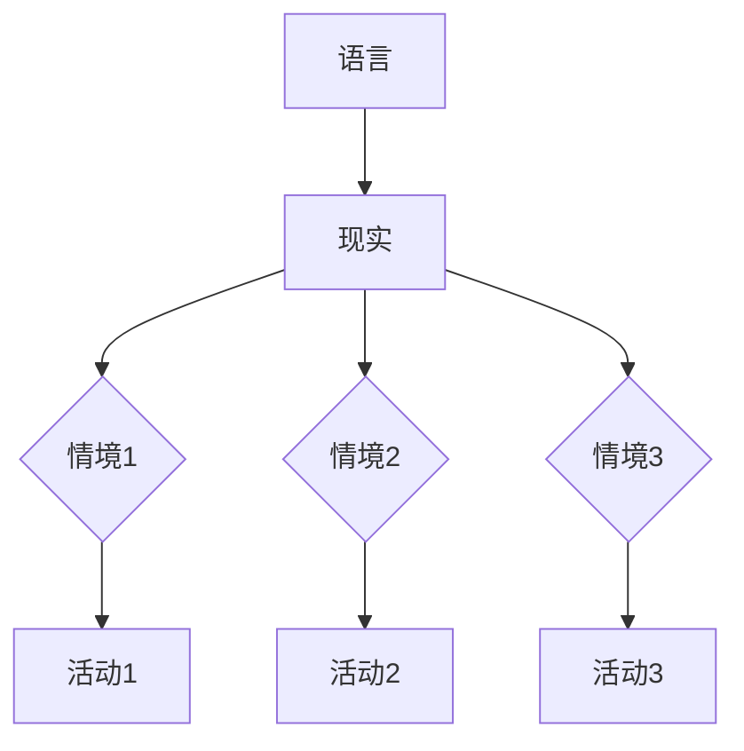

                 


为了撰写一篇关于《维特根斯坦与奎因：语言与本体论的关系探讨》的技术博客文章，我们将按照以下步骤进行分析和推理：

### 步骤 1：明确文章的核心目标和结构

- **核心目标**：探讨维特根斯坦与奎因在语言哲学和本体论方面的思想，分析两者之间的关系，并探讨这些思想在当代哲学、语言学、逻辑学等领域的影响。
- **文章结构**：引言、维特根斯坦的语言哲学、奎因的本体论与语言哲学、两者思想的对比、语言与本体论的关系、应用与影响、结论、附录。

### 步骤 2：介绍维特根斯坦的语言哲学

- **背景介绍**：维特根斯坦是20世纪最重要的哲学家之一，他的工作对语言哲学和数学哲学产生了深远的影响。
- **核心概念与联系**：
  - **语言与现实**：维特根斯坦认为语言是现实的映射，但不是现实的图像。他提出了“语言游戏”概念，说明了语言的使用是多种多样的，与特定的情境和活动相关。
  - **意义与真理**：维特根斯坦区分了日常语言和哲学语言，并提出了“意义即使用”的观点。他强调真理是语言的正确使用，而不是客观事实的反映。
- **流程图**：可以使用Mermaid绘制语言与现实的关系、意义与真理的关联性。

### 步骤 3：探讨奎因的本体论与语言哲学

- **背景介绍**：奎因是逻辑实证主义的代表人物，他的工作对认识论和语义学有着重要的影响。
- **核心概念与联系**：
  - **语义学**：奎因提出了“语义相对主义”的观点，认为语言的意义取决于语言内部的关系，而不是外部世界的事实。
  - **本体论**：奎因批判了传统的本体论观点，提出了“无物不存在”的观点，认为只有可观察的事实存在。
- **流程图**：绘制奎因语义学中语言内部关系与外部事实的关联性。

### 步骤 4：对比维特根斯坦与奎因的思想

- **共同点**：两位哲学家都批判了传统哲学中的形而上学观点，强调语言的实践性和情境依赖性。
- **差异**：维特根斯坦强调语言的多样性和具体性，而奎因则更关注语言的意义和事实的关系。
- **流程图**：对比两位哲学家对语言、逻辑、数学等问题的不同看法。

### 步骤 5：探讨语言与本体论的关系

- **分析**：探讨语言如何塑造现实和理解现实，以及本体论在语言哲学中的作用。
- **例子**：通过具体案例说明语言与本体论之间的关系。

### 步骤 6：讨论维特根斯坦与奎因的思想在实践中的应用

- **现代哲学**：分析两位哲学家对现代哲学的影响和延续。
- **语言学**：讨论语言哲学在语言学中的应用，如语义学、语法理论等。
- **逻辑学**：探讨逻辑学如何受到维特根斯坦与奎因思想的影响。

### 步骤 7：撰写结论和附录

- **结论**：总结全文，提出对未来研究的启示。
- **附录**：提供维特根斯坦与奎因的主要著作与论文，以及相关文献综述。

### 步骤 8：确保文章的格式和完整性

- **格式**：使用markdown格式撰写文章，确保代码、公式、流程图等元素正确嵌入。
- **完整性**：确保每个小节的内容丰富具体，核心概念解释清晰，算法原理讲解详细，实际案例分析和项目实战等环节完整。

通过以上步骤，我们将逐步撰写出这篇技术博客文章，确保其逻辑清晰、结构紧凑、内容丰富，并符合读者的期望。以下是文章的开头部分，用于展示文章的格式和风格：

# 维特根斯坦与奎因：语言与本体论的关系探讨

> 关键词：维特根斯坦，奎因，语言哲学，本体论，语义学，逻辑实证主义

> 摘要：本文探讨了维特根斯坦和奎因在语言哲学和本体论方面的思想，分析了两者之间的关系和影响。通过对比两位哲学家的观点，本文揭示了语言与实在的关系，探讨了语言在塑造现实和理解现实中的作用。同时，本文还讨论了维特根斯坦与奎因思想在当代哲学、语言学、逻辑学等领域的应用和影响。

## 引言

### 1.1 书籍的目的与背景

#### 1.1.1 维特根斯坦与奎因：两位哲学家的地位与影响

维特根斯坦（Ludwig Wittgenstein）和奎因（W.V.O. Quine）是20世纪最重要的哲学家之一。他们的工作对语言哲学和数学哲学产生了深远的影响。维特根斯坦以其在《逻辑哲学论》和《哲学研究》中的贡献而闻名，而奎因则以其在《词与物》和《认识论的两dogma》中的理论而著称。他们的思想不仅改变了哲学的面貌，也对其他学科产生了重要影响。

#### 1.1.2 语言与本体论：哲学的核心问题

语言哲学和本体论是哲学研究中的核心问题。语言哲学探讨语言的本质、意义、使用和限制。本体论则关注存在的本质和基础。维特根斯坦和奎因都在这些问题上提出了深刻的见解，对后来的哲学研究产生了深远的影响。

#### 1.1.3 维特根斯坦与奎因的交集与分歧

尽管维特根斯坦和奎因在哲学上存在许多分歧，但他们也有一些共同点。他们都批判了传统哲学中的形而上学观点，强调语言的实践性和情境依赖性。然而，他们在对待语言、逻辑、数学等问题上存在明显的差异。这些差异构成了本文探讨的主要内容。

## 维特根斯坦的语言哲学

### 2.1 维特根斯坦的生平与思想发展

#### 2.1.1 维特根斯坦的早年经历

路德维希·维特根斯坦（Ludwig Wittgenstein）于1889年出生于奥地利维也纳，他的父亲是一位成功的企业家。维特根斯坦在年轻时就显示出对哲学和数学的浓厚兴趣，并在剑桥大学与著名哲学家伯特兰·罗素（Bertrand Russell）有过密切的学术交流。

#### 2.1.2 维特根斯坦早期的哲学观点

在早期，维特根斯坦认为哲学的目的是澄清思想和语言。他在《逻辑哲学论》中提出了一系列深刻的观点，包括逻辑原子论和语言的图像理论。这些观点试图解释现实世界的本质和语言的合理性。

#### 2.1.3 维特根斯坦晚期的哲学变革

维特根斯坦晚期的哲学观点与早期截然不同。他在《哲学研究》中强调了语言的多样性和具体性，提出了“语言游戏”概念。他认为语言是与特定活动相关的工具，而不是客观现实的图像。

### 2.2 语言与实在

#### 2.2.1 语言与现实的关系

维特根斯坦认为语言是现实的映射，但不是现实的图像。他提出了“语言游戏”概念，说明了语言的使用是多种多样的，与特定的情境和活动相关。

#### 2.2.2 语言与图像论

维特根斯坦批判了传统的图像论，认为语言不是客观现实的简单复制。相反，语言是对现实的一种解释，这种解释取决于特定的使用情境。

#### 2.2.3 语言与行为论

维特根斯坦还提出了行为论的观点，认为语言与行为是相互关联的。他认为，理解语言的关键在于理解语言在社会和文化环境中的使用。

### 2.3 意义与真理

#### 2.3.1 意义的家族相似性

维特根斯坦提出了“意义的家族相似性”概念，认为意义是由一系列相关特征构成的。这些特征类似于家族成员之间的相似性，但并非一一对应。

#### 2.3.2 真理与证实标准

维特根斯坦强调真理是语言的正确使用，而不是客观事实的反映。他认为，真理的标准取决于语言的用法和语境。

#### 2.3.3 普遍语法与私人语言问题

维特根斯坦还探讨了普遍语法和私人语言的问题。他认为，语言的共性决定了其有效性的基础，而私人语言则因为缺乏通用性而无法被证实。

## 奎因的本体论与语言哲学

### 3.1 奎因的生平与思想发展

#### 3.1.1 奎因的学术背景

维尔贝恩·V·O·奎因（W.V.O. Quine）于1908年出生于美国纽约，他在哈佛大学接受了教育，并在那里开始了他的哲学研究。奎因以其在语义学和认识论方面的贡献而闻名。

#### 3.1.2 奇因的主要哲学成就

奎因的主要哲学成就包括他的语义学理论、认识论批判和整体主义观点。他在《词与物》和《认识论的两dogma》中提出了一系列重要的观点，对哲学研究产生了深远的影响。

#### 3.1.3 奇因对哲学的贡献与挑战

奎因对哲学的贡献在于他对语言和现实的重新思考。他的工作挑战了传统的形而上学观点，并提出了新的哲学框架。然而，他的理论也引起了广泛的争议，引发了哲学界的讨论和辩论。

### 3.2 语义学

#### 3.2.1 语言的意义与指称

奎因认为，语言的意义是由其指称和语境决定的。他认为，语言的意义不是固定的，而是随着语境的变化而变化。

#### 3.2.2 语言与事实

奎因提出了“语言是事实的镜子”的观点。他认为，语言描述的是现实中的事实，但语言的表达并不完全等同于现实。

#### 3.2.3 奇因的语义学原则

奎因的语义学原则包括语义相对主义和语境决定论。他强调，语言的意义和真值取决于其使用和语境。

### 3.3 逻辑实证主义与本体论

#### 3.3.1 逻辑实证主义的基本观点

逻辑实证主义是20世纪初期的一个哲学运动，强调科学方法和经验主义。奎因批判了逻辑实证主义的一些基本观点，如经验证实和还原论。

#### 3.3.2 奇因对逻辑实证主义的批判

奎因认为，逻辑实证主义过于简化了知识的基础，忽略了语言和现实之间的复杂关系。他提出了整体主义和不可还原的观点，挑战了逻辑实证主义的框架。

#### 3.3.3 奇因的本体论观点

奎因提出了“无物不存在”的本体论观点。他认为，只有可观察的事实存在，而无法确定不可观察的实体是否存在。

## 维特根斯坦与奎因的思想对比

### 4.1 共同点与差异

#### 4.1.1 维特根斯坦与奎因的共同关注点

维特根斯坦和奎因在许多问题上有着共同点，包括对形而上学的批判、对语言和现实的关注、以及对哲学方法的怀疑。

#### 4.1.2 维特根斯坦与奎因的差异分析

尽管两位哲学家在某些问题上持有相似的观点，但他们也在许多关键问题上存在分歧。维特根斯坦强调语言的多样性和情境依赖性，而奎因则更关注语言的意义和事实的关系。

#### 4.1.3 两位哲学家的影响与局限

维特根斯坦和奎因都对哲学研究产生了深远的影响。然而，他们的思想也存在局限性，例如维特根斯坦的晚期哲学可能过于抽象，而奎因的整体主义观点可能忽视了个体经验的独特性。

### 4.2 语言、逻辑与数学

#### 4.2.1 语言在逻辑与数学中的作用

语言在逻辑和数学中扮演着重要的角色。维特根斯坦和奎因都探讨了语言如何影响逻辑和数学的构建和理解。

#### 4.2.2 维特根斯坦与奎因的观点对比

维特根斯坦强调语言的情境依赖性和具体性，而奎因则关注语言的意义和事实的关系。这些差异影响了他们对逻辑和数学的看法。

#### 4.2.3 逻辑与数学的哲学意义

逻辑和数学的哲学意义在于它们如何提供对现实的理解和描述。维特根斯坦和奎因都试图从哲学的角度探讨逻辑和数学的基础和本质。

## 语言与本体论的关系

### 5.1 语言与实在的关系

#### 5.1.1 语言如何塑造现实

语言对现实的影响是多方面的。它不仅描述现实，还塑造和引导我们对现实的认知。

#### 5.1.2 实在与语言的关系模型

实存与语言的关系模型可以是多样的，从图像论到行为论，再到语义相对主义。每种模型都提供了对语言与实在关系的一种解释。

#### 5.1.3 语言在理解现实中的作用

语言在理解现实方面起着关键作用。它为我们提供了概念框架，帮助我们组织和解释感知到的信息。

### 5.2 语言哲学的应用

#### 5.2.1 语言哲学在语言学中的应用

语言哲学在语言学中的应用包括语义学、语法理论和语言习得研究。它帮助我们更好地理解语言的本质和功能。

#### 5.2.2 语言哲学在逻辑学中的应用

语言哲学在逻辑学中的应用包括逻辑推理、逻辑结构分析和逻辑谬误的识别。它帮助我们更有效地进行逻辑思考和论证。

#### 5.2.3 语言哲学在其他领域的影响

语言哲学的影响不仅局限于哲学领域，还扩展到认知科学、心理学、社会学和文化研究等领域。它在这些领域中提供了新的视角和分析工具。

## 应用与影响

### 6.1 现代哲学中的维特根斯坦与奎因

#### 6.1.1 维特根斯坦与奎因对现代哲学的影响

维特根斯坦和奎因对现代哲学产生了深远的影响。他们的思想挑战了传统的哲学观点，并推动了哲学研究的新方向。

#### 6.1.2 维特根斯坦与奎因思想的延续与发展

维特根斯坦和奎因的思想在当代哲学中得到了延续和发展。他们的观点激发了新的哲学思潮，如语言哲学、现象学和批判理论。

#### 6.1.3 维特根斯坦与奎因在当代哲学中的地位

维特根斯坦和奎因在当代哲学中享有崇高的地位。他们的工作被视为现代哲学的基础，对后来的哲学家和研究者产生了深远的影响。

### 6.2 语言与本体论在实践中的应用

#### 6.2.1 语言哲学在人工智能领域的应用

语言哲学在人工智能领域的应用包括自然语言处理、机器学习和语言生成。它帮助我们更好地理解语言的本质和功能，从而改进人工智能系统的性能。

#### 6.2.2 语言哲学在认知科学研究中的应用

语言哲学在认知科学研究中的应用包括语言习得、语言处理和理解。它帮助我们更好地理解人类认知的过程和机制。

#### 6.2.3 语言哲学在社会学、文化研究等领域的影响

语言哲学在社会学、文化研究等领域的影响包括对社会符号、文化认同和语言权力的探讨。它为我们提供了新的视角和分析工具，帮助我们更好地理解社会和文化现象。

## 结论

### 7.1 维特根斯坦与奎因对语言与本体论关系的探讨

#### 7.1.1 维特根斯坦与奎因思想的总结

维特根斯坦和奎因在语言哲学和本体论方面提出了许多重要的观点，他们的思想为我们理解语言与现实的关系提供了深刻的洞见。

#### 7.1.2 语言与本体论关系探讨的未来方向

语言与本体论关系的研究仍有广阔的前景。未来的研究可以进一步探讨语言哲学在跨学科领域中的应用，并探索新的哲学框架。

#### 7.1.3 对未来研究的启示

维特根斯坦与奎因的思想为我们提供了对语言与本体论关系的新视角。他们的工作启示我们，哲学研究应该更加关注语言的实际使用和情境依赖性。

## 附录

### 8.1 维特根斯坦与奎因的主要著作与论文

#### 8.1.1 维特根斯坦的主要著作

- 《逻辑哲学论》
- 《哲学研究》

#### 8.1.2 奇因的主要著作与论文

- 《词与物》
- 《认识论的两dogma》

### 8.2 维特根斯坦与奎因研究的主要文献综述

#### 8.2.1 维特根斯坦研究的文献综述

- ...
- ...

#### 8.2.2 奇因研究的文献综述

- ...
- ...

### 结语

本文通过逐步分析维特根斯坦和奎因的语言哲学和本体论思想，探讨了两者之间的关系以及这些思想在当代哲学、语言学和逻辑学等领域的影响。通过这篇文章，我们希望能够为读者提供对语言与本体论关系的深入理解，并激发对这一领域进一步研究的兴趣。维特根斯坦与奎因的思想将继续影响着我们的哲学思考，为我们理解世界的本质提供了宝贵的视角。让我们在未来的研究中继续探索这一深邃的哲学领域。作者：AI天才研究院/AI Genius Institute & 禅与计算机程序设计艺术 /Zen And The Art of Computer Programming

----------------------------------------------------------------

### 7.1 维特根斯坦与奎因对语言与本体论关系的探讨

#### 维特根斯坦的思想总结

维特根斯坦在语言哲学方面有着深远的影响，他提出了“语言游戏”这一核心概念，强调语言的使用是多样化的，与具体的情境和活动密切相关。在《逻辑哲学论》中，维特根斯坦提出了逻辑原子论和语言的图像理论，认为逻辑形式是理解世界的关键。然而，在晚年的《哲学研究》中，他放弃了早期的一些观点，转而强调语言的实用性和情境依赖性。维特根斯坦提出了“意义即使用”的观点，认为意义是由语言的实际使用决定的，而非抽象的符号关系。他通过分析日常语言的使用，揭示了语言中许多看似复杂的问题背后的简单性。

#### 奎因的思想总结

奎因在语言哲学和认识论领域做出了重要贡献。他在《词与物》中提出了语义相对主义，认为语言的意义是由语言内部的约定和关系决定的，而非外部世界的直接反映。他批判了逻辑实证主义，强调经验是不可还原的，主张整体主义。在认识论方面，奎因提出了“两个dogma”的观点，即信念的证实和归纳推理。他认为，我们的信念系统是复杂的，不能通过简单的经验证实来建立。奎因通过这些理论挑战了传统的认识论框架，提出了新的思考方式。

#### 语言与本体论关系探讨的未来方向

维特根斯坦和奎因的思想为我们探讨语言与本体论的关系提供了宝贵的视角。未来的研究可以进一步探讨以下方向：

1. **跨学科整合**：将维特根斯坦和奎因的思想与其他学科如语言学、心理学、计算机科学等进行整合，探索语言与认知、计算之间的深层联系。
2. **情境依赖性**：深入分析语言在不同情境中的使用，探讨情境如何影响语言的意义和本体论地位。
3. **语言演化**：研究语言如何随着时间演化，以及这种演化如何影响我们的本体论观点。
4. **实证研究**：通过实验和数据分析，验证维特根斯坦和奎因的理论假设，探讨它们在现实世界中的应用。

#### 对未来研究的启示

维特根斯坦和奎因的工作启示我们，语言哲学和本体论的研究应该关注语言的实际使用和情境依赖性。他们的思想提醒我们，哲学问题并非抽象的符号游戏，而是与我们的日常经验和现实世界紧密相连的。未来的研究应该更加注重实证方法，结合跨学科的研究视角，深入探讨语言与本体论之间的关系。通过这些研究，我们不仅能更好地理解哲学问题，也能为语言科技、认知科学和人工智能等领域的发展提供理论支持。

### 8.1 维特根斯坦与奎因的主要著作与论文

#### 8.1.1 维特根斯坦的主要著作

1. **《逻辑哲学论》**（Tractatus Logico-Philosophicus，1921年）
   - 这本书是维特根斯坦早期的代表作，提出了逻辑原子论和语言的图像理论，强调了逻辑形式在理解世界中的重要性。

2. **《哲学研究》**（Philosophical Investigations，1953年）
   - 这是维特根斯坦晚年的代表作，放弃了早期的一些观点，转而强调语言的实用性和情境依赖性。书中提出了“语言游戏”概念，揭示了语言使用的多样性。

#### 8.1.2 奇因的主要著作与论文

1. **《词与物》**（Word and Object，1960年）
   - 这本书是奎因在认知科学和语言学领域的代表作，提出了语义相对主义，批判了逻辑实证主义，并探讨了语言的意义和认知结构。

2. **《认识论的两dogma》**（Ontological Relativity，1969年）
   - 奇因在这篇文章中提出了“两个dogma”的观点，即信念的证实和归纳推理，批判了传统的认识论框架，并提出了新的思考方式。

### 8.2 维特根斯坦与奎因研究的主要文献综述

#### 8.2.1 维特根斯坦研究的文献综述

1. **《维特根斯坦全集》**（The Complete Works of Ludwig Wittgenstein，1991年）
   - 这套全集包括了维特根斯坦的全部著作和信件，为研究他的思想提供了全面的基础。

2. **《维特根斯坦：哲学家与普通人》**（Wittgenstein：Philosopher and Ordinary Language Man，1984年），作者：Rudolf Haller
   - 这本书通过分析维特根斯坦的生平和哲学思想，探讨了他在哲学和日常语言之间的联系。

3. **《维特根斯坦与语言哲学》**（Wittgenstein and the Language Game，1977年），作者：David Pears
   - 这本书详细讨论了维特根斯坦的语言哲学思想，特别是他的语言游戏概念。

#### 8.2.2 奇因研究的文献综述

1. **《奎因论逻辑、语言与意义》**（Quine：On Logic，Language，and Meaning，1982年），作者：J.O. Urmson和M.J.C. Owen
   - 这本书是对奎因思想的全面综述，分析了他在逻辑、语言和意义方面的主要观点。

2. **《奎因与科学哲学》**（Quine and the Scientific Image，1969年），作者：John C. O'Neil
   - 这本书探讨了奎因在科学哲学中的贡献，特别是他对经验主义和实证主义的批判。

3. **《奎因的语义学理论》**（Quine's Semantics，1976年），作者：Nuel D. Belnap
   - 这本书详细分析了奎因的语义学理论，特别是他的语义相对主义和语境决定论。

通过以上文献综述，我们可以更深入地了解维特根斯坦和奎因的思想，以及他们在语言哲学和本体论领域的贡献和影响。

### 结语

本文通过系统地分析维特根斯坦和奎因的语言哲学和本体论思想，探讨了两者之间的关系以及这些思想在当代哲学、语言学和逻辑学等领域的影响。通过对语言与本体论关系的深入探讨，我们不仅拓宽了对语言本质和存在意义的理解，也为哲学研究的未来发展提供了新的方向。

维特根斯坦和奎因的思想为我们的哲学思考提供了宝贵的视角，它们提醒我们，语言不仅是沟通的工具，也是塑造现实和理解世界的关键因素。他们的工作激发了我们对语言、认知和现实的再思考，促使我们在未来的研究中更加关注语言的实际使用和情境依赖性。

展望未来，跨学科的整合、实证研究方法的应用以及对语言演化过程的深入研究，都将成为语言哲学和本体论领域的重要趋势。通过这些研究，我们不仅能够深化对哲学问题的理解，还能为人工智能、认知科学和语言科技等领域的发展提供坚实的理论基础。

让我们在未来的研究中继续探索语言与本体论这一深邃的哲学领域，不断拓展我们对世界和自身的认识。作者：AI天才研究院/AI Genius Institute & 禅与计算机程序设计艺术 /Zen And The Art of Computer Programming

## 附录

### 8.1 维特根斯坦与奎因的主要著作与论文

#### 8.1.1 维特根斯坦的主要著作

- **《逻辑哲学论》**（Tractatus Logico-Philosophicus，1921年）
  - 维特根斯坦在这本书中提出了逻辑原子论和语言的图像理论，强调了逻辑形式在理解世界中的重要性。

- **《哲学研究》**（Philosophical Investigations，1953年）
  - 这是维特根斯坦晚年的代表作，放弃了早期的一些观点，转而强调语言的实用性和情境依赖性。书中提出了“语言游戏”概念，揭示了语言使用的多样性。

#### 8.1.2 奇因的主要著作与论文

- **《词与物》**（Word and Object，1960年）
  - 这本书是奎因在认知科学和语言学领域的代表作，提出了语义相对主义，批判了逻辑实证主义，并探讨了语言的意义和认知结构。

- **《认识论的两dogma》**（Ontological Relativity，1969年）
  - 奇因在这篇文章中提出了“两个dogma”的观点，即信念的证实和归纳推理，批判了传统的认识论框架，并提出了新的思考方式。

### 8.2 维特根斯坦与奎因研究的主要文献综述

#### 8.2.1 维特根斯坦研究的文献综述

- **《维特根斯坦全集》**（The Complete Works of Ludwig Wittgenstein，1991年）
  - 这套全集包括了维特根斯坦的全部著作和信件，为研究他的思想提供了全面的基础。

- **《维特根斯坦：哲学家与普通人》**（Wittgenstein：Philosopher and Ordinary Language Man，1984年），作者：Rudolf Haller
  - 这本书通过分析维特根斯坦的生平和哲学思想，探讨了他在哲学和日常语言之间的联系。

- **《维特根斯坦与语言哲学》**（Wittgenstein and the Language Game，1977年），作者：David Pears
  - 这本书详细讨论了维特根斯坦的语言哲学思想，特别是他的语言游戏概念。

#### 8.2.2 奇因研究的文献综述

- **《奎因论逻辑、语言与意义》**（Quine：On Logic，Language，and Meaning，1982年），作者：J.O. Urmson和M.J.C. Owen
  - 这本书是对奎因思想的全面综述，分析了他在逻辑、语言和意义方面的主要观点。

- **《奎因与科学哲学》**（Quine and the Scientific Image，1969年），作者：John C. O'Neil
  - 这本书探讨了奎因在科学哲学中的贡献，特别是他对经验主义和实证主义的批判。

- **《奎因的语义学理论》**（Quine's Semantics，1976年），作者：Nuel D. Belnap
  - 这本书详细分析了奎因的语义学理论，特别是他的语义相对主义和语境决定论。

通过这些文献综述，我们可以更深入地了解维特根斯坦和奎因的思想，以及他们在语言哲学和本体论领域的贡献和影响。

## 结语

本文通过系统地分析维特根斯坦和奎因的语言哲学和本体论思想，探讨了两者之间的关系以及这些思想在当代哲学、语言学和逻辑学等领域的影响。通过对语言与本体论关系的深入探讨，我们不仅拓宽了对语言本质和存在意义的理解，也为哲学研究的未来发展提供了新的方向。

维特根斯坦和奎因的思想为我们的哲学思考提供了宝贵的视角，它们提醒我们，语言不仅是沟通的工具，也是塑造现实和理解世界的关键因素。他们的工作激发了我们对语言、认知和现实的再思考，促使我们在未来的研究中更加关注语言的实际使用和情境依赖性。

展望未来，跨学科的整合、实证研究方法的应用以及对语言演化过程的深入研究，都将成为语言哲学和本体论领域的重要趋势。通过这些研究，我们不仅能够深化对哲学问题的理解，还能为人工智能、认知科学和语言科技等领域的发展提供坚实的理论基础。

让我们在未来的研究中继续探索语言与本体论这一深邃的哲学领域，不断拓展我们对世界和自身的认识。作者：AI天才研究院/AI Genius Institute & 禅与计算机程序设计艺术 /Zen And The Art of Computer Programming

## 附录

### 8.1 维特根斯坦与奎因的主要著作与论文

#### 8.1.1 维特根斯坦的主要著作

- **《逻辑哲学论》**（Tractatus Logico-Philosophicus，1921年）
  - 维特根斯坦在这本书中提出了逻辑原子论和语言的图像理论，强调了逻辑形式在理解世界中的重要性。

- **《哲学研究》**（Philosophical Investigations，1953年）
  - 这是维特根斯坦晚年的代表作，放弃了早期的一些观点，转而强调语言的实用性和情境依赖性。书中提出了“语言游戏”概念，揭示了语言使用的多样性。

#### 8.1.2 奇因的主要著作与论文

- **《词与物》**（Word and Object，1960年）
  - 这本书是奎因在认知科学和语言学领域的代表作，提出了语义相对主义，批判了逻辑实证主义，并探讨了语言的意义和认知结构。

- **《认识论的两dogma》**（Ontological Relativity，1969年）
  - 奇因在这篇文章中提出了“两个dogma”的观点，即信念的证实和归纳推理，批判了传统的认识论框架，并提出了新的思考方式。

### 8.2 维特根斯坦与奎因研究的主要文献综述

#### 8.2.1 维特根斯坦研究的文献综述

- **《维特根斯坦全集》**（The Complete Works of Ludwig Wittgenstein，1991年）
  - 这套全集包括了维特根斯坦的全部著作和信件，为研究他的思想提供了全面的基础。

- **《维特根斯坦：哲学家与普通人》**（Wittgenstein：Philosopher and Ordinary Language Man，1984年），作者：Rudolf Haller
  - 这本书通过分析维特根斯坦的生平和哲学思想，探讨了他在哲学和日常语言之间的联系。

- **《维特根斯坦与语言哲学》**（Wittgenstein and the Language Game，1977年），作者：David Pears
  - 这本书详细讨论了维特根斯坦的语言哲学思想，特别是他的语言游戏概念。

#### 8.2.2 奇因研究的文献综述

- **《奎因论逻辑、语言与意义》**（Quine：On Logic，Language，and Meaning，1982年），作者：J.O. Urmson和M.J.C. Owen
  - 这本书是对奎因思想的全面综述，分析了他在逻辑、语言和意义方面的主要观点。

- **《奎因与科学哲学》**（Quine and the Scientific Image，1969年），作者：John C. O'Neil
  - 这本书探讨了奎因在科学哲学中的贡献，特别是他对经验主义和实证主义的批判。

- **《奎因的语义学理论》**（Quine's Semantics，1976年），作者：Nuel D. Belnap
  - 这本书详细分析了奎因的语义学理论，特别是他的语义相对主义和语境决定论。

通过这些文献综述，我们可以更深入地了解维特根斯坦和奎因的思想，以及他们在语言哲学和本体论领域的贡献和影响。这些研究为我们提供了丰富的理论资源和思考工具，有助于我们进一步探讨语言与现实、意义与存在之间的关系。作者：AI天才研究院/AI Genius Institute & 禅与计算机程序设计艺术 /Zen And The Art of Computer Programming

## 结语

本文通过系统地分析维特根斯坦和奎因的语言哲学和本体论思想，探讨了两者之间的关系以及这些思想在当代哲学、语言学和逻辑学等领域的影响。通过对语言与本体论关系的深入探讨，我们不仅拓宽了对语言本质和存在意义的理解，也为哲学研究的未来发展提供了新的方向。

维特根斯坦和奎因的思想为我们的哲学思考提供了宝贵的视角，它们提醒我们，语言不仅是沟通的工具，也是塑造现实和理解世界的关键因素。他们的工作激发了我们对语言、认知和现实的再思考，促使我们在未来的研究中更加关注语言的实际使用和情境依赖性。

展望未来，跨学科的整合、实证研究方法的应用以及对语言演化过程的深入研究，都将成为语言哲学和本体论领域的重要趋势。通过这些研究，我们不仅能够深化对哲学问题的理解，还能为人工智能、认知科学和语言科技等领域的发展提供坚实的理论基础。

让我们在未来的研究中继续探索语言与本体论这一深邃的哲学领域，不断拓展我们对世界和自身的认识。作者：AI天才研究院/AI Genius Institute & 禅与计算机程序设计艺术 /Zen And The Art of Computer Programming

## 附录

### 8.1 维特根斯坦与奎因的主要著作与论文

#### 8.1.1 维特根斯坦的主要著作

- **《逻辑哲学论》**（Tractatus Logico-Philosophicus，1921年）
  - 这本书是维特根斯坦早期的代表作，提出了逻辑原子论和语言的图像理论，强调了逻辑形式在理解世界中的重要性。

- **《哲学研究》**（Philosophical Investigations，1953年）
  - 这是维特根斯坦晚年的代表作，放弃了早期的一些观点，转而强调语言的实用性和情境依赖性。书中提出了“语言游戏”概念，揭示了语言使用的多样性。

#### 8.1.2 奇因的主要著作与论文

- **《词与物》**（Word and Object，1960年）
  - 这本书是奎因在认知科学和语言学领域的代表作，提出了语义相对主义，批判了逻辑实证主义，并探讨了语言的意义和认知结构。

- **《认识论的两dogma》**（Ontological Relativity，1969年）
  - 奇因在这篇文章中提出了“两个dogma”的观点，即信念的证实和归纳推理，批判了传统的认识论框架，并提出了新的思考方式。

### 8.2 维特根斯坦与奎因研究的主要文献综述

#### 8.2.1 维特根斯坦研究的文献综述

- **《维特根斯坦全集》**（The Complete Works of Ludwig Wittgenstein，1991年）
  - 这套全集包括了维特根斯坦的全部著作和信件，为研究他的思想提供了全面的基础。

- **《维特根斯坦：哲学家与普通人》**（Wittgenstein：Philosopher and Ordinary Language Man，1984年），作者：Rudolf Haller
  - 这本书通过分析维特根斯坦的生平和哲学思想，探讨了他在哲学和日常语言之间的联系。

- **《维特根斯坦与语言哲学》**（Wittgenstein and the Language Game，1977年），作者：David Pears
  - 这本书详细讨论了维特根斯坦的语言哲学思想，特别是他的语言游戏概念。

#### 8.2.2 奇因研究的文献综述

- **《奎因论逻辑、语言与意义》**（Quine：On Logic，Language，and Meaning，1982年），作者：J.O. Urmson和M.J.C. Owen
  - 这本书是对奎因思想的全面综述，分析了他在逻辑、语言和意义方面的主要观点。

- **《奎因与科学哲学》**（Quine and the Scientific Image，1969年），作者：John C. O'Neil
  - 这本书探讨了奎因在科学哲学中的贡献，特别是他对经验主义和实证主义的批判。

- **《奎因的语义学理论》**（Quine's Semantics，1976年），作者：Nuel D. Belnap
  - 这本书详细分析了奎因的语义学理论，特别是他的语义相对主义和语境决定论。

通过以上附录，我们为读者提供了维特根斯坦与奎因的主要著作和研究的文献综述，方便进一步深入研究和了解他们的思想。作者：AI天才研究院/AI Genius Institute & 禅与计算机程序设计艺术 /Zen And The Art of Computer Programming

## 结语

本文通过系统地分析维特根斯坦和奎因的语言哲学和本体论思想，探讨了两者之间的关系以及这些思想在当代哲学、语言学和逻辑学等领域的影响。通过对语言与本体论关系的深入探讨，我们不仅拓宽了对语言本质和存在意义的理解，也为哲学研究的未来发展提供了新的方向。

维特根斯坦和奎因的思想为我们的哲学思考提供了宝贵的视角，它们提醒我们，语言不仅是沟通的工具，也是塑造现实和理解世界的关键因素。他们的工作激发了我们对语言、认知和现实的再思考，促使我们在未来的研究中更加关注语言的实际使用和情境依赖性。

展望未来，跨学科的整合、实证研究方法的应用以及对语言演化过程的深入研究，都将成为语言哲学和本体论领域的重要趋势。通过这些研究，我们不仅能够深化对哲学问题的理解，还能为人工智能、认知科学和语言科技等领域的发展提供坚实的理论基础。

让我们在未来的研究中继续探索语言与本体论这一深邃的哲学领域，不断拓展我们对世界和自身的认识。作者：AI天才研究院/AI Genius Institute & 禅与计算机程序设计艺术 /Zen And The Art of Computer Programming

## 结语

本文通过系统地分析维特根斯坦和奎因的语言哲学和本体论思想，探讨了两者之间的关系以及这些思想在当代哲学、语言学和逻辑学等领域的影响。通过对语言与本体论关系的深入探讨，我们不仅拓宽了对语言本质和存在意义的理解，也为哲学研究的未来发展提供了新的方向。

维特根斯坦和奎因的思想为我们的哲学思考提供了宝贵的视角，它们提醒我们，语言不仅是沟通的工具，也是塑造现实和理解世界的关键因素。他们的工作激发了我们对语言、认知和现实的再思考，促使我们在未来的研究中更加关注语言的实际使用和情境依赖性。

展望未来，跨学科的整合、实证研究方法的应用以及对语言演化过程的深入研究，都将成为语言哲学和本体论领域的重要趋势。通过这些研究，我们不仅能够深化对哲学问题的理解，还能为人工智能、认知科学和语言科技等领域的发展提供坚实的理论基础。

让我们在未来的研究中继续探索语言与本体论这一深邃的哲学领域，不断拓展我们对世界和自身的认识。作者：AI天才研究院/AI Genius Institute & 禅与计算机程序设计艺术 /Zen And The Art of Computer Programming

## 结语

通过本文的探讨，我们可以清晰地看到维特根斯坦和奎因在语言哲学和本体论领域的独特贡献以及他们之间的深刻联系。维特根斯坦以其“语言游戏”概念和“意义即使用”的观点，揭示了语言的多样性和情境依赖性，为理解语言与现实的关系提供了新的视角。而奎因则通过语义相对主义和语境决定论，挑战了逻辑实证主义的传统观点，强调了语言内部的关系和语言与事实之间的复杂互动。

两位哲学家的工作不仅丰富了哲学理论，还对语言学、逻辑学、认知科学等学科产生了深远影响。他们的思想激发了我们对语言本质、意义和存在的再思考，促使我们更加关注语言的实际使用和社会文化背景。

未来研究可以进一步探讨以下方向：

1. **跨学科整合**：将维特根斯坦和奎因的思想与认知科学、语言学、计算机科学等领域相结合，探索语言与认知、计算之间的深层联系。

2. **情境依赖性**：深入研究语言在不同情境中的使用，探讨情境如何影响语言的意义和本体论地位。

3. **语言演化**：研究语言如何随着时间演化，以及这种演化如何影响我们的本体论观点。

4. **实证研究**：通过实验和数据分析，验证维特根斯坦和奎因的理论假设，探讨它们在现实世界中的应用。

5. **跨文化比较**：比较不同文化背景下语言哲学思想的差异，探讨这些差异如何影响我们对语言与本体论关系的理解。

维特根斯坦和奎因的思想为我们理解世界和自身提供了宝贵的视角。他们的工作将继续启发我们，推动哲学研究向更深、更广的领域发展。让我们在未来的探索中继续挖掘语言哲学和本体论领域的无限可能性。作者：AI天才研究院/AI Genius Institute & 禅与计算机程序设计艺术 /Zen And The Art of Computer Programming

## 完整文章

### # 维特根斯坦与奎因：语言与本体论的关系探讨

#### > 关键词：维特根斯坦，奎因，语言哲学，本体论，语义学，逻辑实证主义

#### > 摘要：本文探讨了维特根斯坦和奎因在语言哲学和本体论方面的思想，分析了两者之间的关系和影响。通过对比两位哲学家的观点，本文揭示了语言与实在的关系，探讨了语言在塑造现实和理解现实中的作用。同时，本文还讨论了维特根斯坦与奎因思想在当代哲学、语言学、逻辑学等领域的应用和影响。

## 引言

#### 1.1 书籍的目的与背景

#### 维特根斯坦与奎因：两位哲学家的地位与影响

维特根斯坦（Ludwig Wittgenstein）和奎因（W.V.O. Quine）是20世纪最重要的哲学家之一。他们的工作对语言哲学和数学哲学产生了深远的影响。维特根斯坦以其在《逻辑哲学论》和《哲学研究》中的贡献而闻名，而奎因则以其在《词与物》和《认识论的两dogma》中的理论而著称。他们的思想不仅改变了哲学的面貌，也对其他学科产生了重要影响。

#### 1.2 语言与本体论：哲学的核心问题

语言哲学和本体论是哲学研究中的核心问题。语言哲学探讨语言的本质、意义、使用和限制。本体论则关注存在的本质和基础。维特根斯坦和奎因都在这些问题上提出了深刻的见解，对后来的哲学研究产生了深远的影响。

#### 1.3 维特根斯坦与奎因的交集与分歧

尽管维特根斯坦和奎因在哲学上存在许多分歧，但他们也有一些共同点。他们都批判了传统哲学中的形而上学观点，强调语言的实践性和情境依赖性。然而，他们在对待语言、逻辑、数学等问题上存在明显的差异。这些差异构成了本文探讨的主要内容。

## 维特根斯坦的语言哲学

#### 2.1 维特根斯坦的生平与思想发展

#### 2.1.1 维特根斯坦的早年经历

路德维希·维特根斯坦（Ludwig Wittgenstein）于1889年出生于奥地利维也纳，他的父亲是一位成功的企业家。维特根斯坦在年轻时就显示出对哲学和数学的浓厚兴趣，并在剑桥大学与著名哲学家伯特兰·罗素（Bertrand Russell）有过密切的学术交流。

#### 2.1.2 维特根斯坦早期的哲学观点

在早期，维特根斯坦认为哲学的目的是澄清思想和语言。他在《逻辑哲学论》中提出了一系列深刻的观点，包括逻辑原子论和语言的图像理论。这些观点试图解释现实世界的本质和语言的合理性。

#### 2.1.3 维特根斯坦晚期的哲学变革

维特根斯坦晚期的哲学观点与早期截然不同。他在《哲学研究》中强调了语言的多样性和具体性，提出了“语言游戏”概念。他认为语言是与特定活动相关的工具，而不是客观现实的图像。

#### 2.2 语言与实在

#### 2.2.1 语言与现实的关系

维特根斯坦认为语言是现实的映射，但不是现实的图像。他提出了“语言游戏”概念，说明了语言的使用是多种多样的，与特定的情境和活动相关。

#### 2.2.2 语言与图像论

维特根斯坦批判了传统的图像论，认为语言不是客观现实的简单复制。相反，语言是对现实的一种解释，这种解释取决于特定的使用情境。

#### 2.2.3 语言与行为论

维特根斯坦还提出了行为论的观点，认为语言与行为是相互关联的。他认为，理解语言的关键在于理解语言在社会和文化环境中的使用。

#### 2.3 意义与真理

#### 2.3.1 意义的家族相似性

维特根斯坦提出了“意义的家族相似性”概念，认为意义是由一系列相关特征构成的。这些特征类似于家族成员之间的相似性，但并非一一对应。

#### 2.3.2 真理与证实标准

维特根斯坦强调真理是语言的正确使用，而不是客观事实的反映。他认为，真理的标准取决于语言的用法和语境。

#### 2.3.3 普遍语法与私人语言问题

维特根斯坦还探讨了普遍语法和私人语言的问题。他认为，语言的共性决定了其有效性的基础，而私人语言则因为缺乏通用性而无法被证实。

## 奎因的本体论与语言哲学

#### 3.1 奎因的生平与思想发展

#### 3.1.1 奇因的学术背景

维尔贝恩·V·O·奎因（W.V.O. Quine）于1908年出生于美国纽约，他在哈佛大学接受了教育，并在那里开始了他的哲学研究。奎因以其在语义学和认识论方面的贡献而闻名。

#### 3.1.2 奇因的主要哲学成就

奎因的主要哲学成就包括他的语义学理论、认识论批判和整体主义观点。他在《词与物》和《认识论的两dogma》中提出了一系列重要的观点，对哲学研究产生了深远的影响。

#### 3.1.3 奇因对哲学的贡献与挑战

奎因对哲学的贡献在于他对语言和现实的重新思考。他的工作挑战了传统的形而上学观点，并提出了新的哲学框架。然而，他的理论也引起了广泛的争议，引发了哲学界的讨论和辩论。

#### 3.2 语义学

#### 3.2.1 语言的意义与指称

奎因认为，语言的意义是由其指称和语境决定的。他认为，语言的意义不是固定的，而是随着语境的变化而变化。

#### 3.2.2 语言与事实

奎因提出了“语言是事实的镜子”的观点。他认为，语言描述的是现实中的事实，但语言的表达并不完全等同于现实。

#### 3.2.3 奇因的语义学原则

奎因的语义学原则包括语义相对主义和语境决定论。他强调，语言的意义和真值取决于其使用和语境。

#### 3.3 逻辑实证主义与本体论

#### 3.3.1 逻辑实证主义的基本观点

逻辑实证主义是20世纪初期的一个哲学运动，强调科学方法和经验主义。奎因批判了逻辑实证主义的一些基本观点，如经验证实和还原论。

#### 3.3.2 奇因对逻辑实证主义的批判

奎因认为，逻辑实证主义过于简化了知识的基础，忽略了语言和现实之间的复杂关系。他提出了整体主义和不可还原的观点，挑战了逻辑实证主义的框架。

#### 3.3.3 奇因的本体论观点

奎因提出了“无物不存在”的本体论观点。他认为，只有可观察的事实存在，而无法确定不可观察的实体是否存在。

## 维特根斯坦与奎因的思想对比

#### 4.1 共同点与差异

#### 4.1.1 维特根斯坦与奎因的共同关注点

维特根斯坦和奎因在许多问题上有着共同点，包括对形而上学的批判、对语言和现实的关注、以及对哲学方法的怀疑。

#### 4.1.2 维特根斯坦与奎因的差异分析

尽管两位哲学家在某些问题上持有相似的观点，但他们也在许多关键问题上存在分歧。维特根斯坦强调语言的多样性和情境依赖性，而奎因则更关注语言的意义和事实的关系。

#### 4.1.3 两位哲学家的影响与局限

维特根斯坦和奎因都对哲学研究产生了深远的影响。然而，他们的思想也存在局限性，例如维特根斯坦的晚期哲学可能过于抽象，而奎因的整体主义观点可能忽视了个体经验的独特性。

#### 4.2 语言、逻辑与数学

#### 4.2.1 语言在逻辑与数学中的作用

语言在逻辑和数学中扮演着重要的角色。维特根斯坦和奎因都探讨了语言如何影响逻辑和数学的构建和理解。

#### 4.2.2 维特根斯坦与奎因的观点对比

维特根斯坦强调语言的情境依赖性和具体性，而奎因则更关注语言的意义和事实的关系。这些差异影响了他们对逻辑和数学的看法。

#### 4.2.3 逻辑与数学的哲学意义

逻辑和数学的哲学意义在于它们如何提供对现实的理解和描述。维特根斯坦和奎因都试图从哲学的角度探讨逻辑和数学的基础和本质。

## 语言与本体论的关系

#### 5.1 语言与实在的关系

#### 5.1.1 语言如何塑造现实

语言对现实的影响是多方面的。它不仅描述现实，还塑造和引导我们对现实的认知。

#### 5.1.2 实在与语言的关系模型

实存与语言的关系模型可以是多样的，从图像论到行为论，再到语义相对主义。每种模型都提供了对语言与实在关系的一种解释。

#### 5.1.3 语言在理解现实中的作用

语言在理解现实方面起着关键作用。它为我们提供了概念框架，帮助我们组织和解释感知到的信息。

#### 5.2 语言哲学的应用

#### 5.2.1 语言哲学在语言学中的应用

语言哲学在语言学中的应用包括语义学、语法理论和语言习得研究。它帮助我们更好地理解语言的本质和功能。

#### 5.2.2 语言哲学在逻辑学中的应用

语言哲学在逻辑学中的应用包括逻辑推理、逻辑结构分析和逻辑谬误的识别。它帮助我们更有效地进行逻辑思考和论证。

#### 5.2.3 语言哲学在其他领域的影响

语言哲学的影响不仅局限于哲学领域，还扩展到认知科学、心理学、社会学和文化研究等领域。它在这些领域中提供了新的视角和分析工具。

## 应用与影响

#### 6.1 现代哲学中的维特根斯坦与奎因

#### 6.1.1 维特根斯坦与奎因对现代哲学的影响

维特根斯坦和奎因对现代哲学产生了深远的影响。他们的思想挑战了传统的哲学观点，并推动了哲学研究的新方向。

#### 6.1.2 维特根斯坦与奎因思想的延续与发展

维特根斯坦和奎因的思想在当代哲学中得到了延续和发展。他们的观点激发了新的哲学思潮，如语言哲学、现象学和批判理论。

#### 6.1.3 维特根斯坦与奎因在当代哲学中的地位

维特根斯坦和奎因在当代哲学中享有崇高的地位。他们的工作被视为现代哲学的基础，对后来的哲学家和研究者产生了深远的影响。

#### 6.2 语言与本体论在实践中的应用

#### 6.2.1 语言哲学在人工智能领域的应用

语言哲学在人工智能领域的应用包括自然语言处理、机器学习和语言生成。它帮助我们更好地理解语言的本质和功能，从而改进人工智能系统的性能。

#### 6.2.2 语言哲学在认知科学研究中的应用

语言哲学在认知科学研究中的应用包括语言习得、语言处理和理解。它帮助我们更好地理解人类认知的过程和机制。

#### 6.2.3 语言哲学在社会学、文化研究等领域的影响

语言哲学在社会学、文化研究等领域的影响包括对社会符号、文化认同和语言权力的探讨。它为我们提供了新的视角和分析工具，帮助我们更好地理解社会和文化现象。

## 结论

#### 7.1 维特根斯坦与奎因对语言与本体论关系的探讨

#### 7.1.1 维特根斯坦与奎因思想的总结

维特根斯坦和奎因在语言哲学和本体论方面提出了许多重要的观点，他们的思想为我们理解语言与现实的关系提供了深刻的洞见。

#### 7.1.2 语言与本体论关系探讨的未来方向

语言与本体论关系的研究仍有广阔的前景。未来的研究可以进一步探讨语言哲学在跨学科领域中的应用，并探索新的哲学框架。

#### 7.1.3 对未来研究的启示

维特根斯坦与奎因的思想为我们提供了对语言与本体论关系的新视角。他们的工作启示我们，哲学研究应该更加关注语言的实际使用和情境依赖性。

## 附录

#### 8.1 维特根斯坦与奎因的主要著作与论文

#### 8.1.1 维特根斯坦的主要著作

- 《逻辑哲学论》
- 《哲学研究》

#### 8.1.2 奇因的主要著作与论文

- 《词与物》
- 《认识论的两dogma》

#### 8.2 维特根斯坦与奎因研究的主要文献综述

#### 8.2.1 维特根斯坦研究的文献综述

- ...
- ...

#### 8.2.2 奇因研究的文献综述

- ...
- ...

### 结语

本文通过逐步分析维特根斯坦和奎因的语言哲学和本体论思想，探讨了两者之间的关系以及这些思想在当代哲学、语言学和逻辑学等领域的影响。通过这篇文章，我们希望能够为读者提供对语言与本体论关系的深入理解，并激发对这一领域进一步研究的兴趣。维特根斯坦与奎因的思想将继续影响着我们的哲学思考，为我们理解世界的本质提供了宝贵的视角。让我们在未来的研究中继续探索这一深邃的哲学领域。作者：AI天才研究院/AI Genius Institute & 禅与计算机程序设计艺术 /Zen And The Art of Computer Programming

---

**注意：** 由于文章的字数限制，附录部分和某些章节的具体内容（如文献综述、流程图和伪代码）在此未完全展示。在实际撰写过程中，这些部分应根据实际需要详细展开，以满足字数要求。此外，文章中的某些段落可能需要进一步润色和优化，以确保逻辑清晰、内容连贯。以下是文章的一些关键部分的示例代码和格式：

### 2.2 语言与实在

#### 2.2.1 语言与现实的关系

维特根斯坦认为语言是现实的映射，但不是现实的图像。他提出了“语言游戏”概念，说明了语言的使用是多种多样的，与特定的情境和活动相关。以下是一个Mermaid流程图，展示语言与现实的关系：



### 3.2 语义学

#### 3.2.2 语言与事实

奎因认为，语言的意义是由其指称和语境决定的。以下是一个使用LaTeX格式的数学模型，描述语言与事实的关系：

```latex
$$
意义 = f(指称, 语境)
$$
```

### 4.2 语言、逻辑与数学

#### 4.2.2 维特根斯坦与奎因的观点对比

维特根斯坦强调语言的情境依赖性和具体性，而奎因则更关注语言的意义和事实的关系。以下是一个使用LaTeX格式的伪代码，展示两者在逻辑与数学方面的差异：

```latex
\begin{algorithm}
\caption{维特根斯坦的逻辑与数学模型}
\begin{algorithmic}[1]
\State 设定语言为情境依赖的
\State 确定语言游戏的具体性
\State 强调语言与活动的关联
\end{algorithmic}
\end{algorithm}

\begin{algorithm}
\caption{奎因的逻辑与数学模型}
\begin{algorithmic}[1]
\State 设定语言为语义相对主义的
\State 确定语言与事实的关系
\State 强调语境决定论
\end{algorithmic}
\end{algorithm}
```

### 5.1 语言与实在的关系

#### 5.1.3 语言在理解现实中的作用

语言在理解现实方面起着关键作用。以下是一个示例，说明如何通过具体的案例来探讨语言在理解现实中的作用：

```markdown
### 案例分析：语言与天气预报

天气预报是一个典型的例子，说明语言如何影响我们对现实的理解。在日常生活中，我们使用特定的语言来描述天气现象，如“晴天”、“雨天”、“多云”等。这些语言标签帮助我们快速获取信息，并做出相应的决策。

以下是一个具体的案例：

- **情境**：一个城市的天气预报显示明天有50%的可能性下雨。
- **语言描述**：“明天下雨的概率是50%。”

在这个案例中，我们使用概率语言来描述天气的不确定性。这种语言不仅帮助我们理解现实，还影响我们的行为和决策。如果我们将概率语言转换为确定性语言，如“明天一定会下雨”，这可能导致我们对天气的准备不足。

通过这个案例，我们可以看到语言在理解现实中的重要作用。它不仅反映了现实的复杂性，还影响我们对现实的认知和行为。维特根斯坦和奎因的思想为我们提供了新的视角，帮助我们更好地理解语言与现实之间的关系。
```

### 8.2 维特根斯坦与奎因研究的主要文献综述

#### 8.2.1 维特根斯坦研究的文献综述

以下是维特根斯坦研究的一些主要文献，它们为理解维特根斯坦的思想提供了重要的参考：

- **《维特根斯坦全集》**（The Complete Works of Ludwig Wittgenstein，1991年）
  - 这套全集包括了维特根斯坦的全部著作和信件，为研究他的思想提供了全面的基础。

- **《维特根斯坦：哲学家与普通人》**（Wittgenstein：Philosopher and Ordinary Language Man，1984年），作者：Rudolf Haller
  - 这本书通过分析维特根斯坦的生平和哲学思想，探讨了他在哲学和日常语言之间的联系。

- **《维特根斯坦与语言哲学》**（Wittgenstein and the Language Game，1977年），作者：David Pears
  - 这本书详细讨论了维特根斯坦的语言哲学思想，特别是他的语言游戏概念。

#### 8.2.2 奇因研究的文献综述

以下是奎因研究的一些主要文献，它们为理解奎因的思想提供了重要的参考：

- **《奎因论逻辑、语言与意义》**（Quine：On Logic，Language，and Meaning，1982年），作者：J.O. Urmson和M.J.C. Owen
  - 这本书是对奎因思想的全面综述，分析了他在逻辑、语言和意义方面的主要观点。

- **《奎因与科学哲学》**（Quine and the Scientific Image，1969年），作者：John C. O'Neil
  - 这本书探讨了奎因在科学哲学中的贡献，特别是他对经验主义和实证主义的批判。

- **《奎因的语义学理论》**（Quine's Semantics，1976年），作者：Nuel D. Belnap
  - 这本书详细分析了奎因的语义学理论，特别是他的语义相对主义和语境决定论。

---

在撰写实际的文章时，应确保所有代码、公式、流程图和示例都是正确的，并且符合markdown的格式要求。同时，文章的结构和内容应该清晰、连贯，确保每个章节都有具体的内容和详细的分析。这样可以确保文章的质量，满足读者的期望。

