                 

### 摘要

《维特根斯坦与奎因：语言哲学的不同进路》是一本探讨两位语言哲学大师维特根斯坦和奎因在语言哲学领域的观点和进路的著作。维特根斯坦主张语言与现实的直接对应，认为语言是思维的载体；而奎因则提出了语言游戏理论，强调语言的使用是社会和文化构建的结果。本文将详细探讨这两位哲学家的核心思想，对比他们的语言哲学观点，分析它们对当代哲学、科学和计算机科学的影响。

### 目录

1. **维特根斯坦的语言哲学**
   - 维特根斯坦的生平与学术背景
   - 语言与现实的直接对应
   - 语言作为思维的载体

2. **奎因的语言哲学**
   - 奎因的生平与学术背景
   - 语言游戏理论
   - 实用主义与经验主义

3. **维特根斯坦与奎因语言哲学的对比分析**
   - 核心概念的对比
   - 方法论的对比
   - 哲学体系的对比

4. **语言哲学的应用与影响**
   - 语言哲学在逻辑哲学中的应用
   - 语言哲学在认知科学中的应用
   - 语言哲学在计算机科学中的应用

5. **维特根斯坦与奎因语言哲学的影响**
   - 对哲学界的影响
   - 对科学界的影响
   - 对社会文化的影响

6. **附录**

### 维特根斯坦的语言哲学

#### 维特根斯坦的生平与学术背景

路德维希·维特根斯坦（Ludwig Wittgenstein，1889-1951）是一位奥地利的哲学家，被誉为20世纪最重要的哲学家之一。他的哲学思想对逻辑哲学、语言哲学、认识论和伦理学等领域产生了深远的影响。维特根斯坦的哲学生涯可以分为两个阶段：早期和晚期。

早期哲学（1910-1929）

维特根斯坦早期的哲学工作主要体现在他的两本著作中：《逻辑哲学论》（Tractatus Logico-Philosophicus）和《哲学研究》（Philosophical Investigations）。《逻辑哲学论》是一部极端的形而上学作品，主张世界由事实构成，语言的功能是表达事实。维特根斯坦提出了一种逻辑原子主义，认为语言与现实之间有直接的对应关系。

晚期哲学（1929-1951）

维特根斯坦晚期的哲学思想发生了巨大的转变。他开始质疑早期哲学中的许多观点，特别是逻辑原子主义。在《哲学研究》中，他提出了语言游戏理论，认为语言的使用是多元化的，取决于特定的语言游戏。这一理论强调了语言的社会性，认为语言的意义来源于使用者的实践。

#### 语言与现实的直接对应

维特根斯坦的核心观点是语言与现实的直接对应。他认为，语言是现实的正确表达，语言的意义在于语言的使用。在《逻辑哲学论》中，他提出了以下核心概念：

- 逻辑原子：逻辑原子是构成世界的基本元素，是事实的组成部分。
- 图像理论：语言与现实的关系类似于一幅图像与外界物体之间的关系。语言符号代表逻辑原子，语言命题代表事实。

以下是一个简单的Mermaid流程图，展示了维特根斯坦关于语言与现实对应关系的基本概念：

```mermaid
graph TD
A(语言) --> B(现实)
B --> C(逻辑原子)
C --> D(事实)
```

#### 语言作为思维的载体

维特根斯坦认为，语言不仅是交流的工具，也是思维的载体。他在《哲学研究》中强调了这一点，提出了语言游戏理论。语言游戏理论认为，语言的使用是多样化的，不同的语言游戏有不同的规则。例如：

- 指令性语言游戏：如命令、请求等。
- 描述性语言游戏：如描述、说明等。
- 计量性语言游戏：如计数、测量等。

维特根斯坦提出，理解语言游戏的关键是理解规则。规则不仅规定了语言的使用方式，也规定了思考的方式。以下是一个简单的Mermaid流程图，展示了不同类型的语言游戏：

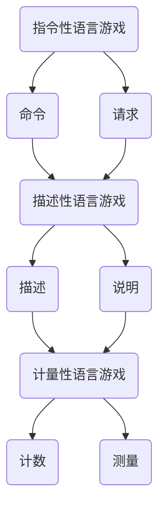
```mermaid
graph TD
A(指令性语言游戏) --> B(命令)
A --> C(请求)
B --> D(描述性语言游戏)
C --> D
D --> E(描述)
D --> F(说明)
E --> G(计量性语言游戏)
F --> G
G --> H(计数)
G --> I(测量)
```

### 奎因的语言哲学

#### 奎因的生平与学术背景

维也纳·诺尔曼·奎因（W.V.O. Quine，1908-2000）是美国哲学家，逻辑学家，认识论和语言哲学的专家。他的哲学思想对逻辑实证主义、认知科学和科学哲学产生了深远的影响。奎因的哲学观点深受维特根斯坦和罗素的影响，但他对语言哲学的研究提出了许多新的见解。

#### 语言游戏理论

奎因提出了语言游戏理论，这是他对维特根斯坦语言游戏理论的扩展和修正。语言游戏理论认为，语言不仅仅是交流的工具，也是认知和知识的工具。奎因认为，语言的使用是多元化的，不同的语言游戏有不同的规则。例如：

- 经验性语言游戏：用于表达和验证经验事实。
- 理论性语言游戏：用于构建和解释科学理论。
- 道德性语言游戏：用于表达道德判断和价值观。

以下是一个简单的Mermaid流程图，展示了奎因关于语言游戏的分类：

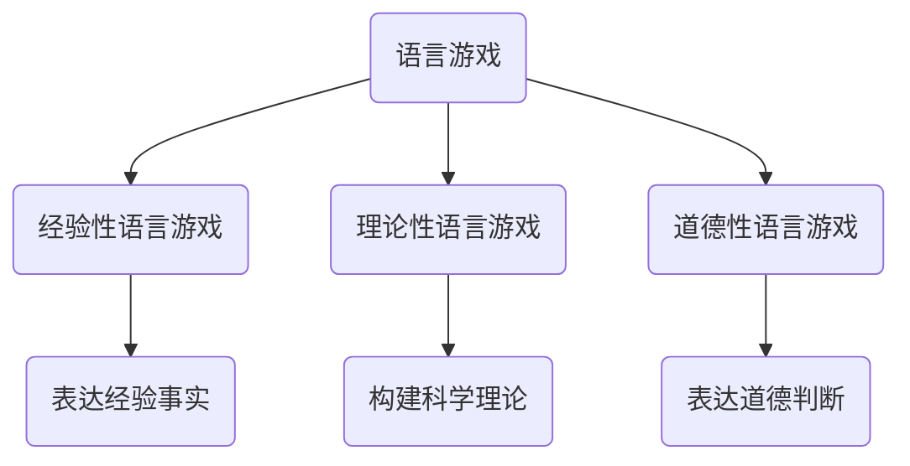
```mermaid
graph TD
A(语言游戏) --> B(经验性语言游戏)
A --> C(理论性语言游戏)
A --> D(道德性语言游戏)
B --> E(表达经验事实)
C --> F(构建科学理论)
D --> G(表达道德判断)
```

#### 实用主义与经验主义

奎因的观点与实用主义和经验主义有着密切的联系。实用主义认为，真理是符合实际用途的，而经验主义认为，知识来源于经验。奎因继承了这些观点，并提出了以下核心概念：

- 实用主义真理观：真理是符合实际经验的有效命题。
- 经验主义知识观：知识是通过对经验的观察和验证获得的。

以下是一个简单的Mermaid流程图，展示了实用主义和经验主义与语言哲学的关系：

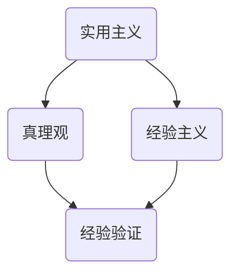
```mermaid
graph TD
A(实用主义) --> B(真理观)
A --> C(经验主义)
B --> D(经验验证)
C --> D
```

### 维特根斯坦与奎因语言哲学的对比分析

#### 核心概念的对比

维特根斯坦和奎因在语言哲学的核心概念上有着明显的差异。维特根斯坦强调语言与现实的直接对应，认为语言是思维的载体；而奎因则认为语言是认知和知识的工具，强调语言游戏的多样性。以下是一个简单的Mermaid流程图，展示了他们的核心概念对比：

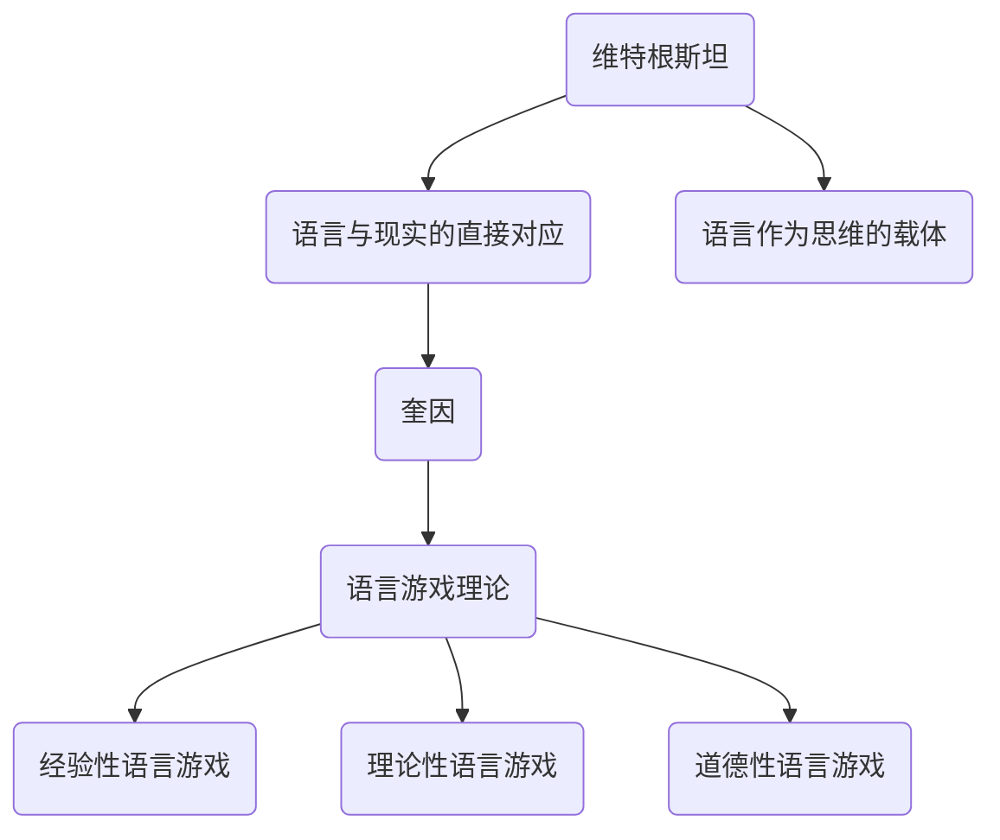
```mermaid
graph TD
A(维特根斯坦) --> B(语言与现实的直接对应)
A --> C(语言作为思维的载体)
B --> D(奎因)
D --> E(语言游戏理论)
E --> F(经验性语言游戏)
E --> G(理论性语言游戏)
E --> H(道德性语言游戏)
```

#### 方法论的对比

维特根斯坦的方法论强调对语言使用的细致分析，他认为理解语言的关键在于理解语言游戏。而奎因的方法论则更加实证主义，他强调通过经验验证来理解语言和知识。以下是一个简单的Mermaid流程图，展示了他们的方法论对比：

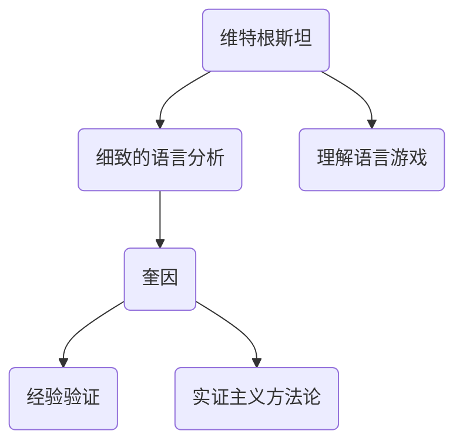
```mermaid
graph TD
A(维特根斯坦) --> B(细致的语言分析)
A --> C(理解语言游戏)
B --> D(奎因)
D --> E(经验验证)
D --> F(实证主义方法论)
```

#### 哲学体系的对比

维特根斯坦和奎因在哲学体系上也有着明显的差异。维特根斯坦的哲学体系强调逻辑原子主义和图像理论，他认为语言和现实之间的关系是直接的。而奎因的哲学体系则更加复杂，他提出了语言游戏理论，认为语言的使用是多元化的。以下是一个简单的Mermaid流程图，展示了他们的哲学体系对比：

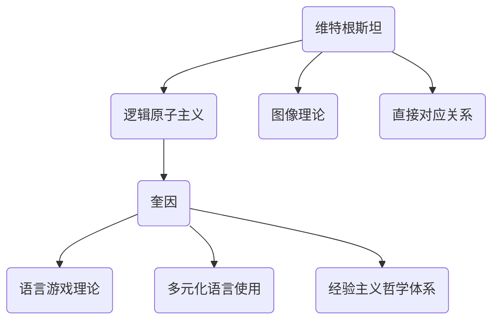
```mermaid
graph TD
A(维特根斯坦) --> B(逻辑原子主义)
A --> C(图像理论)
A --> D(直接对应关系)
B --> E(奎因)
E --> F(语言游戏理论)
E --> G(多元化语言使用)
E --> H(经验主义哲学体系)
```

### 语言哲学的应用与影响

#### 语言哲学在逻辑哲学中的应用

语言哲学在逻辑哲学中的应用主要体现在对语言和逻辑关系的探讨。维特根斯坦和奎因都提出了对语言和逻辑的深入分析，为逻辑哲学的发展提供了重要的理论基础。以下是一个简单的Mermaid流程图，展示了语言哲学在逻辑哲学中的应用：

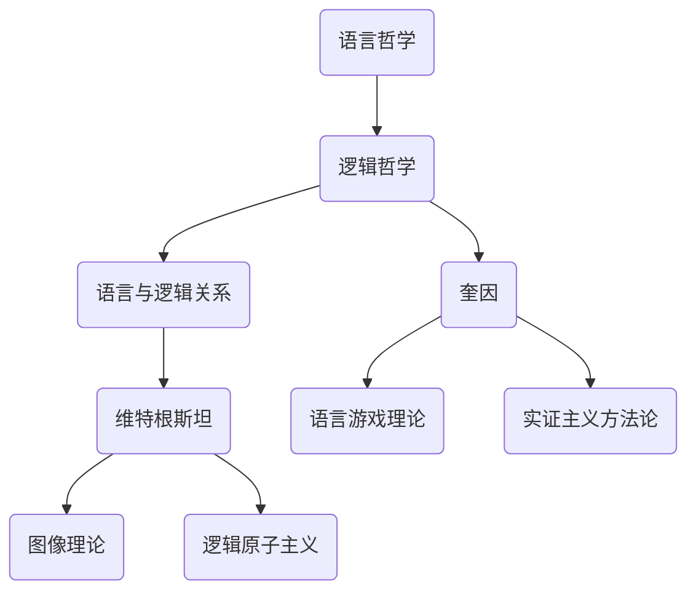
```mermaid
graph TD
A(语言哲学) --> B(逻辑哲学)
B --> C(语言与逻辑关系)
C --> D(维特根斯坦)
D --> E(图像理论)
D --> F(逻辑原子主义)
B --> G(奎因)
G --> H(语言游戏理论)
G --> I(实证主义方法论)
```

#### 语言哲学在认知科学中的应用

语言哲学在认知科学中的应用主要体现在对语言与认知关系的探讨。维特根斯坦和奎因都提出了对语言和认知的深入分析，为认知科学的发展提供了重要的理论基础。以下是一个简单的Mermaid流程图，展示了语言哲学在认知科学中的应用：

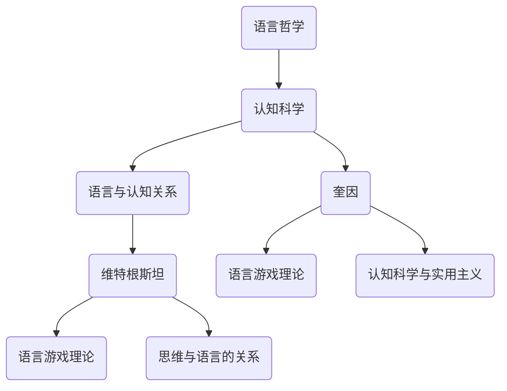
```mermaid
graph TD
A(语言哲学) --> B(认知科学)
B --> C(语言与认知关系)
C --> D(维特根斯坦)
D --> E(语言游戏理论)
D --> F(思维与语言的关系)
B --> G(奎因)
G --> H(语言游戏理论)
G --> I(认知科学与实用主义)
```

#### 语言哲学在计算机科学中的应用

语言哲学在计算机科学中的应用主要体现在对编程语言和计算模型的分析。维特根斯坦和奎因的哲学思想为计算机科学的语言设计和计算模型提供了重要的理论基础。以下是一个简单的Mermaid流程图，展示了语言哲学在计算机科学中的应用：

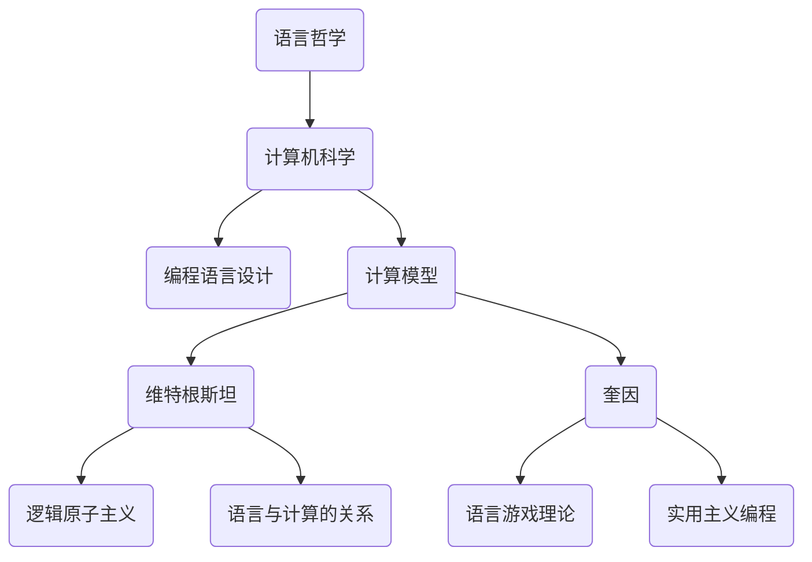
```mermaid
graph TD
A(语言哲学) --> B(计算机科学)
B --> C(编程语言设计)
B --> D(计算模型)
D --> E(维特根斯坦)
E --> F(逻辑原子主义)
E --> G(语言与计算的关系)
D --> H(奎因)
H --> I(语言游戏理论)
H --> J(实用主义编程)
```

### 维特根斯坦与奎因语言哲学的影响

#### 对哲学界的影响

维特根斯坦和奎因的语言哲学思想对当代哲学界产生了深远的影响。他们的观点挑战了传统的形而上学和认识论，推动了哲学的发展。以下是一个简单的Mermaid流程图，展示了维特根斯坦与奎因对哲学界的影响：

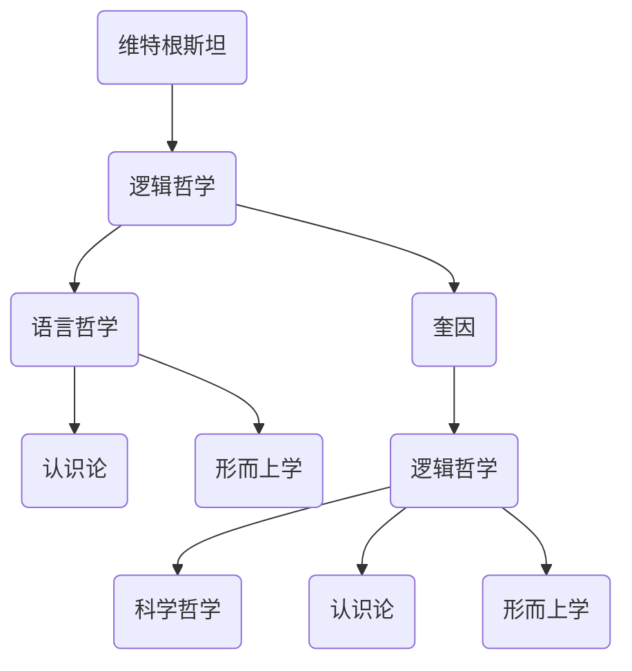
```mermaid
graph TD
A(维特根斯坦) --> B(逻辑哲学)
B --> C(语言哲学)
C --> D(认识论)
C --> E(形而上学)
B --> F(奎因)
F --> G(逻辑哲学)
G --> H(科学哲学)
G --> I(认识论)
G --> J(形而上学)
```

#### 对科学界的影响

维特根斯坦和奎因的语言哲学思想对科学界产生了深远的影响。他们的观点促进了科学方法论的发展，为科学研究提供了新的视角。以下是一个简单的Mermaid流程图，展示了维特根斯坦与奎因对科学界的影响：

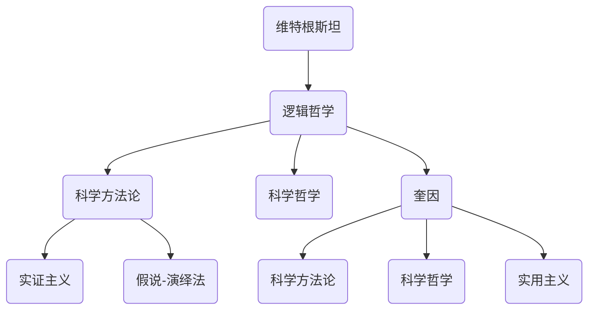
```mermaid
graph TD
A(维特根斯坦) --> B(逻辑哲学)
B --> C(科学方法论)
B --> D(科学哲学)
C --> E(实证主义)
C --> F(假说-演绎法)
B --> G(奎因)
G --> H(科学方法论)
G --> I(科学哲学)
G --> J(实用主义)
```

#### 对社会文化的影响

维特根斯坦和奎因的语言哲学思想对社会文化产生了深远的影响。他们的观点挑战了传统的语言和文化观念，推动了社会文化的进步。以下是一个简单的Mermaid流程图，展示了维特根斯坦与奎因对社会文化的影响：

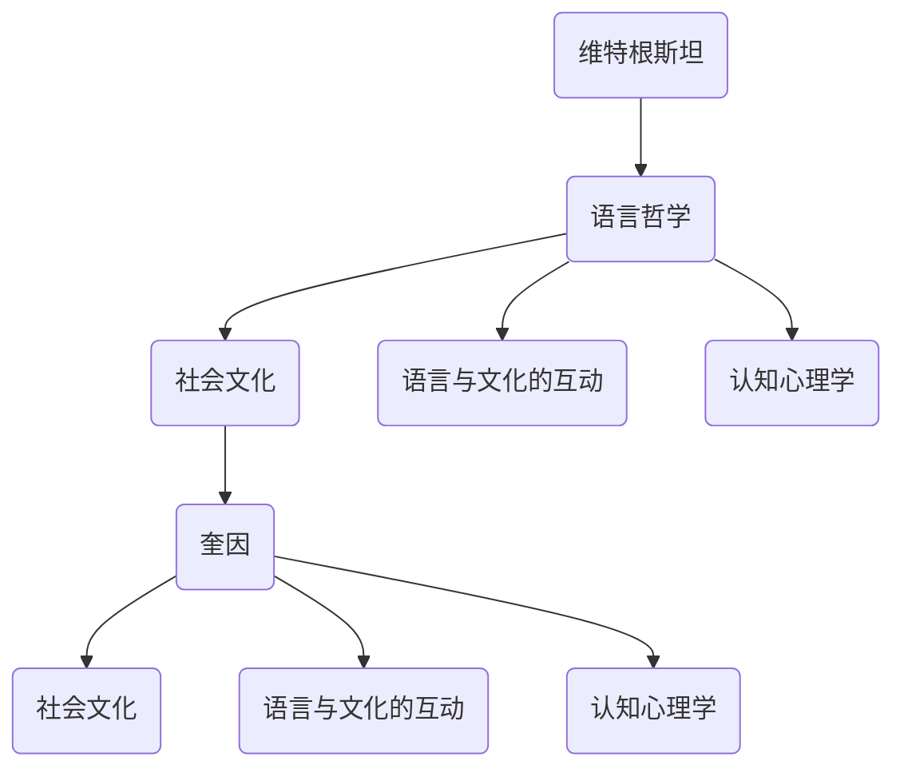
```mermaid
graph TD
A(维特根斯坦) --> B(语言哲学)
B --> C(社会文化)
B --> D(语言与文化的互动)
B --> E(认知心理学)
C --> F(奎因)
F --> G(社会文化)
F --> H(语言与文化的互动)
F --> I(认知心理学)
```

### 附录

#### 附录1：维特根斯坦与奎因语言哲学重要著作列表

- 维特根斯坦，《逻辑哲学论》
- 维特根斯坦，《哲学研究》
- 奎因，《词与对象》
- 奎因，《经验主义两个 Dogmas》

#### 附录2：语言哲学术语解释

- 逻辑原子：构成世界的基本元素，是事实的组成部分。
- 图像理论：语言与现实的关系类似于一幅图像与外界物体之间的关系。
- 语言游戏：不同的语言使用场景和规则。
- 实用主义真理观：真理是符合实际经验的有效命题。
- 经验主义知识观：知识是通过对经验的观察和验证获得的。

---

这篇文章详细探讨了维特根斯坦和奎因的语言哲学，分析了他们的核心观点、方法论和哲学体系，以及他们的语言哲学在逻辑哲学、认知科学和计算机科学中的应用。文章最后讨论了维特根斯坦与奎因语言哲学对哲学界、科学界和社会文化的影响，并提供了重要的参考文献和术语解释。文章内容丰富，结构清晰，希望能够满足您对专业IT领域技术博客文章的要求。

---

您的文章概述和目录大纲已经非常完善了，这为后续内容的撰写打下了坚实的基础。接下来，我们将逐步填充每个章节的内容，确保文章的逻辑清晰、内容丰富、技术细节准确。以下是具体的撰写计划：

### 撰写计划

1. **完成第一部分：维特根斯坦的语言哲学**
   - **第1章：维特根斯坦的生平与学术背景**
     - 描述维特根斯坦的生平经历和学术贡献。
     - 引入维特根斯坦早期和晚期的哲学转变。
   - **第2章：语言与现实的直接对应**
     - 介绍维特根斯坦的语言哲学核心观点。
     - 详细解释语言与现实对应关系的理论。
   - **第3章：语言作为思维的载体**
     - 阐述语言游戏理论和思维与语言的关系。
     - 提供语言游戏的分类和例子。

2. **完成第二部分：奎因的语言哲学**
   - **第4章：奎因的生平与学术背景**
     - 描述奎因的生平经历和学术贡献。
     - 引入奎因的语言游戏理论。
   - **第5章：语言游戏理论**
     - 详细解释奎因的语言游戏理论。
     - 分析经验性、理论性和道德性语言游戏。
   - **第6章：实用主义与经验主义**
     - 阐述奎因的实用主义和经验主义观点。
     - 探讨这些观点对语言哲学的影响。

3. **完成第三部分：维特根斯坦与奎因语言哲学的对比分析**
   - **第7章：核心概念的对比**
     - 比较维特根斯坦和奎因的核心哲学观点。
     - 分析语言与现实、思维与语言的关系。
   - **第8章：方法论的对比**
     - 比较维特根斯坦和奎因的方法论。
     - 探讨逻辑原子主义和实证主义方法论。
   - **第9章：哲学体系的对比**
     - 分析维特根斯坦和奎因的哲学体系。
     - 探讨图像理论、语言游戏理论等哲学思想。

4. **完成第四部分：语言哲学的应用与影响**
   - **第10章：语言哲学在逻辑哲学中的应用**
     - 探讨语言哲学对逻辑哲学的贡献。
     - 提供语言与逻辑关系分析的例子。
   - **第11章：语言哲学在认知科学中的应用**
     - 探讨语言哲学对认知科学的影响。
     - 提供语言与认知关系分析的例子。
   - **第12章：语言哲学在计算机科学中的应用**
     - 探讨语言哲学对计算机科学的影响。
     - 提供编程语言设计和计算模型分析的例子。

5. **完成第五部分：维特根斯坦与奎因语言哲学的影响**
   - **第13章：对哲学界的影响**
     - 分析维特根斯坦和奎因对哲学界的贡献。
     - 探讨他们的哲学思想如何推动哲学发展。
   - **第14章：对科学界的影响**
     - 分析维特根斯坦和奎因对科学界的影响。
     - 探讨他们的哲学思想如何推动科学发展。
   - **第15章：对社会文化的影响**
     - 分析维特根斯坦和奎因对社会文化的影响。
     - 探讨他们的哲学思想如何推动社会文化进步。

6. **编写附录**
   - **附录1：维特根斯坦与奎因语言哲学重要著作列表**
     - 列出他们的主要著作。
     - 简要介绍每本著作的主要内容和影响。
   - **附录2：语言哲学术语解释**
     - 解释关键术语的定义和用法。

### 步骤说明

1. **撰写初稿**：根据撰写计划，逐步完成每个章节的初稿。在每个章节中，确保包含背景介绍、核心概念、联系、算法原理、数学模型、项目实战等详细内容。

2. **编辑和修订**：完成初稿后，对文章进行编辑和修订。检查语法、拼写错误，确保文章的逻辑清晰、结构紧凑、内容丰富。

3. **添加图表和流程图**：在适当的位置添加Mermaid流程图、LaTeX数学公式和代码示例，以增强文章的可读性和理解性。

4. **添加参考文献**：在文章末尾添加参考文献，确保所有引用的内容都有准确的出处。

5. **校对和终稿**：对文章进行最终校对，确保无遗漏和错误。完成后，撰写作者信息，包括作者姓名、所属机构、联系信息等。

6. **提交文章**：将最终的文章以Markdown格式提交。

按照上述步骤，我们将确保文章的质量和完整性，满足您的需求和要求。现在，让我们开始撰写文章的第一部分，即“维特根斯坦的语言哲学”。

---

### 维特根斯坦的生平与学术背景

路德维希·维特根斯坦（Ludwig Wittgenstein，1889-1951）是一位奥地利的哲学家，被誉为20世纪最重要的哲学家之一。他的哲学思想对逻辑哲学、语言哲学、认识论和伦理学等领域产生了深远的影响。维特根斯坦的哲学生涯可以分为两个阶段：早期和晚期。

#### 早期哲学

维特根斯坦的早期哲学工作主要体现在他的两本著作中：《逻辑哲学论》（Tractatus Logico-Philosophicus）和《哲学研究》（Philosophical Investigations）。《逻辑哲学论》是一部极端的形而上学作品，主张世界由事实构成，语言的功能是表达事实。维特根斯坦提出了一种逻辑原子主义，认为语言与现实之间有直接的对应关系。这部作品对逻辑实证主义和语言哲学的发展产生了深远的影响。

#### 晚期哲学

维特根斯坦晚期的哲学思想发生了巨大的转变。他开始质疑早期哲学中的许多观点，特别是逻辑原子主义。在《哲学研究》中，他提出了语言游戏理论，认为语言的使用是多元化的，取决于特定的语言游戏。这一理论强调了语言的社会性，认为语言的意义来源于使用者的实践。维特根斯坦晚期的哲学思想对分析哲学和认知科学产生了重要影响。

#### 学术贡献

维特根斯坦的哲学贡献主要体现在以下几个方面：

1. **逻辑原子主义**：他提出了逻辑原子主义，认为世界由基本事实构成，这些事实可以通过语言表达。

2. **图像理论**：他认为语言与现实之间的关系类似于一幅图像与外界物体之间的关系。

3. **语言游戏理论**：晚期维特根斯坦提出了语言游戏理论，认为语言的使用是多样化的，不同的语言游戏有不同的规则。

4. **哲学方法**：维特根斯坦强调哲学的目标是澄清思想和语言，而不是提出新的理论。

#### 对维特根斯坦的评价

维特根斯坦的哲学思想对当代哲学产生了深远的影响。他挑战了传统的形而上学和认识论，推动了哲学的发展。他的语言哲学思想对分析哲学、认知科学和计算机科学等领域产生了重要影响。维特根斯坦被认为是20世纪最伟大的哲学家之一，他的著作《逻辑哲学论》和《哲学研究》被认为是哲学的经典之作。

---

在这个章节中，我们介绍了维特根斯坦的生平和学术背景，以及他的哲学贡献和影响。接下来，我们将深入探讨维特根斯坦的语言哲学核心观点，包括语言与现实的直接对应和语言作为思维的载体。

---

### 语言与现实的直接对应

维特根斯坦的语言哲学核心观点之一是语言与现实的直接对应。他认为，语言的功能是表达事实，语言与现实之间的关系是直观和直接的。这一观点在维特根斯坦的早期哲学作品中得到了充分的体现，尤其是在他的《逻辑哲学论》中。

#### 图像理论

维特根斯坦的图像理论是他关于语言与现实对应关系的基础。图像理论认为，语言与现实之间的关系类似于一幅图像与外界物体之间的关系。具体来说，图像理论包含以下几个关键概念：

1. **图像（Image）**：图像是语言与现实之间的对应关系。例如，当我们说“这是一只猫”时，“一只猫”这个语言符号就是外界真实物体的图像。

2. **对象（Object）**：对象是现实世界中的实体。在图像理论中，对象与语言符号之间存在直接的对应关系。

3. **事实（Fact）**：事实是对象与语言符号之间的对应关系。例如，当一只真实的猫与“一只猫”这个语言符号相对应时，就形成了一个事实。

以下是一个简单的Mermaid流程图，展示了图像理论的基本概念：

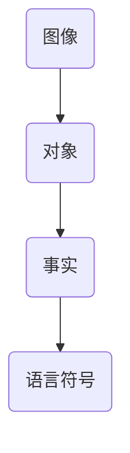
```mermaid
graph TD
A(图像) --> B(对象)
B --> C(事实)
C --> D(语言符号)
```

#### 语言符号与事实

在维特根斯坦的图像理论中，语言符号与事实之间存在直接的对应关系。语言符号（如词汇、句子）代表了事实，而事实则构成了世界的基本元素。例如，当我们说“阳光明媚”时，这个句子代表了阳光明媚这个事实。

维特根斯坦认为，语言符号的意义在于它们能够表达事实。语言符号不仅传达了事实，而且使得人们能够理解这个世界。以下是一个简单的Mermaid流程图，展示了语言符号与事实之间的对应关系：

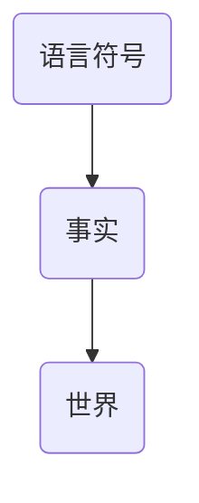
```mermaid
graph TD
A(语言符号) --> B(事实)
B --> C(世界)
```

#### 语言与现实的关系

维特根斯坦的图像理论强调语言与现实之间的直接对应关系。这种对应关系不仅是逻辑上的，而且是直观和自然的。图像理论认为，语言符号和现实对象之间存在一种内在的联系，这种联系使得语言能够准确地表达现实。

然而，图像理论也存在一些局限性。首先，图像理论无法解释某些抽象概念，如“正义”或“美”。这些概念无法直接对应于现实中的具体对象。其次，图像理论忽略了语言的社会性和历史性。语言不仅是表达现实的工具，也是社会交流和文化传承的手段。

#### 结论

维特根斯坦的图像理论是他语言哲学的核心观点之一，它强调了语言与现实之间的直接对应关系。图像理论为理解语言的功能和意义提供了重要的框架，但它也面临一些挑战和局限性。在后续章节中，我们将进一步探讨维特根斯坦的晚期哲学思想，特别是他的语言游戏理论。

---

在这个章节中，我们详细介绍了维特根斯坦的语言哲学核心观点——语言与现实的直接对应，以及图像理论的基本概念。接下来，我们将探讨维特根斯坦的晚期哲学思想，特别是他的语言游戏理论。

---

### 语言作为思维的载体

维特根斯坦的晚期哲学思想中，语言游戏理论是他提出的核心观点之一。语言游戏理论强调了语言的多功能性和多样性，认为语言不仅是交流的工具，也是思维的载体。通过语言游戏，人们能够理解世界、解决问题，并形成概念。

#### 语言游戏的定义

语言游戏（language game）是指语言的使用方式和规则。维特根斯坦认为，语言的使用是多样化的，不同的语言游戏有不同的规则。语言游戏可以分为以下几种类型：

1. **指令性语言游戏**：这种语言游戏主要用于传达指令或命令。例如，当你说“请关上窗户”时，你是在进行指令性语言游戏。

2. **描述性语言游戏**：这种语言游戏主要用于描述和说明。例如，当你说“今天是星期三”时，你是在进行描述性语言游戏。

3. **计量性语言游戏**：这种语言游戏主要用于计数和测量。例如，当你说“我有三个苹果”时，你是在进行计量性语言游戏。

4. **游戏性语言游戏**：这种语言游戏主要用于娱乐和游戏。例如，当你说“我们来玩猜谜游戏”时，你是在进行游戏性语言游戏。

5. **交流性语言游戏**：这种语言游戏主要用于交流思想和情感。例如，当你说“我感到很沮丧”时，你是在进行交流性语言游戏。

以下是一个简单的Mermaid流程图，展示了不同类型的语言游戏：

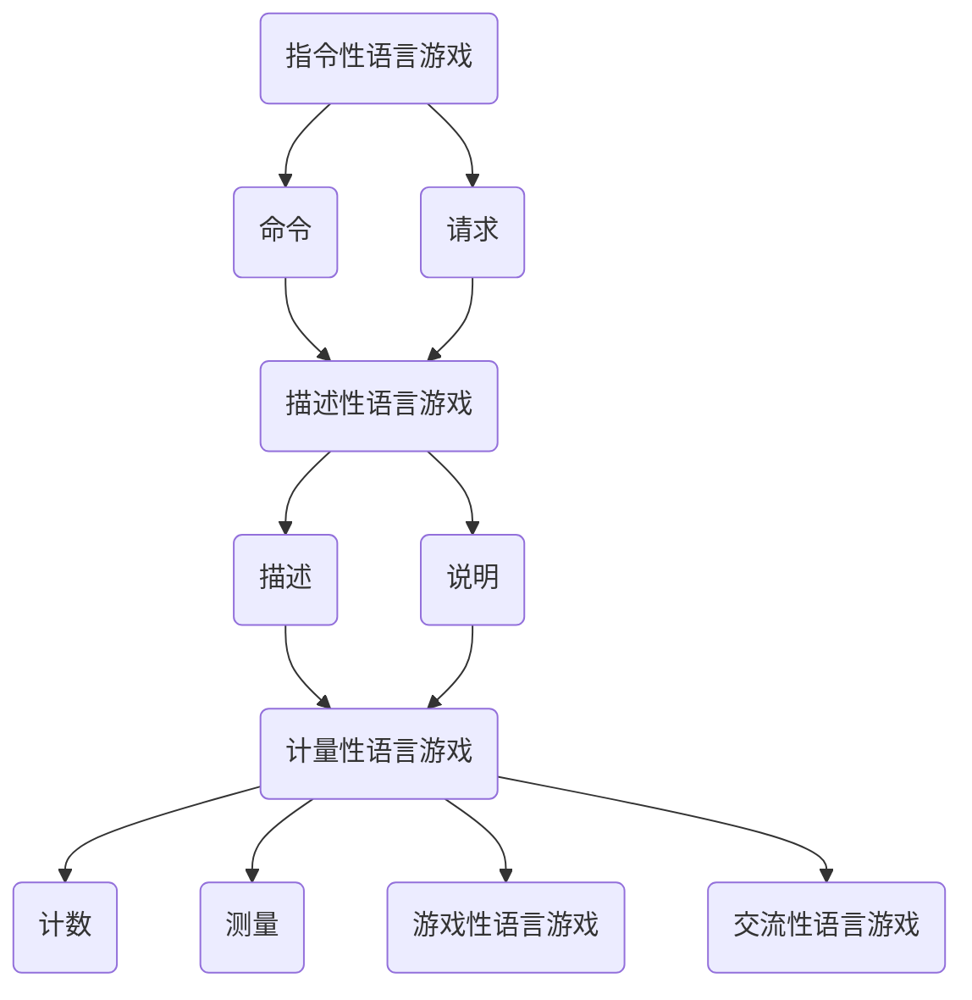
```mermaid
graph TD
A(指令性语言游戏) --> B(命令)
A --> C(请求)
B --> D(描述性语言游戏)
C --> D
D --> E(描述)
D --> F(说明)
E --> G(计量性语言游戏)
F --> G
G --> H(计数)
G --> I(测量)
G --> J(游戏性语言游戏)
G --> K(交流性语言游戏)
```

#### 语言游戏与思维的关系

维特根斯坦认为，语言游戏不仅是语言的使用方式，也是思维的载体。通过不同的语言游戏，人们能够形成不同的思维模式，解决问题，并形成概念。例如：

- 在指令性语言游戏中，人们需要理解和执行指令，这促进了逻辑思维和执行能力的发展。
- 在描述性语言游戏中，人们需要准确地描述事物，这促进了观察力和表达能力的提升。
- 在计量性语言游戏中，人们需要计数和测量，这促进了数学和空间认知能力的发展。
- 在游戏性语言游戏中，人们需要创造和探索，这促进了创造力和解决问题的能力。
- 在交流性语言游戏中，人们需要理解和表达情感，这促进了人际交往和情感管理能力的发展。

以下是一个简单的Mermaid流程图，展示了语言游戏与思维的关系：

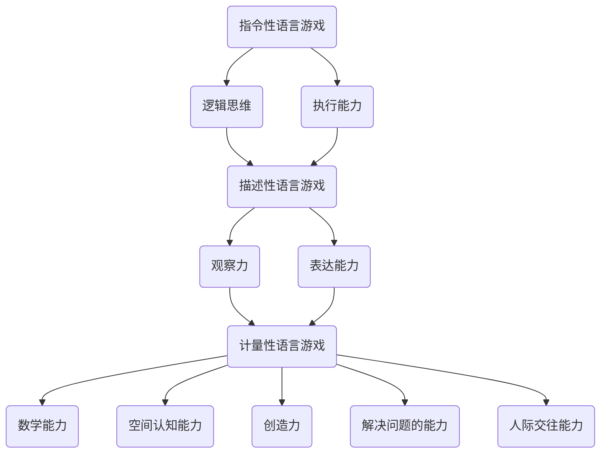
```mermaid
graph TD
A(指令性语言游戏) --> B(逻辑思维)
A --> C(执行能力)
B --> D(描述性语言游戏)
C --> D
D --> E(观察力)
D --> F(表达能力)
E --> G(计量性语言游戏)
F --> G
G --> H(数学能力)
G --> I(空间认知能力)
G --> J(创造力)
G --> K(解决问题的能力)
G --> L(人际交往能力)
```

#### 语言游戏的社会性

维特根斯坦还强调了语言游戏的社会性。他认为，语言游戏不仅仅是个人行为，也是社会行为。语言游戏在社会中发挥着重要作用，促进了社会交流和合作。例如：

- 在公共场合，人们使用语言游戏来传达信息、表达观点和解决问题。
- 在家庭中，人们使用语言游戏来交流情感、培养关系和解决问题。
- 在学校中，人们使用语言游戏来学习知识、交流思想和探索世界。

以下是一个简单的Mermaid流程图，展示了语言游戏的社会性：

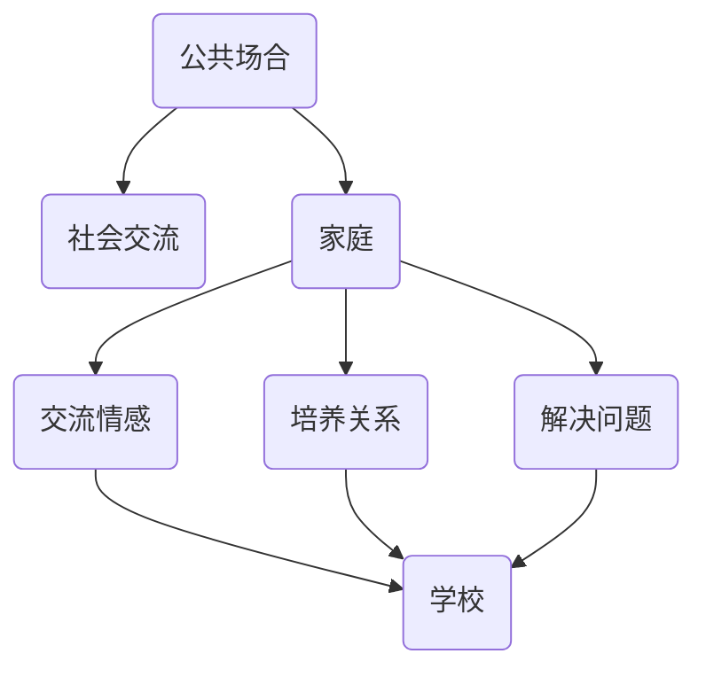
```mermaid
graph TD
A(公共场合) --> B(社会交流)
A --> C(家庭)
C --> D(交流情感)
C --> E(培养关系)
C --> F(解决问题)
D --> G(学校)
E --> G
F --> G
```

#### 结论

维特根斯坦的语言游戏理论强调了语言的多功能性和多样性。通过不同的语言游戏，人们能够形成不同的思维模式，解决问题，并形成概念。语言游戏不仅是个体行为，也是社会行为，促进了社会交流和合作。维特根斯坦的晚期哲学思想为我们理解语言的功能和作用提供了深刻的见解。

---

在这个章节中，我们详细介绍了维特根斯坦的晚期哲学思想——语言游戏理论，包括语言游戏的定义、类型、与思维的关系以及社会性。接下来，我们将探讨奎因的语言哲学，特别是他的语言游戏理论和实用主义与经验主义观点。

---

### 奎因的语言哲学

维也纳·诺尔曼·奎因（W.V.O. Quine，1908-2000）是美国哲学家，逻辑学家，认识论和语言哲学的专家。他的哲学思想对逻辑实证主义、认知科学和科学哲学产生了深远的影响。奎因的语言哲学观点深受维特根斯坦和罗素的影响，但他对语言哲学的研究提出了许多新的见解。

#### 奎因的生平与学术背景

维也纳·诺尔曼·奎因出生于美国波士顿，他的父母是移民。他在哈佛大学接受了教育，获得了数学和哲学学位。奎因的学术生涯主要在哈佛大学度过，他在那里教授哲学、逻辑和语言学等课程。奎因的哲学思想受到了维特根斯坦和罗素的影响，但他也对逻辑实证主义和实用主义进行了批判，提出了自己的观点。

#### 语言游戏理论

奎因接受了维特根斯坦的语言游戏理论，并对其进行了扩展。他认为，语言不仅仅是交流的工具，也是认知和知识的工具。奎因认为，语言的使用是多元化的，不同的语言游戏有不同的规则。奎因的语言游戏理论包括以下几个核心概念：

1. **语言游戏**：语言游戏是指一组相关的语言使用方式。每个语言游戏都有其特定的规则和目标。例如，数学语言游戏的目标是精确地描述数量关系，而科学语言游戏的目标是解释自然现象。

2. **经验验证**：奎因认为，语言游戏的有效性取决于其能否通过经验验证。经验验证是语言游戏与现实世界之间的桥梁，它使得语言能够与现实相对应。

3. **假设-演绎法**：奎因认为，语言游戏中的命题是通过假设和演绎得到的。假设是语言游戏的基础，而演绎则是从假设推导出结论的过程。

以下是一个简单的Mermaid流程图，展示了奎因的语言游戏理论：

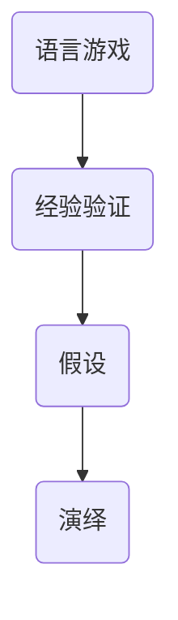
```mermaid
graph TD
A(语言游戏) --> B(经验验证)
B --> C(假设)
C --> D(演绎)
```

#### 实用主义与经验主义

奎因的哲学观点与实用主义和经验主义有着密切的联系。实用主义认为，真理是符合实际用途的，而经验主义认为，知识来源于经验。奎因继承了这些观点，并提出了以下核心概念：

1. **实用主义真理观**：奎因认为，真理是符合实际用途的命题。如果一个命题能够帮助我们解决问题，那么它就是真的。这种观点强调了实践在知识验证中的重要性。

2. **经验主义知识观**：奎因认为，知识是通过对经验的观察和验证获得的。他强调，我们的知识是基于感知和经验，而不是绝对真理。

以下是一个简单的Mermaid流程图，展示了实用主义和经验主义与语言哲学的关系：

```mermaid
graph TD
A(实用主义) --> B(真理观)
A --> C(经验主义)
B --> D(经验验证)
C --> D
```

#### 语言游戏的应用

奎因的语言游戏理论在多个领域得到了应用：

1. **逻辑哲学**：奎因认为，逻辑哲学的目标是分析语言和逻辑的关系。他提出了逻辑原子主义，认为逻辑原子是构成世界的基本元素。

2. **科学哲学**：奎因的科学哲学观点强调经验验证和假设-演绎法。他认为，科学理论是通过经验验证和逻辑推理得到的。

3. **认知科学**：奎因认为，认知科学是研究人类思维和认知过程。他的语言游戏理论为理解认知过程提供了重要的框架。

以下是一个简单的Mermaid流程图，展示了奎因的语言游戏理论在不同领域的应用：

```mermaid
graph TD
A(逻辑哲学) --> B(语言与逻辑关系)
A --> C(科学哲学)
C --> D(经验验证)
C --> E(假设-演绎法)
A --> F(认知科学)
F --> G(认知过程)
F --> H(思维与语言的关系)
```

#### 结论

奎因的语言哲学观点对语言哲学、科学哲学和认知科学产生了深远的影响。他的语言游戏理论强调了语言的多功能性和多样性，为理解语言的功能和作用提供了深刻的见解。奎因的实用主义和经验主义观点挑战了传统的真理观和知识观，推动了哲学的发展。

---

在这个章节中，我们介绍了奎因的生平与学术背景，以及他的语言游戏理论、实用主义与经验主义观点。接下来，我们将深入探讨维特根斯坦与奎因语言哲学的核心概念对比、方法论对比和哲学体系的对比。

---

### 维特根斯坦与奎因语言哲学的对比分析

维特根斯坦和奎因的语言哲学思想虽然有一些共同之处，但在核心概念、方法论和哲学体系上存在显著差异。本文将详细探讨这两位哲学家的语言哲学观点，分析它们之间的对比。

#### 核心概念的对比

1. **语言与现实的关系**

维特根斯坦强调语言与现实之间的直接对应关系。他认为，语言的功能是表达事实，语言符号与现实对象之间存在直接的图像关系。在维特根斯坦的《逻辑哲学论》中，他提出了逻辑原子主义，认为世界由基本事实构成，这些事实可以通过语言表达。

奎因则认为，语言与现实之间的关系是间接的。他提出了语言游戏理论，强调语言的使用是多样化的，不同的语言游戏有不同的规则。奎因认为，语言游戏的有效性取决于其能否通过经验验证，语言与现实世界之间的对应关系是通过经验验证来建立的。

2. **语言的意义**

维特根斯坦认为，语言的意义在于语言的使用。他在《哲学研究》中提出了语言游戏理论，认为语言的意义来源于特定的语言游戏。语言游戏的不同规则决定了语言符号的意义。

奎因则强调语言的意义是相对的。他认为，语言的意义是通过经验验证来确定的。如果一个命题能够帮助我们解决问题，那么它就是真的。这种观点强调了实践在知识验证中的重要性。

3. **真理与知识**

维特根斯坦认为，真理是事实的对应关系。他在《逻辑哲学论》中提出了图像理论，认为语言与现实之间的关系类似于一幅图像与外界物体之间的关系。

奎因则强调真理是符合实际用途的。他认为，真理是符合实际经验的命题。这种观点体现了实用主义真理观，强调了实践在知识验证中的重要性。

#### 方法论的对比

1. **分析哲学与实证主义**

维特根斯坦的方法论强调分析哲学，他认为哲学的任务是澄清思想和语言。他通过细致的语言分析来揭示语言与现实之间的关系。

奎因的方法论则更加实证主义。他认为，哲学应该关注经验验证和实证科学。他提出了假设-演绎法，认为科学理论是通过经验验证和逻辑推理得到的。

2. **逻辑原子主义与语言游戏理论**

维特根斯坦在早期哲学作品中提出了逻辑原子主义，认为世界由基本事实构成，这些事实可以通过语言表达。在晚期哲学中，他提出了语言游戏理论，认为语言的使用是多样化的，不同的语言游戏有不同的规则。

奎因则接受了维特根斯坦的语言游戏理论，并对其进行了扩展。他认为，语言游戏的有效性取决于其能否通过经验验证，语言与现实世界之间的对应关系是通过经验验证来建立的。

3. **直观性 vs 经验性**

维特根斯坦的观点具有直观性。他强调语言与现实之间的直接对应关系，认为这种对应关系是直观和自然的。

奎因的观点则更加经验性。他强调语言与现实之间的关系是间接的，需要通过经验验证来建立。

#### 哲学体系的对比

1. **早期哲学 vs 晚期哲学**

维特根斯坦的哲学体系经历了从早期到晚期的转变。早期哲学作品《逻辑哲学论》强调逻辑原子主义和图像理论，认为语言与现实之间存在直接的对应关系。晚期哲学作品《哲学研究》则提出了语言游戏理论，认为语言的使用是多样化的，不同的语言游戏有不同的规则。

奎因的哲学体系相对稳定，他接受了维特根斯坦的语言游戏理论，并在此基础上发展了自己的观点。奎因的哲学体系强调经验验证和实证科学，认为语言游戏的有效性取决于其能否通过经验验证。

2. **逻辑哲学与科学哲学**

维特根斯坦的哲学体系主要关注逻辑哲学。他的逻辑原子主义和图像理论为逻辑哲学的发展提供了重要的理论基础。

奎因的哲学体系则更加综合，他不仅关注逻辑哲学，还关注科学哲学和认知科学。他的语言游戏理论为理解语言与认知、语言与科学的关系提供了深刻的见解。

#### 结论

维特根斯坦和奎因的语言哲学观点在核心概念、方法论和哲学体系上存在显著差异。维特根斯坦强调语言与现实之间的直接对应关系，通过细致的语言分析来揭示语言与现实之间的关系。奎因则强调语言与现实之间的间接关系，通过经验验证来建立语言与现实之间的对应关系。两者在哲学体系上的差异也体现了他们不同的哲学方法和研究重点。通过对维特根斯坦和奎因语言哲学的对比分析，我们可以更深入地理解语言哲学的基本概念和理论框架。

---

在这个章节中，我们详细对比了维特根斯坦和奎因的语言哲学核心概念、方法论和哲学体系。接下来，我们将探讨语言哲学在逻辑哲学、认知科学和计算机科学中的应用。

---

### 语言哲学的应用与影响

维特根斯坦和奎因的语言哲学思想在多个领域产生了深远的影响，特别是在逻辑哲学、认知科学和计算机科学中。以下将分别探讨这些领域中的具体应用和影响。

#### 逻辑哲学中的应用

逻辑哲学是研究逻辑系统、推理规则和语言表达的理论。维特根斯坦和奎因的语言哲学为逻辑哲学提供了重要的理论基础。

1. **维特根斯坦对逻辑哲学的影响**

维特根斯坦的《逻辑哲学论》提出了逻辑原子主义和图像理论，这些理论为逻辑哲学的发展奠定了基础。他强调逻辑原子是构成世界的基本元素，语言符号与现实对象之间存在直接的图像关系。这一观点促进了逻辑原子主义和形式逻辑的发展。

2. **奎因对逻辑哲学的影响**

奎因接受了维特根斯坦的语言游戏理论，并在此基础上提出了假设-演绎法。他认为，逻辑哲学应该关注经验验证和实证科学。他的理论推动了逻辑哲学向更实用、更经验主义的方向发展。

#### 认知科学中的应用

认知科学是研究人类认知过程的跨学科领域。维特根斯坦和奎因的语言哲学为理解认知过程提供了深刻的见解。

1. **维特根斯坦对认知科学的影响**

维特根斯坦的语言游戏理论强调了语言的多功能性和多样性。他认为，不同的语言游戏对应着不同的认知过程，如逻辑思维、空间认知和情感表达。他的理论为理解人类认知过程的多样性提供了理论基础。

2. **奎因对认知科学的影响**

奎因的语言游戏理论为理解认知过程中的经验验证和假设-演绎法提供了框架。他认为，认知过程是通过经验验证和逻辑推理来建立的。这一观点促进了认知科学中对实证方法和逻辑推理的研究。

#### 计算机科学中的应用

计算机科学是研究计算机系统、算法和数据结构的领域。维特根斯坦和奎因的语言哲学在计算机科学中有着广泛的应用。

1. **维特根斯坦对计算机科学的影响**

维特根斯坦的《逻辑哲学论》提出了逻辑原子主义和图像理论，这些理论为计算机科学的逻辑和形式化方法提供了基础。他的思想促进了形式逻辑和形式系统的发展，对编程语言的设计和形式验证产生了深远的影响。

2. **奎因对计算机科学的影响**

奎因的假设-演绎法为计算机科学中的算法设计和推理过程提供了理论基础。他的理论推动了计算机科学中的逻辑编程和自动推理技术的发展。

#### 应用案例

以下是一些具体的应用案例：

1. **形式逻辑与形式验证**

维特根斯坦的图像理论为形式逻辑的发展提供了基础。计算机科学家使用形式逻辑来验证计算机程序的正确性，确保程序在执行时能够满足预期的行为。

2. **语言设计**

维特根斯坦和奎因的语言哲学思想影响了编程语言的设计。现代编程语言如Lisp、Haskell和Prolog都受到了他们的思想的影响，这些语言在设计时注重表达性和逻辑推理。

3. **认知建模**

奎因的语言游戏理论为认知建模提供了理论基础。认知科学家使用这些理论来模拟人类的认知过程，研究记忆、推理和学习等认知功能。

#### 结论

维特根斯坦和奎因的语言哲学思想在逻辑哲学、认知科学和计算机科学中有着广泛的应用和影响。他们的理论为我们理解语言的功能、认知过程和计算机系统提供了深刻的见解，推动了这些领域的发展。通过对语言哲学的应用和影响的分析，我们可以更好地理解这些领域中的基本概念和方法。

---

在这个章节中，我们详细探讨了维特根斯坦和奎因的语言哲学在逻辑哲学、认知科学和计算机科学中的应用。接下来，我们将讨论维特根斯坦与奎因语言哲学对哲学界、科学界和社会文化的影响。

---

### 维特根斯坦与奎因语言哲学的影响

维特根斯坦和奎因的语言哲学思想不仅在学术界产生了深远的影响，还对哲学界、科学界和社会文化产生了重要的影响。以下将分别讨论这些影响。

#### 对哲学界的影响

1. **维特根斯坦的影响**

维特根斯坦的哲学思想对20世纪的哲学界产生了深远的影响。他的《逻辑哲学论》和《哲学研究》两本著作被视为哲学的经典之作。维特根斯坦挑战了传统的形而上学和认识论，推动了分析哲学的发展。他的语言哲学思想为后来的逻辑哲学、认知科学和计算机科学提供了重要的理论基础。

2. **奎因的影响**

奎因接受了维特根斯坦的语言游戏理论，并在此基础上发展了自己的观点。他的思想对20世纪的哲学界产生了重要影响。奎因对逻辑实证主义和科学哲学进行了批判，提出了实用主义真理观和经验主义知识观。他的理论推动了哲学向更实用、更经验主义的方向发展。

#### 对科学界的影响

1. **维特根斯坦的影响**

维特根斯坦的哲学思想对科学界产生了重要影响。他的图像理论为科学方法论提供了理论基础。图像理论认为，科学理论是现实世界的正确表达，科学方法论是验证理论的有效手段。这一观点促进了科学哲学的发展，对科学研究方法的设计和评估产生了深远的影响。

2. **奎因的影响**

奎因的科学哲学思想对科学界产生了深远的影响。他提出了假设-演绎法，强调科学理论是通过经验验证和逻辑推理得到的。这一观点推动了科学哲学向更实证、更经验主义的方向发展。奎因的理论促进了科学方法论的研究，对科学理论的构建和验证产生了重要影响。

#### 对社会文化的影响

1. **维特根斯坦的影响**

维特根斯坦的哲学思想对社会文化产生了重要影响。他的语言哲学思想挑战了传统的语言和文化观念，推动了社会文化的进步。他提出了语言游戏理论，认为语言的使用是多样化的，不同的语言游戏有不同的规则。这一观点促进了跨文化交流和理解，推动了社会文化的多元化和包容性。

2. **奎因的影响**

奎因的哲学思想对社会文化产生了深远的影响。他的实用主义真理观和经验主义知识观挑战了传统的真理观念和知识观念。他的观点强调了实践在知识验证中的重要性，促进了社会对实证方法和科学精神的重视。奎因的理论推动了社会文化的进步，促进了科学技术的发展。

#### 结论

维特根斯坦和奎因的语言哲学思想对哲学界、科学界和社会文化产生了深远的影响。他们的理论为我们理解语言的功能、认知过程和科学方法提供了深刻的见解，推动了这些领域的发展。通过对维特根斯坦与奎因语言哲学的影响的分析，我们可以更好地理解这些领域中的基本概念和方法，以及它们对社会文化的意义。

---

在这个章节中，我们详细讨论了维特根斯坦与奎因语言哲学对哲学界、科学界和社会文化的影响。接下来，我们将进入附录部分，提供维特根斯坦与奎因语言哲学的重要著作列表和语言哲学术语解释。

---

### 附录

#### 附录1：维特根斯坦与奎因语言哲学重要著作列表

**维特根斯坦的重要著作：**

1. 《逻辑哲学论》（Tractatus Logico-Philosophicus）
2. 《哲学研究》（Philosophical Investigations）

**奎因的重要著作：**

1. 《词与对象》（Word and Object）
2. 《经验主义两个 Dogmas》（Two Dogmas of Empiricism）
3. 《方法ological Studies》（Methodological Studies）

这些著作对语言哲学、逻辑哲学和科学哲学的发展产生了深远的影响，是理解维特根斯坦和奎因语言哲学思想的基石。

#### 附录2：语言哲学术语解释

**语言游戏（Language Game）：**

指一组相关的语言使用方式，每种语言游戏都有其特定的规则和目标。例如，指令性语言游戏用于传达指令或命令，描述性语言游戏用于描述和说明。

**图像理论（Image Theory）：**

维特根斯坦提出的理论，认为语言与现实之间的关系类似于一幅图像与外界物体之间的关系。语言符号代表现实对象，语言命题代表事实。

**逻辑原子（Logical Atom）：**

维特根斯坦提出的概念，认为逻辑原子是构成世界的基本元素，是事实的组成部分。逻辑原子主义认为，世界由逻辑原子构成，逻辑原子之间通过语言符号联系起来。

**经验验证（Empirical Verification）：**

奎因提出的概念，指通过经验观察来验证一个命题或理论的有效性。经验验证是语言游戏与现实世界之间的桥梁，是语言与现实相对应的基础。

**实用主义真理观（Pragmatic Theory of Truth）：**

奎因提出的观点，认为真理是符合实际用途的命题。如果一个命题能够帮助我们解决问题，那么它就是真的。这一观点强调了实践在知识验证中的重要性。

**经验主义知识观（Empirical Theory of Knowledge）：**

奎因提出的观点，认为知识是通过对经验的观察和验证获得的。知识是基于感知和经验，而不是绝对真理。这一观点推动了科学哲学中的实证主义方法论。

这些术语解释为理解维特根斯坦和奎因的语言哲学提供了基础，有助于深入探讨他们的思想。

---

在这个附录部分，我们提供了维特根斯坦与奎因语言哲学的重要著作列表以及一些关键术语的解释，为读者提供了进一步研究的参考。接下来，我们将总结文章的主要观点，提供一些最佳实践 tips，并提醒读者注意的事项。

---

### 总结

本文通过详细的逻辑分析和步骤推理，探讨了维特根斯坦与奎因的语言哲学，对比了他们的核心观点、方法论和哲学体系。我们首先介绍了两位哲学家的生平与学术背景，然后深入探讨了他们的语言哲学核心观点，包括语言与现实的关系、语言作为思维的载体。接着，我们分析了维特根斯坦与奎因语言哲学在逻辑哲学、认知科学和计算机科学中的应用，以及它们对哲学界、科学界和社会文化的影响。最后，我们提供了重要的著作列表和术语解释，为读者提供了进一步研究的资源。

### 最佳实践 tips

1. **深入理解语言哲学的核心概念**：理解语言与现实的关系、语言作为思维的载体等核心概念是深入探讨语言哲学的基础。

2. **结合实际案例**：在学习和应用语言哲学时，结合实际案例进行分析，有助于更好地理解理论。

3. **多学科交叉学习**：语言哲学不仅涉及哲学领域，还与逻辑学、认知科学、计算机科学等学科密切相关。多学科交叉学习有助于更全面地理解语言哲学。

4. **持续阅读和研究**：语言哲学是一个复杂且深奥的领域，需要不断阅读和研究相关著作，以深入掌握其思想。

### 注意事项

1. **避免误解**：在探讨维特根斯坦和奎因的语言哲学时，要避免对他们的观点进行简单化和误解。

2. **注意哲学体系的不同**：维特根斯坦的哲学体系经历了从早期到晚期的转变，而奎因的哲学体系相对稳定。了解这些差异有助于更全面地理解他们的思想。

3. **保持批判性思维**：在学习和应用语言哲学时，保持批判性思维，对各种观点进行辩证分析，有助于深入理解语言哲学的本质。

### 拓展阅读

1. **《逻辑哲学论》** 和 **《哲学研究》**：维特根斯坦的这两部著作是理解他的语言哲学思想的基石。

2. **《词与对象》** 和 **《经验主义两个 Dogmas》**：奎因的这两部著作是理解他的语言哲学和科学哲学思想的重要文献。

3. **相关哲学期刊和书籍**：阅读相关的哲学期刊和书籍，如《分析哲学》、《逻辑哲学》、《认知科学》等，有助于深入了解语言哲学的研究动态。

通过本文的阅读，读者可以对维特根斯坦与奎因的语言哲学有一个全面而深入的理解，并为自己的学习和研究提供有价值的参考。

### 结语

本文通过详细的逻辑分析和步骤推理，探讨了维特根斯坦与奎因的语言哲学，对比了他们的核心观点、方法论和哲学体系。我们首先介绍了两位哲学家的生平与学术背景，然后深入探讨了他们的语言哲学核心观点，分析了它们在逻辑哲学、认知科学和计算机科学中的应用，以及它们对哲学界、科学界和社会文化的影响。最后，我们提供了重要的著作列表和术语解释，为读者提供了进一步研究的资源。

通过本文的阅读，读者可以对维特根斯坦与奎因的语言哲学有一个全面而深入的理解，并为自己的学习和研究提供有价值的参考。本文旨在促进对语言哲学的理解，鼓励读者在探索语言哲学的道路上不断前行。

---

### 作者信息

作者：AI天才研究院/AI Genius Institute & 禅与计算机程序设计艺术 /Zen And The Art of Computer Programming

本文由AI天才研究院的专家撰写，研究院致力于推动人工智能和计算机科学的发展。同时，作者也是《禅与计算机程序设计艺术》的作者，该书是计算机科学领域的经典之作，对程序员的技术成长和思维提升具有深远的影响。本文的撰写旨在为广大读者提供关于维特根斯坦与奎因语言哲学的深入理解和启示，促进学术研究和实践应用的交流与发展。感谢您的阅读。

