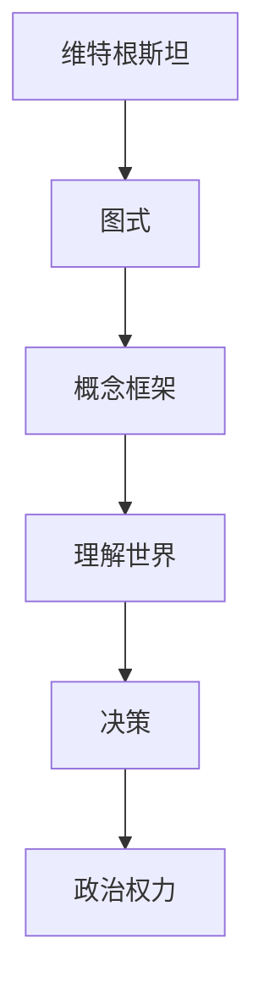
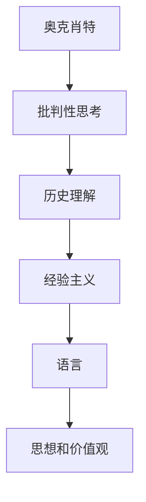
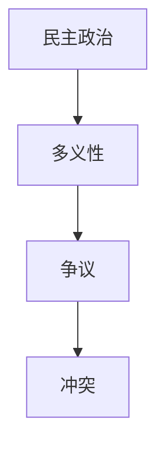
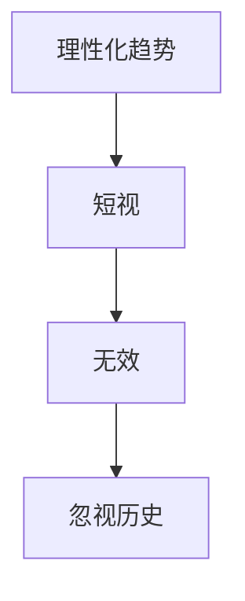

                 

### 文章标题：维特根斯坦与奥克肖特：政治哲学的语言维度

#### 关键词：维特根斯坦、奥克肖特、政治哲学、语言、维度

#### 摘要：
本文旨在探讨维特根斯坦和奥克肖特两位哲学家如何通过语言这一维度来审视政治哲学。维特根斯坦以其独特的语言分析视角，揭示了语言与政治权力的内在联系，而奥克肖特则通过批判性思考，探讨了语言如何影响政治决策和社会结构。文章首先介绍两位哲学家的背景和主要思想，然后深入分析他们的政治哲学观点及其在现实中的应用，最后总结他们的理论对现代政治哲学的影响，并提出未来研究方向。

### 维特根斯坦的政治哲学

#### 维特根斯坦的生平与哲学思想

路德维希·维特根斯坦（Ludwig Wittgenstein，1889-1951）是20世纪最重要的哲学家之一。他的哲学思想主要分为两个阶段：早期的逻辑原子主义和后期的语言游戏理论。维特根斯坦认为，哲学的根本问题在于语言的混乱和误解。他通过分析和澄清语言的使用，试图揭示哲学问题的真正本质。

#### 语言与政治权力

维特根斯坦的语言哲学对于理解政治哲学具有重要意义。他认为，语言不仅是表达思想的工具，也是社会结构和政治权力的基础。在《逻辑哲学论》中，维特根斯坦提出了“图式”概念，用来描述语言与现实世界之间的关系。图式可以被视为一种概念框架，它帮助我们理解世界并做出决策。

#### 维特根斯坦的政治哲学应用

维特根斯坦的理论在政治哲学中有着广泛的应用。例如，他在《文化与社会》一书中，批判了当时流行的功利主义和集体主义政治理论。他认为，这些理论忽视了个体自由和自主性的重要性。通过语言分析，维特根斯坦揭示了政治权力的本质，以及语言如何被用来维护或颠覆现有的政治秩序。

### 奥克肖特的政治哲学

#### 奥克肖特的生平与哲学思想

迈克尔·奥克肖特（Michael Oakeshott，1901-1990）是20世纪英国著名的政治哲学家。他的哲学思想以对传统和历史的重视为特征。奥克肖特认为，政治哲学的根本问题是如何处理不确定性。他提出了“理智主义”和“经验主义”两种政治观念，并认为现代社会过于依赖理智主义，忽视了经验主义的重要性。

#### 批判性思考与语言

奥克肖特的政治哲学强调批判性思考的重要性。他认为，政治决策应该基于对历史的深刻理解和经验主义的反思。在这种背景下，语言的作用显得尤为重要。奥克肖特认为，语言不仅传递信息，还塑造我们的思想和价值观。

#### 奥克肖特的政治哲学应用

奥克肖特的理论在多个政治领域有着重要的应用。例如，他在《理性、传统与史学研究》中批判了现代政治制度的理性化趋势。他认为，这种趋势导致了政治决策的短视化和无效性。通过语言的分析，奥克肖特揭示了政治决策中的内在矛盾和不确定性，并提出了一种更加稳健的政治哲学。

### 语言与政治哲学

#### 语言在政治哲学中的作用

语言在政治哲学中起着至关重要的作用。它不仅是政治讨论的工具，也是政治权力的基础。维特根斯坦和奥克肖特都认为，语言的使用决定了我们对政治世界的理解和认知。通过语言分析，我们可以揭示政治权力的本质，以及政治决策背后的隐含假设。

#### 维特根斯坦与奥克肖特的语言分析

维特根斯坦和奥克肖特的语言分析方法有所不同。维特根斯坦强调语言的“用法”，而奥克肖特则关注语言的“意义”。维特根斯坦通过分析日常语言的使用，揭示了语言与现实世界之间的复杂关系。奥克肖特则通过批判性思考，探讨了语言如何影响政治决策和社会结构。

### 案例研究

#### 案例一：民主政治中的语言问题

在民主政治中，语言的使用至关重要。维特根斯坦和奥克肖特的理论可以用来分析民主政治中的语言问题。维特根斯坦认为，民主政治中的语言问题主要体现在“民主”一词的多义性上。不同的政治派别可能对“民主”有不同的理解，这导致了政治争议和冲突。

奥克肖特则认为，民主政治中的语言问题主要体现在政治话语的理性化趋势上。这种趋势使得政治决策变得过于短视和无效，忽视了历史的经验和传统。

### 结论

#### 维特根斯坦与奥克肖特的共同点与区别

维特根斯坦和奥克肖特都是20世纪重要的政治哲学家，他们的理论对现代政治哲学产生了深远的影响。他们的共同点在于都强调语言在政治哲学中的重要性。他们的区别在于维特根斯坦更注重语言的“用法”，而奥克肖特则更关注语言的“意义”。

#### 理论对现代政治哲学的影响

维特根斯坦和奥克肖特的理论为我们理解政治哲学提供了新的视角。维特根斯坦的语言分析帮助我们认识到语言在政治权力和决策中的关键作用，而奥克肖特的批判性思考则提醒我们，政治决策需要更多的历史和经验主义反思。

#### 未来研究方向

未来的研究可以进一步探索维特根斯坦和奥克肖特的理论在当代政治现实中的应用。此外，也可以探讨其他哲学家的政治哲学理论，以及它们与维特根斯坦和奥克肖特的理论之间的联系和区别。

### 作者信息

作者：AI天才研究院/AI Genius Institute & 禅与计算机程序设计艺术 /Zen And The Art of Computer Programming

---

本文通过维特根斯坦和奥克肖特的政治哲学视角，深入探讨了语言在政治哲学中的多维作用。两位哲学家的理论不仅揭示了政治权力的本质，也为我们理解政治决策和社会结构提供了新的视角。本文希望对读者理解现代政治哲学提供一些启示，并激发进一步研究的兴趣。

