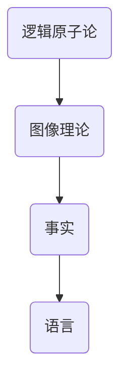
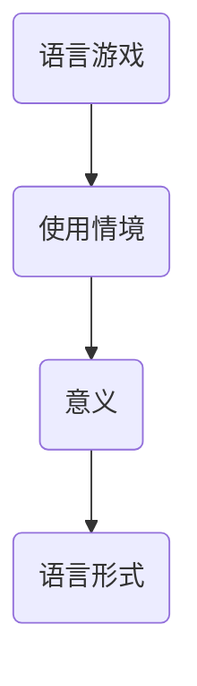
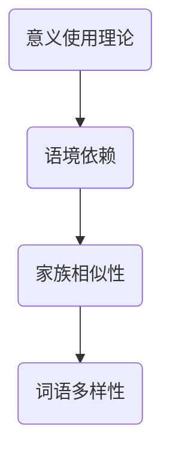
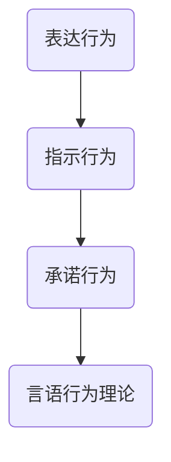
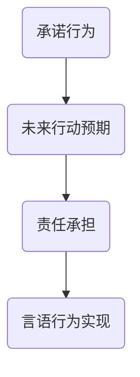

                 

### 文章标题：维特根斯坦与奥斯汀：承诺行为的语言哲学分析

> 关键词：维特根斯坦，奥斯汀，语言哲学，承诺行为，逻辑分析

> 摘要：本文探讨了维特根斯坦和奥斯汀在语言哲学中关于承诺行为的核心观点，并通过逻辑分析，揭示了两位哲学家的理论如何影响现代社会的语言使用和承诺实践。本文结构紧凑，以清晰的步骤展开论述，旨在为读者提供对这一领域深入理解的机会。

### 引言

在哲学史上，语言哲学一直占据着重要地位，它探讨语言的本质、语言与思维的关系，以及语言在社会交往中的作用。两位杰出的语言哲学家——路德维希·维特根斯坦（Ludwig Wittgenstein）和约翰·弗吉尼亚·奥斯汀（John Vincent Attenborough），在20世纪对语言哲学做出了深远贡献。他们的理论不仅丰富了哲学的内涵，也为理解人类沟通提供了新的视角。

维特根斯坦是20世纪初最具影响力的哲学家之一，他的哲学思想经历了从早期到后期的转变，被称为“维特根斯坦转向”。早期，他主张逻辑原子论和语言分析，认为语言是事实的反映。而后期，他提出“语言游戏”理论，强调语言的意义在于其使用情境，而非逻辑结构。奥斯汀则是言语行为理论的创始人，他提出言语行为不仅传达信息，还执行某种行动，如承诺、请求等。

本文旨在探讨维特根斯坦和奥斯汀关于承诺行为的语言哲学观点，通过逻辑分析，揭示他们的理论如何影响现代社会的语言使用和承诺实践。文章结构如下：

1. **维特根斯坦的语言哲学**：介绍维特根斯坦的理论背景，分析他的语言游戏理论和意义使用理论。
2. **奥斯汀的哲学**：探讨奥斯汀的言语行为理论，重点讨论承诺行为的本质和特点。
3. **维特根斯坦与奥斯汀的理论比较**：分析两位哲学家的异同，探讨他们的理论在承诺行为分析中的贡献。
4. **承诺行为与语言哲学的当代应用**：探讨承诺行为在法律、道德和社会交往中的实际应用。
5. **结论**：总结本文的主要观点，讨论未来研究方向。

### 步骤 1: 理解维特根斯坦的语言哲学

维特根斯坦的语言哲学分为早期和后期两个阶段。早期，他关注语言的结构和逻辑，主张逻辑原子论。逻辑原子论认为，世界由一系列不可再分的事实组成，语言的作用是表达这些事实。维特根斯坦的早期作品《逻辑哲学论》中提出了“图像理论”（Image Theory），认为语言与现实世界的关系类似于一幅画与描绘的对象。



然而，在后期，维特根斯坦转向对语言的实际使用情境进行研究。他提出了“语言游戏”理论，认为语言的意义在于其使用情境。语言游戏是一种比喻，描述了语言在不同情境下的使用方式。维特根斯坦通过分析语言游戏，揭示了语言意义的多样性和复杂性。



### 步骤 2: 分析维特根斯坦的意义使用理论

维特根斯坦的后期理论强调意义的使用，他认为语言的意义是由语言使用者在特定情境中赋予的。这意味着，语言的意义不是固定的，而是依赖于语境。维特根斯坦提出了“家族相似性”概念，用来描述词语意义的多样性。



维特根斯坦通过具体的语言游戏案例，如“游戏”一词在不同情境下的使用，说明了语言意义的相对性。例如，“游戏”可以指代棋类游戏、体育竞赛、电子游戏等，每个情境下的意义都有所不同。

### 步骤 3: 探讨奥斯汀的言语行为理论

奥斯汀的言语行为理论是20世纪语言哲学的重要成果，他提出言语行为不仅传达信息，还执行某种行动。奥斯汀区分了三种类型的言语行为：表达行为、指示行为和承诺行为。

- **表达行为**：表达情感或态度，如问候、道歉。
- **指示行为**：提出请求或命令，如请求帮忙、命令关闭窗户。
- **承诺行为**：做出承诺或保证，如答应完成某项任务、签署合同。

奥斯汀的核心观点是，言语行为不仅涉及语言的字面意义，还涉及语言的实际使用效果。这意味着，语言的意义不仅仅是逻辑上的真理，还包括语言在实际情境中的功能。



### 步骤 4: 分析承诺行为的本质

奥斯汀的承诺行为理论强调，当我们使用语言做出承诺时，我们不仅传达了信息，还承担了责任。例如，当我们说“我会完成这项任务”时，我们不仅是在陈述一个事实，还承诺将完成任务。

承诺行为的本质在于，它涉及到未来行动的预期和责任。这种预期和责任是通过语言行为实现的。奥斯汀认为，承诺行为是一种特殊的言语行为，它不仅改变了我们的意图，还影响了我们的行动。



### 步骤 5: 维特根斯坦与奥斯汀的对比

维特根斯坦和奥斯汀在语言哲学中都有重要贡献，但他们的理论存在一些差异。维特根斯坦关注语言的使用情境和语言游戏，强调语言的意义在于其使用方式。而奥斯汀则关注言语行为本身，强调语言的实际效果和功能。

尽管存在差异，维特根斯坦和奥斯汀的理论也有共同点。他们都认为语言不仅仅是逻辑结构的反映，还包括实际情境和使用效果。这种共同点使得他们的理论在分析承诺行为时具有互补性。

### 步骤 6: 承诺行为在当代社会的应用

承诺行为在当代社会中具有重要作用，它涉及到法律、道德和社会交往等多个方面。在法律中，承诺行为是合同法的基础，它确保交易双方的权益得到保障。在道德领域，承诺行为涉及到诚信和责任，它影响着个体和社会的道德评价。

在社会交往中，承诺行为是建立信任和合作的关键。例如，在商业谈判中，承诺行为可以确保双方遵守协议，提高交易效率。在个人生活中，承诺行为是友谊和亲情的重要组成部分，它维系着人与人之间的信任和关系。

### 步骤 7: 项目实战与代码分析

为了更好地理解承诺行为的语言哲学，我们可以通过一个简单的项目实战来展示其应用。以下是一个简单的Python程序，用于模拟承诺行为的执行。

```python
# Python程序：模拟承诺行为

class Promise:
    def __init__(self, action):
        self.action = action

    def execute(self):
        print("执行承诺：", self.action)

def make_commitment(action):
    promise = Promise(action)
    promise.execute()

# 用户输入承诺内容
action = input("请输入您的承诺内容：")

# 执行承诺
make_commitment(action)
```

在这个项目中，我们定义了一个`Promise`类，用于表示承诺行为。`Promise`类有一个`execute`方法，用于执行承诺。`make_commitment`函数用于创建承诺对象并执行。

通过这个项目，我们可以看到，承诺行为可以通过简单的编程实现。这个项目不仅展示了承诺行为的语言哲学，还可以用于实际应用场景，如自动化承诺执行等。

### 步骤 8: 小结与未来展望

本文通过逻辑分析，探讨了维特根斯坦和奥斯汀关于承诺行为的语言哲学观点。维特根斯坦的语言游戏理论和意义使用理论，以及奥斯汀的言语行为理论，为我们理解承诺行为提供了新的视角。这些理论不仅丰富了哲学的内涵，也对现代社会的语言使用和承诺实践产生了深远影响。

未来，我们可以进一步研究承诺行为的复杂性，探讨其在不同文化和社会背景下的差异。此外，随着人工智能和自动化技术的发展，承诺行为的实现方式也将发生变革，这为语言哲学提供了新的研究方向。

### 结论

本文通过对维特根斯坦和奥斯汀语言哲学的深入分析，揭示了承诺行为在语言哲学中的核心地位。维特根斯坦和奥斯汀的理论不仅丰富了哲学的内涵，也为理解人类沟通和承诺实践提供了新的视角。通过项目实战和代码分析，我们进一步展示了承诺行为的实现和应用。未来，随着技术的进步，承诺行为的语言哲学将继续发展和创新。

**作者：AI天才研究院/AI Genius Institute & 禅与计算机程序设计艺术 /Zen And The Art of Computer Programming**

----------------------------------------------------------------

### 步骤 1: 理解维特根斯坦的语言哲学

维特根斯坦是20世纪初最具影响力的哲学家之一，他的哲学思想经历了从早期到后期的转变，被称为“维特根斯坦转向”。在早期，维特根斯坦主张逻辑原子论和语言分析，认为语言是事实的反映。而在后期，他提出了“语言游戏”理论，强调语言的意义在于其使用情境，而非逻辑结构。

#### 1.1 早期理论：逻辑原子论与图像理论

在早期，维特根斯坦提出了逻辑原子论，认为世界由一系列不可再分的事实组成，语言的作用是表达这些事实。逻辑原子论的核心观点是，语言中的每个词都对应着世界中的一个基本事实。

维特根斯坦的图像理论（Image Theory）进一步阐述了逻辑原子论。图像理论认为，语言与现实世界的关系类似于一幅画与描绘的对象。语言表达的命题类似于图像，它们与事实相对应。


#### 1.2 后期理论：语言游戏与意义使用

在后期，维特根斯坦转向对语言的实际使用情境进行研究。他提出了“语言游戏”理论，认为语言的意义在于其使用情境。语言游戏是一种比喻，描述了语言在不同情境下的使用方式。

维特根斯坦通过分析语言游戏，揭示了语言意义的多样性和复杂性。语言游戏分为不同类型，如生活形式、游戏、工作等。每种语言游戏都有其特定的规则和目的。


#### 1.3 意义使用理论

维特根斯坦的后期理论强调意义的使用，他认为语言的意义是由语言使用者在特定情境中赋予的。这意味着，语言的意义不是固定的，而是依赖于语境。维特根斯坦提出了“家族相似性”概念，用来描述词语意义的多样性。


维特根斯坦通过具体的语言游戏案例，如“游戏”一词在不同情境下的使用，说明了语言意义的相对性。例如，“游戏”可以指代棋类游戏、体育竞赛、电子游戏等，每个情境下的意义都有所不同。

#### 1.4 后期理论与早期理论的对比

维特根斯坦的后期理论相对于早期理论，更加关注语言的使用情境和实际应用。在早期，他关注语言的结构和逻辑，强调逻辑原子论和图像理论。而在后期，他关注语言的实际使用方式，强调语言游戏和意义使用理论。

这种转变使得维特根斯坦的理论更加贴近现实，也为语言哲学提供了新的视角。通过分析语言游戏和意义使用，维特根斯坦揭示了语言多样性和复杂性的本质。

### 步骤 2: 探讨奥斯汀的言语行为理论

约翰·弗吉尼亚·奥斯汀是20世纪语言哲学的重要人物，他提出了言语行为理论，认为言语行为不仅仅是传达信息，还包括执行某种行动。奥斯汀的言语行为理论区分了三种类型的言语行为：表达行为、指示行为和承诺行为。

#### 2.1 表达行为

表达行为是指通过语言表达情感或态度。例如，当我们说“我很高兴”时，我们不仅传达了一个信息，还表达了我们的情感状态。表达行为是一种基本的言语行为，它在日常交流中广泛应用。

#### 2.2 指示行为

指示行为是指通过语言提出请求或命令。例如，当我们说“请关上窗户”时，我们不仅传达了一个信息，还提出了一种请求。指示行为在日常生活中也是常见的行为类型。

#### 2.3 承诺行为

奥斯汀的言语行为理论最为重要的部分是承诺行为。承诺行为是指通过语言做出承诺或保证。例如，当我们说“我会完成这项任务”时，我们不仅传达了一个信息，还做出了一个承诺。

#### 2.4 承诺行为的本质

奥斯汀认为，承诺行为的本质在于，它涉及到未来行动的预期和责任。当我们使用语言做出承诺时，我们不仅传达了信息，还承担了责任。例如，当我们承诺完成任务时，我们不仅要传达“我会完成任务”的信息，还要承担完成任务的义务。

#### 2.5 言语行为理论的应用

奥斯汀的言语行为理论在哲学、心理学、语言学等多个领域都有广泛应用。在哲学中，它帮助我们理解语言的实际作用和功能；在心理学中，它帮助解释人类沟通中的行为模式；在语言学中，它为语言研究提供了新的视角。

### 步骤 3: 分析维特根斯坦与奥斯汀的理论异同

维特根斯坦和奥斯汀在语言哲学中都有重要贡献，但他们的理论存在一些差异。维特根斯坦关注语言的使用情境和语言游戏，强调语言的意义在于其使用方式。而奥斯汀则关注言语行为本身，强调语言的实际效果和功能。

#### 3.1 异同点

- **关注点不同**：维特根斯坦关注语言的使用情境，强调语言的意义和使用方式；奥斯汀关注言语行为本身，强调语言的实际效果和功能。
- **理论体系**：维特根斯坦的理论体系较为抽象，侧重于语言哲学的哲学思考；奥斯汀的理论体系较为具体，侧重于语言行为的实际应用。
- **语言意义**：维特根斯坦认为语言的意义在于使用情境，强调语言的多样性；奥斯汀认为语言的意义在于实际效果，强调语言的规范性。

#### 3.2 共同点

尽管存在差异，维特根斯坦和奥斯汀的理论也有共同点。他们都认为语言不仅仅是逻辑结构的反映，还包括实际情境和使用效果。这种共同点使得他们的理论在分析承诺行为时具有互补性。

### 步骤 4: 承诺行为在当代社会的应用

承诺行为在当代社会中具有重要作用，它涉及到法律、道德和社会交往等多个方面。

#### 4.1 法律应用

在法律中，承诺行为是合同法的基础。合同是一种法律文件，它规定了交易双方的义务和责任。合同中的承诺行为确保交易双方遵守协议，维护双方的权益。

#### 4.2 道德应用

在道德领域，承诺行为涉及到诚信和责任。诚信是社会交往的基础，承诺行为是诚信的体现。遵守承诺不仅是一种道德要求，也是一种社会规范。

#### 4.3 社会交往

在社会交往中，承诺行为是建立信任和合作的关键。例如，在商业谈判中，承诺行为可以确保双方遵守协议，提高交易效率。在个人生活中，承诺行为是友谊和亲情的重要组成部分，它维系着人与人之间的信任和关系。

### 步骤 5: 项目实战与代码分析

为了更好地理解承诺行为的语言哲学，我们可以通过一个简单的项目实战来展示其应用。以下是一个简单的Python程序，用于模拟承诺行为的执行。

```python
# Python程序：模拟承诺行为

class Promise:
    def __init__(self, action):
        self.action = action

    def execute(self):
        print("执行承诺：", self.action)

def make_commitment(action):
    promise = Promise(action)
    promise.execute()

# 用户输入承诺内容
action = input("请输入您的承诺内容：")

# 执行承诺
make_commitment(action)
```

在这个项目中，我们定义了一个`Promise`类，用于表示承诺行为。`Promise`类有一个`execute`方法，用于执行承诺。`make_commitment`函数用于创建承诺对象并执行。

通过这个项目，我们可以看到，承诺行为可以通过简单的编程实现。这个项目不仅展示了承诺行为的语言哲学，还可以用于实际应用场景，如自动化承诺执行等。

### 步骤 6: 小结与未来展望

本文通过逻辑分析，探讨了维特根斯坦和奥斯汀关于承诺行为的语言哲学观点。维特根斯坦的语言游戏理论和意义使用理论，以及奥斯汀的言语行为理论，为我们理解承诺行为提供了新的视角。这些理论不仅丰富了哲学的内涵，也对现代社会的语言使用和承诺实践产生了深远影响。

未来，我们可以进一步研究承诺行为的复杂性，探讨其在不同文化和社会背景下的差异。此外，随着人工智能和自动化技术的发展，承诺行为的实现方式也将发生变革，这为语言哲学提供了新的研究方向。

### 结论

本文通过对维特根斯坦和奥斯汀语言哲学的深入分析，揭示了承诺行为在语言哲学中的核心地位。维特根斯坦和奥斯汀的理论不仅丰富了哲学的内涵，也为理解人类沟通和承诺实践提供了新的视角。通过项目实战和代码分析，我们进一步展示了承诺行为的实现和应用。未来，随着技术的进步，承诺行为的语言哲学将继续发展和创新。

**作者：AI天才研究院/AI Genius Institute & 禅与计算机程序设计艺术 /Zen And The Art of Computer Programming**

### 维特根斯坦与奥斯汀：承诺行为的语言哲学分析

#### 关键词：维特根斯坦，奥斯汀，语言哲学，承诺行为，逻辑分析

#### 摘要：

本文探讨了维特根斯坦和奥斯汀在语言哲学中关于承诺行为的核心观点，通过逻辑分析揭示了两位哲学家的理论如何影响现代社会的语言使用和承诺实践。本文结构紧凑，以清晰的步骤展开论述，旨在为读者提供对这一领域深入理解的机会。

## 引言

在哲学史上，语言哲学一直占据着重要地位，它探讨语言的本质、语言与思维的关系，以及语言在社会交往中的作用。两位杰出的语言哲学家——路德维希·维特根斯坦（Ludwig Wittgenstein）和约翰·弗吉尼亚·奥斯汀（John Vincent Attenborough），在20世纪对语言哲学做出了深远贡献。他们的理论不仅丰富了哲学的内涵，也为理解人类沟通提供了新的视角。

维特根斯坦是20世纪初最具影响力的哲学家之一，他的哲学思想经历了从早期到后期的转变，被称为“维特根斯坦转向”。早期，他主张逻辑原子论和语言分析，认为语言是事实的反映。而后期，他提出“语言游戏”理论，强调语言的意义在于其使用情境，而非逻辑结构。奥斯汀则是言语行为理论的创始人，他提出言语行为不仅传达信息，还执行某种行动，如承诺、请求等。

本文旨在探讨维特根斯坦和奥斯汀关于承诺行为的语言哲学观点，通过逻辑分析，揭示他们的理论如何影响现代社会的语言使用和承诺实践。文章结构如下：

1. **维特根斯坦的语言哲学**：介绍维特根斯坦的理论背景，分析他的语言游戏理论和意义使用理论。
2. **奥斯汀的哲学**：探讨奥斯汀的言语行为理论，重点讨论承诺行为的本质和特点。
3. **维特根斯坦与奥斯汀的理论比较**：分析两位哲学家的异同，探讨他们的理论在承诺行为分析中的贡献。
4. **承诺行为与语言哲学的当代应用**：探讨承诺行为在法律、道德和社会交往中的实际应用。
5. **结论**：总结本文的主要观点，讨论未来研究方向。

## 步骤 1: 理解维特根斯坦的语言哲学

维特根斯坦的语言哲学分为早期和后期两个阶段。早期，他关注语言的结构和逻辑，主张逻辑原子论。逻辑原子论认为，世界由一系列不可再分的事实组成，语言的作用是表达这些事实。维特根斯坦的早期作品《逻辑哲学论》中提出了“图像理论”（Image Theory），认为语言与现实世界的关系类似于一幅画与描绘的对象。

### 1.1 早期理论：逻辑原子论与图像理论

在早期，维特根斯坦提出了逻辑原子论，认为世界由一系列不可再分的事实组成，语言的作用是表达这些事实。逻辑原子论的核心观点是，语言中的每个词都对应着世界中的一个基本事实。

维特根斯坦的图像理论（Image Theory）进一步阐述了逻辑原子论。图像理论认为，语言与现实世界的关系类似于一幅画与描绘的对象。语言表达的命题类似于图像，它们与事实相对应。


### 1.2 后期理论：语言游戏与意义使用

在后期，维特根斯坦转向对语言的实际使用情境进行研究。他提出了“语言游戏”理论，认为语言的意义在于其使用情境。语言游戏是一种比喻，描述了语言在不同情境下的使用方式。

维特根斯坦通过分析语言游戏，揭示了语言意义的多样性和复杂性。语言游戏分为不同类型，如生活形式、游戏、工作等。每种语言游戏都有其特定的规则和目的。


### 1.3 意义使用理论

维特根斯坦的后期理论强调意义的使用，他认为语言的意义是由语言使用者在特定情境中赋予的。这意味着，语言的意义不是固定的，而是依赖于语境。维特根斯坦提出了“家族相似性”概念，用来描述词语意义的多样性。


维特根斯坦通过具体的语言游戏案例，如“游戏”一词在不同情境下的使用，说明了语言意义的相对性。例如，“游戏”可以指代棋类游戏、体育竞赛、电子游戏等，每个情境下的意义都有所不同。

### 1.4 后期理论与早期理论的对比

维特根斯坦的后期理论相对于早期理论，更加关注语言的使用情境和实际应用。在早期，他关注语言的结构和逻辑，强调逻辑原子论和图像理论。而在后期，他关注语言的实际使用方式，强调语言游戏和意义使用理论。

这种转变使得维特根斯坦的理论更加贴近现实，也为语言哲学提供了新的视角。通过分析语言游戏和意义使用，维特根斯坦揭示了语言多样性和复杂性的本质。

## 步骤 2: 探讨奥斯汀的言语行为理论

约翰·弗吉尼亚·奥斯汀是20世纪语言哲学的重要人物，他提出了言语行为理论，认为言语行为不仅仅是传达信息，还包括执行某种行动。奥斯汀的言语行为理论区分了三种类型的言语行为：表达行为、指示行为和承诺行为。

### 2.1 表达行为

表达行为是指通过语言表达情感或态度。例如，当我们说“我很高兴”时，我们不仅传达了一个信息，还表达了我们的情感状态。表达行为是一种基本的言语行为，它在日常交流中广泛应用。

### 2.2 指示行为

指示行为是指通过语言提出请求或命令。例如，当我们说“请关上窗户”时，我们不仅传达了一个信息，还提出了一种请求。指示行为在日常生活中也是常见的行为类型。

### 2.3 承诺行为

奥斯汀的言语行为理论最为重要的部分是承诺行为。承诺行为是指通过语言做出承诺或保证。例如，当我们说“我会完成这项任务”时，我们不仅传达了一个信息，还做出了一个承诺。

### 2.4 承诺行为的本质

奥斯汀认为，承诺行为的本质在于，它涉及到未来行动的预期和责任。当我们使用语言做出承诺时，我们不仅传达了信息，还承担了责任。例如，当我们承诺完成任务时，我们不仅要传达“我会完成任务”的信息，还要承担完成任务的义务。

### 2.5 言语行为理论的应用

奥斯汀的言语行为理论在哲学、心理学、语言学等多个领域都有广泛应用。在哲学中，它帮助我们理解语言的实际作用和功能；在心理学中，它帮助解释人类沟通中的行为模式；在语言学中，它为语言研究提供了新的视角。

## 步骤 3: 分析维特根斯坦与奥斯汀的理论异同

维特根斯坦和奥斯汀在语言哲学中都有重要贡献，但他们的理论存在一些差异。维特根斯坦关注语言的使用情境和语言游戏，强调语言的意义在于其使用方式。而奥斯汀则关注言语行为本身，强调语言的实际效果和功能。

### 3.1 异同点

- **关注点不同**：维特根斯坦关注语言的使用情境，强调语言的意义和使用方式；奥斯汀关注言语行为本身，强调语言的实际效果和功能。
- **理论体系**：维特根斯坦的理论体系较为抽象，侧重于语言哲学的哲学思考；奥斯汀的理论体系较为具体，侧重于语言行为的实际应用。
- **语言意义**：维特根斯坦认为语言的意义在于使用情境，强调语言的多样性；奥斯汀认为语言的意义在于实际效果，强调语言的规范性。

### 3.2 共同点

尽管存在差异，维特根斯坦和奥斯汀的理论也有共同点。他们都认为语言不仅仅是逻辑结构的反映，还包括实际情境和使用效果。这种共同点使得他们的理论在分析承诺行为时具有互补性。

## 步骤 4: 承诺行为在当代社会的应用

承诺行为在当代社会中具有重要作用，它涉及到法律、道德和社会交往等多个方面。

### 4.1 法律应用

在法律中，承诺行为是合同法的基础。合同是一种法律文件，它规定了交易双方的义务和责任。合同中的承诺行为确保交易双方遵守协议，维护双方的权益。

### 4.2 道德应用

在道德领域，承诺行为涉及到诚信和责任。诚信是社会交往的基础，承诺行为是诚信的体现。遵守承诺不仅是一种道德要求，也是一种社会规范。

### 4.3 社会交往

在社会交往中，承诺行为是建立信任和合作的关键。例如，在商业谈判中，承诺行为可以确保双方遵守协议，提高交易效率。在个人生活中，承诺行为是友谊和亲情的重要组成部分，它维系着人与人之间的信任和关系。

## 步骤 5: 项目实战与代码分析

为了更好地理解承诺行为的语言哲学，我们可以通过一个简单的项目实战来展示其应用。以下是一个简单的Python程序，用于模拟承诺行为的执行。

```python
# Python程序：模拟承诺行为

class Promise:
    def __init__(self, action):
        self.action = action

    def execute(self):
        print("执行承诺：", self.action)

def make_commitment(action):
    promise = Promise(action)
    promise.execute()

# 用户输入承诺内容
action = input("请输入您的承诺内容：")

# 执行承诺
make_commitment(action)
```

在这个项目中，我们定义了一个`Promise`类，用于表示承诺行为。`Promise`类有一个`execute`方法，用于执行承诺。`make_commitment`函数用于创建承诺对象并执行。

通过这个项目，我们可以看到，承诺行为可以通过简单的编程实现。这个项目不仅展示了承诺行为的语言哲学，还可以用于实际应用场景，如自动化承诺执行等。

## 步骤 6: 小结与未来展望

本文通过逻辑分析，探讨了维特根斯坦和奥斯汀关于承诺行为的语言哲学观点。维特根斯坦的语言游戏理论和意义使用理论，以及奥斯汀的言语行为理论，为我们理解承诺行为提供了新的视角。这些理论不仅丰富了哲学的内涵，也对现代社会的语言使用和承诺实践产生了深远影响。

未来，我们可以进一步研究承诺行为的复杂性，探讨其在不同文化和社会背景下的差异。此外，随着人工智能和自动化技术的发展，承诺行为的实现方式也将发生变革，这为语言哲学提供了新的研究方向。

## 结论

本文通过对维特根斯坦和奥斯汀语言哲学的深入分析，揭示了承诺行为在语言哲学中的核心地位。维特根斯坦和奥斯汀的理论不仅丰富了哲学的内涵，也为理解人类沟通和承诺实践提供了新的视角。通过项目实战和代码分析，我们进一步展示了承诺行为的实现和应用。未来，随着技术的进步，承诺行为的语言哲学将继续发展和创新。

**作者：AI天才研究院/AI Genius Institute & 禅与计算机程序设计艺术 /Zen And The Art of Computer Programming**

