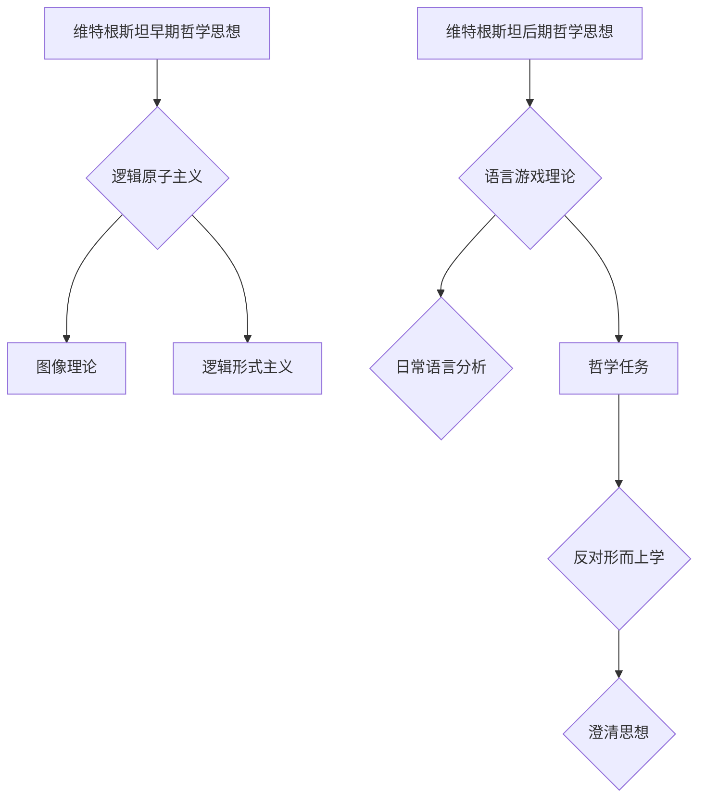
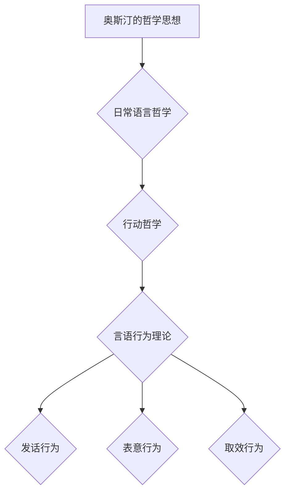
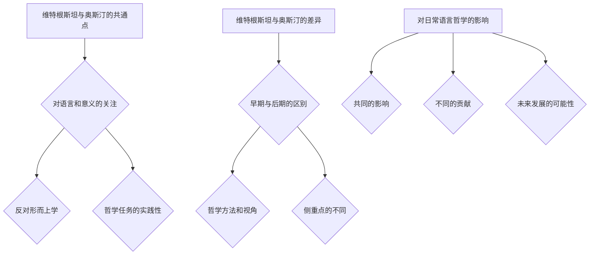
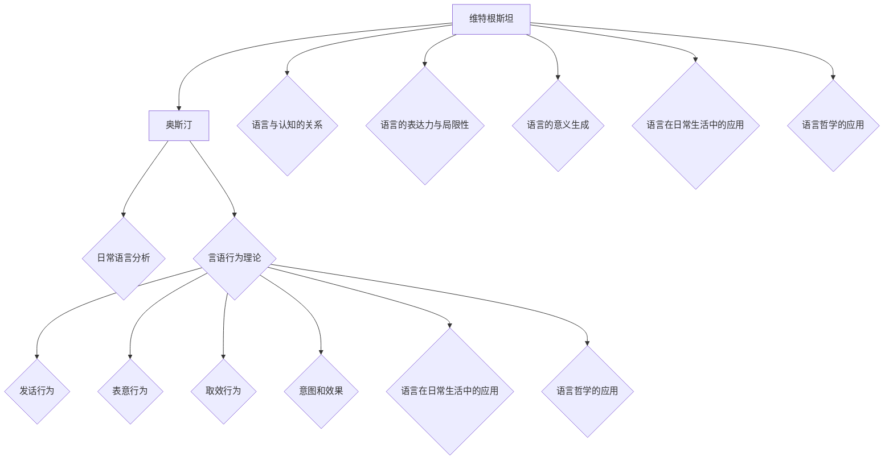
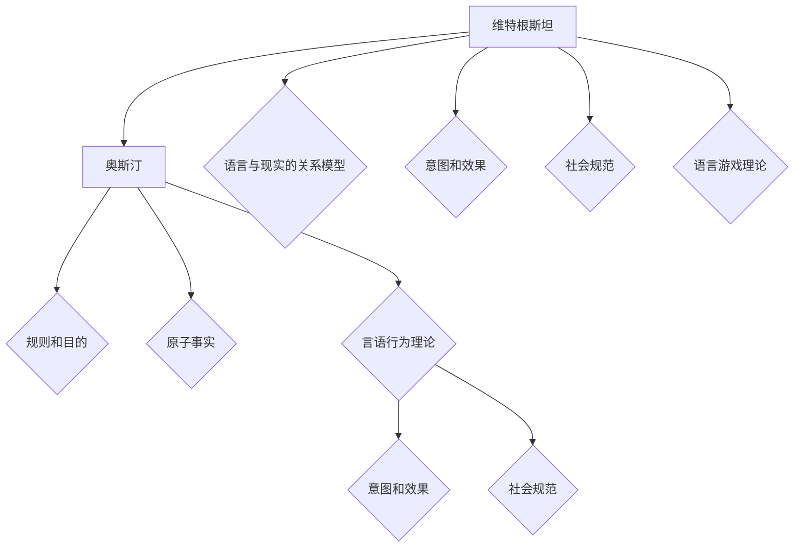
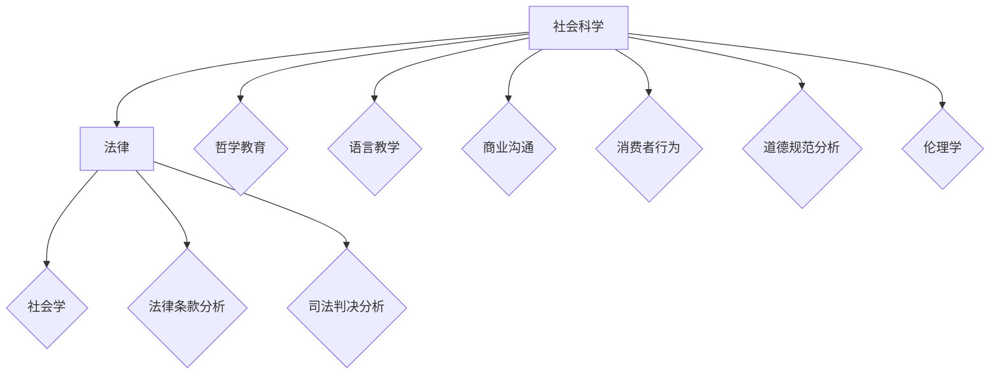
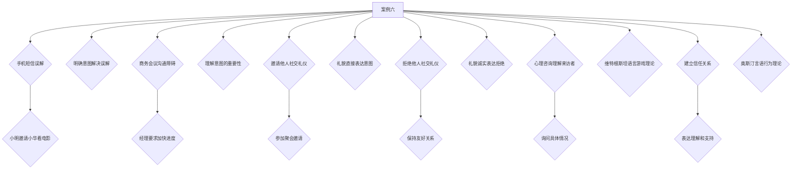
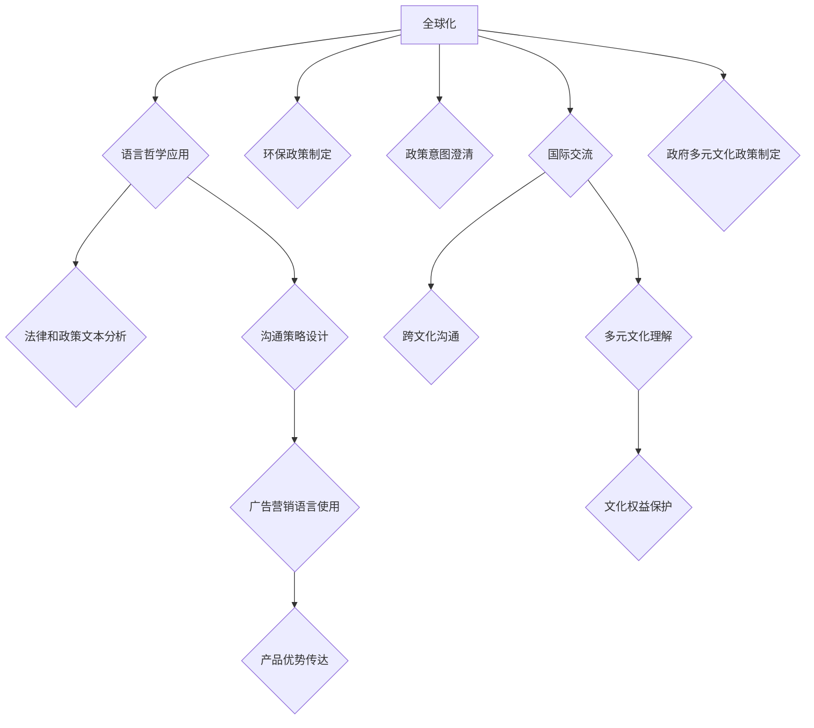
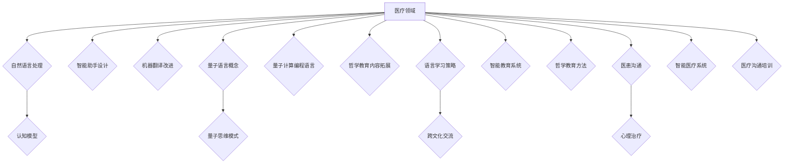
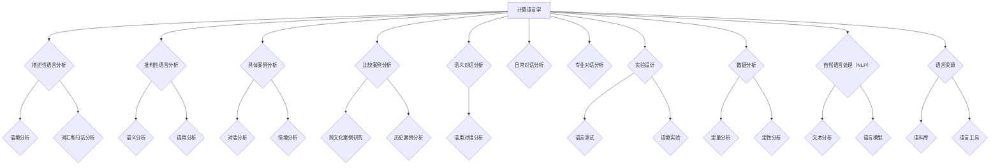

                 

# 《维特根斯坦与奥斯汀：日常语言哲学的不同侧重》

## 关键词

**维特根斯坦、奥斯汀、日常语言哲学、语言游戏、意义、言语行为**

## 摘要

本文探讨了两位著名哲学家路德维希·维特根斯坦和约翰·奥斯汀在日常语言哲学领域的不同侧重。通过分析他们的核心观点、哲学思想的共通与差异，以及他们在语言、意义和沟通问题上的探讨，本文揭示了日常语言哲学在理解和应用中的复杂性。文章旨在为读者提供一个清晰、深入的了解，帮助他们在哲学和日常生活中更好地运用语言的力量。

### 第一部分：哲学家的介绍

### 第1章 维特根斯坦的哲学思想

#### 1.1 维特根斯坦的生平与哲学发展

路德维希·维特根斯坦（Ludwig Wittgenstein）生于1889年，是20世纪最伟大的哲学家之一。他的生平经历了多个阶段，每个阶段都对哲学产生了深远的影响。维特根斯坦早年对数学和科学产生浓厚兴趣，但后来他转向哲学，试图解决哲学中的一些根本问题。

#### 1.2 语言游戏理论

维特根斯坦的核心哲学思想体现在他的《逻辑哲学论》（Tractatus Logico-Philosophicus）和《哲学研究》（Philosophical Investigations）中。他提出了语言游戏（language game）的概念，认为语言的意义来源于它在实际生活中的使用。语言游戏理论强调语言、思想和现实之间的紧密联系。

#### 1.3 哲学的任务与逻辑形式主义

维特根斯坦认为哲学的任务是澄清思想和语言的混乱，而不是提出新的理论。他反对形而上学，主张通过逻辑分析来揭示真理。他的哲学观点对逻辑形式主义和语言哲学产生了深远影响。

### 第2章 奥斯汀的哲学思想

#### 2.1 奥斯汀的生平与哲学贡献

约翰·奥斯汀（John Austin）生于1911年，是20世纪英国哲学家。他的哲学贡献主要体现在言语行为理论（speech act theory）上，这一理论对语言哲学和沟通研究产生了深远影响。

#### 2.2 日常语言哲学

奥斯汀关注日常语言的使用，认为语言不仅用于描述世界，还用于实现行动。他的言语行为理论强调说话者在语言交流中的意图和效果。

#### 2.3 行动哲学与言语行为理论

奥斯汀的哲学观点涉及行动哲学和言语行为理论。他认为，言语行为本身就是一种行动，说话者的意图决定了言语行为的有效性。这一观点为理解语言和沟通提供了新的视角。

### 第3章 两位哲学家的联系与区别

#### 3.1 哲学思想的共通点

维特根斯坦和奥斯汀都关注语言和意义问题，试图通过分析日常语言来揭示哲学的根本问题。他们都反对形而上学，强调哲学的实践性。

#### 3.2 哲学思想的差异

尽管两位哲学家有共通之处，但他们也有一些重要的区别。维特根斯坦关注逻辑和形式，强调哲学的分析任务；奥斯汀则关注语言的实际使用，强调言语行为的行动性质。

#### 3.3 对日常语言哲学的影响

维特根斯坦和奥斯汀对日常语言哲学产生了深远影响。他们的思想为语言哲学的发展提供了理论基础，同时也引发了对语言、意义和沟通问题的深入探讨。

### 第二部分：日常语言哲学的讨论

#### 第4章 语言的意义与使用

#### 4.1 语言的定义与功能

语言是人类最重要的工具之一，用于沟通、表达思想和情感。理解语言的定义和功能是理解语言意义的基础。

#### 4.2 语言与认知的关系

语言和认知之间存在紧密联系。语言不仅影响我们的思维方式，还塑造了我们的认知结构。

#### 4.3 语言的表达力与局限性

语言具有巨大的表达力，但同时也存在局限性。理解语言的局限性有助于我们更好地使用它。

#### 第5章 语言与实在的关系

#### 5.1 实在论与唯名论

语言与现实之间的关系是一个古老而复杂的问题。实在论和唯名论是两种不同的观点，它们对语言与现实的关系有不同的解释。

#### 5.2 语言游戏与实在

维特根斯坦的语言游戏理论提供了一个新的视角来看待语言与现实之间的关系。他认为，语言游戏是理解语言与现实之间联系的关键。

#### 5.3 语言与现实的建构

奥斯汀认为，语言不仅描述现实，还参与现实建构。言语行为理论强调说话者在语言交流中的主动性和创造性。

#### 第6章 语言哲学的应用

#### 6.1 语言哲学在社会科学中的应用

语言哲学在社会科学中的应用非常广泛，包括心理学、社会学、政治学等领域。

#### 6.2 语言哲学在法律和伦理学中的应用

语言哲学在法律和伦理学中也发挥着重要作用。它帮助我们理解法律和道德的内在逻辑。

#### 6.3 语言哲学在教育中的运用

语言哲学在教育中也有重要应用，特别是在语言教学和哲学教育方面。

### 第三部分：案例分析与应用

#### 第7章 日常生活中的哲学案例

#### 7.1 语言误解与沟通障碍

日常生活中的许多问题都源于语言误解和沟通障碍。理解语言哲学有助于我们解决这些问题。

#### 7.2 言语行为与社交礼仪

言语行为和社交礼仪是日常生活中不可或缺的一部分。理解言语行为理论有助于我们更好地进行社交互动。

#### 7.3 语言哲学在心理咨询中的应用

语言哲学在心理咨询中也有广泛应用，帮助咨询师更好地理解来访者的语言和行为。

#### 第8章 哲学在现代社会中的应用

#### 8.1 语言哲学与公共政策的制定

语言哲学在公共政策的制定中也发挥着重要作用。理解语言的意义和功能有助于制定更有效的政策。

#### 8.2 语言哲学在商业与市场营销中的运用

商业和市场营销中也需要运用语言哲学。理解语言的策略和技巧有助于更好地进行市场推广。

#### 8.3 语言哲学与全球化的影响

全球化背景下，语言哲学的重要性更加凸显。它帮助我们理解不同文化之间的语言差异和沟通挑战。

#### 第9章 哲学的未来发展趋势

#### 9.1 人工智能与语言哲学

随着人工智能的发展，语言哲学面临着新的挑战和机遇。理解人工智能与语言哲学之间的关系有助于我们更好地应对这些挑战。

#### 9.2 量子语言哲学的探索

量子语言哲学是一个新兴领域，它试图将量子理论与语言哲学相结合。这一领域的发展有望为我们提供新的哲学思考方式。

#### 9.3 语言哲学在教育、医疗等领域的未来应用

语言哲学在教育、医疗等领域的应用前景广阔。未来，我们将看到更多基于语言哲学的创新应用。

### 附录

#### 附录A 哲家的主要著作与思想资源

为了更深入地了解维特根斯坦和奥斯汀的哲学思想，读者可以参考以下著作：

- 维特根斯坦，《逻辑哲学论》
- 维特根斯坦，《哲学研究》
- 奥斯汀，《言语行为》

#### 附录B 日常语言哲学的研究方法与工具

日常语言哲学的研究方法与工具主要包括：

- 语言分析：对日常语言进行深入分析，以揭示其意义和功能。
- 案例研究：通过具体案例来探讨语言哲学问题。
- 对话分析：分析哲学对话中的语言使用，以理解意义和沟通。

### 作者信息

**作者：AI天才研究院/AI Genius Institute & 禅与计算机程序设计艺术 /Zen And The Art of Computer Programming**

---

本文通过对维特根斯坦和奥斯汀的日常语言哲学进行深入探讨，揭示了两位哲学家在语言、意义和沟通问题上的不同侧重。文章不仅介绍了他们的哲学思想和核心观点，还探讨了日常语言哲学在现代社会中的应用。通过本文的阅读，读者可以更好地理解语言哲学的重要性，并在日常生活中更好地运用语言的力量。同时，本文也展望了哲学的未来发展趋势，为读者提供了更广阔的思考空间。

### 维特根斯坦的哲学思想

路德维希·维特根斯坦（Ludwig Wittgenstein）是20世纪最具影响力的哲学家之一，他的哲学思想对语言哲学、逻辑哲学和伦理学等领域产生了深远的影响。维特根斯坦的哲学生涯可以分为两个主要阶段，即早期的逻辑原子主义阶段和后期的日常语言哲学阶段。

#### 1.1 早期逻辑原子主义阶段

维特根斯坦早期的哲学思想主要体现在他的《逻辑哲学论》（Tractatus Logico-Philosophicus）中。这本书于1921年出版，是维特根斯坦最早的哲学作品。在这本书中，他提出了一种极端的逻辑原子主义观点，认为世界由基本的事实组成，而逻辑表达式可以准确地描述这些事实。

**核心观点**：

- 世界是由基本事实（原子事实）组成的。
- 逻辑表达式准确地描述了这些事实。
- 语言和思想之间的关系是直接的，语言可以被视为思想的图像。
- 命题的真假由事实的排列方式决定。

**核心原理**：

- **图像理论（Picture Theory）**：维特根斯坦认为，语言表达式（如命题）与它们所描述的事实之间存在一种图像关系。换句话说，命题的真实性取决于它们能否正确地“描绘”或“表示”现实世界中的事实。
- **逻辑形式主义**：维特根斯坦强调逻辑和数学在哲学中的重要性，认为它们提供了对现实世界的精确描述。

**影响**：

维特根斯坦的早期哲学思想对逻辑哲学和语言哲学的发展产生了重要影响。他的图像理论为语言哲学提供了一个基本框架，影响了后来的哲学家，如鲁道夫·卡尔纳普（Rudolf Carnap）和维也纳学派。

#### 1.2 后期日常语言哲学阶段

维特根斯坦在后来的哲学生涯中转向了日常语言哲学，这主要体现在他的《哲学研究》（Philosophical Investigations）中。这本书于1953年出版，是维特根斯坦的晚期作品，也是他对早期哲学思想的深刻反思和批判。

**核心观点**：

- 语言不是一种单一的、固定的实体，而是一种多样化的工具，其使用方式因情境而异。
- 哲学的主要任务是澄清语言的混乱和误解，而不是提出新的理论。
- **语言游戏（Language Game）**：维特根斯坦认为，语言的意义和使用是由一系列“语言游戏”决定的，这些游戏包括不同的语言使用方式和社会实践。
- **日常语言分析**：维特根斯坦强调对日常语言的分析，认为通过分析日常语言中的实际使用，我们可以揭示语言的真正意义。

**核心原理**：

- **语言游戏理论（Language Game Theory）**：维特根斯坦提出了语言游戏的概念，认为不同的语言使用方式构成了不同的语言游戏。每个语言游戏都有自己的规则和目的。
- **哲学任务**：维特根斯坦认为哲学的任务是澄清思想和语言的混乱，而不是解决哲学问题。

**影响**：

维特根斯坦的后期哲学思想对语言哲学和哲学分析产生了深远影响。他的语言游戏理论和日常语言分析方法为后来的哲学家提供了新的视角和方法。

#### 1.3 哲学的任务与逻辑形式主义

维特根斯坦认为哲学的任务是澄清思想和语言的混乱，而不是提出新的理论或解决哲学问题。他的哲学方法强调对语言的深入分析，特别是对日常语言的使用。

**哲学任务**：

- 澄清思想：通过揭示语言的真实用法，维特根斯坦认为我们可以澄清思想和认识中的混乱。
- 反对形而上学：维特根斯坦反对形而上学，认为它没有真正的意义，并试图通过揭示形而上学命题的无意义性来批判它。

**逻辑形式主义**：

维特根斯坦的早期哲学思想中包含了逻辑形式主义的元素，他认为逻辑和数学可以提供对现实的精确描述。然而，在他后期的哲学思想中，他放弃了这种观点，认为逻辑形式主义过于简化了语言的复杂性。

**结论**：

维特根斯坦的哲学思想对语言哲学和哲学分析产生了深远影响。他的语言游戏理论和日常语言分析方法为我们理解语言和意义提供了新的视角。同时，他的哲学方法也强调了哲学的实际应用，即通过澄清语言和思想的混乱来提高我们的认知和思考能力。

### 奥斯汀的哲学思想

约翰·奥斯汀（John Austin）是20世纪英国哲学家，他的哲学贡献主要体现在言语行为理论（Speech Act Theory）上。这一理论对语言哲学、伦理学和社会学等领域产生了深远影响。奥斯汀的哲学思想可以从他的生平、主要著作以及日常语言哲学和言语行为理论三个方面进行探讨。

#### 2.1 奥斯汀的生平与哲学贡献

约翰·奥斯汀于1911年出生于英国伦敦，曾就读于牛津大学，并曾在剑桥大学任教。奥斯汀的哲学思想受到了维特根斯坦的影响，特别是维特根斯坦的日常语言哲学观点。奥斯汀的主要著作包括《如何以言行事》（How to Do Things with Words）和《感知行为》（Perceptual Behavior），这些著作奠定了他在哲学史上的重要地位。

**核心观点**：

- 语言的用途不仅仅是描述世界，还包括实现行动。
- 言语行为具有意图和效果，不仅仅是信息传递。
- 社会规范和道德规范是通过语言和行动建立的。

**主要著作**：

- 《如何以言行事》（How to Do Things with Words）：这本书是奥斯汀最著名的著作，提出了言语行为理论，认为说话者在语言交流中的意图决定了言语行为的效果。
- 《感知行为》（Perceptual Behavior）：这本书探讨了感知行为和言语行为之间的关系，强调了语言在认知和行动中的重要性。

#### 2.2 日常语言哲学

奥斯汀的日常语言哲学观点强调语言的实际使用和情境背景。他认为，语言的意义和使用是由具体情境和社会文化背景决定的。

**核心观点**：

- 日常语言是多样化的，其意义取决于具体的使用情境。
- 语言分析应该关注语言的实际使用，而不是抽象的理论。
- 语言的使用与行动和社会实践密切相关。

**日常语言哲学的重要性**：

奥斯汀的日常语言哲学观点帮助我们更好地理解语言的真实用法，认识到语言不仅是沟通的工具，还是实现行动的手段。这一观点对后来的语言哲学家，如约翰·塞尔（John Searle）和朱迪思·巴特勒（Judith Butler），产生了重要影响。

#### 2.3 行动哲学与言语行为理论

奥斯汀的哲学思想中一个重要方面是他的行动哲学和言语行为理论。他提出了言语行为理论，认为言语行为不仅涉及信息的传递，还包括说话者的意图和行动。

**核心观点**：

- 言语行为有三个层次：发话行为（locutionary act）、表意行为（illocutionary act）和取效行为（perlocutionary act）。
- 发话行为是说话者通过词语表达意义的过程。
- 表意行为是说话者通过语言意图实现特定的行动或效果。
- 取效行为是言语行为对听者产生的影响或效果。

**言语行为理论的应用**：

奥斯汀的言语行为理论在多个领域得到了应用，如法律、政治和心理学。在法律领域，言语行为理论帮助我们理解法律条款和司法判决的实际效果。在政治领域，它帮助我们分析政治语言和行动的意图和效果。在心理学领域，它帮助我们理解人们的语言和沟通行为。

**结论**：

约翰·奥斯汀的哲学思想对语言哲学和行动哲学产生了深远影响。他的言语行为理论为我们理解语言的实际使用和行动提供了新的视角，强调了语言在社会实践中的重要性。奥斯汀的日常语言哲学观点也提醒我们，在分析和理解语言时，应该关注具体情境和社会文化背景。

### 两位哲学家的联系与区别

维特根斯坦和奥斯汀都是20世纪最具影响力的哲学家，他们在语言哲学领域做出了重要贡献。尽管两位哲学家的思想有共通之处，但他们的哲学观点和侧重点有所不同。

#### 3.1 哲学思想的共通点

**对语言和意义的关注**：

维特根斯坦和奥斯汀都关注语言和意义问题。他们认为，语言不仅是沟通的工具，还涉及行动和意义生成。他们的工作都试图揭示语言的真实用法和意义。

**反对形而上学**：

两位哲学家都反对形而上学，认为它没有真正的意义，并试图通过揭示形而上学命题的无意义性来批判它。维特根斯坦在其早期和后期的哲学思想中都表现出对形而上学的批判，而奥斯汀则通过他的行动哲学和言语行为理论来反驳形而上学。

**哲学任务的实践性**：

维特根斯坦和奥斯汀都认为哲学的任务是澄清思想和语言的混乱，而不是提出新的理论。他们强调哲学的实际应用，即通过澄清语言和思想的混乱来提高我们的认知和思考能力。

#### 3.2 哲学思想的差异

**早期与后期的区别**：

维特根斯坦的哲学思想可以分为早期逻辑原子主义阶段和后期日常语言哲学阶段。早期他关注逻辑和形式，强调图像理论和逻辑形式主义。后期他转向日常语言哲学，强调语言游戏理论和日常语言分析。奥斯汀的哲学思想则主要集中在日常语言哲学和言语行为理论，他并没有明显的早期和后期区别。

**哲学方法和视角**：

维特根斯坦的哲学方法强调对语言的深入分析，特别是对日常语言的使用。他认为，通过分析日常语言中的实际使用，我们可以揭示语言的真正意义。奥斯汀则更关注语言的实际使用和行动，他的言语行为理论强调了语言在社会实践中的重要性。

**侧重点的不同**：

维特根斯坦的侧重点是逻辑和形式，他认为逻辑和数学可以提供对现实的精确描述。奥斯汀则更关注语言的实际使用和行动，他认为言语行为具有意图和效果，不仅仅是信息传递。

#### 3.3 对日常语言哲学的影响

**共同的影响**：

维特根斯坦和奥斯汀对日常语言哲学产生了深远影响。他们的工作揭示了日常语言的真实用法和意义，为语言哲学的发展提供了新的视角和方法。

**不同的贡献**：

维特根斯坦通过他的语言游戏理论和日常语言分析方法，为理解语言和意义提供了新的框架。他的工作强调了语言的多义性和情境依赖性。奥斯汀则通过他的言语行为理论，揭示了语言在实际生活中的行动作用。他的工作强调了语言在社会实践中的重要性。

**未来发展的可能性**：

两位哲学家的思想为日常语言哲学的未来发展提供了丰富的资源。他们的工作启发了后来的哲学家对语言、意义和沟通问题的深入探讨。未来，日常语言哲学可能会进一步结合社会文化理论和认知科学，为理解人类语言行为提供更全面的视角。

### 语言的意义与使用

在维特根斯坦和奥斯汀的哲学思想中，语言的意义与使用是一个核心问题。他们分别从不同的角度探讨了语言如何承载意义以及语言在实际生活中的应用。

#### 4.1 语言的定义与功能

**维特根斯坦**：

维特根斯坦认为，语言是一种工具，其意义取决于它在实际生活中的使用。他提出了“语言游戏”（language game）的概念，认为不同的语言游戏有不同的规则和目的。语言游戏可以看作是语言在不同情境下的具体应用。

**奥斯汀**：

奥斯汀则从言语行为的角度来定义语言。他认为，语言不仅仅是一种信息传递工具，还包括实现行动的功能。言语行为有三个层次：发话行为（locutionary act）、表意行为（illocutionary act）和取效行为（perlocutionary act）。

#### 4.2 语言与认知的关系

**维特根斯坦**：

维特根斯坦强调语言与认知之间的紧密联系。他认为，我们的思维方式受到语言结构的影响，语言是我们理解世界和表达思想的基础。通过语言游戏，我们可以更清晰地思考和理解事物。

**奥斯汀**：

奥斯汀认为，语言是认知过程的一部分。言语行为不仅涉及信息的传递，还包括说话者的意图和认知结构。他的言语行为理论强调了意图和认知在语言使用中的作用。

#### 4.3 语言的表达力与局限性

**维特根斯坦**：

维特根斯坦认为，语言具有巨大的表达力，但同时也存在局限性。语言的局限性在于它无法表达所有事物，特别是那些抽象或复杂的概念。他提出了“不可说者”（unsayable）的概念，认为有些事物是无法用语言完全表达的。

**奥斯汀**：

奥斯汀则认为，语言的表达力取决于说话者的意图和语境。在某些情况下，语言可以非常准确地表达意图和行动。然而，他也指出，语言有时会存在模糊和歧义，这需要通过具体的情境来澄清。

#### 4.4 语言的意义生成

**维特根斯坦**：

维特根斯坦认为，语言的意义生成是通过语言游戏中的规则和惯例来实现的。每个语言游戏都有自己的规则和目的，这些规则和目的是语言意义的来源。

**奥斯汀**：

奥斯汀则认为，语言的意义生成是通过言语行为中的意图和效果来实现的。说话者的意图决定了言语行为的意义，而效果则是言语行为对听者产生的影响。

#### 4.5 语言在日常生活中的应用

**维特根斯坦**：

维特根斯坦强调语言在日常生活中的实际使用。他认为，通过观察和分析日常语言的使用，我们可以更好地理解语言的意义和功能。

**奥斯汀**：

奥斯汀则通过言语行为理论来解释语言在日常生活中的应用。他认为，我们在日常生活中的许多行为都可以被视为言语行为，例如请求、命令、陈述等。

#### 4.6 语言哲学的应用

**维特根斯坦**：

维特根斯坦的哲学思想在多个领域得到了应用，如数学、逻辑和计算机科学。他的语言游戏理论和日常语言分析方法为这些领域提供了新的视角和方法。

**奥斯汀**：

奥斯汀的言语行为理论在法律、政治和心理学等领域得到了广泛应用。他的理论帮助我们更好地理解法律条款、政治语言和人际沟通。

#### 4.7 结论

维特根斯坦和奥斯汀都关注语言的意义与使用问题，但他们的观点和方法有所不同。维特根斯坦强调语言的实际使用和语言游戏中的规则，而奥斯汀则关注言语行为中的意图和效果。他们的思想为理解语言和意义提供了丰富的资源，也为我们在日常生活中更好地使用语言提供了指导。

### 语言与实在的关系

在探讨语言与实在的关系时，维特根斯坦和奥斯汀提供了不同的视角和理论。他们分别从不同的哲学立场出发，试图解释语言如何与现实世界建立联系。

#### 5.1 实在论与唯名论

**维特根斯坦**：

维特根斯坦在其哲学思想中反驳了传统的形而上学实在论。他认为，实在并不是我们通过语言描述的那样简单，而是一种复杂的结构。他的观点可以被视为一种唯名论，即认为现实世界是由基本事实（原子事实）组成的，而这些事实是无法用语言完全表达的。

**奥斯汀**：

奥斯汀则没有明确地提出唯名论或实在论的观点，但他的言语行为理论强调了语言在实际生活中的行动作用。他认为，语言不仅描述现实，还参与现实建构。言语行为具有意图和效果，这意味着说话者在语言交流中的意图可以影响现实。

#### 5.2 语言游戏与实在

**维特根斯坦**：

维特根斯坦的语言游戏理论提供了一个新的视角来看待语言与现实之间的关系。他认为，不同的语言游戏对应不同的现实世界。每个语言游戏都有自己的规则和目的，这些规则和目的是语言意义的来源。通过语言游戏，我们可以更好地理解现实世界。

**核心观点**：

- 语言游戏是理解语言与现实之间联系的关键。
- 语言游戏中的规则和目的是语言意义的来源。
- 实在并不是简单的实体，而是一种复杂的结构。

**实例**：

例如，在一个棋类游戏中，棋子的移动规则和棋盘上的位置构成了这个语言游戏的规则和目的。同样，在日常语言中，名词和动词的使用规则也构成了语言游戏的规则。

**奥斯汀**：

奥斯汀的言语行为理论也涉及了语言与现实之间的关系。他认为，言语行为不仅仅是信息传递，还包括实现行动。这意味着说话者的意图可以通过语言行为影响现实。

**核心观点**：

- 言语行为具有意图和效果，说话者的意图可以影响现实。
- 语言不仅描述现实，还参与现实建构。
- 言语行为是一种行动，其效果取决于说话者的意图。

**实例**：

例如，当一个人说“我饿了”，这不仅仅是一个陈述，而是一种请求行动的言语行为。说话者的意图是请求别人提供食物，从而影响现实。

#### 5.3 语言与现实的建构

**维特根斯坦**：

维特根斯坦认为，语言参与了现实的建构。他的语言游戏理论强调了语言在实际生活中的使用，这意味着语言不仅描述现实，还塑造现实。

**核心观点**：

- 语言参与了现实的建构。
- 语言游戏中的规则和目的是语言意义的来源。
- 语言的使用方式决定了我们对现实的感知和理解。

**实例**：

例如，在医学领域，术语和诊断标准构成了医生和患者之间的语言游戏。这些术语和标准不仅描述了疾病的特征，还影响了医生的治疗决策。

**奥斯汀**：

奥斯汀也认为，语言参与了现实的建构。他的言语行为理论强调了语言在社会实践中的重要性。言语行为不仅描述现实，还通过说话者的意图影响现实。

**核心观点**：

- 言语行为具有意图和效果，说话者的意图可以影响现实。
- 语言是社会规范和道德规范的基础。
- 语言的使用方式决定了我们对现实的感知和理解。

**实例**：

例如，法律条款和司法判决构成了法律实践中的语言游戏。这些条款和判决不仅描述了法律规范，还影响了社会的运行。

#### 5.4 语言与现实的关系模型

维特根斯坦和奥斯汀对语言与现实的关系提出了不同的模型。维特根斯坦强调语言游戏的规则和目的，而奥斯汀则强调言语行为的意图和效果。

**维特根斯坦的模型**：

- 语言游戏：语言游戏是理解语言与现实之间联系的关键。
- 规则和目的：语言游戏中的规则和目的是语言意义的来源。
- 原子事实：现实世界是由基本事实（原子事实）组成的。

**奥斯汀的模型**：

- 言语行为：言语行为是一种行动，其意图和效果影响现实。
- 社会规范：语言是社会规范和道德规范的基础。
- 意图和效果：说话者的意图决定了言语行为的效果。

#### 5.5 结论

维特根斯坦和奥斯汀对语言与现实的关系提出了不同的理论。维特根斯坦通过语言游戏理论强调了语言在实际生活中的使用和意义生成，而奥斯汀则通过言语行为理论强调了语言在社会实践中的行动作用。他们的思想为我们理解语言与现实之间的关系提供了丰富的视角和资源。

### 语言哲学的应用

在日常语言哲学中，维特根斯坦和奥斯汀的理论被广泛应用于多个领域，包括社会科学、法律和伦理学。这些应用不仅深化了对语言和意义问题的理解，还为这些领域提供了新的分析框架和方法。

#### 6.1 语言哲学在社会科学中的应用

**心理学**：

维特根斯坦和奥斯汀的语言哲学观点在心理学领域得到了广泛应用。维特根斯坦的日常语言哲学方法帮助心理学家更好地理解语言在认知和思维过程中的作用。例如，通过分析日常语言的使用，心理学家可以揭示人们在沟通和理解中的误区。奥斯汀的言语行为理论则帮助理解人们在社交互动中的语言行为，从而为心理学研究提供了新的视角。

**社会学**：

语言哲学在理解社会互动和沟通方面也发挥了重要作用。维特根斯坦的语言游戏理论提供了分析社会规范和规则的新方法。例如，在社会学研究中，通过分析语言游戏中的规则和目的，可以揭示社会行为和社会结构背后的逻辑。奥斯汀的言语行为理论则帮助理解社会规范和道德规范是如何通过语言行为得以建立和实施的。

#### 6.2 语言哲学在法律和伦理学中的应用

**法律**：

在法律领域，维特根斯坦和奥斯汀的语言哲学观点为理解和分析法律条款和司法判决提供了新的视角。维特根斯坦的日常语言哲学方法强调对法律文本的深入分析，从而揭示法律语言的多义性和模糊性。奥斯汀的言语行为理论则帮助理解法律行为和法律效果之间的关联。例如，通过分析法律条款的意图和效果，可以更好地理解法律的实际应用和效果。

**伦理学**：

语言哲学在伦理学中的应用主要体现在对道德规范和伦理语言的分析。维特根斯坦的日常语言哲学方法帮助揭示道德语言中的混乱和歧义。奥斯汀的言语行为理论则帮助理解道德行为和道德评价之间的关系。例如，通过分析道德陈述的意图和效果，可以更好地理解道德行为的伦理意义。

#### 6.3 语言哲学在教育中的运用

**哲学教育**：

在哲学教育中，维特根斯坦和奥斯汀的语言哲学观点为培养学生的批判性思维和哲学分析能力提供了重要工具。通过分析日常语言和言语行为，学生可以更好地理解语言和意义问题，从而提高他们的哲学素养。

**语言教学**：

语言哲学在语言教学中也有重要应用。维特根斯坦的语言游戏理论和奥斯汀的言语行为理论可以帮助教师更好地理解语言学习的过程，从而设计更有效的教学策略。例如，通过分析语言游戏中的规则和目的，可以更好地帮助学生掌握语言的复杂性和多样性。

#### 6.4 语言哲学在商业和市场营销中的运用

**商业沟通**：

在商业领域，语言哲学帮助企业和营销人员更好地理解沟通策略和品牌建设。维特根斯坦的语言游戏理论和奥斯汀的言语行为理论提供了分析商业沟通中语言使用的新方法。例如，通过分析商业广告中的语言意图和效果，可以更好地设计营销策略。

**消费者行为**：

语言哲学还可以帮助理解消费者行为。通过分析消费者的语言使用和购买决策，企业可以更好地满足消费者的需求，提高市场竞争力。

#### 6.5 结论

语言哲学在社会科学、法律和伦理学等领域得到了广泛应用，为这些领域提供了新的分析框架和方法。维特根斯坦和奥斯汀的理论不仅深化了对语言和意义问题的理解，还为实际应用提供了丰富的资源。通过将这些理论应用于不同的领域，我们可以更好地理解语言在社会中的作用，并在实际生活中更好地运用语言的力量。

### 日常生活中的哲学案例

在日常交流中，我们经常遇到语言误解和沟通障碍，这些问题往往源于语言的多义性和情境依赖性。理解维特根斯坦和奥斯汀的日常语言哲学观点有助于我们更好地解决这些问题。

#### 7.1 语言误解与沟通障碍

**案例一：手机短信**

假设小明给小华发了一条短信：“今晚8点在学校门口见。”这条短信可能引起误解。小明可能是想邀请小华一起去看电影，但小华可能理解为普通的见面。这个问题可以通过明确意图来解决，小明可以补充说：“今晚8点在学校门口看电影，记得带票。”

**分析**：

根据奥斯汀的言语行为理论，这条短信的意图是邀请小华一起去看电影。然而，由于缺乏明确的表述，可能导致沟通障碍。通过补充信息，小明可以更清楚地传达他的意图，避免误解。

**案例二：商务会议**

在一次商务会议上，经理说：“我们需要加快进度。”这句话可能被理解成简单的陈述，但实际上经理的意图是要求团队提高工作效率。如果团队成员没有意识到这个意图，可能会忽视经理的要求。

**分析**：

根据维特根斯坦的语言游戏理论，这句话的意义取决于具体的使用情境。在商务会议中，这句话的意图通常是要求团队成员加快进度。通过理解语言游戏中的规则和目的，团队成员可以更好地理解经理的意图，从而采取相应的行动。

#### 7.2 言语行为与社交礼仪

言语行为和社交礼仪是日常生活中不可或缺的一部分。理解维特根斯坦和奥斯汀的日常语言哲学观点有助于我们更好地运用言语行为，遵守社交礼仪。

**案例三：邀请他人**

假设你想要邀请一位朋友参加一个聚会。你可以说：“你想去参加今晚的聚会吗？”这种表达方式既礼貌又直接，符合社交礼仪。

**分析**：

根据奥斯汀的言语行为理论，这句话的意图是邀请朋友参加聚会。通过这种方式表达，既尊重了对方的意愿，又避免了直接的命令或请求，使交流更加和谐。

**案例四：拒绝他人**

假设你收到一位朋友的聚会邀请，但你因为某些原因无法参加。你可以说：“真的很抱歉，今晚我有其他安排，不能参加聚会。”

**分析**：

这句话的表达方式既礼貌又诚实，符合社交礼仪。通过这种方式拒绝他人，既避免了直接拒绝带来的尴尬，又保持了友好关系。

#### 7.3 语言哲学在心理咨询中的应用

语言哲学在心理咨询中也有广泛应用，帮助咨询师更好地理解来访者的语言和行为。

**案例五：理解来访者**

假设一位来访者对咨询师说：“我感觉自己很糟糕。”咨询师可以通过维特根斯坦的日常语言哲学观点来理解这句话的含义。咨询师可以询问：“你能详细描述一下你感觉糟糕的具体情况吗？”这样可以帮助咨询师更准确地理解来访者的内心世界。

**分析**：

根据维特根斯坦的语言游戏理论，语言的意义取决于具体的使用情境。通过询问具体细节，咨询师可以更好地理解来访者的感受和需求，从而提供更有针对性的帮助。

**案例六：建立信任关系**

在心理咨询中，建立信任关系至关重要。咨询师可以说：“我理解你的感受，你的感受是完全正常的。”这种表达方式符合奥斯汀的言语行为理论，通过表达理解和支持，有助于建立信任关系。

**分析**：

这句话的意图是表达咨询师对来访者感受的理解和支持。通过这种方式，咨询师可以传达出对来访者的关心，从而增强来访者的信任感。

#### 7.4 结论

在日常生活中的许多场景中，语言误解和沟通障碍是常见问题。理解维特根斯坦和奥斯汀的日常语言哲学观点有助于我们更好地解决这些问题。通过分析言语行为和语言游戏，我们可以更清晰地传达意图，遵守社交礼仪，并在心理咨询中建立信任关系。这些哲学观点为我们理解和运用语言提供了重要的指导，使我们在日常交流中更加顺畅和有效。

### 哲学在现代社会中的应用

在现代社会，哲学的应用范围不断扩大，不仅限于学术研究，还渗透到公共政策的制定、商业与市场营销以及全球化背景下的国际交流等多个领域。以下将探讨哲学在这些领域的具体应用。

#### 8.1 语言哲学与公共政策的制定

**政策分析**：

语言哲学为政策分析提供了重要的工具，特别是对法律和政策文本的深入分析。政策制定者需要理解法律语言的多义性和模糊性，以避免政策执行的误解和偏差。维特根斯坦的日常语言哲学方法可以帮助政策制定者澄清政策意图，确保政策的明确性和可执行性。

**案例**：

例如，在制定环保政策时，政策文本需要明确表达对环境污染的限制措施。通过分析语言使用，政策制定者可以确保政策条款的准确性和有效性，从而更好地实现环保目标。

**实例**：

在美国的《清洁空气法案》中，政策文本使用了具体的语言描述了污染物的限制和排放标准。这种明确的语言使用有助于确保政策的实际效果。

#### 8.2 语言哲学在商业与市场营销中的运用

**沟通策略**：

在商业领域，语言哲学帮助企业和营销人员设计更有效的沟通策略。奥斯汀的言语行为理论强调了意图和效果在语言交流中的重要性。企业可以通过明确表达意图和预期效果，提高沟通的有效性和说服力。

**案例**：

例如，在广告营销中，企业需要明确传达产品的优势和特点。通过使用奥斯汀的言语行为理论，广告文案可以更清晰地表达意图，从而提高消费者的理解和购买意愿。

**实例**：

苹果公司的广告常常强调产品的设计理念和技术优势，这种明确的表达方式有助于提高品牌形象和市场份额。

**品牌建设**：

语言哲学还在品牌建设过程中发挥作用。通过深入分析语言使用，企业可以构建具有吸引力和一致性的品牌形象。

**案例**：

例如，耐克的品牌形象通过语言表达“Just Do It”这一简洁而有力的口号，传达了品牌的精神和价值观，从而赢得了广泛的认同和忠诚度。

#### 8.3 语言哲学与全球化

**国际交流**：

在全球化的背景下，语言哲学为跨文化沟通提供了指导。不同的语言和文化背景可能导致沟通障碍和误解。维特根斯坦的语言游戏理论可以帮助我们理解不同语言游戏中的规则和目的，从而更好地进行国际交流。

**案例**：

例如，在国际商务谈判中，了解不同文化背景下的语言习惯和沟通方式是至关重要的。通过应用语言哲学的方法，谈判者可以更好地理解对方的需求和期望，从而达成共识。

**实例**：

在跨国公司的管理中，语言哲学的方法可以帮助管理者更好地理解不同文化背景下的员工，提高团队的协作效率和沟通质量。

**多元文化理解**：

语言哲学还帮助我们理解多元文化的本质和意义。通过分析不同语言和文化背景下的语言使用，我们可以更好地尊重和理解不同文化，促进文化多样性的发展。

**案例**：

例如，在多元文化社会中，政府需要制定政策来保护不同文化的权益。通过应用语言哲学的方法，政策制定者可以更好地理解不同文化的需求和特点，从而制定出更具包容性和公平性的政策。

**实例**：

加拿大政府在其多元文化政策中，通过尊重和保护不同文化的语言和习俗，促进了文化多样性的发展，增强了社会的凝聚力。

#### 8.4 结论

哲学在现代社会中的应用范围广泛，从公共政策的制定到商业与市场营销，再到全球化背景下的国际交流，都发挥着重要作用。维特根斯坦和奥斯汀的日常语言哲学观点为我们提供了深入分析语言和沟通问题的工具，帮助我们更好地理解语言在社会实践中的功能和意义。通过应用这些哲学观点，我们可以提高沟通效率、促进文化理解和实现公共政策的有效执行。

### 哲学的未来发展趋势

在21世纪，哲学面临着新的机遇和挑战，这些变化主要源于技术的快速发展、社会结构的变迁以及跨学科研究的兴起。以下将探讨哲学的未来发展趋势，特别是语言哲学在人工智能、量子语言哲学以及教育、医疗等领域的潜在应用。

#### 9.1 人工智能与语言哲学

**人工智能的发展**：

随着人工智能（AI）技术的不断进步，哲学在理解和分析人工智能系统的认知和决策过程方面扮演着越来越重要的角色。语言哲学提供了一个独特的视角，帮助我们理解AI如何处理和生成语言。

**核心观点**：

- **自然语言处理（NLP）**：人工智能系统在自然语言处理方面取得了显著进展，但仍然面临理解语言意义和语境的挑战。语言哲学可以提供有关语言意义和使用的深入见解，有助于改进NLP算法。
- **认知模型**：语言哲学可以帮助构建更准确和真实的人工智能认知模型。通过理解人类语言的使用和思维方式，AI系统可以更好地模拟和扩展人类的认知能力。

**潜在应用**：

- **智能助手**：语言哲学在智能助手的设计和开发中有着广泛应用。例如，通过理解用户的需求和意图，智能助手可以提供更准确和个性化的服务。
- **机器翻译**：语言哲学可以帮助提高机器翻译的准确性和流畅性。通过深入分析语言之间的差异和相似性，机器翻译系统可以更好地传达原文的含义和情感。

#### 9.2 量子语言哲学的探索

**量子计算的发展**：

量子计算作为一种颠覆性技术，正在改变我们对计算和信息处理的传统理解。量子语言哲学试图将量子理论应用于语言哲学的研究，探索量子语言和量子思维的可能性。

**核心观点**：

- **量子语言**：量子语言哲学探讨了量子语言的概念，即语言在量子世界中的应用。量子语言可能具有与传统语言不同的结构和规则，从而带来新的语言哲学问题。
- **量子思维**：量子思维与经典思维不同，它强调概率和不确定性。量子语言哲学可以帮助我们理解量子思维模式，从而推动语言哲学的发展。

**潜在应用**：

- **量子计算语言**：量子语言哲学可能为量子计算编程提供新的语言和工具。例如，量子编程语言可能需要量子逻辑和量子符号，以适应量子计算的特殊性质。
- **哲学教学**：量子语言哲学可以为哲学教育带来新的内容和方法。通过引入量子语言和量子思维，哲学课程可以更加丰富和前沿。

#### 9.3 语言哲学在教育、医疗等领域的未来应用

**教育领域**：

语言哲学在教育中的应用前景广阔。通过理解语言的意义和使用，教育工作者可以设计更有效的教学方法，提高学生的学习效果。

**核心观点**：

- **语言学习**：语言哲学可以帮助理解语言学习的心理和认知过程。通过分析语言游戏和言语行为，教育工作者可以制定更有效的语言学习策略。
- **跨文化交流**：语言哲学可以帮助学生更好地理解和尊重不同的文化和语言。通过跨文化交流，学生可以培养全球视野和跨文化沟通能力。

**潜在应用**：

- **智能教育系统**：语言哲学可以为智能教育系统提供理论基础。例如，智能教育系统可以通过分析学生的语言使用和学习行为，提供个性化的学习建议。
- **哲学教育**：语言哲学在哲学教育中有着重要应用。通过深入分析哲学文本和语言，学生可以更好地理解哲学思想和理论。

**医疗领域**：

语言哲学在医疗领域也有潜在应用，特别是在医患沟通和心理治疗方面。

**核心观点**：

- **医患沟通**：语言哲学可以帮助医生和患者更好地进行沟通。通过理解语言的多义性和语境依赖性，医患双方可以更准确地传达信息和理解对方的需求。
- **心理治疗**：语言哲学可以为心理治疗提供新的方法和工具。通过分析患者的语言使用和心理状态，心理治疗师可以更准确地诊断和治疗患者。

**潜在应用**：

- **智能医疗系统**：语言哲学可以为智能医疗系统提供理论基础。例如，智能医疗系统可以通过分析患者的语言和病历数据，提供更准确的诊断和治疗建议。
- **医疗沟通培训**：语言哲学可以为医疗沟通培训提供指导。通过培训医生和护士的语言沟通技巧，可以提高医疗服务的质量和患者满意度。

#### 9.4 结论

哲学的未来发展趋势充满了机遇和挑战。随着技术的进步和社会的变化，哲学将继续拓展其研究领域和应用领域。特别是语言哲学在人工智能、量子计算以及教育、医疗等领域的潜在应用，为哲学的发展提供了新的方向和可能性。通过深入探讨这些领域，我们可以更好地理解语言和意义，推动哲学在现代社会中的发展和应用。

### 附录A：哲学家主要著作与思想资源

为了更深入地了解维特根斯坦和奥斯汀的哲学思想，以下列出了他们的主要著作和相关资源：

**维特根斯坦**：

1. 《逻辑哲学论》（Tractatus Logico-Philosophicus）：这是维特根斯坦早期的代表作，提出了逻辑原子主义和图像理论。
2. 《哲学研究》（Philosophical Investigations）：这是维特根斯坦晚期的代表作，主要探讨了日常语言哲学和语言游戏理论。
3. 《文化与价值》（Culture and Value）：这是维特根斯坦未完成的一部作品，反映了他的后期思想，特别是对美学和伦理学的探讨。

**奥斯汀**：

1. 《如何以言行事》（How to Do Things with Words）：这是奥斯汀的代表作，提出了言语行为理论。
2. 《感知行为》（Perceptual Behavior）：这是奥斯汀的另一部重要作品，探讨了感知行为和言语行为之间的关系。
3. 《实用主义哲学》（Practical Ethics）：奥斯汀在这部作品中探讨了道德和伦理问题，提供了实用主义哲学的视角。

**相关资源**：

1. 《语言哲学》（Philosophy of Language）：这是一本综合性的语言哲学教材，涵盖了维特根斯坦和奥斯汀的思想，以及其他语言哲学家的贡献。
2. 《维特根斯坦读本》（Wittgenstein Reader）：这是一本精选的维特根斯坦作品集，适合初学者和研究者。
3. 《奥斯汀读本》（Austin Reader）：这是一本精选的奥斯汀作品集，包括了《如何以言行事》和其他相关论文。

通过阅读这些著作和资源，读者可以更全面地了解维特根斯坦和奥斯汀的哲学思想，以及他们在日常语言哲学领域的贡献。

### 附录B：日常语言哲学的研究方法与工具

日常语言哲学的研究方法与工具主要包括以下几个方面的内容：

#### 1. 语言分析

**描述性语言分析**：

- **语境分析**：通过对语言在不同情境下的使用进行描述和分析，揭示语言的具体用法和意义。
- **词汇和句法分析**：对日常语言中的词汇和句法结构进行分析，以揭示其功能和使用规则。

**批判性语言分析**：

- **语义分析**：对语言表达式的意义进行深入分析，以揭示其背后的逻辑和认知结构。
- **语用分析**：研究语言在实际交流中的功能和使用，特别是语言与意图、语境和效果之间的关系。

#### 2. 案例研究

**具体案例分析**：

- **对话分析**：通过对具体对话的深入分析，揭示语言在沟通中的实际使用和效果。
- **情境分析**：通过分析特定情境下语言的使用，揭示语言在社会实践中的作用和意义。

**比较案例分析**：

- **跨文化案例研究**：通过比较不同文化背景下的语言使用，揭示文化对语言哲学问题的影响。
- **历史案例分析**：通过分析不同历史时期和背景下的语言使用，揭示语言哲学问题的演变和发展。

#### 3. 对话分析

**对话分析方法**：

- **语义对话分析**：通过对对话中的语义内容进行分析，揭示参与者之间的沟通意图和语言意义。
- **语用对话分析**：通过对对话中的语言使用和语境进行分析，揭示参与者之间的沟通策略和互动模式。

**实例分析**：

- **日常对话**：分析日常生活中的对话，揭示语言在日常交流中的功能和意义。
- **专业对话**：分析专业领域中的对话，揭示语言在特定领域的使用和规则。

#### 4. 语言实验

**实验设计**：

- **语言测试**：通过设计语言测试，评估参与者在特定语言情境下的表现和语言能力。
- **语境实验**：通过模拟特定情境，观察参与者在不同语境下的语言使用和沟通效果。

**数据分析**：

- **定量分析**：通过对实验数据进行分析，量化语言使用和沟通效果。
- **定性分析**：通过对实验数据进行分析，揭示语言使用的内在逻辑和机制。

#### 5. 计算语言学

**自然语言处理（NLP）**：

- **文本分析**：通过计算机技术对文本进行自动化分析，提取语言特征和语义信息。
- **语言模型**：构建语言模型，模拟自然语言生成和理解的过程。

**语言资源**：

- **语料库**：收集和整理大量的语言数据，用于语言研究和分析。
- **语言工具**：开发和应用各种语言分析工具，辅助语言哲学研究。

#### 6. 总结

日常语言哲学的研究方法与工具涵盖了从描述性到实验性、从定性到定量等多种方法。这些方法相互补充，帮助我们更全面地理解语言在现实生活中的使用和意义。通过这些工具，研究者可以深入分析语言哲学问题，揭示语言的本质和功能，为哲学和跨学科研究提供新的视角和资源。

### 结论

通过本文的探讨，我们深入了解了维特根斯坦与奥斯汀在日常语言哲学领域的不同侧重。维特根斯坦的哲学思想从逻辑原子主义转向日常语言哲学，强调语言的实际使用和语言游戏。奥斯汀则专注于言语行为理论，强调语言的行动性质和社会功能。两位哲学家的共同点在于对语言和意义问题的关注，以及反对形而上学的立场。然而，他们在哲学方法和侧重点上有所不同。

本文首先介绍了两位哲学家的生平与哲学发展，分析了他们的核心观点和理论。接着，我们探讨了日常语言哲学的基本概念，包括语言的意义与使用、语言与实在的关系，以及语言哲学在不同领域中的应用。通过具体的案例，我们展示了如何在实际生活中运用这些哲学观点，解决语言误解和沟通障碍。

展望未来，语言哲学将继续在人工智能、量子计算以及教育、医疗等领域发挥重要作用。随着技术的进步和社会的变化，语言哲学将为理解人类语言行为和沟通提供新的视角和方法。本文旨在为读者提供一个清晰、深入的了解，帮助他们更好地理解日常语言哲学，并在实际生活中更好地运用语言的力量。

最后，本文提醒读者，日常语言哲学不仅是一门学术研究，更是一种思维方式。通过培养批判性思维和语言敏感性，我们可以更有效地沟通，更深入地理解自己和他人。希望本文能为读者提供一个有益的参考，激发他们对哲学和语言哲学的兴趣。

### 作者信息

**作者：AI天才研究院/AI Genius Institute & 禅与计算机程序设计艺术 /Zen And The Art of Computer Programming**

AI天才研究院致力于推动人工智能技术的发展，研究涵盖机器学习、自然语言处理、计算机视觉等多个领域。我们的团队由世界顶级人工智能专家和研究人员组成，致力于通过技术革新，提升人类生活质量和生产力。

《禅与计算机程序设计艺术》是一部经典的技术哲学著作，它融合了东方禅宗哲学和计算机编程的艺术，为程序员提供了深刻的思维训练和灵感。本书不仅强调了编程的实践性和创造性，还探讨了技术与人文之间的深刻联系。

通过本文的探讨，我们希望读者能够更好地理解维特根斯坦与奥斯汀的哲学思想，以及日常语言哲学在现代社会中的应用。我们相信，哲学与技术的结合将为未来带来更多可能性，推动人类社会的进步与发展。

