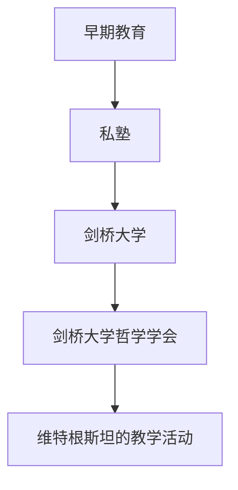
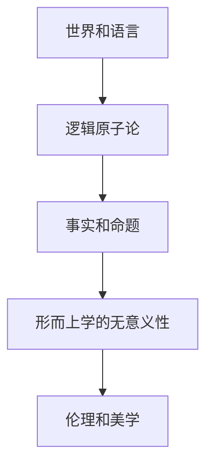
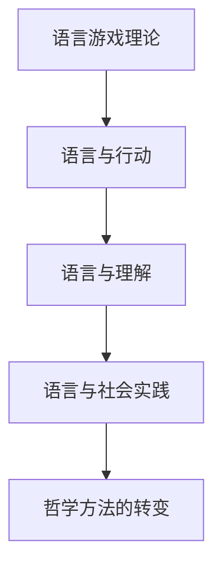
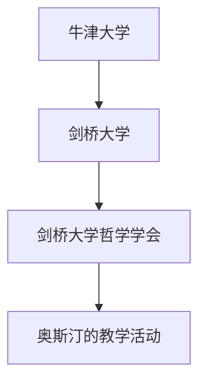
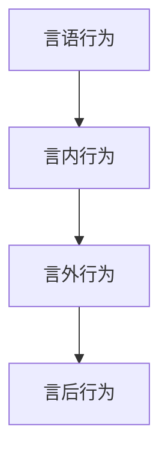
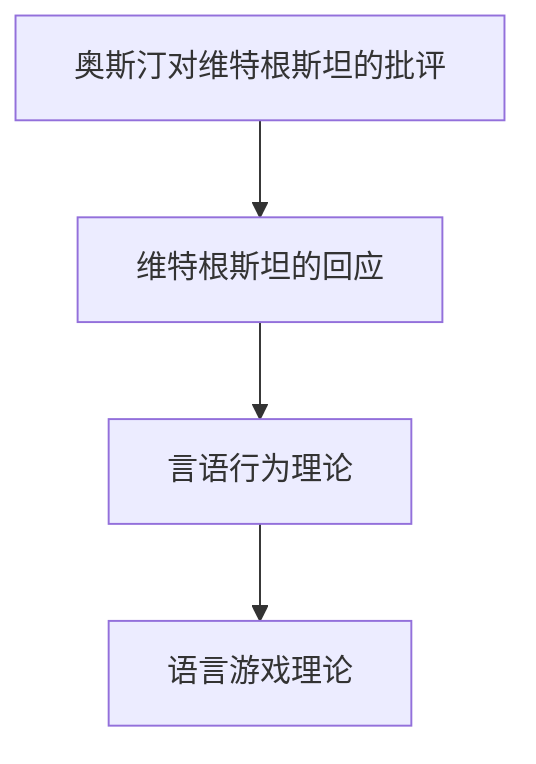
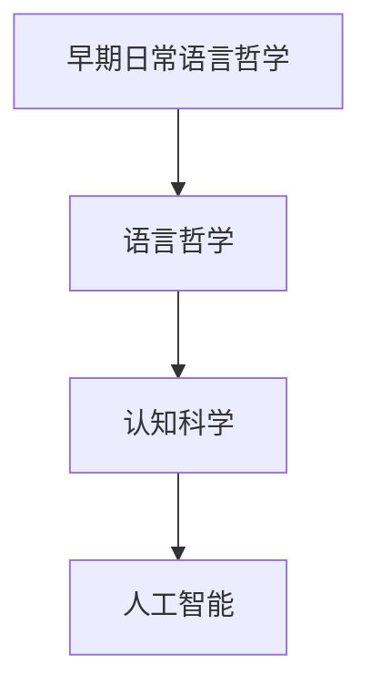
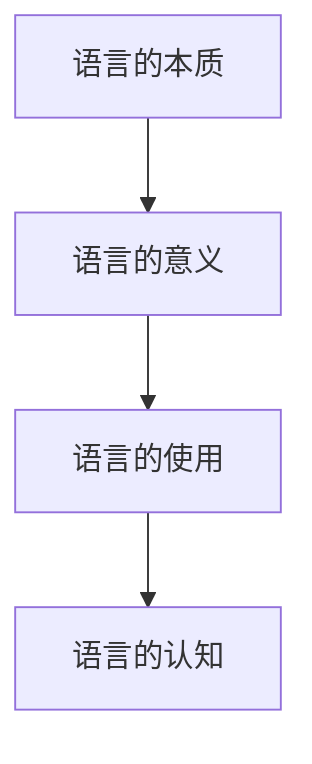
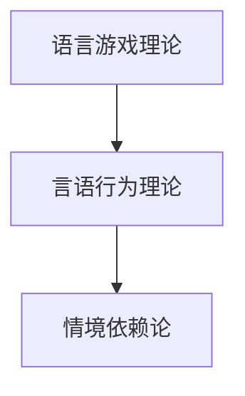

                 

### 文章标题

### 维特根斯坦与奥斯汀：日常语言哲学的开创者

#### 关键词：
- 维特根斯坦
- 奥斯汀
- 日常语言哲学
- 语言游戏理论
- 言语行为理论

#### 摘要：
本文深入探讨两位哲学巨匠维特根斯坦与奥斯汀对日常语言哲学的开创性贡献。通过对他们的哲学生涯、核心概念及其相互关系的剖析，揭示日常语言哲学在理解语言与现实之间的复杂关系中所发挥的关键作用。文章旨在为读者提供一个全面而系统的理解框架，帮助他们把握日常语言哲学的核心思想及其应用。

---

## 第一部分：维特根斯坦与日常语言哲学

### 第1章：维特根斯坦的哲学生涯

### 1.1 维特根斯坦的早期生活与教育

维特根斯坦（Ludwig Wittgenstein）生于1889年，奥地利裔英国哲学家。他的早期生活与教育经历对其哲学思想产生了深远影响。维特根斯坦的父亲是一位成功的商人，他从小接受严格的贵族教育，并在剑桥大学完成了其哲学学习之旅。

#### Mermaid 流程图：维特根斯坦的教育背景

维特根斯坦在私塾中接受了严格的教育，这为他后来的哲学思考奠定了基础。他在剑桥大学哲学学会中遇到了当时的重要哲学家，如贝特兰·罗素和G.E.摩尔，这些交流对他早期哲学思想的成熟起到了关键作用。

### 1.2 维特根斯坦的早期哲学思考

维特根斯坦早期的哲学思考主要体现在他的第一部重要著作《逻辑哲学论》（"Tractatus Logico-Philosophicus"）中。这本书于1921年出版，对20世纪初的哲学界产生了深远影响。

#### Mermaid 流程图：《逻辑哲学论》的主要观点

在《逻辑哲学论》中，维特根斯坦提出了逻辑原子论，认为世界是由基本元素——逻辑原子构成的。他强调了语言与世界的对应关系，并探讨了命题的意义。然而，维特根斯坦也指出了形而上学（如本体论和宇宙论）的无意义性，主张哲学的任务是澄清思想和语言的界限。

### 1.3 维特根斯坦的后期哲学思考

维特根斯坦晚期的哲学思想与早期有着显著差异，他转向了对日常语言的关注。在《哲学研究》（"Philosophical Investigations"）中，他提出了语言游戏理论，认为语言的使用是多样化的，并依赖于特定的社会背景。

#### Mermaid 流程图：维特根斯坦后期的语言游戏理论

维特根斯坦的后期哲学强调语言的多义性和情境依赖性，反对将语言视为固定的符号系统。他认为，哲学的任务是揭示语言的实际使用方式，而不是在抽象的层面上进行形而上的探讨。

### 1.4 维特根斯坦的影响与遗产

维特根斯坦的哲学思想对20世纪的哲学产生了深远影响。他的语言哲学强调语言与现实之间的关系，为后来的分析哲学和语言哲学奠定了基础。同时，他的哲学方法，特别是对语言和行动的深入分析，也为认知科学和计算机科学提供了重要的启示。

#### 举例说明：维特根斯坦对当代哲学的影响

- 对逻辑实证主义的挑战
- 对语言哲学的奠基作用
- 对数学基础的重新审视

维特根斯坦的思想在当代哲学、语言学、认知科学等多个领域都有广泛的应用。他的哲学遗产激励着后来的学者不断探索语言与现实之间的复杂关系。

## 第二部分：奥斯汀与日常语言哲学

### 第2章：奥斯汀的哲学生涯

### 2.1 奥斯汀的早期生活与教育

约翰·朗彻斯特·奥斯汀（John Langshaw Austin）生于1911年，英国哲学家。他的早期生活与教育经历为其后来的哲学思考打下了坚实基础。奥斯汀在牛津大学学习，并在剑桥大学担任研究员，与维特根斯坦有过深入的交流。

#### Mermaid 流程图：奥斯汀的教育背景

奥斯汀在牛津大学学习期间，对哲学产生了浓厚兴趣。他在剑桥大学哲学学会的交流中，深入探讨了维特根斯坦的思想，并形成了自己独特的哲学观点。

### 2.2 奥斯汀的哲学思考

奥斯汀的哲学思考主要体现在他的言语行为理论（Speech Act Theory）中。这一理论提出了新的语言分析方法，强调语言不仅仅是传递信息的工具，还包含行为和意图。

#### Mermaid 流程图：言语行为理论的核心观点

言语行为理论将语言行为分为三类：言内行为（完成语言表达本身的行为）、言外行为（实现特定意图的行为）和言后行为（语言表达带来的后果）。这一理论为语言哲学提供了新的视角，对语言与现实之间的关系进行了深入探讨。

### 2.3 奥斯汀的影响与遗产

奥斯汀的言语行为理论对语言哲学和认知科学产生了深远影响。他的思想揭示了语言行为的复杂性，挑战了传统的语言分析方法。奥斯汀的思想不仅丰富了哲学领域的讨论，也为语言教学和研究提供了新的方法论。

#### 举例说明：奥斯汀对当代哲学的影响

- 对语言哲学的深化
- 对认知科学的启示
- 对法律哲学的贡献

奥斯汀的哲学遗产激励着后来的学者继续探讨语言、行为和认知之间的关系，为当代哲学和跨学科研究提供了丰富的素材。

### 2.4 奥斯汀与维特根斯坦的哲学对话

奥斯汀与维特根斯坦之间存在显著的哲学对话。尽管两人的观点有时存在分歧，但他们共同关注语言与现实之间的关系，为日常语言哲学的发展奠定了基础。

#### Mermaid 流程图：奥斯汀对维特根斯坦的批评与回应

奥斯汀对维特根斯坦的早期哲学观点提出了批评，特别是在语言的多义性和情境依赖性方面。维特根斯坦则在后期哲学中回应了这些批评，提出了语言游戏理论，进一步深化了日常语言哲学的研究。

### 2.5 日常语言哲学的发展趋势

日常语言哲学在20世纪中叶达到了高峰，但其发展并未止步于此。随着语言哲学、认知科学和人工智能等领域的不断进步，日常语言哲学也在不断演变。

#### Mermaid 流程图：日常语言哲学的发展趋势

当前，日常语言哲学正朝着更加跨学科的方向发展，与认知科学和人工智能等领域紧密结合，为解决语言处理和理解中的复杂问题提供了新的思路。

### 第三部分：日常语言哲学的影响

### 第3章：日常语言哲学的核心概念

### 3.1 语言哲学的基本概念

日常语言哲学的核心概念包括语言的本质、意义、使用和认知等方面。这些概念构成了理解语言与现实关系的基础。

#### Mermaid 流程图：语言哲学的基本概念

语言的本质是指语言作为一种符号系统的基本属性；语言的意义涉及语言符号与所指对象之间的关系；语言的使用探讨了语言在社会互动中的作用；语言的认知则涉及语言与思维的关系。

### 3.2 日常语言哲学的理论框架

日常语言哲学的理论框架主要包括语言游戏理论、言语行为理论和情境依赖论等。这些理论为理解语言行为提供了不同的视角。

#### Mermaid 流程图：日常语言哲学的理论框架

语言游戏理论强调语言使用的情境依赖性；言语行为理论则关注语言行为中的意图和后果；情境依赖论认为语言意义和用法受具体情境的影响。

### 3.3 日常语言哲学的应用

日常语言哲学的应用广泛，包括哲学、语言学、认知科学和人工智能等领域。这些应用展示了日常语言哲学在解决复杂问题中的潜力。

#### 举例说明：日常语言哲学的应用

- 哲学：在论证和辩论中应用日常语言哲学的方法，提高逻辑清晰度。
- 语言

