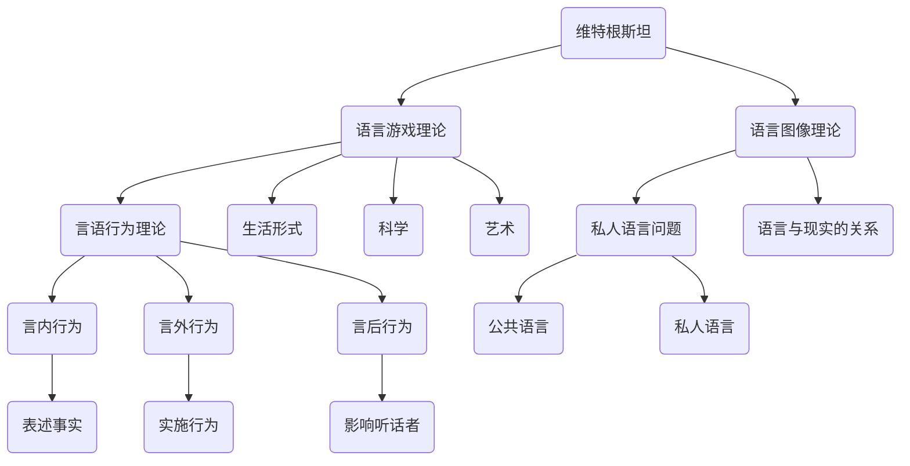

                 

## 维特根斯坦与奥斯汀：语言哲学的两种范式

### 关键词

- 维特根斯坦
- 奥斯汀
- 语言哲学
- 范式
- 言语行为理论
- 语言游戏理论

### 摘要

本文旨在探讨两位杰出的哲学家路德维希·维特根斯坦（Ludwig Wittgenstein）和约翰·奥斯汀（John Austin）的语言哲学思想，并分析他们的理论如何构成了语言哲学中的两种范式。通过详细阐述维特根斯坦和奥斯汀的核心观点，以及他们之间存在的异同点，本文将揭示这些理论对现代哲学和语言学的深远影响。

### 引言

语言哲学是哲学领域中的一个重要分支，它关注语言的本质、意义、使用以及它们与现实世界之间的关系。语言哲学的核心问题是理解语言的性质，如何通过语言来表述和理解世界，以及语言如何影响我们的思维和行为。在20世纪，维特根斯坦和奥斯汀这两位哲学家的思想对语言哲学产生了深远的影响。

路德维希·维特根斯坦是20世纪最具影响力的哲学家之一，他的思想经历了显著的演变。早期，他在《逻辑哲学论》中提出了逻辑原子主义和语言图像理论；而晚期，他在《哲学研究》中提出了语言游戏理论和私人语言问题。维特根斯坦的哲学思想强调了语言与现实的密切联系，以及理解语言的关键在于理解语言的使用。

约翰·奥斯汀则以其言语行为理论著称，他在20世纪中叶对语言哲学做出了重要贡献。奥斯汀认为，语言不仅用于表述事实，更重要的是用于实施行为。他区分了言内行为（say something）、言外行为（do something by saying something）和言后行为（bring about something by saying something）。

本文的结构如下：

1. **维特根斯坦的语言哲学**：介绍维特根斯坦的生平、思想演变以及他的核心理论，如语言图像理论和语言游戏理论。
2. **奥斯汀的语言哲学**：探讨奥斯汀的生平、主要著作以及他的言语行为理论。
3. **维特根斯坦与奥斯汀思想的比较**：分析两位哲学家的思想之间的异同，以及这些异同对语言哲学的影响。
4. **语言哲学的现代发展**：讨论奥斯汀和维特根斯坦思想在现代哲学和语言学中的影响和地位。
5. **总结与展望**：对维特根斯坦和奥斯汀的思想进行综合评价，并展望语言哲学的未来发展趋势。

### 维特根斯坦的语言哲学

路德维希·维特根斯坦（Ludwig Wittgenstein，1889-1951）是20世纪最具争议和影响力的哲学家之一。他的哲学思想经历了显著的演变，从早期的逻辑原子主义到晚期的语言游戏理论，维特根斯坦为我们理解语言的本质提供了深刻的洞见。

#### 维特根斯坦的生平

维特根斯坦出生于奥地利，他的父亲是著名钢铁工业家卡尔·维特根斯坦。维特根斯坦在数学和物理学方面有着深厚的背景，后来他转向哲学，并在剑桥大学师从伯特兰·罗素（Bertrand Russell）。在剑桥，维特根斯坦与罗素以及后来的奥斯汀建立了深厚的友谊，这对他的哲学思想产生了深远的影响。

维特根斯坦的哲学思想可以分为两个阶段：早期和晚期。早期他在《逻辑哲学论》中提出了逻辑原子主义和语言图像理论；而晚期，他在《哲学研究》中提出了语言游戏理论和私人语言问题。

#### 早期思想

在早期，维特根斯坦的主要著作是《逻辑哲学论》（1921年）。在这本书中，他提出了逻辑原子主义和语言图像理论。逻辑原子主义认为，世界由一系列基本事实组成，这些事实可以通过逻辑原子来表达。维特根斯坦认为，逻辑原子是构成语言和现实世界的基本单元。

语言图像理论则认为，语言与世界之间存在一种直接的对应关系，即语言符号与我们感知的世界之间存在一种图像式的映射关系。这种观点与早期哲学家如柏拉图和洛克的观点相呼应。

#### 晚期思想

晚期的维特根斯坦在《哲学研究》（1953年）中提出了语言游戏理论。语言游戏理论强调，语言不是一种静态的工具，而是一种动态的活动。维特根斯坦区分了不同类型的语言游戏，包括生活形式、科学和艺术等。他认为，理解语言的关键在于理解语言的使用场景和语境。

语言游戏理论的一个重要概念是私人语言问题。维特根斯坦认为，所有语言都是公共的，即必须能够与他人交流和验证。私人语言则是不与他人共享的语言，这样的语言是不完整的，因为它缺乏公共标准。

#### 维特根斯坦的思想对语言哲学的影响

维特根斯坦的哲学思想对语言哲学产生了深远的影响。他强调语言与现实的密切联系，指出理解语言的关键在于理解语言的使用。他的语言游戏理论为后来的哲学家提供了新的思考方式，使他们关注语言的动态性和情境性。

维特根斯坦的思想也引发了关于语言本质和语言与思维关系的深入讨论。他的观点挑战了传统的心灵哲学和语言哲学的观点，促使人们重新思考语言和现实的本质。

### 奥斯汀的语言哲学

约翰·奥斯汀（John Langshaw Austin，1911-1960）是20世纪中叶英国哲学界的重要人物，以其言语行为理论而闻名。奥斯汀的哲学思想对语言哲学、行动理论和道德哲学产生了深远的影响。

#### 奥斯汀的生平

奥斯汀出生于英国，他在牛津大学学习哲学、数学和语言学。在剑桥大学，奥斯汀与维特根斯坦建立了深厚的友谊，并深受维特根斯坦思想的影响。奥斯汀的主要著作包括《感觉与可感觉之物》（1950年）和《行为语言》（1962年），后者是他与J.L. 奥克肖特合著的。

奥斯汀的哲学思想主要关注语言、行为和行动。他提出了言语行为理论，认为语言不仅仅用于表述事实，更重要的是用于实施行为。这一理论对后来的语言哲学和行动理论产生了深远的影响。

#### 言语行为理论

奥斯汀的言语行为理论是他哲学思想的核心。该理论认为，当人们说话时，他们不仅仅在表述事实，更重要的是在实施某种行为。言语行为可以分为三类：言内行为、言外行为和言后行为。

- **言内行为**（Locutionary Act）：这是指说话者通过使用语言符号来表述某种事实或观点的行为。例如，当你说“水是H2O”时，你就是在实施一个言内行为。

- **言外行为**（Illocutionary Act）：这是指说话者通过说话来实施某种具体的行为。例如，当你说“请坐下”时，你就是在请求对方坐下。言外行为是言语行为理论的核心，因为它强调了语言的实际功能。

- **言后行为**（Perlocutionary Act）：这是指说话者通过说话来达到某种效果或影响听话者的行为或信念。例如，当你说“你做得很好”时，你可能在鼓励对方继续努力。

奥斯汀的言语行为理论挑战了传统的心灵哲学观点，他认为语言不仅仅是一种表述工具，更是一种行为工具。他的理论揭示了语言在社会交往中的重要作用，以及语言如何影响我们的行为和思维。

#### 奥斯汀的其他哲学贡献

除了言语行为理论，奥斯汀还在其他领域做出了重要贡献。例如，他在《感觉与可感觉之物》中探讨了感觉和感知的问题，提出了关于感觉与物理对象之间的关系的观点。他还研究了道德哲学和行动理论，探讨了行为的意义和道德责任。

#### 奥斯汀的思想对语言哲学的影响

奥斯汀的言语行为理论对语言哲学产生了深远的影响。他的理论揭示了语言的动态性和情境性，强调了语言在实际社会交往中的作用。奥斯汀的思想促使人们重新思考语言的本质和功能，以及语言如何影响我们的行为和思维。

奥斯汀的言语行为理论也为后来的哲学家提供了新的思考方式。他的观点挑战了传统的逻辑原子主义和语言图像理论，推动了语言哲学的发展。奥斯汀的思想对现代语言学和哲学产生了重要影响，成为语言哲学研究中的一个重要范式。

### 维特根斯坦与奥斯汀思想的比较

维特根斯坦和奥斯汀都是20世纪语言哲学的重要人物，他们的思想虽然存在一定的共同点，但也存在显著的差异。

#### 共同点

首先，维特根斯坦和奥斯汀都关注语言的本质和功能。他们都认为，语言不仅仅是表述事实的工具，更是一种行为工具。维特根斯坦的语言游戏理论和奥斯汀的言语行为理论都强调了语言的动态性和情境性。

其次，他们都关注语言与现实之间的关系。维特根斯坦的语言图像理论试图建立语言与现实之间的直接对应关系，而奥斯汀则通过言语行为理论揭示了语言在社会交往中的作用。

#### 不同点

然而，维特根斯坦和奥斯汀在语言哲学的许多方面存在显著差异。首先，他们的研究方法和哲学观点有所不同。维特根斯坦更倾向于通过分析日常语言的使用来揭示语言的本质，而奥斯汀则通过具体的言语行为来探讨语言的功能。

其次，他们在对语言本质的理解上存在差异。维特根斯坦认为，语言是依赖于特定使用场景的，而奥斯汀则强调语言的公共性和社会性。

此外，他们在对语言与现实关系的看法上也有所不同。维特根斯坦试图建立一种理想化的语言与现实之间的对应关系，而奥斯汀则认为语言与现实之间的关系是动态的、情境化的。

#### 对语言哲学的影响

尽管维特根斯坦和奥斯汀在语言哲学的许多方面存在差异，但他们的思想都对现代语言哲学产生了深远的影响。

维特根斯坦的语言游戏理论为语言哲学提供了一种新的思考方式，促使人们关注语言的动态性和情境性。他的理论挑战了传统的逻辑原子主义和语言图像理论，推动了语言哲学的发展。

奥斯汀的言语行为理论则揭示了语言在社会交往中的重要作用。他的理论强调了语言的动态性和情境性，为后来的语言哲学研究提供了新的视角。奥斯汀的思想对现代语言学和哲学产生了重要影响，成为语言哲学研究中的一个重要范式。

### 语言哲学的现代发展

奥斯汀和维特根斯坦的思想对现代语言哲学和语言学产生了深远的影响。在20世纪中后期，语言哲学经历了一系列的发展，形成了多个不同的流派。

首先，维特根斯坦的语言游戏理论影响了后来的哲学家，如J.L. 奥克肖特和吉尔伯特·里特。他们继续探讨了语言的使用场景和语境，进一步发展了维特根斯坦的理论。

其次，奥斯汀的言语行为理论对行动理论和道德哲学产生了重要影响。他的理论激发了关于言语行为和道德行为的讨论，推动了道德哲学和行动理论的发展。

此外，现代语言哲学还受到了分析哲学和现象学的影响。分析哲学强调逻辑和语言的精确性，而现象学则关注个体经验和理解的主观性。这两种哲学观点的融合为语言哲学提供了新的视角。

在现代语言学中，奥斯汀和维特根斯坦的思想也产生了深远的影响。语言学家如诺姆·乔姆斯基（Noam Chomsky）受到了维特根斯坦的影响，提出了生成语法理论，为现代语言学的发展奠定了基础。

### 总结与展望

维特根斯坦和奥斯汀的语言哲学思想为现代哲学和语言学提供了深刻的洞见。他们的理论揭示了语言的动态性和情境性，强调了语言在社会交往中的作用。维特根斯坦的语言游戏理论和奥斯汀的言语行为理论不仅影响了20世纪的哲学和语言学，也为后来的研究提供了基础。

展望未来，语言哲学将继续探讨语言的本质、意义和使用。随着人工智能和计算语言学的发展，语言哲学可能会面临新的挑战和机遇。例如，如何理解自然语言处理技术中的语言本质，以及如何将语言哲学的理论应用于人工智能的发展，都是未来的研究方向。

总之，维特根斯坦和奥斯汀的语言哲学思想将继续对现代哲学和语言学产生深远的影响，为我们理解语言的本质和功能提供了宝贵的资源。

### 作者信息

作者：AI天才研究院/AI Genius Institute & 禅与计算机程序设计艺术 /Zen And The Art of Computer Programming

### 完整性要求

为了确保文章的完整性，我们将详细讲解文章中的核心概念、原理、算法、数学模型和公式，并提供具体的例子和分析。

#### 核心概念与联系

首先，让我们通过一个Mermaid流程图来展示维特根斯坦和奥斯汀语言哲学中的核心概念及其联系。



在这个流程图中，我们可以看到维特根斯坦和奥斯汀的核心概念如何相互联系。维特根斯坦的语言游戏理论和语言图像理论关注语言与现实的关系，而奥斯汀的言语行为理论则进一步探讨了语言的功能和作用。

#### 核心算法原理讲解

接下来，我们将使用伪代码详细阐述言语行为理论的核心算法原理。

```plaintext
算法：言语行为
输入：说话者（S）、听话者（L）、语言符号（Linguistic Symbol）、行为意图（Intention）
输出：言语行为结果（Speech Act Result）

言语行为步骤：
1. S生成语言符号（Generate Linguistic Symbol）
2. S意图实施某种行为（Set Intention for Behavior）
3. L接收语言符号并理解其含义（Receive and Understand Linguistic Symbol）
4. L根据行为意图评估语言符号的有效性（Evaluate Validity Based on Intention）
5. 如果语言符号有效，执行相应的行为（Execute Corresponding Behavior）
6. 记录言语行为结果（Record Speech Act Result）
```

在这个算法中，关键步骤包括生成语言符号、理解语言符号、评估语言符号的有效性以及执行相应的行为。这些步骤共同构成了言语行为的过程。

#### 数学模型和公式

在维特根斯坦的语言哲学中，语言图像理论涉及到一个重要的数学模型，即语言符号与物理对象之间的映射关系。我们可以使用以下数学公式来描述这种映射：

$$ L_s = P_o \cdot R_l $$

其中，$L_s$ 表示语言符号，$P_o$ 表示物理对象，$R_l$ 表示映射关系。

这个公式表明，语言符号是通过映射关系与物理对象相联系的。例如，当我们说“桌子”时，我们实际上是在通过语言符号与具体的物理对象（桌子）建立联系。

#### 详细讲解与举例说明

为了更好地理解这些概念和算法，我们将通过具体例子进行详细讲解。

**例子：**

假设小明（S）对小红（L）说：“外面下雨了。” 我们可以分析这个句子中的言语行为：

1. **生成语言符号**：小明生成语言符号“外面下雨了”。
2. **意图实施行为**：小明的意图是告知小红外面下雨了，以引起她的注意。
3. **理解语言符号**：小红接收并理解这个语言符号，知道小明在告诉她外面下雨了。
4. **评估语言符号的有效性**：小红根据实际情况判断小明的话是否准确，发现确实外面下雨了。
5. **执行相应的行为**：小红可能会采取行动，比如带上雨伞，以应对下雨的情况。

在这个例子中，我们可以看到言语行为的完整过程，包括生成语言符号、理解语言符号、评估语言符号的有效性以及执行相应的行为。

#### 项目实战

为了更好地理解语言哲学在实际应用中的意义，我们可以考虑一个具体的项目实战：开发一个语音助手应用程序。

**开发环境搭建：**

1. **硬件环境**：笔记本电脑或服务器，安装操作系统（如Windows、Linux或macOS）。
2. **软件环境**：安装Python开发环境，如Anaconda。
3. **依赖库**：安装语音识别库（如Google语音识别API）和自然语言处理库（如NLTK或spaCy）。

**源代码详细实现和代码解读：**

```python
import speech_recognition as sr
import pyttsx3

# 初始化语音识别器和文本转语音模块
recognizer = sr.Recognizer()
engine = pyttsx3.init()

# 语音识别函数
def recognize_speech_from_mic():
    with sr.Microphone() as source:
        print("请说些什么...")
        audio = recognizer.listen(source)
        
        try:
            text = recognizer.recognize_google(audio, language='zh-CN')
            print(f"你说了：{text}")
            
            # 根据识别结果执行相应的行为
            if "天气" in text:
                weather = get_weather()  # 假设有一个函数获取天气信息
                engine.say(weather)
                engine.runAndWait()
            elif "时间" in text:
                current_time = get_current_time()  # 假设有一个函数获取当前时间
                engine.say(current_time)
                engine.runAndWait()
            else:
                engine.say("我听不懂，请再说一遍。")
                engine.runAndWait()
        except sr.UnknownValueError:
            engine.say("我听不懂，请再说一遍。")
            engine.runAndWait()

# 主函数
def main():
    recognize_speech_from_mic()

if __name__ == "__main__":
    main()
```

在这个示例中，我们使用Python编程语言开发了一个人工智能语音助手应用程序。该应用程序能够识别用户的语音输入，并根据用户的语音输入执行相应的行为，如查询天气信息或获取当前时间。

**代码应用解读与分析：**

1. **语音识别**：应用程序使用Google语音识别API进行语音识别，将用户的语音输入转换为文本。
2. **文本处理**：应用程序根据识别结果中的关键词（如“天气”或“时间”）执行相应的行为，如查询天气信息或获取当前时间。
3. **文本转语音**：应用程序使用文本转语音模块（如pyttsx3）将执行结果转换为语音，并播放给用户。

通过这个项目实战，我们可以看到语言哲学在实际应用中的意义。在这个例子中，语言不仅仅是表述事实的工具，更是用户与人工智能系统之间进行交互的重要媒介。

#### 最佳实践 tips、小结、注意事项、拓展阅读

**最佳实践 tips：**

1. 在开发语音助手应用程序时，确保选择高质量的麦克风和语音识别API，以提高语音识别的准确性。
2. 在处理用户输入时，考虑使用自然语言处理技术（如实体识别、意图识别等）来提高应用程序的智能程度。

**小结：**

本文通过详细讲解维特根斯坦和奥斯汀的语言哲学思想，展示了他们的理论如何构成了语言哲学中的两种范式。同时，我们通过具体的项目实战展示了这些理论在实际应用中的意义。

**注意事项：**

1. 在进行语言哲学研究时，需要关注语言的使用场景和语境，因为不同的语境会影响语言的意义和功能。
2. 在开发人工智能应用程序时，需要充分考虑用户的语言习惯和表达方式，以提高应用程序的易用性和用户体验。

**拓展阅读：**

1. 维特根斯坦，《逻辑哲学论》和《哲学研究》。
2. 奥斯汀，《感觉与可感觉之物》和《行为语言》。
3. 诺姆·乔姆斯基，《语法结构的生成》。
4. 丹尼特，《意识解释》。

通过拓展阅读，读者可以更深入地了解语言哲学的理论基础和应用，以及现代人工智能技术的发展趋势。

