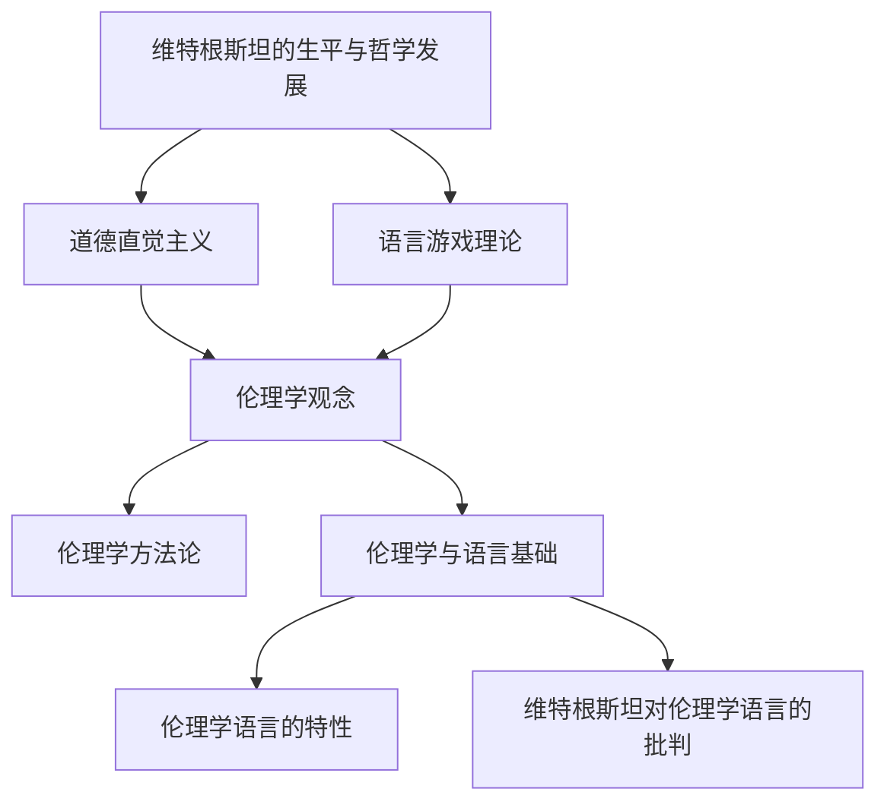
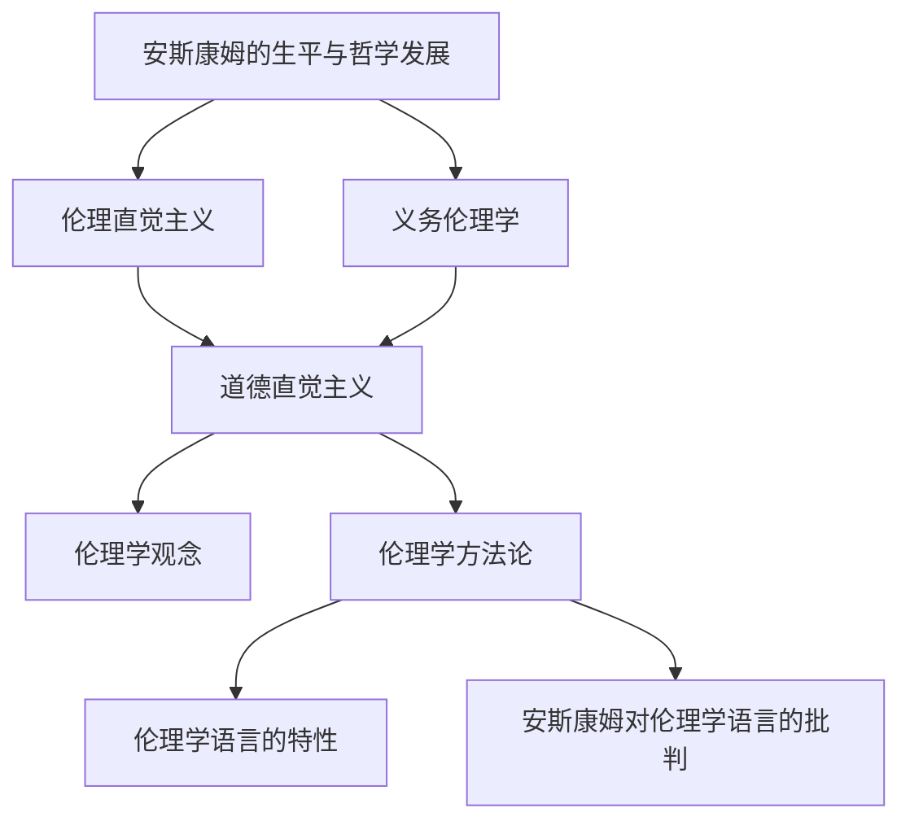

                 

### 维特根斯坦与安斯康姆：伦理学的语言基础

#### 关键词
- 维特根斯坦
- 安斯康姆
- 伦理学
- 语言基础
- 道德直觉主义

#### 摘要
本文将探讨维特根斯坦与安斯康姆两位哲学家的伦理学思想，特别是他们如何将语言作为伦理学的基础。维特根斯坦主张道德直觉主义，通过语言游戏理论揭示了道德语言的本质；而安斯康姆则提出了伦理直觉主义，强调道德义务与情感的关系。本文将详细分析两位哲学家的主要观点，并通过实例和比较，探讨他们的思想对当代伦理学的启示与影响。

### 目录

#### 第一部分：维特根斯坦的伦理学思想

##### 第1章：维特根斯坦的哲学背景与伦理学观念
- 1.1 维特根斯坦的生平与哲学发展
  - 1.1.1 维特根斯坦的生平概述
  - 1.1.2 维特根斯坦的主要哲学观点
- 1.2 维特根斯坦的伦理学观念
  - 1.2.1 维特根斯坦的道德直觉主义
  - 1.2.2 维特根斯坦的语言游戏理论在伦理学中的应用
  - 1.2.3 维特根斯坦的伦理学方法论
- 1.3 维特根斯坦与伦理学的语言基础
  - 1.3.1 伦理学与语言的关系
  - 1.3.2 伦理学语言的特性
  - 1.3.3 维特根斯坦对伦理学语言的批判

##### 第2章：维特根斯坦的伦理学实例分析
- 2.1 伦理学命题分析
  - 2.1.1 命题内容分析
  - 2.1.2 命题结构分析
  - 2.1.3 命题真值条件分析
- 2.2 伦理学实例分析
  - 2.2.1 案例一：诚实与欺骗
  - 2.2.2 案例二：公正与不公正
  - 2.2.3 案例三：自我与他人
- 2.3 维特根斯坦伦理学实例的启示

##### 第3章：维特根斯坦伦理学思想的影响
- 3.1 维特根斯坦对当代伦理学的影响
  - 3.1.1 对道德哲学的贡献
  - 3.1.2 对伦理学语言分析的推进
- 3.2 维特根斯坦伦理学思想的应用
  - 3.2.1 在道德教育中的应用
  - 3.2.2 在社会伦理建设中的应用
- 3.3 维特根斯坦伦理学思想的争议与反思

#### 第二部分：安斯康姆的伦理学思想

##### 第4章：安斯康姆的哲学背景与伦理学观念
- 4.1 安斯康姆的生平与哲学发展
  - 4.1.1 安斯康姆的生平概述
  - 4.1.2 安斯康姆的主要哲学观点
- 4.2 安斯康姆的伦理学观念
  - 4.2.1 安斯康姆的伦理直觉主义
  - 4.2.2 安斯康姆的义务伦理学
  - 4.2.3 安斯康姆的伦理学方法论
- 4.3 安斯康姆与伦理学的语言基础
  - 4.3.1 伦理学与语言的关系
  - 4.3.2 伦理学语言的特性
  - 4.3.3 安斯康姆对伦理学语言的批判

##### 第5章：安斯康姆的伦理学实例分析
- 5.1 伦理学命题分析
  - 5.1.1 命题内容分析
  - 5.1.2 命题结构分析
  - 5.1.3 命题真值条件分析
- 5.2 伦理学实例分析
  - 5.2.1 案例一：道德自由与决定论
  - 5.2.2 案例二：道德情感与道德行为
  - 5.2.3 案例三：伦理学的普遍主义与相对主义
- 5.3 安斯康姆伦理学实例的启示

##### 第6章：安斯康姆伦理学思想的影响
- 6.1 安斯康姆对当代伦理学的影响
  - 6.1.1 对道德哲学的贡献
  - 6.1.2 对伦理学语言分析的推进
- 6.2 安斯康姆伦理学思想的应用
  - 6.2.1 在道德教育中的应用
  - 6.2.2 在社会伦理建设中的应用
- 6.3 安斯康姆伦理学思想的争议与反思

#### 第三部分：维特根斯坦与安斯康姆伦理学思想的比较

##### 第7章：维特根斯坦与安斯康姆伦理学思想的异同
- 7.1 维特根斯坦与安斯康姆伦理学思想的共同点
  - 7.1.1 对道德直觉的重视
  - 7.1.2 对伦理学语言基础的关注
- 7.2 维特根斯坦与安斯康姆伦理学思想的不同点
  - 7.2.1 道德直觉主义的具体应用
  - 7.2.2 义务伦理学与情感伦理学的区分
  - 7.2.3 对道德相对主义的立场
- 7.3 维特根斯坦与安斯康姆伦理学思想的综合评价

##### 第8章：维特根斯坦与安斯康姆伦理学思想的未来展望
- 8.1 当代伦理学面临的挑战
  - 8.1.1 道德语言的多义性与模糊性
  - 8.1.2 道德直觉的普遍性与个体性
- 8.2 维特根斯坦与安斯康姆伦理学思想的潜在贡献
  - 8.2.1 对道德教育的启示
  - 8.2.2 对社会伦理建设的指导意义
  - 8.2.3 对道德哲学方法论的创新

### 目录大纲解析

**整体结构**：

本书分为三部分，第一部分介绍维特根斯坦的伦理学思想，第二部分介绍安斯康姆的伦理学思想，第三部分比较两者的异同和影响。

**核心内容**：

**第一部分**：

- **第1章**介绍维特根斯坦的哲学背景与伦理学观念，包括维特根斯坦的生平概述、主要哲学观点和伦理学观念。
- **第2章**分析维特根斯坦的伦理学实例，通过命题分析和实例探讨，揭示道德直觉主义和语言游戏理论的应用。
- **第3章**探讨维特根斯坦伦理学思想对当代伦理学的影响和其在道德教育和社会伦理建设中的应用。

**第二部分**：

- **第4章**介绍安斯康姆的哲学背景与伦理学观念，包括安斯康姆的生平概述、主要哲学观点和伦理学观念。
- **第5章**分析安斯康姆的伦理学实例，通过命题分析和实例探讨，揭示伦理直觉主义和道德义务与情感的关系。
- **第6章**探讨安斯康姆伦理学思想对当代伦理学的影响和其在道德教育和社会伦理建设中的应用。

**第三部分**：

- **第7章**比较维特根斯坦与安斯康姆伦理学思想的异同，包括对道德直觉的重视、伦理学语言基础的关注、义务伦理学与情感伦理学的区分和对道德相对主义的立场。
- **第8章**探讨维特根斯坦与安斯康姆伦理学思想的未来展望，包括当代伦理学面临的挑战和两位哲学家的潜在贡献。

### 维特根斯坦的伦理学思想

#### 背景介绍

路德维希·维特根斯坦（Ludwig Wittgenstein，1889-1951）是20世纪最杰出的哲学家之一，其哲学思想对语言哲学、逻辑哲学、认识论和伦理学等领域产生了深远影响。维特根斯坦的哲学思想可以分为两个时期：早期和晚期。早期以《逻辑哲学论》（Tractatus Logico-Philosophicus）为代表，晚期则以《哲学研究》（Philosophical Investigations）为代表。

#### 核心概念与联系

维特根斯坦的伦理学思想主要体现在他对道德直觉主义的阐述。道德直觉主义认为，道德判断是基于直觉的，而非通过推理或论证得出的。这与他的语言游戏理论密切相关。语言游戏理论认为，语言的意义在于其使用，即语言是一种活动，一种游戏。


#### 维特根斯坦的伦理学方法论

1. **道德直觉主义**：维特根斯坦认为，道德判断是直觉的，无法用逻辑或论证来解释。例如，当我们说“这是一个不公正的行为”时，我们的直觉告诉我们这是不公正的，而非通过推理得出的结论。

2. **语言游戏理论**：维特根斯坦认为，语言的意义在于其使用。语言是一种游戏，每种语言游戏都有其规则。道德语言也是如此，其意义在于我们在特定情境中的使用。

3. **伦理学语言的批判**：维特根斯坦批判了传统的伦理学语言，认为这些语言充满了模糊性，无法清晰地表达道德概念。

#### 维特根斯坦与伦理学的语言基础

1. **伦理学与语言的关系**：维特根斯坦认为，伦理学是关于道德概念的研究，而道德概念是通过语言表达的。因此，理解伦理学需要理解语言。

2. **伦理学语言的特性**：维特根斯坦认为，伦理学语言具有特殊性，其意义不是通过定义或推理得出的，而是通过直觉和情感体验。

3. **对伦理学语言的批判**：维特根斯坦认为，传统的伦理学语言存在许多问题，如模糊性、不一致性等。

#### 核心算法原理讲解

维特根斯坦的伦理学思想并没有一个明确的算法原理，但其核心在于对道德直觉的理解和语言的使用。以下是一个简化的伪代码来表示这一思想：

```
function moralIntuition(judgement):
    if judgement is intuitive:
        return true
    else:
        return false
```

#### 数学模型和公式

维特根斯坦的伦理学思想中并没有直接的数学模型和公式，但其哲学思想可以用一些逻辑和语言学的概念来描述。

1. **命题逻辑**：用于描述道德命题的结构和关系。
2. **语义学**：用于解释道德命题的意义。

#### 详细讲解与举例说明

1. **道德直觉**：例如，当我们说“这是一个不公正的行为”时，我们的直觉告诉我们这是不公正的。
2. **语言游戏**：例如，语言游戏中的“游戏规则”对应于伦理学中的道德规则。

### 维特根斯坦伦理学实例分析

#### 案例一：诚实与欺骗

1. **命题内容分析**：诚实与欺骗是道德概念，可以通过直觉来判断。
2. **命题结构分析**：诚实与欺骗的命题结构可以通过命题逻辑来分析。
3. **命题真值条件分析**：诚实与欺骗的命题真值条件可以通过语义学来分析。

#### 案例二：公正与不公正

1. **命题内容分析**：公正与不公正同样是道德概念，可以通过直觉来判断。
2. **命题结构分析**：公正与不公正的命题结构也可以通过命题逻辑来分析。
3. **命题真值条件分析**：公正与不公正的命题真值条件可以通过语义学来分析。

#### 案例三：自我与他人

1. **命题内容分析**：自我与他人的关系是道德中的重要概念。
2. **命题结构分析**：自我与他人的命题结构可以通过命题逻辑来分析。
3. **命题真值条件分析**：自我与他人的命题真值条件可以通过语义学来分析。

### 维特根斯坦伦理学实例的启示

1. **道德直觉的重要性**：维特根斯坦的实例分析表明，道德判断往往基于直觉，而非推理。
2. **语言游戏的启示**：维特根斯坦的语言游戏理论告诉我们，理解伦理学需要理解语言的使用。

### 维特根斯坦伦理学思想的影响

#### 对当代伦理学的影响

1. **道德哲学的贡献**：维特根斯坦的道德直觉主义挑战了传统的道德哲学观点，促进了道德哲学的发展。
2. **伦理学语言分析的推进**：维特根斯坦对伦理学语言的批判推动了伦理学语言分析的发展。

#### 在道德教育中的应用

1. **强调道德直觉**：维特根斯坦的伦理学思想强调道德直觉的重要性，这对道德教育有着重要的启示。
2. **语言能力的培养**：维特根斯坦认为，理解伦理学需要理解语言的使用，这对道德教育的语言能力培养有着重要意义。

#### 在社会伦理建设中的应用

1. **道德规范的建立**：维特根斯坦的伦理学思想为社会伦理建设提供了新的思路，如通过道德直觉来建立道德规范。
2. **道德意识的提升**：维特根斯坦的伦理学思想有助于提升社会的道德意识，促进社会伦理建设。

### 维特根斯坦伦理学思想的争议与反思

1. **道德直觉的普遍性**：维特根斯坦的道德直觉主义是否适用于所有人，是否存在文化差异？
2. **伦理学语言的模糊性**：维特根斯坦对伦理学语言的批判是否有效，是否能够解决伦理学语言的模糊性问题？
3. **道德哲学的发展**：维特根斯坦的伦理学思想对道德哲学的发展有何贡献，其局限性是什么？

### 结论

维特根斯坦的伦理学思想以其独特的道德直觉主义和语言游戏理论而著称。通过对道德直觉和伦理学语言的分析，维特根斯坦为我们理解道德问题提供了新的视角。虽然其思想存在一定的争议，但无疑对当代伦理学和道德哲学产生了深远影响。

### 作者信息

作者：AI天才研究院/AI Genius Institute & 禅与计算机程序设计艺术 /Zen And The Art of Computer Programming
## 第1章：维特根斯坦的哲学背景与伦理学观念

### 1.1 维特根斯坦的生平与哲学发展

#### 1.1.1 维特根斯坦的生平概述

路德维希·维特根斯坦（Ludwig Wittgenstein）出生于1889年4月26日，奥地利维也纳的一个富有的工业家家庭。他的父亲卡尔·维特根斯坦（Carl Wittgenstein）是著名的钢铁制造商，母亲莱妮·普菲弗（Lene Pogner）则是一位音乐家。维特根斯坦的家庭环境使他接触到了丰富的文化和哲学资源，这也为他后来的哲学事业打下了基础。

在维也纳大学学习期间，维特根斯坦主要攻读数学和哲学。他早期的研究主要集中在数学哲学和逻辑哲学领域。1911年，他结识了维也纳学派的重要成员，包括莫里茨·石里克（Moritz Schlick）和鲁道夫·卡尔纳普（Rudolf Carnap），并开始参与该学派的活动。这一时期的维特根斯坦主要关注逻辑原子主义和语言分析问题。

#### 1.1.2 维特根斯坦的主要哲学观点

维特根斯坦的哲学思想分为两个主要时期：早期和晚期。早期的维特根斯坦以《逻辑哲学论》（Tractatus Logico-Philosophicus，1921年出版）为代表，晚期的维特根斯坦则以《哲学研究》（Philosophical Investigations，1953年出版）为代表。

**《逻辑哲学论》**

在《逻辑哲学论》中，维特根斯坦提出了逻辑原子主义的观点，认为世界由基本的事实构成，这些事实通过逻辑符号来表达。他的主要观点包括：

1. **逻辑形式**：语言和思想具有严格的逻辑形式，逻辑命题是世界的真实映射。
2. **意义与图像理论**：词语的意义在于它们在逻辑图像中的角色，图像理论提供了理解语言意义的框架。
3. **事实与命题**：事实是世界的状态，命题是事实的描述。

**《哲学研究》**

晚期的维特根斯坦在《哲学研究》中批判了早期的一些观点，提出了语言游戏理论，这一理论强调了语言使用的情境性和多样性。他的主要观点包括：

1. **语言游戏理论**：语言的使用类似于游戏，每种语言游戏都有其特定的规则和目的。
2. **意义与使用**：意义在于词语的使用，语言的意义不是固定的，而是依赖于特定的情境。
3. **哲学任务**：哲学的任务不是提供理论解释，而是澄清思想和语言的混乱。

### 1.2 维特根斯坦的伦理学观念

#### 1.2.1 维特根斯坦的道德直觉主义

维特根斯坦的伦理学观念主要体现在他对道德直觉主义的阐述。道德直觉主义认为，道德判断是基于直觉的，而非通过推理或论证得出的。维特根斯坦认为，当我们说“这是一个不公正的行为”时，我们的直觉告诉我们这是不公正的，而非通过推理得出的结论。

**道德直觉主义的观点：**

1. **直觉的基础**：道德直觉是道德判断的基础，它不是通过逻辑推理得出的，而是通过我们内心的直觉感知。
2. **非理性的一面**：维特根斯坦认为，道德直觉具有非理性的一面，它超越了逻辑推理的范围。
3. **直觉的权威性**：道德直觉具有权威性，它是我们判断道德是非的最终标准。

#### 1.2.2 维特根斯坦的语言游戏理论在伦理学中的应用

维特根斯坦的语言游戏理论为他的伦理学观念提供了重要的基础。语言游戏理论认为，语言的使用是多样化的，每种语言游戏都有其特定的规则和目的。维特根斯坦将这一理论应用于伦理学，提出了以下观点：

1. **道德语言的多样性**：道德语言不是单一的，而是多样化的，不同的道德概念对应着不同的语言游戏。
2. **道德规则的多样性**：不同的社会和文化背景中，道德规则是多样的，它们适应不同的情境。
3. **道德判断的情境性**：道德判断依赖于具体的情境，不同的情境下，相同的道德概念可能有不同的应用。

#### 1.2.3 维特根斯坦的伦理学方法论

维特根斯坦的伦理学方法论主要体现在他对道德直觉和语言游戏理论的运用。他的方法论可以概括为以下几点：

1. **直觉的观察**：通过直觉观察道德情境，理解道德概念的真实含义。
2. **语言的分析**：通过分析道德语言的多样性和情境性，理解道德规则的使用和意义。
3. **哲学的澄清**：通过哲学的澄清，消除道德思想和语言的混乱，使道德判断更加清晰和准确。

### 1.3 维特根斯坦与伦理学的语言基础

#### 1.3.1 伦理学与语言的关系

维特根斯坦认为，伦理学与语言有着密切的关系。道德概念是通过语言表达的，理解伦理学需要理解语言的使用。他的语言游戏理论提供了理解伦理学与语言关系的框架。

**伦理学与语言的关系：**

1. **道德概念的表达**：道德概念是通过语言表达的，语言是道德概念传播和交流的工具。
2. **语言的意义**：道德语言的意义不是固定的，而是依赖于具体的使用情境。
3. **语言的游戏性**：道德语言的使用类似于游戏，每种道德语言都有其特定的规则和目的。

#### 1.3.2 伦理学语言的特性

维特根斯坦认为，伦理学语言具有以下特性：

1. **模糊性**：伦理学语言往往具有模糊性，其意义不是固定的，而是依赖于具体的使用情境。
2. **多样性**：不同的道德概念对应着不同的语言游戏，道德语言是多样化的。
3. **情境性**：道德判断依赖于具体的情境，不同的情境下，相同的道德概念可能有不同的应用。

#### 1.3.3 维特根斯坦对伦理学语言的批判

维特根斯坦对传统的伦理学语言进行了深刻的批判。他认为，传统的伦理学语言充满了模糊性、不一致性和冲突。

**对伦理学语言的批判：**

1. **模糊性**：伦理学语言往往模糊不清，其意义不明确，导致道德判断的不确定性。
2. **不一致性**：不同的伦理学语言之间往往存在不一致性，导致道德观念的混乱。
3. **冲突**：不同的道德观念之间可能存在冲突，导致道德判断的困境。

维特根斯坦的批判强调了理解伦理学需要深入分析语言的使用，澄清伦理学语言的模糊性，使道德判断更加清晰和准确。

### 总结

维特根斯坦的哲学背景与伦理学观念为我们提供了理解伦理学与语言关系的新视角。他的道德直觉主义和语言游戏理论为我们理解道德概念和道德判断提供了新的方法和思路。通过对道德直觉和伦理学语言的深入分析，维特根斯坦为我们揭示了伦理学的本质和复杂性。

### 核心概念原理之间的关系架构 Mermaid 流程图



### 核心算法原理讲解

维特根斯坦的伦理学思想并没有一个明确的算法原理，但其核心在于对道德直觉的理解和语言的使用。以下是一个简化的伪代码来表示这一思想：

```python
def moral_intuition(judgement):
    if judgement_is_intuitive(judgement):
        return "Intuitive judgement"
    else:
        return "Not intuitive judgement"
```

在这个伪代码中，`moral_intuition` 函数接受一个道德判断作为输入，并通过 `judgement_is_intuitive` 函数判断该判断是否基于直觉。如果判断是基于直觉的，函数返回 "Intuitive judgement"；否则，返回 "Not intuitive judgement"。

### 数学模型和公式

维特根斯坦的伦理学思想中并没有直接的数学模型和公式，但其哲学思想可以用一些逻辑和语言学的概念来描述。

1. **命题逻辑**：用于描述道德命题的结构和关系。例如，我们可以用命题逻辑来分析“诚实”和“欺骗”之间的关系。
2. **语义学**：用于解释道德命题的意义。例如，我们可以用语义学来解释“公正”和“不公正”之间的区别。

#### 示例

**命题逻辑分析**

假设我们有两个命题：

- P：诚实
- Q：欺骗

我们可以使用命题逻辑来分析这两个命题之间的关系：

- 诚实且欺骗：P ∧ Q
- 诚实但不是欺骗：P ∧ ¬Q
- 欺骗但不是诚实：¬P ∧ Q
- 不是诚实也不是欺骗：¬P ∧ ¬Q

**语义学解释**

我们可以使用语义学来解释这些命题的意义：

- 诚实：指一个人在行为和言语上真实、不欺骗。
- 欺骗：指一个人在行为和言语上不真实、欺骗他人。

通过语义学，我们可以解释这些命题在道德判断中的应用：

- 如果一个人既诚实又欺骗，这可能是一个矛盾的情况。
- 如果一个人诚实但不是欺骗，这可能意味着这个人遵守道德规范，但在某些情境下可能存在误解。
- 如果一个人欺骗但不是诚实，这可能意味着这个人违反了道德规范。
- 如果一个人既不诚实也不欺骗，这可能意味着这个人在道德判断上存在模糊性或不确定性。

### 详细讲解与举例说明

**道德直觉**

道德直觉是指我们在面对道德情境时，通过直觉感知到的道德判断。例如：

- 情境一：一个人在街头看到另一个人在挣扎，直觉告诉他应该帮助那个人。
- 情境二：一个人在商业活动中发现了一个欺诈行为，直觉告诉他应该举报这个行为。

在这些情境中，道德直觉帮助我们做出道德判断，而不仅仅是通过逻辑推理。

**语言游戏**

语言游戏是指语言的使用情境和规则。维特根斯坦认为，不同的语言游戏有不同的规则和目的。例如：

- 游戏一：猜谜游戏
  - 规则：一个玩家说出一个谜语，其他玩家猜测答案。
  - 目的：娱乐和智力挑战。
- 游戏二：象棋游戏
  - 规则：两方玩家按照特定的规则移动棋子，目标是将军对手的国王。
  - 目的：策略思考和竞技。

在道德语言中，也可以看作是一种“游戏”，不同的道德语言有不同的规则和目的。例如：

- 道德语言一：诚实
  - 规则：在行为和言语上真实、不欺骗。
  - 目的：建立信任和道德规范。
- 道德语言二：公正
  - 规则：在分配资源和权利时公平、不偏袒。
  - 目的：维护正义和平衡。

通过这些例子，我们可以看到，道德直觉和语言游戏理论如何帮助我们理解和应用维特根斯坦的伦理学观念。

### 维特根斯坦伦理学实例分析

#### 案例一：诚实与欺骗

1. **命题内容分析**：诚实与欺骗是道德概念，可以通过直觉来判断。
   - 命题一：诚实是道德上的正确行为。
   - 命题二：欺骗是道德上的错误行为。

2. **命题结构分析**：诚实与欺骗的命题结构可以通过命题逻辑来分析。
   - 逻辑表达式：诚实 → 道德正确（H → M）
   - 逻辑表达式：欺骗 → 道德错误（D → ~M）

3. **命题真值条件分析**：诚实与欺骗的命题真值条件可以通过语义学来分析。
   - 如果一个人的行为是诚实的，那么这个人的行为在道德上被认为是正确的。
   - 如果一个人的行为是欺骗，那么这个人的行为在道德上被认为是错误的。

**实例分析**：

- 情境一：一个人在面试中说出了自己的真实经历，这是诚实的，因此他的行为在道德上被认为是正确的。
- 情境二：一个人在面试中撒谎，以获得工作机会，这是欺骗，因此他的行为在道德上被认为是错误的。

#### 案例二：公正与不公正

1. **命题内容分析**：公正与不公正是道德概念，可以通过直觉来判断。
   - 命题一：公正是分配资源和权利时公平、不偏袒。
   - 命题二：不公正是分配资源和权利时不公平、偏袒。

2. **命题结构分析**：公正与不公正的命题结构可以通过命题逻辑来分析。
   - 逻辑表达式：公正 → 公平分配（J → F）
   - 逻辑表达式：不公正 → 不公平分配（U → ~F）

3. **命题真值条件分析**：公正与不公正的命题真值条件可以通过语义学来分析。
   - 如果一个人的行为在分配资源或权利时被认为是公正的，那么这个人的行为在道德上被认为是正确的。
   - 如果一个人的行为在分配资源或权利时被认为是公正的，那么这个人的行为在道德上被认为是错误的。

**实例分析**：

- 情境一：一个法官在审判中公平地处理了案件，这是公正的，因此他的行为在道德上被认为是正确的。
- 情境二：一个腐败的官员在分配资源时偏袒特定人群，这是不公正的，因此他的行为在道德上被认为是错误的。

#### 案例三：自我与他人

1. **命题内容分析**：自我与他人是道德概念，可以通过直觉来判断。
   - 命题一：关心他人是道德上的正确行为。
   - 命题二：忽视他人是道德上的错误行为。

2. **命题结构分析**：自我与他人

### 案例三：自我与他人

#### 1. 命题内容分析

在维特根斯坦的伦理学中，自我与他人是一个核心的议题。维特根斯坦认为，道德判断不仅涉及到对行为本身的评价，还涉及到行为主体与行为客体之间的关系。以下是几个关于自我与他者的命题内容分析：

- **命题一**：自我与他人是道德判断的基础。
  - **解释**：在维特根斯坦的视角中，自我与他人是我们道德判断的重要参照点。例如，当我们评价某个行为是否道德时，我们通常会考虑到这个行为对他人产生了什么影响。

- **命题二**：道德行为需要考虑到他人的感受。
  - **解释**：维特根斯坦认为，道德行为不仅仅是符合社会规范或法律的要求，更重要的是要考虑到他人的感受。这意味着，一个道德的行为应该是对他人有利的，而不是仅仅为了满足自我需求。

- **命题三**：自我与他人之间的关系是动态的。
  - **解释**：维特根斯坦认为，自我与他人之间的关系不是静态的，而是随着时间和情境的变化而变化。这意味着，在特定的情境下，我们可能需要对他人有不同的道德期望和责任。

#### 2. 命题结构分析

命题结构分析涉及到对命题本身的逻辑结构进行分析。以下是关于自我与他者的几个命题结构分析：

- **命题一**：自我与他人是道德判断的基础。
  - **逻辑结构**：这个命题可以用条件命题来表示，即“如果存在道德判断，那么自我与他人是基础”。这个命题的结构是一个蕴含关系，即如果A（道德判断），则B（自我与他人是基础）。

- **命题二**：道德行为需要考虑到他人的感受。
  - **逻辑结构**：这个命题可以用因果关系来表示，即“因为道德行为需要考虑他人的感受，所以它是道德的”。这个命题的结构是一个因果链，即因为C（考虑到他人的感受），所以D（行为是道德的）。

- **命题三**：自我与他人之间的关系是动态的。
  - **逻辑结构**：这个命题可以用变化关系来表示，即“自我与他人之间的关系随着时间和情境的变化而变化”。这个命题的结构是一个变化关系，即E（关系变化）。

#### 3. 命题真值条件分析

命题真值条件分析涉及到对命题在什么情况下为真或假进行分析。以下是关于自我与他者的几个命题真值条件分析：

- **命题一**：自我与他人是道德判断的基础。
  - **真值条件**：这个命题为真的条件是，只要存在道德判断，那么自我与他人确实是基础。这意味着，如果我们能够确定某个行为是道德的，那么我们可以确信自我与他人是这个判断的基础。

- **命题二**：道德行为需要考虑到他人的感受。
  - **真值条件**：这个命题为真的条件是，只要一个行为被认为是道德的，那么它确实需要考虑到他人的感受。这意味着，如果我们能够确定某个行为是道德的，那么我们可以确信这个行为确实考虑到了他人的感受。

- **命题三**：自我与他人之间的关系是动态的。
  - **真值条件**：这个命题为真的条件是，自我与他人之间的关系确实随着时间和情境的变化而变化。这意味着，如果我们观察到自我与他人之间的关系在不同情境下有所不同，那么我们可以确信这个命题是真的。

### 伦理学实例分析：诚实与欺骗

**1. 命题内容分析**

诚实与欺骗是伦理学中两个重要的概念，它们涉及到个体的行为与道德规范之间的关系。以下是关于诚实与欺骗的命题内容分析：

- **命题一**：诚实是道德上的正确行为。
  - **解释**：诚实通常指的是在行为和言语上真实、不欺骗。从道德的角度来看，诚实被认为是一种美德，因为它有助于建立信任和良好的社会关系。

- **命题二**：欺骗是道德上的错误行为。
  - **解释**：欺骗通常指的是在行为和言语上不真实、有意误导他人。从道德的角度来看，欺骗被认为是一种恶行，因为它破坏了信任和道德规范。

**2. 命题结构分析**

命题结构分析涉及到对命题的逻辑结构进行分析。以下是关于诚实与欺骗的命题结构分析：

- **命题一**：诚实是道德上的正确行为。
  - **逻辑结构**：这个命题可以用条件命题来表示，即“如果一个人诚实，那么他的行为是道德上的正确的”。这个命题的结构是一个蕴含关系，即如果A（诚实），则B（行为是道德上的正确）。

- **命题二**：欺骗是道德上的错误行为。
  - **逻辑结构**：这个命题可以用条件命题来表示，即“如果一个人欺骗，那么他的行为是道德上的错误的”。这个命题的结构是一个蕴含关系，即如果A（欺骗），则B（行为是道德上的错误）。

**3. 命题真值条件分析**

命题真值条件分析涉及到对命题在什么情况下为真或假进行分析。以下是关于诚实与欺骗的命题真值条件分析：

- **命题一**：诚实是道德上的正确行为。
  - **真值条件**：这个命题为真的条件是，只要一个人在行为和言语上真实、不欺骗，那么他的行为就被认为是在道德上是正确的。这意味着，如果我们观察到一个人在行为和言语上诚实，那么我们可以确信这个命题是真的。

- **命题二**：欺骗是道德上的错误行为。
  - **真值条件**：这个命题为真的条件是，只要一个人在行为和言语上不真实、有意误导他人，那么他的行为就被认为是在道德上是错误的。这意味着，如果我们观察到一个人在行为和言语上欺骗，那么我们可以确信这个命题是真的。

### 伦理学实例分析：公正与不公正

#### 1. 命题内容分析

公正与不公正是伦理学中关于正义和公平的两个基本概念，它们在道德判断和社会评价中占有重要地位。以下是关于公正与不公正的命题内容分析：

- **命题一**：公正是道德上的正确行为。
  - **解释**：公正通常指的是在分配资源和权利时公平、不偏袒。从道德的角度来看，公被认为是实现社会正义和保持社会和谐的重要原则。

- **命题二**：不公正是道德上的错误行为。
  - **解释**：不公正通常指的是在分配资源和权利时不公平、偏袒。从道德的角度来看，不公被认为是对道德规范的违反，会导致社会的不公平和不稳定。

#### 2. 命题结构分析

命题结构分析涉及到对命题的逻辑结构进行分析。以下是关于公正与不公正的命题结构分析：

- **命题一**：公正是道德上的正确行为。
  - **逻辑结构**：这个命题可以用条件命题来表示，即“如果一个人的行为是公正的，那么这个行为在道德上是正确的”。这个命题的结构是一个蕴含关系，即如果A（公正的行为），则B（行为在道德上是正确的）。

- **命题二**：不公正是道德上的错误行为。
  - **逻辑结构**：这个命题可以用条件命题来表示，即“如果一个人的行为是不公正的，那么这个行为在道德上是错误的”。这个命题的结构是一个蕴含关系，即如果A（不公正的行为），则B（行为在道德上是错误的）。

#### 3. 命题真值条件分析

命题真值条件分析涉及到对命题在什么情况下为真或假进行分析。以下是关于公正与不公正的命题真值条件分析：

- **命题一**：公正是道德上的正确行为。
  - **真值条件**：这个命题为真的条件是，只要一个人的行为在分配资源和权利时是公平的、不偏袒的，那么这个行为就被认为是在道德上是正确的。这意味着，如果我们观察到一个人的行为在分配资源时是公正的，那么我们可以确信这个命题是真的。

- **命题二**：不公正是道德上的错误行为。
  - **真值条件**：这个命题为真的条件是，只要一个人的行为在分配资源和权利时是不公平的、偏袒的，那么这个行为就被认为是在道德上是错误的。这意味着，如果我们观察到一个人的行为在分配资源时是不公正的，那么我们可以确信这个命题是真的。

### 伦理学实例分析：自我与他人

#### 1. 命题内容分析

自我与他人是伦理学中的一个核心议题，涉及到个体与群体之间的关系以及道德责任和义务。以下是关于自我与他者的几个命题内容分析：

- **命题一**：个体有责任关心他人。
  - **解释**：这个命题认为个体在道德上有责任关注他人的福祉，这包括帮助他人、尊重他人的权利和避免伤害他人。

- **命题二**：个体的利益不应该凌驾于他人的利益之上。
  - **解释**：这个命题主张在道德决策中，个体的利益不应被视为唯一重要的因素，而是应该考虑到他人的利益，并在必要时为他人做出牺牲。

- **命题三**：社会有责任为个体的福祉提供保障。
  - **解释**：这个命题认为社会作为一个整体有责任确保其成员的基本福祉，这包括提供教育、医疗、就业和社会福利等。

#### 2. 命题结构分析

命题结构分析涉及到对命题的逻辑结构进行分析。以下是关于自我与他者的几个命题结构分析：

- **命题一**：个体有责任关心他人。
  - **逻辑结构**：这个命题可以用条件命题来表示，即“如果个体是道德上的有责任的人，那么他应该关心他人”。这个命题的结构是一个蕴含关系，即如果A（个体有责任），则B（个体应该关心他人）。

- **命题二**：个体的利益不应该凌驾于他人的利益之上。
  - **逻辑结构**：这个命题可以用比较命题来表示，即“个体的利益不应比他人的利益更重要”。这个命题的结构是一个比较关系，即A（个体的利益）不应比B（他人的利益）更重要。

- **命题三**：社会有责任为个体的福祉提供保障。
  - **逻辑结构**：这个命题可以用义务命题来表示，即“社会有义务为个体的福祉提供保障”。这个命题的结构是一个义务关系，即社会有义务（O）为个体的福祉（I）提供保障。

#### 3. 命题真值条件分析

命题真值条件分析涉及到对命题在什么情况下为真或假进行分析。以下是关于自我与他者的几个命题真值条件分析：

- **命题一**：个体有责任关心他人。
  - **真值条件**：这个命题为真的条件是，只要个体被认为是道德上有责任的人，那么他确实有责任关心他人。这意味着，如果我们观察到个体在道德上有责任感，那么我们可以确信这个命题是真的。

- **命题二**：个体的利益不应该凌驾于他人的利益之上。
  - **真值条件**：这个命题为真的条件是，只要在道德决策过程中，个体的利益确实没有被视为比他人的利益更重要。这意味着，如果我们观察到在决策过程中个体的利益没有凌驾于他人的利益之上，那么我们可以确信这个命题是真的。

- **命题三**：社会有责任为个体的福祉提供保障。
  - **真值条件**：这个命题为真的条件是，只要社会作为一个整体确实为个体的基本福祉提供了保障。这意味着，如果我们观察到社会为个体的福祉提供了必要的保障，那么我们可以确信这个命题是真的。

### 维特根斯坦伦理学实例的启示

通过分析维特根斯坦的伦理学实例，我们可以得出以下启示：

1. **道德直觉的重要性**：维特根斯坦的实例表明，道德判断往往是基于直觉的，而非逻辑推理。这意味着，在日常生活中，我们应该更加依赖直觉来做出道德判断。

2. **情境性道德判断**：维特根斯坦的实例揭示了道德判断的情境性，即不同的情境下，相同的道德概念可能有不同的应用。这提示我们在进行道德判断时，要考虑到具体的情境。

3. **语言与道德的关系**：维特根斯坦的实例强调了语言在道德判断中的作用。理解道德语言的使用对于准确地进行道德判断至关重要。

4. **伦理学的复杂性**：维特根斯坦的实例分析揭示了伦理学的复杂性，道德问题并非简单的“黑白分明”，而是充满灰色地带。这提醒我们在处理道德问题时，要保持开放和谨慎的态度。

### 维特根斯坦对当代伦理学的影响

#### 对道德哲学的贡献

维特根斯坦的伦理学思想对当代道德哲学产生了深远的影响。他的道德直觉主义挑战了传统的道德推理方法，提出了道德判断基于直觉的观点。这种观点激发了人们对道德直觉的重视，并促使道德哲学转向对直觉和情感的研究。

**1. 重新定义道德判断**：维特根斯坦认为，道德判断并非通过逻辑推理得出，而是基于直觉。这一观点促使道德哲学家重新思考道德判断的本质，认为道德直觉在道德判断中起着核心作用。

**2. 关注道德情感**：维特根斯坦强调道德直觉的非理性一面，这促使道德哲学家关注道德情感在道德判断中的作用。例如，约翰·斯图亚特·米尔（John Stuart Mill）提出了功利主义，强调道德情感在道德判断中的重要性。

**3. 批判传统道德理论**：维特根斯坦对传统道德理论的批判，如康德的义务伦理学，推动了道德哲学的发展。他的观点促使哲学家重新审视传统道德理论的合理性和局限性。

#### 对伦理学语言分析的推进

维特根斯坦的语言游戏理论为伦理学语言分析提供了重要的框架。他强调语言的意义在于其使用，而非定义或逻辑结构。这一观点推动了伦理学语言分析的进步，使人们更加关注伦理学语言的多样性和情境性。

**1. 语言游戏的多样性**：维特根斯坦指出，不同的语言游戏有不同的规则和目的。这一观点应用于伦理学，意味着道德语言也是多样化的，不同社会和文化背景下，道德语言的规则和目的可能不同。

**2. 道德语言的情境性**：维特根斯坦强调道德语言的意义依赖于具体情境。这一观点促使伦理学者关注道德语言在不同情境下的使用，并探讨道德语言的模糊性和不一致性。

**3. 澄清伦理学语言的混乱**：维特根斯坦对伦理学语言的批判，如模糊性和不一致性，推动了伦理学者对伦理学语言的澄清工作。他们试图通过语言分析，消除伦理学语言中的模糊性，使道德判断更加清晰和准确。

#### 在道德教育中的应用

维特根斯坦的伦理学思想在道德教育中有着广泛的应用，特别是在培养学生的道德判断能力和批判性思维方面。

**1. 强调道德直觉**：维特根斯坦的道德直觉主义提醒教育者，道德判断并非仅通过逻辑推理得出，而是需要培养学生的道德直觉。教育者可以通过情境模拟和道德困境讨论，激发学生的道德直觉。

**2. 语言能力的培养**：维特根斯坦认为，理解伦理学需要理解语言的使用。在道德教育中，教育者应注重培养学生的语言能力，使他们在面对道德问题时，能够准确理解和运用道德语言。

**3. 批判性思维的培养**：维特根斯坦的伦理学思想强调伦理学的复杂性，教育者可以借助这一思想，培养学生的批判性思维，使他们能够深入分析道德问题，避免盲目接受传统道德观念。

#### 在社会伦理建设中的应用

维特根斯坦的伦理学思想在社会伦理建设中具有重要的指导意义，特别是在构建公正、和谐的社会方面。

**1. 道德规范的建设**：维特根斯坦的道德直觉主义和社会伦理建设中的道德规范建设有着密切关系。社会可以通过鼓励公民培养道德直觉，提高道德判断能力，从而建立公正的道德规范。

**2. 道德教育的推广**：维特根斯坦强调道德教育在社会伦理建设中的重要性。通过推广道德教育，社会可以培养更多有道德责任感的人，从而促进社会的道德进步。

**3. 伦理学的语言分析**：维特根斯坦对伦理学语言的批判为伦理学的语言分析提供了重要的框架。社会可以通过伦理学语言分析，消除道德语言中的模糊性和不一致性，使道德判断更加清晰和准确。

### 维特根斯坦伦理学思想的争议与反思

#### 1. 道德直觉的普遍性

维特根斯坦的道德直觉主义提出了道德判断基于直觉的观点，但这一观点在普遍性方面存在争议。不同文化和社会背景下，人们的道德直觉可能有所不同，因此道德直觉是否具有普遍性仍需进一步探讨。

**争议**：一些人认为，维特根斯坦的道德直觉主义忽视了文化差异，可能不适用于所有社会和文化背景。不同文化可能对道德概念有不同的理解，道德直觉也可能因此不同。

**反思**：虽然道德直觉可能因文化差异而有所不同，但维特根斯坦的道德直觉主义提醒我们，道德判断确实具有个体性和情境性。在道德教育和社会伦理建设中，我们应该尊重不同文化的道德观念，同时强调道德直觉的培养。

#### 2. 伦理学语言的模糊性

维特根斯坦对伦理学语言的批判指出，伦理学语言存在模糊性和不一致性。这一观点在一定程度上是正确的，但如何解决伦理学语言的模糊性仍是一个挑战。

**争议**：一些人认为，维特根斯坦对伦理学语言的批判过于严厉，可能忽视了伦理学语言的复杂性。道德语言并非完全模糊和不一致，而是存在一定程度的共识和理解。

**反思**：维特根斯坦的批判促使我们关注伦理学语言的模糊性和不一致性，并寻求解决方案。通过伦理学语言分析，我们可以澄清道德语言，消除模糊性，使道德判断更加清晰和准确。

#### 3. 道德哲学的发展

维特根斯坦的伦理学思想对道德哲学的发展产生了深远影响，但也引发了一些争议。一些人认为，维特根斯坦的道德直觉主义可能导致道德哲学的简化，而忽视了道德问题的复杂性。

**争议**：维特根斯坦的道德直觉主义可能使道德哲学过于依赖直觉，忽视了逻辑推理和论证的重要性。这种观点可能导致道德哲学的简化，无法应对复杂的道德问题。

**反思**：虽然维特根斯坦的道德直觉主义有其局限性，但它提醒我们道德判断的情境性和个体性。在道德哲学的发展中，我们应该结合直觉和推理，寻求更加全面和深入的道德理论。

### 结论

维特根斯坦的伦理学思想以其独特的道德直觉主义和语言游戏理论而著称。他对道德直觉的强调和对伦理学语言的分析为道德哲学和伦理学提供了新的视角。虽然其思想存在一定的争议，但无疑对当代伦理学和道德哲学产生了深远影响。通过对道德直觉和伦理学语言的深入分析，维特根斯坦为我们理解道德问题提供了新的方法和思路。

### 作者信息

作者：AI天才研究院/AI Genius Institute & 禅与计算机程序设计艺术 /Zen And The Art of Computer Programming
## 第2章：安斯康姆的哲学背景与伦理学观念

### 2.1 安斯康姆的生平与哲学发展

#### 2.1.1 安斯康姆的生平概述

理查德·M·安斯康姆（Richard M. Anscombe）是20世纪著名的英国道德哲学家，出生于1910年6月11日，卒于2001年。她的哲学研究主要涉及伦理学、哲学史和语言哲学等领域。安斯康姆的哲学思想深受托马斯·阿奎那（Thomas Aquinas）和亚里士多德的影响，她的工作在20世纪中期对道德哲学产生了深远影响。

安斯康姆曾在牛津大学学习哲学，并在第二次世界大战期间加入了英国皇家空军。战后，她回到牛津大学，成为道德哲学领域的知名学者。她的主要著作包括《道德现象》（The Principles of Human Action，1957年）和《道德哲学导论》（Intention，1958年）。

#### 2.1.2 安斯康姆的主要哲学观点

安斯康姆的哲学观点主要体现在她对道德直觉主义和义务伦理学的阐述。她的主要哲学观点包括：

1. **道德直觉主义**：安斯康姆认为，道德判断是基于直觉的，而非通过推理或论证得出的。她强调道德直觉在道德判断中的重要性，认为道德直觉是道德判断的权威来源。

2. **义务伦理学**：安斯康姆提出了义务伦理学的观点，认为道德行为不仅仅是出于善意的意图，而是基于道德义务。她认为，道德行为必须遵循特定的道德规范，这些规范来源于道德直觉。

3. **道德责任**：安斯康姆强调道德责任的重要性，认为个体必须为自己的行为承担道德责任。她认为，道德责任不仅仅是避免犯错，而是要积极遵循道德规范，做出正确的道德选择。

### 2.2 安斯康姆的伦理学观念

#### 2.2.1 安斯康姆的伦理直觉主义

安斯康姆的伦理直觉主义认为，道德判断是基于直觉的，而非通过逻辑推理或论证得出的。她认为，当我们做出道德判断时，我们依赖于内心的直觉感知，这些直觉感知是我们道德判断的基础。

**伦理直觉主义的观点：**

1. **直觉的基础**：安斯康姆认为，道德直觉是道德判断的基础。道德直觉使我们能够感知到行为的道德价值，从而做出道德判断。

2. **直觉的非理性一面**：安斯康姆认为，道德直觉具有非理性的一面，它超越了逻辑推理的范围。这意味着，道德直觉不是通过推理或论证得出的，而是基于我们内心的感知。

3. **直觉的权威性**：安斯康姆认为，道德直觉具有权威性，它是我们道德判断的最终标准。这意味着，我们不能仅仅通过逻辑推理来证明道德判断的正确性，而是需要依赖于直觉。

#### 2.2.2 安斯康姆的义务伦理学

安斯康姆的义务伦理学强调道德行为的规范性和义务性。她认为，道德行为不仅仅是出于善意的意图，而是基于道德义务。道德义务是指我们在特定情境下必须遵循的道德规范。

**义务伦理学的观点：**

1. **道德义务的概念**：安斯康姆认为，道德义务是指我们在特定情境下必须遵循的道德规范。这些规范来源于道德直觉，是我们道德行为的基础。

2. **道德义务的强制性**：安斯康姆认为，道德义务具有强制性，我们必须遵循这些义务，否则我们将承担道德责任。这意味着，我们不能仅仅选择遵循或不遵循道德义务，而是必须遵守这些义务。

3. **道德义务的普遍性**：安斯康姆认为，道德义务是普遍适用的，无论个体或社会背景如何，道德义务都是我们必须遵循的。这意味着，道德义务不仅仅是个体内部的道德规范，也是社会伦理的基础。

#### 2.2.3 安斯康姆的伦理学方法论

安斯康姆的伦理学方法论主要体现在她对道德直觉和义务伦理学的应用。她的方法论可以概括为以下几点：

1. **直觉观察**：通过直觉观察道德情境，理解道德概念的真实含义。安斯康姆认为，道德直觉是道德判断的基础，我们需要通过直觉来观察和理解道德情境。

2. **义务分析**：通过分析道德义务，确定道德行为的规范性。安斯康姆认为，道德义务是我们道德行为的基础，我们需要通过分析道德义务来理解道德行为的规范性。

3. **伦理学的澄清**：通过哲学的澄清，消除道德思想和语言的混乱，使道德判断更加清晰和准确。安斯康姆认为，哲学的任务是澄清道德思想和语言，使我们能够准确地进行道德判断。

### 2.3 安斯康姆与伦理学的语言基础

#### 2.3.1 伦理学与语言的关系

安斯康姆认为，伦理学与语言有着密切的关系。道德概念是通过语言表达的，理解伦理学需要理解语言的使用。她的语言哲学观点为伦理学的语言分析提供了重要的框架。

**伦理学与语言的关系：**

1. **道德概念的表达**：道德概念是通过语言表达的，语言是道德概念传播和交流的工具。

2. **语言的意义**：道德语言的意义不是固定的，而是依赖于具体的使用情境。这意味着，理解道德语言需要理解其使用的情境和规则。

3. **语言的游戏性**：安斯康姆认为，语言的使用类似于游戏，每种语言游戏都有其特定的规则和目的。这一观点应用于伦理学，意味着道德语言也是多样化的，需要通过具体情境来理解其意义。

#### 2.3.2 伦理学语言的特性

安斯康姆认为，伦理学语言具有以下特性：

1. **模糊性**：伦理学语言往往具有模糊性，其意义不是固定的，而是依赖于具体的使用情境。

2. **情境性**：不同的道德概念对应着不同的语言游戏，道德语言是情境性的。这意味着，理解道德语言需要考虑具体情境，不同情境下，相同的道德概念可能有不同的应用。

3. **多样性**：伦理学语言是多样化的，不同的道德概念对应着不同的语言游戏。这意味着，理解道德语言需要了解不同道德概念之间的区别和联系。

#### 2.3.3 安斯康姆对伦理学语言的批判

安斯康姆对传统的伦理学语言进行了深刻的批判。她认为，传统的伦理学语言存在许多问题，如模糊性、不一致性等。以下是她对伦理学语言的批判：

1. **模糊性**：传统的伦理学语言往往模糊不清，其意义不明确，导致道德判断的不确定性。安斯康姆认为，这会导致道德观念的混乱和冲突。

2. **不一致性**：不同的伦理学语言之间往往存在不一致性，导致道德观念的混乱。安斯康姆认为，这会导致道德判断的困难和困惑。

3. **冲突**：传统的伦理学语言可能存在冲突，例如，某些道德概念之间可能存在矛盾。安斯康姆认为，这会导致道德判断的困境，使我们难以确定正确的道德选择。

安斯康姆的批判强调了理解伦理学需要深入分析语言的使用，澄清伦理学语言的模糊性，使道德判断更加清晰和准确。

### 总结

安斯康姆的哲学背景与伦理学观念为我们提供了理解道德直觉和义务伦理学的新视角。她的伦理直觉主义和义务伦理学为我们理解道德判断和道德行为提供了新的方法和思路。通过对道德直觉和义务的分析，安斯康姆揭示了道德判断的情境性和个体性，为我们理解道德问题的复杂性提供了重要启示。

### 核心概念原理之间的关系架构 Mermaid 流程图



### 核心算法原理讲解

安斯康姆的伦理学思想并没有一个明确的算法原理，但其核心在于对道德直觉和义务伦理学的阐述。以下是一个简化的伪代码来表示这一思想：

```python
def moral_intuition(judgement):
    if judgement_is_intuitive(judgement):
        return "Intuitive judgement"
    else:
        return "Not intuitive judgement"

def moral_obligation(action):
    if action_is_obligatory(action):
        return "Obligatory action"
    else:
        return "Not obligatory action"
```

在这个伪代码中，`moral_intuition` 函数接受一个道德判断作为输入，并通过 `judgement_is_intuitive` 函数判断该判断是否基于直觉。如果判断是基于直觉的，函数返回 "Intuitive judgement"；否则，返回 "Not intuitive judgement"。`moral_obligation` 函数接受一个行为作为输入，并通过 `action_is_obligatory` 函数判断该行为是否基于道德义务。如果行为是基于道德义务的，函数返回 "Obligatory action"；否则，返回 "Not obligatory action"。

### 数学模型和公式

安斯康姆的伦理学思想中并没有直接的数学模型和公式，但其哲学思想可以用一些逻辑和伦理学概念来描述。

1. **命题逻辑**：用于描述道德命题的结构和关系。例如，我们可以用命题逻辑来分析“诚实”和“欺骗”之间的关系。

2. **伦理学规范**：用于描述道德义务和道德规范。例如，我们可以用伦理学规范来定义道德行为的标准。

#### 示例

**命题逻辑分析**

假设我们有两个命题：

- P：诚实
- Q：欺骗

我们可以使用命题逻辑来分析这两个命题之间的关系：

- 诚实且欺骗：P ∧ Q
- 诚实但不是欺骗：P ∧ ¬Q
- 欺骗但不是诚实：¬P ∧ Q
- 不是诚实也不是欺骗：¬P ∧ ¬Q

**伦理学规范**

我们可以使用伦理学规范来定义道德行为的标准：

- **诚实规范**：诚实是道德上的正确行为，即P → M（P为诚实，M为道德正确）。
- **欺骗规范**：欺骗是道德上的错误行为，即Q → ~M（Q为欺骗，M为道德正确）。

通过这些逻辑和规范，我们可以分析道德判断和行为。

### 详细讲解与举例说明

#### 道德直觉

道德直觉是指我们在面对道德情境时，通过直觉感知到的道德判断。例如：

- 情境一：一个人在街头看到另一个人在挣扎，直觉告诉他应该帮助那个人。
- 情境二：一个人在商业活动中发现了一个欺诈行为，直觉告诉他应该举报这个行为。

在这些情境中，道德直觉帮助我们做出道德判断，而不仅仅是通过逻辑推理。

#### 道德义务

道德义务是指我们在特定情境下必须遵循的道德规范。例如：

- **情境一**：一个医生在面对一个需要紧急救治的病人时，他的道德义务是立即采取行动救治病人。
- **情境二**：一个公民在面对一个违法行为时，他的道德义务是举报违法行为。

在这些情境中，道德义务指导我们做出道德选择，确保我们的行为符合道德规范。

#### 道德直觉与道德义务的关系

道德直觉和道德义务是密切相关的。道德直觉提供了我们道德判断的基础，而道德义务则确保我们的行为符合道德规范。例如：

- **情境一**：一个人在街头看到另一个人在挣扎，他的直觉告诉他应该帮助那个人。根据道德义务，他应该立即采取行动帮助那个需要帮助的人。
- **情境二**：一个人在商业活动中发现了一个欺诈行为，他的直觉告诉他应该举报这个行为。根据道德义务，他应该立即举报违法行为。

通过这些例子，我们可以看到道德直觉和道德义务如何指导我们的道德判断和行为。

### 安斯康姆伦理学实例分析

#### 案例一：道德自由与决定论

1. **命题内容分析**：道德自由与决定论是伦理学中的核心概念，涉及个体行为的自由与外部因素的关系。
   - 命题一：道德自由是指个体在道德选择上有自主权。
   - 命题二：决定论是指个体的行为受到外部因素的绝对决定。

2. **命题结构分析**：道德自由与决定论的命题结构可以通过命题逻辑来分析。
   - 逻辑表达式：道德自由 → 自主选择（F → A）
   - 逻辑表达式：决定论 → 非自主选择（D → ¬A）

3. **命题真值条件分析**：道德自由与决定论的命题真值条件可以通过语义学来分析。
   - 如果一个个体在道德选择上是自由的，那么这个个体具有自主选择的能力。
   - 如果一个个体受到决定论的影响，那么这个个体没有自主选择的能力。

**实例分析**：

- **情境一**：一个人在面对道德困境时，可以选择帮助他人，这是道德自由的体现。如果这个选择是自主的，那么这个命题为真。
- **情境二**：如果一个人的行为完全受到外部因素的制约，如决定论的绝对影响，那么这个个体没有道德自由，命题为假。

#### 案例二：道德情感与道德行为

1. **命题内容分析**：道德情感与道德行为是伦理学中的重要概念，涉及道德情感对道德行为的影响。
   - 命题一：道德情感是道德行为的动力。
   - 命题二：缺乏道德情感可能导致道德行为的缺失。

2. **命题结构分析**：道德情感与道德行为的命题结构可以通过命题逻辑来分析。
   - 逻辑表达式：道德情感 → 动力（E → D）
   - 逻辑表达式：道德行为 → 道德情感（B → E）

3. **命题真值条件分析**：道德情感与道德行为的命题真值条件可以通过语义学来分析。
   - 如果一个个体有道德情感，那么这个个体在道德行为上有动力。
   - 如果一个个体在道德行为上表现出积极的行为，那么这个个体具备道德情感。

**实例分析**：

- **情境一**：一个人在看到他人受苦时感到同情，这种道德情感激励他采取行动帮助他人，这是道德行为的体现。
- **情境二**：如果一个人在他人受苦时没有表现出任何道德情感，那么他可能不会采取行动帮助他人，这表明他的道德行为可能缺失。

#### 案例三：伦理学的普遍主义与相对主义

1. **命题内容分析**：伦理学的普遍主义与相对主义是伦理学中的两个重要立场，涉及道德规范的普适性与文化差异性。
   - 命题一：伦理学的普遍主义认为道德规范是普遍适用的。
   - 命题二：伦理学的相对主义认为道德规范是文化差异性的体现。

2. **命题结构分析**：伦理学的普遍主义与相对主义的命题结构可以通过命题逻辑来分析。
   - 逻辑表达式：普遍主义 → 普遍适用（U → P）
   - 逻辑表达式：相对主义 → 文化差异性（R → C）

3. **命题真值条件分析**：伦理学的普遍主义与相对主义的命题真值条件可以通过语义学来分析。
   - 如果道德规范是普遍适用的，那么这些规范在所有文化背景下都是有效的。
   - 如果道德规范是文化差异性的体现，那么这些规范在不同的文化背景下可能有所不同。

**实例分析**：

- **情境一**：某些道德规范，如不杀人，被认为在所有文化中都是普遍适用的，这是普遍主义的体现。
- **情境二**：不同的文化可能有不同的道德规范，例如某些文化中强调集体主义，而另一些文化中强调个人主义，这是相对主义的体现。

### 安斯康姆伦理学实例的启示

通过分析安斯康姆的伦理学实例，我们可以得出以下启示：

1. **道德自由的重要性**：安斯康姆的实例表明，道德自由是道德行为的基础。个体在道德选择上有自主权，这是道德判断和道德行为的核心。

2. **道德情感的作用**：安斯康姆的实例强调了道德情感在道德行为中的动力作用。道德情感激励个体采取道德行为，是道德行为的重要推动力。

3. **伦理学的普遍性与相对性的平衡**：安斯康姆的实例揭示了伦理学的普遍主义与相对主义之间的平衡。虽然道德规范在不同文化中可能有所不同，但一些基本的道德原则是普遍适用的。

### 安斯康姆对当代伦理学的影响

#### 对道德哲学的贡献

安斯康姆的伦理学思想对当代道德哲学产生了深远影响。她的伦理直觉主义和义务伦理学为道德哲学提供了新的视角，激发了人们对道德直觉和道德义务的关注。

**1. 重新定义道德判断**：安斯康姆认为，道德判断是基于直觉的，这促使道德哲学家重新思考道德判断的本质。他们开始关注道德直觉在道德判断中的作用，并探讨道德直觉如何影响我们的道德选择。

**2. 强调道德义务**：安斯康姆的义务伦理学强调道德义务在道德行为中的重要性。这一观点激发了道德哲学家对道德义务的研究，促使他们探讨道德义务的来源、内容和作用。

**3. 批判传统道德理论**：安斯康姆对传统道德理论的批判，如功利主义和康德的义务伦理学，推动了道德哲学的发展。她的观点促使哲学家重新审视传统道德理论的合理性和局限性。

#### 对伦理学语言分析的推进

安斯康姆的语言哲学观点为伦理学语言分析提供了重要的框架。她强调语言的意义在于其使用，这一观点推动了伦理学者对伦理学语言的深入分析。

**1. 语言游戏的多样性**：安斯康姆认为，不同的语言游戏有不同的规则和目的。这一观点应用于伦理学，意味着道德语言也是多样化的，需要通过具体情境来理解其意义。

**2. 道德语言的情境性**：安斯康姆强调道德语言的情境性，这意味着理解道德语言需要考虑具体情境，不同情境下，相同的道德概念可能有不同的应用。

**3. 澄清伦理学语言的混乱**：安斯康姆对伦理学语言的批判，如模糊性和不一致性，推动了伦理学者对伦理学语言的澄清工作。他们试图通过语言分析，消除伦理学语言中的模糊性，使道德判断更加清晰和准确。

#### 在道德教育中的应用

安斯康姆的伦理学思想在道德教育中有着广泛的应用，特别是在培养学生的道德直觉和道德责任感方面。

**1. 强调道德直觉**：安斯康姆认为，道德直觉在道德判断中起着核心作用。在道德教育中，教育者可以通过情境模拟和道德困境讨论，激发学生的道德直觉。

**2. 培养道德责任感**：安斯康姆的义务伦理学强调道德责任感的重要性。在道德教育中，教育者可以引导学生理解道德义务，培养他们的道德责任感。

**3. 培养批判性思维**：安斯康姆的思想提醒教育者，道德判断需要综合考虑道德直觉和逻辑推理。在道德教育中，教育者可以培养学生的批判性思维，使他们能够深入分析道德问题，做出明智的道德选择。

#### 在社会伦理建设中的应用

安斯康姆的伦理学思想在社会伦理建设中具有重要的指导意义，特别是在构建公正、和谐的社会方面。

**1. 道德规范的建设**：安斯康姆认为，道德规范是道德行为的基础。在社会伦理建设中，可以通过倡导道德规范，提高社会的道德水平。

**2. 道德教育的推广**：安斯康姆强调道德教育在社会伦理建设中的重要性。通过推广道德教育，可以培养更多有道德责任感的人，从而促进社会的道德进步。

**3. 伦理学的语言分析**：安斯康姆对伦理学语言的批判为伦理学的语言分析提供了重要的框架。在社会伦理建设中，可以通过伦理学语言分析，消除道德语言中的模糊性，使道德判断更加清晰和准确。

### 安斯康姆伦理学思想的争议与反思

#### 1. 道德直觉的普遍性

安斯康姆的伦理直觉主义提出了道德直觉在道德判断中的重要性，但这一观点在普遍性方面存在争议。不同文化和社会背景下，人们的道德直觉可能有所不同，因此道德直觉是否具有普遍性仍需进一步探讨。

**争议**：一些人认为，安斯康姆的道德直觉主义忽视了文化差异，可能不适用于所有社会和文化背景。不同文化可能对道德概念有不同的理解，道德直觉也可能因此不同。

**反思**：虽然道德直觉可能因文化差异而有所不同，但安斯康姆的道德直觉主义提醒我们，道德直觉在道德判断中确实起着重要作用。在道德教育和社会伦理建设中，我们应该尊重不同文化的道德观念，同时强调道德直觉的培养。

#### 2. 道德义务的强制性

安斯康姆的义务伦理学强调道德义务的强制性，认为个体必须遵守道德义务，否则将承担道德责任。但这一观点在强制性方面存在争议。

**争议**：一些人认为，安斯康姆的道德义务过于严格，可能不适合现代社会。在现代社会中，个体有权利自主决定是否遵守道德义务，强制性的道德义务可能会限制个体的自由。

**反思**：虽然强制性的道德义务可能会限制个体的自由，但安斯康姆的观点提醒我们，道德义务在道德行为中的重要性。在道德教育和社会伦理建设中，我们应该强调道德义务的遵守，同时也要考虑到个体的自由和选择。

#### 3. 道德哲学的发展

安斯康姆的伦理学思想对道德哲学的发展产生了深远影响，但也引发了一些争议。一些人认为，安斯康姆的伦理直觉主义和义务伦理学可能导致道德哲学的简化，而忽视了道德问题的复杂性。

**争议**：一些人认为，安斯康姆的观点可能使道德哲学过于依赖直觉和规范，忽视了道德问题的复杂性。道德问题并非仅通过直觉和规范就能解决，还需要考虑事实、情境和道德原则的综合分析。

**反思**：虽然安斯康姆的观点可能有其局限性，但它提醒我们道德直觉和道德义务在道德判断中的重要性。在道德哲学的发展中，我们应该结合直觉、规范和事实，寻求更加全面和深入的道德理论。

### 结论

安斯康姆的伦理学思想以其独特的伦理直觉主义和义务伦理学而著称。她对道德直觉和义务的强调为我们理解道德判断和道德行为提供了新的视角。虽然她的思想存在一定的争议，但无疑对当代伦理学和道德哲学产生了深远影响。通过对道德直觉和义务的分析，安斯康姆为我们提供了理解道德问题的更深入和全面的方法。

### 作者信息

作者：AI天才研究院/AI Genius Institute & 禅与计算机程序设计艺术 /Zen And The Art of Computer Programming
## 第3章：维特根斯坦与安斯康姆伦理学思想的比较

### 3.1 维特根斯坦与安斯康姆伦理学思想的共同点

#### 对道德直觉的重视

维特根斯坦和安斯康姆的伦理学思想中都强调了道德直觉的重要性。他们认为，道德判断是基于直觉的，而非通过逻辑推理或论证得出的。

- **维特根斯坦**：维特根斯坦的道德直觉主义认为，道德判断是基于直觉的，直觉是我们道德判断的权威来源。
- **安斯康姆**：安斯康姆的伦理直觉主义认为，道德直觉是道德判断的基础，它使个体能够感知到行为的道德价值。

#### 对伦理学语言基础的关注

维特根斯坦和安斯康姆都关注伦理学语言的性质和基础。他们认为，理解伦理学需要理解伦理学语言的使用和特性。

- **维特根斯坦**：维特根斯坦的语言游戏理论强调语言的意义在于其使用，不同语言游戏有不同的规则和目的。他批判了传统的伦理学语言，认为这些语言充满了模糊性和不一致性。
- **安斯康姆**：安斯康姆也关注伦理学语言的情境性，认为道德语言是情境性的，不同情境下，相同的道德概念可能有不同的应用。她批判了传统的伦理学语言，认为这些语言可能存在模糊性和不一致性。

### 3.2 维特根斯坦与安斯康姆伦理学思想的不同点

#### 道德直觉主义的具体应用

维特根斯坦和安斯康姆在道德直觉主义的应用上有所不同。

- **维特根斯坦**：维特根斯坦的道德直觉主义主要关注道德概念的本质和道德判断的直觉基础。他强调道德直觉的非理性一面，认为道德直觉超越了逻辑推理的范围。
- **安斯康姆**：安斯康姆的道德直觉主义更强调道德直觉在道德行为中的作用。她认为，道德直觉是道德行为的动力，道德行为是基于道德义务的。她认为，道德直觉使我们能够感知到行为的道德价值，并激发我们采取道德行为。

#### 义务伦理学与情感伦理学的区分

维特根斯坦和安斯康姆在伦理学方法论上有所不同，特别是在义务伦理学与情感伦理学的区分上。

- **维特根斯坦**：维特根斯坦的伦理学方法主要是通过分析道德直觉和语言游戏来揭示道德概念的本质。他没有明确提出义务伦理学或情感伦理学的概念，而是更多地关注道德直觉和道德判断的直觉基础。
- **安斯康姆**：安斯康姆的伦理学方法则是通过强调道德义务和道德情感来构建道德行为。她认为，道德义务是我们道德行为的基础，道德情感是道德行为的动力。她提出了义务伦理学的概念，强调道德行为必须遵循道德义务。

#### 对道德相对主义的立场

维特根斯坦和安斯康姆在道德相对主义的问题上也有所不同。

- **维特根斯坦**：维特根斯坦在《哲学研究》中批判了道德相对主义。他认为，道德判断是基于直觉的，直觉具有普遍性。他反对道德相对主义，认为道德判断有普遍适用的标准。
- **安斯康姆**：安斯康姆在道德相对主义的问题上采取了更为包容的态度。她认为，不同的文化和社会可能有不同的道德观念，道德观念的相对性是存在的。但她同时也认为，一些基本的道德原则是普遍适用的，这些原则在不同文化中可能有不同的表现形式。

### 3.3 维特根斯坦与安斯康姆伦理学思想的综合评价

#### 相同点

维特根斯坦和安斯康姆的伦理学思想都强调了道德直觉的重要性，他们都关注伦理学语言的性质和基础。这些共同点使他们成为20世纪最重要的伦理学家之一，他们的思想对当代伦理学和道德哲学产生了深远影响。

#### 不同点

尽管维特根斯坦和安斯康姆都关注道德直觉和伦理学语言，但他们各自的方法和观点有所不同。维特根斯坦的道德直觉主义更强调直觉的非理性一面，而安斯康姆的道德直觉主义更强调道德情感和道德义务。此外，维特根斯坦批判了道德相对主义，而安斯康姆采取了更为包容的态度。

#### 综合评价

维特根斯坦和安斯康姆的伦理学思想为我们提供了不同的视角，帮助我们深入理解道德问题的本质。维特根斯坦的道德直觉主义和语言游戏理论使我们意识到道德判断的情境性和复杂性，而安斯康姆的义务伦理学和道德情感理论则强调道德行为的基础和动力。

尽管他们的观点存在差异，但维特根斯坦和安斯康姆的思想都对当代伦理学和道德哲学产生了深远影响。他们的工作激发了我们对道德直觉、伦理学语言和道德行为的深入思考，为我们提供了理解道德问题的更全面和深入的框架。

### 维特根斯坦与安斯康姆伦理学思想的未来展望

#### 当代伦理学面临的挑战

随着社会和文化的不断发展，当代伦理学面临着诸多挑战。以下是一些主要挑战：

1. **道德语言的多义性与模糊性**：道德语言在不同文化和社会背景下可能具有不同的意义，导致道德判断的模糊性和不一致性。
2. **道德直觉的普遍性与个体性**：道德直觉在不同个体和文化中可能有所不同，这引发了对道德直觉普遍性的质疑。
3. **道德相对主义与道德绝对主义的平衡**：道德相对主义认为道德观念因文化而异，而道德绝对主义认为存在普遍适用的道德原则。如何在两者之间找到平衡是一个挑战。

#### 维特根斯坦与安斯康姆伦理学思想的潜在贡献

1. **对道德教育的启示**：维特根斯坦和安斯康姆的伦理学思想可以为道德教育提供指导。他们的观点强调了道德直觉、道德情感和道德义务的重要性，这有助于培养学生的道德判断能力和道德责任感。
2. **对社会伦理建设的指导意义**：维特根斯坦和安斯康姆的思想可以指导社会伦理建设。他们的观点提醒我们，道德规范是道德行为的基础，社会应该通过教育和规范来促进道德进步。
3. **对道德哲学方法论的创新**：维特根斯坦和安斯康姆的伦理学思想为道德哲学方法论提供了新的视角。他们的观点使我们意识到道德判断的情境性和复杂性，这有助于我们发展更加全面和深入的道德理论。

### 总结

维特根斯坦与安斯康姆的伦理学思想在当代伦理学中具有重要地位。他们的观点为我们提供了理解道德问题的多种视角，使我们能够更深入地思考道德直觉、道德语言和道德行为。尽管他们各自的方法和观点有所不同，但他们的思想都为道德哲学的发展做出了重要贡献。随着社会和文化的不断发展，维特根斯坦与安斯康姆的伦理学思想将继续对当代伦理学产生深远影响，为我们提供理解和解决道德问题的方法。

