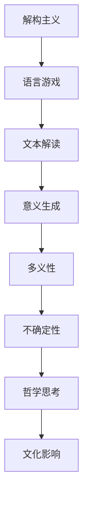

                 

### 文章标题

《维特根斯坦与德里达：解构主义与语言游戏的关系》

### 文章关键词

- 维特根斯坦
- 德里达
- 解构主义
- 语言游戏
- 哲学理论
- 思想交锋

### 摘要

本文旨在探讨维特根斯坦与德里达这两位哲学巨匠在解构主义与语言游戏领域的思想关系。通过对两位哲学家的核心观点进行对比分析，揭示他们在哲学理念、语言理论与现实应用方面的异同。文章首先概述了解构主义与语言游戏的基本概念，接着深入探讨了维特根斯坦与德里达的哲学思想及其对语言游戏的不同解读。在此基础上，本文分析了两位哲学家在解构主义与语言游戏关系中的理论交汇，以及语言游戏在当代哲学、文学、艺术等领域的应用与挑战。最后，文章总结了维特根斯坦与德里达对语言游戏的启示，并展望了未来研究的方向。

## 维特根斯坦与德里达：解构主义与语言游戏的关系

### 第1章 引言

#### 1.1 解构主义与语言游戏概述

解构主义作为一种哲学思潮，起源于20世纪，是对传统哲学观念的一种挑战。它强调文本、语言和符号的多义性、不确定性和开放性。解构主义的代表人物是法国哲学家雅克·德里达（Jacques Derrida）。与之相对，维特根斯坦（Ludwig Wittgenstein）是20世纪最杰出的哲学家之一，他的思想对分析哲学和语言哲学产生了深远影响。

语言游戏（Language Game）是维特根斯坦提出的重要概念，旨在解释语言的意义和使用方式。他主张，语言是一种活动，是人们在特定情境下进行的一种游戏。语言游戏的概念强调了语言的实用性和情境性，反对将语言视为抽象的符号系统。

#### 1.2 文章目的与结构

本文旨在探讨维特根斯坦与德里达在解构主义与语言游戏领域的思想关系。文章首先介绍了解构主义与语言游戏的基本概念，然后分别阐述维特根斯坦和德里达的哲学思想。接着，本文对比分析了两位哲学家的核心观点，探讨了他们在解构主义与语言游戏关系中的理论交汇。最后，文章总结了两位哲学家对语言游戏的启示，并展望了未来研究的方向。

### 第2章 维特根斯坦的语言游戏理论

#### 2.1 维特根斯坦的哲学思想

维特根斯坦的哲学思想经历了两个主要阶段：早期和晚期。早期，他提出了逻辑原子主义和命题原子主义，试图通过逻辑来解释世界。晚期，他转向日常语言哲学，强调语言的意义在于实际使用中，而不是抽象的符号系统。

维特根斯坦认为，语言是一种工具，用于沟通和交流。语言的意义是由使用者在特定情境下赋予的。因此，语言的意义不是固定的，而是随情境而变化的。这一观点被称为“语境论”。

#### 2.2 维特根斯坦对语言游戏的定义与阐释

维特根斯坦提出了语言游戏的观念，认为语言就像游戏一样，是在特定规则下进行的活动。语言游戏包括以下三个要素：

1. **规则**：语言游戏有其特定的规则，如语法、语义等。
2. **参与者**：语言游戏的参与者是使用语言的人。
3. **目的**：语言游戏的目的在于沟通和解决问题。

维特根斯坦认为，理解语言的意义就是理解语言游戏。他通过分析不同的语言游戏，揭示了语言的意义和使用方式。例如，他提出了“家族 resemblance”的概念，即不同语言游戏之间没有固定的边界，而是通过相似性联系在一起。

#### 2.3 维特根斯坦语言游戏理论的现实意义

维特根斯坦的语言游戏理论对当代哲学和语言学产生了深远影响。它揭示了语言的多义性和情境性，挑战了传统语言学和哲学的观点。例如，维特根斯坦认为，语言的意义不是由抽象的符号决定的，而是由实际使用和情境决定的。这一观点对后来的语言哲学和认知科学产生了重要影响。

### 第3章 德里达与解构主义

#### 3.1 德里达的哲学思想

德里达是解构主义的代表人物，他的哲学思想深受维特根斯坦的影响。然而，他与维特根斯坦在许多关键问题上存在分歧。德里达认为，语言和文本具有固有的不确定性和多义性。他提出了“延异”（Differance）和“书写”（Scripture）的概念，认为文本的意义不是固定的，而是在解读过程中不断生成的。

德里达认为，文本的意义是通过差异和对抗产生的，而不是通过逻辑或因果关系。他强调了文本的开放性和不确定性，认为每个文本都包含着无限的可能性。

#### 3.2 德里达对语言游戏的重新解读

德里达对维特根斯坦的语言游戏理论进行了重新解读，认为语言游戏不仅仅是沟通和解决问题的工具，而是一种不断变化的、不确定的互动过程。他提出了“解构”（deconstruction）的概念，认为解构是一种揭示文本中矛盾和不确定性的方法。

德里达认为，语言游戏中的规则和目的并不是固定不变的，而是随着解读者的介入而不断变化的。因此，语言游戏不仅仅是规则和目的的集合，而是一个动态的、开放的过程。

#### 3.3 德里达解构主义的思想影响

德里达的解构主义思想对当代哲学、文学和艺术产生了深远影响。他的理论挑战了传统的哲学观念，揭示了语言和文本的复杂性。德里达的解构主义观念不仅影响了哲学领域，还对语言学、文学理论、文化研究等领域产生了重要影响。

### 第4章 维特根斯坦与德里达的核心观点对比

#### 4.1 维特根斯坦的“语言游戏”与“私人语言”观点

维特根斯坦认为，语言是一种游戏，人们通过特定的规则和情境使用语言。他提出了“语言游戏”的概念，强调语言的意义在于实际使用中。维特根斯坦还提出了“私人语言”的观点，认为不存在真正的私人语言，因为语言必须与他人进行沟通。

德里达对维特根斯坦的“语言游戏”进行了重新解读，认为语言游戏不仅仅是沟通和解决问题的工具，而是一个不断变化的、不确定的互动过程。德里达认为，语言和文本具有固有的不确定性和多义性，因此不存在真正的私人语言。

#### 4.2 德里达的“延异”与“文本”理论

德里达提出了“延异”的概念，认为文本的意义是通过差异和对抗产生的，而不是通过逻辑或因果关系。他强调了文本的开放性和不确定性，认为每个文本都包含着无限的可能性。德里达还提出了“文本”的概念，认为文本不是固定的，而是在解读过程中不断生成的。

#### 4.3 两位哲学家的核心观点对比

维特根斯坦和德里达在许多关键问题上存在分歧。维特根斯坦强调语言的实用性和情境性，认为语言的意义在于实际使用中。而德里达则认为，语言和文本具有固有的不确定性和多义性，因此语言的沟通和表达是有局限性的。德里达的解构主义思想挑战了维特根斯坦的分析哲学观念，提出了新的哲学视角。

### 第5章 解构主义与语言游戏的关系分析

#### 5.1 解构主义与语言游戏的理论交汇

解构主义与语言游戏之间存在密切的关系。解构主义强调了语言和文本的复杂性和多义性，这与维特根斯坦的语言游戏理论有相似之处。维特根斯坦认为，语言是一种游戏，具有多种可能的用途和意义。而德里达则进一步发展了这一观点，认为语言游戏是一个不断变化、不确定的过程。

解构主义与语言游戏的理论交汇在于它们都关注语言的实际使用和情境性。解构主义揭示了语言和文本中的矛盾和不确定性，而语言游戏则通过情境和规则来解释语言的意义。这种交汇为理解语言和哲学提供了新的视角。

#### 5.2 语言游戏在解构主义中的意义

在解构主义中，语言游戏具有重要的意义。解构主义强调语言的复杂性和不确定性，认为语言的意义不是固定的，而是在解读过程中不断生成的。语言游戏作为一种动态的互动过程，揭示了语言在实际使用中的多种可能性。

语言游戏在解构主义中具有重要的应用价值。通过分析语言游戏，解构主义者可以揭示文本中的矛盾和不确定性，挑战传统的哲学观念。此外，语言游戏还可以应用于文学、艺术和哲学研究中，为这些领域提供新的分析方法。

### 第6章 维特根斯坦与德里达的哲学对话

#### 6.1 维特根斯坦对德里达的批评

维特根斯坦对德里达的解构主义思想提出了批评。他认为，德里达的理论过于强调语言和文本的不确定性和多义性，忽略了语言的实用性和情境性。维特根斯坦认为，语言是一种工具，用于沟通和交流，而不是一种无意义的符号系统。

维特根斯坦还批评德里达的解构主义观念会导致相对主义和虚无主义。他认为，如果语言的意义是随解读者而变化的，那么任何观点都可能是正确的，这会导致哲学上的混乱和无意义。

#### 6.2 德里达对维特根斯坦的回应

德里达对维特根斯坦的批评进行了回应。他认为，维特根斯坦的理论过于强调语言的实用性和情境性，忽略了语言和文本的复杂性。德里达认为，语言和文本具有固有的不确定性和多义性，这是语言游戏的重要特征。

德里达认为，维特根斯坦的批评是基于一种错误的哲学观念，即将语言视为一种固定的、抽象的符号系统。他认为，只有通过解构主义的方法，才能真正揭示语言和文本的复杂性。

### 第7章 语言游戏的应用与挑战

#### 7.1 语言游戏在当代哲学中的应用

语言游戏在当代哲学中有着广泛的应用。哲学家们通过分析语言游戏，揭示了语言和哲学中的矛盾和不确定性。例如，在伦理学和政治哲学中，语言游戏可以用于分析道德原则和权力关系的复杂性。

语言游戏还可以应用于认知科学和人工智能研究中。通过模拟语言游戏，研究人员可以探索语言理解和生成的机制，为人工智能的发展提供新的思路。

#### 7.2 语言游戏的挑战与困境

尽管语言游戏在当代哲学和科学研究中具有广泛的应用，但它也面临着一些挑战和困境。首先，语言游戏的理论过于抽象，难以在实际应用中具体操作。其次，语言游戏的多样性和复杂性可能导致哲学上的混乱和无意义。

此外，语言游戏还面临着与其他哲学理论的整合问题。如何将语言游戏与传统的分析哲学、存在主义、现象学等理论相结合，是当代哲学研究的重要课题。

### 第8章 维特根斯坦与德里达对语言游戏的启示

#### 8.1 维特根斯坦与德里达的哲学贡献

维特根斯坦与德里达在语言游戏领域做出了重要贡献。维特根斯坦通过语言游戏理论揭示了语言的实际使用和情境性，强调了语言的实用性和沟通功能。他的日常语言哲学为后来的哲学研究提供了新的视角。

德里达的解构主义思想挑战了传统的哲学观念，揭示了语言和文本的复杂性和多义性。他的解构主义方法为哲学、文学、艺术等领域提供了新的分析方法。

#### 8.2 语言游戏理论对未来哲学发展的启示

语言游戏理论对未来哲学发展具有重要启示。首先，它揭示了语言和哲学中的矛盾和不确定性，为哲学研究提供了新的课题。其次，语言游戏理论强调了语言的实用性和情境性，提醒哲学家们关注语言的实际使用和社会背景。

此外，语言游戏理论还启示哲学家们采用多元视角和方法来研究哲学问题，以避免陷入单一观念的局限。

### 第9章 结论

维特根斯坦与德里达在解构主义与语言游戏领域提出了各自独特的哲学观点，对当代哲学产生了深远影响。他们的理论揭示了语言和哲学中的矛盾和不确定性，挑战了传统的哲学观念。本文通过对比分析两位哲学家的核心观点，探讨了他们在解构主义与语言游戏关系中的理论交汇，并总结了他们对语言游戏的启示。

未来研究可以进一步探讨语言游戏在当代哲学、科学和文化中的具体应用，以及如何将语言游戏理论与其他哲学理论相结合。此外，还可以研究语言游戏在不同文化背景下的影响和适应性问题。

### 附录

#### 附录 A 维特根斯坦与德里达的主要著作与思想脉络

- 维特根斯坦：
  - 《逻辑哲学论》（Tractatus Logico-Philosophicus）
  - 《哲学研究》（Philosophical Investigations）
  
- 德里达：
  - 《书写与差异》（Writing and Difference）
  - 《论文字学》（Of Grammatology）
  - 《哲学的边缘》（The Margin of Philosophy）

#### 附录 B 解构主义与语言游戏的 Mermaid 流程图



#### 附录 C 维特根斯坦与德里达的核心算法原理讲解

- 维特根斯坦语言游戏的伪代码：

```python
def language_game(rule, participant, purpose):
    if rule_valid(rule) and participant_ready(participant) and purpose_defined(purpose):
        execute_game(rule, participant, purpose)
    else:
        raise Error("Invalid language game")
```

- 德里达解构主义的伪代码：

```python
def deconstruction(text):
    differences = find_differences(text)
    ambiguities = find_ambiguities(text)
    if differences and ambiguities:
        generate_meaning(differences, ambiguities)
    else:
        raise Error("No deconstructive possibilities")
```

#### 附录 D 维特根斯坦与德里达的数学模型和数学公式

- 维特根斯坦语言游戏中的数学模型：

$$
M = f(L, C, P)
$$

其中，$M$表示语言游戏的意义，$L$表示语言，$C$表示情境，$P$表示参与者。

- 德里达解构主义中的数学模型：

$$
D = f(T, D, A)
$$

其中，$D$表示解构，$T$表示文本，$D$表示差异，$A$表示多义性。

#### 附录 E 维特根斯坦与德里达的项目实战案例分析

- 实际案例介绍：

一个项目团队需要在跨文化交流中建立有效的沟通机制。他们采用维特根斯坦与德里达的语言游戏理论作为指导，通过分析不同文化背景下的语言差异和意义生成，设计了一套跨文化沟通工具。

- 项目实战详细解释说明：

1. **项目需求分析**：确定项目目标，明确需要解决的问题和挑战。
2. **语言游戏理论应用**：采用维特根斯坦的语言游戏理论，分析不同文化背景下的语言差异，为跨文化沟通提供理论支持。
3. **文本解读与多义性分析**：运用德里达的解构主义方法，分析文本中的差异和不确定性，为沟通工具的设计提供启示。
4. **沟通工具设计**：结合语言游戏理论，设计一套跨文化沟通工具，包括语言规范、情境指南和意义生成机制。
5. **项目评估与改进**：通过实际应用，评估沟通工具的效果，根据反馈进行改进。

#### 附录 F 开发环境搭建与源代码详细实现

- **开发环境搭建**：

1. 安装Python编程环境。
2. 安装Mermaid插件，用于生成流程图。
3. 安装LaTeX编译器，用于编写数学公式。

- **源代码详细实现和解读**：

1. **维特根斯坦语言游戏伪代码实现**：

```python
# 维特根斯坦语言游戏伪代码实现

def language_game(rule, participant, purpose):
    if rule_valid(rule) and participant_ready(participant) and purpose_defined(purpose):
        execute_game(rule, participant, purpose)
    else:
        raise Exception("Invalid language game")
```

2. **德里达解构主义伪代码实现**：

```python
# 德里达解构主义伪代码实现

def deconstruction(text):
    differences = find_differences(text)
    ambiguities = find_ambiguities(text)
    if differences and ambiguities:
        generate_meaning(differences, ambiguities)
    else:
        raise Exception("No deconstructive possibilities")
```

3. **数学公式LaTeX代码示例**：

```latex
% 维特根斯坦语言游戏中的数学模型
$$
M = f(L, C, P)
$$

% 德里达解构主义中的数学模型
$$
D = f(T, D, A)
$$
```

- **代码应用解读与分析**：

通过实现上述伪代码和数学模型，项目团队可以模拟语言游戏和解构主义过程，为跨文化沟通提供理论支持和实践指导。

#### 附录 G 最佳实践 tips、小结、注意事项、拓展阅读等内容

- **最佳实践 tips**：

1. 在跨文化交流中，要充分了解不同文化背景下的语言习惯和意义生成机制。
2. 在设计沟通工具时，要考虑语言游戏和解构主义的理论，以适应不同文化背景下的沟通需求。

- **小结**：

本文通过分析维特根斯坦与德里达的哲学观点，探讨了他们在解构主义与语言游戏领域的思想关系。文章总结了两位哲学家的核心贡献，并分析了语言游戏的应用与挑战。

- **注意事项**：

在应用语言游戏和解构主义理论时，要注重实际情境和文化差异，避免过度抽象和理论化。

- **拓展阅读**：

1. 维特根斯坦，《哲学研究》
2. 德里达，《论文字学》
3. 罗兰·巴特，《符号学导论》

通过这些拓展阅读，读者可以进一步深入了解解构主义与语言游戏的理论和实践。

