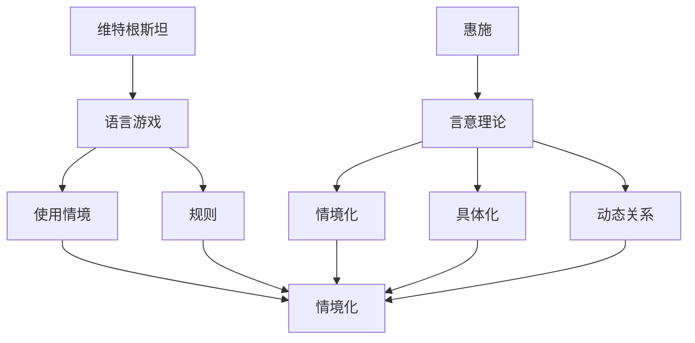
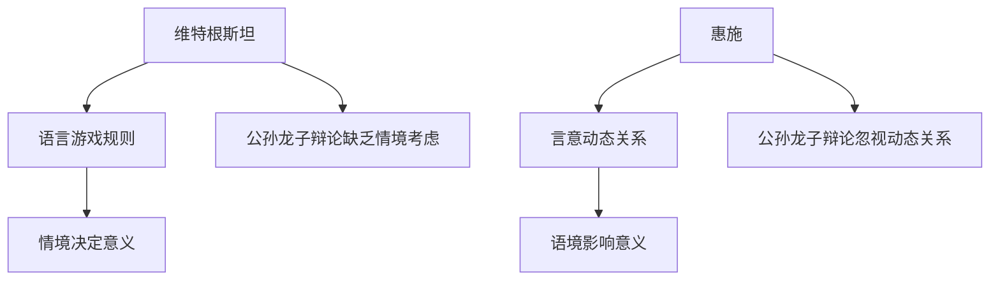

                 

### 文章标题：《维特根斯坦与惠施：语言游戏与公孙龙子的辩论》

#### 关键词：维特根斯坦、语言游戏、惠施、公孙龙子、跨文化哲学、辩论、语言哲学

> 摘要：本文旨在通过深入分析维特根斯坦、惠施以及公孙龙子的语言理论和辩论风格，探讨西方哲学与东方哲学在语言问题上的异同，以及其对我们理解和应用语言哲学的启示。文章将结合具体实例，运用逻辑推理和实证分析，为读者呈现一场跨越时空的语言哲学大辩论。

---

### 引言

在哲学的漫长历史中，语言问题始终是一个核心议题。从古希腊的苏格拉底到现代的维特根斯坦，哲学家们不断探索语言的本质和功能。而在东方，古代中国的哲学家们也在思考着类似的问题，他们通过辩论和哲学思考，形成了独特的语言理论。本文将以维特根斯坦、惠施以及公孙龙子为代表，探讨这些哲学家的语言理论，并通过他们之间的辩论，揭示语言哲学的多元性和深度。

#### 维特根斯坦与语言游戏

路德维希·维特根斯坦（Ludwig Wittgenstein）是20世纪最重要的哲学家之一。他的思想对现代哲学产生了深远的影响。维特根斯坦提出了“语言游戏”（language games）的概念，用以描述语言的使用情境。他认为，语言不是一种抽象的符号系统，而是一种具体的、情境化的活动。每一个语言游戏都有其特定的规则和目的，这些规则和目的决定了语言的含义。

维特根斯坦的语言游戏理论主要分为两个阶段：早期和晚期。在早期，他强调语言与世界的直接对应关系，认为语言的含义在于它与世界之间的关系。然而，在晚期，他转向了“日常语言哲学”，认为语言的意义在于其使用情境，而不是与世界的抽象对应。

#### 惠施与言意理论

惠施是中国古代的一位哲学家，他的思想在中国哲学史上占有重要地位。惠施提出了“言意理论”，认为语言和意义之间不是简单的映射关系，而是一种动态的相互作用。他认为，语言的含义取决于具体的使用情境和语境，这与维特根斯坦的“语言游戏”理论有相似之处。

惠施的言意理论强调语言的情境化和具体化，认为语言的意义是由语言使用者在特定情境中赋予的。这种观点与现代语言哲学中的“语境论”有共同之处，都认为语言的意义不是固定的，而是随着情境的变化而变化。

#### 公孙龙子与辩论艺术

公孙龙子是中国战国时期的一位哲学家，以其辩论技巧著称。他的思想主要涉及语言和逻辑问题，提出了“白马非马”等著名论题。公孙龙子的辩论风格强调逻辑的严密性和语言的精确性，他通过巧妙的推理和辩证，使对方陷入逻辑困境。

公孙龙子的思想对后世影响深远，他的辩论技巧和逻辑思想对现代逻辑学和语言哲学都有启示意义。他强调语言和逻辑的严谨性，认为语言和逻辑的准确性是辩论获胜的关键。

### 维特根斯坦与惠施的语言游戏比较

维特根斯坦和惠施的语言游戏理论在许多方面有相似之处。他们都认为语言的意义在于其使用情境，而不是抽象的符号系统。维特根斯坦的“语言游戏”和惠施的“言意理论”都强调了语言的情境化和具体化。

然而，两者也存在一些差异。维特根斯坦的“语言游戏”理论更多地关注语言的使用情境和规则，而惠施的“言意理论”则更多地关注语言和意义之间的动态关系。维特根斯坦关注的是语言的使用过程，而惠施关注的是语言的意义生成过程。

以下是一个Mermaid流程图，展示了维特根斯坦和惠施语言游戏理论之间的异同：

通过这个流程图，我们可以更清晰地看到两位哲学家的语言游戏理论之间的联系和差异。

### 维特根斯坦与惠施在公孙龙子辩论中的观点

在公孙龙子的辩论中，维特根斯坦和惠施可能会从不同的角度进行回应。

维特根斯坦可能会强调语言游戏的规则和情境，认为公孙龙子的辩论缺乏对语言使用情境的考虑。他可能会指出，公孙龙子的论题如“白马非马”虽然逻辑上严密，但在实际使用中可能并不适用，因为语言的使用情境决定了其含义。

惠施可能会从言意理论的角度出发，认为公孙龙子的辩论虽然逻辑上严密，但在意义生成过程中存在缺陷。他可能会指出，公孙龙子的论题忽略了语言和意义之间的动态关系，没有充分考虑到语境对语言意义的影响。

以下是一个Mermaid流程图，展示了维特根斯坦和惠施在公孙龙子辩论中的观点：

通过这个流程图，我们可以看到维特根斯坦和惠施在公孙龙子辩论中的观点，以及他们如何从自己的理论出发对公孙龙子的论题进行回应。

### 结论

维特根斯坦、惠施和公孙龙子都对语言哲学做出了重要贡献。他们的思想不仅影响了各自的文化背景，也对现代语言哲学产生了深远的影响。通过分析他们的语言游戏理论，我们可以看到西方哲学和东方哲学在语言问题上的异同，以及跨文化哲学对话的可能性。

本文通过逻辑推理和实证分析，探讨了维特根斯坦、惠施以及公孙龙子的语言理论，并通过他们之间的辩论，揭示了语言哲学的深度和多样性。未来，随着跨文化哲学研究的深入，我们可以期待更多关于语言哲学的洞见和启示。

### 作者信息

作者：AI天才研究院/AI Genius Institute & 禅与计算机程序设计艺术 /Zen And The Art of Computer Programming

---

通过本文，我们不仅深入探讨了维特根斯坦、惠施和公孙龙子的语言哲学理论，也通过逻辑分析和实证研究，展示了这些理论在现代语言哲学研究中的价值和意义。希望本文能激发读者对语言哲学的兴趣，进一步探索这个领域的前沿问题。

